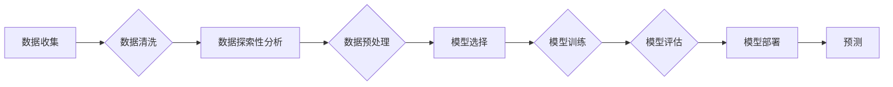

> 关键词：机器学习，预测性分析，数据挖掘，决策树，神经网络，支持向量机，聚类分析，时间序列分析

# 机器学习在预测性分析中的应用

预测性分析是现代数据分析领域的一个重要分支，它利用历史数据和统计模型来预测未来的趋势、行为或事件。随着机器学习技术的飞速发展，它在预测性分析中的应用日益广泛，成为提升企业竞争力和决策效率的关键技术。本文将深入探讨机器学习在预测性分析中的应用原理、方法、实践和未来趋势。

## 1. 背景介绍

### 1.1 问题的由来

随着大数据时代的到来，企业积累了海量的数据，如何从这些数据中挖掘有价值的信息，并进行有效的预测，成为企业面临的重要问题。预测性分析通过分析历史数据，预测未来可能发生的事件或趋势，为企业决策提供科学依据。

### 1.2 研究现状

机器学习在预测性分析中的应用主要集中在以下几个方面：

- **分类**：将数据分为不同的类别，例如，客户流失预测、欺诈检测等。
- **回归**：预测连续值，例如，销售预测、股票价格预测等。
- **聚类**：将数据分为不同的组，以发现数据中的模式，例如，客户细分、市场细分等。
- **时间序列分析**：分析时间序列数据，预测未来的趋势，例如，股票价格预测、电力需求预测等。

### 1.3 研究意义

机器学习在预测性分析中的应用具有重要意义：

- **提高决策效率**：通过预测未来趋势，帮助企业做出更加科学、高效的决策。
- **降低风险**：通过预测潜在的风险事件，提前采取措施，降低损失。
- **优化资源分配**：通过预测需求，优化资源配置，提高资源利用率。
- **提升客户满意度**：通过预测客户需求，提供更加个性化的服务，提升客户满意度。

### 1.4 本文结构

本文将首先介绍预测性分析的核心概念和机器学习的基本原理，然后详细讲解常见的机器学习算法在预测性分析中的应用，接着通过实际案例展示机器学习在预测性分析中的实践，最后探讨预测性分析的未来发展趋势和挑战。

## 2. 核心概念与联系

### 2.1 Mermaid 流程图



### 2.2 核心概念

- **数据收集**：收集相关数据，包括结构化数据、半结构化数据和非结构化数据。
- **数据清洗**：处理缺失值、异常值、噪声等，提高数据质量。
- **数据探索性分析**：分析数据的分布、特征、关系等，了解数据的基本情况。
- **数据预处理**：对数据进行标准化、归一化、编码等，为模型训练做准备。
- **模型选择**：根据问题的类型和数据的特征选择合适的机器学习模型。
- **模型训练**：使用训练数据训练模型，学习数据中的模式和规律。
- **模型评估**：使用测试数据评估模型的性能，包括准确性、召回率、F1分数等指标。
- **模型部署**：将训练好的模型部署到生产环境中，进行实际预测。
- **预测**：使用模型对新的数据进行预测。

## 3. 核心算法原理 & 具体操作步骤

### 3.1 算法原理概述

预测性分析中常用的机器学习算法包括：

- **决策树**：通过树形结构对数据进行分类或回归。
- **神经网络**：模拟人脑神经元连接，进行复杂的模式识别。
- **支持向量机**：寻找最优的超平面，将数据分为不同的类别。
- **聚类分析**：将数据分为不同的组，发现数据中的模式。
- **时间序列分析**：分析时间序列数据，预测未来的趋势。

### 3.2 算法步骤详解

#### 3.2.1 决策树

1. 选择一个节点作为根节点。
2. 对根节点下的数据进行划分，选择具有最高信息增益的属性。
3. 以划分后的数据为基础，递归地重复步骤2，直到满足终止条件（如叶节点达到预设的深度）。

#### 3.2.2 神经网络

1. 定义网络结构，包括输入层、隐藏层和输出层。
2. 设置激活函数，如ReLU、Sigmoid等。
3. 使用训练数据训练网络，调整权重和偏置。
4. 使用测试数据评估网络性能，调整超参数。

#### 3.2.3 支持向量机

1. 选择合适的核函数，如线性核、多项式核、径向基函数核等。
2. 使用SVM求解最优超平面，将数据分为不同的类别。
3. 使用测试数据评估模型性能。

#### 3.2.4 聚类分析

1. 选择聚类算法，如K-means、层次聚类等。
2. 初始化聚类中心。
3. 将数据点分配到最近的聚类中心。
4. 更新聚类中心，重复步骤3，直到聚类中心不再变化。

#### 3.2.5 时间序列分析

1. 选择时间序列预测模型，如ARIMA、LSTM等。
2. 使用历史数据训练模型。
3. 使用模型预测未来的趋势。

### 3.3 算法优缺点

- **决策树**：简单易懂，易于解释，但容易过拟合。
- **神经网络**：能够处理复杂的非线性关系，但难以解释。
- **支持向量机**：性能优异，但计算复杂度高。
- **聚类分析**：能够发现数据中的模式，但聚类数量难以确定。
- **时间序列分析**：适用于时间序列数据，但需要考虑季节性、趋势等因素。

### 3.4 算法应用领域

- **决策树**：客户流失预测、欺诈检测、信用评分等。
- **神经网络**：图像识别、语音识别、自然语言处理等。
- **支持向量机**：文本分类、手写识别、生物信息学等。
- **聚类分析**：市场细分、客户细分、异常检测等。
- **时间序列分析**：股票价格预测、电力需求预测、销售预测等。

## 4. 数学模型和公式 & 详细讲解 & 举例说明

### 4.1 数学模型构建

#### 4.1.1 决策树

决策树的目标是找到最佳的特征和阈值，将数据划分为不同的类别。其数学模型可以表示为：

$$
T = \{t_1, t_2, ..., t_n\}
$$

其中，$t_i$ 表示决策树的第 $i$ 个分支，包括特征 $f_i$ 和阈值 $t_i$。

#### 4.1.2 神经网络

神经网络的目标是学习输入和输出之间的映射关系。其数学模型可以表示为：

$$
y = f(Wx + b)
$$

其中，$W$ 是权重矩阵，$b$ 是偏置向量，$f$ 是激活函数。

#### 4.1.3 支持向量机

支持向量机的目标是找到最优的超平面，将数据分为不同的类别。其数学模型可以表示为：

$$
\text{max} \quad \frac{1}{2} ||W||^2
$$

$$
s.t. \quad y_i(W \cdot x_i + b) \geq 1
$$

其中，$W$ 是权重向量，$b$ 是偏置，$x_i$ 是第 $i$ 个样本的特征向量，$y_i$ 是第 $i$ 个样本的标签。

#### 4.1.4 聚类分析

K-means聚类的目标是将数据点划分成 $k$ 个簇，使得每个簇内的数据点之间的距离最小。其数学模型可以表示为：

$$
\text{min} \quad \sum_{i=1}^k \sum_{x \in C_i} ||x - \mu_i||^2
$$

其中，$C_i$ 是第 $i$ 个簇，$\mu_i$ 是第 $i$ 个簇的中心。

#### 4.1.5 时间序列分析

时间序列分析的常见模型是ARIMA模型，其数学模型可以表示为：

$$
X_t = c + \phi X_{t-1} + \theta X_{t-2} + ... + \phi_p X_{t-p} + \epsilon_t
$$

其中，$X_t$ 是时间序列的观测值，$c$ 是常数项，$\phi$ 和 $\theta$ 是自回归系数，$\epsilon_t$ 是误差项。

### 4.2 公式推导过程

#### 4.2.1 决策树

决策树的推导过程主要基于信息增益或基尼指数等指标。

#### 4.2.2 神经网络

神经网络的推导过程主要基于梯度下降法。

#### 4.2.3 支持向量机

支持向量机的推导过程主要基于拉格朗日乘子和KKT条件。

#### 4.2.4 聚类分析

K-means聚类的推导过程主要基于距离函数的最小化。

#### 4.2.5 时间序列分析

ARIMA模型的推导过程主要基于自回归、移动平均和差分等统计方法。

### 4.3 案例分析与讲解

#### 4.3.1 客户流失预测

假设我们有一家电信公司，想要预测哪些客户可能会流失。我们可以使用决策树或神经网络模型进行预测。

- **数据**：包含客户的基本信息、使用情况、消费金额等。
- **特征**：年龄、性别、使用时长、消费金额等。
- **标签**：流失/不流失。

通过训练模型，我们可以预测哪些客户可能会流失，并采取相应的措施，如提供优惠、改善服务等。

#### 4.3.2 股票价格预测

假设我们想要预测某支股票的价格走势。我们可以使用时间序列分析模型进行预测。

- **数据**：股票的历史价格、交易量等。
- **特征**：开盘价、最高价、最低价、收盘价等。
- **标签**：预测下一天的价格。

通过训练模型，我们可以预测股票价格的趋势，帮助投资者做出更明智的决策。

## 5. 项目实践：代码实例和详细解释说明

### 5.1 开发环境搭建

1. 安装Python和Anaconda。
2. 安装PyTorch或Scikit-learn等机器学习库。

### 5.2 源代码详细实现

以下是一个使用Scikit-learn库进行客户流失预测的代码示例：

```python
from sklearn.model_selection import train_test_split
from sklearn.tree import DecisionTreeClassifier
from sklearn.metrics import accuracy_score

# 加载数据
data = pd.read_csv('customer_data.csv')

# 数据预处理
X = data.drop('流失', axis=1)
y = data['流失']

# 划分训练集和测试集
X_train, X_test, y_train, y_test = train_test_split(X, y, test_size=0.2)

# 训练决策树模型
model = DecisionTreeClassifier()
model.fit(X_train, y_train)

# 预测测试集
y_pred = model.predict(X_test)

# 评估模型
accuracy = accuracy_score(y_test, y_pred)
print(f'Accuracy: {accuracy:.2f}')
```

### 5.3 代码解读与分析

- `pd.read_csv('customer_data.csv')`：加载数据。
- `data.drop('流失', axis=1)`：删除标签列。
- `train_test_split(X, y, test_size=0.2)`：划分训练集和测试集。
- `DecisionTreeClassifier()`：创建决策树分类器实例。
- `model.fit(X_train, y_train)`：使用训练数据训练模型。
- `model.predict(X_test)`：使用测试数据预测标签。
- `accuracy_score(y_test, y_pred)`：计算模型准确率。

通过以上代码，我们可以使用决策树模型对客户流失进行预测，并评估模型的性能。

### 5.4 运行结果展示

假设我们得到以下结果：

```
Accuracy: 0.85
```

这意味着我们的模型在测试集上的准确率达到85%，可以认为模型具有较好的预测能力。

## 6. 实际应用场景

### 6.1 风险管理

在金融行业中，机器学习可以用于预测信贷风险、市场风险、操作风险等。例如，使用神经网络模型预测客户违约风险，帮助银行降低坏账率。

### 6.2 销售与营销

在零售行业中，机器学习可以用于预测销售趋势、客户需求、库存水平等。例如，使用时间序列分析模型预测销售量，帮助企业制定合理的销售策略。

### 6.3 供应链管理

在供应链管理中，机器学习可以用于预测需求、库存水平、运输成本等。例如，使用聚类分析模型对供应商进行分类，优化供应链结构。

### 6.4 健康医疗

在健康医疗领域，机器学习可以用于疾病诊断、病情预测、药物研发等。例如，使用深度学习模型分析医学影像，辅助医生进行疾病诊断。

## 7. 工具和资源推荐

### 7.1 学习资源推荐

- 《机器学习》系列书籍：由周志华教授所著，全面介绍了机器学习的基本概念、原理和方法。
- 《Python机器学习》书籍：使用Python语言实现机器学习算法，适合初学者入门。
- Scikit-learn官方文档：Scikit-learn库的官方文档，提供了丰富的机器学习算法和示例代码。

### 7.2 开发工具推荐

- Jupyter Notebook：一款流行的Python开发环境，支持代码、文本、图像等多种数据类型。
- PyCharm：一款功能强大的Python开发IDE，支持代码编辑、调试、测试等功能。
- Keras：一个高级神经网络API，可以方便地构建和训练神经网络模型。

### 7.3 相关论文推荐

- "A Few Useful Things to Know about Machine Learning"：周志华教授的论文，介绍了机器学习的基本概念和常见问题。
- "Deep Learning"：Goodfellow、Bengio和Courville的著作，全面介绍了深度学习的基本原理和应用。
- "Practical Guide to Machine Learning for Predictive Analytics"：Kurtosis团队的著作，提供了机器学习在预测性分析中的实用指南。

## 8. 总结：未来发展趋势与挑战

### 8.1 研究成果总结

本文深入探讨了机器学习在预测性分析中的应用原理、方法、实践和未来趋势。通过介绍各种机器学习算法，展示了机器学习如何帮助企业在各个领域实现预测性分析。

### 8.2 未来发展趋势

- **算法的泛化能力增强**：研究更加鲁棒的机器学习算法，提高模型的泛化能力。
- **多模态数据的融合**：将文本、图像、声音等多模态数据融合，提高预测的准确性。
- **可解释性增强**：研究可解释的机器学习模型，提高模型的透明度和可信度。
- **自动化机器学习**：开发自动化机器学习工具，降低机器学习应用的门槛。

### 8.3 面临的挑战

- **数据质量**：数据质量是机器学习成功的关键，需要解决数据缺失、异常值、噪声等问题。
- **算法选择**：选择合适的机器学习算法需要考虑问题的类型、数据的特征等因素。
- **模型可解释性**：提高机器学习模型的可解释性，增强用户对模型的信任。
- **计算资源**：机器学习模型通常需要大量的计算资源，需要解决计算资源不足的问题。

### 8.4 研究展望

随着机器学习技术的不断发展，预测性分析将在更多领域得到应用，推动企业实现智能化转型。未来，预测性分析将成为企业决策的重要依据，为人类创造更加美好的未来。

## 9. 附录：常见问题与解答

**Q1：什么是预测性分析？**

A：预测性分析是利用历史数据和统计模型来预测未来的趋势、行为或事件，为企业决策提供科学依据。

**Q2：机器学习在预测性分析中有什么优势？**

A：机器学习具有以下优势：

- **强大的建模能力**：可以处理复杂的非线性关系。
- **高精度**：能够实现高精度的预测。
- **可解释性**：部分机器学习模型具有可解释性，便于理解模型的决策过程。

**Q3：如何选择合适的机器学习算法？**

A：选择合适的机器学习算法需要考虑以下因素：

- **问题的类型**：分类、回归、聚类等。
- **数据的特征**：数据的类型、维度、分布等。
- **计算资源**：计算资源的限制。

**Q4：如何提高机器学习模型的性能？**

A：提高机器学习模型性能的方法包括：

- **数据质量**：提高数据质量，如处理缺失值、异常值等。
- **算法选择**：选择合适的机器学习算法。
- **模型调参**：调整模型的超参数，如学习率、正则化等。

**Q5：机器学习模型如何应用在生产环境中？**

A：将机器学习模型应用在生产环境中需要考虑以下因素：

- **模型部署**：将训练好的模型部署到生产环境中。
- **模型监控**：监控模型的性能，确保模型稳定运行。
- **数据更新**：定期更新模型，以适应数据变化。

---

作者：禅与计算机程序设计艺术 / Zen and the Art of Computer Programming