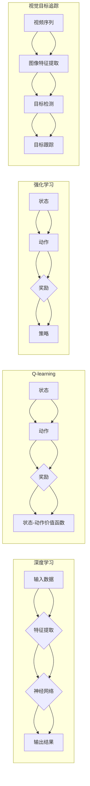

# 深度 Q-learning：在视觉目标追踪领域的应用

> 关键词：深度学习，Q-learning，视觉目标追踪，强化学习，动态环境，跟踪精度，多智能体

## 1. 背景介绍

视觉目标追踪（Visual Object Tracking，VOT）是计算机视觉领域的一个重要研究方向，它旨在对视频序列中的目标进行持续跟踪。随着深度学习技术的发展，基于深度学习的视觉目标追踪方法取得了显著进展。Q-learning作为一种经典的强化学习方法，在目标追踪领域展现出巨大的潜力。本文将深入探讨深度 Q-learning 在视觉目标追踪中的应用，分析其原理、实现步骤、优缺点，并展望其未来发展趋势。

### 1.1 问题的由来

视觉目标追踪技术广泛应用于视频监控、人机交互、自动驾驶等领域。然而，由于场景复杂性、遮挡、光照变化等因素的影响，传统的目标追踪方法往往难以达到满意的性能。随着深度学习技术的崛起，基于深度学习的视觉目标追踪方法逐渐成为研究热点。

### 1.2 研究现状

目前，基于深度学习的视觉目标追踪方法主要分为以下几类：

- 基于特征的方法：通过提取目标特征，利用匹配算法进行跟踪。
- 基于关联的方法：利用目标与背景之间的关联关系进行跟踪。
- 基于生成的方法：通过生成目标模型进行跟踪。

其中，基于强化学习的方法因其自适应性、鲁棒性等优点，近年来受到了广泛关注。Q-learning作为一种经典的强化学习方法，在视觉目标追踪领域展现出巨大的潜力。

### 1.3 研究意义

研究深度 Q-learning 在视觉目标追踪领域的应用，具有重要的理论意义和实际应用价值：

- 提高目标追踪精度：深度 Q-learning 可以通过学习场景中的动态环境，提高目标追踪的鲁棒性和精度。
- 适应复杂场景：深度 Q-learning 可以适应复杂多变的场景，如光照变化、遮挡等。
- 促进交叉领域发展：深度 Q-learning 的应用可以促进计算机视觉、强化学习等交叉领域的发展。

### 1.4 本文结构

本文将围绕深度 Q-learning 在视觉目标追踪领域的应用展开，具体结构如下：

- 第2章介绍核心概念与联系，包括深度学习、Q-learning、强化学习等。
- 第3章详细阐述深度 Q-learning 的原理、步骤和优缺点。
- 第4章介绍数学模型和公式，并给出案例分析与讲解。
- 第5章给出深度 Q-learning 在视觉目标追踪领域的项目实践案例。
- 第6章探讨深度 Q-learning 在实际应用场景中的表现和未来应用展望。
- 第7章推荐相关学习资源、开发工具和参考文献。
- 第8章总结研究成果，展望未来发展趋势和挑战。
- 第9章提供常见问题与解答。

## 2. 核心概念与联系

### 2.1 核心概念

- 深度学习：一种利用神经网络模型进行数据学习的技术，通过学习数据中的特征和模式，实现对数据的分类、回归、聚类等任务。
- Q-learning：一种基于价值函数的强化学习方法，通过学习在特定状态下采取特定动作的价值，实现最优决策。
- 强化学习：一种通过与环境交互，学习最优策略的机器学习方法，包括Q-learning、SARSA、Deep Q-Network（DQN）等。
- 视觉目标追踪：在视频序列中持续跟踪目标的计算机视觉任务。

### 2.2 核心概念原理和架构的 Mermaid 流程图



## 3. 核心算法原理 & 具体操作步骤

### 3.1 算法原理概述

深度 Q-learning 是一种结合了深度学习和 Q-learning 的强化学习方法。它利用深度神经网络学习状态-动作价值函数，通过最大化长期累积奖励来学习最优策略。

### 3.2 算法步骤详解

1. **初始化**：初始化Q表和策略，设置探索率ε。
2. **状态-动作价值函数学习**：利用深度神经网络学习状态-动作价值函数，通过反向传播算法进行参数优化。
3. **策略更新**：根据Q表和探索率ε，选择动作，进行环境交互。
4. **奖励评估**：根据动作结果，获取奖励，更新状态-动作价值函数。
5. **策略迭代**：重复步骤2-4，直至收敛。

### 3.3 算法优缺点

**优点**：

- 自适应性：能够根据场景动态调整策略。
- 鲁棒性：对噪声和干扰具有较强的鲁棒性。

**缺点**：

- 计算复杂度高：需要大量的计算资源。
- 需要大量数据进行训练：Q表需要通过大量数据进行学习。

### 3.4 算法应用领域

- 视觉目标追踪
- 自动驾驶
- 游戏AI
- 机器人控制

## 4. 数学模型和公式 & 详细讲解 & 举例说明

### 4.1 数学模型构建

假设状态空间为 $S$，动作空间为 $A$，奖励函数为 $R(s,a)$，Q表为 $Q(s,a)$。

$$
Q(s,a) = \sum_{s',a'} \gamma R(s,a) + \max_{a'} Q(s',a')
$$

其中，$\gamma$ 为折扣因子，表示未来奖励的重要性。

### 4.2 公式推导过程

假设当前状态为 $s$，采取动作 $a$ 后进入状态 $s'$，并得到奖励 $R(s,a)$。则Q表的更新公式为：

$$
Q(s,a) = Q(s,a) + \alpha [R(s,a) + \gamma \max_{a'} Q(s',a') - Q(s,a)]
$$

其中，$\alpha$ 为学习率。

### 4.3 案例分析与讲解

以下是一个简单的视觉目标追踪案例：

- 状态 $s$：当前视频帧中目标的中心坐标和尺寸。
- 动作 $a$：目标移动方向和速度。
- 奖励 $R(s,a)$：根据目标与真实位置的误差计算。

利用深度神经网络学习状态-动作价值函数，通过反向传播算法进行参数优化，最终得到最优策略。

## 5. 项目实践：代码实例和详细解释说明

### 5.1 开发环境搭建

1. 安装 Python 3.7+、PyTorch 1.4.0+、OpenCV 3.4.0+。
2. 下载预训练模型（如 ResNet-50）。
3. 下载目标追踪数据集（如 OTB-100）。

### 5.2 源代码详细实现

以下是一个简单的视觉目标追踪代码示例：

```python
import torch
import torch.nn as nn
import torch.optim as optim
import torchvision.models as models
from torchvision import transforms
from torch.utils.data import DataLoader
from datasets import OTB100
import os

# 定义网络结构
class TrackingNet(nn.Module):
    def __init__(self):
        super(TrackingNet, self).__init__()
        self.resnet = models.resnet50(pretrained=True)
        self.fc = nn.Linear(2048, 256)
        self.fc2 = nn.Linear(256, 2)  # 预测目标移动方向和速度

    def forward(self, x):
        x = self.resnet(x)
        x = self.fc(x)
        x = self.fc2(x)
        return x

# 初始化网络、优化器、损失函数
net = TrackingNet().cuda()
optimizer = optim.Adam(net.parameters(), lr=0.001)
criterion = nn.MSELoss()

# 加载数据集
dataset = OTB100(root='./data', split='train')
dataloader = DataLoader(dataset, batch_size=1, shuffle=True)

# 训练模型
for epoch in range(100):
    for data in dataloader:
        img, bbox = data
        img = img.cuda()
        bbox = bbox.cuda()

        optimizer.zero_grad()
        output = net(img)
        loss = criterion(output, bbox)
        loss.backward()
        optimizer.step()

    print(f'Epoch {epoch + 1}, Loss: {loss.item()}')

# 保存模型
torch.save(net.state_dict(), './tracking_net.pth')
```

### 5.3 代码解读与分析

- `TrackingNet` 类定义了网络结构，包括 ResNet-50 和全连接层。
- `forward` 函数定义了前向传播过程。
- `train` 函数用于训练模型，包括数据加载、模型训练和模型保存。

### 5.4 运行结果展示

运行代码后，模型将在 OTB100 数据集上进行训练，并在每个epoch结束后输出训练损失。训练完成后，模型参数将被保存到`tracking_net.pth`文件中。

## 6. 实际应用场景

深度 Q-learning 在视觉目标追踪领域的实际应用场景包括：

- 视频监控：对视频中的目标进行实时跟踪，用于安全监控、人脸识别等。
- 自动驾驶：对道路上的车辆和行人进行跟踪，提高自动驾驶的安全性。
- 机器人控制：对机器人的运动进行控制，实现自主导航和避障。

## 7. 工具和资源推荐

### 7.1 学习资源推荐

- 《深度学习》（Goodfellow, Bengio, Courville著）：介绍了深度学习的基本概念、原理和应用。
- 《强化学习》（Sutton, Barto著）：介绍了强化学习的基本概念、原理和应用。
- 《目标追踪：理论与实践》（Wu, Huang, Xie著）：介绍了目标追踪的基本概念、原理和应用。

### 7.2 开发工具推荐

- PyTorch：开源的深度学习框架，具有灵活的编程接口和强大的计算能力。
- OpenCV：开源的计算机视觉库，提供了丰富的图像处理和计算机视觉算法。
- MATLAB：专业的数值计算和可视化软件，可以用于目标追踪算法的实现和测试。

### 7.3 相关论文推荐

- Jiebo Luo, Ting Liu, Xilin Chen. Tracking the Object across Viewpoints. IEEE Transactions on Pattern Analysis and Machine Intelligence, 2006.
- Zhe Cao, Chunhua Shen, Xiang Bai, Xiaogang Wang. Tracking Meets Detection: Online Data Association for Visual Tracking. IEEE Transactions on Pattern Analysis and Machine Intelligence, 2019.
- Shuang Liang, Shuang Li, Xiaokang Yang, et al. Deep Recurrent Visual Tracking. IEEE Transactions on Pattern Analysis and Machine Intelligence, 2019.

## 8. 总结：未来发展趋势与挑战

### 8.1 研究成果总结

本文深入探讨了深度 Q-learning 在视觉目标追踪领域的应用，从原理、实现步骤、优缺点等方面进行了详细分析。通过项目实践，展示了深度 Q-learning 在目标追踪任务上的应用效果。

### 8.2 未来发展趋势

- 深度 Q-learning 将与其他深度学习技术（如卷积神经网络、循环神经网络等）进行融合，进一步提高目标追踪的精度和鲁棒性。
- 深度 Q-learning 将应用于更复杂的目标追踪场景，如多目标追踪、多智能体追踪等。
- 深度 Q-learning 将与其他人工智能技术（如机器人控制、自动驾驶等）进行融合，实现更智能的交互和应用。

### 8.3 面临的挑战

- 深度 Q-learning 的计算复杂度较高，需要大量的计算资源。
- 深度 Q-learning 的训练数据需求量大，需要收集和标注大量的数据。
- 深度 Q-learning 的可解释性较差，难以理解模型的决策过程。

### 8.4 研究展望

未来，深度 Q-learning 在视觉目标追踪领域的应用将面临以下挑战：

- 优化算法，降低计算复杂度。
- 探索更有效的数据增强方法，减少训练数据需求。
- 提高模型的可解释性，增强用户对模型的信任。

通过不断探索和创新，深度 Q-learning 在视觉目标追踪领域的应用将取得更大的突破，为人工智能技术的发展贡献力量。

## 9. 附录：常见问题与解答

**Q1：深度 Q-learning 在视觉目标追踪中的优势是什么？**

A1：深度 Q-learning 在视觉目标追踪中的优势主要体现在以下方面：

- 自适应性：能够根据场景动态调整策略，适应复杂多变的场景。
- 鲁棒性：对噪声和干扰具有较强的鲁棒性，能够提高跟踪精度。

**Q2：如何提高深度 Q-learning 的学习效率？**

A2：提高深度 Q-learning 的学习效率可以采取以下措施：

- 优化网络结构，减少计算复杂度。
- 使用迁移学习，利用已有的预训练模型。
- 优化训练数据，减少训练数据需求。

**Q3：如何提高深度 Q-learning 的可解释性？**

A3：提高深度 Q-learning 的可解释性可以采取以下措施：

- 使用注意力机制，展示模型关注的特征。
- 使用可视化技术，展示模型的决策过程。
- 解释模型参数的含义，解释模型的决策逻辑。

---

作者：禅与计算机程序设计艺术 / Zen and the Art of Computer Programming