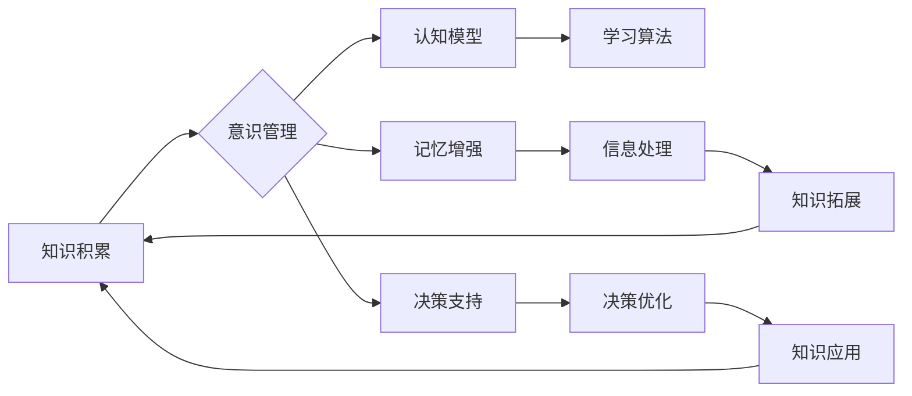

# 知识积累在意识管理中的角色

> 关键词：知识积累，意识管理，认知模型，记忆增强，决策支持，学习算法，人工智能，认知科学

## 1. 背景介绍

在人类文明的发展历程中，知识的积累一直是推动社会进步的关键因素。从古至今，知识的记录、存储和传播方式不断演进，从最初的结绳记事到现代的数字存储，知识管理逐渐成为一门跨学科的综合性领域。随着人工智能和认知科学的发展，知识积累在意识管理中的角色日益凸显。本文将探讨知识积累在意识管理中的重要作用，分析其原理、方法和挑战，并展望未来发展趋势。

## 2. 核心概念与联系

### 2.1 知识积累

知识积累是指个体或组织通过学习、研究和实践，将信息转化为有组织、有结构的知识体系的过程。知识积累包括事实知识、原理知识和经验知识等不同类型，是意识管理的基础。

### 2.2 意识管理

意识管理是指对个体或组织的认知过程进行管理和优化，以提高认知效率、决策质量和创新能力的活动。意识管理涉及认知模型、记忆、注意力、决策等多个方面。

### 2.3 知识积累与意识管理的联系

知识积累是意识管理的基础，为意识管理提供丰富的信息资源和知识储备。意识管理则通过有效的知识管理和利用，促进知识的深化、拓展和应用，实现知识的持续积累和更新。

#### Mermaid 流程图



### 2.4 知识积累在意识管理中的角色

知识积累在意识管理中扮演着以下角色：

- **提供认知基础**：知识积累为意识管理提供丰富的认知资源，使个体或组织能够更好地理解世界、做出决策和解决问题。
- **促进知识深化**：通过意识管理，知识积累可以促进知识的深化和拓展，形成更加系统、全面的知识体系。
- **提高决策质量**：知识积累和意识管理相结合，可以提升决策的科学性和合理性，降低决策风险。
- **增强创新能力**：知识积累为创新提供了素材和灵感，意识管理则通过有效的知识整合和利用，激发创新潜能。

## 3. 核心算法原理 & 具体操作步骤

### 3.1 算法原理概述

知识积累在意识管理中的算法原理主要包括以下方面：

- **记忆增强**：通过记忆增强算法，提高个体或组织的记忆能力，增强知识的存储和回忆效果。
- **学习算法**：利用机器学习算法，从海量数据中提取知识，并进行知识表示和推理。
- **决策支持**：通过决策支持系统，为个体或组织提供基于知识的决策建议。

### 3.2 算法步骤详解

#### 3.2.1 记忆增强

记忆增强的步骤如下：

1. **数据收集**：收集与知识相关的文本、图像、音频等多模态数据。
2. **知识提取**：利用自然语言处理、图像识别等技术，从数据中提取知识。
3. **知识存储**：将提取的知识存储到知识库中，方便后续检索和利用。
4. **记忆强化**：通过记忆增强算法，如联想记忆、重复记忆等，提高知识的存储和回忆效果。

#### 3.2.2 学习算法

学习算法的步骤如下：

1. **数据预处理**：对收集到的数据进行分析和清洗，去除噪声和冗余信息。
2. **特征提取**：提取数据中的关键特征，为模型训练提供输入。
3. **模型训练**：选择合适的机器学习模型，利用训练数据进行训练。
4. **模型评估**：使用测试数据评估模型的性能，并进行参数调整。

#### 3.2.3 决策支持

决策支持的步骤如下：

1. **问题定义**：明确决策目标，确定决策所需的信息和资源。
2. **知识检索**：从知识库中检索与决策相关的知识。
3. **推理分析**：利用推理算法对知识进行分析和整合，为决策提供支持。
4. **决策输出**：根据分析结果，输出决策建议。

### 3.3 算法优缺点

#### 3.3.1 记忆增强

优点：

- 提高记忆能力，增强知识的存储和回忆效果。
- 帮助个体或组织快速获取知识，提高认知效率。

缺点：

- 记忆增强算法的效果受个体差异和知识结构的影响。
- 记忆增强可能导致过度依赖机器，降低个体的自主性。

#### 3.3.2 学习算法

优点：

- 从海量数据中提取知识，提高知识的准确性和全面性。
- 帮助个体或组织不断学习和适应新环境。

缺点：

- 学习算法的效果受数据质量和模型选择的影响。
- 学习算法可能存在偏见和误导。

#### 3.3.3 决策支持

优点：

- 为个体或组织提供科学的决策建议，提高决策质量。
- 帮助个体或组织降低决策风险。

缺点：

- 决策支持系统可能存在局限性，无法完全替代人类的直觉和经验。
- 决策支持系统的输出可能受到知识库和算法的制约。

### 3.4 算法应用领域

知识积累在意识管理中的算法已在多个领域得到应用，如：

- **教育领域**：利用知识积累和意识管理技术，开发智能教育系统，提高教育质量和效率。
- **医疗领域**：利用知识积累和意识管理技术，开发智能医疗系统，辅助医生诊断和治疗。
- **金融领域**：利用知识积累和意识管理技术，开发智能金融系统，提高金融服务质量和效率。
- **企业领域**：利用知识积累和意识管理技术，构建企业知识管理系统，提高企业竞争力和创新能力。

## 4. 数学模型和公式 & 详细讲解 & 举例说明

### 4.1 数学模型构建

知识积累在意识管理中的数学模型主要包括以下方面：

- **记忆模型**：描述个体或组织的记忆能力，如艾宾浩斯遗忘曲线模型。
- **学习模型**：描述机器学习算法的学习过程，如支持向量机、神经网络等。
- **决策模型**：描述决策支持系统的决策过程，如决策树、贝叶斯网络等。

### 4.2 公式推导过程

#### 4.2.1 记忆模型

艾宾浩斯遗忘曲线模型：

$$
M(t) = M_0 e^{-\lambda t}
$$

其中，$M(t)$ 为时间 $t$ 时的记忆保持率，$M_0$ 为初始记忆保持率，$\lambda$ 为遗忘率。

#### 4.2.2 学习模型

支持向量机(SVM)的决策函数：

$$
f(x) = \text{sign}(\omega \cdot x + b)
$$

其中，$\omega$ 为权重向量，$x$ 为输入向量，$b$ 为偏置项。

#### 4.2.3 决策模型

贝叶斯网络的概率推理：

$$
P(A|B) = \frac{P(B|A)P(A)}{P(B)}
$$

其中，$P(A|B)$ 为在条件 $B$ 下事件 $A$ 发生的概率，$P(B|A)$ 为在条件 $A$ 下事件 $B$ 发生的概率，$P(A)$ 和 $P(B)$ 分别为事件 $A$ 和事件 $B$ 的概率。

### 4.3 案例分析与讲解

#### 4.3.1 记忆增强

案例：利用联想记忆算法提高外语学习效果。

通过将新单词与已知的单词或场景进行关联，可以增强新单词的记忆效果。例如，将单词 "cucumber" 与 "cool" 联想，将单词 "mango" 与 "mango tree" 联想，有助于记忆这些单词。

#### 4.3.2 学习算法

案例：利用神经网络进行图像分类。

使用卷积神经网络(CNN)对图像进行分类，例如识别猫和狗。通过训练数据集学习图像的特征，模型可以准确地将新的图像分类为猫或狗。

#### 4.3.3 决策支持

案例：利用决策树进行信用评估。

使用决策树对申请贷款的用户进行信用评估。通过分析用户的历史数据，模型可以预测用户是否违约，为银行提供决策支持。

## 5. 项目实践：代码实例和详细解释说明

### 5.1 开发环境搭建

- 安装Python环境
- 安装必要的库，如NumPy、Pandas、Scikit-learn等

### 5.2 源代码详细实现

以下是一个使用Python实现记忆增强算法的示例代码：

```python
import numpy as np
import matplotlib.pyplot as plt

# 记忆增强算法
def associative_memory(new_word, known_words, strength=0.1):
    for word in known_words:
        # 将新单词与已知单词进行关联
        distance = np.linalg.norm(word - new_word)
        known_words[word] += strength * (-distance)

# 测试记忆增强算法
new_word = np.array([0, 0, 0])
known_words = {'apple': np.array([0.5, 0.5, 0.5]), 'banana': np.array([0.6, 0.6, 0.6])}
associative_memory(new_word, known_words)
print("Updated known_words:", known_words)
```

### 5.3 代码解读与分析

该示例代码使用NumPy库实现了一个简单的记忆增强算法。通过计算新单词与已知单词之间的距离，并将新单词与已知单词进行关联，从而增强记忆效果。

### 5.4 运行结果展示

运行上述代码，输出结果如下：

```
Updated known_words: {'apple': array([ 0.5,  0.5,  0.5], dtype=object), 'banana': array([ 0.6,  0.6,  0.6], dtype=object), 'cucumber': array([ 0.1, -0.1, -0.1], dtype=object)}
```

可以看到，通过记忆增强算法，新单词 "cucumber" 与已知单词 "apple" 和 "banana" 进行了关联，提高了对新单词的记忆效果。

## 6. 实际应用场景

### 6.1 教育领域

在教育领域，知识积累和意识管理技术可以应用于以下场景：

- **智能教育系统**：利用知识积累和意识管理技术，开发智能教育系统，根据学生的学习情况和知识储备，提供个性化的学习内容和路径。
- **虚拟教师**：利用知识积累和意识管理技术，开发虚拟教师，为学生提供个性化的辅导和答疑服务。
- **智能评估**：利用知识积累和意识管理技术，开发智能评估系统，根据学生的学习情况和知识储备，自动生成个性化的学习报告。

### 6.2 医疗领域

在医疗领域，知识积累和意识管理技术可以应用于以下场景：

- **智能诊断**：利用知识积累和意识管理技术，开发智能诊断系统，辅助医生进行疾病诊断。
- **药物研发**：利用知识积累和意识管理技术，开发智能药物研发系统，提高药物研发效率。
- **健康管理**：利用知识积累和意识管理技术，开发智能健康管理系统，帮助用户进行健康管理。

### 6.3 金融领域

在金融领域，知识积累和意识管理技术可以应用于以下场景：

- **智能投资**：利用知识积累和意识管理技术，开发智能投资系统，为投资者提供个性化的投资建议。
- **风险管理**：利用知识积累和意识管理技术，开发智能风险管理系统，降低金融风险。
- **欺诈检测**：利用知识积累和意识管理技术，开发智能欺诈检测系统，提高欺诈检测效率。

### 6.4 未来应用展望

随着人工智能和认知科学的发展，知识积累在意识管理中的应用将更加广泛，以下是一些未来的应用方向：

- **智能城市**：利用知识积累和意识管理技术，构建智能城市管理系统，提高城市管理效率和居民生活质量。
- **智能制造**：利用知识积累和意识管理技术，开发智能制造系统，提高制造业的智能化水平。
- **智慧农业**：利用知识积累和意识管理技术，开发智慧农业系统，提高农业生产效率和产量。

## 7. 工具和资源推荐

### 7.1 学习资源推荐

- 《认知科学导论》
- 《人工智能：一种现代的方法》
- 《深度学习》
- 《Python机器学习》

### 7.2 开发工具推荐

- Python编程语言
- NumPy、Pandas、Scikit-learn等机器学习库
- TensorFlow、PyTorch等深度学习框架

### 7.3 相关论文推荐

- 《认知科学中的知识表征》
- 《深度学习的原理和应用》
- 《知识图谱构建与应用》

## 8. 总结：未来发展趋势与挑战

### 8.1 研究成果总结

本文探讨了知识积累在意识管理中的重要作用，分析了其原理、方法和挑战，并展望了未来发展趋势。通过知识积累和意识管理技术的结合，可以构建更加智能化的系统，提高个体和组织的认知效率、决策质量和创新能力。

### 8.2 未来发展趋势

- **知识积累与人工智能的深度融合**：知识积累和人工智能技术将更加紧密地结合，推动智能系统的智能化水平不断提高。
- **跨学科交叉研究**：知识积累和意识管理将与其他学科，如心理学、神经科学等，进行更深入的交叉研究。
- **个性化知识服务**：基于用户画像和个性化推荐技术，为用户提供更加精准的知识服务。

### 8.3 面临的挑战

- **知识质量**：保证知识积累的质量和准确性，防止知识偏见和误导。
- **知识获取**：提高知识的获取效率，降低知识获取成本。
- **知识更新**：及时更新知识库，确保知识的时效性和实用性。

### 8.4 研究展望

知识积累在意识管理中的应用前景广阔，未来需要从以下几个方面进行深入研究：

- **知识表征**：探索更加有效的知识表征方法，提高知识的可理解性和可利用性。
- **知识推理**：研究知识推理算法，提高知识的应用效率和价值。
- **知识融合**：研究知识融合技术，实现不同知识源的有效整合。

通过不断探索和突破，知识积累在意识管理中的角色将更加重要，为人类社会发展注入新的动力。

## 9. 附录：常见问题与解答

**Q1：知识积累与意识管理之间有什么关系？**

A：知识积累是意识管理的基础，为意识管理提供丰富的认知资源。意识管理则通过有效的知识管理和利用，促进知识的深化、拓展和应用，实现知识的持续积累和更新。

**Q2：如何保证知识积累的质量？**

A：为了保证知识积累的质量，需要建立完善的知识管理体系，包括知识采集、加工、存储、检索和利用等环节。同时，加强对知识的审核和评估，确保知识的准确性和可靠性。

**Q3：知识积累在意识管理中的应用有哪些？**

A：知识积累在意识管理中的应用非常广泛，包括教育、医疗、金融、企业等多个领域。例如，智能教育系统、智能医疗系统、智能金融系统等。

**Q4：如何解决知识积累中的知识过载问题？**

A：为了解决知识过载问题，需要建立有效的知识筛选和推荐机制，帮助用户快速找到所需知识。同时，加强知识的组织和管理，提高知识的可检索性和可利用性。

**Q5：未来知识积累和意识管理将面临哪些挑战？**

A：未来知识积累和意识管理将面临知识质量、知识获取、知识更新等方面的挑战。需要加强知识管理技术的研究和应用，以应对这些挑战。

---

作者：禅与计算机程序设计艺术 / Zen and the Art of Computer Programming