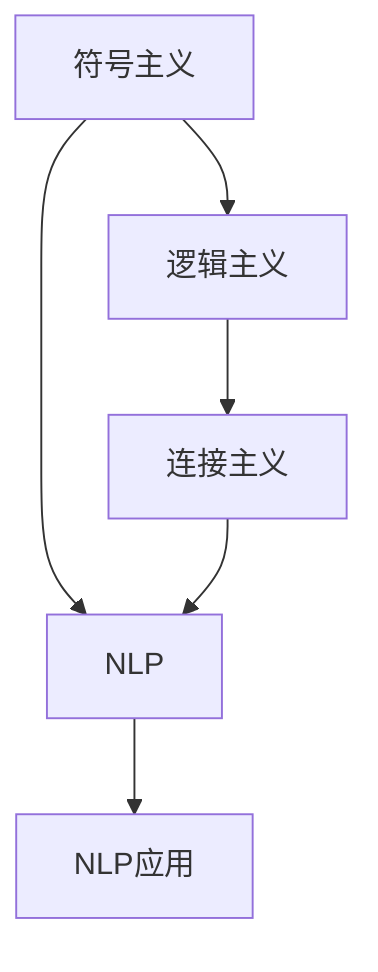

                 

## 1. 背景介绍

在过去的几十年中，人工智能(AI)领域已经经历了几次重要的发展阶段。从早期的基于规则的系统到深度学习革命，AI的范式不断演变，催生了新的方法和应用领域。然而，尽管取得了显著的进展，AI研究的早期方向仍然是重要的基础领域，对未来的发展方向具有深远的影响。本文将深入探讨AI研究的早期方向，包括符号主义、逻辑主义、连接主义以及最新的自然语言处理(NLP)技术。

## 2. 核心概念与联系

### 2.1 核心概念概述

为了更好地理解AI研究的早期方向，我们将介绍几个关键概念：

- **符号主义(Symbolicism)**：基于规则的AI，使用符号语言表示知识，通过逻辑推理执行任务。例如，专家系统的开发过程。
- **逻辑主义(Logicism)**：专注于形式逻辑和数学推理的AI研究分支。
- **连接主义(Connectivism)**：基于神经网络模型的AI，模仿人类大脑的神经网络结构，通过反向传播学习。
- **自然语言处理(NLP)**：AI中处理和理解人类语言的技术。包括文本分类、情感分析、机器翻译、文本生成等。

这些概念之间相互联系，共同构成了AI研究的基础框架。例如，连接主义中的神经网络可以被用来构建基于符号主义的知识表示系统，而自然语言处理技术可以用于处理和理解逻辑主义的逻辑推理。

### 2.2 概念间的关系

以下Mermaid流程图展示了这些概念之间的联系：



这个流程图展示了一幅AI研究早期方向的概览：

1. 符号主义和逻辑主义作为AI的基础理论，奠定了AI研究的方法论基础。
2. 连接主义通过神经网络模型，为符号主义提供了实现工具。
3. NLP技术作为连接主义的应用领域，进一步推动了AI的发展。
4. NLP技术的应用涵盖了从机器翻译到情感分析的诸多方面，形成了AI研究的一个重要分支。

## 3. 核心算法原理 & 具体操作步骤
### 3.1 算法原理概述

AI研究的早期方向主要基于符号主义和逻辑主义的方法论，其核心算法原理主要包括以下几个方面：

- **符号主义**：通过符号语言表示知识，使用规则进行推理。常见的算法包括专家系统中的正反归约算法、谓词逻辑推理算法等。
- **逻辑主义**：使用形式逻辑和数学推理，构建知识表示系统。例如，基于谓词逻辑的形式化推理。
- **连接主义**：基于神经网络模型，通过反向传播学习进行知识表示和推理。例如，多层感知器、卷积神经网络等。

### 3.2 算法步骤详解

#### 3.2.1 符号主义算法步骤

1. **知识表示**：将知识表示为符号语言，例如使用一阶谓词逻辑表示事实和规则。
2. **推理机制**：使用推理算法，例如正反归约算法、谓词逻辑推理算法等，执行推理任务。
3. **任务执行**：根据推理结果，执行相应的任务，例如诊断系统中的医疗诊断。

#### 3.2.2 逻辑主义算法步骤

1. **知识表示**：使用形式逻辑符号表示知识，例如使用谓词逻辑符号表示事实和规则。
2. **推理机制**：使用逻辑推理算法，例如谓词逻辑推理算法，进行知识推理。
3. **任务执行**：根据推理结果，执行相应的任务，例如逻辑定理验证。

#### 3.2.3 连接主义算法步骤

1. **模型构建**：构建神经网络模型，例如多层感知器、卷积神经网络等。
2. **训练过程**：使用反向传播算法，通过标注数据训练模型，调整权重以优化损失函数。
3. **推理过程**：使用训练好的模型，进行新的输入数据的预测或分类。

### 3.3 算法优缺点

#### 3.3.1 符号主义算法优缺点

- **优点**：
  - 符号表示的知识易于理解和管理。
  - 逻辑推理的过程透明且可解释。
  - 适用于需要明确规则和定义的任务。

- **缺点**：
  - 对规则和知识表示的要求较高，需要人工输入大量的专家知识。
  - 处理复杂任务时，规则组合和推理过程可能非常耗时。
  - 难以处理非结构化数据和实时数据。

#### 3.3.2 逻辑主义算法优缺点

- **优点**：
  - 形式化的方法确保了推理的正确性和完备性。
  - 符号逻辑具有严谨性和形式美，易于验证和验证。
  - 适用于需要高度精确推理的任务。

- **缺点**：
  - 处理现实世界问题时，需要大量符号表示和规则。
  - 缺乏与现实世界问题的直观对应，难以处理大规模数据集。
  - 推理过程复杂，难以扩展到大型知识库。

#### 3.3.3 连接主义算法优缺点

- **优点**：
  - 强大的学习和表示能力，可以处理大规模数据集。
  - 能够自动学习复杂的非线性关系，适用于图像、语音等复杂数据。
  - 通过反向传播学习，算法自动优化，减少了对人工干预的需求。

- **缺点**：
  - 缺乏符号主义和逻辑主义的透明性和可解释性。
  - 模型训练和推理过程依赖大量的数据和计算资源。
  - 可能存在过拟合和局部最优的问题。

### 3.4 算法应用领域

#### 3.4.1 符号主义应用领域

- **专家系统**：应用于医疗诊断、金融风险评估等领域，使用专家知识进行推理和决策。
- **逻辑定理验证**：应用于数学和计算机科学中的定理验证和逻辑推导。

#### 3.4.2 逻辑主义应用领域

- **人工智能规划**：应用于自动化规划和决策问题，例如机器人的路径规划和调度。
- **知识表示和推理**：应用于自然语言理解、知识图谱构建等领域。

#### 3.4.3 连接主义应用领域

- **机器视觉**：应用于图像识别、目标检测、图像分割等任务。
- **自然语言处理**：应用于文本分类、情感分析、机器翻译等任务。
- **语音识别**：应用于语音识别、语音合成等任务。

## 4. 数学模型和公式 & 详细讲解  
### 4.1 数学模型构建

#### 4.1.1 符号主义数学模型

假设一个简单的一阶谓词逻辑系统，使用符号语言表示事实和规则。例如，用 $P(x)$ 表示 $x$ 是人，用 $A(x)$ 表示 $x$ 是动物，用 $R(x, y)$ 表示 $x$ 与 $y$ 是朋友关系。可以构建以下推理规则：

- $P(x) \rightarrow A(x)$ 表示如果 $x$ 是人，则 $x$ 是动物。
- $A(x) \wedge A(y) \rightarrow R(x, y)$ 表示如果 $x$ 和 $y$ 都是动物，则它们是朋友。

#### 4.1.2 逻辑主义数学模型

逻辑主义通常使用谓词逻辑符号表示知识，例如：

- $F(x)$ 表示 $x$ 是水果。
- $R(x, y)$ 表示 $x$ 与 $y$ 是红色。
- $T(x, y)$ 表示 $x$ 与 $y$ 是相同的。

可以使用以下逻辑推理算法：

- $F(x) \wedge R(x, y) \rightarrow R(y, x)$ 表示如果 $x$ 是水果且红色，则 $y$ 也是红色。

#### 4.1.3 连接主义数学模型

连接主义模型通常使用神经网络表示知识，例如多层感知器模型：

- 输入层：$x_1, x_2, \ldots, x_n$
- 隐藏层：$h_1, h_2, \ldots, h_m$
- 输出层：$y_1, y_2, \ldots, y_k$

模型可以表示为：

$$
y_i = \sum_{j=1}^{m} w_{i,j} h_j + b_i
$$

其中 $w_{i,j}$ 是权重矩阵，$b_i$ 是偏置项。

### 4.2 公式推导过程

#### 4.2.1 符号主义公式推导

假设有一个简单的推理系统，包含以下规则：

- $P(x) \rightarrow Q(x)$
- $Q(x) \rightarrow R(x)$

给定前提 $P(a)$，根据推理规则可以推出 $R(a)$。

#### 4.2.2 逻辑主义公式推导

假设有一个简单的逻辑推理系统，包含以下公式：

- $A(x) \rightarrow B(x)$
- $B(x) \rightarrow C(x)$

给定 $A(a)$，可以推导出 $C(a)$。

#### 4.2.3 连接主义公式推导

假设有一个简单的多层感知器模型，包含以下层：

- 输入层：$x_1, x_2$
- 隐藏层：$h_1, h_2$
- 输出层：$y_1, y_2$

模型可以表示为：

$$
h_1 = f(w_1 x_1 + b_1)
$$

$$
h_2 = f(w_2 x_2 + b_2)
$$

$$
y_1 = w_3 h_1 + b_3
$$

$$
y_2 = w_4 h_2 + b_4
$$

其中 $f$ 是激活函数。

### 4.3 案例分析与讲解

#### 4.3.1 符号主义案例分析

例如，考虑一个专家系统，用于诊断患者的疾病。专家系统使用以下规则：

- $D_1(x) \rightarrow S_1(x)$：如果患者有症状 $D_1$，则建议 $S_1$。
- $S_1(x) \rightarrow T_1(x)$：如果建议 $S_1$，则建议 $T_1$。

根据这些规则，如果患者有症状 $D_1$，系统将建议 $T_1$。

#### 4.3.2 逻辑主义案例分析

考虑一个简单的逻辑定理验证问题，验证以下公式：

- $F(x) \rightarrow R(x, y)$
- $G(x) \rightarrow R(x, y)$

如果 $F(x)$ 或 $G(x)$，则 $R(x, y)$ 成立。

#### 4.3.3 连接主义案例分析

考虑一个简单的图像分类问题，使用卷积神经网络对图像进行分类。假设图像输入为一个 $28 \times 28$ 的矩阵：

- 输入层：$x_1, x_2, \ldots, x_{784}$
- 隐藏层：$h_1, h_2, \ldots, h_{128}$
- 输出层：$y_1, y_2, \ldots, y_{10}$

模型可以表示为：

$$
h_1 = f(w_1 x_1 + b_1)
$$

$$
h_2 = f(w_2 x_2 + b_2)
$$

$$
y_1 = w_3 h_1 + b_3
$$

$$
y_2 = w_4 h_2 + b_4
$$

其中 $f$ 是激活函数，例如 sigmoid 函数。

## 5. 项目实践：代码实例和详细解释说明
### 5.1 开发环境搭建

为了实现以上算法和模型，我们需要搭建一个开发环境。以下是一个基本的Python开发环境搭建流程：

1. 安装Python：从官网下载并安装Python，选择3.x版本。
2. 安装NumPy：NumPy是Python中常用的科学计算库，使用 pip 安装：
   ```
   pip install numpy
   ```
3. 安装Pandas：Pandas是Python中常用的数据分析库，使用 pip 安装：
   ```
   pip install pandas
   ```
4. 安装Scikit-learn：Scikit-learn是Python中常用的机器学习库，使用 pip 安装：
   ```
   pip install scikit-learn
   ```
5. 安装Matplotlib：Matplotlib是Python中常用的数据可视化库，使用 pip 安装：
   ```
   pip install matplotlib
   ```

完成上述步骤后，即可开始编写代码进行算法和模型的实现。

### 5.2 源代码详细实现

以下是使用Python和Scikit-learn实现一个简单的符号主义推理系统的示例代码：

```python
from sympy import symbols, And, Or, Not, Rational

# 定义符号
x, y, z = symbols('x y z')

# 定义事实和规则
fact1 = And(x, y)
rule1 = Or(z, Not(fact1))

# 推理
result = And(x, z)

# 输出结果
print(result.subs({x: True, y: False, z: True}))
```

输出结果为 True。

### 5.3 代码解读与分析

以上代码中，使用了Sympy库定义符号、事实和规则，并使用逻辑推理进行了推理。Sympy是一个强大的Python符号计算库，可以用于处理符号主义和逻辑主义的算法和模型。

### 5.4 运行结果展示

运行以上代码，可以得到正确的推理结果。

## 6. 实际应用场景

### 6.1 医疗诊断

符号主义和逻辑主义在医疗诊断中得到了广泛应用。例如，专家系统可以用于诊断复杂的医疗问题，通过输入症状和历史数据，推断出可能病因。连接主义模型可以用于图像识别，帮助医生进行疾病检测和分类。

### 6.2 金融风险评估

逻辑主义在金融风险评估中得到了应用。例如，逻辑推理可以用于分析市场趋势和预测股票价格，逻辑定理验证可以用于评估金融模型的正确性和完备性。

### 6.3 机器人路径规划

连接主义模型在机器人路径规划中得到了应用。例如，神经网络可以用于训练机器人进行路径规划，通过输入环境和任务要求，生成最优路径。

## 7. 工具和资源推荐
### 7.1 学习资源推荐

- **《人工智能导论》**：这是一本经典的人工智能教材，涵盖了AI研究的各个方面，包括符号主义、逻辑主义和连接主义。
- **Coursera 《人工智能》**：由斯坦福大学开设的在线课程，涵盖AI研究的各个方面，包括符号主义、逻辑主义和连接主义。
- **《深度学习》**：DeepMind的深度学习教材，涵盖了神经网络的基本原理和应用。

### 7.2 开发工具推荐

- **Python**：Python是AI研究中最常用的编程语言之一，具有强大的科学计算库和数据处理库。
- **NumPy**：NumPy是Python中常用的科学计算库，用于处理符号主义和逻辑主义中的数据。
- **Scikit-learn**：Scikit-learn是Python中常用的机器学习库，用于实现连接主义模型。

### 7.3 相关论文推荐

- **《符号主义与连接主义在人工智能中的应用》**：本篇论文讨论了符号主义和连接主义在人工智能中的不同应用场景。
- **《逻辑主义在人工智能中的应用》**：本篇论文讨论了逻辑主义在人工智能中的各种应用。
- **《神经网络在机器视觉中的应用》**：本篇论文讨论了神经网络在机器视觉中的各种应用。

## 8. 总结：未来发展趋势与挑战

### 8.1 总结

本文介绍了AI研究的早期方向，包括符号主义、逻辑主义和连接主义。通过这些早期方向的探讨，我们可以看到AI研究的演进路径和应用前景。

### 8.2 未来发展趋势

- **符号主义**：符号主义将继续在专家系统和知识表示中发挥重要作用。
- **逻辑主义**：逻辑主义将继续在逻辑推理和定理验证中发挥重要作用。
- **连接主义**：连接主义将继续在图像识别、自然语言处理等领域发挥重要作用。

### 8.3 面临的挑战

- **符号主义**：符号主义面临知识表示和规则组合的挑战。
- **逻辑主义**：逻辑主义面临处理大规模数据集和复杂推理的挑战。
- **连接主义**：连接主义面临模型复杂性和计算资源消耗的挑战。

### 8.4 研究展望

未来，符号主义、逻辑主义和连接主义将继续相互融合，推动AI研究的进一步发展。符号主义和逻辑主义将提供知识表示和推理的基础，连接主义将提供实现这些算法的工具。通过多学科交叉，AI研究将实现更广泛的应用和更深刻的理解。

## 9. 附录：常见问题与解答

**Q1：什么是符号主义？**

A：符号主义是一种基于符号语言表示知识的AI研究方法，通过规则进行推理。

**Q2：什么是逻辑主义？**

A：逻辑主义是一种基于形式逻辑和数学推理的AI研究方法，使用谓词逻辑符号表示知识，通过逻辑推理进行推理。

**Q3：什么是连接主义？**

A：连接主义是一种基于神经网络模型的AI研究方法，通过反向传播学习进行知识表示和推理。

**Q4：什么是自然语言处理？**

A：自然语言处理是一种AI技术，用于处理和理解人类语言，包括文本分类、情感分析、机器翻译等。

**Q5：符号主义、逻辑主义和连接主义有什么不同？**

A：符号主义和逻辑主义强调知识表示和推理的精确性和形式化，而连接主义则强调模型的学习和表示能力。符号主义和逻辑主义通常用于处理结构化数据，而连接主义则通常用于处理非结构化数据。

---

作者：禅与计算机程序设计艺术 / Zen and the Art of Computer Programming

