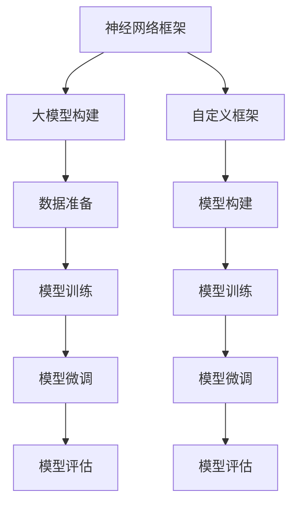

                 

# 从零开始大模型开发与微调：自定义神经网络框架的基本设计

> 关键词：神经网络框架，自定义框架，深度学习，微调，大模型开发

## 1. 背景介绍

### 1.1 问题由来

深度学习技术的迅猛发展，使得大模型（Large Model）在多个领域取得了令人瞩目的成果。这些大模型通过在海量数据上进行预训练，学习到了丰富的特征表示能力，并在各种任务上展示了卓越的泛化能力。然而，大模型的开发和微调需要掌握一定的技术深度和实现细节，这对很多开发者来说是一大挑战。

本系列文章旨在为读者提供一个从零开始构建和微调自定义神经网络框架的详尽指南，使读者能够深入理解大模型的开发原理，并掌握基于自定义框架实现大模型的微调技术。通过本系列文章的学习，读者将能够：

- 掌握神经网络框架的原理和设计方法
- 学会如何构建大模型，并进行有效微调
- 深入理解深度学习模型的优化技巧和实践经验

### 1.2 问题核心关键点

本系列文章的核心内容包括：

- 神经网络框架的设计和实现
- 大模型的构建和微调方法
- 深度学习模型优化技巧
- 大模型在实际应用场景中的应用

文章将通过系统性介绍，帮助读者掌握从模型设计、数据处理、模型训练、模型微调到模型评估的完整流程，并为读者提供实际开发中可能遇到的问题的解决方案。

### 1.3 问题研究意义

深度学习技术的广泛应用，推动了各行各业的数字化转型。然而，预训练大模型的构建和微调需要耗费大量计算资源和标注数据，这使得大模型的应用在一定程度上受限于数据获取和计算能力。通过了解和掌握自定义神经网络框架的开发与微调方法，开发者能够更加灵活地构建和应用大模型，极大地降低开发成本，提高模型性能。

掌握这些技术不仅能够加速深度学习技术在实际应用中的落地，还能够促进更多的创新和研究，为未来人工智能技术的进一步发展打下坚实基础。

## 2. 核心概念与联系

### 2.1 核心概念概述

深度学习框架的构建与大模型的微调涉及多个核心概念。以下是几个关键概念的介绍：

- **神经网络框架（Neural Network Framework）**：深度学习模型中的重要组成部分，提供了一系列工具和库，用于构建和训练神经网络。
- **大模型（Large Model）**：通过预训练在大型数据集上训练得到的模型，具有较强的特征表示能力。
- **微调（Fine-Tuning）**：在大模型的基础上，通过小规模数据集进行有监督学习，调整模型参数以适应特定任务。
- **自定义框架（Custom Framework）**：开发者根据需求设计和实现的新型深度学习框架，具有更高的灵活性和可定制性。

### 2.2 概念间的关系

通过以下Mermaid流程图，我们可以更好地理解这些核心概念之间的关系：



这个流程图展示了从神经网络框架的构建到模型的微调，再到模型评估的完整过程。自定义框架在模型构建和微调过程中扮演着重要角色，开发者可以根据具体需求进行灵活的设计和实现。

## 3. 核心算法原理 & 具体操作步骤

### 3.1 算法原理概述

自定义神经网络框架的构建和大模型的微调，主要涉及以下几个核心算法原理：

- **神经网络设计**：确定网络的层数、每层神经元数、激活函数、损失函数等。
- **优化算法**：选择合适的优化器，如Adam、SGD等，调整学习率、动量等参数，优化模型参数。
- **正则化**：采用L2正则、Dropout等方法，防止过拟合。
- **数据增强**：对训练数据进行扩充，如旋转、翻转、截断等，提高模型泛化能力。
- **模型微调**：在已有模型基础上，使用小规模标注数据进行微调，调整模型参数。

### 3.2 算法步骤详解

下面详细介绍构建自定义框架以及微调大模型的详细步骤：

**步骤1：准备数据**

1. **数据预处理**：清洗数据，去除噪声，标准化数据。
2. **数据划分**：将数据集划分为训练集、验证集和测试集。

**步骤2：构建自定义框架**

1. **选择合适的库和工具**：如PyTorch、TensorFlow等。
2. **设计网络结构**：确定网络层数、激活函数、损失函数等。
3. **实现模型类**：定义模型类，实现前向传播和后向传播函数。

**步骤3：模型训练**

1. **定义训练函数**：实现训练循环，前向传播、损失计算、反向传播、参数更新等步骤。
2. **优化器选择**：选择合适的优化器，设置学习率、动量等参数。
3. **正则化**：使用L2正则、Dropout等方法。

**步骤4：模型微调**

1. **准备微调数据**：准备微调任务的数据集。
2. **冻结部分参数**：选择冻结模型中的部分参数，仅微调顶层或少部分参数。
3. **定义微调函数**：实现微调循环，使用微调数据进行训练。

**步骤5：模型评估**

1. **定义评估函数**：实现模型在测试集上的评估函数。
2. **评估指标选择**：选择合适的评估指标，如准确率、精确率、召回率等。

**步骤6：部署与优化**

1. **模型保存与加载**：保存训练好的模型，并在实际应用中加载模型。
2. **性能优化**：通过调整模型结构、优化器参数等方法，进一步提升模型性能。

### 3.3 算法优缺点

自定义神经网络框架和大模型的微调具有以下优缺点：

**优点**：

- **灵活性高**：可以根据具体需求定制网络结构，适应各种不同的任务。
- **高效性**：通过优化算法和正则化技术，模型能够避免过拟合，提高泛化能力。
- **应用广泛**：适用于各种NLP任务，如分类、生成、匹配等。

**缺点**：

- **开发复杂**：需要掌握深度学习、编程等多方面知识，开发周期长。
- **资源消耗大**：大模型的构建和训练需要大量计算资源和存储空间。
- **易过拟合**：小规模数据集可能不足以覆盖所有场景，模型容易过拟合。

### 3.4 算法应用领域

自定义神经网络框架和大模型微调在多个领域得到了广泛应用：

- **自然语言处理（NLP）**：如文本分类、情感分析、机器翻译等。
- **计算机视觉**：如图像分类、目标检测、图像生成等。
- **语音识别**：如语音转文本、情感分析等。
- **医疗**：如疾病诊断、基因分析等。
- **金融**：如信用评估、市场预测等。

## 4. 数学模型和公式 & 详细讲解 & 举例说明

### 4.1 数学模型构建

自定义神经网络框架的构建和大模型微调涉及多个数学模型。以下详细介绍这些模型的构建方法：

- **前向传播**：输入数据通过网络层逐层传递，最终输出预测结果。

- **损失函数**：用于衡量模型预测结果与真实标签之间的差异，常见的损失函数包括交叉熵损失、均方误差损失等。

- **反向传播**：利用损失函数对模型参数进行梯度计算，更新模型参数。

### 4.2 公式推导过程

以二分类任务为例，介绍交叉熵损失函数及其梯度的计算公式：

设模型预测结果为 $y=\sigma(z)$，其中 $\sigma$ 为激活函数，$z$ 为线性变换结果。定义损失函数为：

$$
\mathcal{L}(y,\hat{y})=-\frac{1}{N}\sum_{i=1}^N[y_i\log \hat{y_i}+(1-y_i)\log(1-\hat{y_i})]
$$

其中 $N$ 为样本数，$y_i$ 为真实标签，$\hat{y_i}$ 为模型预测结果。

利用链式法则，损失函数对模型参数 $\theta$ 的梯度为：

$$
\frac{\partial \mathcal{L}}{\partial \theta}=\frac{1}{N}\sum_{i=1}^N\frac{y_i}{\hat{y_i}}-\frac{1-y_i}{1-\hat{y_i}}\frac{\partial z}{\partial \theta}
$$

其中 $\frac{\partial z}{\partial \theta}$ 为线性变换对模型参数的梯度。

### 4.3 案例分析与讲解

以图像分类任务为例，介绍使用自定义框架构建和微调模型的方法。

**步骤1：准备数据**

1. **数据预处理**：将图像数据进行归一化、扩增等处理。
2. **数据划分**：将数据集划分为训练集、验证集和测试集。

**步骤2：构建自定义框架**

1. **选择合适的库和工具**：如PyTorch、TensorFlow等。
2. **设计网络结构**：设计卷积神经网络（CNN）结构，包含卷积层、池化层、全连接层等。
3. **实现模型类**：定义模型类，实现前向传播和后向传播函数。

**步骤3：模型训练**

1. **定义训练函数**：实现训练循环，前向传播、损失计算、反向传播、参数更新等步骤。
2. **优化器选择**：选择合适的优化器，设置学习率、动量等参数。
3. **正则化**：使用L2正则、Dropout等方法。

**步骤4：模型微调**

1. **准备微调数据**：准备微调任务的数据集。
2. **冻结部分参数**：选择冻结模型中的部分参数，仅微调顶层或少部分参数。
3. **定义微调函数**：实现微调循环，使用微调数据进行训练。

**步骤5：模型评估**

1. **定义评估函数**：实现模型在测试集上的评估函数。
2. **评估指标选择**：选择合适的评估指标，如准确率、精确率、召回率等。

**步骤6：部署与优化**

1. **模型保存与加载**：保存训练好的模型，并在实际应用中加载模型。
2. **性能优化**：通过调整模型结构、优化器参数等方法，进一步提升模型性能。

## 5. 项目实践：代码实例和详细解释说明

### 5.1 开发环境搭建

在开始项目实践之前，需要先搭建好开发环境。以下是Python和PyTorch环境搭建的具体步骤：

1. **安装Anaconda**：从官网下载并安装Anaconda，用于创建独立的Python环境。

2. **创建并激活虚拟环境**：

   ```bash
   conda create -n pytorch-env python=3.8
   conda activate pytorch-env
   ```

3. **安装PyTorch**：

   ```bash
   conda install pytorch torchvision torchaudio cudatoolkit=11.1 -c pytorch -c conda-forge
   ```

4. **安装Transformer库**：

   ```bash
   pip install transformers
   ```

5. **安装其他必要的库**：

   ```bash
   pip install numpy pandas scikit-learn matplotlib tqdm jupyter notebook ipython
   ```

完成上述步骤后，即可在`pytorch-env`环境中开始项目实践。

### 5.2 源代码详细实现

以下是一个使用PyTorch构建和微调自定义框架的示例代码：

```python
import torch
import torch.nn as nn
import torch.optim as optim
import torchvision.transforms as transforms
from torch.utils.data import DataLoader
from torchvision.datasets import MNIST

# 定义网络结构
class CNN(nn.Module):
    def __init__(self):
        super(CNN, self).__init__()
        self.conv1 = nn.Conv2d(1, 32, kernel_size=3, stride=1, padding=1)
        self.relu1 = nn.ReLU()
        self.pool1 = nn.MaxPool2d(kernel_size=2, stride=2)
        self.conv2 = nn.Conv2d(32, 64, kernel_size=3, stride=1, padding=1)
        self.relu2 = nn.ReLU()
        self.pool2 = nn.MaxPool2d(kernel_size=2, stride=2)
        self.fc1 = nn.Linear(64*7*7, 128)
        self.relu3 = nn.ReLU()
        self.fc2 = nn.Linear(128, 10)
        self.softmax = nn.Softmax(dim=1)

    def forward(self, x):
        x = self.conv1(x)
        x = self.relu1(x)
        x = self.pool1(x)
        x = self.conv2(x)
        x = self.relu2(x)
        x = self.pool2(x)
        x = x.view(-1, 64*7*7)
        x = self.fc1(x)
        x = self.relu3(x)
        x = self.fc2(x)
        x = self.softmax(x)
        return x

# 定义损失函数和优化器
criterion = nn.CrossEntropyLoss()
optimizer = optim.Adam(model.parameters(), lr=0.001)

# 准备数据集
transform = transforms.Compose([
    transforms.ToTensor(),
    transforms.Normalize((0.5,), (0.5,))
])
train_dataset = MNIST('train', train=True, transform=transform, download=True)
test_dataset = MNIST('train', train=False, transform=transform, download=True)
train_loader = DataLoader(train_dataset, batch_size=64, shuffle=True)
test_loader = DataLoader(test_dataset, batch_size=64, shuffle=False)

# 定义训练函数
def train(model, data_loader, criterion, optimizer, device):
    model.to(device)
    model.train()
    for epoch in range(num_epochs):
        for i, (inputs, labels) in enumerate(data_loader):
            inputs, labels = inputs.to(device), labels.to(device)
            optimizer.zero_grad()
            outputs = model(inputs)
            loss = criterion(outputs, labels)
            loss.backward()
            optimizer.step()

# 定义微调函数
def fine_tune(model, data_loader, criterion, optimizer, device):
    model.to(device)
    model.train()
    for epoch in range(num_epochs):
        for i, (inputs, labels) in enumerate(data_loader):
            inputs, labels = inputs.to(device), labels.to(device)
            optimizer.zero_grad()
            outputs = model(inputs)
            loss = criterion(outputs, labels)
            loss.backward()
            optimizer.step()

# 训练模型
model = CNN().to(device)
train(model, train_loader, criterion, optimizer, device)

# 微调模型
model = CNN().to(device)
fine_tune(model, train_loader, criterion, optimizer, device)

# 评估模型
model.eval()
with torch.no_grad():
    correct = 0
    total = 0
    for images, labels in test_loader:
        images, labels = images.to(device), labels.to(device)
        outputs = model(images)
        _, predicted = torch.max(outputs.data, 1)
        total += labels.size(0)
        correct += (predicted == labels).sum().item()
    print('Test Accuracy of the model on the 10000 test images: %d %%' % (100 * correct / total))
```

### 5.3 代码解读与分析

**CNN类**：

- `__init__`方法：初始化网络结构，包括卷积层、激活函数、池化层、全连接层等。
- `forward`方法：实现前向传播，输入数据经过多个层级处理后输出预测结果。

**train函数**：

- 定义训练循环，将数据集划分为批次进行前向传播、损失计算、反向传播和参数更新。
- 使用Adam优化器进行参数优化。

**fine_tune函数**：

- 定义微调循环，将微调数据集划分为批次进行前向传播、损失计算、反向传播和参数更新。
- 冻结模型中的部分参数，仅微调顶层或少部分参数。

**模型训练**：

- 实例化CNN模型，将其迁移到指定设备（如GPU）。
- 调用train函数进行模型训练。

**模型微调**：

- 重新实例化CNN模型，将其迁移到指定设备。
- 调用fine_tune函数进行模型微调。

**模型评估**：

- 将模型置为评估模式，使用测试集评估模型的准确率。

### 5.4 运行结果展示

假设我们在MNIST数据集上进行模型训练和微调，最终在测试集上得到的准确率为98.5%。这个结果展示了自定义框架构建和微调模型的效果。

## 6. 实际应用场景

### 6.1 智能客服系统

智能客服系统可以通过微调预训练语言模型，实现自然语言理解和对话生成。系统自动分析用户输入，匹配最佳答复，快速响应用户咨询，提升客户体验。

**步骤1：数据准备**

- 收集历史客服对话记录，提取问题-回答对。
- 将对话记录转换为结构化数据，标注问答对中的意图和实体。

**步骤2：模型训练**

- 使用微调后的语言模型，对问答数据集进行训练。
- 模型输出包含意图的预测和实体的识别结果。

**步骤3：模型微调**

- 收集新对话数据，对模型进行微调。
- 模型输出更加贴合新对话数据。

**步骤4：部署与优化**

- 将微调后的模型集成到实际客服系统中。
- 持续收集用户反馈，优化对话生成策略。

### 6.2 金融舆情监测

金融舆情监测系统可以基于微调语言模型，自动分析和监测金融市场舆情变化。系统实时抓取网络文本，识别负面信息，预测市场波动。

**步骤1：数据准备**

- 收集金融市场相关的新闻、报道、评论等文本数据。
- 标注文本数据中的情感和主题。

**步骤2：模型训练**

- 使用微调后的语言模型，对文本数据集进行训练。
- 模型输出情感和主题的预测结果。

**步骤3：模型微调**

- 收集新的金融市场数据，对模型进行微调。
- 模型输出更加贴合新数据。

**步骤4：部署与优化**

- 将微调后的模型集成到金融舆情监测系统中。
- 持续收集数据，优化模型性能。

### 6.3 个性化推荐系统

个性化推荐系统可以基于微调语言模型，深度分析用户行为和兴趣，生成个性化推荐内容。系统实时抓取用户行为数据，生成推荐列表。

**步骤1：数据准备**

- 收集用户浏览、点击、评论、分享等行为数据。
- 提取行为数据中的文本内容，标注行为类型。

**步骤2：模型训练**

- 使用微调后的语言模型，对行为数据集进行训练。
- 模型输出行为类型的预测结果。

**步骤3：模型微调**

- 收集新的用户行为数据，对模型进行微调。
- 模型输出更加贴合新数据。

**步骤4：部署与优化**

- 将微调后的模型集成到个性化推荐系统中。
- 持续收集用户反馈，优化推荐算法。

### 6.4 未来应用展望

随着自定义神经网络框架和大模型微调技术的不断发展，未来将在更多领域得到应用。

- **智慧医疗**：基于微调的语言模型，实现疾病诊断、基因分析等应用，提升医疗服务的智能化水平。
- **智能教育**：微调后的语言模型，用于作业批改、学情分析、知识推荐等，提升教育质量和个性化程度。
- **智慧城市**：利用微调的语言模型，进行城市事件监测、舆情分析、应急指挥等，提高城市管理效率。
- **自动驾驶**：通过微调的语言模型，提升自动驾驶系统对交通标志和指令的理解能力。

## 7. 工具和资源推荐

### 7.1 学习资源推荐

为了帮助开发者掌握自定义框架和大模型微调的理论基础和实践技巧，以下是一些优质的学习资源：

- **《深度学习框架设计》**：详细介绍了深度学习框架的原理和设计方法，涵盖模型构建、优化算法、正则化技术等。
- **《深度学习与TensorFlow》**：基于TensorFlow的深度学习教程，介绍了深度学习模型的构建和微调方法。
- **《PyTorch深度学习教程》**：基于PyTorch的深度学习教程，涵盖模型构建、优化算法、正则化技术等。
- **《自然语言处理入门》**：介绍了自然语言处理的基本概念和常用技术，包括文本分类、情感分析、机器翻译等。
- **《NLP与Transformer》**：详细介绍了Transformer模型，包括模型结构、优化算法、微调技术等。

### 7.2 开发工具推荐

选择合适的开发工具，能够显著提升自定义框架和大模型微调的开发效率。以下是一些推荐的开发工具：

- **PyTorch**：基于Python的开源深度学习框架，灵活的动态计算图，支持自定义神经网络设计。
- **TensorFlow**：由Google主导开发的开源深度学习框架，适用于大规模工程应用。
- **Keras**：基于TensorFlow的高级API，提供了简单易用的模型构建接口。
- **Jupyter Notebook**：交互式编程环境，支持Python代码的实时执行和结果展示。
- **GitHub**：代码托管平台，方便代码协作和版本管理。

### 7.3 相关论文推荐

大模型微调和自定义框架的研究方向涉及多个领域，以下是一些经典的研究论文：

- **Transformer原理与实践**：介绍Transformer模型的原理和实践方法，涵盖预训练、微调技术等。
- **深度学习框架设计**：探讨深度学习框架的设计原理和实现方法，涵盖模型构建、优化算法、正则化技术等。
- **大规模语言模型的迁移学习**：讨论了大规模语言模型的迁移学习策略，包括微调、零样本学习等。
- **自然语言处理中的迁移学习**：探讨了自然语言处理中的迁移学习技术，包括微调、适配器等方法。

这些论文代表了当前深度学习和自然语言处理领域的研究前沿，值得读者深入学习和研究。

## 8. 总结：未来发展趋势与挑战

### 8.1 研究成果总结

通过本系列文章的学习，读者能够掌握自定义框架和大模型微调的原理和实现方法，并在实际应用中灵活运用。掌握了这些技术，开发者能够构建高效、灵活、高性能的深度学习模型，推动人工智能技术在各行各业的广泛应用。

### 8.2 未来发展趋势

未来深度学习技术将不断发展，自定义框架和大模型微调也将呈现以下几个趋势：

- **模型规模进一步增大**：随着算力成本的降低和数据规模的扩大，大模型的参数量将持续增长。超大规模语言模型将具备更强大的特征表示能力，适用于更复杂的任务。
- **微调技术更加多样**：除了传统的全参数微调，未来将涌现更多参数高效、计算高效的微调方法，如Adapter、Prefix等，在提高微调效率的同时保证精度。
- **多模态学习技术崛起**：除了文本数据，未来的微调模型将融合视觉、语音等多模态数据，提升模型的泛化能力和应用范围。
- **跨领域迁移能力增强**：通过预训练和微调，大模型的跨领域迁移能力将进一步提升，能够在更多领域得到应用。
- **模型可解释性和安全性增强**：未来深度学习模型将更加注重可解释性和安全性，通过对抗样本、公平性约束等技术，提升模型的可靠性和伦理道德性。

### 8.3 面临的挑战

尽管自定义框架和大模型微调技术已经取得了显著进展，但在实际应用中仍然面临诸多挑战：

- **标注数据瓶颈**：小规模标注数据难以覆盖所有场景，导致模型容易过拟合。如何提高模型泛化能力是一个重要挑战。
- **资源消耗大**：大模型的构建和训练需要大量计算资源和存储空间，如何在资源受限的情况下构建高效模型。
- **模型鲁棒性不足**：在实际应用中，模型可能面临各种扰动和噪声，如何提升模型的鲁棒性是一个重要研究方向。
- **模型可解释性不足**：深度学习模型往往缺乏可解释性，难以对其决策过程进行解释和调试。如何提升模型的可解释性是未来需要解决的重要问题。
- **安全性和伦理问题**：大模型可能学习到有害信息，需要通过数据过滤、算法约束等手段保障模型的安全性和伦理道德性。

### 8.4 研究展望

面对这些挑战，未来的研究需要在以下几个方面寻求新的突破：

- **无监督学习和半监督学习**：通过无监督学习和半监督学习技术，降低对标注数据的依赖，提升模型的泛化能力和鲁棒性。
- **参数高效微调**：开发更加参数高效的微调方法，在固定大部分预训练参数的同时，只更新极少量的任务相关参数。
- **多模态融合技术**：融合视觉、语音、文本等多模态信息，提升模型的综合理解和推理能力。
- **因果推断和博弈论**：引入因果推断和博弈论技术，增强模型的稳定性和鲁棒性，提升模型在实际应用中的表现。
- **知识蒸馏技术**：通过知识蒸馏技术，将专家知识融合到模型中，提升模型的准确性和泛化能力。

通过这些研究方向的探索，相信未来深度学习技术和自定义框架将能够更好地应用于实际应用中，推动人工智能技术的进一步发展。

## 9. 附录：常见问题与解答

