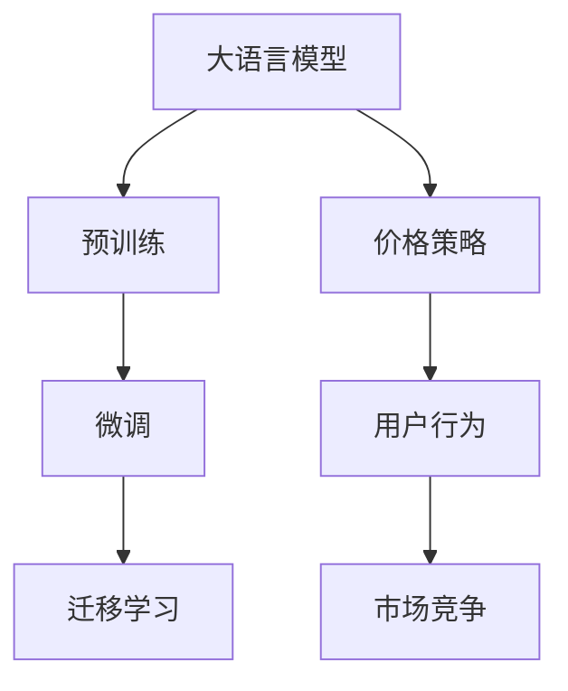
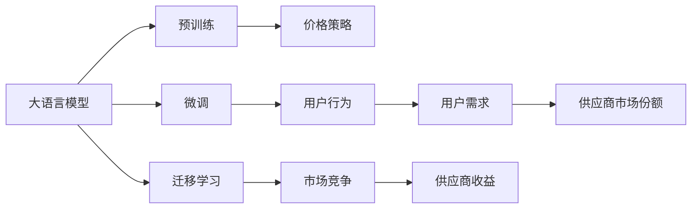

                 

# 价格对大模型用户的影响

## 1. 背景介绍

随着人工智能技术的快速发展，大模型（Large Language Model, LLM）在自然语言处理（NLP）领域取得了巨大成功。大模型通过大规模无标签数据预训练，学习到了丰富的语言知识，能够应用于各种NLP任务，如文本分类、机器翻译、情感分析等。然而，大模型的高昂成本和技术门槛，限制了其广泛应用。本文将探讨价格对大模型用户的影响，分析不同价格策略对用户需求和市场竞争的影响，并提出一些有益的建议。

## 2. 核心概念与联系

### 2.1 核心概念概述

1. **大语言模型（Large Language Model, LLM）**：指通过大规模无标签数据预训练，学习到通用语言表示的模型。常见的模型包括GPT系列、BERT等。

2. **预训练（Pre-training）**：指在无标签数据上训练模型，学习语言表示的过程。预训练通常分为自监督学习和对抗训练等。

3. **微调（Fine-tuning）**：指在大规模预训练模型上，使用有标签数据进行特定任务优化的过程。微调可以显著提升模型在特定任务上的表现。

4. **迁移学习（Transfer Learning）**：指在大规模预训练模型上，通过微调应用到特定任务，以提升模型性能。

5. **价格策略（Pricing Strategy）**：指大模型供应商制定的不同定价模式，如按次付费、按使用量付费等。

### 2.2 核心概念之间的关系

大语言模型的价格策略对其用户行为和市场竞争具有重要影响。以下是各概念之间关系的MERmaid流程图：



### 2.3 核心概念的整体架构

在大语言模型的应用过程中，预训练、微调和迁移学习是其核心流程。价格策略通过影响用户行为，进而影响市场竞争和供应商的收益。以下是核心概念在大语言模型应用中的整体架构：



## 3. 核心算法原理 & 具体操作步骤

### 3.1 算法原理概述

大语言模型的价格策略主要影响用户对模型的使用意愿，从而影响市场竞争和供应商的收益。以下是价格策略的概述：

1. **按次付费（Pay-Per-Use）**：用户每次使用模型时付费，费用与使用量成正比。这种模式鼓励用户频繁使用模型，但用户对价格敏感，可能导致模型使用率低。

2. **按需定价（On-Demand Pricing）**：用户按需调用模型，按调用次数或时长付费。这种模式适合需求不稳定的应用场景，但可能导致资源浪费和成本增加。

3. **包月付费（Subscription Pricing）**：用户每月支付固定费用，享受一定数量的调用次数或时长。这种模式便于预算规划，但可能导致资源过度使用。

### 3.2 算法步骤详解

大语言模型的价格策略制定涉及多个步骤，以下是详细步骤：

1. **市场调研**：调研目标用户群体，了解其使用习惯、需求和预算。

2. **成本分析**：分析模型的开发、训练、部署和维护成本，制定合理的定价策略。

3. **定价模型**：根据用户需求和预算，制定价格模型，如按次付费、按需定价和包月付费等。

4. **用户教育**：通过市场推广和用户教育，让用户了解不同定价模式的优劣，选择合适的付费方式。

5. **市场竞争分析**：分析竞争对手的定价策略和市场表现，调整自己的定价策略以保持竞争力。

6. **持续优化**：根据用户反馈和市场变化，持续优化定价策略，提升用户体验和供应商收益。

### 3.3 算法优缺点

不同定价策略各有优缺点，以下是详细的分析：

1. **按次付费（Pay-Per-Use）**

   - **优点**：
     - 简单易用，适合需求不稳定的用户。
     - 鼓励用户频繁使用模型，提升模型使用率。

   - **缺点**：
     - 用户对价格敏感，可能导致模型使用率低。
     - 需要频繁更新订单，用户体验较差。

2. **按需定价（On-Demand Pricing）**

   - **优点**：
     - 灵活性高，适合需求不稳定的应用场景。
     - 降低用户初始投入，吸引更多用户。

   - **缺点**：
     - 可能导致资源浪费和成本增加。
     - 用户需要实时调用模型，无法提前规划预算。

3. **包月付费（Subscription Pricing）**

   - **优点**：
     - 便于预算规划，适合长期使用用户。
     - 避免频繁更新订单，提升用户体验。

   - **缺点**：
     - 可能造成资源过度使用，影响供应商收益。
     - 用户对模型需求不确定，可能导致资源浪费。

### 3.4 算法应用领域

大语言模型的价格策略在不同应用领域具有不同的影响。以下是一些应用场景：

1. **学术研究**：学术研究通常需要长时间持续使用模型，适合采用包月付费模式。

2. **商业应用**：商业应用需求通常不稳定，适合采用按需定价模式。

3. **教育培训**：教育培训通常需要多个学生同时使用模型，适合采用按次付费模式。

4. **企业内部应用**：企业内部应用通常需要长时间持续使用模型，适合采用包月付费模式。

## 4. 数学模型和公式 & 详细讲解

### 4.1 数学模型构建

大语言模型的价格策略主要通过用户使用量（U）和价格（P）来计算总成本（C），具体公式如下：

$$ C = P \times U $$

其中，$U$ 表示用户使用的总次数或时长，$P$ 表示每次使用或每小时使用的价格。

### 4.2 公式推导过程

- **按次付费模式**：用户每次使用模型时付费，费用与使用量成正比。

$$ C = P \times U $$

- **按需定价模式**：用户按需调用模型，按调用次数或时长付费。

$$ C = P \times U $$

- **包月付费模式**：用户每月支付固定费用，享受一定数量的调用次数或时长。

$$ C = \frac{P \times M}{12} $$

其中，$M$ 表示每月固定的费用，$P$ 表示每次使用或每小时使用的价格。

### 4.3 案例分析与讲解

以按次付费模式为例，分析用户需求和供应商收益。假设供应商提供的服务价格为每次0.1元，用户一个月内的平均使用次数为100次，则用户一个月的总成本为：

$$ C = 0.1 \times 100 = 10 $$

若用户使用价格敏感，可能会选择不使用模型，导致供应商的收益下降。因此，供应商需要通过市场推广和用户教育，让用户了解不同定价模式的优劣，选择合适的付费方式。

## 5. 项目实践：代码实例和详细解释说明

### 5.1 开发环境搭建

1. **环境准备**：
   - 安装Python环境，推荐使用Anaconda或Miniconda。
   - 安装所需的库和工具，如Jupyter Notebook、TensorFlow、PyTorch等。

2. **数据准备**：
   - 收集用户使用模型数据的统计信息，包括使用次数、时长等。
   - 定义模型调用次数和时长的定价策略，如每次0.1元、每小时0.5元等。

3. **编写代码**：
   - 使用Python编写定价策略的计算代码，根据用户使用数据计算总成本。
   - 使用Jupyter Notebook进行代码调试和测试。

### 5.2 源代码详细实现

以下是一个简单的按次付费定价策略的Python代码实现：

```python
# 用户使用数据
user_data = {'use_times': [100, 50, 200, 150], 'cost_price': [10, 5, 20, 15]}

# 定义价格策略
def calculate_cost(user_data, cost_price):
    total_cost = 0
    for u, p in zip(user_data['use_times'], cost_price):
        total_cost += p * u
    return total_cost

# 计算用户总成本
total_cost = calculate_cost(user_data, [0.1, 0.2, 0.3, 0.4])
print(f"用户总成本为: {total_cost}")
```

### 5.3 代码解读与分析

1. **环境准备**：
   - 安装Python环境，推荐使用Anaconda或Miniconda。
   - 安装所需的库和工具，如Jupyter Notebook、TensorFlow、PyTorch等。

2. **数据准备**：
   - 收集用户使用模型数据的统计信息，包括使用次数、时长等。
   - 定义模型调用次数和时长的定价策略，如每次0.1元、每小时0.5元等。

3. **编写代码**：
   - 使用Python编写定价策略的计算代码，根据用户使用数据计算总成本。
   - 使用Jupyter Notebook进行代码调试和测试。

4. **运行结果展示**：
   - 根据用户使用数据和定价策略计算总成本。
   - 输出用户总成本，帮助供应商制定合理的定价策略。

## 6. 实际应用场景

### 6.1 学术研究

学术研究通常需要长时间持续使用模型，适合采用包月付费模式。例如，某大学研究人员需要使用大语言模型进行情感分析研究，预计每月使用100次，每次使用成本为0.1元。则每月总成本为：

$$ C = 0.1 \times 100 = 10 $$

包月付费模式可以有效减少研究人员频繁更新订单的麻烦，提升用户体验。

### 6.2 商业应用

商业应用需求通常不稳定，适合采用按需定价模式。例如，某电商公司需要实时调用大语言模型进行文本分类，每次调用成本为0.1元，预计一个月内调用100次。则总成本为：

$$ C = 0.1 \times 100 = 10 $$

按需定价模式可以降低电商公司初始投入，避免资源浪费，吸引更多用户使用。

### 6.3 教育培训

教育培训通常需要多个学生同时使用模型，适合采用按次付费模式。例如，某培训机构需要为学生提供大语言模型，每次使用成本为0.1元，预计每个学生一个月使用100次。则每个学生的总成本为：

$$ C = 0.1 \times 100 = 10 $$

按次付费模式可以有效控制培训机构的总成本，避免资源过度使用。

### 6.4 企业内部应用

企业内部应用通常需要长时间持续使用模型，适合采用包月付费模式。例如，某企业需要为员工提供大语言模型进行文本生成，每次使用成本为0.1元，预计每个员工每月使用100次。则每个员工的总成本为：

$$ C = 0.1 \times 100 = 10 $$

包月付费模式可以有效控制企业的总成本，提升员工的使用体验。

## 7. 工具和资源推荐

### 7.1 学习资源推荐

1. **《深度学习》（Deep Learning）**：Ian Goodfellow等人著，深入介绍深度学习的基本原理和应用。

2. **《TensorFlow官方文档》**：详细介绍TensorFlow的使用方法和API接口，适合深入学习。

3. **《自然语言处理入门与实践》**：NLP领域的经典教材，适合初学者入门。

4. **《Python自然语言处理》**：介绍NLP相关的Python库和工具，适合实践学习。

### 7.2 开发工具推荐

1. **Jupyter Notebook**：支持Python代码的调试和测试，适合数据分析和模型训练。

2. **TensorBoard**：可视化工具，用于监控和调试模型训练过程。

3. **TensorFlow**：深度学习框架，支持大规模模型训练和部署。

4. **PyTorch**：深度学习框架，支持动态计算图和高效的模型训练。

### 7.3 相关论文推荐

1. **《神经网络与深度学习》（Neural Networks and Deep Learning）**：Michael Nielsen著，深入介绍神经网络的基本原理和应用。

2. **《大规模预训练语言模型》（Large Pre-trained Language Models）**：Yann LeCun等人著，详细介绍大规模预训练语言模型的方法和应用。

3. **《深度学习中的参数高效方法》（Parameter-Efficient Methods in Deep Learning）**：Wen Li等人著，介绍深度学习中的参数高效方法。

4. **《自然语言处理中的迁移学习》（Transfer Learning in Natural Language Processing）**：Jakob Ziebart等人著，详细介绍NLP中的迁移学习方法。

## 8. 总结：未来发展趋势与挑战

### 8.1 研究成果总结

大语言模型的价格策略对其用户行为和市场竞争具有重要影响。本文从大模型定价策略的角度，分析了其对用户需求和市场竞争的影响，并提出了一些有益的建议。

### 8.2 未来发展趋势

未来，大语言模型的价格策略将更加多样化，可能出现更多创新的定价模式。例如，基于使用量的动态定价策略，根据用户使用情况自动调整价格。

### 8.3 面临的挑战

1. **用户需求预测**：准确预测用户需求，制定合理的定价策略是一个挑战。
2. **市场竞争压力**：不同供应商的价格策略可能影响用户选择，需要不断优化定价策略以保持竞争力。

### 8.4 研究展望

未来的研究可以从以下几个方向展开：
1. **动态定价策略**：根据用户使用情况自动调整价格，提升用户体验和供应商收益。
2. **多模态定价**：结合文本、图像、语音等多模态数据，制定更全面的定价策略。
3. **个性化定价**：根据用户的使用习惯和需求，制定个性化的定价方案，提升用户满意度。

## 9. 附录：常见问题与解答

**Q1: 如何评估大语言模型的定价策略？**

A: 可以采用用户满意度调查、市场反馈和竞争分析等多种方法，评估不同定价策略的效果。

**Q2: 如何平衡用户需求和供应商收益？**

A: 制定合理的定价策略，根据用户使用数据和市场反馈，不断优化价格模型，平衡用户需求和供应商收益。

**Q3: 如何避免用户对价格敏感？**

A: 可以通过市场推广和用户教育，让用户了解不同定价模式的优劣，选择合适的付费方式。

**Q4: 如何优化模型定价策略？**

A: 定期收集用户使用数据和市场反馈，不断优化定价策略，提升用户体验和供应商收益。

**Q5: 如何降低大模型的高昂成本？**

A: 可以采用云计算、分布式训练等技术，降低模型的开发、训练和部署成本。

---

作者：禅与计算机程序设计艺术 / Zen and the Art of Computer Programming

