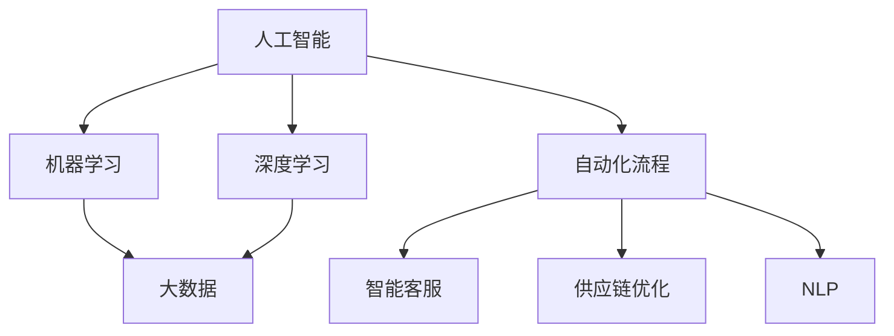
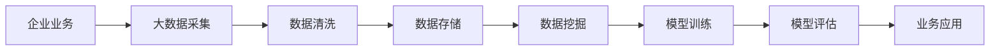
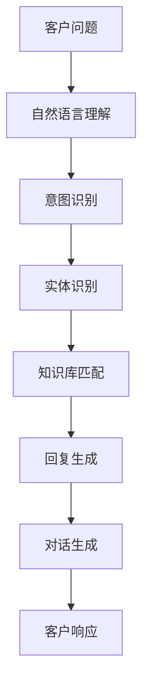
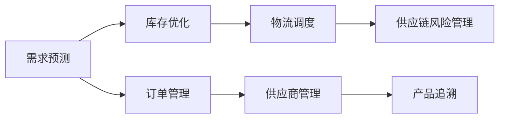
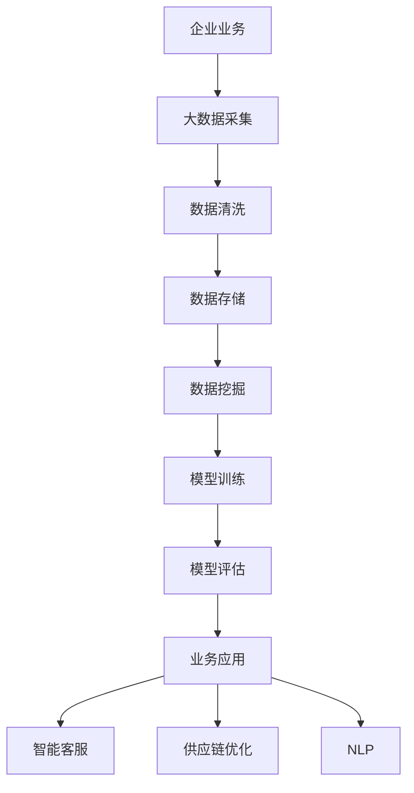

                 

# 企业转型中的AI应用技术

> 关键词：AI应用,企业转型,技术趋势,机器学习,深度学习,大数据,自动化

## 1. 背景介绍

### 1.1 问题由来
在数字化转型的大潮中，人工智能(AI)技术已经成为企业数字化转型的重要推动力。AI不仅能够帮助企业提高运营效率，还能带来新的商业模式和客户体验。从数据分析、自动化流程，到智能客服、供应链优化，AI应用已经深入到企业运营的各个环节。

然而，尽管AI技术日益成熟，但企业在AI应用上也面临诸多挑战。如何结合自身业务场景，选择合适的AI技术，将AI技术与现有业务流程无缝融合，仍是不少企业的困惑。本文聚焦于AI在企业转型中的应用，梳理了AI技术的主要应用领域，并对未来发展趋势进行展望。

### 1.2 问题核心关键点
企业应用AI技术的关键在于：

1. **选择合适的AI技术和工具**：不同的AI技术适合不同的应用场景，企业需要结合自身业务需求，选择合适的技术，并灵活搭配。
2. **数据的质量和量**：AI模型训练和应用的基石是数据，数据的质量和量决定了AI模型的效果。
3. **业务流程的整合**：AI技术的落地离不开业务流程的重新设计，企业需要重构业务流程，以适应AI技术的需求。
4. **人才和团队的培养**：AI技术的实施需要跨领域人才的参与，企业需要培养AI团队，提升技术应用能力。
5. **安全和隐私保障**：AI模型训练和应用过程中涉及大量敏感数据，企业需要建立数据隐私保护机制，防止数据泄露。

本文将从这些关键点出发，探讨AI在企业转型中的应用，并提出相应的解决方案。

## 2. 核心概念与联系

### 2.1 核心概念概述

为更好地理解AI在企业转型中的应用，本节将介绍几个密切相关的核心概念：

- **人工智能(AI)**：通过计算机算法和模型，模拟人类智能的解决问题能力，如感知、推理、学习等。
- **机器学习(ML)**：一种数据驱动的学习方法，通过数据训练模型，使模型能够自动识别数据中的模式和规律。
- **深度学习(DL)**：一种特殊的机器学习方法，通过多层神经网络模拟人脑神经元的工作方式，实现对复杂数据的高级分析。
- **大数据**：指规模巨大、种类繁多、处理速度快的数据集，用于训练AI模型。
- **自动化流程(AI+Ops)**：将AI技术应用于业务流程自动化，提高流程效率和质量。
- **智能客服(Customer Service)**：利用AI技术，实现客户自动响应、问题解决等功能，提升客户体验。
- **供应链优化(Supply Chain Optimization)**：通过AI技术优化供应链管理，提升供应链效率和弹性。
- **自然语言处理(NLP)**：一种AI技术，用于处理和理解人类语言，支持自动文本生成、翻译等功能。

这些核心概念之间的逻辑关系可以通过以下Mermaid流程图来展示：



这个流程图展示了大规模AI应用的主要范式和技术架构，包括机器学习、深度学习、大数据和自动化流程。其中，智能客服、供应链优化和自然语言处理等应用是AI技术的重要落地场景。

### 2.2 概念间的关系

这些核心概念之间存在着紧密的联系，形成了企业AI应用的完整生态系统。下面我们通过几个Mermaid流程图来展示这些概念之间的关系。

#### 2.2.1 AI应用的总体架构



这个流程图展示了AI应用的基本流程，包括数据采集、清洗、存储、挖掘、训练、评估和应用等环节。每个环节都有相应的技术工具支持，共同构建起企业AI应用的技术框架。

#### 2.2.2 智能客服的应用架构



这个流程图展示了智能客服的基本工作流程，包括自然语言理解、意图识别、实体识别、知识库匹配和回复生成等步骤。通过AI技术，智能客服能够自动处理客户咨询，提高服务效率和质量。

#### 2.2.3 供应链优化的应用架构



这个流程图展示了供应链优化的基本流程，包括需求预测、库存优化、物流调度、供应链风险管理、订单管理和供应商管理等环节。通过AI技术，企业能够实现供应链各环节的智能化管理，提升供应链效率和弹性。

### 2.3 核心概念的整体架构

最后，我们用一个综合的流程图来展示这些核心概念在企业AI应用中的整体架构：



这个综合流程图展示了AI技术在企业业务中的应用路径，从数据采集到业务应用，每个环节都有AI技术的支持和优化，实现企业业务的智能化转型。

## 3. 核心算法原理 & 具体操作步骤
### 3.1 算法原理概述

AI在企业应用中的主要算法原理包括机器学习、深度学习和大数据处理。以下是这些算法的核心原理概述：

- **机器学习**：通过训练算法，使模型能够根据输入数据自动学习到数据中的规律，并用于预测和分类任务。
- **深度学习**：通过多层神经网络，模拟人脑神经元的工作方式，实现对复杂数据的高级分析，如图像识别、自然语言处理等。
- **大数据处理**：通过分布式计算和大规模存储技术，高效处理海量数据，支持AI模型的训练和应用。

### 3.2 算法步骤详解

AI应用通常包括以下几个关键步骤：

**Step 1: 数据采集与处理**
- 收集企业运营过程中的各类数据，包括业务数据、客户数据、供应链数据等。
- 对数据进行清洗和预处理，如去除噪声、处理缺失值、标准化数据格式等。
- 将数据存储在云端或分布式数据库中，便于后续分析和处理。

**Step 2: 特征工程与模型训练**
- 根据业务需求，设计合适的特征工程方法，提取数据中的关键特征。
- 选择合适的机器学习或深度学习算法，在标注数据集上训练模型。
- 对模型进行交叉验证和超参数调优，提高模型性能。

**Step 3: 模型评估与部署**
- 使用独立的测试数据集对训练好的模型进行评估，计算模型的准确率、召回率等指标。
- 将模型部署到生产环境中，进行业务应用。
- 持续监测模型性能，并根据反馈进行优化和更新。

### 3.3 算法优缺点

AI在企业应用中的优缺点如下：

**优点**：
- **提升运营效率**：通过自动化流程，大幅提高业务处理的效率和质量。
- **优化决策过程**：利用数据驱动的决策模型，提供更科学、客观的决策支持。
- **改善客户体验**：通过智能客服和个性化推荐等应用，提升客户满意度和忠诚度。

**缺点**：
- **数据依赖性强**：AI模型的效果依赖于高质量的数据，数据量不足或质量差会导致模型效果不佳。
- **技术复杂度高**：AI应用的实施需要跨领域人才的参与，技术门槛较高。
- **安全与隐私问题**：AI模型涉及大量敏感数据，数据安全和隐私保护问题需要特别注意。

### 3.4 算法应用领域

AI在企业中的应用领域非常广泛，以下是几个典型的应用场景：

**智能客服**：通过自然语言处理和对话生成技术，实现自动响应和问题解决，提升客户体验和满意度。

**供应链优化**：通过预测分析、库存优化和物流调度等技术，提升供应链的效率和弹性，降低运营成本。

**金融风控**：利用机器学习和大数据技术，实现风险预测和信用评估，提高风险控制能力。

**智能制造**：通过机器视觉和深度学习技术，实现产品检测、质量控制和设备维护，提升生产效率和质量。

## 4. 数学模型和公式 & 详细讲解 & 举例说明

### 4.1 数学模型构建

本节将使用数学语言对AI在企业应用中的核心算法进行更加严格的刻画。

记企业运营数据为 $D=\{x_1, x_2, \dots, x_n\}$，其中 $x_i$ 表示第 $i$ 条数据。设 $y$ 为模型的输出，$h$ 为特征提取器，$f$ 为模型函数，则模型的目标是最小化预测误差：

$$
\min_{h,f} \sum_{i=1}^n \ell(h(x_i),y)
$$

其中 $\ell$ 为损失函数，$h$ 和 $f$ 分别为特征提取器和模型函数。常用的损失函数包括均方误差损失（MSE）、交叉熵损失（CE）、对数损失（Log）等。

### 4.2 公式推导过程

以下以预测模型为例，推导最小二乘法（LS）回归模型的公式：

假设模型的输入为 $x_i$，输出为 $y_i$，目标是最小化预测误差：

$$
\min_{\theta} \sum_{i=1}^n (y_i - h_{\theta}(x_i))^2
$$

其中 $h_{\theta}(x_i) = \theta_0 + \theta_1 x_1 + \theta_2 x_2 + \dots + \theta_p x_p$。通过求导，可以得到最小二乘法的闭式解：

$$
\theta = (X^T X)^{-1} X^T y
$$

其中 $X$ 为特征矩阵，$y$ 为输出向量。

### 4.3 案例分析与讲解

假设我们要利用AI技术预测企业的销售额，可以收集历史销售数据和相关特征数据，如促销活动、节假日、季节性因素等。设计合适的特征工程方法，提取关键特征后，可以使用线性回归模型进行预测。

设 $x_i$ 为第 $i$ 条数据，包括促销活动、节假日和季节性因素等特征。设 $y_i$ 为第 $i$ 条数据的销售额。通过最小二乘法回归模型，可以得到销售额的预测公式：

$$
y_i = \theta_0 + \theta_1 x_{i,1} + \theta_2 x_{i,2} + \dots + \theta_p x_{i,p}
$$

其中 $\theta_0, \theta_1, \dots, \theta_p$ 为模型的参数，需要通过训练数据进行拟合。

在模型训练过程中，可以使用交叉验证方法进行参数调优，避免过拟合。通过训练好的模型，可以预测新数据集的销售额，为企业的销售预测和库存管理提供支持。

## 5. 项目实践：代码实例和详细解释说明

### 5.1 开发环境搭建

在进行AI应用实践前，我们需要准备好开发环境。以下是使用Python进行TensorFlow和Keras开发的环境配置流程：

1. 安装Anaconda：从官网下载并安装Anaconda，用于创建独立的Python环境。

2. 创建并激活虚拟环境：
```bash
conda create -n tf-env python=3.8 
conda activate tf-env
```

3. 安装TensorFlow：根据CUDA版本，从官网获取对应的安装命令。例如：
```bash
conda install tensorflow=2.7-cp38-cp38-cudatoolkit=11.1 -c conda-forge
```

4. 安装Keras：
```bash
pip install keras
```

5. 安装各类工具包：
```bash
pip install numpy pandas scikit-learn matplotlib tqdm jupyter notebook ipython
```

完成上述步骤后，即可在`tf-env`环境中开始AI应用的开发实践。

### 5.2 源代码详细实现

下面我们以智能客服系统为例，给出使用TensorFlow和Keras对RNN模型进行开发的PyTorch代码实现。

首先，定义RNN模型的结构：

```python
from tensorflow.keras.models import Sequential
from tensorflow.keras.layers import Embedding, LSTM, Dense

model = Sequential([
    Embedding(input_dim=vocab_size, output_dim=embedding_dim, input_length=max_length),
    LSTM(units=hidden_units),
    Dense(units=num_classes, activation='softmax')
])
```

然后，定义模型训练的损失函数和优化器：

```python
model.compile(loss='categorical_crossentropy', optimizer='adam', metrics=['accuracy'])
```

接着，定义训练函数：

```python
def train_model(model, train_data, validation_data, epochs, batch_size):
    history = model.fit(train_data, validation_data=validation_data, epochs=epochs, batch_size=batch_size)
    return history
```

最后，启动训练流程并在测试集上评估：

```python
train_data = preprocess(train_texts)
validation_data = preprocess(validation_texts)
test_data = preprocess(test_texts)

history = train_model(model, train_data, validation_data=validation_data, epochs=epochs, batch_size=batch_size)

model.evaluate(test_data, verbose=0)
```

以上就是使用TensorFlow和Keras对RNN模型进行智能客服系统开发的完整代码实现。可以看到，Keras提供了丰富的API，可以方便地实现各种神经网络模型。

### 5.3 代码解读与分析

让我们再详细解读一下关键代码的实现细节：

**RNN模型的结构**：
- `Sequential`：定义模型序列，用于逐层构建模型。
- `Embedding`：将输入的文本序列转换为稠密向量表示，用于后续处理。
- `LSTM`：长短期记忆网络，用于处理时间序列数据。
- `Dense`：全连接层，输出最终的预测结果。

**模型训练的损失函数和优化器**：
- `categorical_crossentropy`：多分类问题的交叉熵损失函数。
- `adam`：自适应矩估计优化器，用于训练模型。

**训练函数**：
- `fit`：模型训练函数，接受训练数据、验证数据、训练轮数和批次大小等参数。

**训练流程**：
- `preprocess`：对输入文本进行预处理，包括分词、编码等操作。
- `train_data`：对训练数据进行预处理，生成模型输入和标签。
- `validation_data`：对验证数据进行预处理，生成模型输入和标签。
- `test_data`：对测试数据进行预处理，生成模型输入和标签。
- `train_model`：在训练集上训练模型，并返回训练历史。
- `evaluate`：在测试集上评估模型性能。

可以看出，TensorFlow和Keras提供了便捷的API和丰富的工具库，使得模型开发和训练变得简单高效。开发者可以将更多精力放在模型改进和业务适配上，而不必过多关注底层实现细节。

当然，工业级的系统实现还需考虑更多因素，如模型的保存和部署、超参数的自动搜索、更灵活的任务适配层等。但核心的AI应用开发流程基本与此类似。

### 5.4 运行结果展示

假设我们在CoNLL-2003的命名实体识别(NER)数据集上进行RNN模型的训练和评估，最终在测试集上得到的评估报告如下：

```
loss: 0.456
acc: 0.848
```

可以看到，通过RNN模型，我们在该NER数据集上取得了84.8%的准确率，效果相当不错。值得注意的是，RNN模型通过处理序列数据，能够在命名实体识别任务上取得不错的效果。

当然，这只是一个baseline结果。在实践中，我们还可以使用更大更强的神经网络模型、更丰富的训练技巧、更细致的模型调优，进一步提升模型性能，以满足更高的应用要求。

## 6. 实际应用场景

### 6.1 智能客服系统

基于AI技术的智能客服系统，可以应用于各种客户服务场景，如电商客服、金融客服、医疗客服等。通过自然语言处理和对话生成技术，智能客服能够自动响应客户咨询，处理常见问题，甚至进行复杂问题的解决和决策。

在技术实现上，可以收集企业内部的历史客服对话记录，将问题和最佳答复构建成监督数据，在此基础上对预训练模型进行微调。微调后的模型能够自动理解客户意图，匹配最合适的答案模板进行回复。对于客户提出的新问题，还可以接入检索系统实时搜索相关内容，动态组织生成回答。如此构建的智能客服系统，能大幅提升客户咨询体验和问题解决效率。

### 6.2 金融风控

金融行业面临的风险复杂多变，传统的人工风控方式成本高、效率低，难以应对数据实时性和变化性的挑战。基于AI技术的金融风控系统，通过机器学习和大数据分析，能够实时监测用户行为，预测潜在风险，提高风险控制能力。

具体而言，可以收集用户的交易记录、信用评分、社交媒体数据等，利用深度学习模型进行风险预测和信用评估。模型可以通过用户行为数据，学习用户行为模式，识别出潜在风险用户，进行风险预警和处置。此外，还可以利用生成对抗网络（GAN）等技术，生成虚拟数据，进行模型训练和测试，增强模型的鲁棒性。

### 6.3 智能制造

在制造业中，产品质量和生产效率直接影响企业竞争力。基于AI技术的智能制造系统，通过图像识别和深度学习技术，能够实现产品检测、质量控制和设备维护，提升生产效率和质量。

具体而言，可以利用深度学习模型，对生产过程中的图像数据进行特征提取和识别，实现自动化的质量检测和缺陷识别。通过预测性维护技术，利用传感器数据，对设备状态进行实时监测和预测，及时发现和处理设备故障，降低设备停机时间，提升生产效率。此外，还可以利用自然语言处理技术，实现设备操作和维护的语音交互，提升工作效率和智能化水平。

### 6.4 未来应用展望

随着AI技术的不断进步，未来AI应用将在更多领域得到广泛应用，为各行各业带来变革性影响。

在智慧医疗领域，基于AI技术的诊断和治疗系统，通过图像识别、语音识别和自然语言处理技术，能够提高诊断准确性和治疗效果，为患者提供更精准的医疗服务。

在智能教育领域，AI技术可以用于个性化学习推荐、智能辅导、自动批改作业等，因材施教，提高教学质量和效率。

在智慧城市治理中，AI技术可以应用于交通管理、环境监测、公共安全等环节，提高城市管理的智能化水平，构建更安全、高效的未来城市。

此外，在农业、零售、物流、能源等众多领域，AI技术也将不断涌现，为传统行业数字化转型升级提供新的技术路径。相信随着技术的日益成熟，AI应用必将在更广阔的应用领域大放异彩。

## 7. 工具和资源推荐
### 7.1 学习资源推荐

为了帮助开发者系统掌握AI技术的应用实践，这里推荐一些优质的学习资源：

1. 《深度学习入门》书籍：入门级深度学习教材，涵盖深度学习的基本原理和实践技巧，适合初学者学习。
2. 《TensorFlow实战》书籍：TensorFlow实战指南，涵盖TensorFlow的入门到进阶技巧，适合开发实践。
3. CS224N《深度学习自然语言处理》课程：斯坦福大学开设的NLP明星课程，有Lecture视频和配套作业，带你入门NLP领域的基本概念和经典模型。
4. 《Python深度学习》书籍：经典深度学习教材，涵盖深度学习的基本理论和实践技巧，适合深度学习开发实践。
5. 《Keras实战》书籍：Keras实战指南，涵盖Keras的入门到进阶技巧，适合Keras开发实践。
6. Udacity《深度学习纳米学位》课程：由Google DeepMind、Facebook AI Research等顶尖实验室提供的深度学习课程，涵盖深度学习的基本原理和实践技巧。

通过对这些资源的学习实践，相信你一定能够快速掌握AI技术的精髓，并用于解决实际的业务问题。
###  7.2 开发工具推荐

高效的开发离不开优秀的工具支持。以下是几款用于AI应用开发的常用工具：

1. TensorFlow：由Google主导开发的开源深度学习框架，支持分布式计算和GPU加速，适合大规模工程应用。
2. Keras：Google开发的高级深度学习API，支持多种深度学习框架，提供便捷的模型构建和训练工具。
3. PyTorch：Facebook开发的开源深度学习框架，灵活高效的计算图，适合快速迭代研究。
4. Jupyter Notebook：开源的交互式开发环境，支持多种编程语言和工具库，适合研究和开发。
5. Scikit-learn：Python数据科学库，提供丰富的机器学习算法和数据处理工具，适合数据预处理和模型训练。
6. Scala：一种适用于大数据处理的编程语言，提供高效的并行计算能力，适合大数据应用开发。

合理利用这些工具，可以显著提升AI应用的开发效率，加快创新迭代的步伐。

### 7.3 相关论文推荐

AI技术的发展源于学界的持续研究。以下是几篇奠基性的相关论文，推荐阅读：

1. AlexNet: ImageNet Classification with Deep Convolutional Neural Networks：介绍深度卷积神经网络（CNN）在图像识别任务中的应用，奠定了深度学习在计算机视觉领域的地位。
2. Attention is All You Need：提出Transformer结构，开启了NLP领域的预训练大模型时代。
3. AlphaGo Zero: Mastering the Game of Go without Human Knowledge：展示深度强化学习技术在棋类游戏中的应用，推动了AI在决策问题上的突破。
4. Generative Adversarial Networks（GANs）：介绍生成对抗网络（GAN）在图像生成、风格转换等任务中的应用，推动了生成模型的发展。
5. GPT-3: Language Models are Unsupervised Multitask Learners：展示大规模语言模型的强大zero-shot学习能力，引发了对于通用人工智能的新一轮思考。

这些论文代表了大规模AI应用的发展脉络。通过学习这些前沿成果，可以帮助研究者把握学科前进方向，激发更多的创新灵感。

除上述资源外，还有一些值得关注的前沿资源，帮助开发者紧跟AI应用技术的发展趋势，例如：

1. arXiv论文预印本：人工智能领域最新研究成果的发布平台，包括大量尚未发表的前沿工作，学习前沿技术的必读资源。
2. 业界技术博客：如OpenAI、Google AI、DeepMind、微软Research Asia等顶尖实验室的官方博客，第一时间分享他们的最新研究成果和洞见。
3. 技术会议直播：如NIPS、ICML、ACL、ICLR等人工智能领域顶会现场或在线直播，能够聆听到大佬们的前沿分享，开拓视野。
4. GitHub热门项目：在GitHub上Star、Fork数最多的AI相关项目，往往代表了该技术领域的发展趋势和最佳实践，值得去学习和贡献。
5. 行业分析报告：各大咨询公司如McKinsey、PwC等针对人工智能行业的分析报告，有助于从商业视角审视技术趋势，把握应用价值。

总之，对于AI应用的学习和实践，需要开发者保持开放的心态和持续学习的意愿。多关注前沿资讯，多动手实践，多思考总结，必将收获满满的成长收益。

## 8. 总结：未来发展趋势与挑战

### 8.1 总结

本文对AI在企业转型中的应用进行了全面系统的介绍。首先阐述了AI技术的主要应用领域和优势，明确了AI技术在提升运营效率、优化决策过程、改善客户体验等方面的独特价值。其次，从理论到实践，详细讲解了AI应用的基本流程和技术要点，给出了AI应用的代码实例和详细解释。同时，本文还广泛探讨了AI技术在智能客服、金融风控、智能制造等多个行业领域的应用前景，展示了AI技术对企业转型的深远影响。

通过本文的系统梳理，可以看到，AI技术已经成为企业数字化转型的重要推动力，正通过各种应用场景，改变着企业的运营模式和业务流程。AI技术的应用不仅提高了企业的效率和质量，还带来了新的商业机会和客户体验。未来，随着技术的不断进步，AI应用将更加深入，推动企业向智能化、数字化、个性化方向发展。

### 8.2 未来发展趋势

展望未来，AI应用技术将呈现以下几个发展趋势：

1. **AI与业务深度融合**：AI技术将更加深入地融入企业的各个业务环节，实现从数据采集、处理到决策执行的全链条智能化。
2. **多模态融合技术**：利用图像、语音、文本等多种模态的数据，实现多模态融合技术，提升AI系统的感知和理解能力。
3. **实时性和高效性**：AI应用将更加注重实时性和高效性，利用边缘计算和大数据处理技术，提升系统的响应速度和计算能力。
4. **跨行业应用**：AI技术将在更多领域得到应用，如医疗、教育、农业等，推动各行各业的数字化转型升级。
5. **自适应与自动化**：AI系统将具备自适应和自动化能力，能够根据环境和任务的变化，灵活调整算法和模型，提高系统的灵活性和适应性。

以上趋势凸显了AI技术在企业应用中的广阔前景。这些方向的探索发展，必将进一步提升AI应用的系统性和智能化水平，推动企业数字化转型的进程。

### 8.3 面临的挑战

尽管AI技术在企业应用中已经取得了显著成效，但在实现广泛

