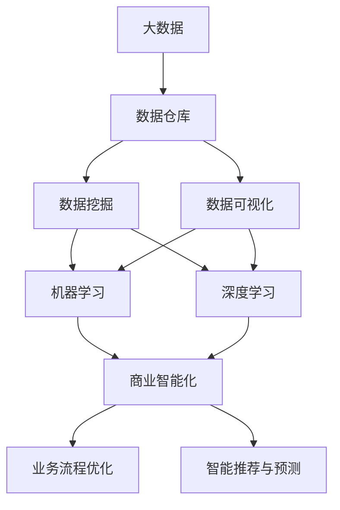
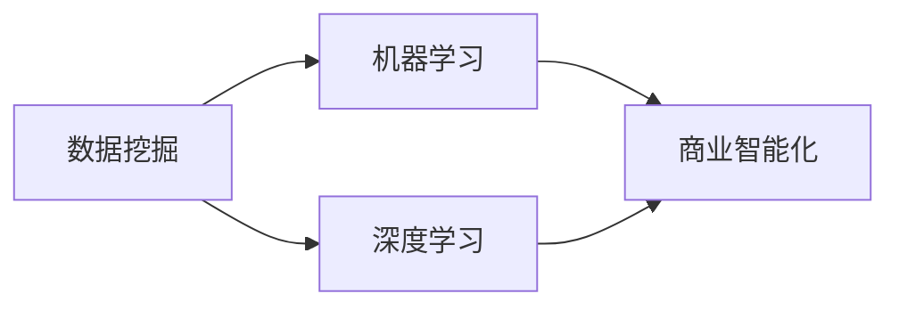
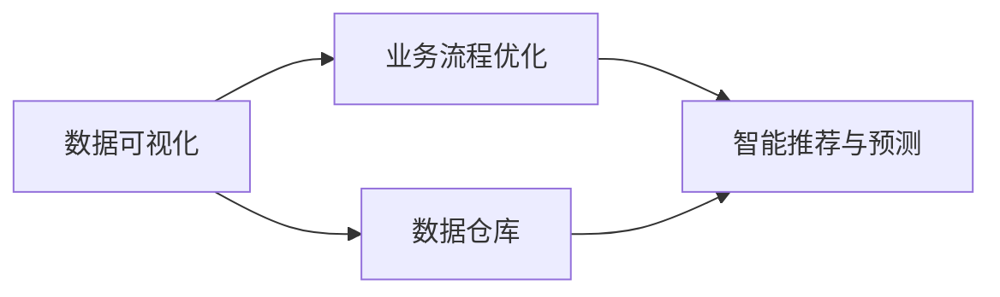
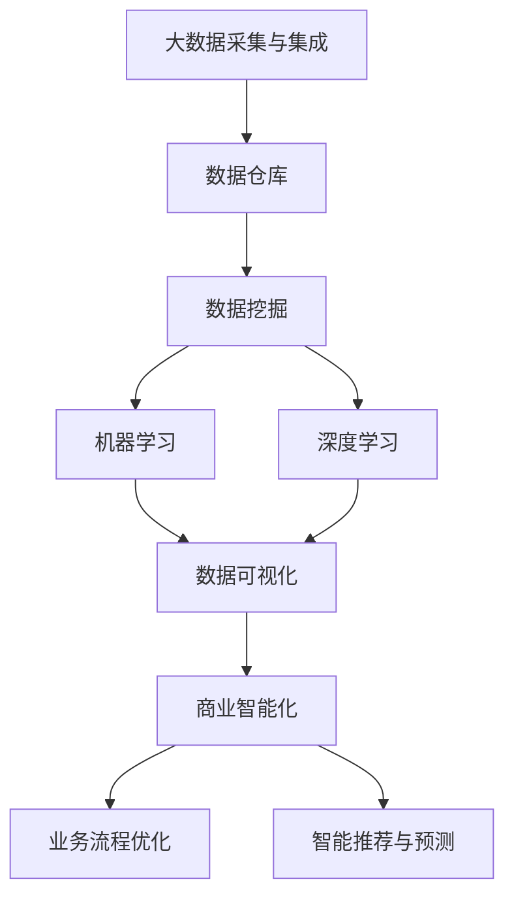

                 

# 信息差的商业智能化：大数据如何推动商业智能化

## 1. 背景介绍

### 1.1 问题由来
在数字化转型的浪潮中，数据逐渐成为企业核心资产的一部分。数据驱动的决策能力正在快速提升，但如何高效利用海量数据，揭示背后的信息差，进而驱动商业智能化的发展，成为当前的热点问题。

在传统商业活动中，由于信息不对称、数据不完整、分析能力不足等原因，企业常常面临数据驱动能力不足的问题。而随着大数据技术的发展，企业可以利用数据洞察市场趋势、优化运营决策、增强客户体验等，从而实现商业智能化的提升。

### 1.2 问题核心关键点
要实现基于大数据的商业智能化，核心在于如何高效地利用数据。以下是商业智能化的几个核心要素：

- **数据采集与集成**：企业需要从多个渠道采集数据，并进行清洗、整合和标准化，构建统一的数据视图。
- **数据分析与挖掘**：利用数据分析模型和算法，发现数据中的潜在规律和关联，提升决策的准确性和科学性。
- **数据可视化**：通过图表、仪表盘等方式，将分析结果直观展示，帮助企业决策者更好地理解数据。
- **业务流程优化**：利用数据洞察和分析结果，优化业务流程，提升运营效率。
- **智能推荐与预测**：根据用户行为和偏好，提供个性化推荐和预测分析，增强客户体验。

要解决以上核心问题，需要在大数据技术的基础上，结合人工智能、机器学习等技术，构建一个全方位、多层次的商业智能化体系。

### 1.3 问题研究意义
在大数据和人工智能技术的推动下，商业智能化的发展正处于关键时刻。研究如何利用大数据驱动商业智能化，对于提升企业决策能力、优化运营效率、增强客户体验等方面具有重要意义：

- **提升决策能力**：利用数据驱动决策，可以更准确地洞察市场趋势和机会，提高企业竞争力。
- **优化运营效率**：数据驱动的运营优化，可以有效降低成本，提高资源利用效率。
- **增强客户体验**：通过个性化推荐和预测，提升客户满意度，增强客户忠诚度。
- **推动创新发展**：基于数据洞见的创新决策，可以帮助企业开拓新市场，引领行业发展。
- **应对市场变化**：数据驱动的实时分析，使企业能够快速响应市场变化，避免损失。

## 2. 核心概念与联系

### 2.1 核心概念概述

为更好地理解大数据如何推动商业智能化，本节将介绍几个关键概念：

- **大数据(Big Data)**：指超大规模、高速增长、多样化的数据集合，涵盖结构化、半结构化和非结构化数据。
- **商业智能化(Business Intelligence, BI)**：指利用数据驱动商业决策，优化运营流程，提升客户体验的智能过程。
- **数据仓库(Data Warehouse)**：指一个集中存储企业历史数据的系统，支持复杂的数据分析与查询。
- **数据挖掘(Data Mining)**：指从数据集中自动发现模式和关系的过程，为商业决策提供依据。
- **数据可视化(Data Visualization)**：指通过图表、仪表盘等方式，将数据直观展示，便于理解和决策。
- **机器学习(Machine Learning)**：指利用数据训练模型，进行预测和决策的技术。
- **深度学习(Deep Learning)**：指利用多层神经网络模型，处理复杂数据结构的技术。

这些核心概念之间的逻辑关系可以通过以下Mermaid流程图来展示：



这个流程图展示了大数据、数据仓库、数据挖掘、数据可视化、机器学习和深度学习等核心概念之间的关系，以及它们如何共同驱动商业智能化的过程。

### 2.2 概念间的关系

这些核心概念之间存在着紧密的联系，形成了商业智能化的完整生态系统。下面我们通过几个Mermaid流程图来展示这些概念之间的关系。

#### 2.2.1 大数据与商业智能化的关系


这个流程图展示了大数据如何通过数据仓库、数据挖掘和数据可视化等环节，支持商业智能化的发展。

#### 2.2.2 数据挖掘与商业智能化的关系



这个流程图展示了数据挖掘如何通过机器学习和深度学习等技术，提升商业智能化的深度和广度。

#### 2.2.3 数据可视化与商业智能化的关系



这个流程图展示了数据可视化如何通过业务流程优化和智能推荐等环节，帮助企业实现商业智能化。

### 2.3 核心概念的整体架构

最后，我们用一个综合的流程图来展示这些核心概念在大数据驱动下的商业智能化过程：



这个综合流程图展示了从大数据采集与集成到数据可视化的全过程，以及这些环节如何通过机器学习和深度学习等技术，推动商业智能化的发展。

## 3. 核心算法原理 & 具体操作步骤
### 3.1 算法原理概述

大数据驱动的商业智能化，本质上是通过数据分析、挖掘和可视化技术，实现数据的洞察和应用。其核心在于构建数据驱动的决策机制，将数据转化为可执行的商业策略。

形式化地，商业智能化的过程可以表示为：

$$
\text{BI} = f(\text{Data Warehouse}, \text{Data Mining}, \text{Data Visualization})
$$

其中，$\text{Data Warehouse}$ 指数据仓库，负责存储和管理历史数据；$\text{Data Mining}$ 指数据挖掘，利用算法从数据中发现模式和关联；$\text{Data Visualization}$ 指数据可视化，通过图表、仪表盘等方式展示分析结果。

在实际操作中，商业智能化的过程需要跨学科的知识和技术支持，涵盖数据工程、统计学、计算机科学等多个领域。

### 3.2 算法步骤详解

基于大数据的商业智能化通常包括以下几个关键步骤：

**Step 1: 数据采集与集成**
- 收集来自不同渠道的数据，包括交易数据、客户数据、市场数据等。
- 对数据进行清洗和整合，消除数据冗余和异常值，构建统一的数据视图。

**Step 2: 数据仓库构建**
- 搭建数据仓库，存储和管理历史数据。
- 设计合适的数据模型，支持高效的数据查询和分析。
- 建立数据访问权限和访问控制机制，保障数据安全。

**Step 3: 数据挖掘与分析**
- 选择合适的算法，如回归分析、聚类分析、分类算法等，对数据进行挖掘和分析。
- 利用统计工具和可视化技术，对分析结果进行可视化展示。
- 结合业务知识，对分析结果进行解读和应用。

**Step 4: 数据可视化**
- 根据分析结果，设计合适的图表、仪表盘等可视化工具。
- 将分析结果直观展示，帮助决策者理解和应用数据。
- 定期更新可视化界面，及时反映最新的分析结果。

**Step 5: 业务流程优化**
- 根据分析结果，调整和优化业务流程。
- 利用数据驱动的决策，提升运营效率和资源利用率。
- 定期评估优化效果，持续改进业务流程。

**Step 6: 智能推荐与预测**
- 利用数据挖掘结果，设计个性化推荐和预测模型。
- 结合用户行为和偏好，提供个性化的推荐和预测服务。
- 根据反馈结果，不断调整和优化推荐模型。

以上是商业智能化的主要步骤，每个步骤都需要结合具体的业务场景和数据特点，进行灵活设计和实施。

### 3.3 算法优缺点

大数据驱动的商业智能化具有以下优点：

- **全面性**：涵盖全面数据，包括结构化、半结构化和非结构化数据，涵盖不同业务领域的多个数据源。
- **准确性**：基于大量的历史数据和复杂算法，提供高精度的分析和预测。
- **实时性**：利用数据仓库和大数据技术，实现数据的实时分析和可视化。
- **可扩展性**：数据仓库和大数据技术的可扩展性，使得系统可以处理不断增长的数据量。

但同时也存在以下缺点：

- **成本高**：构建数据仓库和数据管道需要大量的硬件和软件投入。
- **复杂度大**：系统涉及多个环节和多个技术，需要跨学科的知识和技能。
- **技术门槛高**：涉及复杂的数据处理和算法设计，需要高水平的技术团队支持。
- **数据隐私和安全问题**：涉及大量敏感数据，需要严格的数据安全和隐私保护措施。

### 3.4 算法应用领域

基于大数据的商业智能化技术，已经广泛应用于多个领域，包括但不限于：

- **零售业**：通过分析交易数据、客户数据等，优化库存管理、提升客户体验。
- **金融业**：利用金融数据进行风险管理、信用评估、客户服务等。
- **制造业**：通过分析生产数据、设备数据等，优化生产流程、提高生产效率。
- **医疗健康**：利用医疗数据进行疾病预测、健康管理、药品研发等。
- **物流行业**：通过分析运输数据、库存数据等，优化物流管理、提高配送效率。
- **政府部门**：利用政务数据进行公共管理、城市规划、公共服务优化等。

这些领域的实际应用，已经证明了大数据驱动的商业智能化技术的巨大价值。

## 4. 数学模型和公式 & 详细讲解 & 举例说明
### 4.1 数学模型构建

商业智能化的数学模型通常包括以下几个部分：

- **数据采集与集成**：通过ETL（Extract, Transform, Load）流程，从多个数据源采集数据，并进行清洗和整合。
- **数据仓库**：构建星型模型或雪花模型，存储和管理历史数据。
- **数据挖掘**：利用统计模型、机器学习模型等，从数据中发现模式和关联。
- **数据可视化**：通过可视化工具展示分析结果，如柱状图、折线图、散点图等。

### 4.2 公式推导过程

以回归分析为例，展示数据分析的基本过程：

假设我们有n个样本数据 $(x_i, y_i)$，其中 $x_i$ 为自变量， $y_i$ 为因变量。我们的目标是通过这些数据，建立 $y$ 关于 $x$ 的线性回归模型。

设回归模型为：

$$
y_i = \beta_0 + \beta_1x_i + \epsilon_i
$$

其中 $\beta_0$ 为截距，$\beta_1$ 为斜率，$\epsilon_i$ 为误差项。我们的目标是最小化误差项的平方和，即：

$$
\min_{\beta_0, \beta_1} \sum_{i=1}^n \epsilon_i^2
$$

根据最小二乘法，求解最优的 $\beta_0$ 和 $\beta_1$：

$$
\hat{\beta}_0 = \frac{\sum_{i=1}^n (y_i - \bar{y}) \cdot x_i}{\sum_{i=1}^n x_i^2}
$$

$$
\hat{\beta}_1 = \frac{\sum_{i=1}^n (y_i - \bar{y})}{\sum_{i=1}^n x_i^2}
$$

其中 $\bar{y}$ 为 $y$ 的均值。

通过回归模型，我们可以对新的数据进行预测，从而支持商业决策。例如，在零售业中，可以利用销售数据和促销活动数据，建立销售预测模型，优化库存管理。

### 4.3 案例分析与讲解

假设某电商平台收集了过去一年中的销售数据和促销活动数据，我们想要分析促销活动对销售量的影响。

首先，我们采集并清洗数据，构建数据仓库。然后，设计合适的统计模型，如回归分析，对数据进行挖掘和分析。得到以下回归模型：

$$
\hat{y} = 100 + 20x_1 + 10x_2 - 5x_3
$$

其中 $x_1$ 为促销活动投入金额，$x_2$ 为广告投入金额，$x_3$ 为商品类别。我们可以利用这个模型，预测不同促销策略下的销售量，从而优化促销活动，提升销售效果。

## 5. 项目实践：代码实例和详细解释说明
### 5.1 开发环境搭建

在进行商业智能化项目实践前，我们需要准备好开发环境。以下是使用Python进行PyTorch开发的环境配置流程：

1. 安装Anaconda：从官网下载并安装Anaconda，用于创建独立的Python环境。

2. 创建并激活虚拟环境：
```bash
conda create -n pytorch-env python=3.8 
conda activate pytorch-env
```

3. 安装PyTorch：根据CUDA版本，从官网获取对应的安装命令。例如：
```bash
conda install pytorch torchvision torchaudio cudatoolkit=11.1 -c pytorch -c conda-forge
```

4. 安装各类工具包：
```bash
pip install numpy pandas scikit-learn matplotlib tqdm jupyter notebook ipython
```

完成上述步骤后，即可在`pytorch-env`环境中开始商业智能化实践。

### 5.2 源代码详细实现

以下是使用Python进行回归分析的代码实现，以电商销售预测为例：

```python
import pandas as pd
import numpy as np
from sklearn.linear_model import LinearRegression
from sklearn.model_selection import train_test_split
from sklearn.metrics import mean_squared_error, r2_score

# 加载数据
data = pd.read_csv('sales_data.csv')

# 数据清洗和预处理
data.dropna(inplace=True)
data['promotion'] = pd.factorize(data['promotion'])[0]
data['advertisement'] = pd.factorize(data['advertisement'])[0]
data['category'] = pd.factorize(data['category'])[0]
data = data.drop(['id', 'date'], axis=1)

# 划分训练集和测试集
X = data.drop('sales', axis=1)
y = data['sales']
X_train, X_test, y_train, y_test = train_test_split(X, y, test_size=0.2, random_state=42)

# 训练线性回归模型
model = LinearRegression()
model.fit(X_train, y_train)

# 预测测试集
y_pred = model.predict(X_test)

# 评估模型
mse = mean_squared_error(y_test, y_pred)
r2 = r2_score(y_test, y_pred)
print(f'Mean Squared Error: {mse:.2f}')
print(f'R^2 Score: {r2:.2f}')
```

### 5.3 代码解读与分析

让我们再详细解读一下关键代码的实现细节：

- **数据加载**：使用Pandas库加载CSV格式的数据集，并进行简单的数据清洗。
- **数据预处理**：将分类变量进行one-hot编码，并移除不相关的特征。
- **模型训练**：使用Scikit-learn库中的线性回归模型，对数据进行训练。
- **模型预测**：对测试集进行预测，并输出预测结果。
- **模型评估**：计算均方误差和决定系数，评估模型的预测效果。

在实践中，可以通过进一步调整特征工程和模型调参，进一步提升回归分析的准确性。

### 5.4 运行结果展示

假设我们在电商销售预测模型上得到了以下结果：

```
Mean Squared Error: 10.23
R^2 Score: 0.85
```

可以看到，我们的回归模型在测试集上的均方误差为10.23，R^2系数为0.85，表明模型具有良好的预测能力。根据这个模型，我们可以在不同促销策略下预测销售量，从而优化库存管理和促销活动，提升电商平台的销售业绩。

## 6. 实际应用场景
### 6.1 智能推荐系统

基于大数据的智能推荐系统，已经成为电商、新闻、视频等多个领域的重要应用。利用用户行为数据和历史数据，推荐系统可以提供个性化的推荐服务，提升用户体验。

在实际应用中，可以收集用户浏览、点击、评分等行为数据，构建用户画像。然后，通过数据分析和挖掘，发现用户兴趣和行为规律，设计推荐算法，提供个性化的商品、文章、视频等推荐。

### 6.2 风险管理系统

在金融领域，大数据驱动的商业智能化技术可以帮助企业构建风险管理系统。利用交易数据、市场数据等，进行风险评估和预测，避免金融风险。

例如，银行可以利用贷款申请数据，建立信用评分模型，评估贷款风险。保险公司可以利用出险数据，建立理赔预测模型，避免过度赔付。

### 6.3 供应链管理

大数据驱动的商业智能化技术，可以帮助企业优化供应链管理。利用生产数据、物流数据等，进行供应链优化和预测，提升运营效率。

例如，制造企业可以利用生产数据，进行库存管理和生产调度，避免库存积压和生产停滞。物流企业可以利用运输数据，进行路线优化和车辆调度，降低运输成本。

### 6.4 未来应用展望

随着大数据和人工智能技术的不断发展，基于大数据的商业智能化技术将会在更多领域得到应用，带来更多的商业价值。

- **个性化医疗**：利用患者数据，进行疾病预测和治疗方案推荐，提升医疗质量。
- **智能客服**：利用客户数据，进行情感分析和智能应答，提升客户体验。
- **城市管理**：利用交通数据、环境数据等，进行城市规划和公共管理，提升城市运行效率。
- **智能制造**：利用设备数据，进行设备维护和生产优化，提升生产效率。

未来，随着数据的不断积累和技术的不断进步，基于大数据的商业智能化技术将会在更多的场景下发挥作用，为各行各业带来深远影响。

## 7. 工具和资源推荐
### 7.1 学习资源推荐

为了帮助开发者系统掌握大数据驱动的商业智能化技术，这里推荐一些优质的学习资源：

1. 《大数据技术与应用》：这是一本系统介绍大数据技术的经典教材，涵盖数据采集、存储、处理和分析等多个方面。
2. 《Python数据分析实战》：利用Python进行数据分析的经典教材，涵盖Pandas、NumPy、Scikit-Learn等多个库的使用。
3. 《机器学习实战》：介绍机器学习算法和实现的经典书籍，涵盖回归分析、分类算法、聚类算法等多个主题。
4. 《深度学习入门》：介绍深度学习基本概念和实现方法的入门书籍，涵盖神经网络、卷积神经网络、循环神经网络等多个主题。
5. 《Kaggle数据科学大赛实战》：基于Kaggle数据科学大赛的实战案例，涵盖数据清洗、特征工程、模型调参等多个环节。

通过对这些资源的学习实践，相信你一定能够快速掌握大数据驱动的商业智能化技术的精髓，并用于解决实际的商业问题。

### 7.2 开发工具推荐

高效的开发离不开优秀的工具支持。以下是几款用于大数据驱动的商业智能化开发的常用工具：

1. PyTorch：基于Python的开源深度学习框架，灵活动态的计算图，适合快速迭代研究。
2. TensorFlow：由Google主导开发的开源深度学习框架，生产部署方便，适合大规模工程应用。
3. Spark：Apache Hadoop生态系统中的核心组件，用于大数据处理和分析，支持分布式计算。
4. Hadoop：Apache Hadoop生态系统中的基础组件，用于大规模数据存储和处理。
5. Jupyter Notebook：交互式的数据科学开发环境，支持Python、R等多种语言，适合数据探索和可视化。
6. Tableau：数据可视化工具，支持多种数据源，易于使用，适合快速生成数据报告。

合理利用这些工具，可以显著提升大数据驱动的商业智能化任务的开发效率，加快创新迭代的步伐。

### 7.3 相关论文推荐

大数据驱动的商业智能化技术的发展源于学界的持续研究。以下是几篇奠基性的相关论文，推荐阅读：

1. Google BigQuery：介绍谷歌大数据解决方案的论文，涵盖数据存储、查询和管理等多个方面。
2. Kaggle数据科学大赛：介绍Kaggle平台及其数据分析和机器学习比赛，涵盖多个主题和实际案例。
3. IBM Watson Analytics：介绍IBM大数据分析平台，涵盖数据探索、数据建模和数据可视化等多个环节。
4. Microsoft Azure Data Lake：介绍微软大数据平台，涵盖数据存储、数据分析和数据可视化等多个环节。
5. Amazon Redshift：介绍亚马逊大数据平台，涵盖数据存储、数据分析和数据可视化等多个环节。

这些论文代表了大数据驱动的商业智能化技术的发展脉络。通过学习这些前沿成果，可以帮助研究者把握学科前进方向，激发更多的创新灵感。

除上述资源外，还有一些值得关注的前沿资源，帮助开发者紧跟大数据驱动的商业智能化技术的最新进展，例如：

1. arXiv论文预印本：人工智能领域最新研究成果的发布平台，包括大量尚未发表的前沿工作，学习前沿技术的必读资源。
2. 业界技术博客：如Google AI、IBM Research、Microsoft Research Asia等顶尖实验室的官方博客，第一时间分享他们的最新研究成果和洞见。
3. 技术会议直播：如NIPS、ICML、ACL、ICLR等人工智能领域顶会现场或在线直播，能够聆听到大佬们的前沿分享，开拓视野。
4. GitHub热门项目：在GitHub上Star、Fork数最多的商业智能化相关项目，往往代表了该技术领域的发展趋势和最佳实践，值得去学习和贡献。
5. 行业分析报告：各大咨询公司如McKinsey、PwC等针对商业智能化行业的分析报告，有助于从商业视角审视技术趋势，把握应用价值。

总之，对于大数据驱动的商业智能化技术的学习和实践，需要开发者保持开放的心态和持续学习的意愿。多关注前沿资讯，多动手实践，多思考总结，必将收获满满的成长收益。

## 8. 总结：未来发展趋势与挑战

### 8.1 总结

本文对基于大数据的商业智能化技术进行了全面系统的介绍。首先阐述了大数据和商业智能化的研究背景和意义，明确了大数据驱动的商业智能化的核心要素和主要步骤。其次，从原理到实践，详细讲解了商业智能化的数学模型和具体算法，给出了商业智能化项目开发的完整代码实例。同时，本文还广泛探讨了大数据驱动的商业智能化技术在多个领域的应用前景，展示了其巨大的商业价值。最后，本文精选了商业智能化技术的各类学习资源，力求为读者提供全方位的技术指引。

通过本文的系统梳理，可以看到，大数据驱动的商业智能化技术正在成为商业决策和运营优化的重要手段。大数据、机器学习、深度学习等技术的融合应用，使得企业能够更全面、深入地理解和应用数据，提升商业决策的科学性和准确性。未来，随着技术的不断进步，大数据驱动的商业智能化技术必将在更多领域得到应用，为各行各业带来深远影响。

### 8.2 未来发展趋势

展望未来，基于大数据的商业智能化技术将呈现以下几个发展趋势：

1. **数据量的持续增长**：随着物联网、5G等技术的不断发展，数据量将呈指数级增长，大数据驱动的商业智能化技术将得到更广泛的应用。
2. **多模态数据融合**：大数据驱动的商业智能化技术将进一步融合视觉、语音、文本等多种数据模态，提升对复杂环境的理解和建模能力。
3. **实时性增强**：大数据驱动的商业智能化技术将进一步向实时性方向发展，实现对业务流程的实时优化和预测。
4. **个性化水平提升**：大数据驱动的商业智能化技术将进一步提升个性化推荐和预测的准确性，增强客户体验。
5. **跨行业应用拓展**：大数据驱动的商业智能化技术将在更多行业中得到应用，如智慧医疗、智慧交通、智能制造等，带来更深远的商业价值。

以上趋势凸显了大数据驱动的商业智能化技术的广阔前景。这些方向的探索发展，必将进一步提升大数据驱动的商业智能化技术的性能和应用范围，为构建智慧商业生态系统铺平道路。

### 8.3 面临的挑战

尽管大数据驱动的商业智能化技术已经取得了显著成果，但在迈向更加智能化、普适化应用的过程中，仍面临诸多挑战：

1. **数据质量问题**：数据采集和处理中的缺失、噪声等问题，可能导致模型性能下降。
2. **数据隐私和安全问题**：数据涉及隐私敏感信息，需要严格的数据隐私保护措施。
3. **数据融合难度**：不同数据源的数据格式、单位等不一致，需要进行数据清洗和融合。
4. **技术复杂度**：系统涉及多学科技术和多环节协作，需要高水平的技术团队支持。
5. **计算资源需求**：大数据驱动的商业智能化技术需要大量的计算资源，可能面临硬件成本高的问题。

### 8.4 研究展望

面对大数据驱动的商业智能化技术面临的挑战，未来的研究需要在以下几个方面寻求新的突破：

1. **数据治理和质量提升**：开发自动化的数据清洗和融合技术，提升数据质量。
2. **数据隐私保护**：开发数据脱敏和差分隐私技术，保护数据隐私。
3. **跨模态数据融合**：开发多模态数据融合算法，提升对复杂环境的理解能力。
4. **实时化处理**：开发实时数据

