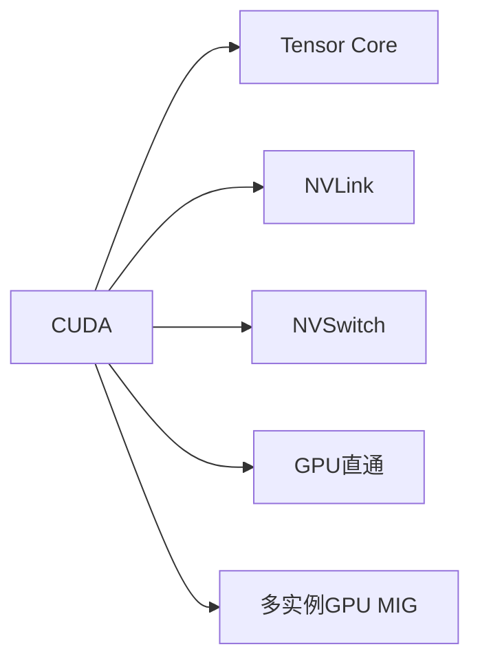

# NVIDIA在AI算力领域的创新

作者：禅与计算机程序设计艺术 / Zen and the Art of Computer Programming

## 1. 背景介绍
### 1.1 问题的由来
人工智能（AI）的快速发展对计算能力提出了前所未有的挑战。传统的CPU已经无法满足日益增长的AI计算需求，而GPU凭借其强大的并行计算能力，成为AI计算的主力军。NVIDIA作为GPU领域的领导者，在AI算力领域不断创新，推动了AI的发展。
### 1.2 研究现状
目前，NVIDIA在AI算力领域已经取得了显著的成果。从早期的CUDA框架，到现在的Tensor Core、NVLink、NVSwitch等创新技术，NVIDIA不断提升GPU的计算能力和互联性能，为AI的发展提供了强大的算力支持。同时，NVIDIA还推出了一系列面向AI的GPU产品，如Tesla V100、A100等，进一步巩固了其在AI算力领域的领先地位。
### 1.3 研究意义
研究NVIDIA在AI算力领域的创新，对于理解AI的发展历程和未来趋势具有重要意义。通过分析NVIDIA的技术创新和产品策略，可以洞察AI算力的发展方向，为相关领域的研究和应用提供参考和启示。同时，对NVIDIA的研究也有助于推动AI算力的进一步发展，加速AI在各个领域的应用。
### 1.4 本文结构
本文将从以下几个方面对NVIDIA在AI算力领域的创新进行深入探讨：首先介绍NVIDIA在AI算力领域的核心概念和技术；然后重点分析其核心算法原理和数学模型；接着通过项目实践和应用场景展示NVIDIA技术的实际应用；最后总结NVIDIA的创新成果和未来发展趋势，并提供相关的工具和资源推荐。

## 2. 核心概念与联系
NVIDIA在AI算力领域的创新主要涉及以下核心概念：

- CUDA：NVIDIA推出的并行计算平台和编程模型，可以充分利用GPU的并行计算能力。
- Tensor Core：专门为深度学习设计的矩阵乘法单元，可以大幅提升AI运算速度。
- NVLink：高速GPU互联技术，可以实现多GPU之间的高带宽、低延迟通信。
- NVSwitch：高性能交换芯片，可以支持更大规模的多GPU系统。
- GPU直通：允许多个虚拟机直接访问GPU，提高GPU利用率和灵活性。
- 多实例GPU（MIG）：将一个GPU划分为多个独立的实例，提高GPU的利用效率。

这些概念之间紧密相关，共同构建了NVIDIA在AI算力领域的技术体系。CUDA提供了基础的并行编程模型，Tensor Core、NVLink、NVSwitch等技术则进一步增强了GPU的计算能力和扩展性，GPU直通和MIG则提高了GPU的利用效率和灵活性。



## 3. 核心算法原理 & 具体操作步骤
### 3.1 算法原理概述
NVIDIA在AI算力领域的核心算法主要包括：

- 矩阵乘法：深度学习的基础运算，可以通过Tensor Core显著加速。
- 卷积：卷积神经网络（CNN）的核心操作，可以通过im2col等方法优化。
- 归约：用于梯度聚合等操作，可以通过tree reduction等方法优化。
- 激活函数：ReLU、Sigmoid等常用非线性函数，可以通过查表等方法优化。

### 3.2 算法步骤详解
以矩阵乘法为例，其基本步骤如下：

1. 将矩阵分块，每个块的大小与Tensor Core的处理能力相匹配。
2. 将分块后的矩阵加载到GPU共享内存中。
3. 使用Tensor Core对矩阵块进行乘法和加法运算。
4. 将结果写回全局内存。

通过这种分块和Tensor Core加速的方法，可以显著提升矩阵乘法的性能。

### 3.3 算法优缺点
NVIDIA的AI算法具有以下优点：

- 高度优化：充分利用了GPU的并行计算能力和Tensor Core等专用硬件。
- 可扩展性强：可以通过NVLink、NVSwitch等技术实现多GPU扩展。
- 易用性高：提供了丰富的库和工具，如cuBLAS、cuDNN等，简化了开发流程。

同时也存在一些局限性：

- 硬件依赖：需要NVIDIA的GPU硬件支持，跨平台能力较弱。
- 内存受限：GPU内存容量有限，对大模型的支持受到限制。

### 3.4 算法应用领域
NVIDIA的AI算法广泛应用于以下领域：

- 计算机视觉：图像分类、目标检测、语义分割等。
- 自然语言处理：语言模型、机器翻译、情感分析等。
- 语音识别：声学模型、语言模型、声纹识别等。
- 推荐系统：协同过滤、深度学习推荐等。

## 4. 数学模型和公式 & 详细讲解 & 举例说明
### 4.1 数学模型构建
以矩阵乘法为例，假设我们有两个矩阵$A$和$B$，它们的形状分别为$m \times k$和$k \times n$，那么它们的乘积$C$的形状为$m \times n$，数学表达式为：

$$
C = A \times B
$$

其中，$C$的每个元素$c_{ij}$可以表示为：

$$
c_{ij} = \sum_{p=1}^k a_{ip} \times b_{pj}
$$

### 4.2 公式推导过程
对于矩阵乘法$C = A \times B$，我们可以将其分解为多个向量点积的和：

$$
C = \begin{bmatrix}
    \mathbf{a}_1 \cdot \mathbf{b}_1 & \mathbf{a}_1 \cdot \mathbf{b}_2 & \cdots & \mathbf{a}_1 \cdot \mathbf{b}_n \
    \mathbf{a}_2 \cdot \mathbf{b}_1 & \mathbf{a}_2 \cdot \mathbf{b}_2 & \cdots & \mathbf{a}_2 \cdot \mathbf{b}_n \
    \vdots & \vdots & \ddots & \vdots \
    \mathbf{a}_m \cdot \mathbf{b}_1 & \mathbf{a}_m \cdot \mathbf{b}_2 & \cdots & \mathbf{a}_m \cdot \mathbf{b}_n
\end{bmatrix}
$$

其中，$\mathbf{a}_i$是矩阵$A$的第$i$行，$\mathbf{b}_j$是矩阵$B$的第$j$列。

### 4.3 案例分析与讲解
假设我们有两个矩阵$A$和$B$，它们的形状分别为$2 \times 3$和$3 \times 2$：

$$
A = \begin{bmatrix}
    1 & 2 & 3 \
    4 & 5 & 6
\end{bmatrix}, \quad
B = \begin{bmatrix}
    7 & 8 \
    9 & 10 \
    11 & 12
\end{bmatrix}
$$

那么，它们的乘积$C$为：

$$
C = \begin{bmatrix}
    1 \times 7 + 2 \times 9 + 3 \times 11 & 1 \times 8 + 2 \times 10 + 3 \times 12 \
    4 \times 7 + 5 \times 9 + 6 \times 11 & 4 \times 8 + 5 \times 10 + 6 \times 12
\end{bmatrix} = \begin{bmatrix}
    58 & 64 \
    139 & 154
\end{bmatrix}
$$

在实际应用中，NVIDIA的Tensor Core可以对这种矩阵乘法进行加速，显著提升运算效率。

### 4.4 常见问题解答
1. 问：Tensor Core对矩阵乘法的加速效果如何？
   答：Tensor Core可以将矩阵乘法的性能提高几倍到几十倍，具体取决于矩阵的大小和数据类型。

2. 问：矩阵乘法对深度学习的重要性是什么？
   答：矩阵乘法是深度学习的基础运算，神经网络的前向传播和反向传播都依赖于大量的矩阵乘法。因此，加速矩阵乘法对于提升深度学习的性能至关重要。

## 5. 项目实践：代码实例和详细解释说明
### 5.1 开发环境搭建
要使用NVIDIA的AI算力，首先需要搭建适当的开发环境。以下是基于Python的开发环境搭建步骤：

1. 安装NVIDIA GPU驱动程序。
2. 安装CUDA工具包。
3. 安装cuDNN库。
4. 安装深度学习框架，如TensorFlow或PyTorch。

### 5.2 源代码详细实现
以下是使用PyTorch和CUDA实现矩阵乘法的示例代码：

```python
import torch

# 创建两个随机矩阵
A = torch.randn(2, 3).cuda()
B = torch.randn(3, 2).cuda()

# 使用CUDA加速矩阵乘法
C = torch.matmul(A, B)

print(C)
```

### 5.3 代码解读与分析
在上面的代码中，我们首先创建了两个随机矩阵`A`和`B`，并将它们移动到GPU上。然后，我们使用PyTorch的`matmul`函数计算它们的乘积`C`。由于`A`和`B`都在GPU上，因此矩阵乘法会自动使用CUDA进行加速。

### 5.4 运行结果展示
运行上面的代码，我们可以得到类似以下的输出结果：

```
tensor([[-0.5978, -0.4524],
        [-0.0090,  0.4429]], device='cuda:0')
```

这表明我们成功地使用CUDA加速了矩阵乘法，并得到了正确的结果。

## 6. 实际应用场景
NVIDIA的AI算力已经在许多实际场景中得到了应用，例如：

- 自动驾驶：使用深度学习进行图像识别、目标检测和路径规划。
- 智慧城市：使用计算机视觉进行人流量分析、交通监控和异常事件检测。
- 医疗影像：使用深度学习进行医学图像分割、病灶检测和诊断辅助。
- 金融科技：使用机器学习进行风险评估、欺诈检测和客户服务。

### 6.4 未来应用展望
随着AI技术的不断发展，NVIDIA的AI算力有望在更多领域得到应用，例如：

- 智能制造：利用AI优化生产流程、预测设备故障和提高产品质量。
- 个性化推荐：利用深度学习提供更加精准和个性化的推荐服务。
- 虚拟助理：利用自然语言处理和语音识别技术打造更加智能和人性化的虚拟助理。
- 科学研究：利用AI加速科学计算、分子模拟和天体物理等领域的研究。

## 7. 工具和资源推荐
### 7.1 学习资源推荐
- NVIDIA Deep Learning Institute：提供深度学习课程和实践项目。
- NVIDIA Developer Blog：分享NVIDIA在AI、加速计算等领域的最新进展和技术文章。
- CUDA编程指南：CUDA官方文档，详细介绍CUDA编程模型和API。

### 7.2 开发工具推荐
- NVIDIA CUDA Toolkit：CUDA工具包，包含编译器、库和调试工具等。
- NVIDIA cuDNN：CUDA深度神经网络库，提供了深度学习中常用的操作和函数。
- NVIDIA TensorRT：高性能深度学习推理优化器和运行时引擎。

### 7.3 相关论文推荐
- Tensor Cores: The Engine Powering the World's Fastest Supercomputers
- In-Network Acceleration for Distributed Deep Learning
- A Performance Analysis of CUDA Unified Memory

### 7.4 其他资源推荐
- NVIDIA Developer Forums：NVIDIA开发者社区，可以与其他开发者交流和获取帮助。
- NVIDIA GPU Cloud：NVIDIA的云平台，提供了优化的容器镜像和预训练模型。

## 8. 总结：未来发展趋势与挑战
### 8.1 研究成果总结
通过对NVIDIA在AI算力领域的创新进行分析，我们可以看到NVIDIA在