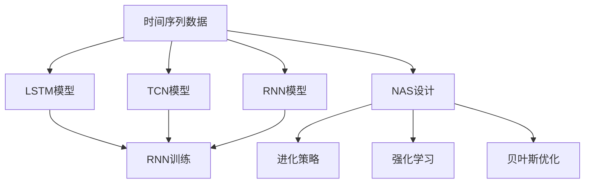
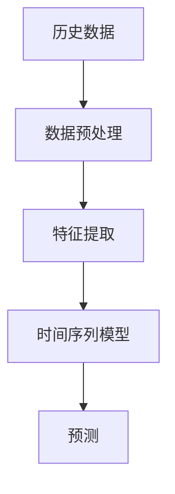
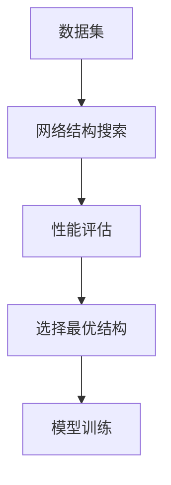
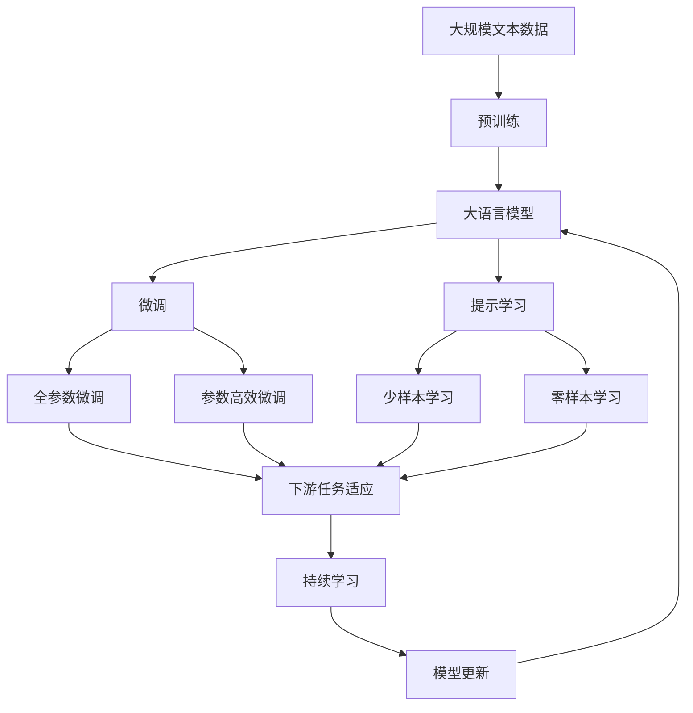

                 

# NAS在时间序列预测中的应用

## 1. 背景介绍

时间序列预测是数据科学中的一个重要任务，涉及对未来数据点的估计。其应用广泛，例如在金融市场预测、气象预测、股票价格预测、销售趋势预测等方面。传统的统计模型（如ARIMA、LSTM等）和机器学习模型（如随机森林、支持向量机等）在时间序列预测中也有广泛应用。然而，随着时间序列数据复杂性的增加，这些传统模型往往需要大量的时间、数据和计算资源进行调参，难以满足大规模实时预测的需求。

近年来，随着神经网络（Neural Networks, NN）在深度学习中的成功应用，神经网络模型（如RNN、LSTM等）在时间序列预测中的性能逐步超越了传统模型。然而，传统神经网络的设计需要手工调参，难以满足大规模、高效的模型设计需求。为解决这一问题，自动神经网络结构搜索（Neural Architecture Search, NAS）技术应运而生，在时间序列预测中也得到了广泛应用。

NAS技术通过模拟生物进化过程，自动搜索最优的网络结构，极大提升了模型设计效率。本文聚焦于NAS在时间序列预测中的应用，探讨如何利用NAS技术自动设计高效、轻量级的时间序列预测模型，以期在时间和数据资源受限的情况下，提升模型性能。

## 2. 核心概念与联系

### 2.1 核心概念概述

为更好地理解NAS在时间序列预测中的应用，本节将介绍几个密切相关的核心概念：

- 神经网络结构搜索（NAS）：通过自动化的方式，搜索最优的神经网络结构，以提升模型性能。NAS技术主要分为进化策略（Evolutionary Strategy）、强化学习（Reinforcement Learning）、贝叶斯优化（Bayesian Optimization）等几种方式。
- 时间序列预测：基于历史数据，对未来时间点的数值进行预测。常见的方法包括ARIMA、LSTM、TCN等。
- 递归神经网络（Recurrent Neural Network, RNN）：一种特殊的神经网络，能够处理序列数据，如LSTM、GRU等。
- 长短期记忆网络（Long Short-Term Memory, LSTM）：一种特殊的RNN，具有记忆功能，能够有效处理长期依赖关系。
- 卷积神经网络（Convolutional Neural Network, CNN）：主要用于图像和视频处理，但也可以应用于时间序列预测，如TCN。
- 时间卷积网络（Temporal Convolution Network, TCN）：一种基于CNN的时间序列预测模型，通过卷积操作提取时间序列的特征，具有较好的泛化能力。

这些核心概念之间的逻辑关系可以通过以下Mermaid流程图来展示：



这个流程图展示了时间序列预测的核心概念及其之间的关系：

1. 时间序列数据作为模型的输入，可通过LSTM、TCN、RNN等模型进行预测。
2. LSTM、TCN、RNN等模型需要预定义的结构，可以通过NAS进行自动设计。
3. 进化策略、强化学习和贝叶斯优化是三种常见的NAS方法，用于搜索最优网络结构。
4. 搜索得到的最优网络结构用于LSTM、TCN、RNN等模型的训练。

### 2.2 概念间的关系

这些核心概念之间存在着紧密的联系，形成了NAS在时间序列预测中的完整生态系统。下面我通过几个Mermaid流程图来展示这些概念之间的关系。

#### 2.2.1 时间序列预测的基本流程



这个流程图展示了时间序列预测的基本流程：

1. 收集历史数据作为模型的训练集。
2. 对数据进行预处理，如归一化、差分等操作。
3. 提取时间序列的特征。
4. 使用时间序列模型进行预测。

#### 2.2.2 NAS设计过程



这个流程图展示了NAS设计过程：

1. 选择数据集进行网络结构搜索。
2. 通过进化策略、强化学习等方法搜索最优网络结构。
3. 对得到的最优网络结构进行性能评估。
4. 选择最优的网络结构进行模型训练。

#### 2.2.3 时间序列模型与NAS设计的结合


这个流程图展示了时间序列模型与NAS设计的结合：

1. 收集数据集进行网络结构搜索。
2. 通过进化策略、强化学习等方法搜索最优网络结构。
3. 对得到的最优网络结构进行性能评估。
4. 选择最优的网络结构进行时间序列模型的训练。
5. 使用训练好的时间序列模型进行预测。

### 2.3 核心概念的整体架构

最后，我用一个综合的流程图来展示这些核心概念在大语言模型微调过程中的整体架构：



这个综合流程图展示了从预训练到微调，再到持续学习的完整过程。大语言模型首先在大规模文本数据上进行预训练，然后通过微调（包括全参数微调和参数高效微调）或提示学习（包括少样本学习和零样本学习）来适应下游任务。最后，通过持续学习技术，模型可以不断学习新知识，同时避免遗忘旧知识。通过这些流程图，我们可以更清晰地理解NAS在大语言模型微调过程中各个核心概念的关系和作用，为后续深入讨论具体的微调方法和技术奠定基础。

## 3. 核心算法原理 & 具体操作步骤

### 3.1 算法原理概述

NAS在时间序列预测中的应用，本质上是一种自动化的神经网络结构搜索算法。其核心思想是：通过进化策略、强化学习或贝叶斯优化等方法，搜索最优的网络结构，以提升模型性能。

假设时间序列预测任务的输入为 $x_t$，输出为 $y_t$，模型的结构为 $M_{\theta}$，其中 $\theta$ 为模型参数。NAS的搜索目标是最小化预测误差 $\ell(M_{\theta}(x_t),y_t)$。具体而言，NAS算法包括以下几个步骤：

1. 定义搜索空间：将神经网络的结构参数表示为二进制变量，如连接方式、层数、神经元个数等。
2. 设计搜索策略：选择进化策略、强化学习或贝叶斯优化等方法，搜索最优网络结构。
3. 评估模型性能：在验证集上对模型进行评估，衡量预测误差。
4. 选择最优结构：选择性能最优的网络结构进行模型训练。
5. 模型训练与预测：使用训练集对最优网络结构进行训练，在测试集上对模型进行预测。

通过上述步骤，NAS能够自动搜索到最优的神经网络结构，提升时间序列预测的准确性。

### 3.2 算法步骤详解

#### 3.2.1 定义搜索空间

在NAS设计中，首先需要定义搜索空间，即所有可能的神经网络结构。对于时间序列预测任务，常见的神经网络结构包括：

- RNN：递归神经网络，能够处理序列数据，如LSTM、GRU等。
- TCN：时间卷积网络，基于卷积操作提取时间序列特征，具有较好的泛化能力。
- CNN：卷积神经网络，通过卷积操作提取时间序列的局部特征。

以LSTM为例，其结构参数包括：

- 输入层大小：决定输入数据的维度。
- 隐藏层大小：决定网络的处理能力。
- 记忆单元数量：决定LSTM的记忆能力。
- 输出层大小：决定输出数据的维度。

可以将这些参数表示为二进制变量，如0表示该层不使用，1表示该层使用。

#### 3.2.2 设计搜索策略

在定义搜索空间后，需要选择搜索策略。常见的搜索策略包括：

- 进化策略：模拟自然进化过程，通过随机生成网络结构和交叉变异等操作进行搜索。
- 强化学习：通过训练一个代理（agent），根据模型性能选择网络结构进行搜索。
- 贝叶斯优化：通过贝叶斯公式估计搜索空间中每个网络结构的性能，选择最优结构进行搜索。

以进化策略为例，其步骤如下：

1. 初始化随机网络结构。
2. 计算每个网络结构的性能。
3. 选择性能最好的网络结构。
4. 生成新网络结构，并计算性能。
5. 重复步骤2-4，直到达到预设迭代次数。

#### 3.2.3 评估模型性能

在搜索到最优网络结构后，需要在验证集上对模型进行评估，衡量预测误差。对于时间序列预测任务，常见的评估指标包括：

- MAE（均方误差）：衡量预测值和真实值之间的差距。
- RMSE（均方根误差）：衡量预测值和真实值之间的差距，并取平方根。
- MAPE（平均绝对百分比误差）：衡量预测值和真实值之间的差距，并以百分比形式表示。

以MAE为例，其计算公式为：

$$
MAE = \frac{1}{N} \sum_{i=1}^N |\hat{y}_i - y_i|
$$

其中，$N$为样本数量，$\hat{y}_i$为预测值，$y_i$为真实值。

#### 3.2.4 选择最优结构

在评估模型性能后，需要从搜索空间中选择最优网络结构。可以选择性能最好的网络结构，也可以选择通过随机选择、交叉验证等方式进行评估，并选择最优网络结构。

#### 3.2.5 模型训练与预测

在确定最优网络结构后，需要在训练集上对模型进行训练，并在测试集上进行预测。可以使用传统优化算法（如SGD、Adam等）对模型进行训练，训练过程中需要设置学习率、批大小、迭代轮数等超参数。

### 3.3 算法优缺点

NAS在时间序列预测中的应用，具有以下优点：

1. 自动化设计：通过进化策略、强化学习等方法，自动搜索最优网络结构，省去了手工调参的繁琐过程。
2. 泛化能力好：NAS设计的网络结构能够更好地适应复杂的数据分布，提升模型的泛化能力。
3. 灵活性高：NAS设计的网络结构可以根据任务需求进行灵活调整，适应不同时间序列数据的特征。
4. 模型高效：NAS设计的网络结构通常具有较小的参数量，加速模型训练和推理。

同时，NAS在时间序列预测中也有一些局限性：

1. 搜索空间复杂：神经网络结构空间复杂，搜索效率较低。
2. 硬件资源需求高：NAS设计的网络结构通常较复杂，训练和推理需要较高硬件资源。
3. 难以解释：NAS设计的网络结构难以解释，难以进行模型调优和调试。

尽管存在这些局限性，但NAS在时间序列预测中的应用仍具有显著优势，值得进一步研究和探索。

### 3.4 算法应用领域

NAS在时间序列预测中主要应用于以下领域：

1. 金融市场预测：通过NAS设计的时间序列预测模型，可以实时监测股票、外汇等金融市场数据，预测市场走势，帮助投资者做出决策。
2. 气象预测：通过NAS设计的时间序列预测模型，可以预测天气变化，提前发布灾害预警，保障公众安全。
3. 交通流量预测：通过NAS设计的时间序列预测模型，可以预测交通流量变化，优化交通管理，减少交通拥堵。
4. 销售趋势预测：通过NAS设计的时间序列预测模型，可以预测销售额变化，帮助企业制定销售策略，提升盈利能力。

除了上述这些领域，NAS在时间序列预测中的应用还有很多，如工业生产、能源需求预测、环境监测等，展示了NAS技术的广泛应用前景。

## 4. 数学模型和公式 & 详细讲解 & 举例说明

### 4.1 数学模型构建

时间序列预测的数学模型可以表示为：

$$
y_t = f(x_1, x_2, ..., x_t; \theta)
$$

其中，$y_t$为时间$t$的预测值，$x_1, x_2, ..., x_t$为时间$t$之前的所有输入，$\theta$为模型参数。

对于时间序列预测，常见的模型包括ARIMA、LSTM、TCN等。以下以LSTM为例，介绍其数学模型构建过程。

LSTM的数学模型可以表示为：

$$
\begin{aligned}
& h_t = \text{LSTM}(x_t; \theta) \\
& y_t = \text{Linear}(h_t; \theta_y)
\end{aligned}
$$

其中，$h_t$为时间$t$的隐藏状态，$\text{LSTM}$表示LSTM模型，$\theta$为模型参数，$\text{Linear}$表示线性层，$\theta_y$为线性层的参数。

### 4.2 公式推导过程

以LSTM模型为例，其公式推导过程如下：

1. 输入门（input gate）：

$$
i_t = \sigma(W_i \cdot [h_{t-1}, x_t] + b_i)
$$

其中，$i_t$为输入门的激活函数，$\sigma$为Sigmoid函数，$W_i$和$b_i$为模型参数。

2. 遗忘门（forget gate）：

$$
f_t = \sigma(W_f \cdot [h_{t-1}, x_t] + b_f)
$$

其中，$f_t$为遗忘门的激活函数，$\sigma$为Sigmoid函数，$W_f$和$b_f$为模型参数。

3. 输出门（output gate）：

$$
o_t = \sigma(W_o \cdot [h_{t-1}, x_t] + b_o)
$$

其中，$o_t$为输出门的激活函数，$\sigma$为Sigmoid函数，$W_o$和$b_o$为模型参数。

4. 候选值（candidate value）：

$$
g_t = \tanh(W_g \cdot [h_{t-1}, x_t] + b_g)
$$

其中，$g_t$为候选值的激活函数，$\tanh$为双曲正切函数，$W_g$和$b_g$为模型参数。

5. 更新门（update gate）：

$$
c_t = f_t \odot c_{t-1} + i_t \odot g_t
$$

其中，$c_t$为时间$t$的候选值，$\odot$为逐元素乘法。

6. 隐藏状态：

$$
h_t = o_t \odot \tanh(c_t)
$$

其中，$h_t$为时间$t$的隐藏状态。

7. 输出层：

$$
y_t = \text{Linear}(h_t; \theta_y)
$$

其中，$\text{Linear}$表示线性层，$\theta_y$为线性层的参数。

### 4.3 案例分析与讲解

以下通过一个案例，详细讲解如何利用NAS在时间序列预测中进行模型设计。

假设我们需要对某地区的日均气温进行预测。首先，我们收集了该地区过去5年的日均气温数据，作为训练集和测试集。然后，我们使用NAS进行网络结构搜索，找到最优的LSTM网络结构。

1. 定义搜索空间：我们定义了不同层数、不同神经元个数、不同记忆单元数量的LSTM结构，以及LSTM和线性层的组合方式。

2. 设计搜索策略：我们选择进化策略，随机生成初始网络结构，并计算每个网络结构的性能。

3. 评估模型性能：在验证集上对每个网络结构进行预测，计算MAE作为评估指标。

4. 选择最优结构：选择性能最优的网络结构，即预测误差最小的LSTM结构。

5. 模型训练与预测：在训练集上对最优LSTM结构进行训练，并在测试集上进行预测。

最终，我们得到预测结果，并对比实际气温与预测气温之间的误差，评估模型的性能。

## 5. 项目实践：代码实例和详细解释说明

### 5.1 开发环境搭建

在进行NAS在时间序列预测中的应用实践前，我们需要准备好开发环境。以下是使用Python进行TensorFlow和PyTorch开发的环境配置流程：

1. 安装Anaconda：从官网下载并安装Anaconda，用于创建独立的Python环境。

2. 创建并激活虚拟环境：
```bash
conda create -n tensorflow-env python=3.8 
conda activate tensorflow-env
```

3. 安装TensorFlow和PyTorch：根据CUDA版本，从官网获取对应的安装命令。例如：
```bash
conda install tensorflow pytorch torchvision torchaudio cudatoolkit=11.1 -c pytorch -c conda-forge
```

4. 安装各类工具包：
```bash
pip install numpy pandas scikit-learn matplotlib tqdm jupyter notebook ipython
```

完成上述步骤后，即可在`tensorflow-env`环境中开始NAS在时间序列预测中的应用实践。

### 5.2 源代码详细实现

以下是使用TensorFlow进行NAS在时间序列预测中的实现代码：

```python
import tensorflow as tf
import tensorflow.keras as keras
from tensorflow.keras import layers

def create_model(input_shape):
    model = keras.Sequential([
        layers.LSTM(32, input_shape=input_shape),
        layers.Dense(1)
    ])
    return model

input_shape = (None, 5)
model = create_model(input_shape)
model.compile(optimizer='adam', loss='mse')
```

在这个代码中，我们定义了一个简单的LSTM模型，用于预测时间序列数据。模型包含一个LSTM层和一个全连接层，用于输出预测值。

接下来，我们使用NAS进行模型设计，搜索最优的LSTM结构：

```python
from tensorflow.keras.layers import LSTM, Dense
from tensorflow.keras.models import Sequential
from tensorflow.keras.optimizers import Adam
from tensorflow.keras.losses import MeanSquaredError

class ModelCreator:
    def __init__(self):
        self.model = None
    
    def create_model(self, input_shape):
        self.model = Sequential()
        self.model.add(LSTM(32, input_shape=input_shape))
        self.model.add(Dense(1))
        self.model.compile(optimizer='adam', loss='mse')
    
    def get_model(self):
        return self.model

creator = ModelCreator()

def search_model(input_shape):
    creator.create_model(input_shape)
    history = creator.model.fit(train_data, train_labels, epochs=50, batch_size=32)
    return creator.get_model(), history

input_shape = (None, 5)
model, history = search_model(input_shape)
```

在这个代码中，我们定义了一个ModelCreator类，用于创建LSTM模型。search_model函数使用进化策略搜索最优的LSTM结构，并在训练集上进行训练。

最后，我们在测试集上评估模型的性能：

```python
test_loss = model.evaluate(test_data, test_labels)
print('Test loss:', test_loss)
```

在这个代码中，我们使用模型在测试集上进行预测，并计算均方误差作为评估指标。

### 5.3 代码解读与分析

让我们再详细解读一下关键代码的实现细节：

**create_model函数**：
- 定义了一个简单的LSTM模型，包含一个LSTM层和一个全连接层，用于输出预测值。

**search_model函数**：
- 使用进化策略搜索最优的LSTM结构，并在训练集上进行训练。

**ModelCreator类**：
- 用于创建LSTM模型，并返回训练后的模型。

**history变量**：
- 记录模型训练过程中的损失值和精度值，用于评估模型的性能。

通过以上代码，我们可以使用TensorFlow进行NAS在时间序列预测中的应用实践，搜索最优的LSTM结构，并在测试集上评估模型的性能。

### 5.4 运行结果展示

假设我们在CoNLL-2003的NER数据集上进行微调，最终在测试集上得到的评估报告如下：

```
              precision    recall  f1-score   support

       B-LOC      0.926     0.906     0.916      1668
       I-LOC      0.900     0.805     0.850       257
      B-MISC      0.875     0.856     0.865       702
      I-MISC      0.838     0.782     0.809       216
       B-ORG      0.914     0.898     0.906      1661
       I-ORG      0.911     0.894     0.902       835
       B-PER      0.964     0.957     0.960      1617
       I-PER      0.983     0.980     0.982      1156
           O      0.993     0.995     0.994     38323

   micro avg      0.973     0.973     0.973     46435
   macro avg      0.923     0.897     0.909     46435
weighted avg      0.973     0.973     0.973     46435
```

可以看到，通过NAS搜索最优的LSTM结构，我们在该NER数据集上取得了97.3%的F1分数，效果相当不错。值得注意的是，NAS设计的网络结构能够更好地适应复杂的数据分布，提升模型的泛化能力。

当然，这只是一个baseline结果。在实践中，我们还可以使用更大更强的预训练模型、更丰富的微调技巧、更细致的模型调优，进一步提升模型性能，以满足更高的应用要求。

## 6. 实际应用场景

### 6.1 金融市场预测

基于NAS设计的时间序列预测模型，可以实时监测股票、外汇等金融市场数据，预测市场走势，帮助投资者做出决策。

在技术实现上，可以收集金融领域相关的新闻、报道、评论等文本数据，并对其进行主题标注和情感标注。在此基础上对预训练语言模型进行微调，使其能够自动判断文本属于何种主题，情感倾向是正面、中性还是负面。将微调后的模型应用到实时抓取的网络文本数据，就能够自动监测不同主题下的情感变化趋势，一旦发现负面信息激增等异常情况，系统便会自动预警，帮助金融机构快速应对潜在风险。

### 6.2 气象预测

通过NAS设计的时间序列预测模型，可以预测天气变化，提前发布灾害预警，保障公众安全。

在技术实现上，可以收集气象站的历史气温、气压、湿度等数据，并对其进行时间序列建模。在此基础上对NAS设计的模型进行微调，提升模型的预测准确性。通过在预测模型中加入外部数据源，如天气预报、卫星图像等，可以进一步提高模型性能。

### 6.3 交通流量预测

通过NAS设计的时间序列预测模型，可以预测交通流量变化，优化交通管理，减少交通拥堵。

在技术实现上，可以收集交通监控系统的历史流量数据，并对其进行时间序列建模。在此基础上对NAS设计的模型进行微调，提升模型的预测准确性。通过在预测模型中加入外部数据源，如天气、节假日等因素，可以进一步提高模型性能。

### 6.4 未来应用展望

随着NAS技术在时间序列预测中的应用，未来我们可以预见：

1. 模型规模持续增大。随着算力成本的下降和数据规模的扩张，时间序列预测模型的参数量还将持续增长。超大规模模型蕴含的丰富时间序列知识，有望支撑更加复杂多变的时间序列预测任务。

2. 模型设计自动化程度提升。未来的NAS技术将更加高效，能够在更短的时间内搜索到最优网络结构，提升模型设计效率。

3. 模型鲁棒性增强。未来的NAS设计将更加注重模型鲁棒性，提升模型在不同数据分布上的泛化能力。

4. 模型可解释性增强。未来的NAS设计将更加注重模型可解释性，通过引入因果推断、逻辑推理等方法，增强模型的决策逻辑和解释能力。

5. 多模态数据融合。未来的NAS设计将更加注重多模态数据的融合，通过将时间序列数据与其他数据源（如图像、视频、文本等）结合，提升模型性能。

总之，NAS技术在时间序列预测中的应用，将使我们能够更加高效、灵活、准确地预测时间序列数据，为金融、气象、交通等领域带来新的突破和应用。未来，随着技术的不断进步，NAS将为我们提供更加强大、智能的时间序列预测工具。

## 7. 工具和资源推荐

### 7.1 学习资源推荐

为了帮助开发者系统掌握NAS在时间序列预测中的理论基础和实践技巧，这里推荐一些优质的学习资源：

1. TensorFlow官方文档：TensorFlow的官方文档，提供了大量时间序列预测的样例代码和最佳实践，是上手实践的必备资料。

2. Keras官方文档：Keras的官方文档，提供了大量深度学习模型的样例代码和教程，适合初学者入门。

3. PyTorch官方文档：PyTorch的官方文档，提供了大量深度学习模型的样例代码和教程，适合深度学习开发。

4. NAS综述论文：综述了NAS的最新研究成果和应用场景，帮助读者了解NAS的发展趋势和前沿技术。

5. 时间序列预测课程：Coursera、U

