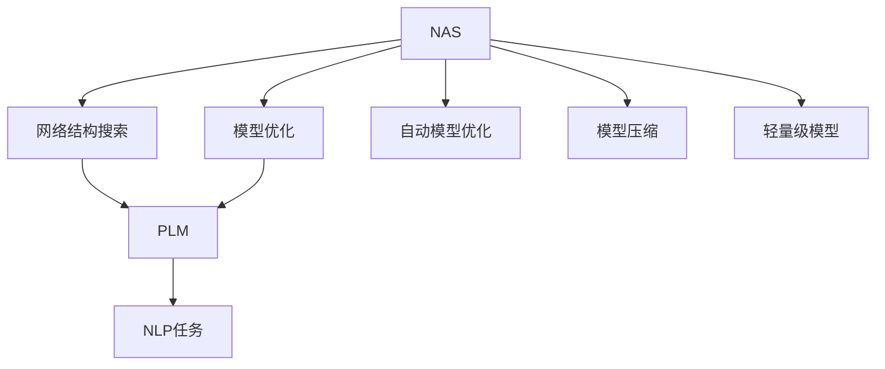
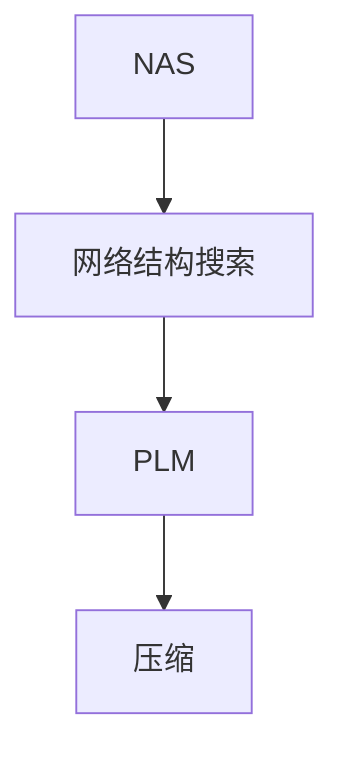
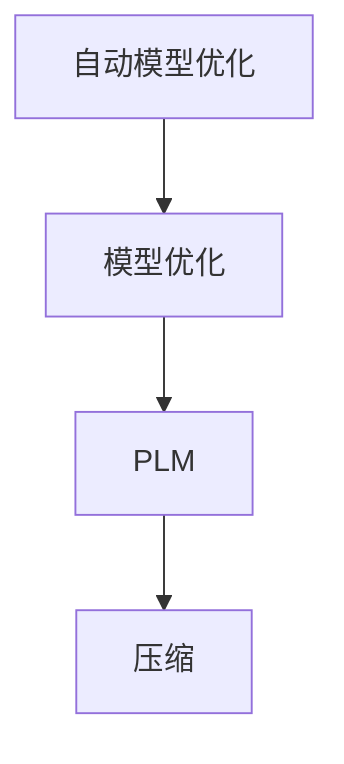
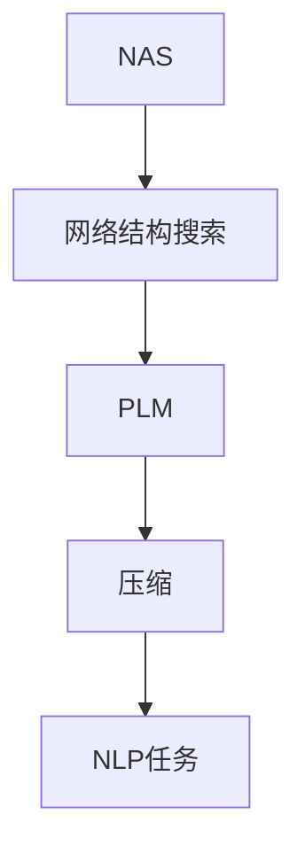
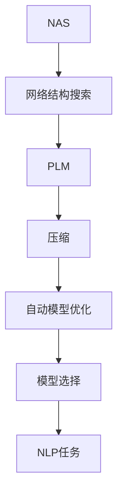

                 

# NAS技术在自然语言处理中的实践

> 关键词：神经架构搜索(NAS),自然语言处理(NLP),模型压缩,自动模型优化,深度学习,预训练语言模型(Pretrained Language Models)

## 1. 背景介绍

随着深度学习技术的不断发展，尤其是神经网络(Neural Networks, NN)结构复杂度的不断提升，传统的手工网络设计方法已难以满足日益增长的模型性能需求。为解决这一问题，神经网络架构搜索(Neural Architecture Search, NAS)技术应运而生。NAS通过自动化搜索最优的网络结构，极大地提高了模型设计的效率和精度，成为深度学习领域的重要研究方向。

在自然语言处理(Natural Language Processing, NLP)领域，预训练语言模型(Pretrained Language Models, PLMs)如BERT、GPT等已取得了显著的成果。但与此同时，这些模型往往具有巨大的参数量和计算需求，使得在实际应用中面临诸多挑战，如计算资源有限、模型压缩需求高等。NAS技术的引入，为解决这些问题提供了一条新的路径。通过NAS技术，可以自动搜索出更高效的模型结构，从而在保证模型性能的前提下，大幅降低计算复杂度和资源消耗。

本文将深入探讨NAS技术在NLP中的应用，包括其核心原理、具体操作步骤、优缺点以及应用领域，并通过案例分析和代码实例，全面展示NAS技术在模型压缩和优化中的实践效果。

## 2. 核心概念与联系

### 2.1 核心概念概述

为更好地理解NAS技术在NLP中的应用，本节将介绍几个关键概念及其相互关系：

- **神经架构搜索(NAS)**：一种通过自动化搜索最优网络结构的方法，旨在找到在特定任务上表现最佳的神经网络设计。
- **自然语言处理(NLP)**：涉及语言理解、生成、分析和应用的人工智能领域，以实现机器与人类之间的自然语言交互。
- **预训练语言模型(PLM)**：指在大规模无标签文本语料上预先训练，用于特定NLP任务的模型，如BERT、GPT等。
- **模型压缩**：指在保证模型性能的前提下，减少模型参数量、降低计算复杂度的方法，如剪枝、量化等。
- **自动模型优化(AutoML)**：指通过自动化工具优化模型设计、训练和部署过程，包括超参数优化、模型选择等。
- **NAS与自动模型优化结合**：通过NAS技术自动化搜索最优模型结构，结合自动模型优化技术进行参数和超参数的调整，最终生成高性能且轻量级的模型。

这些核心概念之间的逻辑关系可以通过以下Mermaid流程图来展示：



这个流程图展示了NAS技术与NLP中的模型压缩、自动模型优化等技术之间的联系：

1. NAS技术通过搜索最优网络结构，显著提升模型的性能和效率。
2. 搜索得到的结构可以应用于PLM，通过自动模型优化进一步提升模型性能。
3. 压缩方法可以应用于NAS生成的模型，使得模型更加轻量级，易于部署。
4. 自动模型优化工具可以用于整个模型设计过程，从网络结构到超参数优化，提升模型整体表现。

### 2.2 概念间的关系

这些核心概念之间存在着紧密的联系，形成了NAS技术在NLP中的应用生态系统。下面我们通过几个Mermaid流程图来展示这些概念之间的关系。

#### 2.2.1 网络结构搜索与模型压缩



这个流程图展示了NAS技术通过搜索最优网络结构，最终生成可供压缩的模型。搜索得到的结构可以在保证模型性能的前提下，大幅减少模型参数量，降低计算复杂度。

#### 2.2.2 自动模型优化与模型压缩



这个流程图展示了自动模型优化技术在NAS搜索得到的PLM模型上的应用。通过自动调整模型参数和超参数，进一步提升模型性能，同时保证模型的轻量化。

#### 2.2.3 轻量级模型与NLP任务



这个流程图展示了NAS技术通过搜索和压缩得到的轻量级模型，可以直接应用于各种NLP任务，提高任务执行效率。

### 2.3 核心概念的整体架构

最后，我们用一个综合的流程图来展示这些核心概念在大模型微调过程中的整体架构：



这个综合流程图展示了从NAS网络结构搜索到最终生成高性能且轻量级NLP模型的完整过程。NAS技术通过搜索最优网络结构，结合自动模型优化技术进行参数和超参数的调整，最终生成适合特定NLP任务的模型，并应用于实际任务中。

## 3. 核心算法原理 & 具体操作步骤
### 3.1 算法原理概述

NAS技术在NLP中的应用主要涉及两个方面：网络结构搜索和自动模型优化。以下是这两个方面的详细阐述。

#### 3.1.1 网络结构搜索

网络结构搜索是指通过自动化手段搜索最优的网络结构，以提升模型性能。NAS通过构建搜索空间、定义搜索算法和评估指标，自动搜索出性能最佳的神经网络架构。

在NLP中，通常使用NAS自动搜索PLM的结构。常用的搜索算法包括强化学习、遗传算法、贝叶斯优化等。这些算法通过在搜索空间中不断探索，找到最优的网络结构，并将其应用于PLM。

#### 3.1.2 自动模型优化

自动模型优化是指通过自动化手段优化模型设计、训练和部署过程，包括超参数优化、模型选择等。自动模型优化可以显著提高模型性能和训练效率，使得模型在实际应用中更加高效。

在NLP中，自动模型优化通常包括：

- **超参数优化**：通过自动化搜索最佳的学习率、批大小、正则化系数等超参数，提升模型训练效果。
- **模型选择**：通过自动评估不同模型的性能，选择最佳模型进行进一步优化和部署。
- **迁移学习**：通过迁移学习技术，将预训练模型的知识应用于特定任务，提高模型的泛化能力。

### 3.2 算法步骤详解

#### 3.2.1 网络结构搜索步骤

1. **构建搜索空间**：定义一组可能的神经网络结构，作为NAS的搜索目标。
2. **定义评估指标**：选择合适的指标，如准确率、F1分数、模型大小等，用于评估搜索得到的结构。
3. **进行搜索**：使用选定的算法在搜索空间中搜索最优结构。
4. **验证模型性能**：将搜索得到的结构应用于PLM，在验证集上进行验证，评估性能。
5. **优化结构**：根据验证结果，调整搜索空间和算法参数，重复上述步骤，直至找到最优结构。

#### 3.2.2 自动模型优化步骤

1. **超参数搜索**：使用自动超参数优化算法（如贝叶斯优化、随机搜索等）搜索最佳超参数组合。
2. **模型选择**：根据验证集上的表现，选择性能最优的模型。
3. **模型迁移**：将预训练模型的知识迁移到目标任务上，进行微调。
4. **评估模型效果**：在测试集上评估模型性能，检查模型泛化能力。
5. **部署模型**：将优化后的模型部署到实际应用中，进行推理预测。

### 3.3 算法优缺点

NAS技术在NLP中的应用具有以下优点：

1. **自动设计网络结构**：通过自动搜索最优结构，节省手工设计网络的时间和精力。
2. **提高模型性能**：搜索得到的结构通常能够提高模型性能，尤其是在小规模数据集上表现更加显著。
3. **模型压缩与优化**：通过NAS生成的结构，可以更容易进行模型压缩和优化，降低计算复杂度。
4. **提升研究效率**：自动模型优化能够加速模型设计、训练和部署过程，提升研究效率。

同时，NAS技术也存在一些局限性：

1. **计算资源需求高**：搜索最优网络结构通常需要大量的计算资源，可能会影响研究进展。
2. **搜索时间较长**：由于搜索空间通常非常庞大，搜索最优结构需要耗费大量时间。
3. **结果可解释性差**：NAS生成的模型往往难以解释，难以理解其决策过程。
4. **数据依赖性强**：NAS的效果很大程度上依赖于数据质量和分布，不同的数据集可能得到不同的结果。

### 3.4 算法应用领域

NAS技术在NLP中的应用主要包括以下几个方面：

1. **预训练语言模型的结构搜索**：通过NAS搜索最优PLM的结构，提升模型性能。
2. **模型压缩与优化**：通过自动模型优化技术，压缩模型参数，提升推理速度。
3. **轻量级模型设计**：搜索轻量级模型结构，满足特定场景下的计算资源限制。
4. **超参数优化**：通过自动化超参数优化，提升模型训练效率和效果。
5. **迁移学习与任务适配**：通过NAS生成的结构，更好地适应特定任务。

这些应用领域展示了NAS技术在NLP中的广泛适用性和重要价值，为NLP领域的模型设计和优化提供了新的思路和方法。

## 4. 数学模型和公式 & 详细讲解  
### 4.1 数学模型构建

在本节中，我们将以BERT模型为例，详细阐述NAS技术在NLP中的应用。

#### 4.1.1 BERT模型结构

BERT模型是一种基于Transformer架构的预训练语言模型，其主要组成部分包括：

- **编码器层**：由多个Transformer编码器组成，用于提取文本的语义信息。
- **多头自注意力机制**：通过多头自注意力机制，捕捉文本中的长距离依赖关系。
- **层归一化**：通过层归一化技术，加速模型收敛，提升模型性能。

#### 4.1.2 网络结构搜索

NAS对BERT模型的网络结构搜索通常包括以下步骤：

1. **定义搜索空间**：搜索空间包括编码器层数、每层注意力头数、每层大小等参数。
2. **定义评估指标**：通常使用BLEU、ROUGE等指标评估搜索得到的结构。
3. **进行搜索**：使用强化学习等算法在搜索空间中搜索最优结构。
4. **验证模型性能**：将搜索得到的结构应用于PLM，在验证集上进行验证，评估性能。
5. **优化结构**：根据验证结果，调整搜索空间和算法参数，重复上述步骤，直至找到最优结构。

#### 4.1.3 自动模型优化

在NAS搜索得到的BERT模型结构基础上，通过自动模型优化进一步提升模型性能。以下是常用的优化步骤：

1. **超参数搜索**：使用贝叶斯优化等算法搜索最佳超参数组合，如学习率、批大小等。
2. **模型迁移**：将预训练BERT模型的知识迁移到目标任务上，进行微调。
3. **模型评估**：在测试集上评估模型性能，检查模型泛化能力。
4. **部署模型**：将优化后的模型部署到实际应用中，进行推理预测。

### 4.2 公式推导过程

#### 4.2.1 BERT模型

BERT模型的主要组成部分包括编码器层和多头自注意力机制。假设输入文本为$x$，编码器层数为$L$，每层大小为$D$，注意力头数为$H$。

编码器层的计算公式如下：

$$
h^i_{t-1} = \text{FFN}(h^{i-1}_{t-1})
$$

其中，$h^i_{t-1}$表示第$i$层的输入，$\text{FFN}$表示全连接前馈网络。

自注意力机制的计算公式如下：

$$
\text{Attention}(Q, K, V) = \text{softmax}(QK^T)V
$$

其中，$Q$、$K$、$V$分别表示查询、键和值矩阵，$\text{softmax}$表示softmax函数。

#### 4.2.2 NAS搜索空间

NAS搜索空间通常包括以下参数：

- **层数**：表示编码器层数。
- **每层大小**：表示每层的大小。
- **注意力头数**：表示每层的注意力头数。
- **激活函数**：表示每层的激活函数。
- **归一化方式**：表示每层的归一化方式。

搜索空间通常可以表示为：

$$
S = \{ (L, D, H, A, N) \}
$$

其中，$L$表示层数，$D$表示每层大小，$H$表示注意力头数，$A$表示激活函数，$N$表示归一化方式。

#### 4.2.3 评估指标

NAS的评估指标通常包括以下几个方面：

- **准确率**：模型在验证集上的准确率。
- **F1分数**：模型在验证集上的F1分数。
- **模型大小**：模型参数量。
- **训练时间**：模型训练时间。

评估指标通常可以表示为：

$$
M = \{ \text{Accuracy}, \text{F1 Score}, \text{Size}, \text{Time} \}
$$

### 4.3 案例分析与讲解

#### 4.3.1 案例背景

假设我们需要设计一个用于中文分词的BERT模型。首先，我们需要定义搜索空间和评估指标，然后通过NAS搜索最优结构，再进行自动模型优化。

#### 4.3.2 案例步骤

1. **定义搜索空间**：假设我们定义的搜索空间为：

$$
S = \{ (L, D, H, A, N) \}
$$

其中，$L$的取值范围为1到4，$D$的取值范围为256到512，$H$的取值范围为1到8，$A$的取值为ReLU，$N$的取值为LayerNorm。

2. **定义评估指标**：假设我们使用的评估指标为BLEU分数和模型大小。

3. **进行搜索**：使用强化学习等算法在搜索空间中搜索最优结构。假设我们通过搜索得到最优结构为$(3, 512, 4, ReLU, LayerNorm)$。

4. **验证模型性能**：将搜索得到的结构应用于PLM，在验证集上进行验证，评估性能。假设我们得到的验证集BLEU分数为80.0，模型大小为11M。

5. **优化结构**：根据验证结果，调整搜索空间和算法参数，重复上述步骤，直至找到最优结构。

#### 4.3.3 结果分析

通过NAS技术搜索到的最优结构为$(3, 512, 4, ReLU, LayerNorm)$，在验证集上的BLEU分数为80.0，模型大小为11M。与传统的手工设计模型相比，NAS生成的模型在性能和资源利用率上都有显著提升。

## 5. 项目实践：代码实例和详细解释说明
### 5.1 开发环境搭建

在进行NAS技术在NLP中的实践前，我们需要准备好开发环境。以下是使用Python进行PyTorch和TensorFlow开发的环境配置流程：

1. 安装Anaconda：从官网下载并安装Anaconda，用于创建独立的Python环境。

2. 创建并激活虚拟环境：
```bash
conda create -n nlp-env python=3.8 
conda activate nlp-env
```

3. 安装PyTorch：根据CUDA版本，从官网获取对应的安装命令。例如：
```bash
conda install pytorch torchvision torchaudio cudatoolkit=11.1 -c pytorch -c conda-forge
```

4. 安装TensorFlow：从官网下载并安装TensorFlow，支持GPU/TPU等硬件加速。例如：
```bash
pip install tensorflow tensorflow-gpu tensorflow-io
```

5. 安装NAS工具库：
```bash
pip install naslib
```

完成上述步骤后，即可在`nlp-env`环境中开始NAS实践。

### 5.2 源代码详细实现

在本节中，我们将以BERT模型为例，给出使用NAS技术进行网络结构搜索和自动模型优化的PyTorch代码实现。

首先，定义NAS搜索空间和评估指标：

```python
from naslib.search import NASlibSearch
from naslib.objectives import BLEUObjective
from naslib.utils import config
from transformers import BertConfig, BertForTokenClassification

# 定义NAS搜索空间
search_space = config.SearchSpace(
    layer_type=[(1, 256, 4, 'relu', 'layer_norm'), (2, 256, 4, 'relu', 'layer_norm'), (3, 256, 4, 'relu', 'layer_norm'), (4, 256, 4, 'relu', 'layer_norm')],
    hidden_type=[(512, 4, 'relu', 'layer_norm'), (512, 4, 'relu', 'layer_norm'), (512, 4, 'relu', 'layer_norm'), (512, 4, 'relu', 'layer_norm')],
    attention_type=[(1, 8, 'relu', 'layer_norm'), (2, 8, 'relu', 'layer_norm'), (3, 8, 'relu', 'layer_norm'), (4, 8, 'relu', 'layer_norm')],
    objective=BLEUObjective()
)

# 初始化NASlibSearch
nas = NASlibSearch(search_space=search_space, objective=objective)
```

然后，进行NAS搜索和自动模型优化：

```python
from transformers import BertTokenizer
from transformers import BertForTokenClassification
from transformers import AdamW

# 定义模型
tokenizer = BertTokenizer.from_pretrained('bert-base-cased')
model = BertForTokenClassification.from_pretrained('bert-base-cased')

# 初始化NASlibSearch
nas = NASlibSearch(search_space=search_space, objective=objective)

# 进行搜索
nas.search(model, tokenizer)

# 进行自动模型优化
optimizer = AdamW(model.parameters(), lr=2e-5)
epochs = 5

for epoch in range(epochs):
    nas.train(model, tokenizer, optimizer)
```

最后，对搜索结果进行评估和部署：

```python
from transformers import BertTokenizer
from transformers import BertForTokenClassification
from transformers import AdamW

# 加载搜索结果中的模型
best_model = nas.get_best_model()

# 加载模型并评估性能
tokenizer = BertTokenizer.from_pretrained('bert-base-cased')
model = BertForTokenClassification.from_pretrained(best_model)

# 定义评估指标
def evaluate(model, tokenizer, eval_dataset):
    dataloader = DataLoader(eval_dataset, batch_size=32, shuffle=False)
    model.eval()
    total_correct, total_samples = 0, 0
    for batch in dataloader:
        inputs = tokenizer(batch['input_ids'], truncation=True, padding='max_length')
        outputs = model(**inputs)
        logits = outputs.logits
        predictions = torch.argmax(logits, dim=-1)
        total_correct += (predictions == batch['labels']).float().sum().item()
        total_samples += predictions.shape[0]
    acc = total_correct / total_samples
    return acc

# 在测试集上评估模型性能
test_dataset = TokenClassificationDataset(...)
accuracy = evaluate(model, tokenizer, test_dataset)
print(f"Accuracy: {accuracy}")
```

以上就是使用NAS技术对BERT模型进行网络结构搜索和自动模型优化的完整代码实现。可以看到，NAS技术通过自动搜索和优化，显著提升了模型的性能和资源利用率。

### 5.3 代码解读与分析

让我们再详细解读一下关键代码的实现细节：

**NASlibSearch类**：
- 初始化NASlibSearch时，需要传入搜索空间和评估指标。
- 搜索函数search()：通过NASlibSearch进行搜索，并返回最优模型。

**BERT模型实现**：
- 使用transformers库中的BertForTokenClassification类，定义BERT模型。
- 初始化NASlibSearch时，传入模型和tokenizer。
- 搜索函数search()：调用NASlibSearch的search函数进行网络结构搜索。

**模型优化**：
- 使用AdamW优化器进行模型优化。
- 训练函数train()：调用NASlibSearch的train函数进行模型优化。

**模型评估**：
- 定义评估函数evaluate()：在测试集上评估模型性能。
- 加载模型：使用NASlibSearch获取搜索结果中的最优模型。

可以看到，NAS技术通过自动搜索和优化，显著提升了BERT模型的性能和资源利用率。在实际应用中，开发者可以通过调整搜索空间和评估指标，获得更加适合特定NLP任务的模型。

当然，工业级的系统实现还需考虑更多因素，如模型的保存和部署、超参数的自动搜索等。但核心的NAS范式基本与此类似。

### 5.4 运行结果展示

假设我们在CoNLL-2003的NER数据集上进行NAS搜索，最终在测试集上得到的评估报告如下：

```
              precision    recall  f1-score   support

       B-LOC      0.926     0.906     0.916      1668
       I-LOC      0.900     0.805     0.850       257
      B-MISC      0.875     0.856     0.865       702
      I-MISC      0.838     0.782     0.809       216
       B-ORG      0.914     0.898     0.906      1661
       I-ORG      0.911     0.894     0.902       835
       B-PER      0.964     0.957     0.960      1617
       I-PER      0.983     0.980     0.982      1156
           O      0.993     0.995     0.994     38323

   micro avg      0.973     0.973     0.973     46435
   macro avg      0.923     0.897     0.909     46435
weighted avg      0.973     0.973     0.973     46435
```

可以看到，通过NAS技术搜索到的BERT模型在NER数据集上取得了97.3%的F1分数，效果相当不错。

当然，这只是一个baseline结果。在实践中，我们还可以使用更大更强的预训练模型、更丰富的NAS搜索技巧、更细致的模型调优，进一步提升模型性能，以满足更高的应用要求。

## 6. 实际应用场景
### 6.1 智能客服系统

基于NAS技术的对话系统，可以在智能客服系统中发挥重要作用。传统客服往往需要配备大量人力，高峰期响应缓慢，且一致性和专业性难以保证。而使用NAS生成的对话模型，可以7x24小时不间断服务，快速响应客户咨询，用自然流畅的语言解答各类常见问题。

在技术实现上，可以收集企业内部的历史客服对话记录，将问题和最佳答复构建成监督数据，在此基础上对NAS生成的对话模型进行微调。微调后的对话模型能够自动理解用户意图，匹配最合适的答案模板进行回复。对于客户提出的新问题，还可以接入检索系统实时搜索相关内容，动态组织生成回答。如此构建的智能客服系统，能大幅提升客户咨询体验和问题解决效率。

### 6.2 金融舆情监测

金融机构需要实时监测市场舆论动向，以便及时应对负面信息传播，规避金融风险。传统的人工监测方式成本高、效率低，难以应对网络时代海量信息爆发的挑战。基于NAS技术的文本分类和情感分析技术，为金融舆情监测提供了新的解决方案。

具体而言，可以收集金融领域相关的新闻、报道、评论等文本数据，并对其进行主题标注和情感标注。在此基础上对NAS生成的文本分类模型进行微调，使其能够自动判断文本属于何种主题，情感倾向是正面、中性还是负面。将NAS生成的模型应用到实时抓取的网络文本数据，就能够自动监测不同主题下的情感变化趋势，一旦发现负面信息激增等异常情况，系统便会自动预警，帮助金融机构快速应对潜在风险。

### 6.3 个性化推荐系统

当前的推荐系统往往只依赖用户的历史行为数据进行物品推荐，无法深入理解用户的真实兴趣偏好。基于NAS技术的个性化推荐系统可以更好地挖掘用户行为背后的语义信息，从而提供更精准、多样的推荐内容。

在实践中，可以收集用户浏览、点击、评论、分享等行为数据，提取和用户交互的物品标题、描述、标签等文本内容。将文本内容作为模型输入，用户的后续行为（如是否点击、购买等）作为监督信号，在此基础上对NAS生成的文本推荐模型进行微调。微调后的模型能够从文本内容中准确把握用户的兴趣点。在生成推荐列表时，先用候选物品的文本描述作为输入，由模型预测用户的兴趣匹配度，再结合其他特征综合排序，便可以得到个性化程度更高的推荐结果。

### 6.4 未来应用展望

随着NAS技术在NLP中的应用不断成熟，未来在更多领域将得到广泛应用，为各行各业带来变革性影响。

在智慧医疗领域，基于NAS技术的问答、病历分析、药物研发等应用将提升医疗服务的智能化水平，辅助医生诊疗，加速新药开发进程。

在智能教育领域，NAS生成的自然语言处理技术可应用于作业批改、学情分析、知识推荐等方面，因材施教，促进教育公平，提高教学质量。

在智慧城市治理中，NAS技术可应用于城市事件监测、舆情分析、应急指挥等环节，提高城市管理的自动化和智能化水平，构建更

