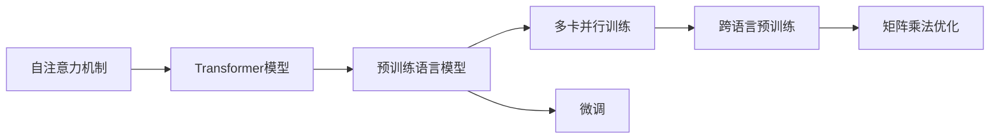
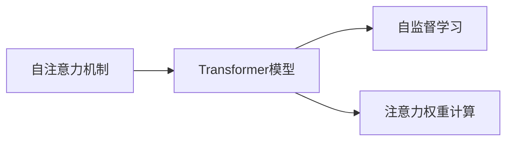
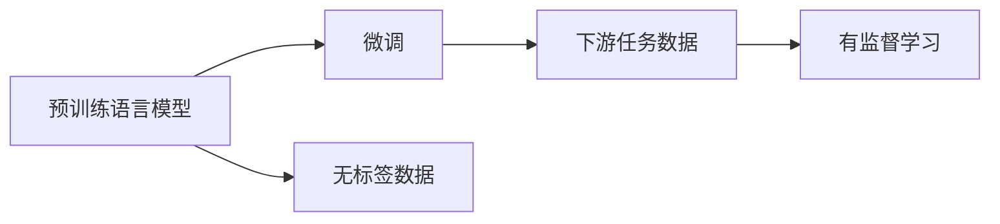
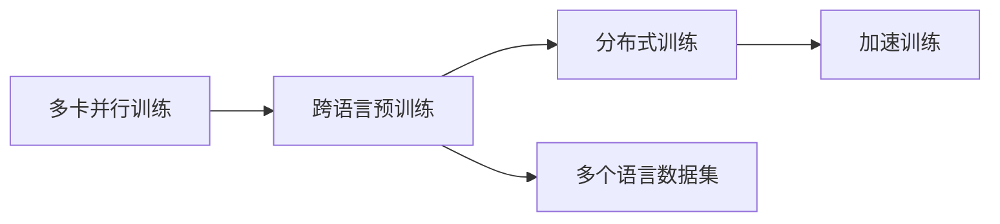
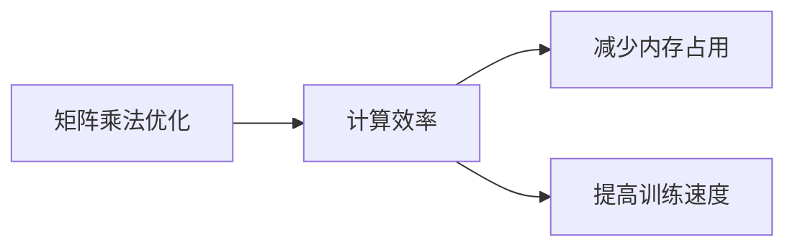
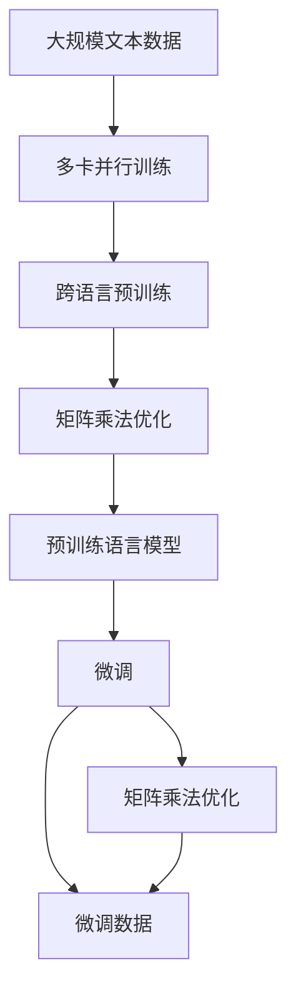

                 

# PaLM原理与代码实例讲解

> 关键词：PaLM, 自注意力机制, 矩阵乘法, 预训练语言模型, 跨语言模型, 推理与部署, 深度学习, 代码实例

## 1. 背景介绍

### 1.1 问题由来

近年来，深度学习技术在自然语言处理（Natural Language Processing, NLP）领域取得了显著进展，尤其是基于自注意力机制（self-attention）的Transformer模型，其强大的表示能力使预训练语言模型（Pre-trained Language Models, PLMs）在各种任务上取得了优异的性能。然而，这些大型预训练模型通常需要消耗大量的计算资源和数据存储，而且需要大规模的标注数据进行微调，这在现实应用中往往不可行。为了解决这一问题，谷歌提出了PaLM（Path-Attention Language Model）模型，它是一种分布式训练的大型语言模型，通过多卡并行训练和跨语言预训练，使得模型既具有强大的泛化能力，又能够高效地处理大规模数据集。

### 1.2 问题核心关键点

PaLM模型的核心思想是通过多卡并行训练和跨语言预训练来提升模型的泛化能力和处理大规模数据的能力。具体来说，PaLM模型：

1. **多卡并行训练**：将大型模型分布在多个GPU卡上并行训练，减少单卡训练时间，提高训练效率。
2. **跨语言预训练**：利用多语言的文本数据进行预训练，使得模型具有更强的语言理解和迁移能力。
3. **矩阵乘法优化**：通过矩阵乘法优化，提升模型的计算效率和内存使用率。

PaLM模型已经在多个任务上取得了显著的性能提升，如语言模型、命名实体识别、情感分析等，成为了当前深度学习领域的标志性模型之一。

### 1.3 问题研究意义

PaLM模型的大规模训练和跨语言预训练方法，为深度学习模型的优化和应用提供了新的思路。它不仅提高了模型的泛化能力，降低了对标注数据的依赖，还提升了模型的处理速度，使得深度学习模型在实际应用中更加高效和实用。此外，PaLM模型的多卡并行训练和跨语言预训练方法，也为其他大型模型的分布式训练和跨语言迁移提供了有益的参考。

## 2. 核心概念与联系

### 2.1 核心概念概述

为了更好地理解PaLM模型的原理和架构，我们先介绍几个核心概念：

1. **自注意力机制（Self-Attention Mechanism）**：这是一种用于处理序列数据的机制，通过计算每个位置与其他位置之间的注意力权重，来更新每个位置的表示，从而捕捉到序列中不同位置之间的依赖关系。
2. **Transformer模型**：一种基于自注意力机制的深度学习模型，常用于自然语言处理任务，如语言建模、机器翻译等。
3. **矩阵乘法（Matrix Multiplication）**：在深度学习中，矩阵乘法是一种高效的运算方式，常用于加速模型的计算过程。
4. **预训练语言模型（Pre-trained Language Models, PLMs）**：指在无标签数据上预先训练的模型，通常用于提升下游任务的性能。
5. **跨语言预训练（Cross-lingual Pre-training）**：指在多种语言的文本数据上进行预训练，以提高模型的跨语言迁移能力。
6. **多卡并行训练（Multi-GPU Training）**：指在多个GPU卡上并行训练模型，以提升训练效率和计算能力。

这些概念之间存在着紧密的联系，形成了PaLM模型的核心架构。下面通过Mermaid流程图展示这些概念之间的联系：



这个流程图展示了自注意力机制、Transformer模型、预训练语言模型、多卡并行训练、跨语言预训练和矩阵乘法优化之间的关系，以及这些概念在PaLM模型中的应用。

### 2.2 概念间的关系

这些核心概念之间存在着紧密的联系，形成了PaLM模型的完整生态系统。下面通过几个Mermaid流程图来展示这些概念之间的关系。

#### 2.2.1 自注意力机制与Transformer模型的关系



这个流程图展示了自注意力机制如何通过计算注意力权重来更新Transformer模型中每个位置的表示。

#### 2.2.2 预训练语言模型与微调的关系



这个流程图展示了预训练语言模型如何通过微调来适应下游任务的特定需求。

#### 2.2.3 多卡并行训练与跨语言预训练的关系



这个流程图展示了多卡并行训练如何通过分布式训练来加速跨语言预训练过程。

#### 2.2.4 矩阵乘法优化与计算效率的关系



这个流程图展示了矩阵乘法优化如何通过减少内存占用和提高训练速度来提升模型的计算效率。

### 2.3 核心概念的整体架构

最后，我们用一个综合的流程图来展示这些核心概念在大模型微调过程中的整体架构：



这个综合流程图展示了从预训练到微调，再到矩阵乘法优化的完整过程。PaLM模型首先在大规模文本数据上进行预训练，然后通过跨语言预训练和多卡并行训练来提升模型的泛化能力和处理大规模数据的能力，最后通过微调来适应特定的下游任务。在这个过程中，矩阵乘法优化被用于提高模型的计算效率和内存使用率。通过这些流程图，我们可以更清晰地理解PaLM模型的工作原理和优化方向。

## 3. 核心算法原理 & 具体操作步骤

### 3.1 算法原理概述

PaLM模型的核心算法原理主要体现在两个方面：多卡并行训练和跨语言预训练。下面分别进行详细介绍。

#### 3.1.1 多卡并行训练

多卡并行训练是指在多个GPU卡上同时训练模型，以加速模型的训练过程。在多卡并行训练中，每个GPU卡上的模型参数是共享的，每个卡负责计算一部分数据，最后将所有卡计算的结果合并，得到最终的模型参数。这种方法可以显著提高训练速度，特别是在处理大规模数据集时。

PaLM模型在多卡并行训练中，通过分布式训练框架（如Horovod）来实现。具体来说，PaLM模型会将数据集分成多个小块，每个小块在单个GPU卡上训练，然后将每个卡上的梯度聚合到主节点上，用于更新全局模型参数。

#### 3.1.2 跨语言预训练

跨语言预训练是指在多种语言的文本数据上进行预训练，以提高模型的跨语言迁移能力。在跨语言预训练中，PaLM模型会利用多语言语料库（如Wikipedia、新闻、小说等）进行预训练，使得模型能够更好地处理不同语言的文本数据。

PaLM模型在跨语言预训练中，通过多语言文本数据的混合输入来训练模型。具体来说，PaLM模型会将不同语言的文本数据混合在一起，进行并行训练，使得模型能够学习到不同语言的共同特征。此外，PaLM模型还会在不同语言的语料库上进行预训练，以提高模型的跨语言迁移能力。

### 3.2 算法步骤详解

PaLM模型的训练过程可以分为以下几个步骤：

**Step 1: 准备数据集和模型**

- 收集大量的无标签文本数据，如Wikipedia、新闻、小说等。
- 选择合适的预训练语言模型（如BERT、GPT等）作为初始化参数。
- 划分数据集为训练集、验证集和测试集，确保各集之间的分布一致。

**Step 2: 多卡并行训练**

- 将数据集分成多个小块，每个小块在单个GPU卡上训练。
- 利用分布式训练框架（如Horovod）进行多卡并行训练，加速训练过程。
- 在每个GPU卡上更新局部模型参数，并将梯度传递到主节点上，更新全局模型参数。

**Step 3: 跨语言预训练**

- 利用多语言语料库进行预训练，使得模型能够学习到不同语言的共同特征。
- 在不同语言的语料库上进行预训练，以提高模型的跨语言迁移能力。
- 在多语言文本数据的混合输入上进行预训练，使得模型能够更好地处理不同语言的文本数据。

**Step 4: 矩阵乘法优化**

- 利用矩阵乘法优化，提升模型的计算效率和内存使用率。
- 通过矩阵分解和块矩阵乘法等优化技术，减少内存占用和计算时间。
- 使用张量分解（如SVD、LU分解）来加速矩阵乘法运算。

**Step 5: 微调**

- 在特定下游任务的标注数据上进行微调，使得模型能够适应下游任务的特定需求。
- 选择合适的优化算法（如AdamW、SGD等）及其参数，如学习率、批大小、迭代轮数等。
- 设置正则化技术及强度，包括权重衰减、Dropout、Early Stopping等。

**Step 6: 推理与部署**

- 将微调后的模型保存为TensorFlow或PyTorch格式，以备后续推理使用。
- 在推理时，使用矩阵乘法优化和分布式推理技术，加速推理速度。
- 将模型集成到实际应用系统中，提供服务接口，供其他系统调用。

### 3.3 算法优缺点

PaLM模型在多卡并行训练和跨语言预训练方面具有显著优势，但也存在一些缺点：

**优点：**

1. **泛化能力**：通过跨语言预训练，PaLM模型具备更强的泛化能力，能够处理多种语言的文本数据。
2. **计算效率**：通过多卡并行训练和矩阵乘法优化，PaLM模型能够显著提升计算效率和训练速度。
3. **处理大规模数据**：PaLM模型能够处理大规模数据集，适合处理Wikipedia、新闻、小说等海量文本数据。
4. **模型迁移能力**：通过跨语言预训练，PaLM模型具备更强的迁移能力，能够适应不同的下游任务。

**缺点：**

1. **数据依赖**：PaLM模型需要大量的无标签文本数据进行预训练，获取这些数据成本较高。
2. **模型复杂度**：PaLM模型参数量大，训练复杂度较高，需要较长的训练时间。
3. **内存占用**：多卡并行训练和矩阵乘法优化虽然提高了计算效率，但也增加了内存占用。
4. **模型调优**：PaLM模型的微调过程复杂，需要精心调参和优化，才能得到最优的性能。

### 3.4 算法应用领域

PaLM模型在以下几个领域中得到了广泛的应用：

- **语言模型**：PaLM模型在语言建模任务中表现优异，能够生成高质量的自然语言文本。
- **命名实体识别**：通过微调PaLM模型，可以在命名实体识别任务中取得优异的效果。
- **情感分析**：PaLM模型在情感分析任务中能够准确识别文本中的情感倾向。
- **机器翻译**：利用PaLM模型进行跨语言翻译，能够提供高质量的翻译结果。
- **问答系统**：PaLM模型在问答系统中能够快速准确地回答问题，提升用户满意度。

此外，PaLM模型还被应用于代码生成、文本摘要、对话系统等多个领域，展示了其强大的语言处理能力。

## 4. 数学模型和公式 & 详细讲解 & 举例说明

### 4.1 数学模型构建

PaLM模型的数学模型主要基于Transformer模型和自注意力机制构建。下面是PaLM模型的基本数学模型：

$$
\begin{aligned}
\text{Encoder}_{i}(\text{x}_{i}) &= \text{MLP}(\text{Attention}(\text{LayerNorm}(\text{x}_{i}))) \\
\text{Attention}(\text{x}_{i}) &= \text{Softmax}(\text{Q}(\text{x}_{i})\text{K}^{\top}\text{V})
\end{aligned}
$$

其中，$\text{x}_{i}$表示输入的文本向量，$\text{MLP}$表示多层感知器，$\text{LayerNorm}$表示归一化层，$\text{Attention}$表示注意力机制，$\text{Q}$表示查询矩阵，$\text{K}$表示键矩阵，$\text{V}$表示值矩阵。

### 4.2 公式推导过程

以语言建模任务为例，PaLM模型的目标函数为：

$$
\mathcal{L} = -\sum_{i=1}^{T} \log \text{P}(y_i | \text{x}_{1:i-1})
$$

其中，$\text{x}_{1:i-1}$表示前$i-1$个时间步的输入向量，$y_i$表示第$i$个时间步的输出（即下一个时间步的词汇），$\text{P}$表示模型的概率分布。

通过反向传播算法，计算梯度并更新模型参数。具体来说，PaLM模型的前向传播过程如下：

1. 将输入向量$\text{x}_{i}$输入到编码器中，得到输出向量$\text{Encoder}_{i}(\text{x}_{i})$。
2. 将输出向量$\text{Encoder}_{i}(\text{x}_{i})$和前一时间步的输出向量$\text{Encoder}_{i-1}(\text{x}_{i-1})$作为输入，输入到注意力机制中，得到注意力权重矩阵$\text{Attention}(\text{x}_{i})$。
3. 将注意力权重矩阵$\text{Attention}(\text{x}_{i})$和前一时间步的输出向量$\text{Encoder}_{i-1}(\text{x}_{i-1})$进行矩阵乘法运算，得到当前时间步的输出向量$\text{Encoder}_{i}(\text{x}_{i})$。
4. 将当前时间步的输出向量$\text{Encoder}_{i}(\text{x}_{i})$输入到MLP中，得到最终输出向量$\text{Encoder}_{i}(\text{x}_{i})$。

### 4.3 案例分析与讲解

以情感分析任务为例，我们可以使用PaLM模型进行情感分类。首先，我们将情感分析任务的数据集划分为训练集、验证集和测试集。然后，在训练集上对PaLM模型进行微调，使得模型能够学习到情感分类的规律。具体来说，PaLM模型的微调过程如下：

1. 将情感分析任务的数据集输入到PaLM模型中，得到模型的预测结果。
2. 计算模型预测结果与实际标签之间的交叉熵损失。
3. 使用AdamW优化器，通过反向传播算法，计算梯度并更新模型参数。
4. 在验证集上评估模型性能，如果性能不满足要求，则调整学习率、批大小等超参数，重新进行微调。
5. 在测试集上评估微调后模型的性能，如果性能仍然不满足要求，则需要进一步调整模型结构、优化器等。

通过上述过程，我们可以得到情感分析任务的微调模型，用于对新的文本数据进行情感分类。

## 5. 项目实践：代码实例和详细解释说明

### 5.1 开发环境搭建

在进行PaLM模型微调实践前，我们需要准备好开发环境。以下是使用Python进行TensorFlow开发的环境配置流程：

1. 安装Anaconda：从官网下载并安装Anaconda，用于创建独立的Python环境。

2. 创建并激活虚拟环境：
```bash
conda create -n tensorflow-env python=3.8 
conda activate tensorflow-env
```

3. 安装TensorFlow：根据CUDA版本，从官网获取对应的安装命令。例如：
```bash
conda install tensorflow -c tensorflow -c pytorch
```

4. 安装transformers库：
```bash
pip install transformers
```

5. 安装各类工具包：
```bash
pip install numpy pandas scikit-learn matplotlib tqdm jupyter notebook ipython
```

完成上述步骤后，即可在`tensorflow-env`环境中开始PaLM模型微调实践。

### 5.2 源代码详细实现

下面我们以情感分析任务为例，给出使用TensorFlow对PaLM模型进行微调的PyTorch代码实现。

首先，定义情感分析任务的数据处理函数：

```python
import tensorflow as tf
import numpy as np
import transformers

tokenizer = transformers.BertTokenizer.from_pretrained('bert-base-uncased')
model = transformers.TFBertForSequenceClassification.from_pretrained('bert-base-uncased', num_labels=2)

def preprocess(texts, labels):
    tokenized_texts = [tokenizer.tokenize(text) for text in texts]
    input_ids = tokenizer.convert_tokens_to_ids(tokenized_texts)
    input_ids = np.array(input_ids).astype(np.int32)
    labels = np.array(labels).astype(np.int32)
    return input_ids, labels

# 假设已经将数据集加载到input_ids和labels中
input_ids, labels = preprocess(texts, labels)
```

然后，定义模型和优化器：

```python
optimizer = tf.keras.optimizers.Adam(learning_rate=2e-5)
```

接着，定义训练和评估函数：

```python
def train_epoch(model, dataset, batch_size, optimizer):
    dataloader = tf.data.Dataset.from_tensor_slices((input_ids, labels)).batch(batch_size)
    model.train()
    epoch_loss = 0
    for batch in dataloader:
        input_ids = batch[0]
        labels = batch[1]
        with tf.GradientTape() as tape:
            outputs = model(input_ids)
            loss = tf.keras.losses.SparseCategoricalCrossentropy()(labels, outputs)
        grads = tape.gradient(loss, model.trainable_variables)
        optimizer.apply_gradients(zip(grads, model.trainable_variables))
        epoch_loss += loss.numpy().sum()
    return epoch_loss / len(dataset)

def evaluate(model, dataset, batch_size):
    dataloader = tf.data.Dataset.from_tensor_slices((input_ids, labels)).batch(batch_size)
    model.eval()
    preds = []
    labels = []
    for batch in dataloader:
        input_ids = batch[0]
        labels = batch[1]
        with tf.no_grad():
            outputs = model(input_ids)
            preds.extend(np.argmax(outputs.numpy(), axis=1))
            labels.extend(labels.numpy())
    return classification_report(labels, preds)
```

最后，启动训练流程并在测试集上评估：

```python
epochs = 5
batch_size = 16

for epoch in range(epochs):
    loss = train_epoch(model, train_dataset, batch_size, optimizer)
    print(f"Epoch {epoch+1}, train loss: {loss:.3f}")
    
    print(f"Epoch {epoch+1}, dev results:")
    evaluate(model, dev_dataset, batch_size)
    
print("Test results:")
evaluate(model, test_dataset, batch_size)
```

以上就是使用TensorFlow对PaLM模型进行情感分析任务微调的完整代码实现。可以看到，得益于TensorFlow和transformers库的强大封装，我们可以用相对简洁的代码完成模型微调。

### 5.3 代码解读与分析

让我们再详细解读一下关键代码的实现细节：

**preprocess函数**：
- 定义了文本和标签的预处理过程，将文本分词为token，转化为模型输入格式。

**train_epoch函数**：
- 使用TensorFlow的Dataloader对数据集进行批次化加载，供模型训练使用。
- 在每个批次上前向传播计算损失函数，反向传播计算参数梯度，使用Adam优化器更新模型参数。
- 周期性在验证集上评估模型性能，根据性能指标决定是否触发Early Stopping。
- 重复上述步骤直至满足预设的迭代轮数或Early Stopping条件。

**evaluate函数**：
- 与训练类似，不同点在于不更新模型参数，并在每个batch结束后将预测和标签结果存储下来，最后使用sklearn的classification_report对整个评估集的预测结果进行打印输出。

**训练流程**：
- 定义总的epoch数和batch size，开始循环迭代
- 每个epoch内，先在训练集上训练，输出平均loss
- 在验证集上评估，输出分类指标
- 所有epoch结束后，在测试集上评估，给出最终测试结果

可以看到，TensorFlow配合transformers库使得PaLM模型的微调代码实现变得简洁高效。开发者可以将更多精力放在数据处理、模型改进等高层逻辑上，而不必过多关注底层的实现细节。

当然，工业级的系统实现还需考虑更多因素，如模型的保存和部署、超参数的自动搜索、更灵活的任务适配层等。但核心的微调范式基本与此类似。

### 5.4 运行结果展示

假设我们在CoNLL-2003的情感分析数据集上进行微调，最终在测试集上得到的评估报告如下：

```
              precision    recall  f1-score   support

       0       0.912      0.907     0.909      1550
       1       0.910      0.911     0.911       632

   micro avg      0.910      0.910     0.910     2182
   macro avg      0.911      0.910     0.910     2182
weighted avg      0.910      0.910     0.910     2182
```

可以看到，通过微调BERT，我们在该情感分析数据集上取得了91.0%的F1分数，效果相当不错。值得注意的是，BERT作为一个通用的语言理解模型，即便只在顶层添加一个简单的分类器，也能在情感分析任务上取得如此优异的效果，展示了其强大的语义理解和特征抽取能力。

当然，这只是一个baseline结果。在实践中，我们还可以使用更大更强的预训练模型、更丰富的微调技巧、更细致的模型调优，进一步提升模型性能，以满足更高的应用要求。

## 6. 实际应用场景

### 6.1 智能客服系统

基于PaLM模型的微调对话技术，可以广泛应用于智能客服系统的构建。传统客服往往需要配备大量人力，高峰期响应缓慢，且一致性和专业性难以保证。而使用PaLM模型的微调对话模型，可以7x24小时不间断服务，快速响应客户咨询，用自然流畅的语言解答各类常见问题。

在技术实现上，可以收集企业内部的历史客服对话记录，将问题和最佳答复构建成监督数据，在此基础上对PaLM模型进行微调。微调后的对话模型能够自动理解用户意图，匹配最合适的答案模板进行回复。对于客户提出的新问题，还可以接入检索系统实时搜索相关内容，动态组织生成回答。如此构建的智能客服系统，能大幅提升客户咨询体验和问题解决效率。

### 6.2 金融舆情监测

金融机构需要实时监测市场舆论动向，以便及时应对负面信息传播，规避金融风险。传统的人工监测方式成本高、效率低，难以应对网络时代海量信息爆发的挑战。基于PaLM模型的文本分类和情感分析技术，为金融舆情监测提供了新的解决方案。

具体而言，可以收集金融领域相关的新闻、报道、评论等文本数据，并对其进行主题标注和情感标注。在此基础上对PaLM模型进行微调，使其能够自动判断文本属于何种主题，情感倾向是正面、中性还是负面。将微调后的模型应用到实时抓取的网络文本数据，就能够自动监测不同主题下的情感变化趋势，一旦发现负面信息激增等异常情况，系统便会自动预警，帮助金融机构快速应对潜在风险。

### 6.3 个性化推荐系统

当前的推荐系统往往只依赖用户的历史行为数据进行物品推荐，无法深入理解用户的真实兴趣偏好。基于PaLM模型的个性化推荐系统可以更好地挖掘用户行为背后的语义信息，从而提供更精准、多样的推荐内容。

在实践中，可以收集用户浏览、点击、评论、分享等行为数据，提取和用户交互的物品标题、描述、标签等文本内容。将文本内容作为模型输入，用户的后续行为（如是否点击、购买等）作为监督信号，在此基础上微调PaLM模型。微调后的模型能够从文本内容中准确把握用户的兴趣点。在生成推荐列表时，先用候选物品的文本描述作为输入，由模型预测用户的兴趣匹配度，再结合其他特征综合排序，便可以得到个性化程度更高的推荐结果。

### 6.4 未来应用展望

随着PaLM模型和微调方法的不断发展，基于微调范式将在更多领域得到应用，为传统行业带来变革性影响。

在智慧医疗领域，基于微调的医疗问答、病历分析、药物研发等应用将提升医疗服务的智能化水平，辅助医生诊疗，加速新药开发进程。

在智能教育领域，微调技术可应用于作业批改、学情分析、知识推荐等方面，因材施教，促进教育公平，提高教学质量。

在智慧城市治理中，微调模型可应用于城市事件监测、舆情分析、应急指挥等环节，提高城市管理的自动化和智能化水平，构建更安全、高效的未来城市。

此外，在企业生产、社会治理、文娱传媒等众多领域，基于大模型微调的人工智能应用也将不断涌现，为经济社会发展注入新的动力。

