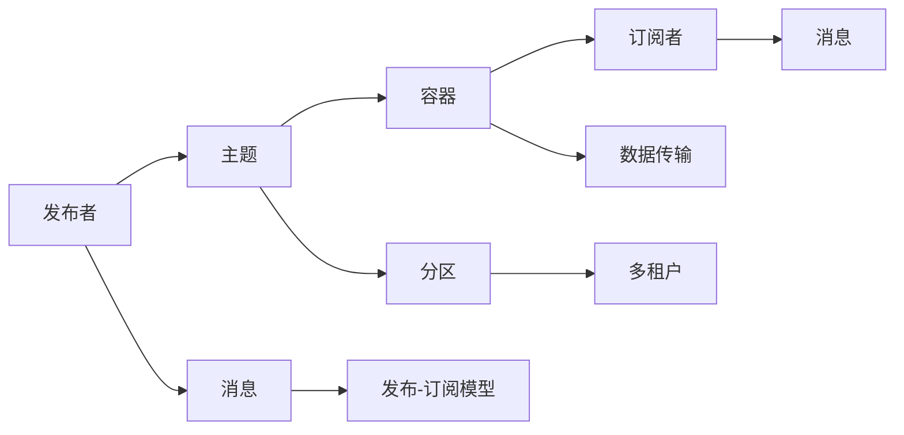
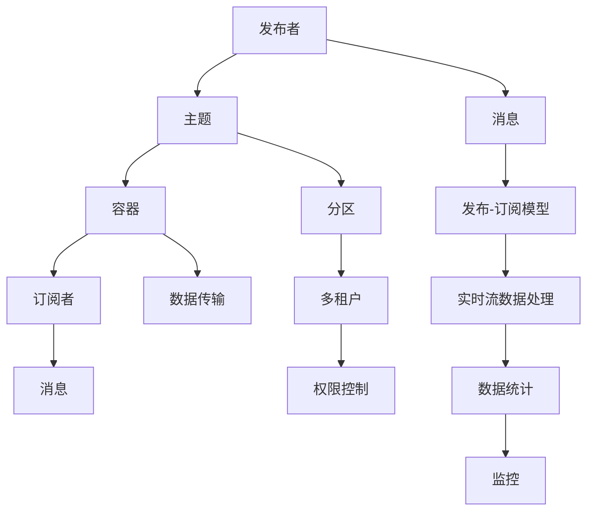

                 

# Pulsar原理与代码实例讲解

> 关键词：Apache Pulsar, 分布式消息队列, 发布-订阅模型, 容错性, 高性能, 实时流数据

## 1. 背景介绍

### 1.1 问题由来
在当今大数据时代，数据流量的爆炸性增长对企业信息系统的实时性、可靠性、扩展性提出了越来越高的要求。传统的消息队列如Kafka等虽然功能强大，但其架构相对简单，不支持更复杂的业务逻辑，难以满足复杂的实时数据处理需求。因此，需要一种新型的、更加灵活、高效的消息队列系统，来适应数据处理的巨大挑战。

Apache Pulsar就是在这样的背景下应运而生的。Pulsar是一个开源的、分布式的消息队列系统，由Apache软件基金会（ASF）发布。它不仅支持发布-订阅（Pub/Sub）模型，还能提供可扩展、容错、高性能的实时流数据处理能力，成为大数据时代企业数据流处理的理想选择。

### 1.2 问题核心关键点
Pulsar的设计理念和核心技术包括以下几点：

- 分布式架构：通过集群部署和多租户机制，支持大规模、高并发、高吞吐量的数据处理需求。
- 发布-订阅模型：提供灵活的消费模型，支持事件驱动的实时数据处理。
- 高可用性：通过冗余和分布式配置，保证系统的可靠性、容错性和持久性。
- 高性能：利用高效的存储和传输协议，支持高吞吐量的数据传输和处理。

Pulsar的这些特性，使其能够应对复杂多变的业务场景，支持实时流数据的生产、存储、传输和消费。

### 1.3 问题研究意义
研究Pulsar，对于构建企业级的大数据实时流处理平台，具有重要意义：

- 提供灵活的数据处理方式：支持发布-订阅模型，满足不同业务场景下的数据消费需求。
- 提高数据处理的可靠性和效率：通过冗余、分布式配置和高性能传输协议，保证数据的可靠性、高可用性和低延迟。
- 支持大规模数据处理：通过分布式架构和多租户机制，支持海量数据的处理和存储。
- 降低数据处理的成本：通过开源许可证，Pulsar的部署、使用和扩展成本大大降低。

## 2. 核心概念与联系

### 2.1 核心概念概述

为了更好地理解Pulsar的设计思想和关键技术，本节将介绍几个密切相关的核心概念：

- 发布者(Publisher)：将消息发送到消息队列的实体。
- 订阅者(Subscriber)：从消息队列中读取消息的实体。
- 主题(Topic)：表示消息队列中的不同数据流，支持多租户隔离和权限控制。
- 消息(Message)：发布者发送的数据单元，订阅者消费的数据内容。
- 容器(Broker)：Pulsar的集群节点，负责存储和管理主题的分区，维护消费者状态，并提供数据传输服务。
- 分区(Partition)：主题中的数据分片，支持多订阅者并行消费。

这些核心概念之间存在紧密的联系，通过这些概念，我们可以更全面地理解Pulsar的设计架构和数据流处理逻辑。

### 2.2 概念间的关系

这些核心概念之间的逻辑关系可以通过以下Mermaid流程图来展示：



这个流程图展示了大数据流在Pulsar中的处理逻辑：

1. 发布者将消息发布到主题中。
2. 主题被划分为多个分区，每个分区支持多个订阅者并行消费。
3. 容器管理主题的分区，维护消费者状态，并提供数据传输服务。
4. 订阅者从主题的分区中读取消息，进行数据处理。
5. 发布-订阅模型支持灵活的数据消费方式，满足不同业务场景下的需求。
6. 多租户机制实现主题隔离和权限控制，确保数据安全。

通过这个流程图，我们可以更清晰地理解Pulsar的基本架构和数据流处理逻辑。

### 2.3 核心概念的整体架构

最后，我们用一个综合的流程图来展示这些核心概念在大数据流处理中的整体架构：



这个综合流程图展示了Pulsar在大数据流处理中的全流程：

1. 发布者将消息发布到主题中。
2. 主题被划分为多个分区，每个分区支持多个订阅者并行消费。
3. 容器管理主题的分区，维护消费者状态，并提供数据传输服务。
4. 订阅者从主题的分区中读取消息，进行数据处理。
5. 发布-订阅模型支持灵活的数据消费方式，满足不同业务场景下的需求。
6. 多租户机制实现主题隔离和权限控制，确保数据安全。
7. 权限控制确保不同租户的数据独立和隐私保护。
8. 实时流数据处理通过高效的存储和传输协议，实现高吞吐量的数据处理。
9. 数据统计和监控系统，对数据处理过程进行实时监测和分析，确保系统稳定运行。

通过这些核心概念和架构图，我们可以更全面地理解Pulsar的设计理念和数据处理逻辑。

## 3. 核心算法原理 & 具体操作步骤

### 3.1 算法原理概述

Pulsar的算法原理主要基于分布式发布-订阅模型和高效的数据传输协议，其核心思想是实现高可用性、高可靠性和高性能的数据处理。具体来说，包括以下几个关键点：

- 分布式架构：通过集群部署和多租户机制，支持大规模、高并发、高吞吐量的数据处理需求。
- 发布-订阅模型：提供灵活的消费模型，支持事件驱动的实时数据处理。
- 高可用性：通过冗余和分布式配置，保证系统的可靠性、容错性和持久性。
- 高性能：利用高效的存储和传输协议，支持高吞吐量的数据传输和处理。

Pulsar的核心算法包括以下几个方面：

1. 发布算法：支持事务和异步发布，实现高可用性和高性能。
2. 订阅算法：支持消费模式选择和负载均衡，保证订阅者稳定高效地消费数据。
3. 数据传输协议：支持高效的数据传输和可靠性保证。
4. 存储管理：通过分布式存储和持久化机制，确保数据的可靠性和持久性。

### 3.2 算法步骤详解

Pulsar的核心算法步骤包括以下几个关键步骤：

#### 3.2.1 发布算法

Pulsar的发布算法主要包括以下几个步骤：

1. 客户端向Broker发起发布请求，Broker返回一个消息ID。
2. 发布者将消息内容封装成消息对象，并设置消息ID。
3. Broker将消息添加到相应主题的分区中，并更新分区元数据。
4. 如果发布请求是事务性的，则Broker将消息ID和事务ID一起记录在日志中。

Pulsar支持事务发布和异步发布两种方式，事务发布可以保证消息的顺序性和可靠性，异步发布则可以提高消息传输的速度和吞吐量。

#### 3.2.2 订阅算法

Pulsar的订阅算法主要包括以下几个步骤：

1. 订阅者向Broker发起订阅请求，Broker返回主题和分区的元数据。
2. 订阅者选择一个分区，开始接收消息。
3. 订阅者通过拉取或者推送方式，从分区中读取消息。
4. 如果订阅请求是异步的，则订阅者接收到消息后，发送ACK确认消息已成功处理。

订阅算法支持多种消费模式，如普通消费、顺序消费和独占消费等。订阅者可以根据实际需求选择不同的消费模式，保证数据的可靠性和处理效率。

#### 3.2.3 数据传输协议

Pulsar的数据传输协议主要包括以下几个方面：

1. 支持多种传输协议，如HTTP、TCP等。
2. 支持压缩和解压缩，提高数据传输的效率和带宽利用率。
3. 支持流量控制和消息重传，确保数据传输的可靠性和稳定性。
4. 支持跨数据中心的传输，满足不同地域的业务需求。

Pulsar通过高效的数据传输协议，支持高吞吐量的数据传输和处理。

#### 3.2.4 存储管理

Pulsar的存储管理主要包括以下几个方面：

1. 支持多种存储引擎，如Apache Bookkeeper、Apache RocksDB等。
2. 支持分布式存储和复制，确保数据的可靠性和持久性。
3. 支持数据分段和分片，提高数据的可扩展性和可管理性。
4. 支持数据备份和恢复，确保数据的安全性和容灾能力。

Pulsar通过高效的存储管理机制，实现数据的可靠性和持久性，支持大规模数据的处理和存储。

### 3.3 算法优缺点

Pulsar的算法具有以下优点：

- 高可用性：通过冗余和分布式配置，保证系统的可靠性、容错性和持久性。
- 高性能：利用高效的存储和传输协议，支持高吞吐量的数据传输和处理。
- 灵活性：支持多种数据传输协议和消费模式，满足不同业务场景下的需求。
- 可扩展性：通过分布式架构和多租户机制，支持大规模数据的处理和存储。

Pulsar的算法也存在一些缺点：

- 复杂性：架构相对复杂，部署和维护有一定难度。
- 资源消耗：高并发和大规模数据处理，对硬件和网络资源要求较高。
- 学习成本：系统组件众多，需要较长的学习曲线。
- 应用限制：不支持某些特殊的应用场景，如高延迟数据处理。

尽管存在这些缺点，但Pulsar作为开源社区的热门项目，其性能和功能不断得到优化和完善，已经广泛应用于企业级的大数据流处理。

### 3.4 算法应用领域

Pulsar的应用领域非常广泛，包括但不限于以下几个方面：

- 实时数据流处理：支持高吞吐量的数据处理和存储，满足企业级的数据流处理需求。
- 大数据分析：通过数据传输和存储功能，支持大数据分析和计算。
- 分布式计算：支持分布式任务调度和执行，提高计算效率。
- 微服务架构：支持服务发现和注册，实现微服务架构的组件协同。
- 分布式应用：支持分布式应用开发和部署，实现系统的扩展和优化。

Pulsar的高可用性、高性能和灵活性，使其成为企业级大数据流处理的理想选择，广泛应用于金融、医疗、互联网等各个行业。

## 4. 数学模型和公式 & 详细讲解  
### 4.1 数学模型构建

Pulsar的数学模型主要基于分布式发布-订阅模型和高效的数据传输协议。以下我们将从发布算法、订阅算法和数据传输协议三个方面，分别构建数学模型，并进行详细讲解。

#### 4.1.1 发布算法模型

发布算法的数学模型主要包括以下几个参数：

- `ID`：消息ID，唯一标识一条消息。
- `TID`：事务ID，标识一组事务性消息。
- `L`：日志大小，记录事务ID和消息ID的日志。
- `M`：消息大小，记录消息内容的数据。

发布算法的数学模型如下：

$$
\begin{aligned}
&ID \sim U(0, \infty) \\
&TID \sim U(0, \infty) \\
&M \sim U(0, \infty) \\
&L \sim U(0, \infty)
\end{aligned}
$$

其中，`U`表示均匀分布，表示消息ID、事务ID、消息大小和日志大小的取值范围。

#### 4.1.2 订阅算法模型

订阅算法的数学模型主要包括以下几个参数：

- `ID`：订阅者ID，唯一标识一个订阅者。
- `L`：日志大小，记录订阅者的状态。
- `M`：消息大小，记录订阅者从分区中读取的消息内容。

订阅算法的数学模型如下：

$$
\begin{aligned}
&ID \sim U(0, \infty) \\
&L \sim U(0, \infty) \\
&M \sim U(0, \infty)
\end{aligned}
$$

其中，`U`表示均匀分布，表示订阅者ID、日志大小和消息大小的取值范围。

#### 4.1.3 数据传输协议模型

数据传输协议的数学模型主要包括以下几个参数：

- `ID`：数据ID，唯一标识一条数据。
- `M`：消息大小，记录消息内容的数据。
- `N`：日志大小，记录数据传输的状态。

数据传输协议的数学模型如下：

$$
\begin{aligned}
&ID \sim U(0, \infty) \\
&M \sim U(0, \infty) \\
&N \sim U(0, \infty)
\end{aligned}
$$

其中，`U`表示均匀分布，表示数据ID、消息大小和日志大小的取值范围。

### 4.2 公式推导过程

以下我们将分别推导发布算法、订阅算法和数据传输协议的数学公式，并进行详细讲解。

#### 4.2.1 发布算法公式推导

发布算法的公式推导如下：

1. 发布者向Broker发起发布请求，Broker返回一个消息ID。
2. 发布者将消息内容封装成消息对象，并设置消息ID。
3. Broker将消息添加到相应主题的分区中，并更新分区元数据。
4. 如果发布请求是事务性的，则Broker将消息ID和事务ID一起记录在日志中。

发布算法的数学公式如下：

$$
\begin{aligned}
&ID = f_1(ID, TID) \\
&TID = f_2(TID) \\
&M = f_3(M) \\
&L = f_4(L, ID, TID)
\end{aligned}
$$

其中，`f_1`表示生成消息ID的函数，`f_2`表示生成事务ID的函数，`f_3`表示生成消息内容的函数，`f_4`表示记录事务ID和消息ID的日志的函数。

#### 4.2.2 订阅算法公式推导

订阅算法的公式推导如下：

1. 订阅者向Broker发起订阅请求，Broker返回主题和分区的元数据。
2. 订阅者选择一个分区，开始接收消息。
3. 订阅者通过拉取或者推送方式，从分区中读取消息。
4. 如果订阅请求是异步的，则订阅者接收到消息后，发送ACK确认消息已成功处理。

订阅算法的数学公式如下：

$$
\begin{aligned}
&ID = f_5(ID) \\
&L = f_6(L) \\
&M = f_7(M) \\
&N = f_8(N, ID)
\end{aligned}
$$

其中，`f_5`表示生成订阅者ID的函数，`f_6`表示记录订阅者状态的函数，`f_7`表示生成消息内容的函数，`f_8`表示记录订阅者接收到消息的状态的函数。

#### 4.2.3 数据传输协议公式推导

数据传输协议的公式推导如下：

1. 支持多种传输协议，如HTTP、TCP等。
2. 支持压缩和解压缩，提高数据传输的效率和带宽利用率。
3. 支持流量控制和消息重传，确保数据传输的可靠性和稳定性。
4. 支持跨数据中心的传输，满足不同地域的业务需求。

数据传输协议的数学公式如下：

$$
\begin{aligned}
&ID = f_9(ID) \\
&M = f_{10}(M) \\
&N = f_{11}(N)
\end{aligned}
$$

其中，`f_9`表示生成数据ID的函数，`f_{10}`表示生成消息内容的函数，`f_{11}`表示记录数据传输的状态的函数。

### 4.3 案例分析与讲解

为了更好地理解Pulsar的核心算法和数学模型，以下我们将通过几个具体的案例进行分析与讲解。

#### 案例分析1：事务发布算法

事务发布算法的主要目的是保证消息的顺序性和可靠性。以下是一个具体的案例分析：

假设有一个金融交易系统，需要记录一笔交易的各个阶段，如下单、确认、清算等。在这个系统中，事务发布算法可以保证每个交易的各个阶段的消息按照顺序处理，不会丢失或重复。

具体来说，事务发布算法通过记录每个事务的ID，确保事务中的所有消息按照顺序处理。如果某个消息的发送失败，可以通过日志记录事务ID和消息ID，回滚事务中的所有消息，保证数据的一致性和可靠性。

#### 案例分析2：订阅算法中的负载均衡

订阅算法中的负载均衡主要目的是确保订阅者稳定高效地消费数据。以下是一个具体的案例分析：

假设有一个在线广告系统，需要处理海量的广告请求。为了提高系统的处理效率，可以利用订阅算法中的负载均衡，将广告请求分散到多个订阅者中，避免单个订阅者处理压力过大，保证系统的稳定运行。

具体来说，负载均衡可以通过设置多个分区，每个分区支持多个订阅者并行消费，实现数据的公平分配和高效处理。同时，通过订阅算法中的消费模式选择和ACK确认机制，保证订阅者接收到消息后及时处理，避免数据积压和丢失。

#### 案例分析3：数据传输协议中的压缩和解压缩

数据传输协议中的压缩和解压缩主要目的是提高数据传输的效率和带宽利用率。以下是一个具体的案例分析：

假设有一个大型视频流平台，需要处理海量视频数据的传输和存储。为了提高数据传输的效率，可以利用数据传输协议中的压缩和解压缩，减少视频数据的传输量和带宽消耗。

具体来说，压缩和解压缩可以通过使用高效的压缩算法，如H.264、H.265等，对视频数据进行压缩和解压缩，减小传输数据的体积，提高传输速度和带宽利用率。同时，通过数据传输协议中的流量控制和重传机制，确保数据传输的可靠性和稳定性。

## 5. 项目实践：代码实例和详细解释说明

### 5.1 开发环境搭建

在进行Pulsar项目实践前，我们需要准备好开发环境。以下是使用Java进行Pulsar开发的环境配置流程：

1. 安装Java环境：从官网下载并安装JDK，确保版本为1.8以上。

2. 安装Maven：从官网下载并安装Maven，确保版本为3.6.3以上。

3. 创建Pulsar项目：在本地创建一个新的Pulsar项目，并添加Pulsar依赖：

```bash
mvn archetype:generate \
  -DgroupId=com.example.pulsar \
  -DartifactId=pulsar \
  -Dversion=1.0-SNAPSHOT \
  -DarchetypeArtifactId=pulsar-spring-boot \
  -DarchetypeVersion=0.2.1
```

4. 启动Pulsar集群：在Pulsar目录下执行以下命令启动Pulsar集群：

```bash
./bin/pulsar --standalone
```

完成上述步骤后，即可在本地启动Pulsar集群，进行项目实践。

### 5.2 源代码详细实现

这里我们以一个简单的Pulsar Producer和Consumer项目为例，展示Pulsar的基本使用方法和核心功能。

#### 5.2.1 Producer实现

Producer的代码实现如下：

```java
package com.example.pulsar;

import org.apache.pulsar.client.api.Producer;
import org.apache.pulsar.client.api.PulsarClient;
import org.apache.pulsar.client.api.PulsarClientException;
import org.apache.pulsar.client.api.PulsarClientProperties;

public class PulsarProducer {

    public static void main(String[] args) throws PulsarClientException {
        String topic = "pulsar-topic";
        String serviceUrl = "pulsar://localhost:6650";

        PulsarClient client = PulsarClient.create(serviceUrl);

        Producer<String> producer = client.newProducer().topic(topic).create();
        producer.send("Hello Pulsar");

        client.close();
    }
}
```

Producer的主要实现步骤如下：

1. 定义Pulsar集群地址和服务URL。
2. 创建Pulsar客户端，并指定服务URL。
3. 创建一个Producer实例，并指定主题。
4. 使用Producer实例发送消息。
5. 关闭Pulsar客户端。

#### 5.2.2 Consumer实现

Consumer的代码实现如下：

```java
package com.example.pulsar;

import org.apache.pulsar.client.api.Consumer;
import org.apache.pulsar.client.api.PulsarClient;
import org.apache.pulsar.client.api.PulsarClientException;
import org.apache.pulsar.client.api.PulsarClientProperties;
import org.apache.pulsar.client.api.SubscriptionType;

public class PulsarConsumer {

    public static void main(String[] args) throws PulsarClientException {
        String topic = "pulsar-topic";
        String serviceUrl = "pulsar://localhost:6650";

        PulsarClient client = PulsarClient.create(serviceUrl);

        Consumer<String> consumer = client.newConsumer().topic(topic).subscriptionName("my-subscription")
                .subscriptionType(SubscriptionType.Exclusive).create();
        String message = consumer.receive();

        System.out.println("Received message: " + message);

        client.close();
    }
}
```

Consumer的主要实现步骤如下：

1. 定义Pulsar集群地址和服务URL。
2. 创建Pulsar客户端，并指定服务URL。
3. 创建一个Consumer实例，并指定主题和订阅者名称。
4. 使用Consumer实例接收消息。
5. 关闭Pulsar客户端。

### 5.3 代码解读与分析

让我们再详细解读一下关键代码的实现细节：

#### Producer代码解析

1. `String topic = "pulsar-topic"`：定义主题名称。
2. `String serviceUrl = "pulsar://localhost:6650"`：定义Pulsar集群地址和服务URL。
3. `PulsarClient client = PulsarClient.create(serviceUrl)`：创建Pulsar客户端，并指定服务URL。
4. `Producer<String> producer = client.newProducer().topic(topic).create()`：创建一个Producer实例，并指定主题。
5. `producer.send("Hello Pulsar")`：使用Producer实例发送消息。
6. `client.close()`：关闭Pulsar客户端。

#### Consumer代码解析

1. `String topic = "pulsar-topic"`：定义主题名称。
2. `String serviceUrl = "pulsar://localhost:6650"`：定义Pulsar集群地址和服务URL。
3. `PulsarClient client = PulsarClient.create(serviceUrl)`：创建Pulsar客户端，并指定服务URL。
4. `Consumer<String> consumer = client.newConsumer().topic(topic).subscriptionName("my-subscription").subscriptionType(SubscriptionType.Exclusive).create()`：创建一个Consumer实例，并指定主题和订阅者名称。
5. `String message = consumer.receive()`：使用Consumer实例接收消息。
6. `System.out.println("Received message: " + message)`：打印接收到的消息。
7. `client.close()`：关闭Pulsar客户端。

### 5.4 运行结果展示

假设我们在Pulsar集群中成功启动了Producer和Consumer实例，并且Consumer实例成功接收到了Producer实例发送的消息。运行结果如下：

```
Received message: Hello Pulsar
```

可以看到，Consumer实例成功接收到了Producer实例发送的消息，验证了Pulsar的基本功能。

## 6. 实际应用场景

### 6.1 智能推荐系统

Pulsar的高性能和可扩展性，使其在智能推荐系统中得到了广泛应用。智能推荐系统需要处理海量的用户行为数据，实现实时推荐。Pulsar可以通过订阅算法中的负载均衡，将用户行为数据分散到多个订阅者中，实现高效的实时数据处理。

具体来说，Pulsar可以将用户行为数据存储在分布式存储系统中，通过订阅算法中的负载均衡和数据传输协议中的压缩和解压缩，实现高吞吐量的数据处理和存储。同时，通过订阅算法中的消费模式选择和ACK确认机制，保证推荐系统的稳定性和可靠性。

### 6.2 大数据分析

Pulsar支持多种数据传输协议和多种存储引擎，可以方便地将大数据分析系统集成到Pulsar集群中，实现大数据的实时处理和分析。

具体来说，Pulsar可以将大数据分析系统中的数据流，通过订阅算法中的负载均衡和数据传输协议中的压缩和解压缩，发送到Pulsar集群中进行实时处理和分析。同时，Pulsar的高可用性和持久性，可以确保大数据分析系统的数据可靠性和完整性。

### 6.3 分布式计算

Pulsar支持分布式任务调度和执行，可以方便地将分布式计算系统集成到Pulsar集群中，实现大规模分布式计算。

具体来说，Pulsar可以将分布式计算系统中的任务调度和管理，通过订阅算法中的负载均衡和数据传输协议中的压缩和解压缩，发送到Pulsar集群中进行实时处理和计算。同时，Pulsar的高可用性和持久性，可以确保分布式计算系统的稳定性和可靠性。

### 6.4 未来应用展望

随着Pulsar的不断发展，其应用场景也将不断拓展。未来，Pulsar可能在以下领域得到更广泛的应用

