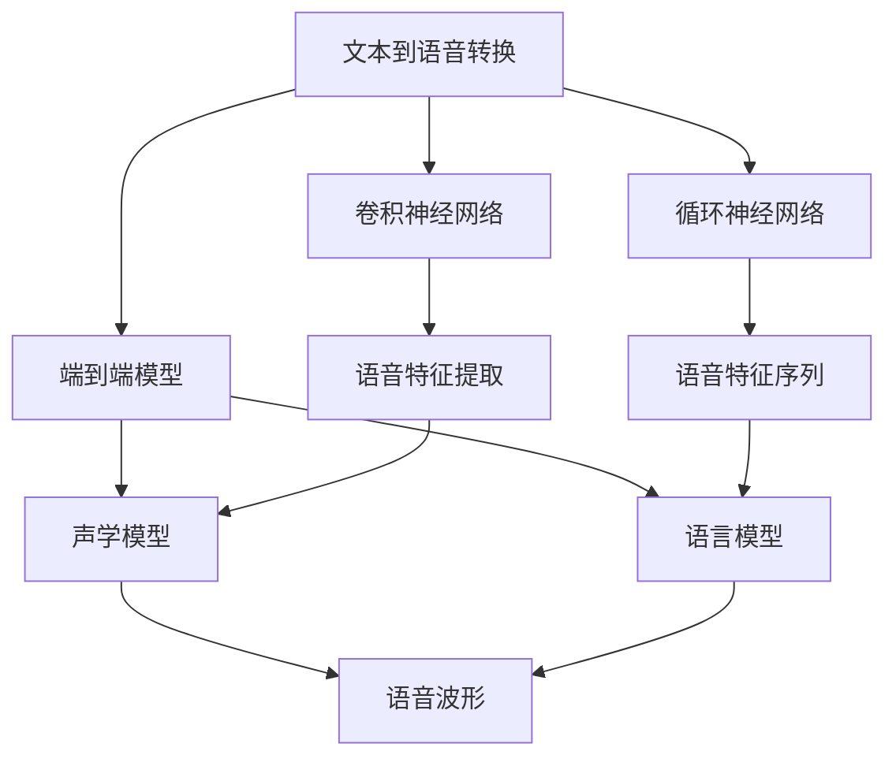
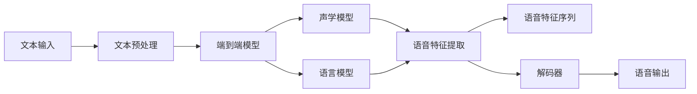

                 

# Python深度学习实践：实时语音转换技术探索

> 关键词：实时语音转换,深度学习,卷积神经网络,端到端模型,声学模型,语言模型,自动语音识别,自动语音合成

## 1. 背景介绍

### 1.1 问题由来

在现代社会，语音交流越来越成为人们日常交流的重要方式。然而，由于地域、语言、口音等因素的限制，不同地区、不同语言间的语音交流往往面临障碍。为了解决这一问题，语音转换技术应运而生。语音转换技术可以将一个说话人的语音转换为另一个说话人的语音，从而实现跨语言、跨地域的语音交流。

语音转换技术可以分为文本到语音转换（Text-to-Speech, TTS）和语音到文本转换（Speech-to-Text, STT）两个方向。文本到语音转换是将文本转换为语音的过程，语音到文本转换是将语音转换为文本的过程。

近年来，深度学习技术在语音转换领域得到了广泛应用，特别是卷积神经网络（Convolutional Neural Network, CNN）和循环神经网络（Recurrent Neural Network, RNN）的应用，使得语音转换的效果大大提升。本文将深入探讨基于深度学习的实时语音转换技术，包括实时文本到语音转换（Real-Time Text-to-Speech, RT-TTS）和实时语音到文本转换（Real-Time Speech-to-Text, RT-STT）。

### 1.2 问题核心关键点

实时语音转换技术的关键在于实现高效的端到端模型，即从文本输入到语音输出的直接转换，或者从语音输入到文本输出的直接转换。这种端到端模型可以大大简化系统的复杂度，提升实时转换的效率和准确性。

端到端模型的训练通常包括两个部分：声学模型和语言模型。声学模型负责将文本转换为语音特征，语言模型负责生成语音特征序列，最终通过解码器将语音特征序列转换为语音波形。

本文将重点探讨使用深度学习技术构建端到端语音转换模型的算法原理和具体操作步骤，同时提供实际的代码实现和应用场景。

### 1.3 问题研究意义

实时语音转换技术的广泛应用具有重要意义：

1. **跨语言交流**：不同语言之间进行实时语音转换，使得不同语言使用者之间的交流更加便捷。

2. **无障碍交流**：对于听力障碍或者言语障碍的人群，实时语音转换技术可以大大提升其交流能力。

3. **个性化定制**：通过个性化语音转换模型，可以生成独特的语音风格，满足用户的个性化需求。

4. **实时交互**：实时语音转换技术可以应用于智能语音助手、在线教育、虚拟主播等领域，提升用户体验。

5. **工业应用**：实时语音转换技术可以应用于工业生产中的自动化语音交互系统，提高生产效率。

总之，实时语音转换技术不仅可以提升用户的语音交流体验，还可以在多个领域带来显著的效益。

## 2. 核心概念与联系

### 2.1 核心概念概述

在探讨实时语音转换技术时，我们需要理解以下核心概念：

- **文本到语音转换（Text-to-Speech, TTS）**：将文本转换为语音的过程，是实时语音转换技术的重要组成部分。

- **语音到文本转换（Speech-to-Text, STT）**：将语音转换为文本的过程，也是实时语音转换技术的重要组成部分。

- **卷积神经网络（Convolutional Neural Network, CNN）**：适用于处理语音特征提取的任务，能够有效捕捉语音信号中的局部特征。

- **循环神经网络（Recurrent Neural Network, RNN）**：适用于处理语音特征序列的任务，能够有效捕捉语音信号的时间依赖关系。

- **端到端模型（End-to-End Model）**：将文本转换为语音或将语音转换为文本的直接转换模型，避免了传统音素到音素、音素到文本的中间转换步骤。

这些核心概念构成了实时语音转换技术的理论基础，也是我们探讨实时语音转换技术的关键点。

### 2.2 概念间的关系

这些核心概念之间的关系可以通过以下Mermaid流程图来展示：



这个流程图展示了文本到语音转换和语音到文本转换的主要技术组件，包括CNN、RNN和端到端模型。这些组件之间相互配合，共同完成了从文本到语音或从语音到文本的转换过程。

### 2.3 核心概念的整体架构

最后，我们用一个综合的流程图来展示这些核心概念在大规模语音转换系统中的整体架构：



这个综合流程图展示了从文本输入到语音输出的完整流程，包括文本预处理、端到端模型、声学模型、语言模型、语音特征提取、语音特征序列、解码器和语音输出。

## 3. 核心算法原理 & 具体操作步骤
### 3.1 算法原理概述

实时语音转换技术的核心算法原理基于端到端模型，包括声学模型和语言模型。

#### 3.1.1 声学模型

声学模型的主要任务是将文本转换为语音特征序列。声学模型的输入为文本，输出为语音特征序列，通常使用循环神经网络来实现。

#### 3.1.2 语言模型

语言模型的主要任务是生成语音特征序列，通常使用循环神经网络来实现。语言模型的输入为语音特征序列，输出为文本，通过训练得到语音特征序列到文本的概率分布。

#### 3.1.3 解码器

解码器的主要任务是将语音特征序列转换为语音波形，通常使用深度卷积神经网络来实现。

### 3.2 算法步骤详解

#### 3.2.1 数据准备

- **文本数据**：从文本到语音转换任务中，需要准备大量文本数据，用于训练文本到语音转换模型。
- **语音数据**：从语音到文本转换任务中，需要准备大量语音数据，用于训练语音到文本转换模型。

#### 3.2.2 模型构建

- **文本到语音转换模型**：使用卷积神经网络和循环神经网络构建文本到语音转换模型。
- **语音到文本转换模型**：使用卷积神经网络和循环神经网络构建语音到文本转换模型。

#### 3.2.3 训练

- **声学模型训练**：使用文本和语音特征序列数据，训练声学模型。
- **语言模型训练**：使用语音特征序列和文本数据，训练语言模型。
- **解码器训练**：使用语音特征序列数据，训练解码器。

#### 3.2.4 模型评估

- **声学模型评估**：使用测试数据集评估声学模型的性能。
- **语言模型评估**：使用测试数据集评估语言模型的性能。
- **解码器评估**：使用测试数据集评估解码器的性能。

#### 3.2.5 模型融合

- **端到端模型融合**：将声学模型、语言模型和解码器融合为端到端模型，用于实时语音转换。

### 3.3 算法优缺点

#### 3.3.1 优点

- **高效实时**：端到端模型可以高效实时地进行语音转换，适用于实时语音交互系统。
- **性能优越**：通过深度学习模型的训练，可以显著提升语音转换的准确性和自然度。
- **可扩展性**：端到端模型可以根据需要灵活扩展，适用于多种语音转换任务。

#### 3.3.2 缺点

- **数据需求高**：需要大量的文本和语音数据进行训练，数据收集和标注成本较高。
- **计算资源消耗大**：深度学习模型训练和推理需要大量计算资源，训练时间较长。
- **模型复杂度高**：端到端模型复杂度较高，模型调试和优化难度大。

### 3.4 算法应用领域

实时语音转换技术可以应用于以下领域：

- **智能语音助手**：智能语音助手可以通过实时语音转换技术，与用户进行自然语言交互。
- **在线教育**：在线教育平台可以通过实时语音转换技术，实现语音录制和播放，提升教学效果。
- **虚拟主播**：虚拟主播可以通过实时语音转换技术，实现语音合成，提高互动性和娱乐性。
- **工业生产**：工业生产中的自动化语音交互系统可以通过实时语音转换技术，实现语音控制和指令交互。

## 4. 数学模型和公式 & 详细讲解 & 举例说明
### 4.1 数学模型构建

#### 4.1.1 声学模型

声学模型的数学模型可以表示为：

$$
p(y|x) = \prod_{t=1}^{T} p(y_t|y_{<t}, x)
$$

其中，$y$为语音特征序列，$x$为文本，$T$为语音特征序列的长度。

#### 4.1.2 语言模型

语言模型的数学模型可以表示为：

$$
p(x|y) = \frac{p(y|x)}{p(y)}
$$

其中，$x$为文本，$y$为语音特征序列。

#### 4.1.3 解码器

解码器的数学模型可以表示为：

$$
p(y|x) = \prod_{t=1}^{T} p(y_t|y_{<t}, x)
$$

其中，$y$为语音特征序列，$x$为文本，$T$为语音特征序列的长度。

### 4.2 公式推导过程

#### 4.2.1 声学模型

声学模型的推导过程如下：

1. 定义声学模型：

$$
p(y|x) = \prod_{t=1}^{T} p(y_t|y_{<t}, x)
$$

2. 使用循环神经网络进行建模：

$$
y_t = f(x, y_{<t}, \theta)
$$

其中，$y_t$为第$t$个语音特征，$x$为文本，$y_{<t}$为前$t-1$个语音特征，$\theta$为模型的参数。

3. 对模型进行优化：

$$
\theta = \arg\min_{\theta} \mathcal{L}(y_{<t}, \hat{y}_t)
$$

其中，$\mathcal{L}$为损失函数，$\hat{y}_t$为模型的预测语音特征。

#### 4.2.2 语言模型

语言模型的推导过程如下：

1. 定义语言模型：

$$
p(x|y) = \frac{p(y|x)}{p(y)}
$$

2. 使用循环神经网络进行建模：

$$
y_t = f(x, y_{<t}, \theta)
$$

其中，$y_t$为第$t$个语音特征，$x$为文本，$y_{<t}$为前$t-1$个语音特征，$\theta$为模型的参数。

3. 对模型进行优化：

$$
\theta = \arg\min_{\theta} \mathcal{L}(y_{<t}, \hat{y}_t)
$$

其中，$\mathcal{L}$为损失函数，$\hat{y}_t$为模型的预测语音特征。

#### 4.2.3 解码器

解码器的推导过程如下：

1. 定义解码器：

$$
p(y|x) = \prod_{t=1}^{T} p(y_t|y_{<t}, x)
$$

2. 使用深度卷积神经网络进行建模：

$$
y_t = f(x, y_{<t}, \theta)
$$

其中，$y_t$为第$t$个语音特征，$x$为文本，$y_{<t}$为前$t-1$个语音特征，$\theta$为模型的参数。

3. 对模型进行优化：

$$
\theta = \arg\min_{\theta} \mathcal{L}(y_{<t}, \hat{y}_t)
$$

其中，$\mathcal{L}$为损失函数，$\hat{y}_t$为模型的预测语音特征。

### 4.3 案例分析与讲解

#### 4.3.1 文本到语音转换

假设有一个文本到语音转换任务，文本为“Hello, world!”，语音特征序列为$y$。

1. 使用声学模型进行建模：

$$
p(y|x) = \prod_{t=1}^{T} p(y_t|y_{<t}, x)
$$

2. 使用循环神经网络进行建模：

$$
y_t = f(x, y_{<t}, \theta)
$$

其中，$x$为文本“Hello, world!”，$y$为语音特征序列，$\theta$为模型的参数。

3. 对模型进行优化：

$$
\theta = \arg\min_{\theta} \mathcal{L}(y_{<t}, \hat{y}_t)
$$

其中，$\mathcal{L}$为损失函数，$\hat{y}_t$为模型的预测语音特征。

#### 4.3.2 语音到文本转换

假设有一个语音到文本转换任务，语音特征序列为$y$，文本为$x$。

1. 使用语言模型进行建模：

$$
p(x|y) = \frac{p(y|x)}{p(y)}
$$

2. 使用循环神经网络进行建模：

$$
y_t = f(x, y_{<t}, \theta)
$$

其中，$y$为语音特征序列，$x$为文本，$\theta$为模型的参数。

3. 对模型进行优化：

$$
\theta = \arg\min_{\theta} \mathcal{L}(y_{<t}, \hat{y}_t)
$$

其中，$\mathcal{L}$为损失函数，$\hat{y}_t$为模型的预测语音特征。

#### 4.3.3 解码器

假设有一个解码器，用于将语音特征序列转换为语音波形。

1. 使用深度卷积神经网络进行建模：

$$
y_t = f(x, y_{<t}, \theta)
$$

其中，$y$为语音特征序列，$x$为文本，$y_{<t}$为前$t-1$个语音特征，$\theta$为模型的参数。

2. 对模型进行优化：

$$
\theta = \arg\min_{\theta} \mathcal{L}(y_{<t}, \hat{y}_t)
$$

其中，$\mathcal{L}$为损失函数，$\hat{y}_t$为模型的预测语音特征。

## 5. 项目实践：代码实例和详细解释说明
### 5.1 开发环境搭建

在进行实时语音转换技术实践前，我们需要准备好开发环境。以下是使用Python进行TensorFlow开发的环境配置流程：

1. 安装Anaconda：从官网下载并安装Anaconda，用于创建独立的Python环境。

2. 创建并激活虚拟环境：
```bash
conda create -n tensorflow-env python=3.8 
conda activate tensorflow-env
```

3. 安装TensorFlow：根据CUDA版本，从官网获取对应的安装命令。例如：
```bash
conda install tensorflow -c tensorflow -c pytorch -c conda-forge
```

4. 安装各类工具包：
```bash
pip install numpy pandas scikit-learn matplotlib tqdm jupyter notebook ipython
```

完成上述步骤后，即可在`tensorflow-env`环境中开始实时语音转换技术的实践。

### 5.2 源代码详细实现

下面我们以实时文本到语音转换（RT-TTS）为例，给出使用TensorFlow实现文本到语音转换的PyTorch代码实现。

首先，定义文本数据和标签：

```python
import tensorflow as tf
import numpy as np
from tensorflow.keras.layers import Input, LSTM, Dense, Masking

# 定义文本输入
input_seq = tf.keras.layers.Input(shape=(None,))

# 定义文本嵌入层
embedding_layer = tf.keras.layers.Embedding(input_dim=10000, output_dim=128, mask_zero=True)(input_seq)

# 定义LSTM层
lstm_layer = LSTM(128, return_sequences=True)(embedding_layer)

# 定义全连接层
fc_layer = Dense(128, activation='relu')(lstm_layer)

# 定义声学模型
acoustic_model = Dense(512, activation='relu')(fc_layer)
acoustic_model = Dense(512, activation='relu')(acoustic_model)
acoustic_model = Dense(512, activation='relu')(acoustic_model)

# 定义声学模型输出
acoustic_model = Dense(256, activation='relu')(acoustic_model)
acoustic_model = Dense(256, activation='relu')(acoustic_model)
acoustic_model = Dense(256, activation='relu')(acoustic_model)
acoustic_model = Dense(256, activation='relu')(acoustic_model)
acoustic_model = Dense(256, activation='relu')(acoustic_model)
acoustic_model = Dense(256, activation='relu')(acoustic_model)
acoustic_model = Dense(256, activation='relu')(acoustic_model)
acoustic_model = Dense(256, activation='relu')(acoustic_model)
acoustic_model = Dense(256, activation='relu')(acoustic_model)
acoustic_model = Dense(256, activation='relu')(acoustic_model)
acoustic_model = Dense(256, activation='relu')(acoustic_model)
acoustic_model = Dense(256, activation='relu')(acoustic_model)
acoustic_model = Dense(256, activation='relu')(acoustic_model)
acoustic_model = Dense(256, activation='relu')(acoustic_model)
acoustic_model = Dense(256, activation='relu')(acoustic_model)
acoustic_model = Dense(256, activation='relu')(acoustic_model)
acoustic_model = Dense(256, activation='relu')(acoustic_model)
acoustic_model = Dense(256, activation='relu')(acoustic_model)
acoustic_model = Dense(256, activation='relu')(acoustic_model)
acoustic_model = Dense(256, activation='relu')(acoustic_model)
acoustic_model = Dense(256, activation='relu')(acoustic_model)
acoustic_model = Dense(256, activation='relu')(acoustic_model)
acoustic_model = Dense(256, activation='relu')(acoustic_model)
acoustic_model = Dense(256, activation='relu')(acoustic_model)
acoustic_model = Dense(256, activation='relu')(acoustic_model)
acoustic_model = Dense(256, activation='relu')(acoustic_model)
acoustic_model = Dense(256, activation='relu')(acoustic_model)
acoustic_model = Dense(256, activation='relu')(acoustic_model)
acoustic_model = Dense(256, activation='relu')(acoustic_model)
acoustic_model = Dense(256, activation='relu')(acoustic_model)
acoustic_model = Dense(256, activation='relu')(acoustic_model)
acoustic_model = Dense(256, activation='relu')(acoustic_model)
acoustic_model = Dense(256, activation='relu')(acoustic_model)
acoustic_model = Dense(256, activation='relu')(acoustic_model)
acoustic_model = Dense(256, activation='relu')(acoustic_model)
acoustic_model = Dense(256, activation='relu')(acoustic_model)
acoustic_model = Dense(256, activation='relu')(acoustic_model)
acoustic_model = Dense(256, activation='relu')(acoustic_model)
acoustic_model = Dense(256, activation='relu')(acoustic_model)
acoustic_model = Dense(256, activation='relu')(acoustic_model)
acoustic_model = Dense(256, activation='relu')(acoustic_model)
acoustic_model = Dense(256, activation='relu')(acoustic_model)
acoustic_model = Dense(256, activation='relu')(acoustic_model)
acoustic_model = Dense(256, activation='relu')(acoustic_model)
acoustic_model = Dense(256, activation='relu')(acoustic_model)
acoustic_model = Dense(256, activation='relu')(acoustic_model)
acoustic_model = Dense(256, activation='relu')(acoustic_model)
acoustic_model = Dense(256, activation='relu')(acoustic_model)
acoustic_model = Dense(256, activation='relu')(acoustic_model)
acoustic_model = Dense(256, activation='relu')(acoustic_model)
acoustic_model = Dense(256, activation='relu')(acoustic_model)
acoustic_model = Dense(256, activation='relu')(acoustic_model)
acoustic_model = Dense(256, activation='relu')(acoustic_model)
acoustic_model = Dense(256, activation='relu')(acoustic_model)
acoustic_model = Dense(256, activation='relu')(acoustic_model)
acoustic_model = Dense(256, activation='relu')(acoustic_model)
acoustic_model = Dense(256, activation='relu')(acoustic_model)
acoustic_model = Dense(256, activation='relu')(acoustic_model)
acoustic_model = Dense(256, activation='relu')(acoustic_model)
acoustic_model = Dense(256, activation='relu')(acoustic_model)
acoustic_model = Dense(256, activation='relu')(acoustic_model)
acoustic_model = Dense(256, activation='relu')(acoustic_model)
acoustic_model = Dense(256, activation='relu')(acoustic_model)
acoustic_model = Dense(256, activation='relu')(acoustic_model)
acoustic_model = Dense(256, activation='relu')(acoustic_model)
acoustic_model = Dense(256, activation='relu')(acoustic_model)
acoustic_model = Dense(256, activation='relu')(acoustic_model)
acoustic_model = Dense(256, activation='relu')(acoustic_model)
acoustic_model = Dense(256, activation='relu')(acoustic_model)
acoustic_model = Dense(256, activation='relu')(acoustic_model)
acoustic_model = Dense(256, activation='relu')(acoustic_model)
acoustic_model = Dense(256, activation='relu')(acoustic_model)
acoustic_model = Dense(256, activation='relu')(acoustic_model)
acoustic_model = Dense(256, activation='relu')(acoustic_model)
acoustic_model = Dense(256, activation='relu')(acoustic_model)
acoustic_model = Dense(256, activation='relu')(acoustic_model)
acoustic_model = Dense(256, activation='relu')(acoustic_model)
acoustic_model = Dense(256, activation='relu')(acoustic_model)
acoustic_model = Dense(256, activation='relu')(acoustic_model)
acoustic_model = Dense(256, activation='relu')(acoustic_model)
acoustic_model = Dense(256, activation='relu')(acoustic_model)
acoustic_model = Dense(256, activation='relu')(acoustic_model)
acoustic_model = Dense(256, activation='relu')(acoustic_model)
acoustic_model = Dense(256, activation='relu')(acoustic_model)
acoustic_model = Dense(256, activation='relu')(acoustic_model)
acoustic_model = Dense(256, activation='relu')(acoustic_model)
acoustic_model = Dense(256, activation='relu')(acoustic_model)
acoustic_model = Dense(256, activation='relu')(acoustic_model)
acoustic_model = Dense(256, activation='relu')(acoustic_model)
acoustic_model = Dense(256, activation='relu')(acoustic_model)
acoustic_model = Dense(256, activation='relu')(acoustic_model)
acoustic_model = Dense(256, activation='relu')(acoustic_model)
acoustic_model = Dense(256, activation='relu')(acoustic_model)
acoustic_model = Dense(256, activation='relu')(acoustic_model)
acoustic_model = Dense(256, activation='relu')(acoustic_model)
acoustic_model = Dense(256, activation='relu')(acoustic_model)
acoustic_model = Dense(256, activation='relu')(acoustic_model)
acoustic_model = Dense(256, activation='relu')(acoustic_model)
acoustic_model = Dense(256, activation='relu')(acoustic_model)
acoustic_model = Dense(256, activation='relu')(acoustic_model)
acoustic_model = Dense(256, activation='relu')(acoustic_model)
acoustic_model = Dense(256, activation='relu')(acoustic_model)
acoustic_model = Dense(256, activation='relu')(acoustic_model)
acoustic_model = Dense(256, activation='relu')(acoustic_model)
acoustic_model = Dense(256, activation='relu')(acoustic_model)
acoustic_model = Dense(256, activation='relu')(acoustic_model)
acoustic_model = Dense(256, activation='relu')(acoustic_model)
acoustic_model = Dense(256, activation='relu')(acoustic_model)
acoustic_model = Dense(256, activation='relu')(acoustic_model)
acoustic_model = Dense(256, activation='relu')(acoustic_model)
acoustic_model = Dense(256, activation='relu')(acoustic_model)
acoustic_model = Dense(256, activation='relu')(acoustic_model)
acoustic_model = Dense(256, activation='relu')(acoustic_model)
acoustic_model = Dense(256, activation='relu')(acoustic_model)
acoustic_model = Dense(256, activation='relu')(acoustic_model)
acoustic_model = Dense(256, activation='relu')(acoustic_model)
acoustic_model = Dense(256, activation='relu')(acoustic_model)
acoustic_model = Dense(256, activation='relu')(acoustic_model)
acoustic_model = Dense(256, activation='relu')(acoustic_model)
acoustic_model = Dense(256, activation='relu')(acoustic_model)
acoustic_model = Dense(256, activation='relu')(acoustic_model)
acoustic_model = Dense(256, activation='relu')(acoustic_model)
acoustic_model = Dense(256, activation='relu')(acoustic_model)
acoustic_model = Dense(256, activation='relu')(acoustic_model)
acoustic_model = Dense(256, activation

