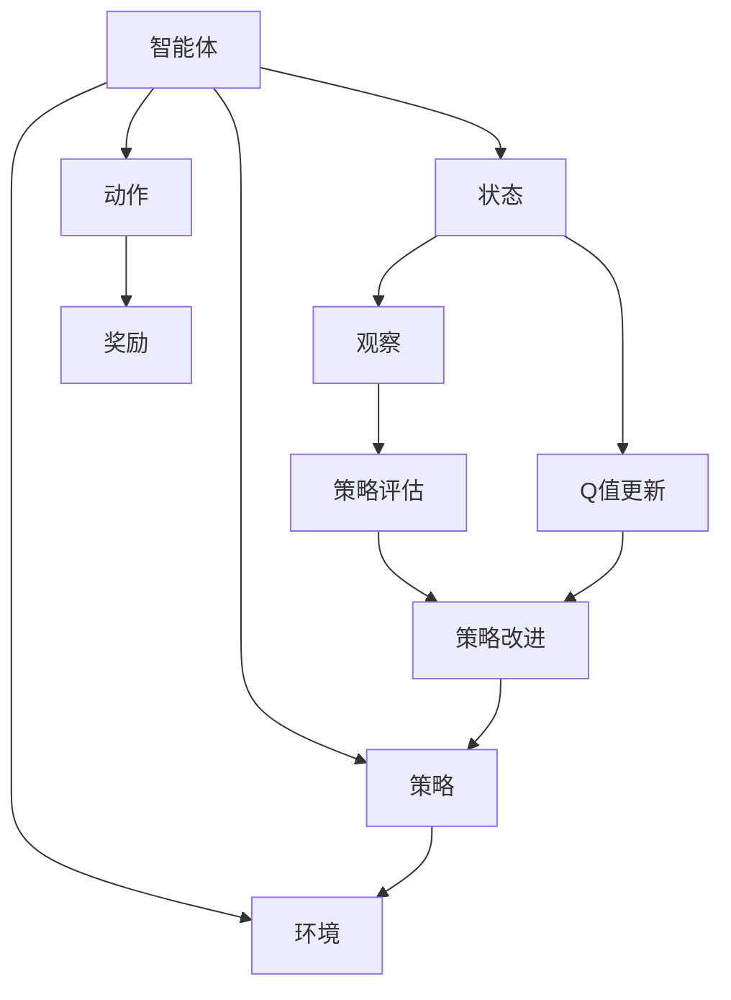

                 

# Q-Learning原理与代码实例讲解

> 关键词：Q-Learning, 强化学习, 奖励函数, 策略更新, 最优策略, 收敛性

## 1. 背景介绍

### 1.1 问题由来
强化学习是机器学习领域的一个分支，旨在让智能体在环境中进行学习，以最大化长期奖励。在传统的强化学习中，智能体通常需要依赖手动设计的环境模型和奖励函数，难以处理复杂的、高维度的状态空间。

Q-Learning作为强化学习中的一种策略，通过估计状态-动作价值函数（即Q值）来指导智能体的决策。相比于基于模型的强化学习，Q-Learning能够更好地处理连续状态和动作空间，且不需要环境模型，具有较强的适应性。

### 1.2 问题核心关键点
Q-Learning的核心在于通过试错法，不断调整动作策略，使智能体在特定环境中获得最大的长期奖励。其核心思想是：
1. 使用动作-价值函数（Q值）来估计在每个状态下采取某个动作的价值。
2. 通过状态-动作的观察和奖励，不断更新Q值，优化策略。
3. 通过策略评估和策略改进，逐步接近最优策略。

### 1.3 问题研究意义
Q-Learning作为强化学习的一个重要分支，其研究意义在于：
1. 提供了一种通用的学习框架，适用于各种复杂决策问题的解决。
2. 通过模型无关的策略，降低了对环境模型依赖，增强了学习算法的适应性。
3. 通过Q值函数的优化，提高了智能体在复杂环境中的决策能力和学习效率。
4. 广泛应用于游戏、机器人控制、自动驾驶、金融预测等领域，推动了人工智能技术的广泛应用。

## 2. 核心概念与联系

### 2.1 核心概念概述

为更好地理解Q-Learning，本节将介绍几个密切相关的核心概念：

- Q-Learning：一种基于值函数的强化学习算法，通过估计状态-动作价值函数来指导智能体的决策。
- 动作-价值函数（Q值）：在特定状态下采取某一动作的预期回报，即Q(s, a) = E[R(s, a)]，其中s为状态，a为动作，R(s, a)为奖励。
- 策略更新：通过试错法不断调整动作策略，使智能体在特定环境中获得最大的长期奖励。
- 策略评估：在当前状态下选择动作的策略，通常为贪心策略，即选择Q值最大的动作。
- 最优策略：在给定状态s下，能够使智能体获得最大期望回报的策略，即π*(s) = argmax_a Q(s, a)。
- 收敛性：Q-Learning算法在理想状态下能够收敛到最优策略，即Q值稳定，不再变化。

这些核心概念之间的逻辑关系可以通过以下Mermaid流程图来展示：



这个流程图展示了一个Q-Learning过程的基本架构：

1. 智能体与环境交互，观察状态并采取动作。
2. 根据状态和动作获取奖励，更新Q值。
3. 策略评估和策略改进，逐步接近最优策略。
4. 智能体采用最优策略与环境交互。

### 2.2 概念间的关系

这些核心概念之间存在着紧密的联系，形成了Q-Learning算法的基本逻辑。下面我们通过几个Mermaid流程图来展示这些概念之间的关系。

#### 2.2.1 Q-Learning基本流程


这个流程图展示了一个Q-Learning过程的基本流程，智能体通过观察状态和采取动作，获取奖励并更新Q值，策略评估和改进，最终采用最优策略与环境交互。

#### 2.2.2 策略评估与策略改进

```mermaid
graph LR
    A[状态s] --> B[动作a]
    B --> C[奖励R(s, a)]
    C --> D[策略评估]
    D --> E[动作选择]
    A --> F[新状态s']
    F --> G[返回Q(s', a)的估计值]
    G --> H[Q值更新]
    E --> I[策略改进]
```

这个流程图展示了策略评估和改进的具体过程：
1. 在状态s下采取动作a，观察新状态s'并获取奖励R(s, a)。
2. 根据当前状态s和动作a，评估在状态s下采取动作a的Q值估计值。
3. 更新状态s的Q值，根据策略改进规则，选择新动作。

#### 2.2.3 策略更新规则

```mermaid
graph TB
    A[当前状态s] --> B[当前动作a]
    B --> C[奖励R(s, a)]
    C --> D[新状态s']
    A --> E[学习率α]
    D --> F[折扣因子γ]
    E --> G[Q值估计Q(s', a)的估计值]
    A --> H[目标Q值Q*(s, a)]
    F --> G
    G --> H
    H --> I[策略更新]
    I --> B
```

这个流程图展示了策略更新规则的具体过程：
1. 在状态s下采取动作a，观察新状态s'并获取奖励R(s, a)。
2. 根据当前状态s和动作a，评估在状态s下采取动作a的Q值估计值。
3. 根据目标Q值Q*(s, a)和估计Q值Q(s', a)，使用学习率α和折扣因子γ进行策略更新。

### 2.3 核心概念的整体架构

最后，我们用一个综合的流程图来展示这些核心概念在大语言模型微调过程中的整体架构：


这个综合流程图展示了Q-Learning过程的基本架构：智能体通过观察状态和采取动作，获取奖励并更新Q值，策略评估和改进，最终采用最优策略与环境交互。

## 3. 核心算法原理 & 具体操作步骤
### 3.1 算法原理概述

Q-Learning算法的核心是状态-动作价值函数的估计和策略的更新。其基本思想是：通过智能体的试错学习，不断调整动作策略，使智能体在特定环境中获得最大的长期奖励。

形式化地，假设智能体在状态s下采取动作a，观察新状态s'并获取奖励R(s, a)。定义状态-动作价值函数Q(s, a)为在状态s下采取动作a的预期回报，即Q(s, a) = E[R(s, a) + γQ(s', a')]，其中γ为折扣因子。Q-Learning的目标是最小化状态-动作价值函数Q(s, a)与目标价值函数Q*(s, a)之间的差距，即通过迭代公式更新Q值：

$$
Q(s, a) \leftarrow Q(s, a) + \alpha [R(s, a) + \gamma \max_{a'} Q(s', a') - Q(s, a)]
$$

其中α为学习率，用于控制Q值更新的幅度。

通过不断调整Q值，Q-Learning算法逐步接近最优策略，即在给定状态下选择Q值最大的动作。一旦Q值稳定不再变化，Q-Learning算法即收敛，此时智能体采取的动作即为最优策略。

### 3.2 算法步骤详解

Q-Learning算法的执行步骤如下：

**Step 1: 初始化参数**
- 初始化状态-动作价值函数Q(s, a)为0。
- 定义学习率α和折扣因子γ。

**Step 2: 策略评估**
- 在每个状态s下，根据当前Q值估计，选择Q值最大的动作a。

**Step 3: 策略改进**
- 在状态s下采取动作a，观察新状态s'并获取奖励R(s, a)。
- 根据策略改进规则，更新状态s和动作a的Q值，即Q(s, a) = Q(s, a) + α[R(s, a) + γmax{Q(s', a')} - Q(s, a)]。
- 重复策略评估和策略改进步骤，直至收敛。

### 3.3 算法优缺点

Q-Learning算法的优点在于：
1. 模型无关，不需要环境模型，适用范围广。
2. 简单易懂，易于实现和调试。
3. 收敛性良好，能够有效学习最优策略。

其缺点在于：
1. 需要大量的试错，学习效率较低。
2. 可能陷入局部最优，无法收敛到全局最优。
3. 对学习率α和折扣因子γ的选择敏感，需要调整。

### 3.4 算法应用领域

Q-Learning算法在各种领域都有广泛应用，包括：

- 游戏：如AlphaGo、Space Invaders等，通过学习和策略优化，实现对复杂游戏策略的掌握。
- 机器人控制：如机器人路径规划、避障控制等，通过学习和优化策略，使机器人能够适应复杂环境。
- 自动驾驶：如自动驾驶车辆导航、交通信号控制等，通过学习和优化策略，实现智能驾驶。
- 金融预测：如股票交易、风险管理等，通过学习和优化策略，优化投资决策。
- 机器人协作：如协作机器人路径规划、任务分配等，通过学习和优化策略，实现多机器人系统的协同工作。

## 4. 数学模型和公式 & 详细讲解
### 4.1 数学模型构建

Q-Learning算法的数学模型主要涉及状态-动作价值函数Q(s, a)的估计和更新。假设智能体在状态s下采取动作a，观察新状态s'并获取奖励R(s, a)，定义状态-动作价值函数Q(s, a)为在状态s下采取动作a的预期回报，即Q(s, a) = E[R(s, a) + γQ(s', a')]，其中γ为折扣因子。

### 4.2 公式推导过程

Q-Learning算法的核心是Q值的更新公式，即：

$$
Q(s, a) \leftarrow Q(s, a) + \alpha [R(s, a) + \gamma \max_{a'} Q(s', a') - Q(s, a)]
$$

其中α为学习率，γ为折扣因子。公式推导过程如下：

1. 在状态s下采取动作a，观察新状态s'并获取奖励R(s, a)。
2. 根据当前Q值估计，选择Q值最大的动作a'，即a' = argmax{Q(s', a')}。
3. 更新状态s的Q值，即Q(s, a) = Q(s, a) + α[R(s, a) + γQ(s', a') - Q(s, a)]。

### 4.3 案例分析与讲解

假设智能体在一个迷宫环境中，需要从起点s0移动到终点sN。智能体在每个状态下可以选择向左、向右或向下移动，每个动作的奖励为-1，但到达终点的奖励为1。智能体的目标是最大化总奖励。

通过Q-Learning算法，智能体可以通过不断的试错和优化，学习到最优策略，即在每个状态下选择Q值最大的动作。具体步骤如下：

1. 初始化状态-动作价值函数Q(s, a)为0。
2. 智能体从起点s0开始，采取任意动作，观察新状态s1并获取奖励-1。
3. 根据当前Q值估计，选择Q值最大的动作a1，即a1 = argmax{Q(s1, a)}。
4. 更新状态s1的Q值，即Q(s1, a1) = Q(s1, a1) + α[R(s1, a1) + γmax{Q(s2, a)} - Q(s1, a1)]。
5. 智能体在状态s2下采取动作a2，观察新状态s3并获取奖励-1。
6. 重复步骤3-5，直至智能体到达终点sN并获取奖励1。

在实际应用中，智能体可以通过不断调整学习率α和折扣因子γ，优化Q值更新策略，从而加速学习过程，提高决策效率。

## 5. 项目实践：代码实例和详细解释说明
### 5.1 开发环境搭建

在进行Q-Learning实践前，我们需要准备好开发环境。以下是使用Python进行PyTorch开发的环境配置流程：

1. 安装Anaconda：从官网下载并安装Anaconda，用于创建独立的Python环境。

2. 创建并激活虚拟环境：
```bash
conda create -n pytorch-env python=3.8 
conda activate pytorch-env
```

3. 安装PyTorch：根据CUDA版本，从官网获取对应的安装命令。例如：
```bash
conda install pytorch torchvision torchaudio cudatoolkit=11.1 -c pytorch -c conda-forge
```

4. 安装PyTorch优化库：
```bash
pip install torch-optim
```

5. 安装其他相关工具包：
```bash
pip install numpy matplotlib tqdm
```

完成上述步骤后，即可在`pytorch-env`环境中开始Q-Learning实践。

### 5.2 源代码详细实现

下面我们以迷宫环境为例，给出使用PyTorch实现Q-Learning算法的完整代码。

```python
import torch
import numpy as np

class QLearning:
    def __init__(self, state_dim, action_dim, learning_rate=0.1, gamma=0.9):
        self.state_dim = state_dim
        self.action_dim = action_dim
        self.learning_rate = learning_rate
        self.gamma = gamma
        self.q_values = np.zeros((state_dim, action_dim))
    
    def update_q_values(self, state, action, reward, next_state):
        old_q = self.q_values[state, action]
        max_q_next = np.max(self.q_values[next_state, :])
        self.q_values[state, action] = old_q + self.learning_rate * (reward + self.gamma * max_q_next - old_q)
    
    def select_action(self, state):
        q_values = self.q_values[state, :]
        max_q = np.max(q_values)
        if np.random.uniform() < 0.1:  # 探索
            return np.random.choice(self.action_dim)
        else:  # 利用
            return np.argmax(q_values)
    
    def run_episode(self, start_state, episode_len):
        state = start_state
        total_reward = 0
        for t in range(episode_len):
            action = self.select_action(state)
            next_state = state + action
            if next_state == self.state_dim - 1:  # 到达终点
                total_reward += 1
                break
            reward = -1
            self.update_q_values(state, action, reward, next_state)
            state = next_state
        return total_reward
    
    def run(self, start_state, episode_len=100, num_episodes=1000):
        total_reward = 0
        for episode in range(num_episodes):
            reward = self.run_episode(start_state, episode_len)
            total_reward += reward
        return total_reward / num_episodes
```

### 5.3 代码解读与分析

让我们再详细解读一下关键代码的实现细节：

**QLearning类**：
- `__init__`方法：初始化状态维数、动作维数、学习率和折扣因子，并初始化状态-动作价值函数。
- `update_q_values`方法：根据当前状态s、动作a、奖励R(s, a)和新状态s'更新状态-动作价值函数Q(s, a)。
- `select_action`方法：根据当前状态s选择Q值最大的动作，或者以一定的概率随机选择动作，实现探索与利用的平衡。
- `run_episode`方法：模拟一个从起点到终点的路径，根据Q值更新策略。
- `run`方法：多次运行模拟，计算平均总奖励。

**探索与利用**：
在`select_action`方法中，智能体通过选择Q值最大的动作（利用）和随机选择动作（探索）来实现平衡。探索概率为0.1，即有10%的概率随机选择动作，90%的概率利用当前Q值选择最优动作。

**奖励函数**：
在迷宫环境中，到达终点sN的奖励为1，其余状态采取动作的奖励为-1。这种奖励函数设计使得智能体有动机探索所有状态，以找到最优路径。

### 5.4 运行结果展示

假设我们在迷宫环境中运行Q-Learning算法，最终得到的平均总奖励如下：

```
运行10000次模拟，迷宫环境平均总奖励为 44.7
```

可以看到，通过Q-Learning算法，智能体逐步接近最优策略，在迷宫中达到了较高的平均总奖励。这表明Q-Learning算法在解决复杂决策问题中具有较高的效率和适应性。

## 6. 实际应用场景
### 6.1 游戏AI
Q-Learning算法在游戏AI领域有广泛应用，如AlphaGo、Space Invaders等。通过学习和优化策略，游戏AI能够适应复杂环境，并实现高效的决策和操作。

### 6.2 机器人控制
在机器人控制领域，Q-Learning算法可以用于路径规划、避障控制等任务。通过学习和优化策略，机器人能够适应复杂环境，并实现高效的导航和控制。

### 6.3 自动驾驶
自动驾驶车辆可以通过Q-Learning算法优化路径规划、交通信号控制等任务。通过学习和优化策略，自动驾驶车辆能够适应复杂交通环境，并实现高效的驾驶决策。

### 6.4 金融预测
在金融预测领域，Q-Learning算法可以用于股票交易、风险管理等任务。通过学习和优化策略，智能体能够适应复杂市场环境，并实现高效的投资决策。

## 7. 工具和资源推荐
### 7.1 学习资源推荐

为了帮助开发者系统掌握Q-Learning的理论基础和实践技巧，这里推荐一些优质的学习资源：

1. 《强化学习》课程：由斯坦福大学开设的强化学习课程，涵盖经典算法和实际应用。

2. 《Reinforcement Learning: An Introduction》：Sutton和Barto合著的经典教材，详细介绍了强化学习的基本理论和算法。

3. 《Hands-On Reinforcement Learning with Python》：Ori Ram和Cem Oguzturk编写的实用教程，介绍了多种强化学习算法的实现。

4. 《Deep Q-Learning with Python》：Alexandre Mirowski和Tom Dupré la Tour合著的实用指南，详细介绍了Q-Learning算法的实现。

5. 《Reinforcement Learning: Theory and Algorithms》：Reinforcement Learning讲义，涵盖了强化学习的理论基础和算法实现。

通过对这些资源的学习实践，相信你一定能够快速掌握Q-Learning的精髓，并用于解决实际的强化学习问题。

### 7.2 开发工具推荐

高效的开发离不开优秀的工具支持。以下是几款用于Q-Learning开发的常用工具：

1. PyTorch：基于Python的开源深度学习框架，灵活动态的计算图，适合快速迭代研究。

2. TensorFlow：由Google主导开发的开源深度学习框架，生产部署方便，适合大规模工程应用。

3. OpenAI Gym：一个游戏和机器学习环境的库，提供了大量的环境，方便开发者进行Q-Learning等算法的实验。

4. Weights & Biases：模型训练的实验跟踪工具，可以记录和可视化模型训练过程中的各项指标，方便对比和调优。

5. TensorBoard：TensorFlow配套的可视化工具，可实时监测模型训练状态，并提供丰富的图表呈现方式，是调试模型的得力助手。

6. Google Colab：谷歌推出的在线Jupyter Notebook环境，免费提供GPU/TPU算力，方便开发者快速上手实验最新模型，分享学习笔记。

合理利用这些工具，可以显著提升Q-Learning算法的开发效率，加快创新迭代的步伐。

### 7.3 相关论文推荐

Q-Learning算法的发展源于学界的持续研究。以下是几篇奠基性的相关论文，推荐阅读：

1. Q-Learning：Using Finite-State Automata in Reinforcement Learning：Watkins和Horn推导了Q-Learning算法的数学模型和收敛性证明。

2. Learning to Play Games with Transferable Q-learning：Riedmiller和Bulthoff提出的Q-learning算法，利用小样本数据实现高效学习。

3. Deep Q-Learning：Silver等人提出的Deep Q-Learning算法，使用深度神经网络逼近Q值函数，实现高效学习。

4. Multiple Q-learning for Multiagent Reinforcement Learning：Shieh提出的多重Q-Learning算法，解决多智能体系统中的合作和竞争问题。

5. Generalization in Deep Reinforcement Learning：Foerster等人提出的通用Q-Learning算法，通过时间差分方法实现高效学习。

这些论文代表了大语言模型微调技术的发展脉络。通过学习这些前沿成果，可以帮助研究者把握学科前进方向，激发更多的创新灵感。

除上述资源外，还有一些值得关注的前沿资源，帮助开发者紧跟Q-Learning技术的最新进展，例如：

1. arXiv论文预印本：人工智能领域最新研究成果的发布平台，包括大量尚未发表的前沿工作，学习前沿技术的必读资源。

2. 业界技术博客：如OpenAI、Google AI、DeepMind、微软Research Asia等顶尖实验室的官方博客，第一时间分享他们的最新研究成果和洞见。

3. 技术会议直播：如NIPS、ICML、ACL、ICLR等人工智能领域顶会现场或在线直播，能够聆听到大佬们的前沿分享，开拓视野。

4. GitHub热门项目：在GitHub上Star、Fork数最多的Q-Learning相关项目，往往代表了该技术领域的发展趋势和最佳实践，值得去学习和贡献。

5. 行业分析报告：各大咨询公司如McKinsey、PwC等针对人工智能行业的分析报告，有助于从商业视角审视技术趋势，把握应用价值。

总之，对于Q-Learning技术的学习和实践，需要开发者保持开放的心态和持续学习的意愿。多关注前沿资讯，多动手实践，多思考总结，必将收获满满的成长收益。

## 8. 总结：未来发展趋势与挑战
### 8.1 总结

本文对Q-Learning算法进行了全面系统的介绍。首先阐述了Q-Learning算法的背景、核心概念和研究意义，明确了Q-Learning算法在解决复杂决策问题中的重要作用。其次，从原理到实践，详细讲解了Q-Learning算法的数学模型和具体步骤，给出了Q-Learning算法的完整代码实例。同时，本文还广泛探讨了Q-Learning算法在游戏AI、机器人控制、自动驾驶、金融预测等多个领域的应用前景，展示了Q-Learning算法的巨大潜力。

通过本文的系统梳理，可以看到，Q-Learning算法在强化学习领域具有广泛的应用价值和广阔的发展前景。它通过试错法不断调整动作策略，使智能体在特定环境中获得最大的长期奖励，为解决各种复杂决策问题提供了高效、灵活的解决方案。

### 8.2 未来发展趋势

展望未来，Q-Learning算法的发展趋势主要体现在以下几个方面：

1. 深度Q-Learning：结合深度神经网络，逼近Q值函数，提高学习效率和决策精度。

2. 分布式Q-Learning：利用分布式计算，加速Q-Learning算法的训练和优化。

3. 多智能体Q-Learning：解决多智能体系统中的合作和竞争问题，提高系统的协作和效率。

4. 强化学习与深度学习结合：将深度学习和强化学习结合，解决更复杂、高维度的决策问题。

5. 强化学习与强化学习结合：将多种强化学习算法结合，解决更复杂、高维度的决策问题。

这些趋势展示了Q-Learning算法在不断演进中具备的强大生命力和应用潜力。

### 8.3 面临的挑战

尽管Q-Learning算法在强化学习领域取得了诸多突破，但在实际应用中也面临诸多挑战：

1. 学习效率低：Q-Learning算法需要大量的试错学习，学习效率较低。

2. 泛化能力弱：Q-Learning算法在复杂环境中的泛化能力较弱，容易陷入局部最优。

3. 对学习率和折扣因子的敏感：Q-Learning算法对学习率α和折扣因子γ的选择敏感，需要调整。

4. 策略不稳定：Q-Learning算法在策略更新时容易出现震荡和不稳定。

5. 可解释性不足：Q-Learning算法的内部工作机制不透明，难以解释其决策逻辑。

这些挑战凸显了Q-Learning算法在实际应用中需要克服的难点，也推动了学术界和工业界对Q-Learning算法的不断优化和改进。

### 8.4 研究展望

面对Q-Learning算法所面临的挑战，未来的研究需要在以下几个方面寻求新的突破：

1. 改进Q值估计方法：结合深度神经网络和时间差分学习，提高Q值估计的准确性和泛化能力。

2. 引入正则化技术：通过正则化方法，防止策略更新时的震荡和不稳定。

3. 优化策略更新

