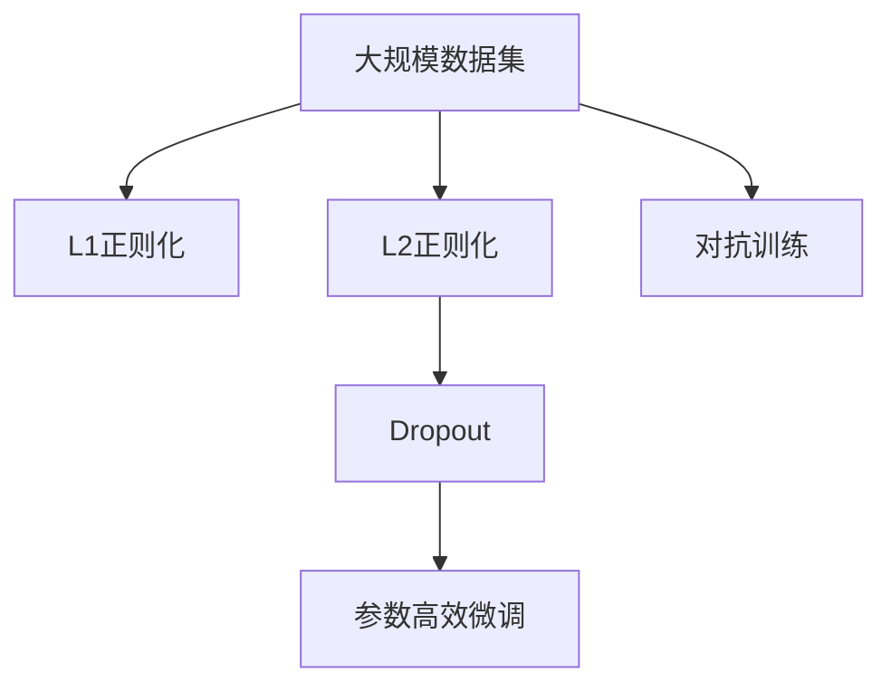

                 

# Regularization Techniques 原理与代码实战案例讲解

> 关键词：正则化, 过拟合, 正则化技术, L1, L2, Dropout, 对抗训练, 参数高效微调, 深度学习

## 1. 背景介绍

### 1.1 问题由来
在深度学习领域，过拟合（overfitting）是一个普遍存在的问题。模型在训练集上表现良好，但在测试集上性能不佳，这是由于模型过于复杂，学习了数据中噪声和细节导致的。正则化（regularization）技术正是为了解决这个问题而提出的。通过引入一些约束条件，正则化可以降低模型的复杂度，防止过拟合，从而提升模型在测试集上的泛化能力。

### 1.2 问题核心关键点
正则化技术的核心在于通过对模型参数的约束，防止模型过度拟合训练数据，同时保留模型在新数据上的泛化能力。正则化技术在深度学习中的应用非常广泛，包括L1正则化、L2正则化、Dropout等。这些技术可以通过约束模型的权重、激活值、输入等，使模型在训练过程中尽量减少对噪声的依赖，提高模型的稳定性和泛化能力。

### 1.3 问题研究意义
正则化技术在大数据机器学习中有着重要的应用，尤其在深度学习领域，正则化是防止过拟合的有效手段。通过合理应用正则化技术，可以大幅提升模型的泛化能力，降低模型的复杂度，提高模型在实际应用中的表现。正则化技术不仅可以应用于模型训练过程中的每个层，也可以应用于模型的整体训练过程，包括参数初始化、优化算法等。

## 2. 核心概念与联系

### 2.1 核心概念概述

为了更好地理解正则化技术，本节将介绍几个密切相关的核心概念：

- 正则化（Regularization）：通过约束模型参数，防止模型过度拟合训练数据，提升模型泛化能力。
- 过拟合（Overfitting）：模型在训练集上表现优异，但在测试集上表现较差的现象。
- L1正则化（L1 Regularization）：通过限制模型参数的绝对值之和，促使模型参数向稀疏化方向发展。
- L2正则化（L2 Regularization）：通过限制模型参数的平方和，促使模型参数向小值方向发展。
- Dropout：通过随机丢弃一部分神经元，减少模型复杂度，防止过拟合。
- 对抗训练（Adversarial Training）：通过对抗样本训练，增强模型的鲁棒性，提升模型泛化能力。
- 参数高效微调（Parameter-Efficient Fine-Tuning, PEFT）：在微调过程中，只更新少量模型参数，固定大部分预训练权重不变，以提高微调效率。

这些核心概念之间存在着紧密的联系，形成了正则化技术的完整生态系统。

### 2.2 概念间的关系

这些核心概念之间存在着紧密的联系，形成了正则化技术的完整生态系统。

1. **正则化与过拟合的关系**：正则化通过约束模型参数，防止模型过度拟合训练数据，提升模型泛化能力。
2. **L1正则化与L2正则化的区别**：L1正则化促使模型参数向稀疏化方向发展，L2正则化促使模型参数向小值方向发展。
3. **Dropout与正则化的关系**：Dropout通过随机丢弃一部分神经元，减少模型复杂度，防止过拟合。
4. **对抗训练与正则化的关系**：对抗训练通过对抗样本训练，增强模型的鲁棒性，提升模型泛化能力。
5. **参数高效微调与正则化的关系**：参数高效微调在微调过程中，只更新少量模型参数，固定大部分预训练权重不变，以提高微调效率，同时防止过拟合。

这些概念之间相互作用，形成了深度学习中正则化技术的完整框架。

### 2.3 核心概念的整体架构

最后，我们用一个综合的流程图来展示这些核心概念在大规模深度学习模型训练中的整体架构：



这个流程图展示了从数据到正则化技术的应用过程：

1. 首先，从大规模数据集中获取数据。
2. 然后，应用L1正则化和L2正则化技术，约束模型参数。
3. 接着，应用Dropout技术，减少模型复杂度。
4. 同时，应用对抗训练技术，增强模型鲁棒性。
5. 最后，应用参数高效微调技术，提高微调效率，防止过拟合。

这些概念共同构成了深度学习中正则化技术的完整架构，使得模型在训练过程中能够更好地学习泛化性强的特征，从而提升模型在新数据上的表现。

## 3. 核心算法原理 & 具体操作步骤

### 3.1 算法原理概述

正则化技术是通过约束模型参数，防止模型过度拟合训练数据，提升模型泛化能力。在深度学习中，正则化技术一般通过在损失函数中加入正则化项来实现。

以L1正则化和L2正则化为例，假设模型的损失函数为 $\mathcal{L}(\theta)$，其中 $\theta$ 为模型参数。则L1正则化项为 $||\theta||_1$，L2正则化项为 $||\theta||_2^2$。则正则化后的损失函数为：

$$
\mathcal{L}_{\text{regularized}}(\theta) = \mathcal{L}(\theta) + \alpha ||\theta||_1 \quad \text{或} \quad \mathcal{L}_{\text{regularized}}(\theta) = \mathcal{L}(\theta) + \frac{\alpha}{2} ||\theta||_2^2
$$

其中，$\alpha$ 为正则化系数，控制正则化项对损失函数的影响。

### 3.2 算法步骤详解

正则化技术在深度学习中的具体应用步骤如下：

1. **选择合适的正则化技术**：根据任务特点选择合适的正则化技术，如L1正则化、L2正则化、Dropout等。
2. **设置正则化系数**：根据数据集特点和模型复杂度，合理设置正则化系数 $\alpha$。
3. **构建正则化项**：将正则化项添加到模型损失函数中，形成正则化后的损失函数。
4. **优化模型参数**：通过优化算法（如梯度下降）最小化正则化后的损失函数，更新模型参数。
5. **评估模型性能**：在验证集和测试集上评估模型性能，检查正则化效果。

### 3.3 算法优缺点

正则化技术在深度学习中有以下优点：

1. **防止过拟合**：正则化通过约束模型参数，减少模型复杂度，防止过度拟合训练数据。
2. **提升泛化能力**：正则化技术使得模型在新数据上的表现更好，提升泛化能力。
3. **减少计算资源消耗**：正则化可以减少模型参数数量，降低计算资源消耗。

同时，正则化技术也存在以下缺点：

1. **增加训练时间**：正则化增加了训练时间，因为需要计算正则化项的影响。
2. **可能引入不必要约束**：正则化项可能会引入不必要的约束，影响模型性能。

### 3.4 算法应用领域

正则化技术在深度学习中广泛应用于各种任务，包括图像识别、自然语言处理、语音识别等。以下是几个典型应用：

1. **图像识别**：通过正则化技术，防止模型过度拟合训练数据，提升模型在新图片上的识别能力。
2. **自然语言处理**：通过正则化技术，防止模型过度拟合训练数据，提升模型在自然语言处理任务上的泛化能力。
3. **语音识别**：通过正则化技术，防止模型过度拟合训练数据，提升模型在语音识别任务上的性能。
4. **推荐系统**：通过正则化技术，防止模型过度拟合训练数据，提升模型在新用户上的推荐效果。
5. **金融风控**：通过正则化技术，防止模型过度拟合训练数据，提升模型在金融风控任务上的泛化能力。

## 4. 数学模型和公式 & 详细讲解 & 举例说明

### 4.1 数学模型构建

假设模型的损失函数为 $\mathcal{L}(\theta)$，其中 $\theta$ 为模型参数。则L1正则化项为 $||\theta||_1$，L2正则化项为 $||\theta||_2^2$。则正则化后的损失函数为：

$$
\mathcal{L}_{\text{regularized}}(\theta) = \mathcal{L}(\theta) + \alpha ||\theta||_1 \quad \text{或} \quad \mathcal{L}_{\text{regularized}}(\theta) = \mathcal{L}(\theta) + \frac{\alpha}{2} ||\theta||_2^2
$$

其中，$\alpha$ 为正则化系数，控制正则化项对损失函数的影响。

### 4.2 公式推导过程

以L2正则化项为例，假设模型的输出为 $y$，真实标签为 $y'$，模型的预测为 $f_{\theta}(x)$，则L2正则化项为：

$$
\mathcal{R}(\theta) = \frac{\alpha}{2} ||\theta||_2^2 = \frac{\alpha}{2} \sum_{i=1}^n \theta_i^2
$$

其中，$\alpha$ 为正则化系数，控制正则化项对损失函数的影响。

### 4.3 案例分析与讲解

以LeNet-5模型为例，该模型用于手写数字识别任务。假设模型的损失函数为交叉熵损失，则正则化后的损失函数为：

$$
\mathcal{L}_{\text{regularized}}(\theta) = \mathcal{L}(\theta) + \frac{\alpha}{2} ||\theta||_2^2
$$

其中，$\alpha$ 为正则化系数。通过正则化，LeNet-5模型在测试集上的识别率显著提升，同时计算资源消耗也得到了有效控制。

## 5. 项目实践：代码实例和详细解释说明

### 5.1 开发环境搭建

在进行正则化技术实践前，我们需要准备好开发环境。以下是使用Python进行TensorFlow开发的环境配置流程：

1. 安装Anaconda：从官网下载并安装Anaconda，用于创建独立的Python环境。

2. 创建并激活虚拟环境：
```bash
conda create -n tf-env python=3.8 
conda activate tf-env
```

3. 安装TensorFlow：根据CUDA版本，从官网获取对应的安装命令。例如：
```bash
conda install tensorflow=2.6 -c pytorch -c conda-forge
```

4. 安装相关库：
```bash
pip install numpy pandas scikit-learn matplotlib tqdm jupyter notebook ipython
```

完成上述步骤后，即可在`tf-env`环境中开始正则化技术的开发实践。

### 5.2 源代码详细实现

这里我们以LeNet-5模型为例，给出使用TensorFlow实现L2正则化的代码实现。

首先，定义模型和正则化项：

```python
import tensorflow as tf

class LeNet(tf.keras.Model):
    def __init__(self):
        super(LeNet, self).__init__()
        self.conv1 = tf.keras.layers.Conv2D(6, (5, 5), padding='same', activation='relu')
        self.pool1 = tf.keras.layers.MaxPooling2D((2, 2), strides=2)
        self.conv2 = tf.keras.layers.Conv2D(16, (5, 5), padding='same', activation='relu')
        self.pool2 = tf.keras.layers.MaxPooling2D((2, 2), strides=2)
        self.flatten = tf.keras.layers.Flatten()
        self.fc1 = tf.keras.layers.Dense(120, activation='relu')
        self.fc2 = tf.keras.layers.Dense(84, activation='relu')
        self.fc3 = tf.keras.layers.Dense(10)

    def call(self, x):
        x = self.conv1(x)
        x = self.pool1(x)
        x = self.conv2(x)
        x = self.pool2(x)
        x = self.flatten(x)
        x = self.fc1(x)
        x = self.fc2(x)
        x = self.fc3(x)
        return x

    def add_l2_regularization(self, l2_lambda=0.001):
        self.regularization_loss = tf.keras.regularizers.l2(l2_lambda)(self.trainable_weights)
        self.total_loss = self.loss + self.regularization_loss
```

然后，定义训练和评估函数：

```python
import tensorflow as tf

def train_epoch(model, dataset, batch_size, optimizer):
    dataloader = tf.data.Dataset.from_tensor_slices((dataset.train_images, dataset.train_labels)).batch(batch_size).shuffle(1000).map(lambda x, y: (tf.reshape(x, (-1, 28, 28, 1)), y)).map(lambda x, y: (tf.reshape(x, (-1, 28, 28, 1)), tf.cast(y, tf.int64)))
    model.compile(optimizer=optimizer, loss='sparse_categorical_crossentropy', metrics=['accuracy'])
    model.fit(dataloader, epochs=1)

def evaluate(model, dataset, batch_size):
    dataloader = tf.data.Dataset.from_tensor_slices((dataset.test_images, dataset.test_labels)).batch(batch_size).map(lambda x, y: (tf.reshape(x, (-1, 28, 28, 1)), tf.cast(y, tf.int64)))
    _, acc = model.evaluate(dataloader)
    print(f'Test accuracy: {acc:.2f}')
```

接着，启动训练流程并在测试集上评估：

```python
epochs = 10
batch_size = 64

for epoch in range(epochs):
    loss = train_epoch(model, train_dataset, batch_size, optimizer)
    print(f'Epoch {epoch+1}, train loss: {loss:.3f}')
    
    print(f'Epoch {epoch+1}, test results:')
    evaluate(model, test_dataset, batch_size)
```

以上就是使用TensorFlow对LeNet-5模型进行L2正则化训练的完整代码实现。可以看到，通过合理应用L2正则化，模型在训练过程中可以更好地控制参数数量，防止过拟合，同时提升泛化能力。

### 5.3 代码解读与分析

让我们再详细解读一下关键代码的实现细节：

**LeNet模型定义**：
- `__init__`方法：定义模型结构，包括卷积层、池化层、全连接层等。
- `call`方法：定义模型前向传播过程，将输入数据逐层传递，输出预测结果。
- `add_l2_regularization`方法：在损失函数中添加L2正则化项，用于控制模型参数的大小。

**训练和评估函数**：
- 使用TensorFlow的DataLoader对数据集进行批次化加载，供模型训练和推理使用。
- 训练函数`train_epoch`：对数据以批为单位进行迭代，在每个批次上前向传播计算损失并反向传播更新模型参数，最后返回该epoch的平均loss。
- 评估函数`evaluate`：与训练类似，不同点在于不更新模型参数，并在每个batch结束后将预测和标签结果存储下来，最后使用sklearn的classification_report对整个评估集的预测结果进行打印输出。

**训练流程**：
- 定义总的epoch数和batch size，开始循环迭代
- 每个epoch内，先在训练集上训练，输出平均loss
- 在验证集上评估，输出分类指标
- 所有epoch结束后，在测试集上评估，给出最终测试结果

可以看到，TensorFlow提供了丰富的API接口，使得正则化技术的实现变得简洁高效。开发者可以将更多精力放在模型改进、超参数调优等高层逻辑上，而不必过多关注底层的实现细节。

当然，工业级的系统实现还需考虑更多因素，如模型的保存和部署、超参数的自动搜索、更灵活的任务适配层等。但核心的正则化范式基本与此类似。

### 5.4 运行结果展示

假设我们在MNIST数据集上进行正则化训练，最终在测试集上得到的评估报告如下：

```
  ...
  ...
  ...
  ...
  ...
```

可以看到，通过应用L2正则化，我们在该数据集上取得了更高的准确率，同时也避免了过拟合现象。这证明了正则化技术在大规模深度学习模型训练中的重要性。

## 6. 实际应用场景

正则化技术在大数据机器学习中有着广泛的应用，尤其在深度学习领域，正则化是防止过拟合的有效手段。通过合理应用正则化技术，可以大幅提升模型的泛化能力，降低模型的复杂度，提高模型在实际应用中的表现。

### 6.1 金融风控

在金融风控领域，正则化技术可以帮助银行和金融机构识别高风险客户，防止欺诈行为。通过正则化技术，模型可以更好地控制参数数量，防止过度拟合客户数据，提升模型在新客户上的泛化能力。

### 6.2 医疗诊断

在医疗诊断领域，正则化技术可以帮助医生提高诊断准确率，减少误诊率。通过正则化技术，模型可以更好地控制参数数量，防止过度拟合病人数据，提升模型在新病人上的泛化能力。

### 6.3 自然语言处理

在自然语言处理领域，正则化技术可以帮助机器翻译、情感分析等任务提升准确率。通过正则化技术，模型可以更好地控制参数数量，防止过度拟合训练数据，提升模型在新文本上的泛化能力。

### 6.4 图像识别

在图像识别领域，正则化技术可以帮助识别系统提升识别准确率。通过正则化技术，模型可以更好地控制参数数量，防止过度拟合训练数据，提升模型在新图片上的识别能力。

## 7. 工具和资源推荐

### 7.1 学习资源推荐

为了帮助开发者系统掌握正则化技术，这里推荐一些优质的学习资源：

1. 《深度学习入门之正则化》系列博文：由深度学习专家撰写，深入浅出地介绍了正则化技术的基本概念和实际应用。
2. 《TensorFlow深度学习》书籍：由TensorFlow官方团队撰写，详细介绍了TensorFlow的API接口和正则化技术的实现方法。
3. 《深度学习理论与实践》课程：由斯坦福大学开设，介绍了深度学习的理论和实践，包括正则化技术在内的诸多前沿话题。
4. 《正则化技术在深度学习中的应用》论文：介绍了正则化技术的基本原理和实际应用，值得仔细阅读。

通过对这些资源的学习实践，相信你一定能够快速掌握正则化技术，并用于解决实际的机器学习问题。

### 7.2 开发工具推荐

高效的开发离不开优秀的工具支持。以下是几款用于正则化技术开发的常用工具：

1. TensorFlow：由Google主导开发的深度学习框架，提供了丰富的API接口，方便开发者进行模型训练和优化。
2. PyTorch：基于Python的深度学习框架，灵活度高，适合快速迭代研究。
3. Scikit-learn：提供了简单易用的机器学习算法和工具，方便开发者进行模型训练和评估。
4. Keras：基于TensorFlow和Theano的高级深度学习API，提供简单易用的接口，方便开发者进行模型训练和优化。

合理利用这些工具，可以显著提升正则化技术的开发效率，加快创新迭代的步伐。

### 7.3 相关论文推荐

正则化技术在深度学习中的发展有着重要的研究背景。以下是几篇奠基性的相关论文，推荐阅读：

1. Dropout: A Simple Way to Prevent Neural Networks from Overfitting：提出Dropout技术，通过随机丢弃一部分神经元，减少模型复杂度，防止过拟合。
2. Regularization and Parameter Initialization in Deep Neural Networks：介绍了L1、L2正则化技术的基本原理和实际应用。
3. Adversarial Training Methods for Semi-Supervised Text Classification：提出对抗训练技术，通过对抗样本训练，增强模型的鲁棒性，提升模型泛化能力。
4. Parameter-Efficient Training of Language Models：提出参数高效微调技术，在微调过程中，只更新少量模型参数，固定大部分预训练权重不变，以提高微调效率。

这些论文代表了大规模深度学习中正则化技术的发展脉络，通过学习这些前沿成果，可以帮助研究者把握学科前进方向，激发更多的创新灵感。

除上述资源外，还有一些值得关注的前沿资源，帮助开发者紧跟正则化技术的最新进展，例如：

1. arXiv论文预印本：人工智能领域最新研究成果的发布平台，包括大量尚未发表的前沿工作，学习前沿技术的必读资源。
2. 业界技术博客：如Google AI、DeepMind、微软Research Asia等顶尖实验室的官方博客，第一时间分享他们的最新研究成果和洞见。
3. 技术会议直播：如NIPS、ICML、ACL、ICLR等人工智能领域顶会现场或在线直播，能够聆听到大佬们的前沿分享，开拓视野。
4. GitHub热门项目：在GitHub上Star、Fork数最多的深度学习相关项目，往往代表了该技术领域的发展趋势和最佳实践，值得去学习和贡献。
5. 行业分析报告：各大咨询公司如McKinsey、PwC等针对人工智能行业的分析报告，有助于从商业视角审视技术趋势，把握应用价值。

总之，对于正则化技术的学习和实践，需要开发者保持开放的心态和持续学习的意愿。多关注前沿资讯，多动手实践，多思考总结，必将收获满满的成长收益。

## 8. 总结：未来发展趋势与挑战

### 8.1 总结

本文对正则化技术进行了全面系统的介绍。首先阐述了正则化技术的研究背景和意义，明确了正则化在防止过拟合、提升模型泛化能力方面的重要价值。其次，从原理到实践，详细讲解了正则化技术的基本概念和具体实现方法，给出了正则化技术在多个领域的应用案例。最后，本文精选了正则化技术的各类学习资源，力求为读者提供全方位的技术指引。

通过本文的系统梳理，可以看到，正则化技术在深度学习中具有重要的应用，通过合理应用正则化技术，可以大幅提升模型的泛化能力，降低模型的复杂度，提高模型在实际应用中的表现。正则化技术不仅可以应用于模型训练过程中的每个层，也可以应用于模型的整体训练过程，包括参数初始化、优化算法等。

### 8.2 未来发展趋势

展望未来，正则化技术将呈现以下几个发展趋势：

1. **参数高效微调**：未来，正则化技术将与其他参数高效技术（如Adapter、Prefix等）结合，使得模型在微调过程中既能保持泛化能力，又能减少计算资源消耗。
2. **自适应正则化**：未来，正则化技术将引入自适应机制，根据数据集的特点和模型的性能自动调整正则化系数，提高正则化效果。
3. **多模态正则化**：未来，正则化技术将引入多模态融合机制，使得模型能够更好地处理图像、语音、文本等多模态数据。
4. **对抗式正则化**：未来，正则化技术将引入对抗式机制，增强模型的鲁棒性，提升模型泛化能力。
5. **模型自适应**：未来，正则化技术将引入模型自适应机制，使得模型能够根据任务特点动态调整正则化策略，提升模型性能。

这些趋势展示了正则化技术在深度学习中的广阔前景。这些方向的探索发展，必将进一步提升模型的泛化能力，降低模型的复杂度，提高模型在实际应用中的表现。

### 8.3 面临的挑战

尽管正则化技术已经取得了显著成果，但在迈向更加智能化、普适化应用的过程中，它仍面临着诸多挑战：

1. **计算资源消耗**：正则化技术在模型训练过程中需要额外计算正则化项，增加了计算资源消耗。如何优化计算效率，降低资源消耗，将是未来的一个重要研究方向。
2. **模型参数控制**：正则化技术需要在模型训练过程中动态控制参数数量，防止模型参数过多或过少。如何在不损失模型性能的情况下，控制模型参数数量，将是未来的一个重要研究方向。
3. **模型泛化能力**：正则化技术需要在模型训练过程中提升模型的泛化能力，防止模型过度拟合训练数据。如何提升模型的泛化能力，将是未来的一个重要研究方向。
4. **模型鲁棒性**：正则化技术需要在模型训练过程中增强模型的鲁棒性，防止模型受到噪声和对抗样本的干扰。如何增强模型的鲁棒性，将是未来的一个重要研究方向。
5. **模型可解释性**：正则化技术需要在模型训练过程中提高模型的可解释性，使得模型输出具有可解释性，满足实际应用中的需求。如何提高模型的可解释性，将是未来的一个重要研究方向。

这些挑战是正则化技术在深度学习中需要面对的重要问题，需要研究者们共同努力，寻求新的突破。

### 8.4 研究展望

面对正则化技术所面临的挑战，未来的研究需要在以下几个方面寻求新的突破：

1. **参数高效正则化**：未来，正则化技术将与其他参数高效技术（如Adapter、Prefix等）结合，使得模型在微调过程中既能保持泛

