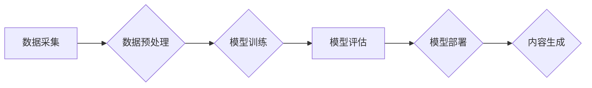

## AIGC 原理与代码实例讲解

> 关键词：AIGC, 文本生成, 图像生成, 机器学习, 深度学习, Transformer, 代码生成

## 1. 背景介绍

近年来，人工智能（AI）技术取得了飞速发展，其中，生成式人工智能（AIGC）作为其重要分支，引起了广泛关注。AIGC是指利用人工智能技术，从数据中学习模式，并生成新的文本、图像、音频、视频等内容的系统。与传统的AI应用相比，AIGC更注重内容的创造性和表达能力，具有更强的应用潜力。

AIGC技术在各个领域都展现出巨大的应用价值，例如：

* **内容创作:** 自动生成新闻报道、广告文案、诗歌、小说等，提高内容生产效率。
* **艺术创作:** 生成绘画、音乐、视频等艺术作品，激发创作灵感，拓展艺术边界。
* **教育培训:** 个性化定制学习内容，提供智能化的辅导和答疑服务。
* **软件开发:** 自动生成代码、文档、测试用例等，加速软件开发流程。

## 2. 核心概念与联系

AIGC的核心是利用深度学习算法，特别是Transformer模型，从海量数据中学习语言和图像的模式，并生成新的内容。

**Mermaid 流程图:**



**核心概念:**

* **深度学习:** 一种机器学习的子领域，利用多层神经网络模拟人类大脑的学习过程。
* **Transformer模型:** 一种新型的深度学习架构，能够有效处理序列数据，例如文本和图像。
* **数据预处理:** 将原始数据转换为模型可以理解的格式，例如文本分词、图像裁剪等。
* **模型训练:** 利用训练数据，调整模型参数，使其能够生成高质量的内容。
* **模型评估:** 使用测试数据评估模型的性能，例如准确率、流畅度等。
* **模型部署:** 将训练好的模型部署到实际应用环境中。

## 3. 核心算法原理 & 具体操作步骤

### 3.1  算法原理概述

AIGC的核心算法是基于Transformer模型的生成式模型，其主要原理是通过编码器-解码器结构，将输入数据编码成语义表示，然后解码生成新的内容。

* **编码器:** 将输入数据（例如文本或图像）转换为一个固定长度的语义向量，捕捉输入数据的上下文信息。
* **解码器:** 根据编码器的输出，逐个生成新的内容，例如单词或像素。

Transformer模型利用自注意力机制，能够捕捉输入数据中不同词或像素之间的长距离依赖关系，从而生成更流畅、更连贯的内容。

### 3.2  算法步骤详解

1. **数据采集:** 收集大量文本或图像数据，作为模型的训练数据。
2. **数据预处理:** 对数据进行清洗、格式化、分词等预处理操作，使其符合模型的输入要求。
3. **模型训练:** 利用训练数据，训练Transformer模型，调整模型参数，使其能够生成高质量的内容。
4. **模型评估:** 使用测试数据评估模型的性能，例如准确率、流畅度等。
5. **模型调优:** 根据评估结果，调整模型参数或训练策略，进一步提高模型性能。
6. **模型部署:** 将训练好的模型部署到实际应用环境中，例如云平台或本地服务器。
7. **内容生成:** 使用模型生成新的文本或图像内容，例如根据用户输入生成文章、根据图片描述生成图像等。

### 3.3  算法优缺点

**优点:**

* **生成高质量内容:** Transformer模型能够捕捉语言和图像的复杂模式，生成更流畅、更连贯的内容。
* **适应性强:** 可以应用于多种类型的生成任务，例如文本生成、图像生成、音频生成等。
* **可扩展性好:** 可以通过增加模型参数或训练数据，提高模型性能。

**缺点:**

* **训练成本高:** Transformer模型参数量大，训练需要大量的计算资源和时间。
* **数据依赖性强:** 模型性能取决于训练数据的质量和数量。
* **解释性差:** 模型内部的决策过程难以理解，缺乏可解释性。

### 3.4  算法应用领域

AIGC技术在各个领域都展现出巨大的应用潜力，例如：

* **内容创作:** 自动生成新闻报道、广告文案、诗歌、小说等，提高内容生产效率。
* **艺术创作:** 生成绘画、音乐、视频等艺术作品，激发创作灵感，拓展艺术边界。
* **教育培训:** 个性化定制学习内容，提供智能化的辅导和答疑服务。
* **软件开发:** 自动生成代码、文档、测试用例等，加速软件开发流程。
* **医疗保健:** 生成医学报告、诊断建议等，辅助医生进行诊断和治疗。

## 4. 数学模型和公式 & 详细讲解 & 举例说明

### 4.1  数学模型构建

AIGC的核心数学模型是基于Transformer架构的生成式模型，其主要包括编码器和解码器两个部分。

* **编码器:** 使用多层Transformer模块，将输入序列（例如文本或图像）编码成一个固定长度的语义向量。
* **解码器:** 使用多层Transformer模块，根据编码器的输出，逐个生成新的序列（例如单词或像素）。

### 4.2  公式推导过程

Transformer模型的核心是自注意力机制，其计算公式如下：

$$
Attention(Q, K, V) = \frac{exp(Q \cdot K^T / \sqrt{d_k})}{exp(Q \cdot K^T / \sqrt{d_k})} \cdot V
$$

其中：

* $Q$：查询矩阵
* $K$：键矩阵
* $V$：值矩阵
* $d_k$：键向量的维度

自注意力机制能够捕捉输入序列中不同词或像素之间的关系，并赋予它们不同的权重。

### 4.3  案例分析与讲解

例如，在文本生成任务中，输入序列为“今天天气很好”，编码器会将每个词编码成一个语义向量，然后通过自注意力机制，捕捉“今天”和“天气很好”之间的关系。解码器会根据编码器的输出，逐个生成新的单词，例如“阳光明媚”。

## 5. 项目实践：代码实例和详细解释说明

### 5.1  开发环境搭建

* Python 3.7+
* PyTorch 1.7+
* CUDA 10.2+ (可选，用于GPU加速)

### 5.2  源代码详细实现

```python
import torch
import torch.nn as nn

class Transformer(nn.Module):
    def __init__(self, vocab_size, embedding_dim, num_heads, num_layers):
        super(Transformer, self).__init__()
        self.embedding = nn.Embedding(vocab_size, embedding_dim)
        self.encoder = nn.TransformerEncoder(nn.TransformerEncoderLayer(embedding_dim, num_heads), num_layers)
        self.decoder = nn.TransformerDecoder(nn.TransformerDecoderLayer(embedding_dim, num_heads), num_layers)
        self.linear = nn.Linear(embedding_dim, vocab_size)

    def forward(self, src, tgt):
        src = self.embedding(src)
        tgt = self.embedding(tgt)
        encoder_output = self.encoder(src)
        decoder_output = self.decoder(tgt, encoder_output)
        output = self.linear(decoder_output)
        return output
```

### 5.3  代码解读与分析

* `__init__`方法：初始化模型参数，包括词嵌入层、编码器、解码器和输出层。
* `forward`方法：定义模型的正向传播过程，将输入序列编码成语义向量，然后解码生成新的序列。

### 5.4  运行结果展示

使用训练好的模型，可以输入文本或图像，生成新的文本或图像内容。

## 6. 实际应用场景

### 6.1  文本生成

* **新闻报道:** 根据事件数据自动生成新闻报道。
* **广告文案:** 根据产品信息自动生成广告文案。
* **小说创作:** 根据用户输入的主题和人物设定，自动生成小说情节。

### 6.2  图像生成

* **艺术作品:** 根据用户输入的描述，生成绘画、音乐、视频等艺术作品。
* **图像修复:** 根据损坏图像的部分信息，自动修复图像。
* **图像合成:** 将多个图像合成一张新的图像。

### 6.3  其他应用场景

* **代码生成:** 根据用户需求，自动生成代码。
* **语音合成:** 根据文本内容，自动生成语音。
* **机器翻译:** 将一种语言翻译成另一种语言。

### 6.4  未来应用展望

AIGC技术的发展将进一步推动人工智能的普及和应用，例如：

* **个性化内容推荐:** 根据用户的兴趣和偏好，提供个性化的内容推荐。
* **智能客服:** 利用AIGC技术，开发更智能、更人性化的客服机器人。
* **虚拟助手:** 开发更强大的虚拟助手，能够理解和执行用户的复杂指令。

## 7. 工具和资源推荐

### 7.1  学习资源推荐

* **书籍:**
    * 《深度学习》
    * 《Transformer模型详解》
* **在线课程:**
    * Coursera: 深度学习
    * Udacity: 自然语言处理
* **博客和论坛:**
    * TensorFlow博客
    * PyTorch论坛

### 7.2  开发工具推荐

* **TensorFlow:** 开源深度学习框架
* **PyTorch:** 开源深度学习框架
* **Hugging Face:** 提供预训练模型和工具

### 7.3  相关论文推荐

* 《Attention Is All You Need》
* 《BERT: Pre-training of Deep Bidirectional Transformers for Language Understanding》
* 《GPT-3: Language Models are Few-Shot Learners》

## 8. 总结：未来发展趋势与挑战

### 8.1  研究成果总结

AIGC技术取得了显著进展，能够生成高质量的文本、图像、音频等内容。Transformer模型成为AIGC的核心架构，自注意力机制是其关键创新。

### 8.2  未来发展趋势

* **模型规模和能力提升:** 训练更大规模的模型，提高生成内容的质量和多样性。
* **多模态生成:** 将文本、图像、音频等多种模态融合，实现更丰富的生成内容。
* **可解释性增强:** 研究AIGC模型的决策过程，提高模型的可解释性和可控性。
* **伦理和安全问题:** 关注AIGC技术带来的伦理和安全问题，例如内容虚假、版权侵权等。

### 8.3  面临的挑战

* **数据获取和标注:** AIGC模型需要大量高质量的数据进行训练，数据获取和标注成本高昂。
* **计算资源需求:** 训练大型AIGC模型需要大量的计算资源，成本高昂。
* **模型泛化能力:** AIGC模型的泛化能力有限，难以适应新的任务和领域。

### 8.4  研究展望

未来，AIGC技术将继续发展，在更多领域发挥重要作用。研究者将继续探索新的模型架构、训练方法和应用场景，推动AIGC技术向更智能、更安全、更可持续的方向发展。

## 9. 附录：常见问题与解答

**Q1: AIGC技术与传统AI技术有什么区别？**

**A1:** 传统AI技术主要关注数据分析和预测，而AIGC技术则更注重内容的创造性和表达能力。

**Q2: AIGC技术有哪些应用场景？**

**A2:** AIGC技术可以应用于文本生成、图像生成、代码生成、语音合成、机器翻译等多个领域。

**Q3: 如何学习AIGC技术？**

**A3:** 可以通过阅读相关书籍、在线课程、博客和论坛等方式学习AIGC技术。

**Q4: AIGC技术有哪些伦理和