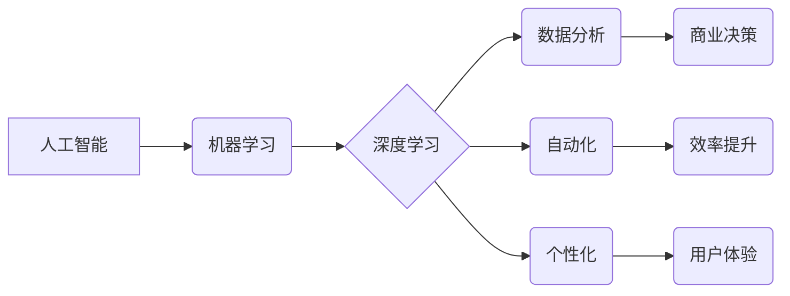

## AI技术在商业中的应用

> 关键词：人工智能、机器学习、深度学习、商业应用、数据分析、自动化

## 1. 背景介绍

人工智能（AI）技术近年来发展迅速，已从学术研究领域逐渐走向现实生活，并开始深刻地改变着商业模式和运营方式。AI技术的核心在于模拟人类智能，赋予机器学习、推理、决策等能力，从而解决传统方法难以处理的复杂问题。

商业领域对AI技术的应用需求日益增长，主要原因包括：

* **数据爆炸**:  现代商业产生海量数据，AI技术能够高效地分析和挖掘数据中的价值，为企业决策提供数据支持。
* **自动化需求**:  AI技术可以自动化完成许多重复性、耗时的任务，例如数据录入、客户服务等，提高工作效率和降低成本。
* **个性化体验**:  AI技术可以根据用户的行为和偏好，提供个性化的产品推荐、服务和营销方案，提升用户体验。
* **竞争优势**:  企业采用AI技术可以获得竞争优势，例如开发智能产品、优化运营流程、提升客户服务水平等。

## 2. 核心概念与联系

**2.1 核心概念**

* **人工智能 (AI)**：模拟人类智能的计算机系统，能够学习、推理、决策等。
* **机器学习 (ML)**：一种AI技术，通过算法训练模型，使模型能够从数据中学习规律，并对新数据进行预测或分类。
* **深度学习 (DL)**：一种更高级的机器学习技术，利用多层神经网络模拟人类大脑的学习过程，能够处理更复杂的数据和任务。

**2.2 架构关系**



**2.3 联系**

AI技术是机器学习和深度学习的总称，机器学习是AI的核心技术之一，深度学习是机器学习的进一步发展。AI技术通过机器学习和深度学习可以实现数据分析、自动化和个性化，从而为商业决策、效率提升和用户体验提供支持。

## 3. 核心算法原理 & 具体操作步骤

**3.1 算法原理概述**

机器学习算法的核心是通过训练模型，使模型能够从数据中学习规律，并对新数据进行预测或分类。常见的机器学习算法包括：

* **监督学习**:  利用标记数据训练模型，例如分类和回归问题。
* **无监督学习**:  利用未标记数据发现数据中的隐藏结构，例如聚类和降维。
* **强化学习**:  通过试错学习，使模型在特定环境中获得最大奖励。

**3.2 算法步骤详解**

以监督学习为例，其基本步骤如下：

1. **数据收集和预处理**:  收集相关数据，并进行清洗、转换、特征工程等预处理工作。
2. **模型选择**:  根据具体任务选择合适的机器学习算法模型。
3. **模型训练**:  利用标记数据训练模型，调整模型参数，使模型能够准确地预测或分类。
4. **模型评估**:  利用测试数据评估模型的性能，例如准确率、召回率、F1-score等。
5. **模型部署**:  将训练好的模型部署到实际应用场景中，用于预测或分类新数据。

**3.3 算法优缺点**

不同的机器学习算法具有不同的优缺点，需要根据具体任务选择合适的算法。例如，决策树算法易于理解和解释，但泛化能力较弱；支持向量机算法泛化能力强，但训练时间较长。

**3.4 算法应用领域**

机器学习算法广泛应用于各个领域，例如：

* **图像识别**:  识别图像中的物体、场景和人脸。
* **自然语言处理**:  理解和生成人类语言，例如机器翻译、文本摘要和聊天机器人。
* **推荐系统**:  根据用户的行为和偏好，推荐相关产品或内容。
* **预测分析**:  预测未来事件的发生概率，例如销售预测和风险评估。

## 4. 数学模型和公式 & 详细讲解 & 举例说明

**4.1 数学模型构建**

机器学习算法通常基于数学模型，例如线性回归模型、逻辑回归模型和神经网络模型。这些模型通过参数来描述数据之间的关系，并利用优化算法来调整参数，使模型能够更好地拟合数据。

**4.2 公式推导过程**

例如，线性回归模型的目标是找到一条直线，能够最佳地拟合数据点。模型的公式如下：

$$y = wx + b$$

其中，$y$ 是预测值，$x$ 是输入特征，$w$ 是权重参数，$b$ 是偏置参数。

模型参数 $w$ 和 $b$ 可以通过最小化预测误差来确定，常用的优化算法包括梯度下降法。

**4.3 案例分析与讲解**

假设我们有一个数据集，包含房屋面积和房屋价格的信息。我们可以使用线性回归模型来预测房屋价格。

* **输入特征**: 房屋面积
* **输出目标**: 房屋价格

通过训练线性回归模型，我们可以得到一个最佳的直线方程，例如：

$$y = 2000x + 50000$$

其中，$y$ 表示房屋价格，$x$ 表示房屋面积。

根据这个方程，我们可以预测不同面积房屋的价格。例如，如果一个房屋面积为100平方米，那么其价格可以预测为：

$$y = 2000 * 100 + 50000 = 250000$$

## 5. 项目实践：代码实例和详细解释说明

**5.1 开发环境搭建**

* **操作系统**:  Windows、macOS 或 Linux
* **编程语言**:  Python
* **机器学习库**:  Scikit-learn、TensorFlow 或 PyTorch
* **数据处理库**:  Pandas、NumPy

**5.2 源代码详细实现**

以下是一个使用Scikit-learn库实现线性回归模型的Python代码示例：

```python
import pandas as pd
from sklearn.linear_model import LinearRegression
from sklearn.model_selection import train_test_split

# 加载数据
data = pd.read_csv('house_data.csv')

# 分割数据
X = data[['面积']]
y = data['价格']
X_train, X_test, y_train, y_test = train_test_split(X, y, test_size=0.2, random_state=42)

# 创建线性回归模型
model = LinearRegression()

# 训练模型
model.fit(X_train, y_train)

# 预测测试数据
y_pred = model.predict(X_test)

# 评估模型性能
from sklearn.metrics import mean_squared_error
mse = mean_squared_error(y_test, y_pred)
print('均方误差:', mse)
```

**5.3 代码解读与分析**

* 首先，我们使用Pandas库加载数据，并使用Scikit-learn库的`train_test_split`函数将数据分割成训练集和测试集。
* 然后，我们创建LinearRegression模型，并使用`fit`方法训练模型。
* 训练完成后，我们可以使用`predict`方法预测测试数据。
* 最后，我们使用`mean_squared_error`函数评估模型的性能。

**5.4 运行结果展示**

运行代码后，会输出模型的均方误差值，该值越小，模型的预测性能越好。

## 6. 实际应用场景

**6.1 客户服务自动化**

* 使用聊天机器人处理客户常见问题，例如订单查询、退换货流程等。
* 利用自然语言处理技术分析客户反馈，识别潜在问题并及时解决。

**6.2 个性化营销**

* 根据用户的购买历史、浏览记录和行为偏好，推荐个性化的产品和服务。
* 利用机器学习算法预测用户的购买意愿，进行精准营销。

**6.3 运营效率提升**

* 自动化完成数据录入、报表生成等重复性工作，提高工作效率。
* 利用预测分析技术预测未来需求，优化库存管理和生产计划。

**6.4 产品开发创新**

* 利用机器学习算法分析用户行为数据，发现新的产品需求和市场趋势。
* 开发智能产品，例如智能家居、智能医疗等，提升用户体验。

**6.5 未来应用展望**

随着AI技术的不断发展，其在商业领域的应用将更加广泛和深入。例如：

* **更智能的自动化**:  AI技术将能够自动化完成更多复杂的任务，例如决策、策略制定等。
* **更个性化的体验**:  AI技术将能够提供更加个性化的产品、服务和营销方案，满足用户的个性化需求。
* **更精准的预测**:  AI技术将能够更加精准地预测未来事件，帮助企业做出更明智的决策。


## 7. 工具和资源推荐

**7.1 学习资源推荐**

* **在线课程**:  Coursera、edX、Udacity 等平台提供丰富的AI和机器学习课程。
* **书籍**:  《深度学习》、《机器学习实战》等书籍是学习AI技术的经典教材。
* **博客和论坛**:  机器之心、AI科技大本营等网站提供最新的AI技术资讯和讨论。

**7.2 开发工具推荐**

* **Python**:  Python 是AI开发最常用的编程语言，拥有丰富的机器学习库。
* **Jupyter Notebook**:  Jupyter Notebook 是一个交互式编程环境，方便进行AI模型开发和调试。
* **TensorFlow**:  TensorFlow 是一个开源的深度学习框架，支持多种硬件平台。
* **PyTorch**:  PyTorch 是另一个流行的深度学习框架，以其灵活性和易用性而闻名。

**7.3 相关论文推荐**

* **《ImageNet Classification with Deep Convolutional Neural Networks》**:  介绍了AlexNet模型，标志着深度学习在图像识别领域的突破。
* **《Attention Is All You Need》**:  提出了Transformer模型， revolutionized natural language processing.
* **《Generative Adversarial Networks》**:  介绍了GAN模型，能够生成逼真的图像、文本和音频等数据。

## 8. 总结：未来发展趋势与挑战

**8.1 研究成果总结**

近年来，AI技术取得了显著的进展，在图像识别、自然语言处理、语音识别等领域取得了突破性成果。

**8.2 未来发展趋势**

* **更强大的计算能力**:  随着硬件技术的进步，AI模型将能够处理更大规模的数据，并实现更复杂的任务。
* **更广泛的应用场景**:  AI技术将应用于更多领域，例如医疗、教育、金融等，带来更深远的影响。
* **更注重伦理和安全**:  随着AI技术的应用越来越广泛，伦理和安全问题将成为越来越重要的研究方向。

**8.3 面临的挑战**

* **数据获取和隐私保护**:  AI模型的训练需要大量数据，如何获取高质量数据并保护用户隐私是一个挑战。
* **算法解释性和可信度**:  许多AI算法是黑箱模型，难以解释其决策过程，这会影响其可信度和应用范围。
* **人才短缺**:  AI技术发展需要大量人才，而目前全球范围内AI人才仍然短缺。

**8.4 研究展望**

未来，AI研究将继续朝着更智能、更安全、更可解释的方向发展。


## 9. 附录：常见问题与解答

**9.1 如何选择合适的机器学习算法？**

选择合适的机器学习算法需要根据具体任务和数据特点进行选择。例如，对于分类问题，可以考虑决策树、支持向量机、神经网络等算法；对于回归问题，可以考虑线性回归、逻辑回归、支持向量回归等算法。

**9.2 如何评估机器学习模型的性能？**

常用的机器学习模型性能评估指标包括准确率、召回率、F1-score、AUC等。

**9.3 如何解决机器学习模型的过拟合问题？**

过拟合是指模型在