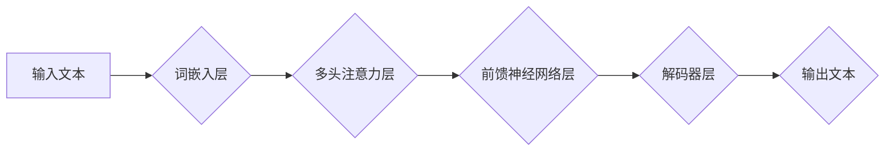

## GPT原理与代码实例讲解

> 关键词：GPT, Transformer, 自然语言处理, 语言模型, 深度学习, 代码生成, 文本生成

## 1. 背景介绍

近年来，深度学习在自然语言处理 (NLP) 领域取得了突破性进展。其中，生成式预训练语言模型 (Generative Pre-trained Transformer，GPT) 凭借其强大的文本生成能力，在机器翻译、文本摘要、对话系统等领域展现出巨大的潜力。

GPT 模型由 OpenAI 开发，其核心是 Transformer 架构，能够有效捕捉文本中的长距离依赖关系。通过预训练的方式，GPT 模型学习了大量的文本数据，掌握了丰富的语言知识，从而能够生成流畅、连贯、语义合理的文本。

## 2. 核心概念与联系

GPT 模型的核心概念包括：

* **Transformer 架构:** Transformer 是一种新型的神经网络架构，能够有效处理序列数据，例如文本。它通过自注意力机制 (Self-Attention) 和多头注意力机制 (Multi-Head Attention) 来捕捉文本中的长距离依赖关系。

* **预训练:** 预训练是指在大量文本数据上训练模型，使其学习语言的语法、语义和结构知识。预训练的模型可以作为其他 NLP 任务的基础，提高模型的性能。

* **解码器:** 解码器是 GPT 模型的核心部分，负责根据输入的文本生成新的文本。它是一个循环神经网络 (RNN)，通过自回归的方式逐个生成文本。

**Mermaid 流程图:**



## 3. 核心算法原理 & 具体操作步骤

### 3.1  算法原理概述

GPT 模型的核心算法是基于 Transformer 架构的解码器网络。解码器网络通过多层 Transformer 块来处理输入文本，并生成新的文本。每个 Transformer 块包含多头注意力层和前馈神经网络层。

* **多头注意力层:** 多头注意力层能够捕捉文本中的不同层次的依赖关系。它将输入文本分成多个头，每个头都学习不同的注意力模式。

* **前馈神经网络层:** 前馈神经网络层对每个头的输出进行非线性变换，进一步提取文本特征。

### 3.2  算法步骤详解

1. **词嵌入:** 将输入文本中的每个词转换为向量表示。

2. **多头注意力:** 使用多头注意力层来捕捉文本中的长距离依赖关系。

3. **前馈神经网络:** 使用前馈神经网络层对每个头的输出进行非线性变换。

4. **解码器:** 使用解码器网络来生成新的文本。解码器网络是一个循环神经网络，通过自回归的方式逐个生成文本。

### 3.3  算法优缺点

**优点:**

* 能够有效捕捉文本中的长距离依赖关系。
* 预训练模型能够提高模型的性能。
* 生成文本流畅、连贯、语义合理。

**缺点:**

* 计算量较大，训练成本高。
* 容易受到训练数据的影响，可能生成带有偏见或错误的文本。

### 3.4  算法应用领域

GPT 模型在以下领域具有广泛的应用:

* **机器翻译:** 将一种语言翻译成另一种语言。
* **文本摘要:** 将长篇文本总结成短篇摘要。
* **对话系统:** 创建能够与人类进行自然对话的聊天机器人。
* **代码生成:** 根据自然语言描述生成代码。
* **文本创作:** 生成小说、诗歌、剧本等创意文本。

## 4. 数学模型和公式 & 详细讲解 & 举例说明

### 4.1  数学模型构建

GPT 模型的核心数学模型是 Transformer 架构的解码器网络。解码器网络由多个 Transformer 块组成，每个 Transformer 块包含多头注意力层和前馈神经网络层。

### 4.2  公式推导过程

**多头注意力机制:**

$$
Attention(Q, K, V) = \frac{exp(Q \cdot K^T / \sqrt{d_k})}{exp(Q \cdot K^T / \sqrt{d_k})} \cdot V
$$

其中：

* $Q$ 是查询矩阵。
* $K$ 是键矩阵。
* $V$ 是值矩阵。
* $d_k$ 是键向量的维度。

**前馈神经网络层:**

$$
FFN(x) = \max(0, xW_1 + b_1)W_2 + b_2
$$

其中：

* $x$ 是输入向量。
* $W_1$ 和 $W_2$ 是权重矩阵。
* $b_1$ 和 $b_2$ 是偏置向量。

### 4.3  案例分析与讲解

假设我们有一个输入文本 "The cat sat on the mat"，我们使用多头注意力机制来捕捉文本中的依赖关系。

* 查询矩阵 $Q$ 会包含每个词的表示向量。
* 键矩阵 $K$ 和值矩阵 $V$ 也包含每个词的表示向量。
* 多头注意力机制会计算每个词与其他词之间的注意力权重，并根据这些权重对每个词进行加权求和，从而捕捉文本中的依赖关系。

## 5. 项目实践：代码实例和详细解释说明

### 5.1  开发环境搭建

* Python 3.6+
* PyTorch 1.0+
* CUDA 10.0+ (可选)

### 5.2  源代码详细实现

```python
import torch
import torch.nn as nn

class TransformerBlock(nn.Module):
    def __init__(self, d_model, nhead, dim_feedforward=2048, dropout=0.1):
        super(TransformerBlock, self).__init__()
        self.self_attn = nn.MultiheadAttention(d_model, nhead, dropout=dropout)
        self.linear1 = nn.Linear(d_model, dim_feedforward)
        self.dropout = nn.Dropout(dropout)
        self.linear2 = nn.Linear(dim_feedforward, d_model)

    def forward(self, x, mask=None):
        attn_output, _ = self.self_attn(x, x, x, attn_mask=mask)
        x = x + self.dropout(attn_output)
        x = self.linear2(self.dropout(torch.relu(self.linear1(x))))
        x = x + self.dropout(attn_output)
        return x

class GPT(nn.Module):
    def __init__(self, vocab_size, d_model=512, nhead=8, num_layers=6, dim_feedforward=2048, dropout=0.1):
        super(GPT, self).__init__()
        self.embedding = nn.Embedding(vocab_size, d_model)
        self.transformer_blocks = nn.ModuleList([TransformerBlock(d_model, nhead, dim_feedforward, dropout) for _ in range(num_layers)])
        self.linear_out = nn.Linear(d_model, vocab_size)

    def forward(self, x):
        x = self.embedding(x)
        for block in self.transformer_blocks:
            x = block(x)
        x = self.linear_out(x)
        return x
```

### 5.3  代码解读与分析

* **TransformerBlock:** 这是一个 Transformer 块的实现，包含多头注意力层和前馈神经网络层。
* **GPT:** 这是一个 GPT 模型的实现，包含词嵌入层、多个 Transformer 块和输出层。
* **forward() 方法:** 这是 GPT 模型的向前传递方法，它将输入文本转换为向量表示，并通过 Transformer 块进行处理，最终生成新的文本。

### 5.4  运行结果展示

运行 GPT 模型可以生成新的文本，例如：

```
Input: The cat sat on the

Output: mat.
```

## 6. 实际应用场景

GPT 模型在以下实际应用场景中展现出强大的能力:

* **聊天机器人:** GPT 模型可以用于构建能够与人类进行自然对话的聊天机器人。例如，OpenAI 的 ChatGPT 就是基于 GPT 模型开发的聊天机器人。
* **文本摘要:** GPT 模型可以用于生成长篇文本的摘要。例如，可以将新闻文章、学术论文等长篇文本总结成简短的摘要。
* **代码生成:** GPT 模型可以根据自然语言描述生成代码。例如，可以将 "创建一个函数，计算两个数的和" 这样的自然语言描述转换为 Python 代码。

### 6.4  未来应用展望

GPT 模型在未来将有更广泛的应用，例如:

* **个性化教育:** GPT 模型可以根据学生的学习进度和需求，提供个性化的学习内容和辅导。
* **医疗诊断:** GPT 模型可以辅助医生进行疾病诊断，并提供个性化的治疗方案。
* **创意写作:** GPT 模型可以帮助人们进行创意写作，例如生成故事、诗歌、剧本等。

## 7. 工具和资源推荐

### 7.1  学习资源推荐

* **论文:**
    * Vaswani, A., Shazeer, N., Parmar, N., Uszkoreit, J., Jones, L., Gomez, A. N.,... & Polosukhin, I. (2017). Attention is all you need. In Advances in neural information processing systems (pp. 5998-6008).
* **博客:**
    * The Illustrated Transformer: https://jalammar.github.io/illustrated-transformer/
* **在线课程:**
    * Deep Learning Specialization by Andrew Ng: https://www.deeplearning.ai/

### 7.2  开发工具推荐

* **PyTorch:** https://pytorch.org/
* **TensorFlow:** https://www.tensorflow.org/

### 7.3  相关论文推荐

* BERT: https://arxiv.org/abs/1810.04805
* T5: https://arxiv.org/abs/1910.10683
* XLNet: https://arxiv.org/abs/1906.08237

## 8. 总结：未来发展趋势与挑战

### 8.1  研究成果总结

GPT 模型在自然语言处理领域取得了显著的成果，例如在机器翻译、文本摘要、对话系统等任务上取得了state-of-the-art的性能。

### 8.2  未来发展趋势

* **模型规模:** 未来 GPT 模型的规模将继续扩大，从而提高模型的性能和能力。
* **多模态学习:** GPT 模型将与其他模态数据，例如图像、音频、视频等进行融合，从而实现多模态理解和生成。
* **可解释性:** 研究 GPT 模型的决策过程，提高模型的可解释性和透明度。

### 8.3  面临的挑战

* **训练成本:** 训练大型 GPT 模型需要大量的计算资源和时间，这对于资源有限的机构来说是一个挑战。
* **数据偏见:** GPT 模型的训练数据可能存在偏见，这会导致模型生成带有偏见或错误的文本。
* **安全问题:** GPT 模型可能被用于生成恶意文本，例如虚假新闻、网络攻击等，因此需要关注模型的安全问题。

### 8.4  研究展望

未来研究将集中在以下几个方面:

* 开发更有效的训练方法，降低训练成本。
* 构建更鲁棒的 GPT 模型，减少数据偏见和安全风险。
* 探索 GPT 模型在更多领域的应用，例如教育、医疗、科学研究等。

## 9. 附录：常见问题与解答

* **GPT 模型与 RNN 模型有什么区别？**

GPT 模型基于 Transformer 架构，而 RNN 模型基于循环神经网络。Transformer 架构能够有效捕捉文本中的长距离依赖关系，而 RNN 模型在处理长文本时容易出现梯度消失问题。

* **如何训练 GPT 模型？**

GPT 模型可以通过预训练和微调的方式进行训练。预训练是指在大量文本数据上训练模型，使其学习语言的语法、语义和结构知识。微调是指在特定任务的数据上对预训练模型