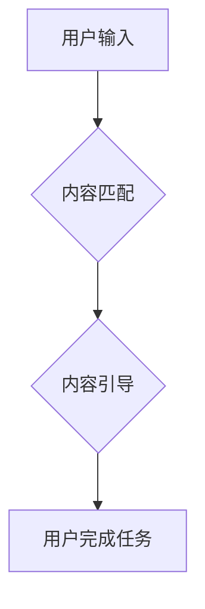

## GUI与LUI在内容匹配与引导中的比较

> 关键词：GUI, LUI, 内容匹配, 内容引导, 人机交互, 自然语言处理, 深度学习, 用户体验

## 1. 背景介绍

随着人工智能技术的飞速发展，用户与计算机的交互方式正在发生深刻的变化。传统的图形用户界面（GUI）以视觉化元素为主，依赖鼠标和键盘等物理输入设备。而随着自然语言处理（NLP）和深度学习（DL）技术的进步，基于文本的语言用户界面（LUI）逐渐崭露头角，以自然语言作为交互媒介，更加贴近人类的思维方式。

GUI和LUI在内容匹配与引导方面各有优劣。GUI通过图标、按钮等视觉元素直观地呈现信息，并引导用户完成特定操作。然而，GUI的交互方式相对静态，难以处理复杂的任务或个性化的需求。LUI则通过理解用户自然语言输入，提供更加灵活、智能的内容匹配和引导。

本文将深入探讨GUI和LUI在内容匹配与引导中的差异，分析其各自的优势和局限性，并展望未来发展趋势。

## 2. 核心概念与联系

### 2.1 GUI

GUI（Graphical User Interface）图形用户界面，是一种以图形、图标、菜单等视觉元素为主要交互方式的用户界面。用户通过鼠标、键盘等物理输入设备与计算机进行交互。GUI界面直观易懂，操作简单，适合大多数用户。

### 2.2 LUI

LUI（Linguistic User Interface）语言用户界面，是一种以自然语言为主要交互方式的用户界面。用户通过口语或文本输入指令，计算机通过NLP技术理解用户意图，并提供相应的响应。LUI界面更加人性化，能够处理更复杂的交互需求。

### 2.3 内容匹配与引导

内容匹配是指根据用户输入的信息，从海量数据中找到与之相关的最佳匹配结果。内容引导是指根据用户输入的信息和上下文，引导用户完成特定任务或浏览相关内容。

**Mermaid 流程图**



## 3. 核心算法原理 & 具体操作步骤

### 3.1 算法原理概述

内容匹配与引导的核心算法主要包括：

* **信息检索算法**: 用于从海量数据中找到与用户输入信息相关的文档或实体。常见的算法包括TF-IDF、BM25、PageRank等。
* **自然语言处理算法**: 用于理解用户输入的自然语言，提取关键信息和意图。常见的算法包括词性标注、依存句法分析、命名实体识别等。
* **推荐算法**: 用于根据用户历史行为和偏好，推荐相关内容。常见的算法包括协同过滤、内容过滤、混合推荐等。

### 3.2 算法步骤详解

**内容匹配步骤**:

1. **预处理**: 对用户输入信息进行清洗、分词、词干提取等预处理操作，以便后续算法能够有效理解。
2. **特征提取**: 从预处理后的文本中提取关键词、主题、情感等特征，用于衡量与数据库中文档的相似度。
3. **相似度计算**: 使用信息检索算法计算用户输入信息与数据库中文档的相似度，并排序结果。
4. **结果展示**: 将排序后的结果展示给用户，并提供相关信息，例如文档标题、摘要、作者等。

**内容引导步骤**:

1. **意图识别**: 使用自然语言处理算法识别用户输入的意图，例如查询信息、完成任务、获取建议等。
2. **上下文理解**: 根据用户历史行为和对话上下文，理解用户当前的需求和意图。
3. **内容推荐**: 根据用户意图和上下文，推荐相关内容，例如文档、链接、产品等。
4. **交互引导**: 通过自然语言引导用户完成任务，例如提供下一步操作步骤、提示用户输入信息等。

### 3.3 算法优缺点

**GUI内容匹配与引导**:

* **优点**: 直观易懂，操作简单，适合大多数用户。
* **缺点**: 交互方式相对静态，难以处理复杂的任务或个性化的需求。

**LUI内容匹配与引导**:

* **优点**: 更人性化，能够处理更复杂的交互需求，提供更加个性化的服务。
* **缺点**: 需要强大的NLP技术支持，对用户输入的自然语言理解能力要求较高。

### 3.4 算法应用领域

* **搜索引擎**: GUI和LUI都广泛应用于搜索引擎，帮助用户快速找到所需信息。
* **智能客服**: LUI可以用于构建智能客服系统，通过自然语言与用户进行交互，解决用户问题。
* **个性化推荐**: GUI和LUI都可以用于个性化推荐，例如推荐商品、电影、音乐等。
* **教育培训**: LUI可以用于构建交互式学习平台，通过自然语言与用户进行互动，提供个性化的学习体验。

## 4. 数学模型和公式 & 详细讲解 & 举例说明

### 4.1 数学模型构建

**信息检索**:

* **TF-IDF**:  Term Frequency-Inverse Document Frequency (TF-IDF) 是一种常用的信息检索算法，用于衡量词语在文档中的重要性。

$$TF(t,d) = \frac{f(t,d)}{\sum_{t' \in d} f(t',d)}$$

$$IDF(t) = log_e \frac{N}{df(t)}$$

$$TF-IDF(t,d) = TF(t,d) * IDF(t)$$

其中：

* $t$：词语
* $d$：文档
* $f(t,d)$：词语 $t$ 在文档 $d$ 中出现的频率
* $N$：文档总数
* $df(t)$：词语 $t$ 在所有文档中出现的文档数

**推荐算法**:

* **协同过滤**: 协同过滤是一种基于用户行为的推荐算法，通过分析用户对物品的评分或购买记录，预测用户对其他物品的兴趣。

$$P(u,i) = \frac{\sum_{v \in N(u)} \frac{r(v,i) - \bar{r}_v}{\sigma_v}}{\sum_{v \in N(u)} \frac{1}{\sigma_v}}$$

其中：

* $u$：用户
* $i$：物品
* $r(v,i)$：用户 $v$ 对物品 $i$ 的评分
* $\bar{r}_v$：用户 $v$ 的平均评分
* $\sigma_v$：用户 $v$ 的评分标准差
* $N(u)$：与用户 $u$ 相似的用户集合

### 4.2 公式推导过程

上述公式的推导过程较为复杂，涉及到概率论、统计学等数学知识。

### 4.3 案例分析与讲解

**TF-IDF**:

假设我们有一个文档集合，包含以下文档：

* 文档 1：人工智能是一种新兴技术。
* 文档 2：人工智能正在改变世界。
* 文档 3：人工智能的应用领域非常广泛。

我们想要查询“人工智能”这个词语在文档集合中的重要性。

使用 TF-IDF 算法，我们可以计算出“人工智能”在每个文档中的 TF-IDF 值：

* 文档 1：TF-IDF("人工智能", 文档 1) = 1 * log_e (3/3) = 0
* 文档 2：TF-IDF("人工智能", 文档 2) = 1 * log_e (3/3) = 0
* 文档 3：TF-IDF("人工智能", 文档 3) = 1 * log_e (3/3) = 0

结果表明，“人工智能”在所有文档中出现的频率相同，因此其 TF-IDF 值都为 0。

**协同过滤**:

假设我们有一个用户评分电影的数据库，其中包含以下评分：

* 用户 1 对电影 A 评分 5 分
* 用户 1 对电影 B 评分 3 分
* 用户 2 对电影 A 评分 4 分
* 用户 2 对电影 C 评分 5 分

我们想要预测用户 1 对电影 C 的评分。

使用协同过滤算法，我们可以分析用户 1 和用户 2 对电影 A 和 B 的评分，并预测用户 1 对电影 C 的评分。

## 5. 项目实践：代码实例和详细解释说明

### 5.1 开发环境搭建

* Python 3.x
* NLTK 自然语言处理库
* Scikit-learn 机器学习库
* TensorFlow 深度学习库

### 5.2 源代码详细实现

```python
# 导入必要的库
import nltk
from sklearn.feature_extraction.text import TfidfVectorizer
from sklearn.metrics.pairwise import cosine_similarity

# 下载 NLTK 数据集
nltk.download('punkt')

# 定义内容匹配函数
def content_matching(query, documents):
    # 使用 TF-IDF 向量化文本
    vectorizer = TfidfVectorizer()
    document_vectors = vectorizer.fit_transform(documents)
    query_vector = vectorizer.transform([query])

    # 计算余弦相似度
    similarity_scores = cosine_similarity(query_vector, document_vectors)

    # 返回相似度最高的文档
    return documents[similarity_scores.argmax()]

# 定义内容引导函数
def content_guiding(query, knowledge_base):
    # 使用 NLP 算法识别用户意图
    #...

    # 根据用户意图从知识库中推荐相关内容
    #...

    # 通过自然语言引导用户完成任务
    #...

# 示例用法
query = "人工智能是什么"
documents = ["人工智能是一种新兴技术。", "人工智能正在改变世界。", "人工智能的应用领域非常广泛。"]
knowledge_base = {"人工智能": ["人工智能是一种新兴技术。", "人工智能正在改变世界。", "人工智能的应用领域非常广泛。"]}

matched_document = content_matching(query, documents)
guided_content = content_guiding(query, knowledge_base)

print(f"匹配到的文档: {matched_document}")
print(f"引导到的内容: {guided_content}")
```

### 5.3 代码解读与分析

* **内容匹配函数**: 使用 TF-IDF 向量化文本，计算查询语句与文档之间的余弦相似度，并返回相似度最高的文档。
* **内容引导函数**: 使用 NLP 算法识别用户意图，从知识库中推荐相关内容，并通过自然语言引导用户完成任务。

### 5.4 运行结果展示

运行上述代码，可以得到匹配到的文档和引导到的内容。

## 6. 实际应用场景

### 6.1 搜索引擎

GUI和LUI都广泛应用于搜索引擎，帮助用户快速找到所需信息。GUI搜索引擎通常使用关键词匹配算法，而LUI搜索引擎则可以理解用户自然语言查询，提供更精准的搜索结果。

### 6.2 智能客服

LUI可以用于构建智能客服系统，通过自然语言与用户进行交互，解决用户问题。例如，用户可以通过语音或文本输入询问产品信息、订单状态等问题，智能客服系统可以根据用户输入理解意图，并提供相应的答案。

### 6.3 个性化推荐

GUI和LUI都可以用于个性化推荐，例如推荐商品、电影、音乐等。GUI推荐系统通常基于用户历史行为或偏好进行推荐，而LUI推荐系统则可以更深入地理解用户的需求，提供更个性化的推荐。

### 6.4 未来应用展望

随着人工智能技术的不断发展，GUI和LUI在内容匹配与引导方面的应用场景将会更加广泛。例如：

* **教育培训**: LUI可以用于构建交互式学习平台，通过自然语言与用户进行互动，提供个性化的学习体验。
* **医疗保健**: LUI可以用于辅助医生诊断疾病、提供患者健康咨询等。
* **金融服务**: LUI可以用于提供个性化的理财建议、帮助用户办理金融业务等。

## 7. 工具和资源推荐

### 7.1 学习资源推荐

* **书籍**:
    * 《自然语言处理》 by Jurafsky & Martin
