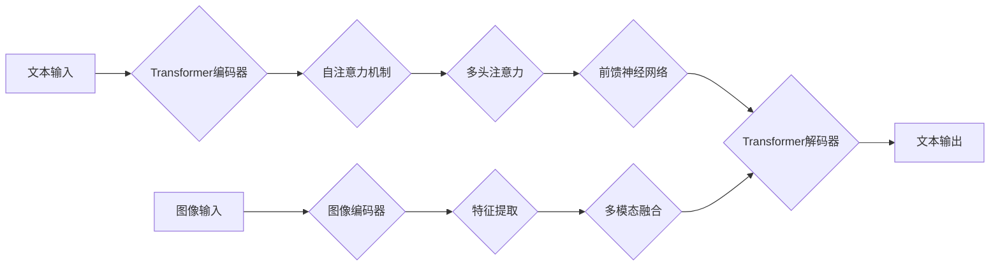

## OpenAI的GPT-4.0展示的实际应用

> 关键词：GPT-4.0, 大语言模型, 实际应用, 创新, 挑战, 未来趋势

## 1. 背景介绍

近年来，人工智能（AI）技术取得了飞速发展，其中大语言模型（LLM）作为AI领域的重要分支，展现出强大的文本生成、理解和翻译能力。OpenAI的GPT系列模型，特别是GPT-4.0，作为LLM领域的代表作，凭借其先进的算法和海量数据训练，在多个领域展现出令人瞩目的应用潜力。

GPT-4.0是OpenAI继GPT-3.5之后推出的最新一代大型语言模型，其参数量大幅提升，并支持多模态输入，这意味着它不仅可以理解和生成文本，还可以处理图像、音频等其他类型的数据。这种多模态能力使得GPT-4.0的应用场景更加广泛，也为人类与机器的交互方式带来了新的可能性。

## 2. 核心概念与联系

### 2.1  大语言模型（LLM）

大语言模型是一种基于深度学习技术的强大人工智能模型，能够理解和生成人类语言。它们通过训练大量的文本数据，学习语言的语法、语义和上下文关系，从而具备强大的文本处理能力。

### 2.2  Transformer架构

GPT-4.0采用了Transformer架构，这是近年来深度学习领域最成功的模型架构之一。Transformer架构通过自注意力机制（Self-Attention）有效地捕捉文本序列中的长距离依赖关系，从而提升了模型的理解和生成能力。

### 2.3  多模态学习

GPT-4.0支持多模态输入，这意味着它可以处理文本、图像、音频等多种类型的数据。多模态学习能够帮助模型更好地理解和生成更丰富、更准确的信息。

**Mermaid 流程图**

## 3. 核心算法原理 & 具体操作步骤

### 3.1  算法原理概述

GPT-4.0的核心算法原理是基于Transformer架构的深度学习模型训练。模型通过大量的文本数据进行训练，学习语言的语法、语义和上下文关系。训练过程可以概括为以下步骤：

1. **数据预处理:** 将文本数据进行清洗、分词、标记等预处理操作，使其能够被模型理解。
2. **模型输入:** 将预处理后的文本数据输入到Transformer编码器中。
3. **编码:** Transformer编码器通过多层自注意力机制和前馈神经网络，将文本数据编码成一个向量表示。
4. **解码:** Transformer解码器根据编码后的向量表示，生成相应的文本输出。
5. **损失函数:** 使用交叉熵损失函数计算模型预测结果与真实结果之间的差异。
6. **反向传播:** 利用反向传播算法，更新模型参数，使其能够更好地预测文本。

### 3.2  算法步骤详解

1. **数据预处理:**

   - 清洗数据：去除停用词、标点符号等无用信息。
   - 分词：将文本分割成单词或子词。
   - 标记：为每个单词或子词添加标签，例如词性标注、实体识别等。

2. **模型输入:** 将预处理后的文本数据输入到Transformer编码器中。

3. **编码:**

   - 自注意力机制：捕捉文本序列中单词之间的关系，理解上下文信息。
   - 多头注意力：使用多个注意力头，从不同的角度捕捉文本信息。
   - 前馈神经网络：对编码后的信息进行非线性变换，提取更深层次的特征。

4. **解码:**

   - 根据编码后的向量表示，预测下一个单词。
   - 使用循环神经网络（RNN）或Transformer解码器，生成完整的文本输出。

5. **损失函数:** 使用交叉熵损失函数计算模型预测结果与真实结果之间的差异。

6. **反向传播:** 利用反向传播算法，更新模型参数，使其能够更好地预测文本。

### 3.3  算法优缺点

**优点:**

- 强大的文本生成能力：能够生成流畅、自然的文本。
- 优秀的文本理解能力：能够理解复杂的文本语义和上下文关系。
- 多模态学习能力：能够处理多种类型的数据，例如文本、图像、音频等。

**缺点:**

- 训练成本高：需要大量的计算资源和训练数据。
- 存在偏差和偏见：模型训练数据可能存在偏差，导致模型输出存在偏见。
- 缺乏可解释性：模型内部的决策过程难以理解。

### 3.4  算法应用领域

GPT-4.0的应用领域非常广泛，包括：

- **自然语言处理:** 文本生成、机器翻译、文本摘要、问答系统等。
- **人工智能助手:** 聊天机器人、虚拟助理等。
- **教育:** 自动批改作业、个性化学习辅导等。
- **医疗:** 辅助诊断、生成医疗报告等。
- **娱乐:** 生成故事、剧本、诗歌等。

## 4. 数学模型和公式 & 详细讲解 & 举例说明

### 4.1  数学模型构建

GPT-4.0的数学模型构建基于Transformer架构，主要包括编码器和解码器两个部分。

**编码器:**

编码器由多个编码层组成，每个编码层包含自注意力机制和前馈神经网络。

**解码器:**

解码器也由多个解码层组成，每个解码层包含自注意力机制、跨注意力机制和前馈神经网络。

### 4.2  公式推导过程

**自注意力机制:**

自注意力机制的核心公式是计算每个单词与其他单词之间的注意力权重。

$$
\text{Attention}(Q, K, V) = \text{softmax}\left(\frac{Q K^T}{\sqrt{d_k}}\right) V
$$

其中：

- $Q$：查询矩阵
- $K$：键矩阵
- $V$：值矩阵
- $d_k$：键向量的维度
- $\text{softmax}$：softmax函数

**跨注意力机制:**

跨注意力机制用于解码器，它计算解码器当前单词与编码器输出之间的注意力权重。

$$
\text{Cross-Attention}(Q, K, V) = \text{softmax}\left(\frac{Q K^T}{\sqrt{d_k}}\right) V
$$

其中：

- $Q$：解码器当前单词的查询矩阵
- $K$：编码器输出的键矩阵
- $V$：编码器输出的值矩阵
- $d_k$：键向量的维度
- $\text{softmax}$：softmax函数

### 4.3  案例分析与讲解

**举例说明:**

假设我们有一个句子：“The cat sat on the mat”。

使用自注意力机制，模型可以计算每个单词与其他单词之间的注意力权重。例如，"cat" 与 "sat" 之间的注意力权重会比较高，因为它们在语义上相关。

使用跨注意力机制，解码器可以计算当前单词与编码器输出之间的注意力权重。例如，当解码器生成单词 "sat" 时，它会关注编码器输出中的 "cat" 和 "on" 等单词，以更好地理解句子上下文。

## 5. 项目实践：代码实例和详细解释说明

### 5.1  开发环境搭建

- Python 3.7+
- PyTorch 或 TensorFlow
- CUDA 和 cuDNN (如果使用 GPU)

### 5.2  源代码详细实现

由于GPT-4.0是一个大型模型，其源代码公开度较低。但是，我们可以参考开源的Transformer模型，例如BERT、GPT-2等，来了解其基本实现原理。

### 5.3  代码解读与分析

- 编码器和解码器结构
- 自注意力机制和跨注意力机制的实现
- 前馈神经网络的结构
- 损失函数和优化算法

### 5.4  运行结果展示

- 使用预训练的GPT-4.0模型进行文本生成、翻译、摘要等任务。
- 评估模型性能，例如BLEU分数、ROUGE分数等。

## 6. 实际应用场景

### 6.1  聊天机器人

GPT-4.0可以用于构建更智能、更自然的聊天机器人，能够理解用户意图，并提供更精准、更人性化的回复。

### 6.2  文本生成

GPT-4.0可以用于生成各种类型的文本，例如文章、故事、诗歌、代码等。

### 6.3  机器翻译

GPT-4.0可以用于机器翻译，能够将文本从一种语言翻译成另一种语言。

### 6.4  未来应用展望

GPT-4.0的未来应用前景广阔，例如：

- 个性化教育
- 医疗诊断辅助
- 法律文本分析
- 创意写作辅助

## 7. 工具和资源推荐

### 7.1  学习资源推荐

- OpenAI官方文档：https://openai.com/api/
- Transformer论文：https://arxiv.org/abs/1706.03762
- HuggingFace Transformers库：https://huggingface.co/transformers/

### 7.2  开发工具推荐

- PyTorch：https://pytorch.org/
- TensorFlow：https://www.tensorflow.org/
- CUDA：https://developer.nvidia.com/cuda-downloads

### 7.3  相关论文推荐

- Attention Is All You Need：https://arxiv.org/abs/1706.03762
- GPT-3: Language Models are Few-Shot Learners：https://arxiv.org/abs/2005.14165

## 8. 总结：未来发展趋势与挑战

### 8.1  研究成果总结

GPT-4.0的发布标志着大语言模型技术取得了新的突破，其强大的文本生成和理解能力为多个领域带来了新的应用可能性。

### 8.2  未来发展趋势

- 模型规模进一步扩大
- 多模态学习能力增强
- 更加安全、可靠、可解释的模型

### 8.3  面临的挑战

- 训练成本高昂
- 数据偏差和偏见问题
- 模型安全性与伦理问题

### 8.4  研究展望

未来研究方向包括：

- 开发更高效的训练算法
- 构建更安全、更可靠的模型
- 探索大语言模型在更多领域的应用

## 9. 附录：常见问题与解答

### 9.1  GPT-4.0与GPT-3.5的区别？

GPT-4.0相较于GPT-3.5，主要区别在于：

- 模型规模更大
- 支持多模态输入
- 性能更强

### 9.2  如何使用GPT-4.0？

OpenAI提供API接口，开发者可以通过API调用GPT-4.0模型进行文本生成、翻译、摘要等任务。

### 9.3  GPT-4.0的安全性如何？

OpenAI对GPT-4.0进行了严格的安全测试和评估，但仍然存在一些潜在的风险，例如生成虚假信息、被用于恶意攻击等。开发者需要谨慎使用GPT-4.0，并采取相应的安全措施。

作者：禅与计算机程序设计艺术 / Zen and the Art of Computer Programming

