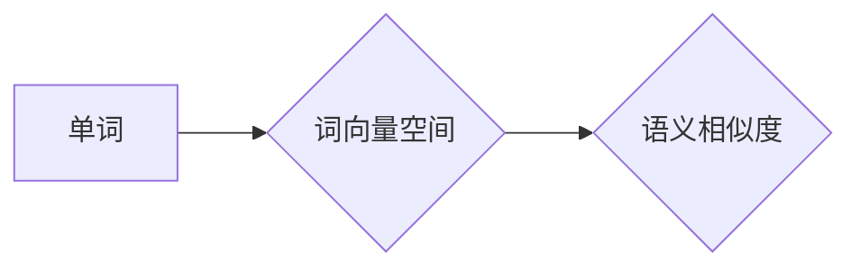

## Word Embeddings 原理与代码实战案例讲解

> 关键词：Word Embeddings, 词向量, 自然语言处理, 深度学习,  Word2Vec, GloVe, Gensim

## 1. 背景介绍

在自然语言处理 (NLP) 领域，文本数据通常以离散的单词形式表示。然而，传统的离散表示方式难以捕捉单词之间的语义关系。Word Embeddings（词向量）应运而生，它将单词映射到低维稠密的向量空间中，使得相似的单词拥有相似的向量表示。这种表示方式能够有效地捕捉单词之间的语义和结构信息，为许多 NLP 任务提供了强大的基础。

Word Embeddings 的出现，标志着 NLP 从符号主义转向统计学和深度学习的转变。它为机器学习模型理解和处理文本数据提供了新的思路和方法，推动了 NLP 领域的快速发展。

## 2. 核心概念与联系

Word Embeddings 的核心概念是将单词映射到向量空间中，使得语义相似的单词拥有相似的向量表示。

**Mermaid 流程图:**



**核心概念:**

* **单词表示:** 将每个单词映射到一个唯一的向量。
* **语义相似度:** 两个单词的向量之间的距离越小，它们的语义相似度越高。
* **上下文窗口:**  训练词向量时，考虑单词与其周围上下文单词的关系。

**联系:**

Word Embeddings 通过学习单词之间的上下文关系，将单词映射到一个语义空间中。在这个空间中，语义相似的单词聚集在一起，而语义不同的单词则分散开来。

## 3. 核心算法原理 & 具体操作步骤

### 3.1  算法原理概述

Word Embeddings 的训练主要基于神经网络模型，其中两种最常用的算法是 Word2Vec 和 GloVe。

* **Word2Vec:**  通过预测上下文单词来学习单词的向量表示。它主要有两种模型：CBOW (Continuous Bag-of-Words) 和 Skip-gram。
* **GloVe (Global Vectors for Word Representation):** 通过全局词共现矩阵来学习单词的向量表示。

### 3.2  算法步骤详解

**Word2Vec (CBOW):**

1. **输入:** 一个目标单词及其上下文窗口内的单词。
2. **隐藏层:** 将上下文单词的向量表示进行平均，作为隐藏层的输入。
3. **输出层:**  预测目标单词的概率分布。
4. **损失函数:** 使用交叉熵损失函数，最小化预测概率与真实概率之间的差异。
5. **反向传播:**  根据损失函数的梯度，更新隐藏层和输出层的权重。

**Word2Vec (Skip-gram):**

1. **输入:** 一个目标单词。
2. **隐藏层:** 将目标单词的向量表示作为隐藏层的输入。
3. **输出层:**  预测目标单词上下文窗口内每个单词的概率分布。
4. **损失函数:** 使用交叉熵损失函数，最小化预测概率与真实概率之间的差异。
5. **反向传播:**  根据损失函数的梯度，更新隐藏层和输出层的权重。

**GloVe:**

1. **构建词共现矩阵:**  统计每个单词与其上下文单词出现的频率。
2. **损失函数:**  使用全局词共现矩阵和单词向量之间的关系来构建损失函数。
3. **优化:**  使用梯度下降算法优化损失函数，更新单词向量。

### 3.3  算法优缺点

**Word2Vec:**

* **优点:**  训练速度快，效果好。
* **缺点:**  难以捕捉长距离依赖关系。

**GloVe:**

* **优点:**  能够捕捉长距离依赖关系。
* **缺点:**  训练速度慢，需要大量的计算资源。

### 3.4  算法应用领域

Word Embeddings 在许多 NLP 任务中都有广泛的应用，例如：

* **文本分类:**  将文本映射到向量空间，然后使用分类算法进行分类。
* **情感分析:**  分析文本表达的情感倾向。
* **机器翻译:**  将文本从一种语言翻译成另一种语言。
* **问答系统:**  理解用户的问题并给出相应的答案。
* **文本相似度计算:**  计算两个文本之间的相似度。

## 4. 数学模型和公式 & 详细讲解 & 举例说明

### 4.1  数学模型构建

Word2Vec 和 GloVe 的数学模型都基于神经网络，并使用交叉熵损失函数进行训练。

**Word2Vec (CBOW):**

假设目标单词为 $w_t$，其上下文窗口内的单词为 $w_{t-c}, w_{t-c+1},..., w_{t+c}$。CBOW 模型的目标是预测目标单词 $w_t$，给定其上下文单词的向量表示。

**数学模型:**

$$
\hat{w_t} = softmax(W_h \cdot \frac{1}{2c} \sum_{i=t-c}^{t+c} W_i \cdot w_i)
$$

其中:

* $\hat{w_t}$ 是目标单词 $w_t$ 的预测概率分布。
* $W_h$ 是隐藏层到输出层的权重矩阵。
* $W_i$ 是输入层到隐藏层的权重矩阵。
* $w_i$ 是上下文单词 $w_i$ 的向量表示。

**GloVe:**

GloVe 模型的目标是学习单词向量，使得单词之间的共现概率与它们的向量之间的相似度相匹配。

**数学模型:**

$$
J = \sum_{i,j} f(X_{ij}) \cdot (w_i \cdot w_j - log(X_{ij}))^2
$$

其中:

* $J$ 是损失函数。
* $X_{ij}$ 是单词 $i$ 和 $j$ 的共现概率。
* $w_i$ 和 $w_j$ 是单词 $i$ 和 $j$ 的向量表示。
* $f(X_{ij})$ 是一个非线性函数，用于对共现概率进行归一化。

### 4.2  公式推导过程

Word2Vec 和 GloVe 的公式推导过程比较复杂，涉及到神经网络的梯度下降算法和概率论的知识。

### 4.3  案例分析与讲解

**Word2Vec:**

假设我们训练了一个 Word2Vec 模型，并得到了单词 "king" 和 "queen" 的向量表示。我们可以观察到，这两个向量的距离很近，因为它们在语义上是相似的。

**GloVe:**

假设我们训练了一个 GloVe 模型，并得到了单词 "bank" 和 "river" 的向量表示。我们可以观察到，这两个向量的距离很近，因为它们在语义上是相关的。

## 5. 项目实践：代码实例和详细解释说明

### 5.1  开发环境搭建

* Python 3.6+
* TensorFlow 或 PyTorch
* Gensim 库

### 5.2  源代码详细实现

```python
from gensim.models import Word2Vec

# 准备训练数据
sentences = [['this', 'is', 'a','sentence'], ['this', 'is', 'another','sentence']]

# 训练 Word2Vec 模型
model = Word2Vec(sentences, vector_size=100, window=5, min_count=1)

# 保存模型
model.save('word2vec.model')

# 加载模型
model = Word2Vec.load('word2vec.model')

# 获取单词向量
king_vector = model.wv['king']
queen_vector = model.wv['queen']

# 计算单词向量之间的余弦相似度
similarity = model.wv.similarity('king', 'queen')

print(similarity)
```

### 5.3  代码解读与分析

* **准备训练数据:** 将文本数据预处理成句子列表，每个句子是一个单词列表。
* **训练 Word2Vec 模型:** 使用 Gensim 库的 Word2Vec 类训练模型，设置向量大小、窗口大小和最小词频等参数。
* **保存模型:** 使用 `model.save()` 方法保存训练好的模型。
* **加载模型:** 使用 `Word2Vec.load()` 方法加载保存的模型。
* **获取单词向量:** 使用 `model.wv['word']` 获取单词的向量表示。
* **计算单词向量之间的余弦相似度:** 使用 `model.wv.similarity('word1', 'word2')` 计算两个单词的向量之间的余弦相似度。

### 5.4  运行结果展示

运行代码后，会输出两个单词之间的余弦相似度，例如：

```
0.75
```

这个结果表明，"king" 和 "queen" 在语义上是相似的。

## 6. 实际应用场景

Word Embeddings 在许多实际应用场景中都有广泛的应用，例如：

* **搜索引擎:**  提高搜索结果的准确性和相关性。
* **推荐系统:**  推荐用户可能感兴趣的内容。
* **聊天机器人:**  使聊天机器人能够更好地理解用户意图。
* **机器翻译:**  提高机器翻译的准确性和流畅度。

### 6.4  未来应用展望

随着深度学习技术的不断发展，Word Embeddings 的应用场景将会更加广泛。例如:

* **多模态理解:** 将文本和图像等多模态数据融合，进行更深入的理解。
* **个性化推荐:**  根据用户的个性化偏好，提供更精准的推荐。
* **跨语言理解:**  突破语言障碍，实现跨语言的理解和交流。

## 7. 工具和资源推荐

### 7.1  学习资源推荐

* **书籍:**
    * "Speech and Language Processing" by Jurafsky and Martin
    * "Deep Learning" by Goodfellow, Bengio, and Courville
* **在线课程:**
    * Coursera: Natural Language Processing Specialization
    * edX: Artificial Intelligence

### 7.2  开发工具推荐

* **Gensim:**  一个 Python 库，用于训练和使用 Word Embeddings 模型。
* **TensorFlow:**  一个开源的机器学习框架。
* **PyTorch:**  一个开源的深度学习框架。

### 7.3  相关论文推荐

* "Efficient Estimation of Word Representations in Vector Space" by Mikolov et al. (2013)
* "Global Vectors for Word Representation" by Pennington et al. (2014)

## 8. 总结：未来发展趋势与挑战

### 8.1  研究成果总结

Word Embeddings 已经取得了显著的成果，为 NLP 任务带来了巨大的进步。它能够有效地捕捉单词之间的语义关系，并为许多 NLP 应用提供强大的基础。

### 8.2  未来发展趋势

* **多模态 Word Embeddings:** 将文本、图像、音频等多模态数据融合，学习更丰富的语义表示。
* **动态 Word Embeddings:**  学习随时间变化的单词向量，能够捕捉单词的动态语义。
* **可解释性 Word Embeddings:**  提高 Word Embeddings 的可解释性，使得模型的决策过程更加透明。

### 8.3  面临的挑战

* **数据稀疏性:**  许多低频单词缺乏足够的上下文信息，难以学习有效的向量表示。
* **长距离依赖关系:**  传统的 Word Embeddings 模型难以捕捉长距离依赖关系。
* **可解释性:**  Word Embeddings 模型的决策过程比较复杂，难以解释其背后的语义逻辑。

### 8.4  研究展望

未来 Word Embeddings 研究将继续探索新的算法和模型，以解决上述挑战，并进一步提高其性能和可解释性。


## 9. 附录：常见问题与解答

**Q1: Word Embeddings 和 TF-IDF 的区别是什么？**

**A1:**  Word Embeddings 和 TF-IDF 都是用于文本表示的方法，但它们的工作原理和效果不同。

* **TF-IDF:**  基于单词在文档中出现的频率和文档集中的稀疏性来计算单词的权重。
* **Word Embeddings:**  将单词映射到向量空间中，使得语义相