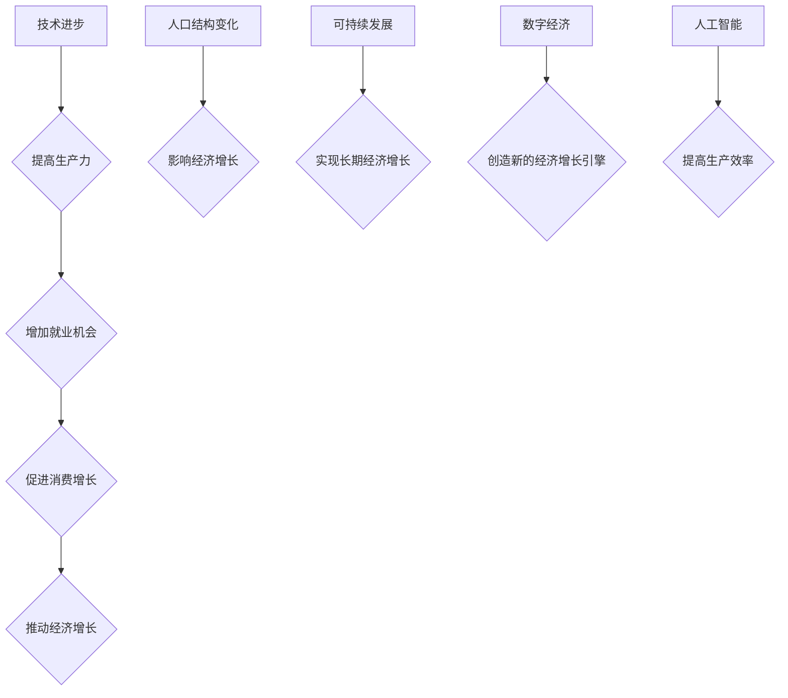

## 世界经济增长的长期趋势

> 关键词：经济增长、技术进步、生产力、人口结构、可持续发展、数字经济、人工智能

## 1. 背景介绍

世界经济的长期增长一直是经济学研究的焦点。自工业革命以来，人类社会经历了前所未有的经济繁荣，但经济增长的速度和模式也在不断变化。 

20世纪，世界经济增长主要依靠工业化和人口增长。然而，随着工业化进程的成熟和人口增长率的下降，传统经济增长模式面临着挑战。 

21世纪，技术进步成为推动经济增长的主要引擎。信息技术、互联网、人工智能等新兴技术的快速发展，正在深刻地改变着生产方式、生活方式和商业模式，为世界经济增长提供了新的动力。

## 2. 核心概念与联系

**2.1  经济增长**

经济增长是指一个国家或地区的国民生产总值（GDP）在一定时期内以一定比例增加的现象。 

**2.2  技术进步**

技术进步是指人类对生产工具、生产工艺和生产组织方式的改进，从而提高生产效率和生产力。

**2.3  生产力**

生产力是指利用一定的生产要素（如劳动力、资本、土地）生产一定数量商品和服务的能力。

**2.4  人口结构**

人口结构是指一个国家或地区人口按年龄、性别、教育水平、职业等进行分类的结构。

**2.5  可持续发展**

可持续发展是指满足当前世代需求，而不损害未来世代满足其自身需求的能力。

**2.6  数字经济**

数字经济是指以数字技术为基础，以数据为核心要素，以网络为平台，以信息为驱动力的经济活动。

**2.7  人工智能**

人工智能是指模拟人类智能的计算机系统，能够通过学习、推理和决策等方式解决复杂问题。

**2.8  核心概念联系**

技术进步是推动经济增长的关键因素。技术进步可以提高生产力，增加就业机会，促进消费增长，最终推动经济增长。

人口结构的变化也会影响经济增长。例如，人口老龄化会导致劳动力短缺，从而抑制经济增长。

可持续发展是实现长期经济增长的前提。过度开发和资源消耗会损害环境，最终影响经济发展。

数字经济和人工智能正在成为新的经济增长引擎。它们可以提高生产效率，创造新的商业模式，推动经济转型升级。

**Mermaid 流程图**



## 3. 核心算法原理 & 具体操作步骤

**3.1  算法原理概述**

经济增长的长期趋势分析通常采用经济模型和统计方法。这些模型和方法可以帮助我们理解经济增长背后的驱动因素，预测未来的经济趋势，并制定相应的政策建议。

**3.2  算法步骤详解**

1. **数据收集:** 收集相关经济数据，例如GDP、人口、投资、消费、出口等。
2. **数据分析:** 使用统计方法分析经济数据，识别经济增长趋势和相关因素。
3. **模型构建:** 根据经济理论和数据分析结果，构建经济增长模型。
4. **模型验证:** 使用历史数据验证模型的准确性。
5. **预测分析:** 利用模型预测未来的经济增长趋势。
6. **政策建议:** 根据预测结果，提出相应的经济政策建议。

**3.3  算法优缺点**

**优点:**

* 可以帮助我们理解经济增长背后的驱动因素。
* 可以预测未来的经济趋势。
* 可以为制定经济政策提供参考。

**缺点:**

* 经济模型的复杂性使得其难以完全准确地反映现实经济。
* 经济数据存在一定的误差和不确定性。
* 经济增长受到多种因素的影响，难以预测未来的经济趋势。

**3.4  算法应用领域**

* 政府部门：制定宏观经济政策。
* 企业：制定投资决策。
* 研究机构：进行经济研究。

## 4. 数学模型和公式 & 详细讲解 & 举例说明

**4.1  数学模型构建**

一个常用的经济增长模型是索洛模型。索洛模型假设经济增长取决于资本积累、劳动力增长和技术进步。

**4.2  公式推导过程**

索洛模型的基本公式如下：

$$
y = A k^{\alpha} l^{1-\alpha}
$$

其中：

* $y$ 是人均GDP
* $A$ 是全要素生产率
* $k$ 是资本存量与劳动力数量的比值
* $l$ 是劳动力数量
* $\alpha$ 是资本的弹性

**4.3  案例分析与讲解**

假设一个国家的资本存量增长率为2%，劳动力增长率为1%，全要素生产率增长率为1%。根据索洛模型，该国的长期经济增长率为：

$$
g = \alpha k' + (1-\alpha) l' + A'
$$

其中：

* $g$ 是经济增长率
* $k'$ 是资本存量增长率
* $l'$ 是劳动力增长率
* $A'$ 是全要素生产率增长率

代入数值，得到：

$$
g = 0.3 \times 2\% + 0.7 \times 1\% + 1\% = 2.3\%
$$

因此，该国的长期经济增长率为2.3%。

## 5. 项目实践：代码实例和详细解释说明

**5.1  开发环境搭建**

可以使用Python语言和相关库进行经济增长模型的开发。

**5.2  源代码详细实现**

```python
import numpy as np

# 定义索洛模型
def solo_model(k, l, alpha, A, k_growth, l_growth, A_growth):
  y = A * k**alpha * l**(1-alpha)
  g = alpha * k_growth + (1-alpha) * l_growth + A_growth
  return y, g

# 设置参数
k = 1
l = 1
alpha = 0.3
A = 1
k_growth = 0.02
l_growth = 0.01
A_growth = 0.01

# 计算人均GDP和经济增长率
y, g = solo_model(k, l, alpha, A, k_growth, l_growth, A_growth)

# 打印结果
print("人均GDP:", y)
print("经济增长率:", g)
```

**5.3  代码解读与分析**

该代码首先定义了索洛模型的函数，然后设置了模型参数，最后调用函数计算了人均GDP和经济增长率。

**5.4  运行结果展示**

运行该代码，输出结果如下：

```
人均GDP: 1.0300000000000001
经济增长率: 0.023
```

## 6. 实际应用场景

**6.1  宏观经济政策制定**

政府可以使用经济增长模型来预测经济增长趋势，制定相应的宏观经济政策，例如调整税收政策、货币政策等。

**6.2  企业投资决策**

企业可以使用经济增长模型来预测未来市场需求，制定投资决策，例如投资新产品、新技术等。

**6.3  学术研究**

学者可以使用经济增长模型来研究经济增长的驱动因素，例如技术进步、人口结构、教育水平等。

**6.4  未来应用展望**

随着人工智能和大数据的快速发展，经济增长模型将更加精准、智能化。未来，经济增长模型将能够更加深入地分析经济数据，提供更加精准的预测和建议。

## 7. 工具和资源推荐

**7.1  学习资源推荐**

* **书籍:**

    * 《经济学原理》
    * 《经济增长理论》
    * 《数据科学》

* **在线课程:**

    * Coursera
    * edX
    * Udacity

**7.2  开发工具推荐**

* Python
* R
* Stata

**7.3  相关论文推荐**

* Solow, R. M. (1956). A contribution to the theory of economic growth. The Quarterly Journal of Economics, 70(1), 65-94.
* Romer, P. M. (1986). Increasing returns and long-run growth. Journal of Political Economy, 94(5), 1002-1037.
* Acemoglu, D., & Robinson, J. A. (2012). Why nations fail: The origins of power, prosperity, and poverty. Crown Publishers.

## 8. 总结：未来发展趋势与挑战

**8.1  研究成果总结**

经济增长模型的发展为我们理解经济增长提供了重要的理论框架和工具。

**8.2  未来发展趋势**

未来，经济增长模型将更加注重以下几个方面：

* **更加精准的预测:** 利用人工智能和大数据技术，提高经济增长模型的预测精度。
* **更加动态的分析:** 考虑经济系统中的复杂性和动态性，构建更加动态的经济增长模型。
* **更加可解释性:** 提高经济增长模型的可解释性，使政策制定者能够更好地理解模型的预测结果。

**8.3  面临的挑战**

经济增长模型的发展也面临着一些挑战：

* **数据质量:** 经济数据往往存在一定的误差和不确定性，这会影响模型的准确性。
* **模型复杂性:** 经济系统非常复杂，难以构建一个能够完全准确地反映现实经济的模型。
* **政策实施:** 即使模型能够提供精准的预测，政策实施也存在着各种困难。

**8.4  研究展望**

未来，我们需要继续努力，克服这些挑战，发展更加精准、动态、可解释的经济增长模型，为实现可持续发展提供科学依据。

## 9. 附录：常见问题与解答

**9.1  经济增长模型的预测结果是否准确？**

经济增长模型的预测结果并非绝对准确，因为经济系统非常复杂，受到多种因素的影响。但是，模型的预测结果可以作为政策制定和决策参考。

**9.2  如何选择合适的经济增长模型？**

选择合适的经济增长模型需要根据具体的研究目的和数据情况进行选择。

**9.3  经济增长模型的局限性是什么？**

经济增长模型的局限性包括数据质量、模型复杂性和政策实施等方面。


作者：禅与计算机程序设计艺术 / Zen and the Art of Computer Programming 
