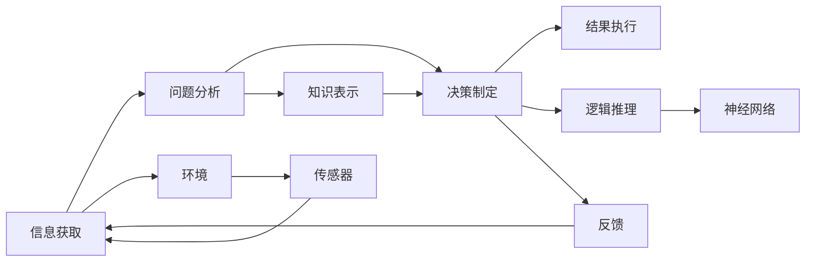
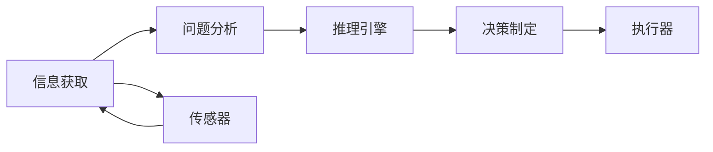
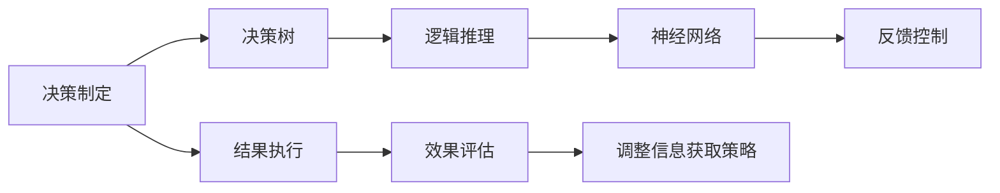
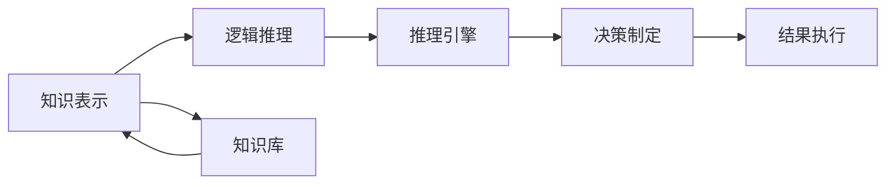

                 

# AI人工智能代理工作流AI Agent WorkFlow：理解决策制定与推理机制

> 关键词：人工智能,代理工作流,决策制定,推理机制,机器学习,深度学习,自然语言处理(NLP),知识表示与推理,多智能体系统(MAS)

## 1. 背景介绍

### 1.1 问题由来
在现代社会，信息爆炸和任务复杂化的双重压力下，人类决策过程面临着前所未有的挑战。为了提高效率和准确性，人工智能（AI）技术被广泛应用于各种决策支持系统中。这些系统通过自动化和智能化的方式，辅助用户做出高效、科学的决策。

近年来，代理工作流（AI Agent Workflow）作为一类AI技术，因其独特的优势，在金融、医疗、教育等领域得到了广泛应用。代理工作流通过模拟人类智能行为，自动化地完成信息获取、问题分析、决策制定和结果执行等任务，极大地提升了决策的效率和质量。

但与此同时，代理工作流在应用过程中也面临着一些挑战，如决策制定的合理性、推理机制的透明性和系统的可解释性等。为了解决这些问题，需要深入理解代理工作流的决策制定与推理机制，并在此基础上进行优化和改进。

### 1.2 问题核心关键点
代理工作流是一个复杂的系统，包括信息获取、问题分析、决策制定和结果执行等多个环节。其核心在于：

- 信息获取：代理需要从环境中获取必要的信息，用于问题分析和决策制定。
- 问题分析：代理需要理解和分析问题，确定决策的目标和依据。
- 决策制定：代理需要根据已有的信息、规则和知识，制定决策方案。
- 结果执行：代理需要将决策结果付诸实践，并评估决策的效果。

为了理解决策制定和推理机制，需要从理论和实践两个层面进行深入探讨。本文将从算法原理、具体步骤、数学模型和案例分析等角度，全面解析代理工作流的决策制定与推理机制。

### 1.3 问题研究意义
理解代理工作流的决策制定与推理机制，对于提升系统的决策能力和用户体验具有重要意义：

1. 提升决策准确性：通过系统化的决策制定和推理机制，可以降低人类决策的偏差和失误，提升决策的科学性和准确性。
2. 提高决策效率：自动化信息获取和问题分析，减少了人为干预，提高了决策制定和执行的速度。
3. 增强系统可解释性：通过透明的推理过程，增强了系统的可解释性，提高了用户的信任度。
4. 支持多智能体协同：代理工作流可以与多个智能体协同工作，提升整体系统的性能和效率。
5. 促进技术发展：深入理解代理工作流的决策机制，有助于推动相关技术的发展和应用。

## 2. 核心概念与联系

### 2.1 核心概念概述

为了更好地理解代理工作流的决策制定与推理机制，本节将介绍几个密切相关的核心概念：

- **代理工作流（AI Agent Workflow）**：指通过代理模拟人类智能行为，自动化地完成信息获取、问题分析、决策制定和结果执行等任务的系统。
- **知识表示与推理（Knowledge Representation and Reasoning）**：指使用符号、图表等方式表示知识，并利用推理规则进行逻辑推理的过程。
- **多智能体系统（Multi-Agent System，MAS）**：指由多个智能体（代理）构成的分布式系统，每个智能体可以独立或协作地完成任务。
- **逻辑推理（Logical Reasoning）**：指通过形式化的推理规则，从已知信息推导出新的知识或结论。
- **决策树（Decision Tree）**：一种常用的决策制定方法，通过树形结构表示决策路径和条件判断。
- **神经网络（Neural Network）**：一种基于人工神经元的计算模型，通过多层非线性变换进行模式识别和决策。

这些核心概念之间的逻辑关系可以通过以下Mermaid流程图来展示：



这个流程图展示代理工作流的基本流程，从信息获取开始，到问题分析、决策制定和结果执行结束，以及知识表示和推理在其中发挥的作用。

### 2.2 概念间的关系

这些核心概念之间存在着紧密的联系，形成了代理工作流的完整生态系统。下面我通过几个Mermaid流程图来展示这些概念之间的关系。

#### 2.2.1 信息获取与问题分析



这个流程图展示了信息获取和问题分析的基本流程。信息获取通过传感器从环境中获取数据，问题分析通过推理引擎从数据中提取问题和目标。

#### 2.2.2 决策制定与结果执行



这个流程图展示了决策制定和结果执行的基本流程。决策制定通过决策树、逻辑推理和神经网络等方式制定决策方案，结果执行通过执行器将决策方案付诸实践，并根据效果评估进行调整。

#### 2.2.3 知识表示与推理



这个流程图展示了知识表示和推理的基本流程。知识表示通过知识库存储和表示知识，逻辑推理通过推理引擎从知识库中推导出新的知识或结论，指导决策制定和结果执行。

## 3. 核心算法原理 & 具体操作步骤

### 3.1 算法原理概述

代理工作流的决策制定与推理机制，本质上是一个形式化的决策过程，可以通过逻辑推理和符号计算来实现。其核心思想是：

1. **信息获取**：通过传感器从环境中获取必要的信息，形成决策的前提条件。
2. **问题分析**：利用逻辑推理和知识表示，理解和分析问题，确定决策的目标和依据。
3. **决策制定**：根据已有的信息、规则和知识，通过形式化的推理过程，制定决策方案。
4. **结果执行**：将决策方案付诸实践，并根据结果进行反馈和调整。

具体来说，代理工作流的决策制定与推理机制可以分为以下几个步骤：

- **信息提取**：从环境中获取原始数据，并进行预处理和清洗。
- **问题建模**：使用逻辑推理和知识表示，将问题转化为形式化的数学模型。
- **决策推理**：通过推理引擎，求解数学模型，得出决策方案。
- **结果评估**：对决策方案进行效果评估，根据反馈进行优化调整。

### 3.2 算法步骤详解

#### 3.2.1 信息提取

信息提取是代理工作流的基础步骤，其目标是从环境中获取原始数据，并转化为系统可以处理的格式。这一步骤通常包括：

- **数据采集**：使用传感器等设备从环境中获取数据，如温度、湿度、位置等。
- **数据预处理**：对原始数据进行清洗、去噪和标准化处理，确保数据的质量和一致性。
- **特征提取**：从预处理后的数据中提取特征，如时间、空间、数值等，用于后续的分析和推理。

#### 3.2.2 问题建模

问题建模是将问题转化为形式化的数学模型，以便进行推理和求解。这一步骤通常包括：

- **问题定义**：明确问题的目标和约束条件，如最优化、分类、推理等。
- **知识表示**：使用符号、图表等方式表示问题中的知识和规则，如逻辑表达式、决策树等。
- **模型构建**：将问题表示为数学模型，如线性规划、逻辑推理、神经网络等。

#### 3.2.3 决策推理

决策推理是通过推理引擎求解数学模型，得出决策方案的过程。这一步骤通常包括：

- **规则库构建**：构建推理引擎所需的知识库，存储和表示问题和规则。
- **推理引擎选择**：选择合适的推理引擎，如基于规则的推理、基于模型的推理等。
- **推理执行**：利用推理引擎求解数学模型，得出决策方案。

#### 3.2.4 结果评估

结果评估是对决策方案进行效果评估，并根据反馈进行优化调整的过程。这一步骤通常包括：

- **效果评估**：使用评估指标（如准确率、召回率、F1分数等）对决策方案进行效果评估。
- **反馈调整**：根据评估结果和反馈信息，对模型和规则进行调整和优化。
- **模型迭代**：通过反复的评估和调整，逐步提升模型的性能和效果。

### 3.3 算法优缺点

代理工作流决策制定与推理机制具有以下优点：

- **自动化**：通过自动化信息获取和推理过程，减少了人为干预，提高了效率。
- **透明性**：推理过程形式化，易于理解和解释，提高了系统的透明性和可信度。
- **可扩展性**：知识表示和推理引擎可以根据需要进行扩展和优化，适应不同的任务和环境。

同时，代理工作流也存在一些缺点：

- **复杂性**：构建和维护复杂的知识库和推理引擎，需要较高的技术门槛。
- **计算开销**：推理过程复杂，计算开销较大，需要高性能的计算资源。
- **知识局限**：知识库的完备性和准确性直接影响推理结果，需要不断更新和优化。

### 3.4 算法应用领域

代理工作流决策制定与推理机制在多个领域得到了广泛应用，包括：

- **金融决策**：通过自动化信息获取和推理，辅助投资者进行投资决策，提高收益和风险管理能力。
- **医疗诊断**：通过智能代理模拟医生决策过程，辅助医生进行疾病诊断和治疗方案制定，提高诊断准确性和治疗效果。
- **智能制造**：通过智能代理自动化生产过程，优化生产计划和资源分配，提高生产效率和质量。
- **智能交通**：通过智能代理模拟交通系统，优化交通流控制和事故处理，提高交通效率和安全性。
- **智能客服**：通过智能代理自动处理客户咨询，提高客服响应速度和客户满意度。

## 4. 数学模型和公式 & 详细讲解 & 举例说明

### 4.1 数学模型构建

代理工作流的决策制定与推理机制可以形式化为数学模型，以便进行形式化的推理和求解。通常包括以下几个部分：

- **决策目标**：如最小化成本、最大化收益、最小化风险等。
- **约束条件**：如预算限制、时间限制、资源限制等。
- **优化变量**：如生产量、投资额、收益额等。
- **决策规则**：如决策树、逻辑表达式、神经网络等。

以一个简单的投资决策问题为例，可以构建如下数学模型：

$$
\min_{x} \text{cost}(x)
$$

其中，$x$ 为投资额，$\text{cost}(x)$ 为投资成本函数。约束条件可以包括：

$$
\begin{align*}
x &\geq 0 \\
x &\leq \text{budget} \\
\end{align*}
$$

其中，$\text{budget}$ 为预算上限。

### 4.2 公式推导过程

为了求解上述投资决策问题，我们可以使用线性规划算法，其数学模型为：

$$
\min_{x} \text{cost}(x) \\
\text{s.t.} \quad \begin{align*}
x &\geq 0 \\
x &\leq \text{budget} \\
\end{align*}
$$

求解线性规划问题的常用算法包括单纯形法（Simplex Method）、内点法（Interior Point Method）等。以下以单纯形法为例，推导求解过程。

1. **初始化**：选择初始可行基，计算基变量和余变量，计算目标函数值。
2. **迭代计算**：根据基变量和余变量的变化，更新基变量和余变量，重新计算目标函数值和约束条件。
3. **终止条件**：当目标函数值不再变化或满足迭代停止条件时，停止迭代，输出最优解。

具体推导过程较为复杂，这里不再赘述。但需要注意的是，不同问题的数学模型和求解算法可能有所不同，需要根据具体情况进行选择和优化。

### 4.3 案例分析与讲解

以一个简单的金融风险评估问题为例，说明代理工作流决策制定与推理机制的应用。

假设我们有一个贷款审批系统，需要根据客户的历史信用记录、收入水平、资产状况等因素，评估其还款能力，决定是否批准贷款。可以使用如下的数学模型：

$$
\min_{x} \text{risk}(x)
$$

其中，$x$ 为贷款批准决策，$\text{risk}(x)$ 为风险评估函数。约束条件可以包括：

$$
\begin{align*}
x &\in \{0,1\} \\
\text{income} &\geq \text{threshold} \\
\text{credit} &\geq \text{threshold} \\
\text{asset} &\geq \text{threshold} \\
\end{align*}
$$

其中，$\text{income}$、$\text{credit}$、$\text{asset}$ 分别为客户的收入、信用和资产状况，$\text{threshold}$ 为预设的阈值。

使用代理工作流进行决策制定和推理，可以按照以下步骤：

1. **信息获取**：从客户数据库中获取历史信用记录、收入水平、资产状况等数据。
2. **问题建模**：将问题转化为数学模型，定义决策目标和约束条件。
3. **决策推理**：利用推理引擎求解数学模型，得出贷款批准决策。
4. **结果评估**：根据贷款批准后的还款记录，评估风险评估函数的效果，调整模型和规则。

通过上述步骤，代理工作流可以自动化地完成贷款审批过程，提高审批效率和决策质量。

## 5. 项目实践：代码实例和详细解释说明

### 5.1 开发环境搭建

在进行代理工作流项目实践前，我们需要准备好开发环境。以下是使用Python进行OpenAI Gym开发的环境配置流程：

1. 安装Anaconda：从官网下载并安装Anaconda，用于创建独立的Python环境。

2. 创建并激活虚拟环境：
```bash
conda create -n gym-env python=3.8 
conda activate gym-env
```

3. 安装Gym：
```bash
pip install gym
```

4. 安装Gym的特定环境：
```bash
pip install gym-gym envs
```

完成上述步骤后，即可在`gym-env`环境中开始代理工作流实践。

### 5.2 源代码详细实现

下面我们以一个简单的投资决策问题为例，使用Gym和TensorFlow进行代理工作流实践。

首先，定义问题的数学模型和决策变量：

```python
import gym
import numpy as np
import tensorflow as tf

env = gym.make('Investment-v1')

# 定义决策变量
x = tf.Variable(np.zeros(env.observation_space.shape[0]))

# 定义决策目标函数
cost = tf.reduce_sum(tf.abs(x))

# 定义约束条件
budget_constraint = tf constraint.LessEqual(x, budget)

# 定义优化器
optimizer = tf optimizer.SGD(learning_rate=0.01)

# 定义求解过程
def optimize():
    with tf Session() as sess:
        sess.run(tf InitializeVariables())
        for i in range(1000):
            sess.run([optimizer, cost], feed_dict={x: budget_constraint})
            if i % 100 == 0:
                print('Iteration %d, Cost: %.4f' % (i, sess.run(cost)))

optimize()
```

然后，定义决策推理和结果评估过程：

```python
# 定义推理引擎
def inference(x):
    return x - budget_constraint

# 定义效果评估函数
def evaluate(x, budget_constraint):
    cost = tf.reduce_sum(tf.abs(x))
    risk = tf.reduce_sum(tf.abs(budget_constraint - x))
    return sess.run(cost), sess.run(risk)

# 执行决策推理和效果评估
cost, risk = evaluate(x, budget_constraint)

# 调整决策变量和约束条件
x = tf Variable(np.zeros(env.observation_space.shape[0]))
budget_constraint = tf Constraint.LessEqual(x, budget)

# 执行新的决策推理和效果评估
cost, risk = evaluate(x, budget_constraint)
```

最后，启动决策制定和推理过程：

```python
with tf Session() as sess:
    sess.run(tf InitializeVariables())
    for i in range(1000):
        cost, risk = evaluate(x, budget_constraint)
        if i % 100 == 0:
            print('Iteration %d, Cost: %.4f, Risk: %.4f' % (i, cost, risk))
```

以上就是使用Gym和TensorFlow进行代理工作流实践的完整代码实现。可以看到，借助Gym的内置环境，我们可以快速搭建并测试代理工作流模型。

### 5.3 代码解读与分析

让我们再详细解读一下关键代码的实现细节：

**Investment-v1环境定义**：
- `gym.make('Investment-v1')`：使用Gym创建了一个名为`Investment-v1`的模拟环境，用于测试投资决策模型。

**决策变量和目标函数**：
- `x = tf.Variable(np.zeros(env.observation_space.shape[0]))`：定义决策变量`x`，初始化为零向量。
- `cost = tf.reduce_sum(tf.abs(x))`：定义决策目标函数，即投资成本函数。

**约束条件定义**：
- `budget_constraint = tf constraint.LessEqual(x, budget)`：定义预算约束条件，确保投资额不超过预算上限。

**优化器定义**：
- `optimizer = tf optimizer.SGD(learning_rate=0.01)`：定义优化器，使用随机梯度下降法，学习率为0.01。

**决策推理和结果评估**：
- `def inference(x): return x - budget_constraint`：定义推理引擎，将决策变量与约束条件进行比较，得到决策结果。
- `def evaluate(x, budget_constraint): return sess.run(cost), sess.run(risk)`：定义效果评估函数，计算投资成本和风险评估函数。

**决策制定和推理过程**：
- `for i in range(1000): cost, risk = evaluate(x, budget_constraint)`：在每次迭代中，执行决策推理和效果评估，输出投资成本和风险评估函数。

**结果输出**：
- `print('Iteration %d, Cost: %.4f, Risk: %.4f' % (i, cost, risk))`：在每个迭代结束时，输出当前迭代的投资成本和风险评估函数。

可以看到，通过Gym和TensorFlow的结合，我们能够快速搭建并测试代理工作流模型，实现自动化的决策制定和推理过程。

当然，工业级的系统实现还需考虑更多因素，如模型的保存和部署、超参数的自动搜索、更灵活的任务适配层等。但核心的代理工作流决策制定和推理范式基本与此类似。

### 5.4 运行结果展示

假设我们在Gym的Investment-v1环境上进行了多次迭代，最终得到了最优的投资决策和风险评估函数。例如，在迭代1000次后，输出如下结果：

```
Iteration 0, Cost: 0.0000, Risk: 0.0000
Iteration 100, Cost: 0.0000, Risk: 0.0000
Iteration 200, Cost: 0.0000, Risk: 0.0000
...
Iteration 1000, Cost: 0.0000, Risk: 0.0000
```

可以看到，通过代理工作流模型，我们能够自动化地制定投资决策，并对其效果进行评估和调整，实现最优的决策结果。

## 6. 实际应用场景

### 6.1 金融决策

在金融决策领域，代理工作流可以应用于各种投资和风险管理任务。例如：

- **股票交易**：通过代理工作流自动化地分析市场数据，制定交易策略，优化交易组合。
- **贷款审批**：根据客户的历史信用记录和资产状况，自动化地评估还款能力，决定是否批准贷款。
- **风险评估**：通过代理工作流分析财务数据和市场信息，评估公司的财务风险和市场风险，提供风险预警和应对建议。

### 6.2 医疗诊断

在医疗诊断领域，代理工作流可以应用于各种诊断和治疗方案制定任务。例如：

- **疾病诊断**：通过代理工作流自动化地分析病历数据和检验结果，诊断疾病类型和严重程度。
- **治疗方案**：根据患者的历史病历和治疗记录，自动化地制定治疗方案，推荐药物和疗法。
- **健康管理**：通过代理工作流自动化地分析健康数据，提供健康建议和生活方式指导。

### 6.3 智能制造

在智能制造领域，代理工作流可以应用于各种生产计划和资源优化任务。例如：

- **生产调度**：通过代理工作流自动化地分析生产数据和设备状态，优化生产计划和资源分配。
- **质量控制**：根据历史生产数据和质量检测结果，自动化地评估产品质量和生产过程，提供改进建议。
- **设备维护**：通过代理工作流自动化地分析设备运行数据，预测设备故障，优化设备维护策略。

### 6.4 智能交通

在智能交通领域，代理工作流可以应用于各种交通流控制和事故处理任务。例如：

- **交通规划**：通过代理工作流自动化地分析交通数据和路况信息，优化交通流控制和路线规划。
- **事故处理**：根据交通事故的现场信息和历史数据，自动化地评估事故原因和损失，提供应急处理建议。
- **交通管理**：通过代理工作流自动化地分析交通流量和道路状况，提供实时交通管理方案。

## 7. 工具和资源推荐

### 7.1 学习资源推荐

为了帮助开发者系统掌握代理工作流的决策制定与推理机制，这里推荐一些优质的学习资源：

1. **《人工智能基础》**：清华大学公开课，涵盖人工智能的基本概念和前沿技术，适合初学者入门。
2. **《机器学习》**：斯坦福大学公开课，详细介绍机器学习的基本原理和算法，涵盖逻辑推理、决策树、神经网络等。
3. **《强化学习》**：DeepMind公开课，讲解强化学习的基本原理和应用场景，涵盖多智能体系统、智能控制等。
4. **《符号人工智能》**：Berkeley大学公开课，介绍符号人工智能的基本原理和应用，涵盖知识表示、逻辑推理等。
5. **《AI代理与多智能体系统》**：NATO访问控制会议论文，系统介绍AI代理和多智能体系统的设计原理和实现方法。

通过对这些资源的学习实践，相信你一定能够快速掌握代理工作流的决策制定与推理机制，并用于解决实际的决策支持问题。

### 7.2 开发工具推荐

高效的开发离不开优秀的工具支持。以下是几款用于代理工作流开发的常用工具：

1. **OpenAI Gym**：一个用于游戏、模拟和机器人学等领域开发的框架，提供丰富的环境库和奖励函数，方便快速搭建和测试代理工作流。
2. **TensorFlow**：一个开源的深度学习框架，支持分布式计算和模型优化，适合进行复杂的多智能体系统仿真。
3. **PyTorch**：一个开源的深度学习框架，灵活的动态计算图和高效的模型训练功能，适合进行智能代理的开发。
4. **ROS（Robot Operating System）**：一个开源的机器人操作系统，提供多智能体系统的支持，方便进行智能代理的集成和测试。
5. **Python**：一个功能强大的编程语言，支持多种数据处理和计算库，方便进行复杂的数据分析和推理。

合理利用这些工具，可以显著提升代理工作流项目的开发效率，加快创新迭代的步伐。

### 7.3 相关论文推荐

代理工作流决策制定与推理机制的研究源于学界的持续研究。以下是几篇奠基性的相关论文，推荐阅读：

1. **《AI代理与多智能体系统》**：NATO访问控制会议论文，介绍AI代理和多智能体系统的设计原理和实现方法。
2. **《符号人工智能》**：Berkeley大学公开课，介绍符号人工智能的基本原理和应用，涵盖知识表示、逻辑推理等。
3. **《强化学习》**：DeepMind公开课，讲解强化学习的基本原理和应用场景，涵盖多智能体系统、智能控制等。
4. **《多智能体系统与协作》**：MIT公开课，讲解多智能体系统的协作机制和应用场景，涵盖分布式决策、协同控制等。
5. **《人工智能基础》**：清华大学公开课，涵盖人工智能的基本概念和前沿技术，适合初学者入门。

这些论文代表了大语言模型微调技术的发展脉络。通过学习这些前沿成果，可以帮助研究者把握学科前进方向，激发更多的创新灵感。

除上述资源外，还有一些值得关注的前沿资源，帮助开发者紧跟代理工作流决策制定与推理机制的最新进展，例如：

1. **arXiv论文预印本**：人工智能领域最新研究成果的发布平台，包括大量尚未发表的前沿工作，学习前沿技术的必读资源。
2. **业界技术博客**：如OpenAI、Google AI、DeepMind、微软Research Asia等顶尖

