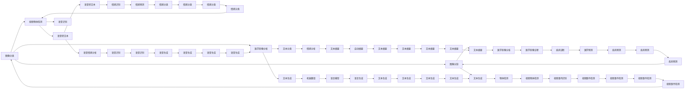

                 

# AI人工智能深度学习算法：在实时估计中的应用

> 关键词：实时估计,深度学习算法,卷积神经网络(CNN),循环神经网络(RNN),长短时记忆网络(LSTM),变分自编码器(VAE),生成对抗网络(GAN),深度学习库,机器学习,大数据

## 1. 背景介绍

### 1.1 问题由来
在人工智能和大数据时代，实时估计成为了众多应用领域的关键需求。无论是自动驾驶、智能监控、金融交易，还是医学诊断，实时估计都能提供快速、准确的决策支持。实时估计技术基于先进的深度学习算法，能够在极短的时间内处理大量数据，并快速输出估计结果。然而，在实际应用中，如何选择合适的算法、优化算法性能，同时兼顾计算效率和可解释性，是一个复杂且重要的课题。

### 1.2 问题核心关键点
实时估计的核心在于利用深度学习算法，在给定输入数据的情况下，快速计算出预测值或估计值。其主要难点包括：
- 选择合适的深度学习算法。不同的算法适用于不同的任务和数据特征，需要根据具体应用场景进行选择。
- 优化算法性能。包括设置合适的超参数、选择正则化方法、应用迁移学习等，以提升模型泛化能力。
- 保证计算效率。实时估计需要高效的算法和数据结构支持，以处理海量数据并快速输出结果。
- 确保结果可解释性。实时估计的应用通常需要解释输出结果，以便用户理解和信任算法决策。

### 1.3 问题研究意义
实时估计技术在众多领域的应用，不仅提升了数据处理和决策的效率，还为自动化、智能化提供了强有力的支持。其研究意义包括：
- 提升应用效率。实时估计能够快速处理海量数据，及时反馈决策结果，满足实际应用的需求。
- 降低运营成本。自动化、智能化的实时估计可以替代部分人工操作，节省人力和时间成本。
- 增强决策科学性。基于深度学习算法的实时估计可以更准确地理解数据内在关系，为决策提供科学依据。
- 推动技术创新。实时估计技术的发展催生了新的算法和应用，促进了人工智能领域的创新。

## 2. 核心概念与联系

### 2.1 核心概念概述
实时估计技术的核心在于利用深度学习算法，在给定输入数据的情况下，快速计算出预测值或估计值。其中涉及的关键概念包括：

- 卷积神经网络（Convolutional Neural Network, CNN）：用于处理图像、语音等二维/三维数据的深度学习算法，具有强大的特征提取能力。
- 循环神经网络（Recurrent Neural Network, RNN）：用于处理序列数据的深度学习算法，能够捕捉时间依赖性。
- 长短时记忆网络（Long Short-Term Memory, LSTM）：一种特殊的RNN，能够有效处理长期依赖关系，适用于自然语言处理等序列数据。
- 变分自编码器（Variational Autoencoder, VAE）：一种生成模型，用于生成高质量的数据表示，常用于数据降维和生成新数据。
- 生成对抗网络（Generative Adversarial Network, GAN）：一种生成模型，能够学习数据的分布，并生成逼真的新数据。
- 深度学习库：如TensorFlow、PyTorch等，提供高效的深度学习算法实现和优化支持。
- 机器学习：利用数据训练模型，并应用模型进行预测或估计。
- 大数据：处理和分析海量数据，以提取有价值的信息。

这些核心概念通过深度学习算法和实际应用场景紧密联系在一起，共同构成了实时估计技术的框架。

### 2.2 概念间的关系

这些核心概念之间的关系可以通过以下Mermaid流程图来展示：



这个流程图展示了各个核心概念在实时估计技术中的应用场景，以及它们之间的联系。

## 3. 核心算法原理 & 具体操作步骤
### 3.1 算法原理概述

实时估计的核心算法原理基于深度学习算法，通过对数据进行训练和优化，建立预测模型，以实现快速、准确的数据估计。以下详细介绍几个典型的深度学习算法及其原理。

- 卷积神经网络（CNN）：用于处理图像、语音等二维/三维数据的深度学习算法，通过卷积、池化等操作提取特征，并通过全连接层进行分类或回归。
- 循环神经网络（RNN）：用于处理序列数据的深度学习算法，通过循环结构捕捉时间依赖性，常用于自然语言处理、语音识别等序列数据处理任务。
- 长短时记忆网络（LSTM）：一种特殊的RNN，通过门控机制解决长期依赖问题，适用于处理长序列数据，如自然语言处理。
- 变分自编码器（VAE）：一种生成模型，通过编码器和解码器将输入数据映射到潜在空间，并从中生成新数据，常用于数据降维和生成新数据。
- 生成对抗网络（GAN）：一种生成模型，通过两个神经网络（生成器和判别器）相互博弈，生成逼真的新数据，常用于图像生成、数据增强等任务。

### 3.2 算法步骤详解

实时估计的具体操作步骤一般包括以下几个关键步骤：

1. **数据准备**：收集和处理输入数据，如预处理、归一化、数据增强等，以适应算法的输入要求。
2. **模型选择**：根据任务类型和数据特征，选择合适的深度学习算法，如CNN、RNN、LSTM、VAE、GAN等。
3. **模型训练**：使用训练数据集对模型进行训练，调整模型参数以最小化损失函数。
4. **模型评估**：使用验证数据集对训练好的模型进行评估，选择最佳模型。
5. **模型部署**：将训练好的模型部署到生产环境中，进行实时数据估计。
6. **结果输出**：根据实际应用需求，输出模型预测结果或估计值，并反馈给用户。

### 3.3 算法优缺点

实时估计算法的主要优点包括：
- 处理速度快。深度学习算法通过高效的并行计算，能够在极短时间内处理大量数据。
- 模型泛化能力强。深度学习算法能够学习复杂的数据分布，具有较强的泛化能力。
- 应用广泛。深度学习算法适用于多种任务，如图像分类、语音识别、自然语言处理等。

其主要缺点包括：
- 计算资源需求高。深度学习算法需要大量的计算资源和存储空间，对硬件设备要求较高。
- 模型复杂度大。深度学习模型通常包含大量参数，训练过程复杂，容易过拟合。
- 结果可解释性差。深度学习模型通常是"黑盒"系统，难以解释其内部工作机制和决策逻辑。

### 3.4 算法应用领域

实时估计算法在多个领域都有广泛应用，包括但不限于：

- 自动驾驶：用于处理传感器数据，实现实时定位、路径规划和障碍检测等功能。
- 智能监控：用于实时分析和处理监控视频，识别异常行为或事件。
- 金融交易：用于实时分析和预测股票价格、市场趋势等，辅助投资决策。
- 医学诊断：用于处理医学影像数据，进行疾病预测和诊断。
- 语音识别：用于实时转录和理解语音内容，支持智能对话和语音搜索。
- 自然语言处理：用于实时文本分类、情感分析、机器翻译等任务，支持智能客服、智能问答等应用。

## 4. 数学模型和公式 & 详细讲解  
### 4.1 数学模型构建

实时估计的数学模型通常包括输入数据、目标函数和优化方法三个部分。

- **输入数据**：表示为输入变量 $x$，可以是图像、语音、文本等形式。
- **目标函数**：表示为损失函数 $L$，用于衡量模型输出与真实标签之间的差异。
- **优化方法**：表示为优化器 $O$，用于调整模型参数，最小化损失函数。

形式化地，实时估计的数学模型可以表示为：

$$
\min_{\theta} L(f_{\theta}(x), y)
$$

其中 $f_{\theta}(x)$ 表示输入数据 $x$ 通过模型 $f$ 的映射，$\theta$ 表示模型参数，$y$ 表示真实标签。

### 4.2 公式推导过程

以卷积神经网络（CNN）为例，推导其基本结构。

卷积神经网络通常包含卷积层、池化层、全连接层等，其基本结构如图1所示。

图1: 卷积神经网络的基本结构

卷积层通过卷积核提取输入数据的空间特征，池化层通过下采样操作减小特征图尺寸，全连接层将特征图映射到输出空间。

卷积层的数学表达式为：

$$
\begin{aligned}
f_{\theta}(x) &= h_{\theta}(W_{conv} * x + b_{conv}) \\
&= \max_{i,j} \left( \sum_{k,l} w_{k,l} x_{i-k,j-l} + b_{conv} \right)_{+}
\end{aligned}
$$

其中 $W_{conv}$ 表示卷积核，$b_{conv}$ 表示偏置项，$*$ 表示卷积操作，$h_{\theta}$ 表示激活函数，$w_{k,l}$ 表示卷积核权重。

池化层的数学表达式为：

$$
f_{\theta}(x) = \max_{i,j} \left( \sum_{k,l} w_{k,l} h_{\theta}(x_{i-k,j-l}) + b_{pool} \right)_{+}
$$

其中 $w_{k,l}$ 表示池化核权重，$b_{pool}$ 表示偏置项。

全连接层的数学表达式为：

$$
f_{\theta}(x) = \sum_{i} w_i h_{\theta}(x_i) + b
$$

其中 $w_i$ 表示权重，$h_{\theta}(x_i)$ 表示第 $i$ 个输入的激活函数输出，$b$ 表示偏置项。

### 4.3 案例分析与讲解

以医学影像分类为例，分析CNN的实时估计应用。

医学影像分类任务要求在极短时间内对大量影像数据进行分类，以辅助医生诊断。使用CNN进行实时估计时，需注意以下关键点：

- **数据预处理**：医学影像数据通常存在较大的尺寸和亮度差异，需要进行预处理和增强，以适应CNN输入要求。
- **模型训练**：使用标记的医学影像数据集进行训练，调整模型参数以最小化分类误差。
- **模型评估**：在验证集上评估模型性能，选择最佳模型。
- **模型部署**：将训练好的模型部署到生产环境中，进行实时影像分类。
- **结果输出**：根据实际需求，输出模型预测结果，如良恶性判断、器官位置标注等。

## 5. 项目实践：代码实例和详细解释说明
### 5.1 开发环境搭建

实时估计项目开发环境搭建需要以下步骤：

1. **安装Python**：下载并安装Python，建议使用Python 3.8以上版本。
2. **安装深度学习库**：使用pip安装TensorFlow、PyTorch等深度学习库。
3. **安装其他依赖库**：使用pip安装NumPy、Pandas、scikit-learn等常用库。
4. **配置开发环境**：设置环境变量，如PATH、PYTHONPATH等，配置好开发工具，如IDE、版本控制等。

### 5.2 源代码详细实现

以下是一个简单的医学影像分类示例，使用卷积神经网络（CNN）实现实时估计：

```python
import tensorflow as tf
from tensorflow.keras import layers, models

# 定义模型结构
model = models.Sequential()
model.add(layers.Conv2D(32, (3, 3), activation='relu', input_shape=(256, 256, 3)))
model.add(layers.MaxPooling2D((2, 2)))
model.add(layers.Conv2D(64, (3, 3), activation='relu'))
model.add(layers.MaxPooling2D((2, 2)))
model.add(layers.Conv2D(128, (3, 3), activation='relu'))
model.add(layers.MaxPooling2D((2, 2)))
model.add(layers.Flatten())
model.add(layers.Dense(128, activation='relu'))
model.add(layers.Dense(1, activation='sigmoid'))

# 编译模型
model.compile(optimizer='adam', loss='binary_crossentropy', metrics=['accuracy'])

# 训练模型
model.fit(train_images, train_labels, epochs=10, validation_data=(val_images, val_labels))

# 评估模型
test_loss, test_acc = model.evaluate(test_images, test_labels)
print(f'Test accuracy: {test_acc}')
```

### 5.3 代码解读与分析

以上代码展示了使用TensorFlow实现卷积神经网络（CNN）进行医学影像分类的过程。关键步骤如下：

1. **模型定义**：使用Sequential模型定义卷积层、池化层和全连接层，调整模型参数以最小化损失函数。
2. **模型编译**：选择Adam优化器和二元交叉熵损失函数，指定评估指标为准确率。
3. **模型训练**：使用训练集进行模型训练，设置迭代轮数和验证集。
4. **模型评估**：使用测试集评估模型性能，输出准确率。

## 6. 实际应用场景
### 6.1 智能监控

智能监控系统需要对实时视频数据进行分析和处理，识别异常行为或事件，及时报警。使用深度学习算法，如卷积神经网络（CNN）、循环神经网络（RNN）等，可以实现实时监控和报警。

- **数据准备**：收集实时监控视频数据，进行预处理和增强，以适应深度学习算法输入。
- **模型选择**：根据监控任务，选择合适的深度学习算法，如CNN用于图像识别，RNN用于序列数据分析。
- **模型训练**：使用标注的视频数据进行训练，调整模型参数以最小化误差。
- **模型部署**：将训练好的模型部署到监控系统中，进行实时分析。
- **结果输出**：根据实际需求，输出报警信息，如人员闯入、火灾发生等。

### 6.2 金融交易

金融交易系统需要对实时数据进行分析和预测，辅助投资决策。使用深度学习算法，如变分自编码器（VAE）、生成对抗网络（GAN）等，可以实现实时数据生成和预测。

- **数据准备**：收集实时金融市场数据，进行预处理和增强，以适应深度学习算法输入。
- **模型选择**：根据预测任务，选择合适的深度学习算法，如VAE用于数据生成，GAN用于数据增强。
- **模型训练**：使用标记的金融数据进行训练，调整模型参数以最小化预测误差。
- **模型部署**：将训练好的模型部署到交易系统中，进行实时预测。
- **结果输出**：根据实际需求，输出预测结果，如股票价格、市场趋势等。

### 6.3 自动驾驶

自动驾驶系统需要对实时传感器数据进行分析和处理，实现实时定位、路径规划和障碍检测等功能。使用深度学习算法，如卷积神经网络（CNN）、循环神经网络（RNN）等，可以实现实时数据估计。

- **数据准备**：收集实时传感器数据，如摄像头、激光雷达、雷达等，进行预处理和增强，以适应深度学习算法输入。
- **模型选择**：根据传感器数据类型，选择合适的深度学习算法，如CNN用于图像处理，RNN用于序列数据分析。
- **模型训练**：使用标注的传感器数据进行训练，调整模型参数以最小化误差。
- **模型部署**：将训练好的模型部署到自动驾驶系统中，进行实时数据估计。
- **结果输出**：根据实际需求，输出定位、路径规划和障碍检测结果，辅助自动驾驶决策。

## 7. 工具和资源推荐
### 7.1 学习资源推荐

实时估计技术的深入学习和实践，需要以下学习资源：

1. **《深度学习》书籍**：经典书籍《深度学习》由Ian Goodfellow、Yoshua Bengio、Aaron Courville合著，涵盖了深度学习的基本理论和应用。
2. **在线课程**：如Coursera、edX等平台提供的深度学习课程，系统学习深度学习算法和实践。
3. **论文阅读**：阅读相关领域的最新论文，了解深度学习算法的最新进展。
4. **开源项目**：如TensorFlow、PyTorch等深度学习库的官方文档和示例代码，学习深度学习算法的实现细节。

### 7.2 开发工具推荐

实时估计项目开发工具推荐以下工具：

1. **IDE**：如PyCharm、Visual Studio Code等，支持Python编程和深度学习库。
2. **版本控制**：如Git、SVN等，方便代码版本管理和协作开发。
3. **容器化**：如Docker、Kubernetes等，方便模型部署和管理。
4. **可视化工具**：如TensorBoard、Weights & Biases等，可视化模型训练过程和结果。

### 7.3 相关论文推荐

实时估计技术的研究涉及多个领域，以下推荐相关论文：

1. **《深度学习》书籍**：Ian Goodfellow、Yoshua Bengio、Aaron Courville合著的经典书籍，涵盖了深度学习的基本理论和应用。
2. **《卷积神经网络》书籍**：Yann LeCun等人合著的书籍，详细介绍了卷积神经网络的设计和实现。
3. **《循环神经网络》书籍**：Sepp Hochreiter等人合著的书籍，介绍了循环神经网络和长短时记忆网络的设计和实现。
4. **《生成对抗网络》书籍**：Ian Goodfellow等人合著的书籍，详细介绍了生成对抗网络的设计和实现。
5. **《变分自编码器》论文**：Hinton等人发表的变分自编码器的经典论文，介绍了生成模型的设计和应用。

## 8. 总结：未来发展趋势与挑战
### 8.1 研究成果总结

实时估计技术在多个领域得到了广泛应用，取得了显著的成果。其主要进展包括：
- 深度学习算法的发展，提供了更强大的特征提取和预测能力。
- 实时估计算法的优化，提高了计算效率和可解释性。
- 跨领域应用的发展，拓展了实时估计技术的边界。

### 8.2 未来发展趋势

实时估计技术未来的发展趋势包括：
- **模型规模增大**：更大规模的深度学习模型将提供更强大的特征提取和预测能力。
- **算法多样性**：更多种类的深度学习算法将满足不同的应用需求。
- **计算资源优化**：更高效的计算资源管理和优化，提升实时估计算法的性能。
- **模型可解释性**：更强的模型可解释性，增强用户对算法决策的信任。
- **跨领域融合**：与大数据、物联网等技术的深度融合，拓展实时估计技术的应用场景。

### 8.3 面临的挑战

实时估计技术在实际应用中仍面临以下挑战：
- **数据标注成本高**：深度学习算法对标注数据的需求高，标注成本高。
- **计算资源需求大**：深度学习模型计算资源需求大，硬件设备成本高。
- **模型复杂度高**：深度学习模型参数多，训练复杂，容易过拟合。
- **结果可解释性差**：深度学习模型通常是"黑盒"系统，难以解释其内部工作机制和决策逻辑。

### 8.4 研究展望

面对上述挑战，未来的研究需要在以下几个方面进行突破：
- **无监督和半监督学习**：减少对标注数据的依赖，利用无监督和半监督学习方法，提升模型泛化能力。
- **参数高效和计算高效**：开发更高效的算法和模型结构，减少计算资源消耗，提升实时估计性能。
- **模型可解释性**：开发更强的模型可解释方法，增强用户对算法决策的信任。
- **跨领域融合**：与大数据、物联网等技术的深度融合，拓展实时估计技术的应用场景。

## 9. 附录：常见问题与解答

**Q1: 实时估计的计算资源需求高，如何降低计算成本？**

A: 实时估计的计算资源需求高，可以通过以下方法降低计算成本：
- 模型裁剪：去除不必要的层和参数，减小模型尺寸，提高计算效率。
- 量化加速：将浮点模型转为定点模型，压缩存储空间，提高计算效率。
- 分布式训练：使用分布式计算资源，提高训练效率。
- 硬件优化：使用GPU、TPU等高效硬件设备，提高计算速度。

**Q2: 实时估计算法的过拟合问题如何处理？**

A: 实时估计算法的过拟合问题可以通过以下方法处理：
- 数据增强：通过回译、近义替换等方式扩充训练集。
- 正则化：使用L2正则、Dropout、Early Stopping等方法避免过拟合。
- 对抗训练：引入对抗样本，提高模型鲁棒性。
- 模型集成：训练多个模型，取平均输出，抑制过拟合。

**Q3: 实时估计算法的可解释性差，如何解决？**

A: 实时估计算法的可解释性差可以通过以下方法解决：
- 模型简化：设计更简单的模型结构，减小计算复杂度。
- 特征解释：分析模型特征图，解释模型决策逻辑。
- 可视化工具：使用TensorBoard、Weights & Biases等可视化工具，可视化模型训练过程和结果。
- 用户交互：通过用户交互，了解模型决策依据。

**Q4: 实时估计算法的参数量太大，如何优化？**

A: 实时估计算法的参数量太大可以通过以下方法优化：
- 参数高效微调：只调整少量参数，如使用Adapter等方法，减小计算量。
- 模型压缩：使用剪枝、量化等方法，减小模型参数量。
- 低秩逼近：使用低秩逼近方法，减小模型参数量。

**Q5: 实时估计算法的数据量太大，如何处理？**

A: 实时估计算法的数据量太大可以通过以下方法处理：
- 数据采样：使用随机采样、分层采样等方法，减少数据量。
- 数据增强：通过回译、近义替换等方式扩充训练集。
- 数据压缩：使用压缩算法，减小数据量。
- 数据筛选：筛选出高质量数据，减小数据量。

以上问题与解答可以帮助开发者更好地理解实时估计技术，并在实际应用中灵活运用，解决实际问题。

---

作者：禅与计算机程序设计艺术 / Zen and the Art of Computer Programming

