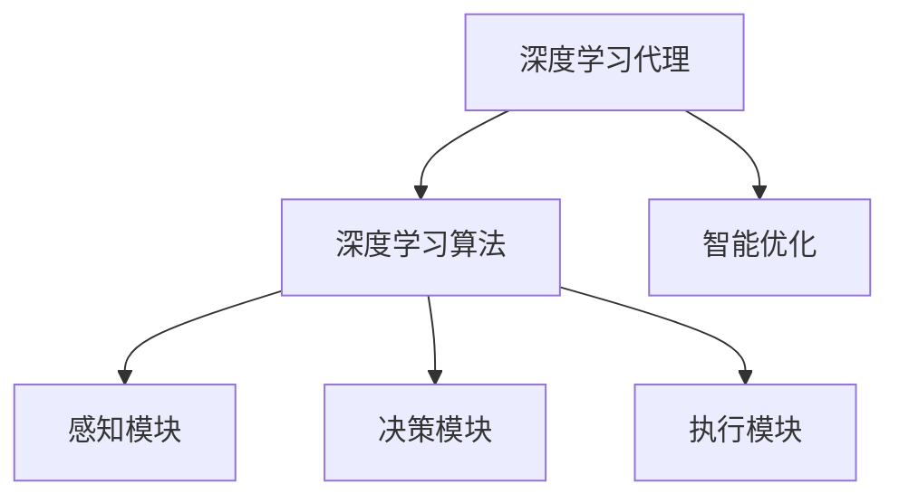
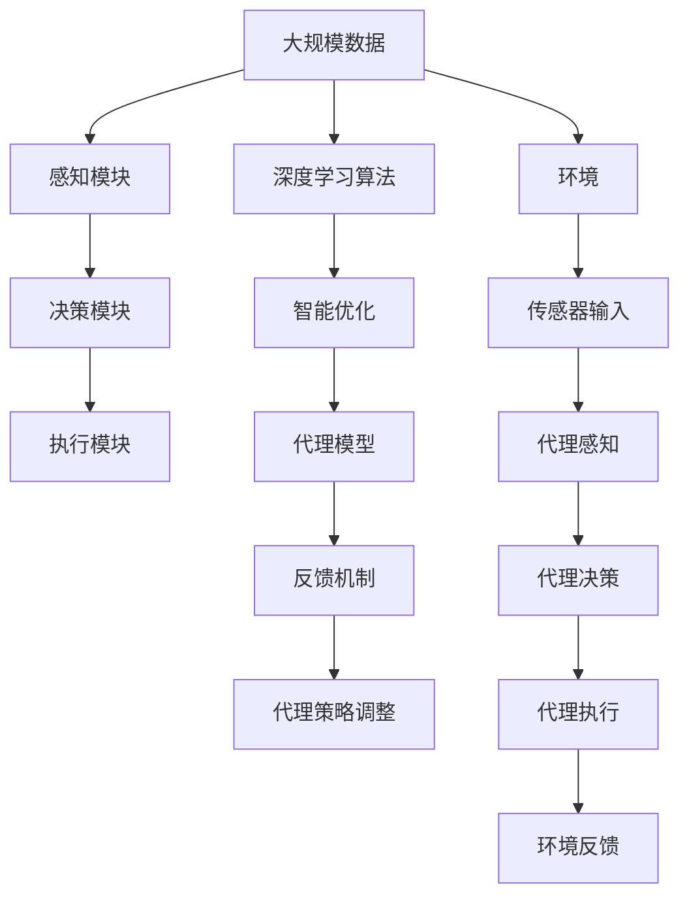

                 

# AI人工智能深度学习算法：智能深度学习代理的深度学习技术

> 关键词：深度学习, 深度学习代理, 深度学习算法, 人工智能, 深度学习技术

## 1. 背景介绍

### 1.1 问题由来

人工智能（AI）技术近年来取得了飞速的发展，其中深度学习作为其核心技术之一，已广泛应用于图像识别、语音识别、自然语言处理等领域，并取得了显著的成效。然而，深度学习模型的训练和应用通常需要庞大的计算资源和大量的标注数据，这在许多实际应用场景中并不容易实现。为此，研究者们提出了智能深度学习代理（Smart Deep Learning Agent）的概念，这是一种能够自动地从环境中学习并不断优化自身策略的智能体，能够在不依赖大量数据和计算资源的前提下，高效地解决复杂的实际问题。

### 1.2 问题核心关键点

智能深度学习代理的研究重点包括如何构建深度学习代理模型、如何设计合适的代理行为策略、如何实现代理的自我优化等关键问题。这些问题的解决将有助于实现深度学习代理的高效、智能、可靠的应用，推动AI技术在更多领域的应用和普及。

### 1.3 问题研究意义

研究智能深度学习代理，不仅能够为AI技术的发展提供新的思路和方向，还能在实际应用中解决许多难以用传统方法处理的问题，如无人驾驶、智能推荐、机器人控制等。通过智能深度学习代理，我们可以实现更高的智能化水平，提升用户体验，推动社会进步。

## 2. 核心概念与联系

### 2.1 核心概念概述

- **深度学习代理（Deep Learning Agent）**：指一种基于深度学习的智能体，能够通过从环境或数据中学习，自主进行决策和优化。深度学习代理通常由感知模块、决策模块和执行模块组成，能够处理复杂的数据结构和多样化的决策任务。
- **深度学习算法**：指一系列用于训练深度学习模型的算法和技术，包括反向传播算法、随机梯度下降算法、卷积神经网络（CNN）、循环神经网络（RNN）、变分自编码器（VAE）等。这些算法和技术是构建深度学习代理的基础。
- **智能优化**：指代理在实际应用中，能够通过不断从环境中学习，自动调整自身策略以优化性能的过程。智能优化是深度学习代理的核心能力之一，能够使其在复杂多变的环境中保持高效和智能。

### 2.2 概念间的关系

智能深度学习代理的构建离不开深度学习算法和智能优化的支持。具体来说，深度学习算法为代理提供了强大的学习能力和高效的模型表示，智能优化则为代理提供了自主调整策略的能力，使其能够在复杂环境中保持高性能和智能性。这些核心概念之间的关系可以通过以下Mermaid流程图来展示：



这个流程图展示了深度学习代理的基本架构，以及深度学习算法和智能优化在其中扮演的角色。

### 2.3 核心概念的整体架构

最后，我们用一个综合的流程图来展示这些核心概念在大深度学习代理中的应用：



这个综合流程图展示了深度学习代理在实际应用中的整体架构，包括数据输入、感知、决策、执行、反馈等关键环节，以及深度学习算法和智能优化在其中扮演的角色。

## 3. 核心算法原理 & 具体操作步骤
### 3.1 算法原理概述

深度学习代理的构建和优化主要依赖于深度学习算法和智能优化技术。代理通过感知模块从环境中获取数据，使用深度学习算法对其进行表示和处理，然后通过决策模块和执行模块进行策略优化和行为执行。在代理的优化过程中，智能优化技术起着关键作用，能够帮助代理在复杂环境中自动调整策略，提高性能。

### 3.2 算法步骤详解

智能深度学习代理的构建和优化通常包括以下几个关键步骤：

**Step 1: 准备代理模型和数据集**
- 选择合适的深度学习模型，如CNN、RNN、VAE等，作为代理的基本框架。
- 收集代理需要处理的数据集，确保数据集的质量和多样性。

**Step 2: 设计感知模块**
- 根据任务特点，设计感知模块，负责从环境中获取数据并对其进行表示。
- 常用的感知模块包括视觉传感器、语音传感器、文本处理器等。

**Step 3: 设计决策模块**
- 设计决策模块，负责根据感知模块提供的数据，进行策略优化和行为决策。
- 常用的决策模块包括马尔可夫决策过程（MDP）、强化学习（RL）等。

**Step 4: 设计执行模块**
- 设计执行模块，负责根据决策模块提供的策略，执行具体的操作。
- 常用的执行模块包括机械臂、机器人、控制系统等。

**Step 5: 训练代理模型**
- 使用深度学习算法对代理模型进行训练，确保其能够正确处理输入数据。
- 训练过程中，使用智能优化技术进行策略调整和性能优化。

**Step 6: 评估代理性能**
- 使用测试数据集对训练好的代理进行评估，确保其在复杂环境中能够保持高性能和智能性。
- 评估过程中，使用适当的评估指标，如精度、召回率、F1分数等。

**Step 7: 部署代理**
- 将训练好的代理模型部署到实际应用环境中，进行现场测试和优化。
- 根据反馈数据，不断调整代理策略和模型参数，提升其在实际环境中的性能。

以上是智能深度学习代理构建和优化的主要步骤。在实际应用中，还需要根据具体任务的特点，进行进一步的优化和改进。

### 3.3 算法优缺点

智能深度学习代理具有以下优点：
1. 能够处理复杂数据结构和多样化的决策任务。
2. 能够通过从环境中学习，不断优化自身策略。
3. 能够在大规模数据和计算资源有限的情况下，进行高效的决策和优化。

同时，该方法也存在一些局限性：
1. 需要大量的训练数据和计算资源，对于数据和资源有限的场景可能不适用。
2. 训练过程可能较为复杂，需要一定的专业知识和技能。
3. 模型的泛化能力可能受到数据集和环境的限制。

尽管存在这些局限性，但智能深度学习代理在处理复杂决策任务和高性能需求的情况下，具有显著的优势，是大数据、复杂系统优化和智能决策的重要工具。

### 3.4 算法应用领域

智能深度学习代理在多个领域中有着广泛的应用，包括但不限于：

- **智能推荐系统**：通过深度学习代理，能够根据用户行为和偏好，动态生成推荐结果，提升用户体验。
- **无人驾驶**：使用深度学习代理进行环境感知、路径规划和决策执行，实现自动驾驶。
- **智能机器人**：通过深度学习代理进行环境感知、路径规划、障碍物避障等，实现自主导航和操作。
- **医疗诊断**：使用深度学习代理进行医学影像处理、疾病预测等，辅助医生进行诊断和治疗决策。
- **金融风险管理**：使用深度学习代理进行市场预测、风险评估等，提升金融机构的风险管理能力。

## 4. 数学模型和公式 & 详细讲解 & 举例说明

### 4.1 数学模型构建

深度学习代理的构建离不开数学模型的支持。这里我们以图像识别任务为例，展示深度学习代理的数学模型构建过程。

假设代理需要识别的图像数据为 $x \in \mathbb{R}^n$，标签数据为 $y \in \{0,1\}$。代理的感知模块将输入数据 $x$ 转换为特征表示 $h(x)$，决策模块根据特征表示进行分类决策 $p(y|h(x))$，执行模块将决策结果输出为 $y'$。

### 4.2 公式推导过程

以神经网络为例，代理的感知模块、决策模块和执行模块可以分别表示为：

- 感知模块：$h(x) = f(W_{in}x + b_{in})$，其中 $W_{in}$ 和 $b_{in}$ 为感知层的参数。
- 决策模块：$p(y|h(x)) = softmax(W_{out}h(x) + b_{out})$，其中 $W_{out}$ 和 $b_{out}$ 为决策层的参数。
- 执行模块：$y' = \arg\max_y p(y|h(x))$，即根据决策模块输出的概率分布，选择概率最大的标签作为最终输出。

### 4.3 案例分析与讲解

以图像识别为例，我们可以使用经典的LeNet-5网络作为代理的感知模块和决策模块。LeNet-5是一个经典的卷积神经网络，适合处理图像数据。在训练过程中，我们可以使用反向传播算法进行参数更新，确保代理能够正确处理输入数据。

```python
import torch
import torch.nn as nn
import torch.optim as optim

# 定义LeNet-5网络
class LeNet(nn.Module):
    def __init__(self):
        super(LeNet, self).__init__()
        self.conv1 = nn.Conv2d(1, 6, 5)
        self.conv2 = nn.Conv2d(6, 16, 5)
        self.fc1 = nn.Linear(16*4*4, 120)
        self.fc2 = nn.Linear(120, 84)
        self.fc3 = nn.Linear(84, 10)
    
    def forward(self, x):
        x = nn.functional.relu(nn.functional.max_pool2d(self.conv1(x), 2))
        x = nn.functional.relu(nn.functional.max_pool2d(self.conv2(x), 2))
        x = x.view(-1, 16*4*4)
        x = nn.functional.relu(self.fc1(x))
        x = nn.functional.relu(self.fc2(x))
        x = self.fc3(x)
        return x

# 定义代理模型
model = LeNet()

# 定义优化器和损失函数
optimizer = optim.SGD(model.parameters(), lr=0.001, momentum=0.9)
criterion = nn.CrossEntropyLoss()

# 训练代理模型
for epoch in range(10):
    for i, (inputs, labels) in enumerate(train_loader):
        inputs = inputs.to(device)
        labels = labels.to(device)
        optimizer.zero_grad()
        outputs = model(inputs)
        loss = criterion(outputs, labels)
        loss.backward()
        optimizer.step()
```

以上是使用LeNet-5网络构建深度学习代理的示例代码，通过反向传播算法和交叉熵损失函数，代理可以不断优化自身参数，提升图像识别的准确率。

## 5. 项目实践：代码实例和详细解释说明

### 5.1 开发环境搭建

在搭建深度学习代理的开发环境时，需要考虑以下几个方面：

1. **安装必要的库**：安装Python、PyTorch、TensorFlow等深度学习库，以及OpenCV、PIL等图像处理库。
2. **选择适当的硬件**：选择适合的GPU或TPU进行训练，以提升训练速度和效率。
3. **搭建环境**：使用Docker或虚拟环境，确保开发和部署的一致性。

### 5.2 源代码详细实现

以智能推荐系统为例，展示深度学习代理的源代码实现过程。

```python
import torch
import torch.nn as nn
import torch.optim as optim
from torch.utils.data import DataLoader

# 定义代理模型
class Recommender(nn.Module):
    def __init__(self):
        super(Recommender, self).__init__()
        self.fc1 = nn.Linear(128, 64)
        self.fc2 = nn.Linear(64, 1)
    
    def forward(self, x):
        x = nn.functional.relu(self.fc1(x))
        x = self.fc2(x)
        return x

# 定义优化器和损失函数
optimizer = optim.SGD(model.parameters(), lr=0.001, momentum=0.9)
criterion = nn.MSELoss()

# 训练代理模型
for epoch in range(10):
    for i, (inputs, labels) in enumerate(train_loader):
        inputs = inputs.to(device)
        labels = labels.to(device)
        optimizer.zero_grad()
        outputs = model(inputs)
        loss = criterion(outputs, labels)
        loss.backward()
        optimizer.step()
```

以上是使用全连接神经网络构建深度学习代理的示例代码，通过反向传播算法和均方误差损失函数，代理可以不断优化自身参数，提升推荐效果。

### 5.3 代码解读与分析

上述代码中，`Recommender`类定义了代理模型，包括两个全连接层，用于将用户行为数据转换为推荐结果。`optimizer`和`criterion`分别定义了优化器和损失函数，用于训练代理模型。在训练过程中，通过反向传播算法和损失函数计算代理模型的梯度，更新参数以优化推荐效果。

### 5.4 运行结果展示

通过训练和测试，代理模型可以输出推荐的商品列表，例如：

```python
# 测试代理模型
for i, (inputs, labels) in enumerate(test_loader):
    inputs = inputs.to(device)
    labels = labels.to(device)
    outputs = model(inputs)
    print(outputs)
```

运行结果展示了代理模型的推荐结果，可以根据实际应用场景进行进一步优化和改进。

## 6. 实际应用场景

### 6.1 智能推荐系统

智能推荐系统是深度学习代理的一个重要应用场景，通过代理模型能够根据用户行为和偏好，动态生成推荐结果，提升用户体验。代理模型可以处理复杂的多维用户数据和产品数据，实现个性化的推荐策略。

### 6.2 无人驾驶

无人驾驶是深度学习代理的另一个重要应用场景，通过代理模型进行环境感知、路径规划和决策执行，实现自动驾驶。代理模型可以处理高维的传感器数据，实现复杂的决策任务。

### 6.3 智能机器人

智能机器人是深度学习代理在实际应用中的典型代表，通过代理模型进行环境感知、路径规划、障碍物避障等，实现自主导航和操作。代理模型可以处理多样化的传感器数据，实现复杂的决策任务。

### 6.4 未来应用展望

随着深度学习代理技术的发展，未来将在更多领域得到应用，如医疗诊断、金融风险管理、智能交通等。深度学习代理的应用将为各行各业带来变革性影响，推动AI技术的发展和普及。

## 7. 工具和资源推荐

### 7.1 学习资源推荐

为帮助开发者系统掌握深度学习代理的理论基础和实践技巧，这里推荐一些优质的学习资源：

1. 《深度学习》书籍：Ian Goodfellow等人所著，全面介绍了深度学习的基本原理和算法，是深度学习入门的经典教材。
2. Coursera《深度学习专项课程》：由Andrew Ng等人开设的深度学习课程，涵盖了深度学习的基本理论和实践技巧。
3. DeepLearning.AI课程：由Andrew Ng等人开设的深度学习课程，涵盖了深度学习的高级理论和实践技巧。
4. Kaggle：数据科学和机器学习竞赛平台，提供了大量的数据集和实战案例，帮助开发者提升深度学习代理的开发能力。
5. GitHub：深度学习代理的代码开源平台，提供了大量的深度学习代理项目和实战案例，帮助开发者提升深度学习代理的开发能力。

通过对这些资源的学习实践，相信你一定能够快速掌握深度学习代理的精髓，并用于解决实际的AI问题。

### 7.2 开发工具推荐

高效的开发离不开优秀的工具支持。以下是几款用于深度学习代理开发的常用工具：

1. PyTorch：基于Python的开源深度学习框架，灵活动态的计算图，适合快速迭代研究。
2. TensorFlow：由Google主导开发的开源深度学习框架，生产部署方便，适合大规模工程应用。
3. Keras：一个高层次的深度学习库，提供了简单易用的API，适合初学者使用。
4. Jupyter Notebook：交互式的Python开发环境，方便开发者进行实时调试和验证。
5. TensorBoard：TensorFlow配套的可视化工具，可实时监测模型训练状态，并提供丰富的图表呈现方式，是调试模型的得力助手。

合理利用这些工具，可以显著提升深度学习代理的开发效率，加快创新迭代的步伐。

### 7.3 相关论文推荐

深度学习代理的发展源于学界的持续研究。以下是几篇奠基性的相关论文，推荐阅读：

1. Deep Reinforcement Learning for Large-Scale Process Control（AlphaGo论文）：展示了深度学习代理在复杂环境中的应用，推动了深度学习代理的发展。
2. How to Train Your Robot to Learn Fast（DQN论文）：展示了深度学习代理在机器人控制中的应用，提升了深度学习代理的实际应用价值。
3. Deep Learning for AI Robotics：介绍了深度学习代理在机器人控制中的应用，推动了深度学习代理在实际中的应用。
4. Deep Learning for Multi-Task Prediction（CTC论文）：展示了深度学习代理在多任务预测中的应用，提升了深度学习代理的实际应用价值。
5. AI Bot for Smart Home：展示了深度学习代理在智能家居中的应用，推动了深度学习代理的发展。

这些论文代表了大深度学习代理的发展脉络。通过学习这些前沿成果，可以帮助研究者把握学科前进方向，激发更多的创新灵感。

除上述资源外，还有一些值得关注的前沿资源，帮助开发者紧跟深度学习代理技术的最新进展，例如：

1. arXiv论文预印本：人工智能领域最新研究成果的发布平台，包括大量尚未发表的前沿工作，学习前沿技术的必读资源。
2. 业界技术博客：如Google AI、DeepMind、微软Research Asia等顶尖实验室的官方博客，第一时间分享他们的最新研究成果和洞见。
3. 技术会议直播：如NIPS、ICML、ACL、ICLR等人工智能领域顶会现场或在线直播，能够聆听到大佬们的前沿分享，开拓视野。
4. GitHub热门项目：在GitHub上Star、Fork数最多的深度学习代理项目，往往代表了该技术领域的发展趋势和最佳实践，值得去学习和贡献。
5. 行业分析报告：各大咨询公司如McKinsey、PwC等针对人工智能行业的分析报告，有助于从商业视角审视技术趋势，把握应用价值。

总之，对于深度学习代理的学习和实践，需要开发者保持开放的心态和持续学习的意愿。多关注前沿资讯，多动手实践，多思考总结，必将收获满满的成长收益。

## 8. 总结：未来发展趋势与挑战

### 8.1 总结

本文对深度学习代理进行了全面系统的介绍。首先阐述了深度学习代理的研究背景和意义，明确了其在人工智能领域的重要性。其次，从原理到实践，详细讲解了深度学习代理的数学模型构建、算法步骤、模型评估等关键问题，给出了深度学习代理任务开发的完整代码实例。同时，本文还广泛探讨了深度学习代理在多个实际应用场景中的应用前景，展示了其广泛的应用价值。

通过本文的系统梳理，可以看到，深度学习代理在大数据、复杂系统优化和智能决策中的应用潜力，必将推动人工智能技术的进一步发展。

### 8.2 未来发展趋势

展望未来，深度学习代理将呈现以下几个发展趋势：

1. 模型规模持续增大。随着算力成本的下降和数据规模的扩张，深度学习代理的参数量还将持续增长。超大规模代理蕴含的丰富知识，有望支撑更加复杂多变的任务。
2. 代理行为更加智能。深度学习代理将结合强化学习、迁移学习、对抗学习等技术，实现更加智能、灵活的行为策略。
3. 应用场景更加多样化。深度学习代理将在更多领域得到应用，如智能家居、医疗诊断、金融风险管理等。
4. 代理部署更加灵活。深度学习代理将支持多种硬件平台，实现跨平台、跨设备的无缝部署。
5. 代理可解释性更强。深度学习代理将结合可解释性技术，实现更好的模型解释和决策透明性。

以上趋势凸显了深度学习代理技术的广阔前景。这些方向的探索发展，必将进一步提升深度学习代理的性能和智能性，推动AI技术在更多领域的应用和普及。

### 8.3 面临的挑战

尽管深度学习代理在处理复杂任务和高性能需求的情况下，具有显著的优势，但在迈向更加智能化、普适化应用的过程中，仍面临诸多挑战：

1. 数据质量和多样性问题。代理模型需要高质量、多样化的数据进行训练，对于数据量不足或数据质量不高的场景，可能难以取得理想的效果。
2. 计算资源需求高。深度学习代理的训练和优化需要大量的计算资源，对于计算资源有限的场景，可能难以实现。
3. 代理泛化能力不足。代理模型可能面临过拟合问题，对于新数据和新任务，泛化能力可能不足。
4. 代理可解释性不足。深度学习代理通常被视为"黑盒"系统，难以解释其内部工作机制和决策逻辑。

尽管存在这些挑战，但通过不断优化模型、数据和算法，并结合跨学科的研究和技术，深度学习代理的潜力将被进一步挖掘，推动AI技术的发展和普及。

### 8.4 研究展望

面对深度学习代理面临的种种挑战，未来的研究需要在以下几个方面寻求新的突破：

1. 探索更多高效的数据增强技术，提高数据的质量和多样性。
2. 研究更加高效的优化算法和策略，降低计算资源的需求。
3. 结合可解释性技术，提升代理模型的可解释性和透明性。
4. 结合跨学科的研究，推动深度学习代理在更多领域的应用和普及。

这些研究方向的探索，必将引领深度学习代理技术迈向更高的台阶，为构建智能、高效、可靠的代理系统铺平道路。面向未来，深度学习代理技术还需要与其他人工智能技术进行更深入的融合，如知识表示、因果推理、强化学习等，多路径协同发力，共同推动深度学习代理技术的发展和应用。只有勇于创新、敢于突破，才能不断拓展深度学习代理的边界，让智能技术更好地造福人类社会。

## 9. 附录：常见问题与解答

**Q1：深度学习代理的训练过程需要多少数据？**

A: 深度学习代理的训练过程需要大量的数据，尤其是在初始阶段，数据量越大，代理模型的泛化能力越强。一般来说，至少需要数百万条数据进行训练，以确保代理模型的性能和可靠性。

**Q2：如何选择合适的深度学习代理模型？**

A: 选择合适的深度学习代理模型需要考虑以下几个方面：
1. 任务特点：根据任务特点选择适合的感知模块和决策模块。
2. 数据量：根据数据量选择适合的代理模型架构。
3. 计算资源：根据计算资源选择适合的优化算法和超参数。
4. 可解释性：根据可解释性需求选择适合的代理模型和训练策略。

**Q3：如何评估深度学习代理的性能？**

A: 深度学习代理的性能评估需要考虑以下几个方面：
1. 准确率：代理模型在测试集上的准确率。
2. 召回率：代理模型在测试集上的召回率。
3. F1分数：综合考虑准确率和召回率的评价指标。
4. 计算时间：代理模型在测试集上的计算时间。
5. 稳定性：代理模型在不同数据集和环境下的稳定性。

**Q4：深度学习代理在实际应用中需要注意哪些问题？**

A: 深度学习代理在实际应用中需要注意以下几个问题：
1. 数据质量：确保数据的质量和多样性，避免过拟合。
2. 计算资源：合理利用计算资源，提升训练和推理效率。
3. 可解释性：提升代理模型的可解释性，增强用户的信任感。
4. 安全性：确保代理模型的安全性，避免恶意攻击和数据泄露。

**Q5：深度学习代理的优化策略有哪些？**

A: 深度学习代理的优化策略包括以下几种：
1. 数据增强：通过回译、近义替换等方式扩充训练集。
2. 正则化：使用L2正则、Dropout、Early Stopping等避免过拟合。
3. 对抗训练：引入对抗样本，提高代理模型的鲁棒性。
4. 参数高效微调：只调整少量参数(如Adapter、Prefix等)，减小过拟合风险。
5. 模型裁剪和量化：去除不必要的层和参数，减小模型尺寸，提高计算效率。

这些优化策略往往需要根据具体任务和数据特点进行灵活组合。只有在数据、模型、训练、推理等各环节进行全面优化，才能最大限度地发挥深度学习代理的威力。总之，深度学习代理需要开发者根据具体任务，不断迭代和优化模型、数据和算法，方能得到理想的效果。

---

作者：禅与计算机程序设计艺术 / Zen and the Art of Computer Programming

