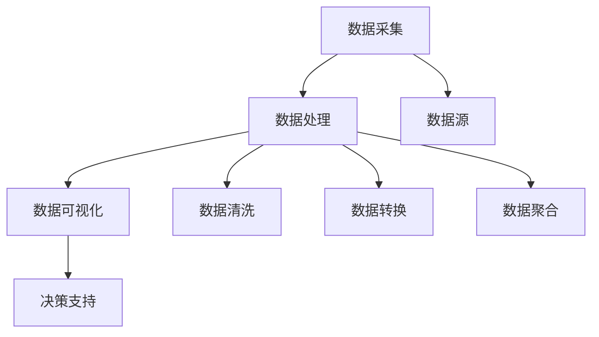

                 

# AI创业公司的产品数据分析框架：数据采集、数据处理与数据可视化

> 关键词：产品分析, 数据采集, 数据处理, 数据可视化, 机器学习, 决策支持, 商业智能, 创业公司

## 1. 背景介绍

在快速发展的互联网时代，越来越多的AI创业公司涌现出来，这些公司在利用人工智能技术解决实际问题的同时，也对产品数据分析提出了更高的要求。一个健全的产品数据分析框架，能够帮助AI创业公司从海量数据中提取有价值的信息，支撑业务决策，优化产品体验，提高用户满意度。本文将从背景、核心概念、算法原理、具体操作、实际应用等多个角度，系统性地介绍AI创业公司的产品数据分析框架。

### 1.1 问题由来

随着移动互联网的普及和智能设备的普及，大数据时代已然到来。AI创业公司面对的是动辄亿级用户量的应用场景，需要通过大数据分析和人工智能技术，从海量数据中挖掘出有价值的信息，帮助企业做出更科学的业务决策。然而，在实际应用中，数据采集、数据处理和数据可视化等环节，往往存在数据质量差、处理复杂、数据展示困难等问题，严重影响了数据驱动决策的落地效果。

### 1.2 问题核心关键点

为更好地解决上述问题，AI创业公司需要构建一个全面、高效、易用的产品数据分析框架。该框架主要包含以下核心要点：

1. 数据采集：从各种数据源采集数据，并确保数据的质量和完整性。
2. 数据处理：对采集到的数据进行清洗、转换、聚合等处理，以便后续分析使用。
3. 数据可视化：将处理后的数据通过图表、报表等方式展示，直观呈现数据分析结果。
4. 决策支持：结合机器学习、商业智能等技术，从数据中提取有价值的洞察，支撑业务决策。

本文将围绕这些核心要点，详细介绍AI创业公司的产品数据分析框架。

## 2. 核心概念与联系

### 2.1 核心概念概述

为更好地理解AI创业公司的产品数据分析框架，本节将介绍几个密切相关的核心概念：

- **数据采集(Data Collection)**：从各种数据源（如Web日志、社交媒体、移动应用等）采集数据，确保数据的实时性和多样性。
- **数据处理(Data Processing)**：对采集到的数据进行清洗、转换、聚合等处理，去除噪声、填补缺失值、处理重复数据等。
- **数据可视化(Data Visualization)**：将处理后的数据通过图表、报表等方式展示，直观呈现数据分析结果，帮助决策者理解数据。
- **决策支持(Decision Support)**：利用机器学习、商业智能等技术，从数据中提取有价值的洞察，辅助决策者做出科学的业务决策。

这些核心概念之间存在着紧密的联系，形成了AI创业公司产品数据分析框架的完整生态系统。

### 2.2 概念间的关系

这些核心概念之间的关系可以用以下Mermaid流程图来展示：



这个流程图展示了数据采集、数据处理、数据可视化与决策支持之间的关系：

1. 数据采集是从各种数据源（如Web日志、社交媒体、移动应用等）收集数据，并确保数据的质量和完整性。
2. 数据处理是对采集到的数据进行清洗、转换、聚合等处理，去除噪声、填补缺失值、处理重复数据等。
3. 数据可视化将处理后的数据通过图表、报表等方式展示，直观呈现数据分析结果。
4. 决策支持利用机器学习、商业智能等技术，从数据中提取有价值的洞察，辅助决策者做出科学的业务决策。

## 3. 核心算法原理 & 具体操作步骤

### 3.1 算法原理概述

AI创业公司的产品数据分析框架，主要基于数据挖掘、机器学习和商业智能等技术。其核心算法原理可以概括为：

1. **数据采集**：从各种数据源采集数据，确保数据的质量和完整性。
2. **数据处理**：对采集到的数据进行清洗、转换、聚合等处理，去除噪声、填补缺失值、处理重复数据等。
3. **数据可视化**：将处理后的数据通过图表、报表等方式展示，直观呈现数据分析结果。
4. **决策支持**：利用机器学习、商业智能等技术，从数据中提取有价值的洞察，辅助决策者做出科学的业务决策。

### 3.2 算法步骤详解

AI创业公司的产品数据分析框架，主要包含以下关键步骤：

**Step 1: 数据采集**

- **确定数据源**：明确需要采集的数据源，如Web日志、社交媒体、移动应用等。
- **设计数据采集方案**：根据数据源的特点，设计合适的数据采集方案，包括采集频率、采集方式、数据格式等。
- **采集数据**：使用爬虫、API接口、日志文件等方式，从数据源采集数据，确保数据的质量和完整性。

**Step 2: 数据处理**

- **数据清洗**：去除数据中的噪声、异常值、重复数据等，确保数据的一致性和完整性。
- **数据转换**：将原始数据转换为适合分析的格式，如从字符串转换为数值、时间戳等。
- **数据聚合**：将数据进行聚合、分组、汇总等操作，便于后续分析和展示。

**Step 3: 数据可视化**

- **选择可视化工具**：根据分析结果的特点，选择适合的可视化工具，如Tableau、Power BI、ECharts等。
- **设计可视化方案**：根据业务需求，设计合适的可视化方案，如柱状图、饼图、折线图等。
- **实现可视化**：将处理后的数据通过图表、报表等方式展示，直观呈现数据分析结果。

**Step 4: 决策支持**

- **选择决策支持技术**：根据业务需求，选择适合的决策支持技术，如机器学习、商业智能等。
- **训练模型**：利用历史数据训练机器学习模型，提取有价值的洞察。
- **提供决策建议**：根据机器学习模型的预测结果，提供科学的业务决策建议。

### 3.3 算法优缺点

AI创业公司的产品数据分析框架，具有以下优点：

- **数据全面性**：能够从各种数据源采集数据，覆盖不同业务场景，提供全面的数据支持。
- **处理高效性**：利用数据清洗、转换、聚合等技术，处理数据高效、准确，减少数据噪声。
- **展示直观性**：通过图表、报表等形式展示数据分析结果，直观易懂，易于决策。
- **决策科学性**：利用机器学习、商业智能等技术，从数据中提取有价值的洞察，辅助决策者做出科学的业务决策。

同时，该框架也存在一些缺点：

- **数据采集复杂**：不同数据源的数据格式、采集方式各异，数据采集过程复杂。
- **数据处理耗时**：数据清洗、转换、聚合等处理操作耗时耗力，需要专业技术人员进行操作。
- **数据可视化难度大**：复杂数据集的设计和展示，需要较高的数据可视化技能。
- **决策支持依赖模型**：机器学习模型需要大量数据和计算资源，模型训练过程复杂，依赖数据质量。

### 3.4 算法应用领域

AI创业公司的产品数据分析框架，已经广泛应用于多个领域，包括但不限于：

- **电子商务**：通过分析用户行为数据，优化商品推荐、提升用户购买体验。
- **金融服务**：通过分析交易数据，识别欺诈行为、优化风险管理。
- **健康医疗**：通过分析患者数据，提供个性化诊疗方案、优化医疗资源分配。
- **教育培训**：通过分析学生数据，提供个性化学习路径、优化课程设计。
- **智能制造**：通过分析生产数据，优化生产流程、提升产品质量。

## 4. 数学模型和公式 & 详细讲解 & 举例说明

### 4.1 数学模型构建

AI创业公司的产品数据分析框架，主要基于统计学和机器学习理论。以下是对主要数学模型的介绍：

**数据采集**：

- **数据来源**：Web日志、社交媒体、移动应用等。
- **采集方式**：爬虫、API接口、日志文件等。

**数据处理**：

- **数据清洗**：去除噪声、异常值、重复数据等。
- **数据转换**：将字符串转换为数值、时间戳等。
- **数据聚合**：汇总、分组等操作。

**数据可视化**：

- **图表类型**：柱状图、饼图、折线图等。
- **展示方式**：Tableau、Power BI、ECharts等工具。

**决策支持**：

- **机器学习模型**：回归模型、分类模型、聚类模型等。
- **商业智能工具**：Tableau、Power BI等。

### 4.2 公式推导过程

以下以数据清洗为例，介绍数据处理的数学模型。

设原始数据为 $D$，其中包含噪声 $N$、异常值 $A$、重复值 $R$，处理后的数据为 $D'$。数据清洗的目标是去除噪声 $N$、异常值 $A$、重复值 $R$，得到处理后的数据 $D'$。

- **噪声去除**：
  $$
  D' = D - N
  $$

- **异常值检测**：
  $$
  A' = D - A
  $$

- **重复值去除**：
  $$
  R' = D - R
  $$

- **最终处理结果**：
  $$
  D' = D' - A' - R'
  $$

### 4.3 案例分析与讲解

**案例一：电子商务平台用户行为分析**

- **数据采集**：从电商平台采集用户行为数据，包括浏览记录、购买记录、评价记录等。
- **数据处理**：对数据进行清洗、转换、聚合等操作，去除噪声、填补缺失值、处理重复数据等。
- **数据可视化**：通过柱状图、折线图等方式展示用户行为分析结果，如用户活跃度、购物偏好等。
- **决策支持**：利用机器学习模型，从数据中提取有价值的洞察，如热门商品推荐、用户流失预警等。

**案例二：金融公司客户风险评估**

- **数据采集**：从金融公司获取客户交易数据、信用数据等。
- **数据处理**：对数据进行清洗、转换、聚合等操作，去除噪声、填补缺失值、处理重复数据等。
- **数据可视化**：通过饼图、柱状图等方式展示客户风险评估结果，如高风险客户比例、信用评分分布等。
- **决策支持**：利用机器学习模型，从数据中提取有价值的洞察，如客户信用评分、欺诈风险预警等。

## 5. 项目实践：代码实例和详细解释说明

### 5.1 开发环境搭建

在进行产品数据分析框架的开发前，我们需要准备好开发环境。以下是使用Python进行PyTorch开发的环境配置流程：

1. 安装Anaconda：从官网下载并安装Anaconda，用于创建独立的Python环境。

2. 创建并激活虚拟环境：
```bash
conda create -n pytorch-env python=3.8 
conda activate pytorch-env
```

3. 安装PyTorch：根据CUDA版本，从官网获取对应的安装命令。例如：
```bash
conda install pytorch torchvision torchaudio cudatoolkit=11.1 -c pytorch -c conda-forge
```

4. 安装各类工具包：
```bash
pip install numpy pandas scikit-learn matplotlib tqdm jupyter notebook ipython
```

完成上述步骤后，即可在`pytorch-env`环境中开始数据分析框架的开发。

### 5.2 源代码详细实现

下面我们以用户行为分析为例，给出使用PyTorch进行数据分析的PyTorch代码实现。

首先，定义用户行为分析的数据处理函数：

```python
import pandas as pd

def user_behavior_analysis(df):
    # 数据清洗
    df = df.dropna()  # 去除缺失值
    df = df.drop_duplicates()  # 去除重复值
    
    # 数据转换
    df['time'] = pd.to_datetime(df['time'])  # 将时间戳转换为时间格式
    df['hour'] = df['time'].dt.hour  # 提取小时信息
    
    # 数据聚合
    df_hour = df.groupby('hour').sum()  # 按小时聚合
    
    return df_hour
```

然后，定义用户行为分析的可视化函数：

```python
import matplotlib.pyplot as plt

def plot_user_behavior(df_hour):
    # 绘制用户行为分布图
    plt.bar(df_hour.index, df_hour['value'], color='blue', alpha=0.5)
    plt.xlabel('Time of Day')
    plt.ylabel('User Activity')
    plt.title('User Behavior Distribution')
    plt.show()
```

最后，启动用户行为分析流程并在可视化：

```python
# 加载用户行为数据
df = pd.read_csv('user_behavior.csv')

# 进行用户行为分析
df_hour = user_behavior_analysis(df)

# 绘制用户行为分布图
plot_user_behavior(df_hour)
```

以上就是使用PyTorch对用户行为分析进行数据分析的完整代码实现。可以看到，得益于Pandas的强大封装，我们可以用相对简洁的代码完成数据处理和可视化。

### 5.3 代码解读与分析

让我们再详细解读一下关键代码的实现细节：

**user_behavior_analysis函数**：
- 定义了用户行为分析的函数，包含了数据清洗、数据转换和数据聚合三个步骤。
- 使用Pandas的dropna方法去除缺失值，使用drop_duplicates方法去除重复值。
- 使用Pandas的to_datetime方法将时间戳转换为时间格式，使用dt.hour方法提取小时信息。
- 使用groupby方法按小时聚合，sum方法计算总值。

**plot_user_behavior函数**：
- 定义了用户行为分布图的绘制函数，使用Matplotlib的bar方法绘制柱状图。
- 使用plt.xlabel、plt.ylabel和plt.title方法设置图表的坐标轴标签和标题。

**启动用户行为分析流程**：
- 使用Pandas的read_csv方法加载用户行为数据。
- 调用user_behavior_analysis函数进行用户行为分析，返回按小时聚合的DataFrame。
- 调用plot_user_behavior函数绘制用户行为分布图。

## 6. 实际应用场景

### 6.1 智能客服系统

智能客服系统利用AI技术，为用户提供24/7的自动化客服服务。AI创业公司的产品数据分析框架，可以帮助企业从客户交互数据中提取有价值的信息，优化客户服务体验。

在实际应用中，可以收集智能客服系统的历史对话记录，提取用户提问和客服回复的数据，利用数据清洗、数据转换、数据聚合等技术，对数据进行分析和处理。然后通过数据可视化工具，生成客服系统的工作报告，帮助企业分析客服系统的工作表现和用户满意度。最后，利用机器学习模型，提取客服系统的优化建议，提升客服系统的服务质量。

### 6.2 金融公司客户风险评估

金融公司需要评估客户的信用风险和欺诈风险，以优化风险管理。AI创业公司的产品数据分析框架，可以帮助金融公司从客户交易数据中提取有价值的信息，提升客户风险评估的准确性和效率。

在实际应用中，可以收集金融公司的客户交易数据，提取客户交易金额、交易时间、交易地点等数据，利用数据清洗、数据转换、数据聚合等技术，对数据进行分析和处理。然后通过数据可视化工具，生成客户风险评估报告，帮助企业分析客户交易行为和风险特征。最后，利用机器学习模型，提取客户信用评分和欺诈风险预警，优化风险管理策略。

### 6.3 智能制造系统

智能制造系统利用AI技术，优化生产流程和提高产品质量。AI创业公司的产品数据分析框架，可以帮助制造企业从生产数据中提取有价值的信息，提升生产效率和产品质量。

在实际应用中，可以收集智能制造系统的生产数据，提取设备状态、生产时间、生产数量等数据，利用数据清洗、数据转换、数据聚合等技术，对数据进行分析和处理。然后通过数据可视化工具，生成生产系统的工作报告，帮助企业分析生产系统的工作表现和效率。最后，利用机器学习模型，提取生产系统的优化建议，提升生产系统的效率和质量。

### 6.4 未来应用展望

随着AI技术的不断发展，AI创业公司的产品数据分析框架将迎来更广阔的应用前景。未来的应用方向可能包括：

- **大数据分析**：利用大数据技术，从海量的数据中提取有价值的信息，支撑企业决策。
- **实时数据处理**：利用流式计算技术，实现数据的实时处理和分析，提升企业反应速度。
- **人工智能与物联网融合**：结合人工智能和物联网技术，实现设备的智能化管理，提升生产效率和设备利用率。
- **智能推荐系统**：利用用户行为数据分析，提供个性化推荐服务，提升用户体验。

## 7. 工具和资源推荐

### 7.1 学习资源推荐

为了帮助开发者系统掌握AI创业公司的产品数据分析框架，这里推荐一些优质的学习资源：

1. **《Python数据科学手册》**：该书系统地介绍了Python在数据科学中的应用，包括数据清洗、数据转换、数据可视化等技术。
2. **《机器学习实战》**：该书介绍了机器学习的基本原理和实现方法，结合实际案例，帮助开发者理解和应用机器学习技术。
3. **Kaggle竞赛平台**：Kaggle是一个数据科学竞赛平台，提供了丰富的数据集和算法竞赛，帮助开发者提升数据分析和机器学习技能。
4. **Coursera机器学习课程**：Coursera提供了多门机器学习课程，包括入门课程和高级课程，涵盖了从基础到前沿的机器学习知识。
5. **Tableau官方文档**：Tableau是一款流行的数据可视化工具，其官方文档提供了详细的教程和示例，帮助开发者掌握数据可视化技能。

通过对这些资源的学习实践，相信你一定能够快速掌握AI创业公司的产品数据分析框架，并用于解决实际的业务问题。

### 7.2 开发工具推荐

高效的开发离不开优秀的工具支持。以下是几款用于AI创业公司数据分析框架开发的常用工具：

1. **PyTorch**：基于Python的开源深度学习框架，灵活动态的计算图，适合快速迭代研究。大部分预训练语言模型都有PyTorch版本的实现。
2. **Pandas**：Python数据处理库，支持大规模数据集的读写、清洗、转换、聚合等操作，适合数据分析任务。
3. **Matplotlib**：Python数据可视化库，支持绘制各种类型的图表，适合数据可视化任务。
4. **Tableau**：流行的数据可视化工具，支持多种数据源，提供丰富的图表类型和交互功能，适合商业智能分析。
5. **Jupyter Notebook**：Python交互式开发环境，支持代码、文本、图表等多种格式的展示，适合开发数据分析框架。

合理利用这些工具，可以显著提升AI创业公司数据分析框架的开发效率，加快创新迭代的步伐。

### 7.3 相关论文推荐

AI创业公司的产品数据分析框架，在学术界和工业界已经得到了广泛的研究。以下是几篇奠基性的相关论文，推荐阅读：

1. **《Data Mining: Concepts and Techniques》**：该书介绍了数据挖掘的基本概念和技术，涵盖了数据清洗、数据转换、数据聚合等核心技术。
2. **《Hands-On Data Science with Python》**：该书系统地介绍了Python在数据科学中的应用，包括数据清洗、数据转换、数据可视化等技术。
3. **《Scikit-learn用户手册》**：该书介绍了Scikit-learn机器学习库的使用方法，涵盖回归、分类、聚类等常见算法。
4. **《Deep Learning with Python》**：该书介绍了深度学习的基本原理和实现方法，结合实际案例，帮助开发者理解和应用深度学习技术。
5. **《Data Mining and Statistical Learning》**：该书介绍了机器学习的基本原理和实现方法，涵盖回归、分类、聚类等常见算法。

这些论文代表了大数据技术和大数据分析框架的发展脉络。通过学习这些前沿成果，可以帮助研究者把握学科前进方向，激发更多的创新灵感。

除上述资源外，还有一些值得关注的前沿资源，帮助开发者紧跟大数据技术和大数据分析框架的最新进展，例如：

1. **arXiv论文预印本**：人工智能领域最新研究成果的发布平台，包括大量尚未发表的前沿工作，学习前沿技术的必读资源。
2. **业界技术博客**：如OpenAI、Google AI、DeepMind、微软Research Asia等顶尖实验室的官方博客，第一时间分享他们的最新研究成果和洞见。
3. **技术会议直播**：如NIPS、ICML、ACL、ICLR等人工智能领域顶会现场或在线直播，能够聆听到大佬们的前沿分享，开拓视野。
4. **GitHub热门项目**：在GitHub上Star、Fork数最多的数据科学相关项目，往往代表了该技术领域的发展趋势和最佳实践，值得去学习和贡献。
5. **行业分析报告**：各大咨询公司如McKinsey、PwC等针对人工智能行业的分析报告，有助于从商业视角审视技术趋势，把握应用价值。

总之，对于AI创业公司的产品数据分析框架的学习和实践，需要开发者保持开放的心态和持续学习的意愿。多关注前沿资讯，多动手实践，多思考总结，必将收获满满的成长收益。

## 8. 总结：未来发展趋势与挑战

### 8.1 总结

本文对AI创业公司的产品数据分析框架进行了全面系统的介绍。首先阐述了产品数据分析框架的背景和意义，明确了数据分析框架在支撑业务决策、优化产品体验、提高用户满意度等方面的重要作用。其次，从原理到实践，详细讲解了数据分析框架的各个环节，包括数据采集、数据处理、数据可视化与决策支持，并给出了完整的代码实现。同时，本文还广泛探讨了数据分析框架在智能客服、金融服务、智能制造等多个行业领域的应用前景，展示了数据分析框架的巨大潜力。最后，本文精选了数据分析框架的学习资源，力求为读者提供全方位的技术指引。

通过本文的系统梳理，可以看到，AI创业公司的产品数据分析框架是一个完整的系统，能够从数据采集、数据处理、数据可视化与决策支持等多个环节提供全面的支持，帮助企业从海量数据中提取有价值的信息，支撑业务决策，优化产品体验，提高用户满意度。未来，随着大数据技术和大数据分析框架的不断演进，数据分析框架必将在更多领域得到应用，为AI创业公司的业务创新和产品优化提供强大的数据支撑。

### 8.2 未来发展趋势

展望未来，AI创业公司的产品数据分析框架将呈现以下几个发展趋势：

1. **数据采集自动化**：随着数据采集技术的不断发展，数据采集过程将越来越自动化、智能化，无需人工干预，能够实时、高效地从各种数据源采集数据。
2. **数据处理智能化**：利用人工智能技术，对数据进行智能化处理，自动识别和修复数据噪声、填补缺失值、处理重复数据等，提升数据处理效率和质量。
3. **数据可视化实时化**：利用流式计算技术，实现数据的实时处理和可视化，实时监测业务指标，帮助企业快速决策。
4. **决策支持智能化**：利用机器学习、商业智能等技术，从数据中提取有价值的洞察，提供智能化决策支持，提升企业决策的科学性和准确性。
5. **多模态数据融合**：结合人工智能和物联网技术，实现多模态数据的融合和协同建模，提升数据分析的全面性和深度。

以上趋势凸显了AI创业公司的产品数据分析框架的广阔前景。这些方向的探索发展，必将进一步提升数据分析框架的全面性、效率和智能化水平，为AI创业公司的业务创新和产品优化提供更强有力的数据支持。

### 8.3 面临的挑战

尽管AI创业公司的产品数据分析框架已经取得了瞩目成就，但在迈向更加智能化、普适化应用的过程中，它仍面临着诸多挑战：

1. **数据采集复杂**：不同数据源的数据格式、采集方式各异，数据采集过程复杂，需要高水平的技术支持和自动化工具。
2. **数据处理耗时**：数据清洗、转换、聚合等处理操作耗时耗力，需要专业技术人员进行操作，增加了数据分析的难度。
3. **数据可视化难度大**：复杂数据集的设计和展示，需要较高的数据可视化技能，增加了数据分析的复杂性。
4. **决策支持依赖模型**：机器学习模型需要大量数据和计算资源，模型训练过程复杂，依赖数据质量，增加了数据分析的复杂性。
5. **数据安全和隐私保护**：数据采集和处理过程中，需要注意数据安全和隐私保护，确保数据的安全性和合法性。

正视这些挑战，积极应对并寻求突破，将是大数据技术和大数据分析框架走向成熟的必由之路。相信随着学界和产业界的共同努力，这些挑战终将一一被克服，大数据分析框架必将在构建数据驱动的智能系统中发挥更大的作用。

### 8.4 研究展望

未来，AI创业公司的产品数据分析框架需要在以下几个方面进行深入研究：

1. **自动化数据采集技术**：研究智能化的数据采集技术，提高数据采集的自动化程度，减少人工干预。
2. **智能化数据处理技术**：研究智能化的数据处理技术，利用人工智能技术提升数据处理的效率和质量。
3. **实时化数据可视化技术**：研究实时化的数据可视化技术，实现数据的实时处理和可视化，提升企业决策的及时性和准确性。
4. **多模态数据融合技术**：研究多模态数据的融合技术，结合人工智能和物联网技术，实现多模态数据的协同建模，提升数据分析的全面性和深度。
5. **智能化决策支持技术**：研究智能化决策支持技术，利用机器学习、商业智能等技术，从数据中提取有价值的洞察，提供智能化决策支持，提升企业决策的科学性和准确性。

这些研究方向的探索，必将引领大数据技术和大数据分析框架的不断演进，为AI创业公司的业务创新和产品优化提供更加全面的数据支撑。面向未来，AI创业公司的产品数据分析框架还需要与其他人工智能技术进行更深入的融合，如知识表示、因果推理、强化学习等，多路径协同发力，共同推动数据驱动的智能系统的发展。只有

