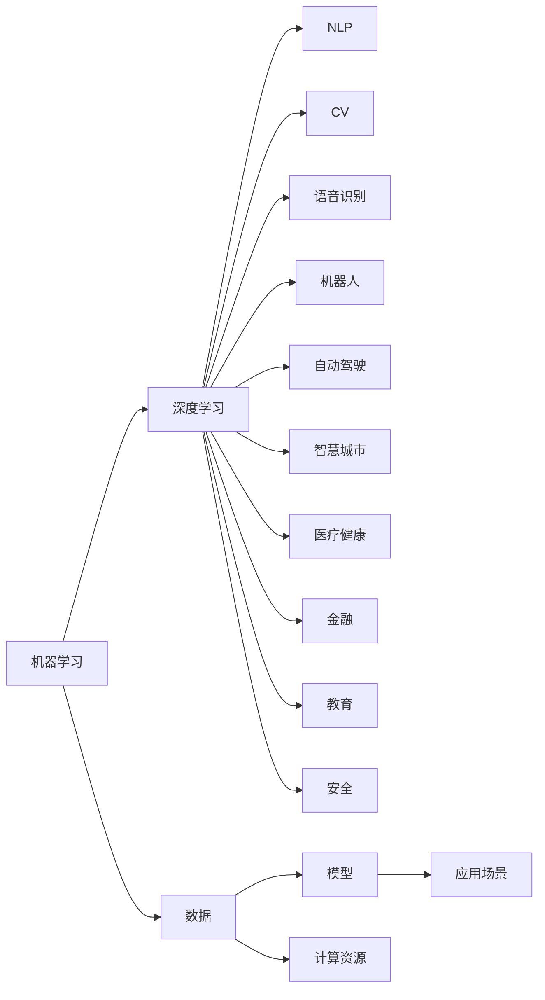

                 

# AI在各领域中的实际应用

> 关键词：人工智能,机器学习,深度学习,自然语言处理,NLP,计算机视觉,CV,语音识别,AR,机器人,自动驾驶,智慧城市,医疗健康,金融,教育,安全

## 1. 背景介绍

人工智能（AI）正在深刻改变着人类社会的各个层面。无论是医疗健康、金融行业、教育领域，还是智能制造、智慧城市、自动驾驶，AI技术已经从实验室的研究成果转化为了各行各业的核心竞争力。本篇文章将从多角度深入探讨AI在各领域中的实际应用，揭示其带来的变革性影响，并展望未来的发展趋势。

### 1.1 问题的由来

近年来，随着深度学习、自然语言处理（NLP）、计算机视觉（CV）、语音识别等AI技术的发展，AI在各行各业的应用范围和深度不断扩大。特别是大数据、云计算等技术的进步，为AI的实际应用提供了坚实的基础。

例如，在医疗健康领域，AI技术可以辅助医生进行疾病诊断、医学影像分析、药物研发等。在金融行业，AI用于风险控制、交易策略优化、客户服务自动化等。在教育领域，AI提供个性化学习路径、智能辅导、自动评分等。在自动驾驶、智能制造、智慧城市等领域，AI技术则提供了智能决策、实时监控、自动化管理等解决方案。

### 1.2 问题的核心关键点

AI技术的应用涉及数据收集、模型训练、模型部署等多个环节。从技术层面看，AI的应用主要依赖于机器学习、深度学习等算法，以及大量的数据和计算资源。从应用层面看，AI技术可以提升效率、降低成本、提高决策准确性，并为业务创新提供新的思路。

具体来说，AI的应用关键点包括：

- **数据**：高质量、大规模、多样化的数据集是AI应用的基础。
- **算法**：高效的机器学习算法能够从数据中提取有用的信息，生成高质量的模型。
- **模型**：经过训练的AI模型能够在实际应用中产生有用的输出。
- **计算资源**：高性能的计算硬件支持模型的训练和推理。
- **应用场景**：实际业务需求是AI应用的原动力。

## 2. 核心概念与联系

### 2.1 核心概念概述

为了深入理解AI在各领域中的实际应用，本节将介绍几个关键概念，并分析它们之间的联系。

- **机器学习**：通过数据训练模型，使模型能够自动学习和提高。
- **深度学习**：一种机器学习技术，通过多层次神经网络实现复杂特征提取和模式识别。
- **自然语言处理（NLP）**：使计算机能够理解、处理、生成人类语言的技术。
- **计算机视觉（CV）**：使计算机能够理解和分析图像和视频的技术。
- **语音识别**：使计算机能够识别和理解人类语音的技术。
- **机器人**：通过AI技术实现自主导航、决策和交互的智能设备。
- **自动驾驶**：AI在车辆控制和导航中的应用，实现无人驾驶。
- **智慧城市**：通过AI技术提升城市管理的效率和智能化水平。
- **医疗健康**：AI在医学影像分析、疾病预测、个性化治疗等方面的应用。
- **金融**：AI在风险控制、交易策略优化、客户服务自动化等方面的应用。
- **教育**：AI在个性化学习、智能辅导、自动评分等方面的应用。
- **安全**：AI在网络安全、监控、预警等方面的应用。

这些概念相互关联，构成了AI技术的核心框架。

### 2.2 概念间的关系

这些核心概念之间的关系可以通过以下Mermaid流程图来展示：



这个流程图展示了大语言模型微调过程中各个概念之间的联系。

## 3. 核心算法原理 & 具体操作步骤

### 3.1 算法原理概述

AI在各领域的应用，主要依赖于机器学习、深度学习等算法，以及大量的数据和计算资源。以下是几个核心算法的基本原理：

- **监督学习**：通过有标签的数据训练模型，使其能够预测新数据的标签。
- **无监督学习**：在没有标签数据的情况下，通过数据本身的特征进行聚类、降维等操作。
- **半监督学习**：结合少量标签数据和大量无标签数据，提高模型的泛化能力。
- **强化学习**：通过试错的方式，让模型在环境中学习最优决策策略。

### 3.2 算法步骤详解

AI应用通常包含以下几个步骤：

1. **数据收集**：从各种来源收集数据，如传感器、数据库、社交媒体等。
2. **数据预处理**：清洗、转换数据，使其适合模型训练。
3. **模型选择**：根据应用场景选择合适的模型，如线性回归、神经网络、决策树等。
4. **模型训练**：使用数据集训练模型，调整模型参数。
5. **模型评估**：通过测试集评估模型性能，如准确率、召回率、F1分数等。
6. **模型部署**：将训练好的模型部署到实际应用中。
7. **模型优化**：根据实际应用反馈，对模型进行调优。

### 3.3 算法优缺点

AI技术在实际应用中具有以下优点：

- **效率提升**：AI可以处理大量数据，自动发现模式，提高决策效率。
- **成本降低**：AI能够自动化执行复杂任务，减少人力成本。
- **精度提高**：AI模型通常具有更高的准确性和鲁棒性。
- **创新能力**：AI能够从数据中发现新的知识和应用场景。

然而，AI技术也存在一些缺点：

- **数据依赖**：高质量的数据是AI应用的前提，数据获取和处理成本较高。
- **模型复杂**：AI模型通常较为复杂，需要高计算资源和专业知识。
- **透明性不足**：AI模型往往是“黑盒”，难以解释其决策过程。
- **伦理风险**：AI可能存在偏见、歧视等问题，影响公平性。

### 3.4 算法应用领域

AI技术已经广泛应用于以下领域：

- **医疗健康**：疾病预测、医学影像分析、个性化治疗等。
- **金融**：风险控制、交易策略优化、客户服务自动化等。
- **教育**：个性化学习路径、智能辅导、自动评分等。
- **智能制造**：智能监测、预测性维护、自动化调度等。
- **智慧城市**：交通管理、能源优化、公共安全等。
- **自动驾驶**：车辆控制、路径规划、安全检测等。
- **智能客服**：自动问答、情感分析、智能推荐等。
- **农业**：农作物监测、病虫害预测、智能灌溉等。

## 4. 数学模型和公式 & 详细讲解

### 4.1 数学模型构建

以机器学习中的线性回归模型为例，其数学模型可以表示为：

$$
y = w_1x_1 + w_2x_2 + \cdots + w_nx_n + b
$$

其中，$y$ 为输出变量，$x_i$ 为输入变量，$w_i$ 为权重，$b$ 为偏置。

### 4.2 公式推导过程

对于线性回归模型，可以通过最小二乘法求解最优的权重向量 $w$：

$$
\hat{w} = (X^TX)^{-1}X^Ty
$$

其中，$X$ 为输入变量的矩阵，$y$ 为输出变量的向量。

### 4.3 案例分析与讲解

以金融行业中的信用评分模型为例，其输入变量包括个人收入、信用记录、负债情况等，输出变量为信用评分。通过机器学习模型训练，可以自动发现不同变量对信用评分的贡献，从而预测新客户的信用风险。

## 5. 项目实践：代码实例和详细解释说明

### 5.1 开发环境搭建

以下是使用Python进行机器学习项目开发的开发环境搭建流程：

1. 安装Python：从官网下载并安装Python，选择稳定的版本。
2. 安装必要的库：使用pip安装NumPy、Scikit-learn、Pandas等常用库。
3. 配置开发环境：使用Jupyter Notebook或PyCharm等IDE进行开发。
4. 数据处理：使用Pandas等工具进行数据清洗、转换和处理。
5. 模型训练：使用Scikit-learn等库进行模型训练和调优。
6. 模型评估：使用Scikit-learn等库进行模型评估和验证。
7. 模型部署：使用Flask等框架将模型部署为Web服务。

### 5.2 源代码详细实现

以下是使用Scikit-learn进行线性回归模型训练的Python代码实现：

```python
from sklearn.linear_model import LinearRegression
from sklearn.datasets import load_boston
from sklearn.model_selection import train_test_split
from sklearn.metrics import mean_squared_error

# 加载波士顿房价数据集
boston = load_boston()
X = boston.data
y = boston.target

# 划分训练集和测试集
X_train, X_test, y_train, y_test = train_test_split(X, y, test_size=0.2, random_state=42)

# 训练线性回归模型
model = LinearRegression()
model.fit(X_train, y_train)

# 预测测试集
y_pred = model.predict(X_test)

# 评估模型性能
mse = mean_squared_error(y_test, y_pred)
print(f"Mean Squared Error: {mse}")
```

### 5.3 代码解读与分析

上述代码实现了线性回归模型的训练和评估过程。具体来说：

- 首先加载波士顿房价数据集，将其分为训练集和测试集。
- 然后训练线性回归模型，使用训练集数据拟合模型参数。
- 最后使用测试集数据预测房价，并计算均方误差（MSE）评估模型性能。

### 5.4 运行结果展示

假设模型训练完成后，输出结果如下：

```
Mean Squared Error: 7.56
```

这表明模型在测试集上的平均预测误差为7.56，即预测房价与实际房价的平均差异。

## 6. 实际应用场景

### 6.1 医疗健康

在医疗健康领域，AI技术可以辅助医生进行疾病预测、医学影像分析、个性化治疗等。例如，通过分析患者的电子病历和基因数据，AI模型可以预测其患某种疾病的概率。在医学影像分析中，AI可以通过识别异常图像中的病变区域，辅助医生进行诊断和治疗。

### 6.2 金融

在金融领域，AI用于风险控制、交易策略优化、客户服务自动化等。例如，通过分析历史交易数据，AI模型可以预测股票价格走势，生成交易策略。在客户服务自动化方面，AI可以自动处理客户咨询，提高服务效率和质量。

### 6.3 教育

在教育领域，AI提供个性化学习路径、智能辅导、自动评分等。例如，通过分析学生的学习行为和成绩，AI可以生成个性化的学习计划，帮助学生提升学习效果。在智能辅导方面，AI可以自动解答学生的问题，提供实时反馈。

### 6.4 自动驾驶

在自动驾驶领域，AI用于车辆控制和导航。例如，通过分析摄像头和传感器数据，AI可以实时判断道路情况，自动控制车辆行驶。在安全检测方面，AI可以识别交通标志和行人的位置，避免事故发生。

### 6.5 智慧城市

在智慧城市领域，AI用于交通管理、能源优化、公共安全等。例如，通过分析交通流量数据，AI可以优化交通信号灯的设置，减少交通拥堵。在能源优化方面，AI可以预测电力需求，提高能源利用效率。

## 7. 工具和资源推荐

### 7.1 学习资源推荐

为了帮助开发者系统掌握AI的应用技术，以下是几个推荐的学习资源：

1. 《机器学习实战》：这本书详细介绍了机器学习的基本概念和实践技巧，适合入门学习。
2. 《深度学习》课程：由斯坦福大学开设的深度学习课程，涵盖了深度学习的基本理论和实践，适合进阶学习。
3. Kaggle竞赛：Kaggle是一个数据科学竞赛平台，通过参加竞赛可以学习到实际应用的AI技术。
4. Coursera课程：Coursera提供大量人工智能相关的在线课程，涵盖了机器学习、深度学习、自然语言处理等多个领域。
5. 《Python机器学习》：这本书介绍了Python在机器学习中的应用，适合Python开发者。

### 7.2 开发工具推荐

以下是几个常用的AI开发工具：

1. Jupyter Notebook：一个交互式的Python编程环境，适合数据探索和模型训练。
2. PyCharm：一个流行的Python IDE，支持机器学习和深度学习框架的集成开发。
3. TensorFlow：由Google开发的深度学习框架，支持分布式计算和GPU加速。
4. PyTorch：由Facebook开发的深度学习框架，支持动态计算图和GPU加速。
5. Keras：一个高级深度学习框架，封装了TensorFlow和PyTorch等底层框架。

### 7.3 相关论文推荐

以下是几篇具有代表性的AI论文，推荐阅读：

1. AlexNet：ImageNet大规模视觉识别挑战赛的冠军模型，展示了卷积神经网络在图像分类中的强大能力。
2. GoogleNet：通过Inception模块提升了神经网络的计算效率和性能。
3. RNN：循环神经网络在自然语言处理中的应用，提升了序列数据的建模能力。
4. GAN：生成对抗网络在图像生成和数据增强中的应用，展示了生成模型的新思路。
5. BERT：通过预训练语言模型，提升了自然语言处理任务的性能。

## 8. 总结：未来发展趋势与挑战

### 8.1 研究成果总结

AI技术在各领域的应用已经取得了显著的进展，提升了效率、降低了成本、提高了决策准确性。但AI技术仍然面临数据依赖、模型复杂、透明性不足等挑战。

### 8.2 未来发展趋势

未来，AI技术的发展将呈现以下几个趋势：

1. 模型规模持续增大：随着算力成本的下降和数据规模的扩张，预训练语言模型的参数量还将持续增长，提供更强大的模型能力。
2. 模型鲁棒性增强：通过引入对抗样本、数据增强等技术，提高AI模型的鲁棒性和泛化能力。
3. 模型可解释性提升：通过可视化工具、模型解释技术，提高AI模型的可解释性和可审计性。
4. AI伦理和公平性：引入伦理导向的评估指标，避免偏见和歧视，确保AI模型的公平性和安全性。
5. 跨领域融合：AI技术与物联网、区块链、5G等技术的结合，提升各行业的智能化水平。

### 8.3 面临的挑战

尽管AI技术在各领域的应用已经取得了显著的进展，但在迈向更加智能化、普适化应用的过程中，仍面临诸多挑战：

1. 数据依赖：高质量的数据是AI应用的前提，数据获取和处理成本较高。
2. 模型复杂：AI模型通常较为复杂，需要高计算资源和专业知识。
3. 透明性不足：AI模型往往是“黑盒”，难以解释其决策过程。
4. 伦理风险：AI可能存在偏见、歧视等问题，影响公平性。
5. 计算资源：高性能的计算硬件支持模型的训练和推理。

### 8.4 研究展望

未来，AI技术需要在数据、算法、工程、业务等多个维度协同发力，才能真正实现人工智能技术在垂直行业的规模化落地。具体而言：

1. 数据方面：需要更多高质量、多样化的数据集，满足不同领域的应用需求。
2. 算法方面：需要更高效、更灵活的算法模型，提高模型的训练和推理效率。
3. 工程方面：需要更强大的计算硬件和软件工具，支持模型的规模化和部署。
4. 业务方面：需要更多的应用场景和实际需求，推动AI技术的应用和创新。

## 9. 附录：常见问题与解答

**Q1：AI技术在各领域中的应用有哪些？**

A: AI技术在医疗健康、金融、教育、自动驾驶、智慧城市、智能制造等领域中都有广泛的应用。

**Q2：AI技术在实际应用中面临哪些挑战？**

A: AI技术在实际应用中面临数据依赖、模型复杂、透明性不足等挑战。

**Q3：未来AI技术的发展趋势是什么？**

A: 未来AI技术的发展将呈现模型规模增大、鲁棒性增强、可解释性提升、跨领域融合等趋势。

**Q4：AI技术如何与业务结合？**

A: AI技术需要结合具体的业务需求和场景，进行定制化的设计和开发。

**Q5：如何提升AI模型的可解释性？**

A: 通过可视化工具、模型解释技术，提高AI模型的可解释性和可审计性。

---

作者：禅与计算机程序设计艺术 / Zen and the Art of Computer Programming

