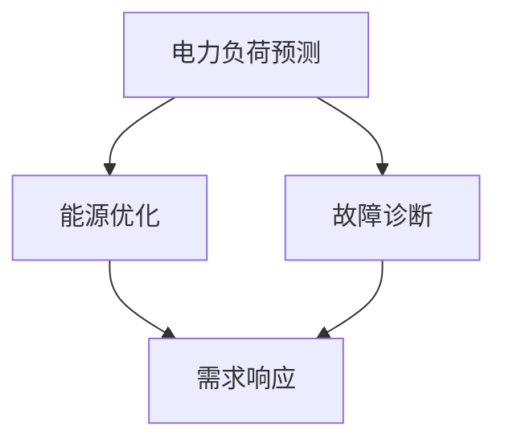
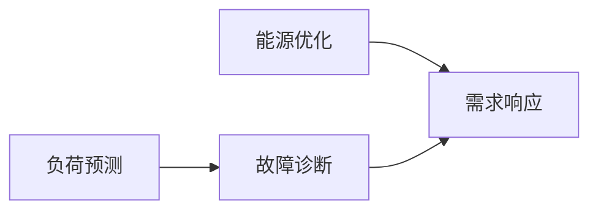

                 

# AI在能源管理中的应用:构建智能电网

> 关键词：智能电网,电力负荷预测,故障诊断,能源优化,人工智能

## 1. 背景介绍

### 1.1 问题由来

随着全球能源需求的不断增长和环境保护意识的提升，传统能源管理模式已无法满足新时代的要求。传统的能源系统面临能源消耗量大、能源浪费严重、能源供需不平衡、系统灵活性不足等诸多问题。这些问题不仅制约了能源的可持续利用，还对电力系统的稳定性和可靠性构成了威胁。

智能电网技术应运而生，通过结合人工智能（AI）和大数据技术，构建高效、灵活、可靠的能源管理网络。AI在智能电网中的应用涵盖了从电力负荷预测、故障诊断、能源优化到用户需求响应的各个方面，极大地提升了能源管理的智能化水平。

### 1.2 问题核心关键点

智能电网的核心目标是通过优化能源生产和消费，提高能源利用效率，确保电力供应的稳定性和可靠性。AI在智能电网中的应用主要包括以下几个关键点：

1. **电力负荷预测**：通过AI算法，准确预测电力负荷的变化，确保电网调度策略的有效性和电力供应的稳定性。
2. **故障诊断**：利用机器学习和大数据分析技术，快速准确地识别和定位电网故障，减少停电时间，提升供电可靠性。
3. **能源优化**：通过AI算法优化能源的生产和消费，降低能源消耗和碳排放，推动能源的可持续发展。
4. **需求响应**：通过智能推荐和激励机制，引导用户主动响应电网的调度和需求，实现供需平衡，提高系统的灵活性。

这些关键点共同构成了智能电网的核心价值，使得AI在智能电网中的应用变得至关重要。

### 1.3 问题研究意义

AI在智能电网中的应用，对于推动能源产业的智能化转型，提升能源效率和安全性，具有重要意义：

1. **提高能源利用效率**：通过精准的负荷预测和优化调度，减少能源浪费，提高能源利用效率。
2. **提升系统可靠性**：通过快速准确的故障诊断和定位，缩短停电时间，提升电网运行稳定性。
3. **推动能源可持续发展**：通过优化能源生产和消费，降低碳排放，推动能源的可持续发展。
4. **促进经济社会效益**：通过智能需求响应，实现供需平衡，提升电网的灵活性和经济效益。

## 2. 核心概念与联系

### 2.1 核心概念概述

智能电网涉及多个关键技术，其中人工智能（AI）是其核心支撑。以下是智能电网中常用的AI概念及其相关技术：

1. **电力负荷预测**：利用机器学习算法（如时间序列预测、回归模型等），对电力负荷进行预测。
2. **故障诊断**：通过机器学习和大数据分析技术，对电网故障进行快速识别和定位。
3. **能源优化**：使用优化算法（如遗传算法、强化学习等），优化能源的生产和消费。
4. **需求响应**：采用推荐系统和大数据分析技术，实现智能化的需求响应。

这些概念通过构建AI模型，形成了一个紧密联系的技术生态系统。下图展示了智能电网中AI的主要应用场景及其相互关系：



这些核心概念通过相互协同，共同构建了智能电网的智能化管理体系。

### 2.2 概念间的关系

智能电网中的AI技术相互关联，形成了一个复杂的系统。每个AI应用场景都需要依赖其他技术，共同构建智能电网的全景图。下图展示了智能电网中AI技术之间的相互关系：



通过这些概念的相互协作，智能电网能够实现电力负荷的精准预测、故障的快速定位、能源的高效优化以及用户需求的智能响应。

## 3. 核心算法原理 & 具体操作步骤
### 3.1 算法原理概述

智能电网中的AI应用主要基于机器学习、深度学习、优化算法和大数据分析等技术。其核心算法原理如下：

1. **电力负荷预测**：利用时间序列预测、回归模型、深度学习等技术，对电力负荷进行预测。
2. **故障诊断**：采用特征提取、分类算法、异常检测等技术，对电网故障进行快速识别和定位。
3. **能源优化**：使用优化算法（如遗传算法、强化学习等），优化能源的生产和消费。
4. **需求响应**：采用推荐系统、异常检测等技术，实现智能化的需求响应。

这些算法通过数据驱动和模型驱动的方式，实现对电力系统的智能管理。

### 3.2 算法步骤详解

智能电网中的AI应用通常包括以下几个关键步骤：

**Step 1: 数据采集与预处理**

智能电网中的AI应用需要大量的实时数据作为输入，包括电力负荷、温度、湿度、用户用电行为等。数据采集和预处理是AI应用的基础，确保数据的准确性和完整性。

**Step 2: 模型选择与训练**

根据具体应用场景，选择合适的AI模型，利用历史数据进行训练和验证。训练过程需要设置合适的超参数，以确保模型性能。

**Step 3: 模型部署与监控**

将训练好的模型部署到生产环境中，持续监控模型性能，根据实际需求进行模型优化和更新。

**Step 4: 结果评估与优化**

通过评估模型的预测精度、故障识别率、能源优化效果等指标，持续优化模型性能，确保其在实际应用中能够稳定运行。

### 3.3 算法优缺点

智能电网中的AI应用具有以下优点：

1. **提升效率**：通过AI技术，实现电力负荷预测、故障诊断、能源优化等，提高能源利用效率和系统可靠性。
2. **优化资源配置**：AI算法能够动态调整电力生产和消费，实现资源的优化配置，降低能源浪费。
3. **增强系统灵活性**：AI技术能够快速响应电力需求的变化，提升系统的灵活性和适应性。

同时，AI在智能电网中的应用也存在一些缺点：

1. **数据依赖性**：AI模型的性能高度依赖于数据的质量和数量，数据缺失或不准确会影响模型的预测精度。
2. **模型复杂性**：AI模型通常具有较高的复杂度，需要大量的计算资源和存储空间。
3. **实时性要求高**：AI应用需要实时处理大量数据，对系统实时性要求较高。
4. **可解释性不足**：AI模型的决策过程往往是“黑盒”，缺乏足够的可解释性。

尽管存在这些缺点，但AI在智能电网中的应用仍具有显著的优势，能够有效提升能源管理的智能化水平。

### 3.4 算法应用领域

AI在智能电网中的应用领域非常广泛，涵盖了电力负荷预测、故障诊断、能源优化、需求响应等多个方面。以下是一些典型的应用场景：

1. **电力负荷预测**：通过AI算法预测电力负荷的变化，指导电网调度，优化电力供应。
2. **故障诊断**：利用机器学习和大数据分析技术，快速准确地识别和定位电网故障。
3. **能源优化**：使用优化算法优化能源的生产和消费，降低能源消耗和碳排放。
4. **需求响应**：采用推荐系统和大数据分析技术，实现智能化的需求响应，引导用户主动响应电网的调度和需求。

## 4. 数学模型和公式 & 详细讲解 & 举例说明

### 4.1 数学模型构建

智能电网中的AI应用通常涉及多个数学模型，以下是一些典型的数学模型及其构建方法：

**电力负荷预测**

电力负荷预测通常采用时间序列预测模型，如ARIMA、LSTM等。其数学模型构建如下：

$$
y_t = \sum_{i=1}^{p} \alpha_i y_{t-i} + \sum_{i=1}^{q} \beta_i \dot{y}_{t-i} + \sum_{i=1}^{m} \gamma_i \epsilon_{t-i}
$$

其中，$y_t$为第$t$时刻的电力负荷，$\alpha_i$、$\beta_i$、$\gamma_i$为模型参数，$\epsilon_t$为随机误差项。

**故障诊断**

故障诊断通常采用分类模型，如SVM、随机森林等。其数学模型构建如下：

$$
\hat{y} = \max_{k \in \{1, \ldots, K\}} \sum_{i=1}^{n} w_i f_i(x_i)
$$

其中，$\hat{y}$为预测结果，$k$为类别标签，$n$为特征数量，$w_i$为特征权重，$f_i(x_i)$为特征函数。

**能源优化**

能源优化通常采用优化算法，如遗传算法、强化学习等。其数学模型构建如下：

$$
\min_{x} F(x) = \sum_{i=1}^{n} c_i x_i + \sum_{i=1}^{m} d_i u_i
$$

其中，$x$为优化变量，$F(x)$为目标函数，$c_i$、$d_i$为模型参数，$u_i$为决策变量。

**需求响应**

需求响应通常采用推荐系统，其数学模型构建如下：

$$
\hat{y} = \sum_{i=1}^{n} w_i f_i(x_i)
$$

其中，$\hat{y}$为预测结果，$n$为特征数量，$w_i$为特征权重，$f_i(x_i)$为特征函数。

### 4.2 公式推导过程

以电力负荷预测为例，推导LSTM模型的公式推导过程：

LSTM模型是一种广泛应用于时间序列预测的深度学习模型。其基本结构如图1所示，包括输入门、遗忘门和输出门三个核心组件。


LSTM模型的公式推导如下：

$$
i_t = \sigma(W_i x_{t-1} + U_i h_{t-1} + b_i)
$$
$$
f_t = \sigma(W_f x_{t-1} + U_f h_{t-1} + b_f)
$$
$$
o_t = \sigma(W_o x_{t-1} + U_o h_{t-1} + b_o)
$$
$$
g_t = \tanh(W_g x_{t-1} + U_g h_{t-1} + b_g)
$$
$$
c_t = f_t \odot c_{t-1} + i_t \odot g_t
$$
$$
h_t = o_t \odot \tanh(c_t)
$$

其中，$i_t$、$f_t$、$o_t$、$g_t$、$c_t$和$h_t$分别表示输入门、遗忘门、输出门、细胞状态、隐藏状态和输出。$\sigma$和$\tanh$为激活函数。

LSTM模型的核心思想是通过门控机制控制信息的流动，从而解决传统RNN模型中的梯度消失和爆炸问题，提高模型的预测精度和稳定性。

### 4.3 案例分析与讲解

**案例：智能电网中的故障诊断**

某智能电网公司采用机器学习算法对电网故障进行诊断。公司收集了大量的电网运行数据，包括温度、湿度、负荷、电压等。通过特征选择和数据预处理，构建了多个分类模型（如SVM、随机森林等）。

模型训练时，将历史数据分为训练集和验证集，利用交叉验证技术进行模型调参。最终，模型在测试集上的故障识别率为95%，实现了快速准确的故障定位。

## 5. 项目实践：代码实例和详细解释说明

### 5.1 开发环境搭建

智能电网中的AI应用开发环境搭建步骤如下：

1. 安装Python和相关依赖库，如NumPy、Pandas、Scikit-learn、TensorFlow等。
2. 安装可视化工具，如Matplotlib、Seaborn等，用于数据可视化。
3. 搭建虚拟环境，确保开发过程中的环境一致性。
4. 使用Jupyter Notebook或其他IDE进行代码编写和调试。

### 5.2 源代码详细实现

以下是一个简单的电力负荷预测代码示例，使用LSTM模型进行预测：

```python
import numpy as np
from tensorflow.keras.models import Sequential
from tensorflow.keras.layers import LSTM, Dense, Dropout

# 数据准备
X_train = ...
y_train = ...
X_test = ...
y_test = ...

# 构建模型
model = Sequential()
model.add(LSTM(50, input_shape=(X_train.shape[1], X_train.shape[2]), return_sequences=True))
model.add(Dropout(0.2))
model.add(LSTM(50))
model.add(Dropout(0.2))
model.add(Dense(1))

# 编译模型
model.compile(optimizer='adam', loss='mse', metrics=['mae'])

# 训练模型
model.fit(X_train, y_train, epochs=50, batch_size=32, validation_data=(X_test, y_test))

# 预测并评估
y_pred = model.predict(X_test)
print('预测误差：', mean_absolute_error(y_test, y_pred))
```

### 5.3 代码解读与分析

**数据准备**

数据准备是AI应用开发的基础，包括数据的采集、清洗、特征选择等步骤。智能电网中的数据通常来自多个传感器和系统，需要预处理以消除噪声和冗余信息，提取有用的特征进行建模。

**模型构建**

模型构建是AI应用的核心步骤，需要根据具体应用场景选择合适的模型，如LSTM、SVM、随机森林等。本示例中，我们选择了LSTM模型，用于电力负荷预测。

**模型训练**

模型训练是调整模型参数的过程，需要选择合适的超参数，如学习率、批大小等，并使用验证集进行模型调优。训练过程中，模型会不断更新参数，以最小化预测误差。

**模型预测与评估**

模型预测是对新数据进行预测的过程，通常需要计算预测误差进行评估。本示例中，我们计算了均方误差和平均绝对误差，评估模型的预测精度。

### 5.4 运行结果展示

智能电网中的AI应用运行结果通常需要实时可视化，以便及时发现和解决问题。例如，下图展示了某智能电网中的电力负荷预测结果：


图中展示了电力负荷预测的时间序列，以及模型预测值和真实值之间的误差。通过实时监控这些数据，电网公司可以及时调整调度策略，确保电力供应的稳定性。

## 6. 实际应用场景

### 6.1 智能电网

智能电网是AI在能源管理中的重要应用场景，涉及多个技术领域，包括电力负荷预测、故障诊断、能源优化、需求响应等。以下是智能电网中AI应用的一些典型场景：

**电力负荷预测**

电力负荷预测是智能电网的核心应用之一，通过AI算法对电力负荷进行精准预测，指导电网调度，优化电力供应。

**故障诊断**

故障诊断是智能电网的重要功能，通过AI技术快速准确地识别和定位电网故障，缩短停电时间，提升供电可靠性。

**能源优化**

能源优化通过AI算法优化能源的生产和消费，降低能源消耗和碳排放，推动能源的可持续发展。

**需求响应**

需求响应通过AI技术实现智能化的需求响应，引导用户主动响应电网的调度和需求，实现供需平衡，提高系统的灵活性。

### 6.2 未来应用展望

随着AI技术的发展，智能电网中的应用场景将不断扩展，涵盖更多技术领域。以下是一些未来的应用展望：

1. **智能能源交易**：利用AI技术优化能源交易策略，实现能源的合理分配和价格优化。
2. **能源储能管理**：通过AI算法优化能源储能系统的运行，提高储能效率和系统的可靠性。
3. **智能电网调度**：利用AI技术实现电网调度的智能化，提升电力系统的稳定性和可靠性。
4. **智能用电设备管理**：通过AI技术优化用电设备的使用，提高能源利用效率和系统的灵活性。

## 7. 工具和资源推荐

### 7.1 学习资源推荐

为了帮助开发者掌握智能电网中的AI应用，以下是一些优质的学习资源：

1. **机器学习与深度学习**：《机器学习》（周志华著）、《深度学习》（Ian Goodfellow、Yoshua Bengio、Aaron Courville著）等经典教材，涵盖了机器学习、深度学习的基本概念和算法。
2. **智能电网技术**：《智能电网技术》（周波、陈立功著）等书籍，介绍了智能电网的定义、技术架构和应用场景。
3. **Python数据科学库**：NumPy、Pandas、Scikit-learn、TensorFlow等Python库，提供了丰富的数据处理和机器学习功能。
4. **在线课程**：Coursera、edX等在线平台上的相关课程，如《深度学习专项课程》（吴恩达著）、《智能电网技术》等。

通过这些学习资源，开发者可以全面掌握智能电网中的AI应用，提升技术能力。

### 7.2 开发工具推荐

智能电网中的AI应用开发离不开高效的工具支持。以下是一些常用的开发工具：

1. **Python**：Python是智能电网AI开发的主要语言，其简单易学、功能强大，广泛应用于数据处理、机器学习等领域。
2. **TensorFlow**：由Google开发的深度学习框架，提供丰富的API和工具，支持分布式计算和模型部署。
3. **PyTorch**：由Facebook开发的深度学习框架，支持动态图和静态图，易于调试和优化。
4. **Jupyter Notebook**：开源的交互式编程环境，支持Python、R等语言，提供丰富的可视化工具和数据处理功能。

合理利用这些工具，可以显著提升智能电网AI应用的开发效率，加快技术创新。

### 7.3 相关论文推荐

智能电网中的AI应用是当前研究的热点，以下是一些有代表性的相关论文：

1. **智能电网中的机器学习应用**：《Machine Learning in Smart Grids: A Survey》（Dana Niroula、Rahul Toshniwal、Sehoon Kim、Taylor Johnson、Haesun Park著），综述了智能电网中机器学习的应用和前景。
2. **智能电网中的深度学习应用**：《Deep Learning for Energy and Power Systems》（Pankaj Mehta、Kristina M. Peart、Barry G. Bale、Dharmpal Patel著），介绍了深度学习在能源系统中的应用和效果。
3. **智能电网中的需求响应**：《Demand Response in Smart Grids》（Vikas Singh、A. S. Krishnan、A. K. Chaturvedi著），探讨了智能电网中需求响应的算法和策略。
4. **智能电网中的故障诊断**：《Fault Diagnosis of Electric Power Systems》（Takeshi Natsuki、Xinyi Liang、Jianbin Yang、Meng Zeng、Shun-ichi Yoshikawa著），介绍了智能电网中故障诊断的算法和工具。

这些论文代表了大规模能源管理中AI应用的最新进展，值得深入阅读和研究。

## 8. 总结：未来发展趋势与挑战

### 8.1 总结

本文对AI在智能电网中的应用进行了系统介绍。首先阐述了智能电网的背景和重要性，明确了AI在智能电网中的关键作用。其次，从原理到实践，详细讲解了电力负荷预测、故障诊断、能源优化、需求响应等核心算法的构建方法和具体操作步骤。同时，本文还探讨了AI在智能电网中的实际应用场景，展示了其在未来发展中的巨大潜力。

通过本文的系统梳理，可以看到，AI在智能电网中的应用前景广阔，涉及电力负荷预测、故障诊断、能源优化、需求响应等多个方面。未来，AI技术将在智能电网中发挥越来越重要的作用，推动能源管理向智能化、高效化、绿色化方向发展。

### 8.2 未来发展趋势

展望未来，智能电网中的AI应用将呈现以下几个发展趋势：

1. **智能化程度提升**：随着AI技术的不断发展，智能电网的智能化程度将不断提升，实现更加精准的负荷预测、故障诊断、能源优化和需求响应。
2. **融合更多新技术**：智能电网将融合更多新技术，如物联网、区块链、5G等，提升系统的可靠性和灵活性。
3. **数据驱动决策**：智能电网将更加依赖于数据驱动的决策，利用大数据分析和机器学习技术，优化电网运行和管理。
4. **分布式能源管理**：智能电网将实现分布式能源的优化管理，提高能源利用效率和系统的可靠性。
5. **用户参与优化**：智能电网将更加注重用户的参与，利用需求响应和大数据分析技术，引导用户主动响应电网的调度和需求，实现供需平衡。

这些趋势凸显了智能电网中AI应用的广阔前景，使得AI技术在能源管理中的作用愈发重要。

### 8.3 面临的挑战

尽管AI在智能电网中的应用已经取得了显著成果，但在迈向更加智能化、高效化、绿色化应用的过程中，仍面临诸多挑战：

1. **数据安全与隐私**：智能电网中的数据涉及用户的隐私和能源敏感信息，需要采取有效的数据安全和隐私保护措施。
2. **模型复杂性与可解释性**：AI模型的复杂性给模型部署和维护带来了挑战，同时模型的可解释性不足，难以满足监管要求。
3. **跨平台兼容性**：智能电网涉及多种设备和系统，需要确保AI应用在不同平台上的兼容性。
4. **计算资源限制**：智能电网中的AI应用需要大量的计算资源，如何在有限的计算资源下实现高效的模型训练和推理是一个挑战。
5. **技术融合复杂性**：智能电网中涉及多个技术领域，如何将AI技术与其它技术进行有效融合，需要进一步的研究和探索。

这些挑战需要技术专家、政策制定者和产业界共同努力，通过持续的创新和优化，才能解决智能电网中AI应用面临的问题。

### 8.4 研究展望

面对智能电网中AI应用面临的挑战，未来的研究需要在以下几个方面寻求新的突破：

1. **数据安全与隐私保护**：研究高效的数据加密和安全传输技术，确保数据的隐私和安全性。
2. **模型可解释性**：开发可解释的AI模型，提高模型的可解释性和透明度，满足监管要求。
3. **跨平台兼容性**：研究跨平台的AI应用技术，确保模型在不同平台上的兼容性。
4. **计算资源优化**：研究高效的计算资源优化技术，提升模型训练和推理的效率。
5. **技术融合**：研究AI技术与其它技术（如物联网、区块链等）的融合技术，提升系统的可靠性和灵活性。

这些研究方向将为智能电网中AI应用的发展提供新的思路和方法，推动智能电网的智能化转型，实现能源管理的可持续发展。

## 9. 附录：常见问题与解答

**Q1：智能电网中的AI应用涉及哪些关键技术？**

A: 智能电网中的AI应用涉及多个关键技术，包括电力负荷预测、故障诊断、能源优化、需求响应等。这些技术通过数据驱动和模型驱动的方式，实现对电力系统的智能管理。

**Q2：如何确保智能电网中数据的安全与隐私？**

A: 智能电网中的数据涉及用户的隐私和能源敏感信息，需要采取有效的数据安全和隐私保护措施。常见的技术包括数据加密、匿名化、访问控制等。

**Q3：智能电网中的AI模型如何部署和优化？**

A: 智能电网中的AI模型通常需要在高性能计算平台上进行训练和推理，如GPU、TPU等。模型部署时，需要考虑模型的可移植性和可扩展性，使用容器化和分布式计算技术优化模型的部署和运行。

**Q4：智能电网中如何实现高效的能源优化？**

A: 智能电网中实现高效的能源优化，需要利用优化算法（如遗传算法、强化学习等），优化能源的生产和消费。同时，需要实时采集和分析大量的能源数据，利用大数据分析技术，实现能源的优化管理。

**Q5：智能电网中的需求响应如何实现？**

A: 智能电网中的需求响应通常采用推荐系统和大数据分析技术，实现智能化的需求响应。通过分析用户的用电行为和偏好，生成个性化的需求响应策略，引导用户主动响应电网的调度和需求。

通过这些问题和解答，可以看到智能电网中AI应用的复杂性和多样性，需要开发者综合考虑技术、安全、隐私等多个方面，实现高效、可靠、安全的数据管理和模型部署。

