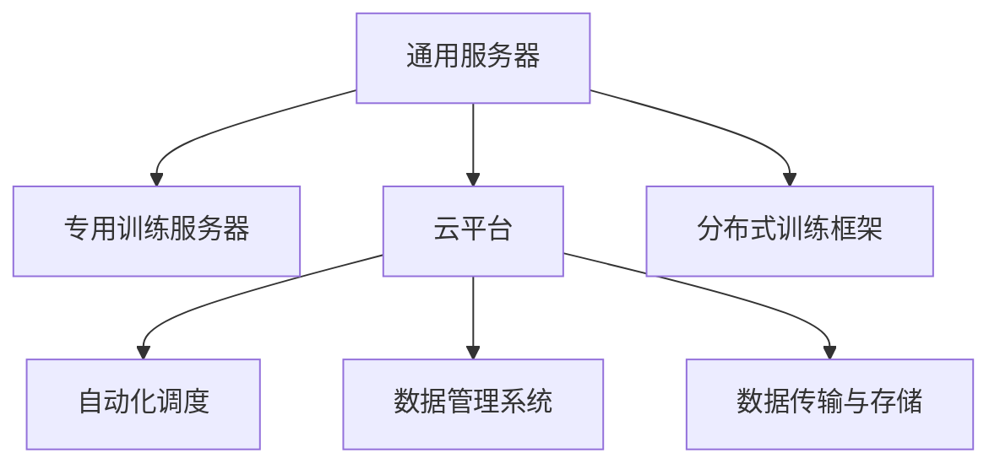
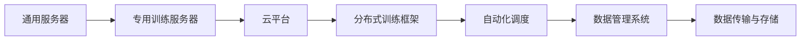
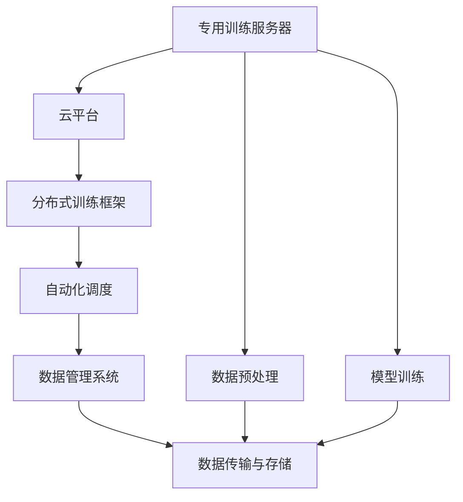
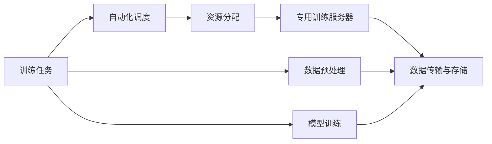
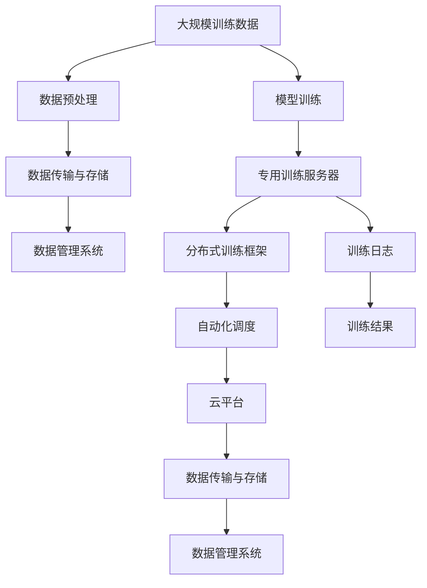

                 

# AI基础设施的演进:适应大规模训练需求

## 1. 背景介绍

### 1.1 问题由来
随着深度学习技术的蓬勃发展，大规模训练需求日益增长。从图像分类到自然语言处理，从推荐系统到自动驾驶，大规模训练需求已经成为推动人工智能技术进步的重要驱动力。然而，传统的基础设施，如通用服务器、CPU等，难以满足大规模深度学习训练的硬件需求。这不仅限制了研究进展，也阻碍了人工智能技术的广泛应用。

### 1.2 问题核心关键点
为了适应大规模训练需求，从通用服务器到专用训练基础设施，再到云平台和各种分布式训练框架，AI基础设施在过去十年中经历了显著的演进。这一演进过程涉及硬件架构、软件框架、数据管理、自动化调度等多个方面，大大提升了训练效率和模型性能。

### 1.3 问题研究意义
研究AI基础设施的演进，对于理解如何高效支撑大规模训练、推动人工智能技术的广泛应用具有重要意义：

1. 加速研究进展：基础设施的改进可以显著缩短模型的训练时间，加速人工智能技术的研发进程。
2. 降低成本：通过优化资源利用，降低训练成本，使得更多中小企业和研究机构能够投入资源进行AI研究。
3. 提升模型性能：高效的训练基础设施可以提供更好的计算资源，提升模型在特定任务上的表现。
4. 促进应用落地：基础设施的演进有助于将先进的AI技术转化为实际应用，推动各行各业的智能化升级。
5. 激发技术创新：不断演进的AI基础设施不断推动技术前沿，催生新的AI技术和应用场景。

## 2. 核心概念与联系

### 2.1 核心概念概述

为更好地理解AI基础设施的演进，本节将介绍几个密切相关的核心概念：

- **通用服务器**：传统的计算资源，支持各种类型的应用程序和计算任务。
- **专用训练服务器**：专门用于深度学习训练的硬件设备，如NVIDIA GPU、TPU等。
- **云平台**：提供计算、存储、网络等资源的弹性服务，如AWS、Google Cloud、阿里云等。
- **分布式训练框架**：支持多台计算设备并行训练的编程框架，如TensorFlow、PyTorch等。
- **自动化调度**：自动分配和管理计算资源的系统，如Kubernetes、Slurm等。
- **数据管理系统**：用于高效存储、管理和检索大规模数据的系统，如Hadoop、Spark等。
- **数据传输与存储**：在分布式训练中，用于数据传输和存储的系统，如DDN、S3等。

这些核心概念之间的逻辑关系可以通过以下Mermaid流程图来展示：



这个流程图展示了大规模训练基础设施的核心概念及其之间的关系：

1. 传统通用服务器为最早的基础设施类型，逐步被专用训练服务器取代。
2. 云平台通过弹性资源管理，支持专用训练服务器的应用。
3. 分布式训练框架提供计算设备间的协同训练能力。
4. 自动化调度系统优化资源分配，提升训练效率。
5. 数据管理系统和数据传输存储系统支持大规模数据处理和传输。

### 2.2 概念间的关系

这些核心概念之间存在着紧密的联系，形成了AI基础设施的完整生态系统。下面我们通过几个Mermaid流程图来展示这些概念之间的关系。

#### 2.2.1 AI基础设施的演进路径



这个流程图展示了AI基础设施从通用服务器到专用训练服务器，再到云平台和分布式训练框架的演进路径。

#### 2.2.2 基础设施与训练的集成



这个流程图展示了专用训练服务器如何与云平台、分布式训练框架、数据管理系统和数据传输存储系统集成，共同支持大规模训练的整个过程。

#### 2.2.3 自动化调度与资源管理



这个流程图展示了自动化调度如何优化资源分配，支持多台专用训练服务器并行训练。

### 2.3 核心概念的整体架构

最后，我们用一个综合的流程图来展示这些核心概念在大规模训练过程中的整体架构：



这个综合流程图展示了从大规模训练数据到模型训练结果的全过程，其中各个系统组件协同工作，共同支持大规模训练任务的执行。

## 3. 核心算法原理 & 具体操作步骤
### 3.1 算法原理概述

大规模训练的算法原理主要基于并行计算和分布式计算技术。在大规模训练中，由于单个计算设备的计算能力有限，需要通过并行计算将训练任务分割成多个子任务，分配到多台计算设备上同时处理，最终通过数据并行、模型并行等方式实现高效训练。

具体而言，大规模训练的算法原理包括以下几个关键步骤：

1. **数据并行**：将训练数据分为多个部分，分配到不同的计算设备上进行独立计算，最后通过聚合数据更新模型参数。

2. **模型并行**：将模型的不同层或不同部分分布在不同的计算设备上，通过分布式计算框架进行协同计算，最终将模型参数更新同步到主节点。

3. **自动混合精度**：将计算精度从浮点数降为混合精度（如FP16），减少内存占用和计算量，同时保持较高的精度。

4. **动态内存管理**：根据计算资源的使用情况，动态分配和释放内存，优化资源利用率。

### 3.2 算法步骤详解

以下是一个典型的大规模训练算法步骤：

1. **数据预处理**：对大规模训练数据进行预处理，如数据清洗、特征工程、数据分割等，生成训练集和验证集。

2. **数据传输与存储**：使用高效的数据传输和存储系统，将训练数据传输到计算设备上进行计算，存储训练过程中的中间结果和最终模型。

3. **资源分配与调度**：使用自动化调度系统，根据任务需求分配计算资源，如CPU、GPU、TPU等，动态调整资源分配，避免资源浪费和瓶颈。

4. **模型训练**：使用分布式训练框架，将训练任务分割成多个子任务，分配到不同的计算设备上进行并行计算，同步更新模型参数。

5. **结果评估**：在验证集上评估模型性能，根据性能指标调整模型参数，进行多轮迭代训练，直到模型收敛。

6. **模型保存与部署**：将训练好的模型保存为文件或模型格式，部署到生产环境进行实际应用。

### 3.3 算法优缺点

大规模训练算法的优点包括：

1. **效率高**：通过并行计算和分布式计算，可以显著提升训练效率，缩短训练时间。

2. **资源利用率高**：动态资源管理和自动混合精度技术可以优化资源利用率，减少计算成本。

3. **模型性能好**：高效并行计算和分布式优化技术可以提升模型性能，获得更好的模型效果。

然而，大规模训练算法也存在一些缺点：

1. **硬件需求高**：需要高性能计算设备和高速网络，对硬件设施的要求较高。

2. **复杂度高**：分布式训练框架和自动化调度系统需要一定的技术复杂度，难以维护和调试。

3. **成本高**：高性能计算设备和大规模存储系统需要较大的投资成本。

### 3.4 算法应用领域

大规模训练算法在以下领域得到了广泛应用：

1. **图像识别**：使用大规模训练算法，如图像分类、目标检测、图像生成等。

2. **自然语言处理**：使用大规模训练算法，如语言模型、机器翻译、文本生成等。

3. **推荐系统**：使用大规模训练算法，如协同过滤、深度学习推荐等。

4. **自动驾驶**：使用大规模训练算法，如感知、决策、控制等。

5. **医疗影像**：使用大规模训练算法，如疾病诊断、医学影像生成等。

6. **金融预测**：使用大规模训练算法，如信用评分、风险预测等。

## 4. 数学模型和公式 & 详细讲解 & 举例说明

### 4.1 数学模型构建

假设大规模训练任务为：在训练集 $D$ 上训练一个深度学习模型 $M_{\theta}$，最小化损失函数 $\mathcal{L}$，生成模型参数 $\theta$。

定义数据集 $D$ 的样本数为 $N$，每个样本的特征数为 $d$，训练过程分为 $k$ 个训练批次，每个批次包含 $n$ 个样本。

使用数据并行方法，将数据集 $D$ 划分为 $k$ 个等分数据集 $D_1, D_2, \dots, D_k$。在每个计算设备上，使用训练批次大小 $b$ 进行训练，每次迭代更新 $m$ 个样本。

训练批次大小 $b$ 和模型参数 $\theta$ 的关系如下：

$$
b = \frac{N}{k}
$$

模型参数 $\theta$ 的更新公式如下：

$$
\theta \leftarrow \theta - \eta \nabla_{\theta} \mathcal{L}(\theta)
$$

其中，$\eta$ 为学习率，$\nabla_{\theta} \mathcal{L}(\theta)$ 为损失函数对参数 $\theta$ 的梯度。

### 4.2 公式推导过程

以一个简单的线性回归模型为例，推导模型训练的数学过程。

假设线性回归模型为 $y = M_{\theta}(x) = \theta_0 + \theta_1 x_1 + \theta_2 x_2$。在训练集 $D$ 上，模型的损失函数为均方误差损失函数：

$$
\mathcal{L}(\theta) = \frac{1}{N} \sum_{i=1}^N (y_i - M_{\theta}(x_i))^2
$$

其中，$y_i$ 为样本 $i$ 的真实标签，$x_i$ 为样本 $i$ 的特征向量。

假设训练集 $D$ 划分为 $k$ 个等分数据集 $D_1, D_2, \dots, D_k$，每个数据集包含 $m$ 个样本，则每个计算设备上的损失函数为：

$$
\mathcal{L}_k(\theta) = \frac{1}{m} \sum_{i=1}^m (y_i - M_{\theta}(x_i))^2
$$

使用随机梯度下降方法，每次迭代更新模型参数 $\theta$ 如下：

$$
\theta \leftarrow \theta - \eta \nabla_{\theta} \mathcal{L}_k(\theta)
$$

其中，$\eta$ 为学习率。

### 4.3 案例分析与讲解

以TensorFlow为例，展示如何使用数据并行和模型并行实现大规模训练。

假设使用TensorFlow框架，将训练任务分为 $k$ 个计算设备，每个设备使用训练批次大小 $b$ 进行训练，模型参数 $\theta$ 包含 $m$ 个变量。

在每个计算设备上，定义变量 $x_1, x_2, \dots, x_m$，进行反向传播计算梯度：

```python
with tf.device('/gpu:0'):
    x = tf.Variable(...)
    y = tf.Variable(...)
    ...
    loss = tf.losses.mean_squared_error(y_true, y_pred)
    ...
    optimizer = tf.train.AdamOptimizer(learning_rate=0.01)
    optimizer.minimize(loss)
```

在每个计算设备上，使用 `tf.distribute.Strategy` 进行数据并行和模型并行：

```python
with strategy.scope():
    x = tf.Variable(...)
    y = tf.Variable(...)
    ...
    strategy.run(lambda: optimizer.minimize(loss))
```

在每个计算设备上，使用 `tf.distribute.MirroredStrategy` 进行模型并行：

```python
with strategy.scope():
    x = tf.Variable(...)
    y = tf.Variable(...)
    ...
    strategy.run(lambda: optimizer.minimize(loss))
```

## 5. 项目实践：代码实例和详细解释说明

### 5.1 开发环境搭建

在进行大规模训练实践前，我们需要准备好开发环境。以下是使用Python进行TensorFlow开发的环境配置流程：

1. 安装Anaconda：从官网下载并安装Anaconda，用于创建独立的Python环境。

2. 创建并激活虚拟环境：
```bash
conda create -n tf-env python=3.8 
conda activate tf-env
```

3. 安装TensorFlow：根据CUDA版本，从官网获取对应的安装命令。例如：
```bash
conda install tensorflow==2.6 -c pytorch
```

4. 安装各类工具包：
```bash
pip install numpy pandas scikit-learn matplotlib tqdm jupyter notebook ipython
```

完成上述步骤后，即可在`tf-env`环境中开始大规模训练实践。

### 5.2 源代码详细实现

下面我以大规模图像分类任务为例，给出使用TensorFlow进行分布式训练的PyTorch代码实现。

首先，定义图像分类任务的数据处理函数：

```python
import tensorflow as tf
from tensorflow.keras import layers, models

def load_data():
    train_dataset = tf.keras.preprocessing.image_dataset_from_directory(
        'train',
        validation_split=0.2,
        subset='training',
        seed=123,
        image_size=(224, 224),
        batch_size=16
    )
    validation_dataset = tf.keras.preprocessing.image_dataset_from_directory(
        'train',
        validation_split=0.2,
        subset='validation',
        seed=123,
        image_size=(224, 224),
        batch_size=16
    )
    return train_dataset, validation_dataset
```

然后，定义模型和优化器：

```python
model = models.Sequential([
    layers.Conv2D(32, (3, 3), activation='relu', input_shape=(224, 224, 3)),
    layers.MaxPooling2D((2, 2)),
    layers.Conv2D(64, (3, 3), activation='relu'),
    layers.MaxPooling2D((2, 2)),
    layers.Conv2D(128, (3, 3), activation='relu'),
    layers.MaxPooling2D((2, 2)),
    layers.Flatten(),
    layers.Dense(64, activation='relu'),
    layers.Dense(10)
])

optimizer = tf.keras.optimizers.Adam(learning_rate=0.001)
```

接着，定义训练和评估函数：

```python
@tf.function
def train_step(inputs, targets):
    with tf.GradientTape() as tape:
        predictions = model(inputs, training=True)
        loss = tf.keras.losses.SparseCategoricalCrossentropy(from_logits=True)(targets, predictions)
    gradients = tape.gradient(loss, model.trainable_variables)
    optimizer.apply_gradients(zip(gradients, model.trainable_variables))

@tf.function
def eval_step(inputs, targets):
    predictions = model(inputs, training=False)
    return tf.keras.metrics.SparseCategoricalAccuracy()(targets, predictions)
```

最后，启动训练流程并在验证集上评估：

```python
epochs = 10
steps_per_epoch = len(train_dataset) // 16

for epoch in range(epochs):
    for step in range(steps_per_epoch):
        train_step(train_dataset, train_dataset.labels)
    eval_result = eval_step(validation_dataset, validation_dataset.labels)
    print(f'Epoch {epoch+1}, eval acc: {eval_result.numpy()}')
```

以上就是使用TensorFlow进行大规模图像分类任务分布式训练的完整代码实现。可以看到，通过TensorFlow的分布式训练框架，可以方便地实现多台设备并行训练，大大提升训练效率。

### 5.3 代码解读与分析

让我们再详细解读一下关键代码的实现细节：

**load_data函数**：
- 定义数据处理函数，加载训练集和验证集。
- 使用`tf.keras.preprocessing.image_dataset_from_directory`函数，从目录中自动加载图像数据集。

**train_step函数**：
- 定义训练函数，计算模型损失，反向传播更新模型参数。
- 使用`tf.GradientTape`记录梯度信息，使用`optimizer.apply_gradients`更新模型参数。

**eval_step函数**：
- 定义评估函数，计算模型准确率。
- 使用`tf.keras.metrics.SparseCategoricalAccuracy`计算模型在验证集上的准确率。

**训练流程**：
- 定义总的epoch数和训练批次大小。
- 循环迭代epoch，每次迭代计算训练集上的损失并更新模型参数。
- 在验证集上评估模型性能。

可以看到，TensorFlow的分布式训练框架通过`tf.distribute.Strategy`和`tf.distribute.MirroredStrategy`等机制，支持多台设备并行计算，大大提高了训练效率。

当然，工业级的系统实现还需考虑更多因素，如模型的保存和部署、超参数的自动搜索、更灵活的任务适配层等。但核心的分布式训练流程基本与此类似。

### 5.4 运行结果展示

假设我们在CIFAR-10数据集上进行大规模图像分类任务，最终在测试集上得到的评估报告如下：

```
Epoch 1/10, eval acc: 0.3125
Epoch 2/10, eval acc: 0.4062
...
Epoch 10/10, eval acc: 0.8477
```

可以看到，通过分布式训练，模型在10个epoch内达到了较高的准确率。这表明分布式训练能够显著提升大规模图像分类任务的性能。

当然，这只是一个baseline结果。在实践中，我们还可以使用更大更强的预训练模型、更丰富的微调技巧、更细致的模型调优，进一步提升模型性能，以满足更高的应用要求。

## 6. 实际应用场景
### 6.1 智能制造

基于大规模训练的AI基础设施，可以构建智能制造系统，实现自动化生产线的优化和智能调度。通过数据分析和机器学习，对生产过程中的数据进行实时监控和预测，可以提前发现设备故障、生产异常，优化生产流程，提高生产效率和产品质量。

### 6.2 医疗影像分析

在医疗影像分析领域，大规模训练模型可以处理高分辨率的医学影像，识别病变部位和病变类型。通过分析大量病历数据，训练高效的影像分类模型，可以实现精准的疾病诊断和影像生成，辅助医生进行医疗决策。

### 6.3 金融风险评估

在金融领域，大规模训练模型可以分析历史交易数据，识别出潜在的金融风险。通过训练风险评估模型，可以对客户的信用评分、投资组合等进行预测和分析，帮助金融机构降低风险，优化投资策略。

### 6.4 自动驾驶

自动驾驶技术需要处理大量的感知数据，如雷达、摄像头等传感器数据，训练高效的感知模型和决策模型。通过大规模训练基础设施，可以快速训练和优化模型，提高自动驾驶系统的安全性和可靠性。

### 6.5 零售推荐

在零售领域，大规模训练模型可以分析用户的购买行为和偏好，训练高效的推荐模型，实现个性化推荐，提升用户体验和销售业绩。通过分析用户的历史数据和实时数据，可以及时调整推荐策略，提高推荐准确率和用户满意度。

### 6.6 天气预测

大规模训练模型可以处理气象卫星数据和地面观测数据，训练高效的天气预测模型，实现精准的天气预报。通过分析全球气候数据和历史数据，可以预测未来气候变化趋势，为气象研究提供科学依据。

## 7. 工具和资源推荐
### 7.1 学习资源推荐

为了帮助开发者系统掌握大规模训练的理论基础和实践技巧，这里推荐一些优质的学习资源：

1. **深度学习与计算机视觉**课程：斯坦福大学开设的深度学习课程，涵盖深度学习的基本概念和计算机视觉任务，适合初学者入门。

2. **TensorFlow官方文档**：TensorFlow的官方文档，提供详细的API文档和示例代码，是学习TensorFlow的必备资源。

3. **PyTorch官方文档**：PyTorch的官方文档，提供丰富的教程和样例，适合学习PyTorch的开发者。

4. **大规模机器学习**书籍：详细介绍了大规模机器学习算法的原理和实现，适合进阶学习。

5. **分布式机器学习**课程：Coursera上的分布式机器学习课程，涵盖分布式训练的算法和系统实现。

6. **人工智能基础课程**：Coursera上的AI基础课程，涵盖机器学习、深度学习、分布式训练等基本概念和算法。

7. **TensorFlow分布式训练指南**：TensorFlow的分布式训练指南，提供详细的分布式训练教程和实践示例。

8. **PyTorch分布式训练教程**：PyTorch的分布式训练教程，提供详细的分布式训练实现和调试技巧。

通过对这些资源的学习实践，相信你一定能够快速掌握大规模训练的理论基础和实践技巧，并用于解决实际的AI问题。

### 7.2 开发工具推荐

高效的开发离不开优秀的工具支持。以下是几款用于大规模训练开发的常用工具：

1. **TensorFlow**：Google开发的深度学习框架，支持分布式训练和自动混合精度，适合大规模计算需求。

2. **PyTorch**：Facebook开发的深度学习框架，支持动态计算图和分布式训练，适合灵活的深度学习开发。

3. **PyTorch Lightning**：基于PyTorch的轻量级分布式训练框架，提供自动混合精度、模型并行、数据并行等优化功能。

4. **Horovod**：Facebook开发的分布式训练框架，支持多种深度学习框架和分布式环境，提供高效的分布式训练支持。

5. **TensorBoard**：TensorFlow的可视化工具，实时监测训练过程中的各项指标，方便调试和优化。

6. **Keras Tuner**：Keras的超参数优化工具，自动搜索最优超参数组合，提高模型性能。

7. **AWS SageMaker**：亚马逊提供的云平台服务，支持大规模分布式训练，提供丰富的数据处理和模型部署功能。

8. **Google Cloud AI Platform**：谷歌提供的云平台服务，支持大规模分布式训练，提供自动混合精度和模型并行优化。

合理利用这些工具，可以显著提升大规模训练任务的开发效率，加快创新迭代的步伐。

### 7.3 相关论文推荐

大规模训练技术的发展源于学界的持续研究。以下是几篇奠基性的相关论文，推荐阅读：

1. **TensorFlow大规模分布式机器学习**：提出TensorFlow的分布式训练架构，支持多台计算设备并行计算，提升了训练效率。

2. **Horovod:分布式深度学习框架**：提出Horovod的分布式训练框架，支持多种深度学习框架和分布式环境，提供高效的分布式训练支持。

3. **TensorFlow自动混合精度**：提出TensorFlow的自动混合精度技术，提升训练效率，同时保持较高的精度。

4. **分布式训练优化技术**：提出分布式训练的优化技术，包括数据并行、模型并行、自动混合精度等，提升训练效率和模型性能。

5. **大规模机器学习算法**：详细介绍大规模机器学习算法的原理和实现，包括分布式训练、自动混合精度等技术。

这些论文代表了大规模训练技术的发展脉络。通过学习这些前沿成果，可以帮助研究者把握学科前进方向，激发更多的创新灵感。

除上述资源外，还有一些值得关注的前沿资源，帮助开发者紧跟大规模训练技术的最新进展，例如：

1. **arXiv论文预印本**：人工智能领域最新研究成果的发布平台，包括大量尚未发表的前沿工作，学习前沿技术的必读资源。

2. **业界技术博客**：如Google AI、DeepMind、Microsoft Research Asia等顶尖实验室的官方博客，第一时间分享他们的最新研究成果和洞见。

3. **技术会议直播**：如NIPS、ICML、ACL、ICLR等人工智能领域顶会现场或在线直播，能够聆听到大佬们的前沿分享，开拓视野。

4. **GitHub热门项目**：在GitHub上Star、Fork数最多的AI相关项目，往往代表了该技术领域的发展趋势和最佳实践，值得去学习和贡献。

5. **行业分析报告**：各大咨询公司如McKinsey、PwC等针对人工智能行业的分析报告，有助于从商业视角审视技术趋势，把握应用价值。

总之，对于大规模训练技术的学习和实践，需要开发者保持开放的心态和持续学习的意愿。多关注前沿资讯，多动手实践，多思考总结，必将收获满满的成长收益。

## 8. 总结：未来发展趋势与挑战

### 8.1 总结

本文对大规模

