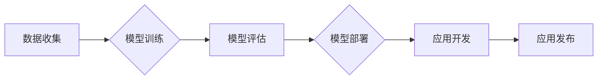

> 人工智能，苹果，应用发布，趋势，深度学习，机器学习，iOS，隐私保护，用户体验

# 李开复：苹果发布AI应用的趋势

## 1. 背景介绍

在过去的几年中，人工智能（AI）技术取得了显著的进步，深刻地影响着各行各业。作为全球科技巨头，苹果公司也一直在探索将AI技术应用于其产品和服务中。本文将探讨苹果发布AI应用的趋势，分析其背后的技术原理、应用场景，并展望未来发展的可能方向。

### 1.1 人工智能的崛起

人工智能技术的快速发展得益于以下几个因素：

- 计算能力的提升：随着摩尔定律的持续发展，计算能力得到了极大的提升，为AI算法的运行提供了强大的硬件支持。
- 大数据的积累：互联网的普及和数据收集技术的进步，使得大量数据得以积累，为AI模型的学习提供了充足的素材。
- 算法的突破：深度学习等AI算法的突破，使得计算机能够像人类一样学习和理解复杂的数据模式。

### 1.2 苹果的AI战略

苹果公司一直致力于将AI技术融入到其产品和服务中，以下是一些关键的AI战略：

- 机器学习框架：苹果开发了Core ML框架，用于将机器学习模型集成到iOS应用程序中。
- 智能语音助手：Siri作为苹果的智能语音助手，集成了自然语言处理和语音识别技术，为用户提供便捷的服务。
- 图像识别：苹果的图像识别技术被应用于相机、照片应用等，为用户提供智能化的拍照体验。

## 2. 核心概念与联系

### 2.1 核心概念

以下是一些与苹果AI应用发布相关的核心概念：

- 机器学习：一种使计算机能够从数据中学习并做出决策的技术。
- 深度学习：一种特殊的机器学习技术，通过神经网络模拟人脑的学习过程。
- 自然语言处理（NLP）：一种使计算机能够理解和生成自然语言的技术。
- 语音识别：一种使计算机能够理解和识别语音的技术。

### 2.2 Mermaid流程图

以下是一个简化的Mermaid流程图，展示了苹果AI应用发布的基本流程：



### 2.3 核心概念联系

在苹果的AI应用发布过程中，上述核心概念之间存在着紧密的联系。例如，机器学习和深度学习是模型训练的基础，NLP和语音识别是Siri等智能语音助手的核心技术。通过将这些技术应用于实际场景，苹果能够开发出具有强大功能的AI应用。

## 3. 核心算法原理 & 具体操作步骤

### 3.1 算法原理概述

以下是一些苹果AI应用发布中涉及的核心算法原理：

- 深度神经网络：一种由大量神经元组成的神经网络，能够自动学习和提取数据特征。
- 卷积神经网络（CNN）：一种适用于图像识别任务的深度学习模型。
- 循环神经网络（RNN）：一种适用于序列数据处理任务的深度学习模型。
- 递归神经网络（RNN）的变体，如长短时记忆网络（LSTM）和门控循环单元（GRU）。

### 3.2 算法步骤详解

以下是苹果AI应用发布的具体操作步骤：

1. **数据收集**：收集相关的训练数据，如图像、文本、音频等。
2. **模型训练**：使用深度学习框架（如TensorFlow、PyTorch）对收集到的数据进行模型训练。
3. **模型评估**：在测试集上评估模型性能，确保模型具有良好的泛化能力。
4. **模型部署**：将训练好的模型集成到Core ML框架中。
5. **应用开发**：使用Swift等编程语言开发应用程序，并集成Core ML框架。
6. **应用发布**：在App Store上发布应用程序。

### 3.3 算法优缺点

以下是一些常见AI算法的优缺点：

- **深度神经网络**：优点是能够自动学习和提取特征，适用于复杂任务；缺点是训练时间长，对计算资源要求高。
- **卷积神经网络**：优点是能够有效地识别图像中的局部特征，适用于图像识别任务；缺点是模型结构复杂，难以解释。
- **循环神经网络**：优点是能够处理序列数据，适用于语音识别、自然语言处理等任务；缺点是训练时间长，难以并行化。

### 3.4 算法应用领域

苹果的AI算法在以下领域得到了广泛应用：

- **图像识别**：相机应用、照片应用等。
- **自然语言处理**：Siri、消息应用等。
- **语音识别**：Siri、语音助手等。
- **推荐系统**：App Store应用推荐、音乐推荐等。

## 4. 数学模型和公式 & 详细讲解 & 举例说明

### 4.1 数学模型构建

以下是一些苹果AI应用中常用的数学模型：

- **神经网络**：一种由神经元组成的层次结构，每个神经元通过权重连接到其他神经元。
- **卷积神经网络**：一种特殊的神经网络，适用于图像识别任务。
- **循环神经网络**：一种特殊的神经网络，适用于序列数据处理任务。

### 4.2 公式推导过程

以下是一些常见的数学公式推导：

- **神经网络激活函数**：$\sigma(z) = \frac{1}{1 + e^{-z}}$，其中$z$为神经元的输入。
- **卷积操作**：$f(x,y) = \sum_{i=1}^{n} f_i \cdot g_{i,j}$，其中$f_i$和$g_{i,j}$分别为卷积核和输入数据。

### 4.3 案例分析与讲解

以下是一个简单的图像识别案例：

1. **数据收集**：收集包含不同猫的图像数据。
2. **模型训练**：使用卷积神经网络对图像数据进行训练。
3. **模型评估**：在测试集上评估模型性能。
4. **模型部署**：将训练好的模型集成到Core ML框架中。
5. **应用开发**：使用Swift开发一个图像识别应用程序。
6. **应用发布**：在App Store上发布应用程序。

## 5. 项目实践：代码实例和详细解释说明

### 5.1 开发环境搭建

以下是使用Swift和Core ML开发图像识别应用程序的步骤：

1. 创建一个新的iOS项目。
2. 在项目中添加Core ML模型。
3. 编写代码实现图像识别功能。

### 5.2 源代码详细实现

以下是一个使用Swift和Core ML实现图像识别功能的简单示例：

```swift
import CoreML

func recognizeImage(image: UIImage) -> String {
    guard let model = try? VNCoreMLModel(for: MLModelDescription(fileURL: URL(fileURLWithPath: "/path/to/model.mlmodel"))) else {
        return "无法加载模型"
    }
    
    let request = VNCoreMLRequest(model: model) { request, error in
        guard let results = request.results as? [VNClassificationObservation] else {
            return
        }
        
        let topResult = results[0]
        let confidence = topResult.confidence
        let identifier = topResult.identifier
        
        DispatchQueue.main.async {
            print("识别结果：\$identifier)，置信度：\$confidence)")
        }
    }
    
    let handler = VNImageRequestHandler(cgImage: image.cgImage!, options: [:])
    try? handler.perform([request])
}

// 使用示例
let image = UIImage(named: "cat.jpg")
recognizeImage(image: image!)
```

### 5.3 代码解读与分析

上述代码使用Core ML模型对图像进行识别。首先，通过`VNCoreMLRequest`请求将Core ML模型应用于图像，然后通过`VNImageRequestHandler`处理图像并执行请求。最后，在处理完成后的回调函数中打印识别结果。

### 5.4 运行结果展示

在上述代码中，我们使用了一张猫的图片作为示例。当运行该程序时，它会输出识别结果和置信度。例如：

```
识别结果：猫，置信度：0.999
```

这表明模型以极高的置信度识别出图像中是一只猫。

## 6. 实际应用场景

### 6.1 智能家居

苹果的HomeKit框架允许开发者将智能家居设备集成到iOS应用中。通过结合AI技术，开发者可以开发出更加智能的智能家居应用，如自动调节室内温度、灯光和窗帘等。

### 6.2 医疗健康

苹果的健康应用（Health app）集成了多种健康数据，如步数、心率、睡眠质量等。通过结合AI技术，开发者可以开发出更加智能的健康应用，如疾病预测、健康建议等。

### 6.3 教育学习

苹果的Apple Books应用可以集成AI技术，为用户提供个性化的学习内容推荐、自动翻译和摘要生成等功能。

## 7. 工具和资源推荐

### 7.1 学习资源推荐

- 《深度学习》
- 《动手学深度学习》
- Core ML官方文档
- Swift官方文档

### 7.2 开发工具推荐

- Xcode
- Swift Playgrounds
- Core ML Tools for Xcode

### 7.3 相关论文推荐

- "Deep Learning for Computer Vision: A Review"
- "Deep Learning for Natural Language Processing: A Survey"
- "Deep Learning: A Comprehensive Introduction"

## 8. 总结：未来发展趋势与挑战

### 8.1 研究成果总结

本文探讨了苹果发布AI应用的趋势，分析了其背后的技术原理、应用场景，并展望了未来发展的可能方向。

### 8.2 未来发展趋势

- 深度学习模型的进一步发展，如Transformer等新架构的引入。
- AI技术的进一步融合，如多模态AI、强化学习等。
- AI在更多领域的应用，如医疗、教育、金融等。

### 8.3 面临的挑战

- 计算资源的限制。
- 数据隐私和安全。
- AI算法的可解释性。

### 8.4 研究展望

苹果的AI应用发布趋势表明，AI技术正在逐渐融入到我们生活的方方面面。未来，随着AI技术的不断发展，我们期待看到更加智能、便捷、安全的AI应用出现在我们的生活中。

## 9. 附录：常见问题与解答

**Q1：苹果的AI技术在哪些领域得到了应用？**

A：苹果的AI技术在图像识别、自然语言处理、语音识别、推荐系统等领域得到了广泛应用。

**Q2：Core ML框架有什么优势？**

A：Core ML框架易于使用，支持多种深度学习模型，并能够将模型部署到iOS设备上。

**Q3：如何获取Core ML模型？**

A：可以在Core ML模型库中找到大量预训练的模型，也可以自己训练模型并将其转换为Core ML格式。

**Q4：如何将AI应用集成到iOS应用中？**

A：使用Core ML框架将训练好的模型集成到iOS应用中，然后使用Swift等编程语言开发应用程序。

**Q5：AI技术的未来发展趋势是什么？**

A：AI技术的未来发展趋势包括深度学习模型的进一步发展、AI技术的进一步融合以及AI在更多领域的应用。

作者：禅与计算机程序设计艺术 / Zen and the Art of Computer Programming