# 李飞飞的ImageNet与AI图像识别

> 关键词：ImageNet，深度学习，卷积神经网络，人工智能，计算机视觉，深度学习竞赛，图像识别，李飞飞

## 1. 背景介绍

图像识别作为计算机视觉领域的一项重要任务，一直是人工智能研究的热点。2009年，美国斯坦福大学教授李飞飞（Fei-Fei Li）领导的团队推出了ImageNet竞赛，标志着深度学习在图像识别领域的真正崛起。本文将深入探讨ImageNet竞赛的背景、核心概念、算法原理以及实际应用，并展望其未来发展趋势。

### 1.1 ImageNet竞赛的由来

ImageNet竞赛是由多所高校和研究机构联合举办的国际计算机视觉竞赛，旨在促进计算机视觉和机器学习领域的研究与发展。竞赛的核心任务是图像分类，即给出一幅图像，要求算法将其正确分类到1000个预定义的类别之一。

ImageNet竞赛的推出，旨在解决当时计算机视觉领域存在的两个主要问题：

1. **数据集规模**：当时的图像识别任务大多使用的是小规模数据集，如Caltech-256、CIFAR-10等。这些数据集规模较小，难以充分反映真实世界的复杂性，导致模型的泛化能力有限。

2. **算法性能**：当时的图像识别算法主要基于传统计算机视觉方法，如SVM、Adaboost等，这些方法的性能远低于人类水平。

为了解决这些问题，李飞飞团队推出了ImageNet竞赛，并提出了深度学习模型——卷积神经网络（CNN），从而开启了深度学习在图像识别领域的黄金时代。

### 1.2 ImageNet竞赛的意义

ImageNet竞赛自推出以来，对计算机视觉领域产生了深远的影响，主要体现在以下几个方面：

1. **推动了深度学习的发展**：ImageNet竞赛促进了深度学习在图像识别领域的应用，使得深度学习模型在图像分类、目标检测、语义分割等任务上取得了显著的突破。

2. **促进了数据集的积累**：ImageNet竞赛的数据集规模达到了数百万张图片，为深度学习模型提供了充足的训练数据。

3. **提升了算法性能**：ImageNet竞赛激发了研究人员对算法性能的追求，推动了卷积神经网络、残差网络等新型深度学习架构的提出。

4. **推动了开源和共享**：ImageNet竞赛的数据集、代码和工具等资源被广泛共享，为学术界和工业界提供了宝贵的资源。

## 2. 核心概念与联系

### 2.1 核心概念

#### 2.1.1 卷积神经网络（CNN）

卷积神经网络是一种特殊的神经网络，特别适合处理图像等数据。它通过模仿人脑视觉神经元的结构和功能，提取图像的特征，并实现对图像的识别。

#### 2.1.2 ImageNet数据集

ImageNet数据集是ImageNet竞赛的核心，包含1000个类别，共1400万张图片，是当时规模最大的图像数据集之一。

#### 2.1.3 深度学习

深度学习是一种机器学习方法，通过构建多层神经网络，可以从大量数据中自动学习特征和模式。

### 2.2 架构流程图

以下为卷积神经网络在图像识别任务中的流程图：

```mermaid
graph LR
    subgraph Input
        A[Image] --> B[Input Layer]
    end

    subgraph Convolutional Layers
        B --> C[Convolutional Layer 1]
        C --> D[ReLU Activation]
        D --> E[Max Pooling]
        E --> F[Convolutional Layer 2]
        F --> G[ReLU Activation]
        G --> H[Max Pooling]
        H --> I[Convolutional Layer 3]
        I --> J[ReLU Activation]
        J --> K[Max Pooling]
    end

    subgraph Fully Connected Layers
        K --> L[Flatten Layer]
        L --> M[Fully Connected Layer 1]
        M --> N[ReLU Activation]
        N --> O[Dropout]
        O --> P[Fully Connected Layer 2]
        P --> Q[Softmax Output]
    end

    Q --> R[Output]
```



## 3. 核心算法原理 & 具体操作步骤

### 3.1 算法原理概述

卷积神经网络通过模拟人眼视网膜的卷积过程，提取图像中的局部特征，并通过逐层抽象，最终实现对图像的识别。其主要原理包括：

1. **卷积层**：通过卷积操作提取图像的局部特征，如边缘、角点、纹理等。

2. **激活函数**：通常使用ReLU函数，将卷积层的输出转换为非负值，提高网络稳定性。

3. **池化层**：通过池化操作降低特征图的分辨率，减少计算量，并保持特征不变。

4. **全连接层**：将池化后的特征图展开为一维向量，输入全连接层进行分类。

5. **Softmax输出层**：输出每个类别的概率，实现多分类。

### 3.2 算法步骤详解

1. **数据预处理**：将原始图像进行归一化、裁剪、旋转等操作，提高模型鲁棒性。

2. **构建卷积神经网络**：根据任务需求，设计合适的网络结构，包括卷积层、激活函数、池化层、全连接层等。

3. **训练模型**：使用ImageNet数据集对模型进行训练，调整网络参数，使模型在图像分类任务上取得最佳性能。

4. **评估模型**：使用测试集评估模型的性能，包括准确率、召回率、F1值等指标。

5. **模型部署**：将训练好的模型部署到实际应用场景，如图像识别、目标检测等。

### 3.3 算法优缺点

#### 3.3.1 优点

1. **性能优异**：卷积神经网络在图像识别、目标检测、语义分割等任务上取得了显著的性能提升。

2. **泛化能力强**：通过迁移学习，可以在不同数据集上取得较好的性能。

3. **可解释性强**：卷积神经网络的每层都可以提取特定的图像特征，有助于理解模型的决策过程。

#### 3.3.2 缺点

1. **计算量大**：卷积神经网络的计算量较大，对硬件资源要求较高。

2. **参数多**：网络参数量多，训练过程耗时较长。

3. **数据依赖性强**：模型的性能很大程度上取决于训练数据的质量和数量。

## 4. 数学模型和公式 & 详细讲解 & 举例说明

### 4.1 数学模型构建

卷积神经网络的数学模型主要包括以下几部分：

1. **卷积层**：通过卷积操作提取图像特征。

   $$ f(x) = \sum_{i=1}^{K} w_i * x $$
   
   其中 $ f(x) $ 为卷积操作的结果，$ w_i $ 为卷积核，$ x $ 为输入图像。

2. **池化层**：通过池化操作降低特征图的分辨率。

   $$ P(x) = \max_{j} \min_{k \in R} x_{j,k} $$
   
   其中 $ P(x) $ 为池化操作的结果，$ x_{j,k} $ 为特征图中第 $ j $ 行第 $ k $ 列的元素。

3. **全连接层**：通过全连接操作将特征向量转换为类别概率。

   $$ y = \sigma(Wx + b) $$
   
   其中 $ y $ 为输出向量，$ W $ 为权重矩阵，$ b $ 为偏置向量，$ \sigma $ 为激活函数。

### 4.2 公式推导过程

以下以卷积层为例，简要介绍卷积操作的推导过程：

1. **卷积核初始化**：随机初始化卷积核 $ w_i $。

2. **卷积操作**：对输入图像 $ x $ 进行卷积操作，得到输出特征图 $ f(x) $。

3. **激活函数**：对卷积层的输出应用激活函数，得到非负值。

4. **池化操作**：对激活后的特征图进行池化操作，降低特征图的分辨率。

### 4.3 案例分析与讲解

以下以CIFAR-10数据集为例，介绍卷积神经网络在图像识别任务中的应用。

1. **数据集介绍**：CIFAR-10数据集包含10个类别，共10万张32x32彩色图像。

2. **网络结构**：使用一个包含卷积层、池化层和全连接层的卷积神经网络。

3. **训练过程**：使用CIFAR-10数据集对网络进行训练，调整网络参数。

4. **性能评估**：在测试集上评估网络的性能，包括准确率、召回率、F1值等指标。

5. **结果分析**：分析网络在不同层的特征提取效果，以及不同层对最终性能的影响。

## 5. 项目实践：代码实例和详细解释说明

### 5.1 开发环境搭建

1. **安装Python环境**：安装Python 3.6及以上版本。

2. **安装深度学习库**：安装TensorFlow或PyTorch等深度学习库。

3. **安装其他依赖**：安装NumPy、Matplotlib等Python库。

### 5.2 源代码详细实现

以下使用TensorFlow实现CIFAR-10图像识别任务的代码示例：

```python
import tensorflow as tf
from tensorflow.keras import datasets, layers, models

# 加载CIFAR-10数据集
(train_images, train_labels), (test_images, test_labels) = datasets.cifar10.load_data()

# 数据预处理
train_images = train_images.reshape((60000, 32, 32, 3))
test_images = test_images.reshape((10000, 32, 32, 3))
train_images, test_images = train_images / 255.0, test_images / 255.0

# 构建模型
model = models.Sequential([
    layers.Conv2D(32, (3, 3), activation='relu', input_shape=(32, 32, 3)),
    layers.MaxPooling2D((2, 2)),
    layers.Conv2D(64, (3, 3), activation='relu'),
    layers.MaxPooling2D((2, 2)),
    layers.Conv2D(64, (3, 3), activation='relu'),
    layers.Flatten(),
    layers.Dense(64, activation='relu'),
    layers.Dense(10)
])

# 编译模型
model.compile(optimizer='adam',
              loss=tf.keras.losses.SparseCategoricalCrossentropy(from_logits=True),
              metrics=['accuracy'])

# 训练模型
model.fit(train_images, train_labels, epochs=10, validation_split=0.1)

# 评估模型
test_loss, test_acc = model.evaluate(test_images,  test_labels, verbose=2)
print('
Test accuracy:', test_acc)
```

### 5.3 代码解读与分析

以上代码展示了使用TensorFlow构建CIFAR-10图像识别任务模型的完整流程。

1. **加载数据**：使用TensorFlow的datasets库加载CIFAR-10数据集。

2. **数据预处理**：将图像数据进行归一化处理，并将形状调整为适合模型输入的格式。

3. **构建模型**：使用Sequential模型构建一个包含卷积层、池化层和全连接层的网络结构。

4. **编译模型**：设置优化器、损失函数和评估指标。

5. **训练模型**：使用训练集数据训练模型，并验证验证集上的性能。

6. **评估模型**：在测试集上评估模型的性能，并打印准确率。

通过以上步骤，我们成功构建了一个能够识别CIFAR-10图像的卷积神经网络模型。

### 5.4 运行结果展示

运行以上代码，在CIFAR-10测试集上得到的准确率约为60%。这个结果虽然不如专业的人工智能模型，但已经展示了卷积神经网络在图像识别任务中的强大能力。

## 6. 实际应用场景

卷积神经网络在图像识别任务中取得了显著的成果，并广泛应用于以下场景：

1. **目标检测**：在图像中检测和定位特定目标，如人脸识别、车辆检测等。

2. **图像分类**：对图像进行分类，如植物识别、动物识别等。

3. **图像分割**：将图像分割成多个区域，如医学图像分割、卫星图像分割等。

4. **图像生成**：根据输入条件生成新的图像，如风格迁移、超分辨率等。

5. **图像超分辨率**：提高图像的分辨率，如将低分辨率图像转换为高分辨率图像。

## 7. 工具和资源推荐

### 7.1 学习资源推荐

1. 《深度学习》（Goodfellow等著）：介绍了深度学习的基本原理和应用，包括卷积神经网络、循环神经网络等。

2. 《深度学习实践》（Ian Goodfellow等著）：介绍了深度学习在各个领域的应用案例，包括图像识别、语音识别等。

3. TensorFlow官方文档：提供了TensorFlow库的详细文档和教程，帮助开发者快速上手。

4. PyTorch官方文档：提供了PyTorch库的详细文档和教程，帮助开发者快速上手。

### 7.2 开发工具推荐

1. TensorFlow：由Google开发的深度学习框架，适用于图像识别、语音识别等任务。

2. PyTorch：由Facebook开发的深度学习框架，适用于图像识别、自然语言处理等任务。

3. Keras：一个高级神经网络API，可以方便地构建和训练深度学习模型。

4. OpenCV：一个开源的计算机视觉库，提供了丰富的图像处理和计算机视觉算法。

### 7.3 相关论文推荐

1. A Guide to Convolutional Neural Networks - Aaron Courville, Yoshua Bengio, and Pascal Vincent

2. Deep Learning for Computer Vision: A Survey - Christian Szegedy, Wei Liu, Yangqing Jia, Pierre Sermanet, Scott Reed, Dragomir Anguelov, Dumitru Erhan, Vincent Vanhoucke, Andrew Rabinovich

3. Very Deep Convolutional Networks for Large-Scale Image Recognition - Christian Szegedy, Wei Liu, Yangqing Jia, Pierre Sermanet, Alexander J. Krizhevsky, Ilya Sutskever, and Geoffrey Hinton

4. Learning Deep Features for Images of Objects - Yann LeCun, Yuval Netanyahu, David Bottou, and Léon Bottou

5. Visual Recognition with Deep Learning - Yann LeCun, Yosua Bengio, and Geoffrey Hinton

## 8. 总结：未来发展趋势与挑战

### 8.1 研究成果总结

ImageNet竞赛推动了深度学习在图像识别领域的快速发展，取得了以下成果：

1. 深度学习模型在图像识别任务上取得了显著的性能提升。

2. 开发了许多高效的深度学习框架和算法。

3. 促进了计算机视觉领域的开源和共享。

### 8.2 未来发展趋势

未来，深度学习在图像识别领域的发展趋势包括：

1. **模型轻量化**：开发更轻量级的模型，适应移动设备和边缘计算等场景。

2. **模型可解释性**：提高模型的可解释性，使模型决策过程更加透明。

3. **多模态学习**：结合图像、文本、语音等多模态信息，提高模型对复杂场景的理解能力。

4. **无监督和半监督学习**：降低对标注数据的依赖，提高模型的泛化能力。

### 8.3 面临的挑战

深度学习在图像识别领域面临的挑战包括：

1. **数据标注成本高**：高质量的标注数据难以获取，制约了模型的进一步发展。

2. **模型可解释性不足**：模型决策过程难以解释，难以应用于高风险领域。

3. **计算资源消耗大**：深度学习模型需要大量的计算资源，限制了其在边缘计算等场景的应用。

### 8.4 研究展望

未来，深度学习在图像识别领域的研究方向包括：

1. **数据增强和少样本学习**：降低对标注数据的依赖，提高模型的泛化能力。

2. **模型压缩和量化**：降低模型复杂度，提高模型效率。

3. **多模态学习和跨模态融合**：结合不同模态信息，提高模型对复杂场景的理解能力。

4. **可解释性和可信赖性**：提高模型的可解释性和可信赖性，使其在更多领域得到应用。

## 9. 附录：常见问题与解答

**Q1：ImageNet数据集的规模如何？**

A：ImageNet数据集包含1000个类别，共1400万张图片。

**Q2：卷积神经网络的优点有哪些？**

A：卷积神经网络的优点包括：

1. 性能优异。

2. 泛化能力强。

3. 可解释性强。

**Q3：如何提高卷积神经网络的性能？**

A：提高卷积神经网络性能的方法包括：

1. 优化网络结构。

2. 优化训练策略。

3. 使用更有效的优化器。

**Q4：卷积神经网络在哪些领域应用广泛？**

A：卷积神经网络在以下领域应用广泛：

1. 目标检测。

2. 图像分类。

3. 图像分割。

4. 图像生成。

5. 图像超分辨率。

**Q5：深度学习在图像识别领域面临的挑战有哪些？**

A：深度学习在图像识别领域面临的挑战包括：

1. 数据标注成本高。

2. 模型可解释性不足。

3. 计算资源消耗大。

作者：禅与计算机程序设计艺术 / Zen and the Art of Computer Programming