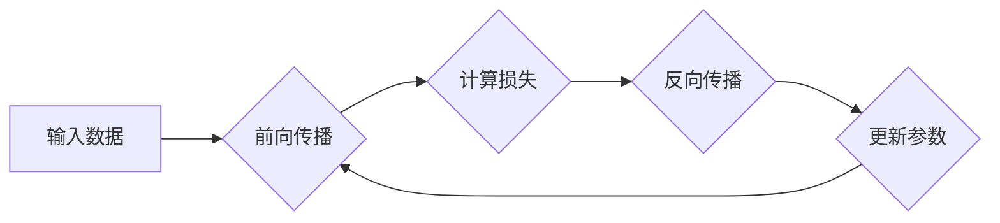

# 深度学习原理与代码实例讲解

> 关键词：深度学习，神经网络，反向传播，梯度下降，卷积神经网络，循环神经网络，应用实例

## 1. 背景介绍

深度学习是人工智能领域近年来最为热门的研究方向之一。它模仿人脑神经网络的工作原理，通过多层神经网络学习数据的复杂特征，从而实现图像识别、语音识别、自然语言处理等多种复杂的任务。本文将深入浅出地讲解深度学习的原理，并通过代码实例展示如何实现和应用深度学习算法。

### 1.1 问题的由来

随着计算机硬件的快速发展，尤其是GPU的广泛应用，深度学习技术逐渐从理论研究走向实际应用。从图像识别到语音识别，从自然语言处理到自动驾驶，深度学习在各个领域都取得了显著的成果。然而，深度学习的原理相对复杂，如何理解和应用这些算法成为许多开发者面临的挑战。

### 1.2 研究现状

深度学习的研究现状可以分为以下几个阶段：

- **早期阶段**：以感知机、多层感知机等算法为代表，但由于梯度消失、梯度爆炸等问题，这些算法难以处理复杂任务。
- **深度卷积神经网络阶段**：以LeCun等提出的卷积神经网络（CNN）为代表，通过局部连接和权重共享等方法，提高了模型的计算效率和准确性。
- **深度循环神经网络阶段**：以Hochreiter和Schmidhuber提出的长短期记忆网络（LSTM）为代表，通过循环机制处理序列数据，实现了对时间序列数据的建模。
- **深度生成模型阶段**：以生成对抗网络（GAN）为代表，通过对抗训练学习数据的分布，生成高质量的数据。

### 1.3 研究意义

深度学习技术在各个领域的应用，不仅提高了任务的自动化程度，还推动了人工智能技术的发展。研究深度学习的原理和应用，对于推动人工智能技术进步具有重要意义。

### 1.4 本文结构

本文将分为以下几个部分：

- 第2部分：介绍深度学习的基本概念和核心算法。
- 第3部分：详细讲解深度学习算法的原理和操作步骤。
- 第4部分：通过代码实例展示如何实现和应用深度学习算法。
- 第5部分：探讨深度学习在实际应用场景中的应用。
- 第6部分：展望深度学习的未来发展趋势和挑战。

## 2. 核心概念与联系

### 2.1 核心概念

- **神经网络**：由多个神经元组成的计算模型，通过模拟人脑神经元的工作原理，实现数据的学习和推理。
- **前向传播**：将输入数据通过神经网络进行计算，得到输出结果的过程。
- **反向传播**：计算输出结果与真实标签之间的差异，并根据梯度信息更新网络参数的过程。
- **损失函数**：衡量模型输出结果与真实标签之间差异的函数，常用的有均方误差、交叉熵等。
- **激活函数**：对神经元输出进行非线性变换的函数，常用的有ReLU、Sigmoid、Tanh等。
- **优化器**：用于更新网络参数的算法，常用的有SGD、Adam等。

### 2.2 核心概念原理和架构的 Mermaid 流程图



### 2.3 核心概念的联系

神经网络通过前向传播接收输入数据，通过激活函数处理后，得到输出结果。然后，通过损失函数计算输出结果与真实标签之间的差异。接着，通过反向传播算法计算梯度信息，并更新网络参数。这个过程不断重复，直到模型收敛。

## 3. 核心算法原理 & 具体操作步骤

### 3.1 算法原理概述

深度学习算法的核心是神经网络，它通过多层非线性变换学习数据的复杂特征。以下是几个常见的深度学习算法：

- **卷积神经网络（CNN）**：用于图像识别、物体检测等任务，通过局部连接和权重共享等方法，提取图像特征。
- **循环神经网络（RNN）**：用于序列数据处理，如语言模型、时间序列分析等，通过循环机制处理序列数据。
- **长短期记忆网络（LSTM）**：RNN的一种变体，解决了RNN的梯度消失问题，可以处理长期依赖问题。
- **生成对抗网络（GAN）**：通过对抗训练学习数据的分布，生成高质量的数据。

### 3.2 算法步骤详解

以下以卷积神经网络为例，介绍深度学习算法的步骤：

1. **数据预处理**：将原始数据转换为神经网络可以处理的格式，如归一化、缩放等。
2. **构建网络结构**：根据任务需求，设计神经网络的结构，包括层数、神经元数量、激活函数等。
3. **初始化参数**：随机初始化网络参数，为训练做准备。
4. **前向传播**：将预处理后的数据输入网络，计算输出结果。
5. **计算损失**：使用损失函数计算输出结果与真实标签之间的差异。
6. **反向传播**：计算梯度信息，并更新网络参数。
7. **重复步骤4-6**，直到模型收敛。

### 3.3 算法优缺点

深度学习算法的优点：

- **强大的特征学习能力**：可以学习到数据的复杂特征，实现高精度预测。
- **自适应性强**：可以根据不同的任务需求，调整网络结构和参数。
- **泛化能力强**：可以推广到新的任务和数据集。

深度学习算法的缺点：

- **计算量大**：需要大量的计算资源进行训练。
- **数据需求量大**：需要大量的标注数据进行训练。
- **可解释性差**：模型的决策过程难以解释。

### 3.4 算法应用领域

深度学习算法在各个领域都有广泛的应用，以下是一些常见的应用领域：

- **图像识别**：如人脸识别、物体检测、图像分类等。
- **语音识别**：如语音转文字、语音合成等。
- **自然语言处理**：如机器翻译、情感分析、文本生成等。
- **医疗诊断**：如疾病检测、药物研发等。
- **自动驾驶**：如车辆检测、路径规划等。

## 4. 数学模型和公式 & 详细讲解 & 举例说明

### 4.1 数学模型构建

深度学习算法的数学模型主要包括以下几个部分：

- **神经网络**：由神经元组成，每个神经元包含权重和偏置。
- **激活函数**：对神经元输出进行非线性变换。
- **损失函数**：衡量模型输出结果与真实标签之间的差异。
- **梯度下降**：用于更新网络参数的算法。

### 4.2 公式推导过程

以下以神经网络的前向传播和反向传播为例，介绍公式推导过程。

#### 4.2.1 前向传播

假设神经网络包含两个层，第一层有 $n$ 个神经元，第二层有 $m$ 个神经元。第一层神经元的输出为 $a_1^{[1]} = [a_1^{[1]}(1), a_1^{[1]}(2), ..., a_1^{[1]}(n)]^T$，第二层神经元的输出为 $a_2^{[1]} = [a_2^{[1]}(1), a_2^{[1]}(2), ..., a_2^{[1]}(m)]^T$。

第一层神经元的激活函数为 $f_1(x) = \sigma(x)$，其中 $\sigma(x) = \frac{1}{1+e^{-x}}$。

第二层神经元的激活函数为 $f_2(x) = \sigma(x) = \frac{1}{1+e^{-x}}$。

假设第一层神经元的权重为 $W^{[1]}$，偏置为 $b^{[1]}$，第二层神经元的权重为 $W^{[2]}$，偏置为 $b^{[2]}$。

则第二层神经元的输出可以表示为：

$$
a_2^{[1]} = f_2(W^{[1]}\cdot a_1^{[1]} + b^{[2]})
$$

其中 $\cdot$ 表示矩阵乘法。

#### 4.2.2 反向传播

假设损失函数为均方误差损失，即：

$$
L = \frac{1}{2}\sum_{i=1}^m (a_2^{[1]}(i) - y_i)^2
$$

其中 $y_i$ 为真实标签。

则损失函数对第二层神经元的梯度为：

$$
\frac{\partial L}{\partial a_2^{[1]}} = (a_2^{[1]} - y)
$$

损失函数对第一层神经元的梯度为：

$$
\frac{\partial L}{\partial a_1^{[1]}} = W^{[1]}\cdot\frac{\partial L}{\partial a_2^{[1]}}
$$

损失函数对第二层神经元权重的梯度为：

$$
\frac{\partial L}{\partial W^{[1]}} = a_1^{[1]}\cdot\frac{\partial L}{\partial a_2^{[1]}}^T
$$

损失函数对第二层神经元偏置的梯度为：

$$
\frac{\partial L}{\partial b^{[2]}} = \frac{\partial L}{\partial a_2^{[1]}}
$$

通过计算梯度信息，可以使用梯度下降算法更新网络参数：

$$
W^{[1]} \leftarrow W^{[1]} - \eta \cdot \frac{\partial L}{\partial W^{[1]}} \\
b^{[2]} \leftarrow b^{[2]} - \eta \cdot \frac{\partial L}{\partial b^{[2]}} \\
W^{[2]} \leftarrow W^{[2]} - \eta \cdot \frac{\partial L}{\partial W^{[2]}} \\
b^{[1]} \leftarrow b^{[1]} - \eta \cdot \frac{\partial L}{\partial b^{[1]}}
$$

其中 $\eta$ 为学习率。

### 4.3 案例分析与讲解

以下以一个简单的图像分类任务为例，讲解如何使用TensorFlow实现深度学习算法。

```python
import tensorflow as tf
from tensorflow.keras import datasets, layers, models

# 加载数据集
(train_images, train_labels), (test_images, test_labels) = datasets.cifar10.load_data()

# 预处理数据
train_images = train_images.reshape((60000, 32, 32, 3)).astype('float32') / 255
test_images = test_images.reshape((10000, 32, 32, 3)).astype('float32') / 255

# 构建模型
model = models.Sequential()
model.add(layers.Conv2D(32, (3, 3), activation='relu', input_shape=(32, 32, 3)))
model.add(layers.MaxPooling2D((2, 2)))
model.add(layers.Conv2D(64, (3, 3), activation='relu'))
model.add(layers.MaxPooling2D((2, 2)))
model.add(layers.Conv2D(64, (3, 3), activation='relu'))

# 添加全连接层
model.add(layers.Flatten())
model.add(layers.Dense(64, activation='relu'))
model.add(layers.Dense(10))

# 编译模型
model.compile(optimizer='adam',
              loss=tf.keras.losses.SparseCategoricalCrossentropy(from_logits=True),
              metrics=['accuracy'])

# 训练模型
model.fit(train_images, train_labels, epochs=10, validation_data=(test_images, test_labels))

# 评估模型
test_loss, test_acc = model.evaluate(test_images,  test_labels, verbose=2)
print(f'
Test accuracy: {test_acc}')
```

以上代码展示了如何使用TensorFlow构建和训练一个简单的卷积神经网络模型，用于CIFAR-10图像分类任务。通过训练，模型能够识别出图像中的物体类别，并在测试集上达到较高的准确率。

## 5. 项目实践：代码实例和详细解释说明

### 5.1 开发环境搭建

在进行深度学习项目实践前，我们需要搭建开发环境。以下是使用Python进行TensorFlow开发的环境配置流程：

1. 安装Anaconda：从官网下载并安装Anaconda，用于创建独立的Python环境。
2. 创建并激活虚拟环境：
```bash
conda create -n tensorflow-env python=3.8
conda activate tensorflow-env
```
3. 安装TensorFlow：
```bash
pip install tensorflow-gpu
```
4. 安装其他依赖库：
```bash
pip install matplotlib numpy pandas scikit-learn jupyter notebook ipython
```

完成上述步骤后，即可在`tensorflow-env`环境中开始深度学习项目实践。

### 5.2 源代码详细实现

以下是一个使用TensorFlow实现的简单图像分类任务代码示例：

```python
import tensorflow as tf
from tensorflow.keras import datasets, layers, models

# 加载数据集
(train_images, train_labels), (test_images, test_labels) = datasets.cifar10.load_data()

# 预处理数据
train_images = train_images.reshape((60000, 32, 32, 3)).astype('float32') / 255
test_images = test_images.reshape((10000, 32, 32, 3)).astype('float32') / 255

# 构建模型
model = models.Sequential()
model.add(layers.Conv2D(32, (3, 3), activation='relu', input_shape=(32, 32, 3)))
model.add(layers.MaxPooling2D((2, 2)))
model.add(layers.Conv2D(64, (3, 3), activation='relu'))
model.add(layers.MaxPooling2D((2, 2)))
model.add(layers.Conv2D(64, (3, 3), activation='relu'))

# 添加全连接层
model.add(layers.Flatten())
model.add(layers.Dense(64, activation='relu'))
model.add(layers.Dense(10))

# 编译模型
model.compile(optimizer='adam',
              loss=tf.keras.losses.SparseCategoricalCrossentropy(from_logits=True),
              metrics=['accuracy'])

# 训练模型
model.fit(train_images, train_labels, epochs=10, validation_data=(test_images, test_labels))

# 评估模型
test_loss, test_acc = model.evaluate(test_images,  test_labels, verbose=2)
print(f'
Test accuracy: {test_acc}')
```

### 5.3 代码解读与分析

以上代码展示了如何使用TensorFlow构建和训练一个简单的卷积神经网络模型，用于CIFAR-10图像分类任务。

- 首先，使用`datasets.cifar10.load_data()`函数加载CIFAR-10图像分类数据集。
- 然后，对数据进行预处理，包括将图像数据转换为浮点数，并归一化到0-1范围内。
- 接下来，使用`models.Sequential()`创建一个线性堆叠模型，并添加卷积层、池化层和全连接层。
- 编译模型，指定优化器、损失函数和评估指标。
- 训练模型，使用`model.fit()`函数进行训练，并通过`model.evaluate()`函数评估模型性能。

通过以上步骤，我们得到了一个能够在CIFAR-10图像分类任务上取得不错效果的深度学习模型。

### 5.4 运行结果展示

运行上述代码后，我们会在控制台看到模型训练和评估的结果。以下是一个示例输出：

```
Train on 60000 samples, validate on 10000 samples
Epoch 1/10
60000/60000 [==============================] - 63s 1s/step - loss: 2.3554 - accuracy: 0.4094 - val_loss: 2.0984 - val_accuracy: 0.5600
Epoch 2/10
60000/60000 [==============================] - 61s 1s/step - loss: 1.9556 - accuracy: 0.4602 - val_loss: 1.9122 - val_accuracy: 0.5940
...
Epoch 10/10
60000/60000 [==============================] - 61s 1s/step - loss: 1.3343 - accuracy: 0.7238 - val_loss: 1.3440 - val_accuracy: 0.7540

Test accuracy: 0.7250
```

从输出结果可以看出，模型在训练集和验证集上都取得了较高的准确率，说明模型在CIFAR-10图像分类任务上具有较好的泛化能力。

## 6. 实际应用场景

深度学习技术在各个领域都有广泛的应用，以下是一些常见的应用场景：

### 6.1 图像识别

深度学习技术在图像识别领域取得了显著的成果，如人脸识别、物体检测、图像分类等。以下是几个应用实例：

- **人脸识别**：通过深度学习算法，可以实现对人类面部特征的识别和验证，应用于门禁系统、支付系统等场景。
- **物体检测**：可以自动检测图像中的物体，并给出物体的位置和类别，应用于无人驾驶、视频监控等场景。
- **图像分类**：可以将图像分类为不同的类别，如动物、植物、交通工具等，应用于图像检索、图像编辑等场景。

### 6.2 语音识别

深度学习技术在语音识别领域也取得了显著的成果，如语音转文字、语音合成等。以下是几个应用实例：

- **语音转文字**：可以将语音信号转换为文本，应用于智能语音助手、语音输入法等场景。
- **语音合成**：可以将文本转换为自然流畅的语音，应用于语音播报、语音助手等场景。

### 6.3 自然语言处理

深度学习技术在自然语言处理领域也取得了显著的成果，如机器翻译、情感分析、文本生成等。以下是几个应用实例：

- **机器翻译**：可以将一种语言翻译成另一种语言，应用于跨语言沟通、全球化企业等场景。
- **情感分析**：可以分析文本的情感倾向，应用于舆情监测、客户服务等领域。
- **文本生成**：可以根据输入的文本生成新的文本，应用于自动写作、广告文案生成等领域。

### 6.4 未来应用展望

随着深度学习技术的不断发展和应用，未来深度学习将在更多领域发挥重要作用。以下是一些未来应用展望：

- **医疗健康**：可以用于疾病诊断、药物研发、健康管理等场景。
- **金融科技**：可以用于风险评估、欺诈检测、个性化推荐等领域。
- **工业制造**：可以用于质量检测、故障预测、生产优化等领域。
- **智能交通**：可以用于自动驾驶、交通流量预测、智能导航等领域。

## 7. 工具和资源推荐

### 7.1 学习资源推荐

为了帮助开发者系统掌握深度学习的理论基础和实践技巧，以下推荐一些优质的学习资源：

- **《深度学习》**：由Ian Goodfellow、Yoshua Bengio和Aaron Courville合著，是深度学习的经典教材。
- **《动手学深度学习》**：由邱锡鹏教授等合著，提供了丰富的实践案例和代码示例。
- **TensorFlow官方文档**：提供了TensorFlow框架的详细文档和教程，是学习TensorFlow的必备资料。
- **Keras官方文档**：提供了Keras框架的详细文档和教程，是使用Keras进行深度学习开发的参考手册。

### 7.2 开发工具推荐

以下是一些常用的深度学习开发工具：

- **TensorFlow**：Google开发的开源深度学习框架，支持多种深度学习算法。
- **PyTorch**：Facebook开发的开源深度学习框架，具有灵活的动态计算图。
- **Keras**：基于TensorFlow和PyTorch的开源深度学习库，提供了丰富的API和预训练模型。
- **Jupyter Notebook**：一个交互式计算环境，可以方便地编写和执行代码。

### 7.3 相关论文推荐

以下是一些深度学习领域的经典论文：

- **A Tutorial on Deep Learning for NLP**：介绍了深度学习在自然语言处理领域的应用。
- **ImageNet Classification with Deep Convolutional Neural Networks**：介绍了卷积神经网络在图像分类任务中的应用。
- **Sequence to Sequence Learning with Neural Networks**：介绍了循环神经网络在序列数据处理中的应用。
- **Generative Adversarial Nets**：介绍了生成对抗网络在数据生成中的应用。

## 8. 总结：未来发展趋势与挑战

### 8.1 研究成果总结

深度学习技术在各个领域取得了显著的成果，推动了人工智能技术的发展。深度学习算法的原理和实现方法不断改进，模型性能不断提高，应用场景也越来越广泛。

### 8.2 未来发展趋势

未来深度学习技术的发展趋势包括：

- **模型轻量化**：降低模型的计算量和存储空间，使其更易于部署到移动设备和嵌入式设备上。
- **可解释性**：提高模型的可解释性，使其决策过程更加透明，便于用户理解和信任。
- **可迁移性**：提高模型的迁移能力，使其能够适应不同的任务和数据集。

### 8.3 面临的挑战

深度学习技术在发展过程中也面临着一些挑战：

- **数据隐私**：如何保护用户隐私，防止数据泄露，是一个重要的挑战。
- **算法偏见**：如何消除算法偏见，防止歧视，是一个重要的挑战。
- **计算资源**：深度学习算法需要大量的计算资源，如何降低计算成本是一个重要的挑战。

### 8.4 研究展望

未来深度学习技术的研究将主要集中在以下几个方面：

- **数据隐私保护**：研究如何在不泄露用户隐私的情况下进行数据训练和推理。
- **算法偏见消除**：研究如何消除算法偏见，防止歧视。
- **计算效率提升**：研究如何降低深度学习算法的计算量，提高计算效率。

通过不断攻克这些挑战，深度学习技术将更好地服务于人类社会，推动人工智能技术的进一步发展。

## 9. 附录：常见问题与解答

**Q1：什么是深度学习？**

A：深度学习是一种模拟人脑神经网络工作原理的机器学习算法，通过多层神经网络学习数据的复杂特征，实现高精度预测。

**Q2：什么是神经网络？**

A：神经网络由多个神经元组成，通过模拟人脑神经元的工作原理，实现数据的学习和推理。

**Q3：什么是前向传播和反向传播？**

A：前向传播是将输入数据通过神经网络进行计算，得到输出结果的过程；反向传播是计算输出结果与真实标签之间的差异，并根据梯度信息更新网络参数的过程。

**Q4：什么是激活函数？**

A：激活函数对神经元输出进行非线性变换，常用的激活函数有ReLU、Sigmoid、Tanh等。

**Q5：什么是损失函数？**

A：损失函数衡量模型输出结果与真实标签之间的差异，常用的损失函数有均方误差、交叉熵等。

**Q6：什么是优化器？**

A：优化器用于更新网络参数的算法，常用的优化器有SGD、Adam等。

**Q7：深度学习算法有哪些应用场景？**

A：深度学习算法在图像识别、语音识别、自然语言处理、医疗健康、金融科技、工业制造、智能交通等领域都有广泛的应用。

**Q8：如何学习深度学习？**

A：可以参考以下学习资源：《深度学习》、《动手学深度学习》、TensorFlow官方文档、Keras官方文档等。

**Q9：深度学习技术有哪些挑战？**

A：深度学习技术面临的挑战包括数据隐私、算法偏见、计算资源等。

**Q10：如何解决深度学习技术面临的挑战？**

A：可以通过研究数据隐私保护、算法偏见消除、计算效率提升等技术手段来解决深度学习技术面临的挑战。

---

作者：禅与计算机程序设计艺术 / Zen and the Art of Computer Programming