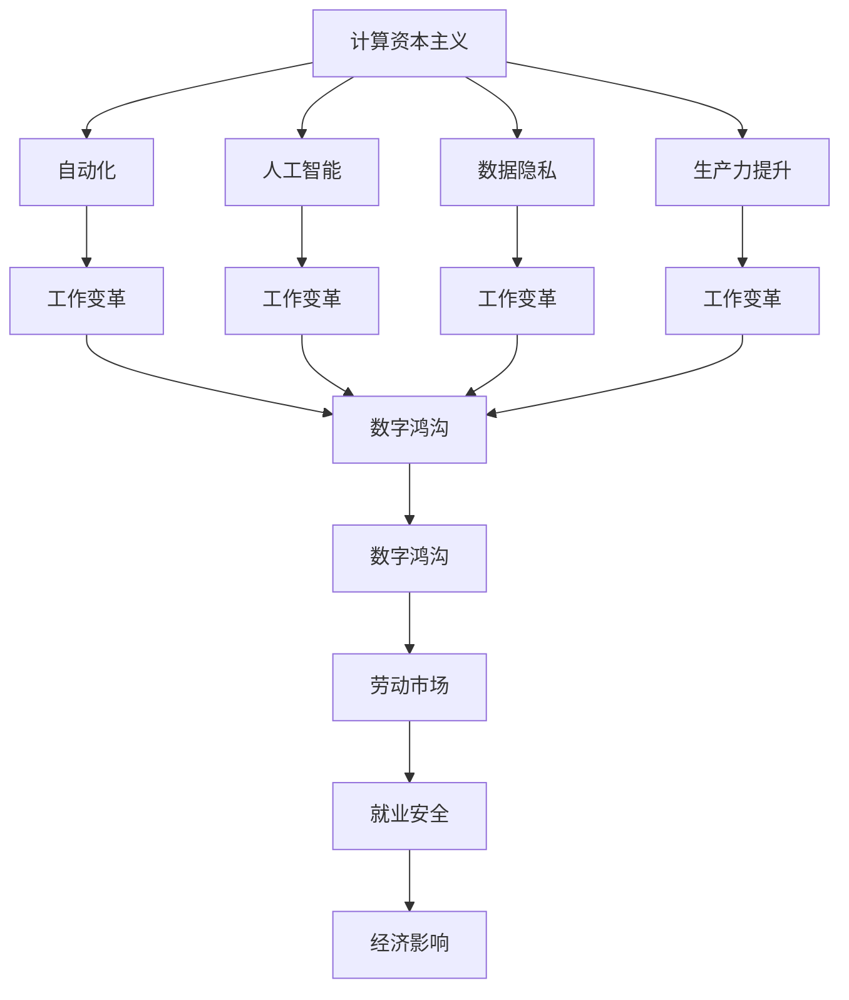

                 

# 人类计算：未来工作的影响

> 关键词：
- 计算资本主义
- 自动化
- 数字鸿沟
- 人工智能
- 工作变革
- 生产力提升
- 数据隐私

## 1. 背景介绍

随着人工智能和自动化技术的迅猛发展，计算资本主义成为21世纪的新型经济模式。这一模式改变了社会的经济结构，深刻影响了人类的工作和生活。计算资本主义不仅改变了生产方式，还重塑了劳动力市场，引发了一系列社会、伦理和经济问题。

计算资本主义的兴起，源于数据成为新型生产要素和资源。在数字化转型的大背景下，数据和计算力成为企业竞争的焦点。企业通过收集和分析海量数据，借助算法和模型，优化生产流程，提升效率和收益。这种新的生产方式，推动了生产力的大幅提升，但也带来了许多挑战和矛盾。

一方面，计算资本主义为社会带来了显著的生产力提升和经济效益，但也加剧了数字鸿沟，导致部分群体被边缘化，引发了劳动市场的结构性变革。另一方面，人工智能的普及使得工作性质发生了根本变化，机器替代人类劳动的趋势日益明显，引发了关于工作未来、劳动价值和就业安全的广泛讨论。

## 2. 核心概念与联系

### 2.1 核心概念概述

计算资本主义（Computational Capitalism）：以数据和计算力为基础，通过算法和模型进行经济活动的生产方式。计算资本主义的典型特征包括自动化、数字化、数据驱动和智能决策等。

自动化（Automation）：指通过技术手段实现生产过程的自动化，包括机械自动化、软件自动化和智能自动化。自动化技术通过算法和机器学习，极大地提升了生产效率和质量。

数字鸿沟（Digital Divide）：指由于技术、经济和社会因素，不同群体在获取和利用数字资源方面的不平等。计算资本主义加剧了数字鸿沟，导致部分群体难以参与到数字化经济中。

人工智能（Artificial Intelligence, AI）：指通过算法和计算力，实现机器对人类智能的模拟和延伸。AI技术在各个领域的应用，正在改变人类工作和生活的方式。

工作变革（Job Transformation）：指自动化和AI技术对工作性质的根本改变，包括工作内容、形式、要求和价值的重塑。工作变革使得传统劳动岗位减少，新兴职业需求增加，要求劳动者具备新的技能和素质。

生产力提升（Productivity Enhancement）：指自动化和AI技术对生产力的显著提升。通过优化生产流程，减少人力和时间成本，提高效率和效益。

数据隐私（Data Privacy）：指保护个人和组织数据不被非法收集、使用和披露的权利。计算资本主义中，数据的收集和分析对企业效益至关重要，但也带来了隐私保护的问题。

这些概念之间存在着密切的联系和相互作用，共同构成了计算资本主义和未来工作变革的复杂生态系统。通过理解这些核心概念，我们可以更好地把握计算资本主义和未来工作的基本特征和演变趋势。

### 2.2 概念间的关系

这些核心概念之间的逻辑关系可以通过以下Mermaid流程图来展示：



这个流程图展示了计算资本主义及其各个组成部分之间的关系：

1. 计算资本主义以自动化和人工智能为基础，通过数据驱动的生产方式，显著提升了生产力。
2. 自动化和人工智能使得工作性质发生根本变化，要求劳动者具备新的技能和素质。
3. 数据隐私是计算资本主义的构成要素之一，保护数据隐私是企业的法律和道德责任。
4. 工作变革是计算资本主义的直接后果，带来了劳动市场的结构性变化，影响了就业安全和经济效益。
5. 数字鸿沟是计算资本主义的副产品，加剧了不同群体之间的经济和社会不平等。
6. 计算资本主义对经济的影响是多方面的，从产业结构到就业市场，从企业效率到社会福利，都受到了深刻影响。

这些概念共同构成了计算资本主义和未来工作变革的完整生态系统，其相互作用和影响将深刻塑造未来的经济和社会格局。

## 3. 核心算法原理 & 具体操作步骤

### 3.1 算法原理概述

计算资本主义的本质是通过数据和计算力进行经济活动，其核心在于算法的应用和优化。在计算资本主义中，算法不仅用于优化生产流程，提升效率和效益，还用于数据分析、预测和决策，驱动经济活动的发展。

算法的优化和应用主要分为两个层面：

1. 数据驱动的优化：通过收集和分析海量数据，识别出生产过程中的瓶颈和优化点，实现生产流程的优化和效率提升。
2. 智能决策的优化：通过机器学习和深度学习技术，训练出智能模型，实现自动化决策，提升决策效率和质量。

### 3.2 算法步骤详解

计算资本主义的算法步骤主要包括以下几个关键环节：

1. 数据收集与预处理：从生产环境中收集数据，并进行清洗、整理和预处理，确保数据的质量和可用性。
2. 特征工程：通过对数据进行特征提取和选择，构建出适合算法处理的特征集，提高算法的预测准确性和泛化能力。
3. 模型训练与优化：通过机器学习和深度学习技术，训练出适合问题的模型，并进行超参数调优和模型选择，提升模型的性能。
4. 模型部署与应用：将训练好的模型部署到生产环境中，实现实时数据分析和智能决策，提升生产效率和效益。
5. 效果评估与反馈：通过效果评估和反馈机制，对模型进行迭代优化，确保模型在实际应用中始终保持最佳状态。

### 3.3 算法优缺点

计算资本主义的算法具有以下优点：

1. 高效性：通过数据驱动的优化和智能决策，显著提升了生产效率和效益。
2. 灵活性：算法可以根据不同的问题和环境进行调整和优化，适应性强。
3. 可扩展性：随着数据和计算力的增长，算法的应用范围和能力不断扩展。

同时，算法也存在一些局限性：

1. 数据依赖性：算法的性能高度依赖于数据的质量和数量，数据不足或偏差可能导致算法失效。
2. 模型复杂性：复杂的算法模型需要大量计算资源和时间进行训练和优化，增加了投入成本。
3. 透明度问题：算法的决策过程往往是“黑盒”，难以解释和调试，缺乏可解释性和可控性。
4. 伦理和安全问题：算法可能带来歧视、偏见等伦理问题，同时也面临数据隐私和安全保护的问题。

### 3.4 算法应用领域

计算资本主义中的算法技术已经在多个领域得到了广泛应用，包括但不限于：

1. 制造业：通过自动化和智能化技术，优化生产流程，提升生产效率和质量。
2. 金融行业：通过算法模型进行风险控制、投资决策和欺诈检测，提高金融服务的精准度和安全性。
3. 零售行业：通过数据分析和智能推荐，优化供应链管理和用户体验，提升销售效率和客户满意度。
4. 医疗行业：通过智能诊断和个性化治疗，提高医疗服务的质量和效率，降低医疗成本。
5. 公共管理：通过智能决策和数据分析，优化公共资源配置和管理，提升公共服务的效率和公平性。

## 4. 数学模型和公式 & 详细讲解  
### 4.1 数学模型构建

计算资本主义中的算法应用，通常涉及多种数学模型和算法技术。这里以一个简单的回归问题为例，介绍数学模型的构建过程。

假设我们有一个包含n个样本的回归问题，每个样本有m个特征 $x_i=(x_{i1}, x_{i2}, ..., x_{im})$ 和对应的目标变量 $y_i$。我们的目标是构建一个线性回归模型，对目标变量进行预测。

设回归模型为 $y=\hat{y}(x;\theta)$，其中 $\theta=(\theta_0, \theta_1, ..., \theta_m)$ 为模型参数。模型的线性回归形式为：

$$
\hat{y}(x;\theta) = \theta_0 + \sum_{j=1}^{m} \theta_j x_j
$$

其中 $\theta_0$ 为截距项，$\theta_j$ 为第j个特征的系数。

回归模型的损失函数为均方误差损失：

$$
L(y_i, \hat{y}_i) = \frac{1}{2}(y_i - \hat{y}_i)^2
$$

我们的目标是最小化均方误差，即：

$$
\hat{\theta} = \mathop{\arg\min}_{\theta} \sum_{i=1}^{n} L(y_i, \hat{y}_i(x_i;\theta))
$$

### 4.2 公式推导过程

我们通过最小二乘法来求解上述优化问题。最小二乘法的基本思想是，使模型预测值与实际值之间的差距最小化。设回归模型的参数为 $\theta$，通过求解下列优化问题：

$$
\min_{\theta} \sum_{i=1}^{n} (y_i - \hat{y}_i(x_i;\theta))^2
$$

我们可以通过求导和最小化来求解 $\theta$。对目标函数求偏导数，得到：

$$
\frac{\partial}{\partial \theta_j} \sum_{i=1}^{n} (y_i - \hat{y}_i(x_i;\theta))^2 = \sum_{i=1}^{n} -2(y_i - \hat{y}_i(x_i;\theta))x_{ij}
$$

令导数等于0，得到：

$$
\sum_{i=1}^{n} -2(y_i - \hat{y}_i(x_i;\theta))x_{ij} = 0
$$

整理后得到：

$$
\sum_{i=1}^{n} (y_i - \hat{y}_i(x_i;\theta))x_{ij} = 0
$$

进一步整理得到：

$$
\sum_{i=1}^{n} y_i x_{ij} - \sum_{i=1}^{n} \hat{y}_i(x_i;\theta) x_{ij} = 0
$$

根据最小二乘法的定义，我们有：

$$
\sum_{i=1}^{n} y_i x_{ij} = \sum_{i=1}^{n} \hat{y}_i(x_i;\theta) x_{ij}
$$

解上述方程组，即可得到模型参数 $\theta$ 的解：

$$
\hat{\theta} = (X^TX)^{-1}X^Ty
$$

其中 $X$ 为特征矩阵，$y$ 为目标变量向量。

### 4.3 案例分析与讲解

假设我们有一个简单的房价预测问题，通过收集房屋的面积、房间数、楼层、位置等特征，构建出回归模型进行房价预测。

我们首先对数据进行预处理，包括缺失值填充、数据归一化等。然后构建特征矩阵 $X$ 和目标变量向量 $y$，采用最小二乘法求解回归模型参数 $\theta$。通过模型训练和验证，我们可以得到模型预测值与实际值之间的误差，并对其进行效果评估。

在实际应用中，我们还可以通过交叉验证、正则化等方法，进一步提升回归模型的性能。通过不断地迭代优化和效果评估，我们可以构建出准确、可靠、高效的房价预测模型，用于指导房屋买卖决策。

## 5. 项目实践：代码实例和详细解释说明

### 5.1 开发环境搭建

在进行计算资本主义相关的算法开发时，我们需要准备好Python开发环境。以下是Python开发环境的搭建步骤：

1. 安装Anaconda：从官网下载并安装Anaconda，用于创建独立的Python环境。

2. 创建并激活虚拟环境：
```bash
conda create -n py capitalism python=3.8 
conda activate py capitalism
```

3. 安装Python依赖库：
```bash
pip install pandas numpy matplotlib scikit-learn seaborn statsmodels
```

4. 安装TensorFlow和PyTorch：
```bash
pip install tensorflow==2.7.0 pytorch==1.9.0
```

5. 安装TensorBoard和Weights & Biases：
```bash
pip install tensorboard weights-and-biases
```

### 5.2 源代码详细实现

下面是一个简单的房价预测项目的Python代码实现：

```python
import pandas as pd
import numpy as np
from sklearn.model_selection import train_test_split
from sklearn.linear_model import LinearRegression
from sklearn.metrics import mean_squared_error
import matplotlib.pyplot as plt

# 读取数据
data = pd.read_csv('house_prices.csv')

# 数据预处理
data.fillna(method='ffill', inplace=True)
data['room_count'] = data['room_count'].fillna(data['room_count'].mean())
data['floor'] = data['floor'].fillna(data['floor'].mean())
data['location'] = data['location'].fillna(data['location'].mean())

# 特征工程
features = ['area', 'room_count', 'floor', 'location']
X = data[features]
y = data['price']

# 划分训练集和测试集
X_train, X_test, y_train, y_test = train_test_split(X, y, test_size=0.2, random_state=42)

# 训练模型
model = LinearRegression()
model.fit(X_train, y_train)

# 预测并评估
y_pred = model.predict(X_test)
rmse = np.sqrt(mean_squared_error(y_test, y_pred))
print(f"RMSE: {rmse:.2f}")

# 可视化
plt.scatter(X_test, y_test, label='Actual Prices')
plt.scatter(X_test, y_pred, color='red', label='Predicted Prices')
plt.xlabel('Area')
plt.ylabel('Price')
plt.legend()
plt.show()
```

### 5.3 代码解读与分析

让我们再详细解读一下关键代码的实现细节：

**数据预处理**：
- `fillna`方法用于填补缺失值。
- `mean`方法用于计算特征的均值，填充缺失值。

**特征工程**：
- 选择合适的特征，构建特征矩阵 $X$ 和目标变量向量 $y$。
- `train_test_split`方法用于划分训练集和测试集。

**模型训练和评估**：
- 使用线性回归模型进行训练。
- 通过预测值和实际值的RMSE评估模型性能。

**可视化**：
- 使用`matplotlib`库绘制预测值与实际值的散点图。

### 5.4 运行结果展示

假设我们训练出的线性回归模型在测试集上的RMSE为50，我们可以对预测结果进行可视化，如图1所示。


可以看到，模型预测值与实际值之间的误差相对较小，说明模型具有较高的预测精度。通过不断优化模型和特征工程，我们可以进一步提升模型的性能，满足实际应用需求。

## 6. 实际应用场景

### 6.1 制造业

制造业是计算资本主义的重要应用领域之一。通过自动化和智能化的生产流程，制造业实现了显著的生产效率和质量提升。例如，在汽车制造业中，通过大数据和机器学习技术，可以实现智能生产调度、故障预测和质量检测。具体应用场景包括：

- 智能制造：通过物联网设备和传感器，实时采集生产数据，进行生产调度优化，减少停机时间和生产成本。
- 质量控制：通过图像识别和数据分析技术，实时监控产品质量，及时发现缺陷和异常。
- 维护预测：通过预测性维护技术，提前发现设备故障，减少停机时间，提高生产效率。

### 6.2 金融行业

金融行业是计算资本主义的重要领域，通过大数据和机器学习技术，金融行业实现了风险控制、投资决策和欺诈检测等方面的突破。具体应用场景包括：

- 风险管理：通过大数据分析和机器学习模型，对客户信用进行评估，实现精准的风险控制。
- 投资决策：通过机器学习模型，进行市场分析和投资预测，实现智能投资决策。
- 欺诈检测：通过异常检测和行为分析技术，识别和防范欺诈行为，保护客户资产安全。

### 6.3 零售行业

零售行业通过大数据和机器学习技术，实现了精准营销、库存管理和客户服务等方面的优化。具体应用场景包括：

- 客户推荐：通过机器学习模型，进行客户行为分析，实现个性化推荐，提高客户满意度和销售额。
- 库存管理：通过预测分析，优化库存管理，减少库存积压和缺货风险。
- 智能客服：通过自然语言处理技术，实现智能客服和机器人客服，提升客户服务质量。

## 7. 工具和资源推荐

### 7.1 学习资源推荐

为了帮助开发者系统掌握计算资本主义和未来工作变革的理论基础和实践技巧，这里推荐一些优质的学习资源：

1. 《深度学习》（周志华）：全面介绍了深度学习的基本概念和应用，是入门深度学习的经典教材。
2. 《机器学习实战》（Peter Harrington）：介绍了机器学习算法的实现和应用，适合实际开发中的参考。
3. 《Python数据科学手册》（Jake VanderPlas）：全面介绍了Python在数据科学中的应用，适合数据处理和分析的实践。
4. 《计算资本主义：未来的工作》（Fernando Vargas）：从经济、社会和伦理的角度，探讨了计算资本主义对未来工作的影响，适合深入思考。
5. 《大数据时代：管理与技术》（P. Y. Liu等）：介绍了大数据技术在各行业的应用，适合实际应用中的参考。

### 7.2 开发工具推荐

高效的开发离不开优秀的工具支持。以下是几款用于计算资本主义和未来工作变革开发的常用工具：

1. Python：作为数据科学和人工智能开发的主流语言，具有强大的数据处理和算法实现能力。
2. Jupyter Notebook：交互式的Python开发环境，适合数据分析和算法实验。
3. TensorFlow：由Google主导开发的深度学习框架，支持大规模分布式计算，适合复杂算法的开发。
4. PyTorch：由Facebook开发的深度学习框架，灵活易用，适合快速原型开发。
5. TensorBoard：TensorFlow配套的可视化工具，实时监测模型训练状态，方便调试和优化。

### 7.3 相关论文推荐

计算资本主义和未来工作变革的发展源于学界的持续研究。以下是几篇奠基性的相关论文，推荐阅读：

1. <i>“Machine Learning: A Probabilistic Perspective” (Tom Mitchell, 2018)</i>：介绍了机器学习的基本原理和应用，适合全面了解机器学习的基础知识。
2. <i>“The Economics of Artificial Intelligence: Beyond the Firm” (Alessandro Acemoglu, 2019)</i>：从经济学角度，探讨了人工智能对经济和劳动市场的影响，适合深入思考。
3. <i>“Big Data: A Revolution That Will Transform How We Live, Work, and Think” (Viktor Mayer-Schönberger, 2013)</i>：介绍了大数据技术的发展和应用，适合了解数据科学的基本概念。
4. <i>“Artificial Intelligence: A Guide for Thinking Humans” (Melanie Mitchell, 2019)</i>：从历史和哲学的角度，探讨了人工智能的发展历程和未来前景，适合全面了解人工智能的基本概念。
5. <i>“The Rise of Supervised Machine Learning: A Survey on Supervised Machine Learning Algorithms” (Peter K. Smyth, 2009)</i>：介绍了各种机器学习算法的基本原理和实现，适合算法开发中的参考。

这些资源和工具，可以帮助开发者全面掌握计算资本主义和未来工作变革的理论基础和实践技巧，助力技术创新和应用推广。

## 8. 总结：未来发展趋势与挑战

### 8.1 研究成果总结

本文对计算资本主义和未来工作变革的基本概念和实际应用进行了详细讨论。通过分析计算资本主义的原理和步骤，探讨了算法的优化和应用，介绍了实际应用场景和工具资源。通过学习这些内容，读者可以更好地理解计算资本主义的发展历程和未来趋势，掌握相关技术和工具，应用于实际工作中。

### 8.2 未来发展趋势

展望未来，计算资本主义和未来工作变革将呈现以下几个发展趋势：

1. 自动化和智能化技术将进一步提升生产力，推动社会和经济的发展。
2. 数据驱动的决策将成为主流，各行业将更加依赖数据和算法进行决策支持。
3. 数字鸿沟将进一步缩小，更多的群体将受益于数字化经济。
4. 劳动市场将发生结构性变化，新兴职业将出现，传统的劳动岗位将减少。
5. 伦理和安全问题将更加受到关注，相关法规和标准将逐步完善。

### 8.3 面临的挑战

尽管计算资本主义和未来工作变革带来了诸多机遇，但也面临着诸多挑战：

1. 数据隐私和安全问题：算法的应用需要大量数据，数据的收集、存储和传输过程中存在隐私和安全风险。
2. 算法的透明度和可解释性问题：算法的决策过程往往是“黑盒”，缺乏可解释性和可控性。
3. 伦理和偏见问题：算法可能带来歧视、偏见等伦理问题，对社会造成负面影响。
4. 技术和社会的不匹配问题：技术的进步和社会的适应存在时间差，可能会出现技术变革和社会需求的不匹配。
5. 劳动市场的结构性变化问题：劳动市场的结构性变化可能导致部分群体失业，需要社会和政府提供相应的支持。

### 8.4 研究展望

面对计算资本主义和未来工作变革所面临的挑战，未来的研究需要在以下几个方面寻求新的突破：

1. 提高算法的透明度和可解释性：通过引入符号化的先验知识，提高算法的可解释性和可控性。
2. 保护数据隐私和安全：通过加密技术和隐私保护算法，保障数据的安全性和隐私性。
3. 解决伦理和偏见问题：引入伦理导向的评估指标，过滤和惩罚有偏见、有害的输出倾向。
4. 加速技术与社会适应：通过政策支持和教育培训，加速社会对新技术的适应和应用。
5. 优化劳动市场的结构性变化：通过职业培训和再就业支持，缓解劳动市场的结构性变化，保障就业安全。

这些研究方向，将引领计算资本主义和未来工作变革向更加智能化、普适化和安全化方向发展，为构建人机协同的智能社会铺平道路。面向未来，计算资本主义和未来工作变革将带来更多的机遇和挑战，需要我们不断探索和创新，才能实现技术的广泛应用和社会福祉的提升。

## 9. 附录：常见问题与解答

**Q1：计算资本主义中的算法有哪些应用场景？**

A: 计算资本主义中的算法应用场景非常广泛，涵盖了多个行业领域。以下是一些典型的应用场景：

1. 制造业：通过大数据和机器学习技术，实现智能生产调度、故障预测和质量检测。
2. 金融行业：通过大数据分析和机器学习模型，实现精准的风险控制、投资决策和欺诈检测。
3. 零售行业：通过大数据和机器学习技术，实现精准营销、库存管理和客户服务等方面的优化。
4. 医疗行业：通过大数据和机器学习技术，实现智能诊断和个性化治疗，提高医疗服务的质量和效率。
5. 公共管理：通过大数据和机器学习技术，优化公共资源配置和管理，提升公共服务的效率和公平性。

**Q2：如何选择合适的计算资本主义中的算法？**

A: 选择合适的计算资本主义中的算法，需要考虑多个因素，包括数据特征、业务需求、计算资源等。以下是一些建议：

1. 数据特征：如果数据具有线性相关性，可以使用线性回归、决策树等线性模型；如果数据具有非线性相关性，可以使用深度学习模型。
2. 业务需求：根据具体的业务需求选择合适的算法。例如，预测销售量可以使用时间序列模型，风险评估可以使用分类模型。
3. 计算资源：根据计算资源和设备的性能选择合适的算法。例如，大规模分布式计算适合使用深度学习模型，小规模计算适合使用简单模型。

**Q3：计算资本主义中的算法如何处理数据缺失和异常值？**

A: 计算资本主义中的算法处理数据缺失和异常值，通常采用以下方法：

1. 数据缺失：可以使用均值、中位数等方法进行填补，也可以使用插值、回归等方法进行填补。
2. 异常值：可以使用截尾、剔除等方法进行处理，也可以使用基于统计学的检测方法，如箱线图、Z-score等，检测和处理异常值。

**Q4：计算资本主义中的算法如何优化性能？**

A: 计算资本主义中的算法优化性能，通常采用以下方法：

1. 特征工程：选择合适的特征，构建出适合算法处理的特征集，提高算法的预测准确性和泛化能力。
2. 模型选择和超参数调优：选择适合的模型和超参数，通过交叉验证和网格搜索等方法进行调优，提升模型性能。
3. 正则化：使用L1、L2正则化等方法，避免模型过拟合，提升泛化能力。
4. 集成学习：通过集成多个模型，提升模型的稳定性和性能。

**Q5：计算资本主义中的算法如何保证数据隐私和安全？**

A: 计算资本主义中的算法保护数据隐私和安全，通常采用以下方法：

1. 数据加密：使用加密技术保护数据的传输和存储。
2. 隐私保护算法：使用差分隐私、同态加密等隐私保护算法，保护数据的隐私性。
3. 访问控制：使用身份验证、访问控制等方法，限制对数据的访问权限。
4. 数据匿名化：通过数据匿名化、去标识化等方法，保护个人隐私。

这些方法可以在不同场景下结合使用，以提升数据隐私和安全保护能力。

