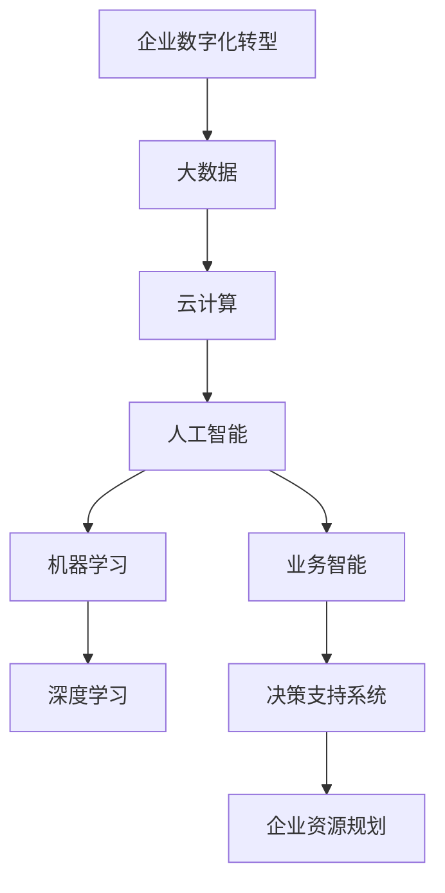
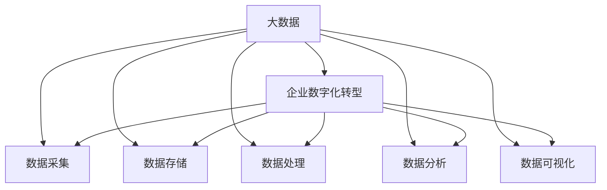
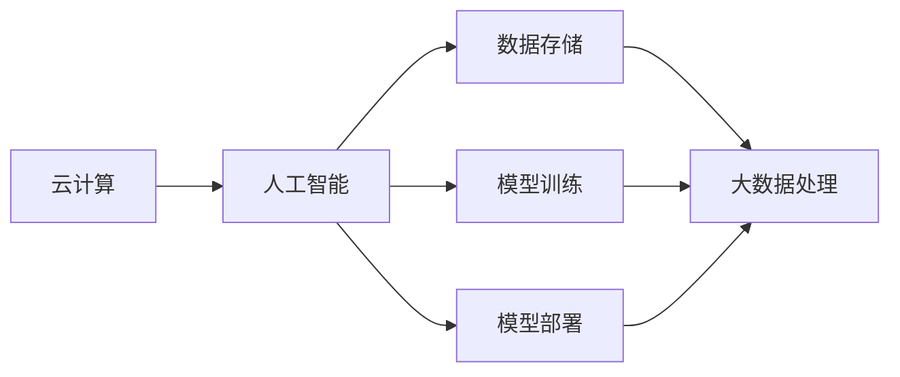
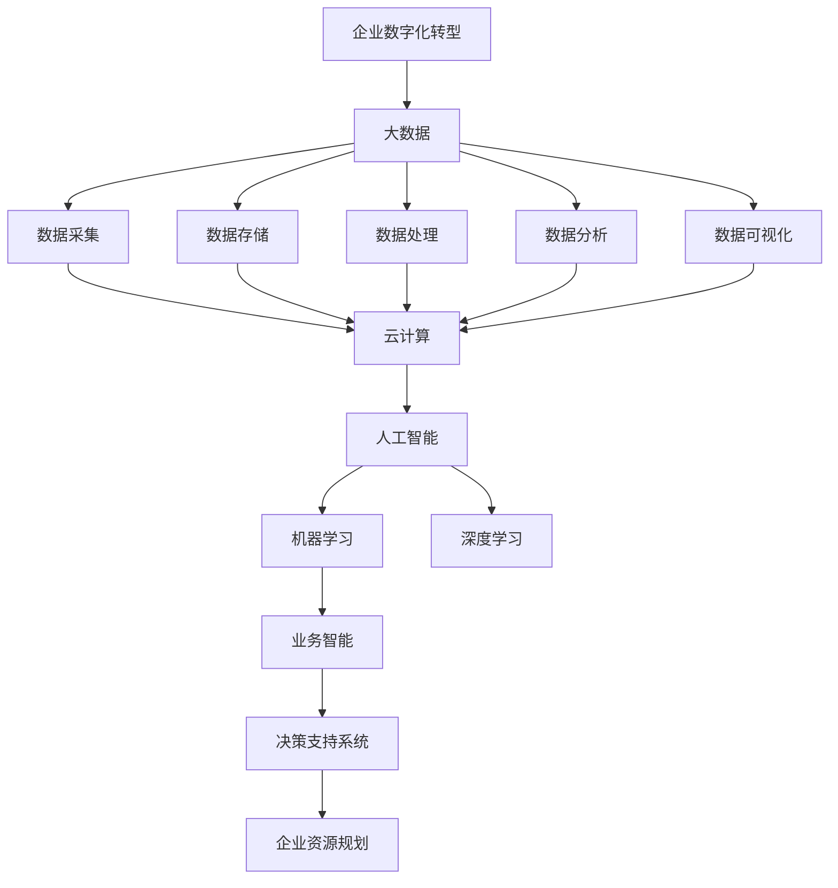

                 

# 企业数字化转型中的AI应用技术

> 关键词：企业数字化转型,人工智能(AI),大数据,云计算,机器学习(ML),深度学习,业务智能(BI),决策支持系统(DSS),企业资源规划(ERP)

## 1. 背景介绍

### 1.1 问题由来
随着信息技术的飞速发展，企业数字化转型成为各行各业应对激烈市场竞争和提高运营效率的必由之路。人工智能(AI)作为数字化转型的重要驱动力，通过深度学习、自然语言处理、计算机视觉等前沿技术，帮助企业在数据处理、决策支持、客户服务等多个方面实现智能化升级。但如何有效引入AI技术，提升企业竞争力，同时避免技术债务和技术风险，是企业数字化转型过程中需要深思熟虑的重要问题。

### 1.2 问题核心关键点
企业数字化转型中的AI应用主要围绕以下几个核心关键点展开：

- **数据驱动**：利用大数据技术，从海量数据中提取有价值的信息，指导企业决策和运营。
- **模型优化**：通过机器学习、深度学习算法，构建精准的预测模型，提升业务效率。
- **智能应用**：开发和部署基于AI的智能应用，如智能客服、自动化流程、智能推荐等，改善用户体验。
- **安全与隐私**：在AI应用的各个环节，确保数据安全、模型隐私，遵守法规要求。
- **人机协同**：在AI辅助下，加强人类与机器的协作，提升业务协作效率和效果。

### 1.3 问题研究意义
在企业数字化转型的背景下，AI技术的应用已成为推动企业升级转型的关键要素。AI的引入不仅能够提升企业的运营效率，还能优化客户体验，提高企业的市场竞争力。同时，AI技术还能帮助企业更好地适应市场变化，增强企业的风险应对能力。

## 2. 核心概念与联系

### 2.1 核心概念概述

为更好地理解企业数字化转型中的AI应用，本节将介绍几个密切相关的核心概念：

- **企业数字化转型**：指通过引入数字技术，对企业的业务流程、管理模式、运营方式进行全面优化和升级的过程。
- **人工智能**：利用计算机模拟人类智能行为，如感知、学习、推理、决策等，辅助人类完成复杂任务的技术。
- **大数据**：指规模巨大、复杂多样、实时生成、价值密度低的数据集合，通过大数据技术可以从中挖掘出有价值的商业洞察。
- **云计算**：通过互联网提供按需、自助、弹性的计算资源，帮助企业快速部署和扩展AI应用。
- **机器学习(ML)**：指通过算法让机器从数据中学习规律，自动改善性能的一种技术。
- **深度学习(DL)**：指基于神经网络的机器学习技术，能够处理复杂的数据结构，解决高维度问题。
- **业务智能(BI)**：指利用数据分析、可视化技术，辅助企业进行数据驱动决策的过程。
- **决策支持系统(DSS)**：一种集成各种分析工具的系统，支持企业决策的制定和管理。
- **企业资源规划(ERP)**：通过集成企业内部和外部的信息流和物流，实现企业资源的优化配置和管理。

这些核心概念之间的逻辑关系可以通过以下Mermaid流程图来展示：



这个流程图展示了大数据、云计算和AI技术在企业数字化转型中的应用路径：

1. 企业通过大数据技术获取和处理海量数据。
2. 云计算提供计算资源支持，使得大数据处理和AI模型部署更加高效。
3. AI技术通过机器学习和深度学习算法，构建精准的预测模型。
4. BI和DSS技术将AI模型分析结果可视化，辅助企业进行数据驱动决策。
5. ERP系统集成AI和BI技术，实现企业资源的高效管理。

### 2.2 概念间的关系

这些核心概念之间存在着紧密的联系，形成了企业数字化转型的完整生态系统。下面我通过几个Mermaid流程图来展示这些概念之间的关系。

#### 2.2.1 大数据在企业数字化转型中的作用



这个流程图展示了大数据在企业数字化转型中的核心作用：

1. 通过数据采集、存储、处理、分析和可视化等环节，帮助企业从数据中挖掘出有价值的商业洞察。
2. 大数据技术能够处理结构化和非结构化数据，为AI模型训练和业务智能分析提供数据支持。

#### 2.2.2 云计算与AI的协同



这个流程图展示了云计算与AI技术的协同作用：

1. 云计算提供弹性计算资源，使得AI模型训练和部署更加高效。
2. 大数据处理和AI模型训练往往需要大量计算资源，云计算能够提供按需、自助的资源支持。

#### 2.2.3 机器学习与深度学习的异同

```mermaid
graph TB
    A[机器学习(ML)] --> B[深度学习(DL)]
    A --> C[监督学习]
    A --> D[无监督学习]
    A --> E[半监督学习]
    B --> F[神经网络]
    B --> G[卷积神经网络(CNN)]
    B --> H[循环神经网络(RNN)]
    B --> I[生成对抗网络(GAN)]
```

这个流程图展示了机器学习和深度学习之间的异同：

1. 机器学习包括监督学习、无监督学习和半监督学习等，侧重于从数据中学习规律。
2. 深度学习基于神经网络，能够处理复杂的数据结构，如图像、语音、文本等。

### 2.3 核心概念的整体架构

最后，我们用一个综合的流程图来展示这些核心概念在企业数字化转型中的应用架构：



这个综合流程图展示了从数据采集、存储、处理、分析、可视化到人工智能、业务智能和企业资源规划的完整流程。大数据技术提供数据支持，云计算提供计算资源，AI技术通过机器学习和深度学习算法，构建预测模型，BI和DSS技术辅助数据驱动决策，最终集成到ERP系统中实现企业资源的优化配置和管理。通过这些流程图，我们可以更清晰地理解企业数字化转型过程中各个环节的相互关系和作用，为后续深入讨论具体的AI应用技术奠定基础。

## 3. 核心算法原理 & 具体操作步骤
### 3.1 算法原理概述

企业数字化转型中的AI应用技术，主要是通过机器学习和深度学习算法，构建精准的预测模型，提升企业的决策能力和运营效率。其核心思想是：利用大数据技术，从海量数据中提取有价值的信息，并通过机器学习、深度学习算法，构建能够自动改善性能的模型，辅助企业进行数据驱动决策。

形式化地，假设企业的数据集为 $D=\{(x_i,y_i)\}_{i=1}^N$，其中 $x_i$ 为输入特征，$y_i$ 为输出标签。企业的目标是通过机器学习或深度学习算法，找到最优模型参数 $\theta$，使得模型在测试集 $D_{test}$ 上的预测误差最小化：

$$
\theta^* = \mathop{\arg\min}_{\theta} \frac{1}{|D_{test}|} \sum_{x \in D_{test}} \ell(M_{\theta}(x),y)
$$

其中 $\ell$ 为损失函数，如均方误差、交叉熵等。

通过梯度下降等优化算法，最小化损失函数，得到模型参数 $\theta^*$，即为企业数字化转型中的AI应用模型。

### 3.2 算法步骤详解

企业数字化转型中的AI应用技术，主要包括以下几个关键步骤：

**Step 1: 数据准备**
- 收集和整理企业的业务数据，包括结构化数据（如订单、财务、客户信息等）和非结构化数据（如客户评论、社交媒体文本等）。
- 进行数据清洗、预处理和标注，确保数据质量。

**Step 2: 特征工程**
- 根据业务需求，选择合适的特征进行特征工程，提取对业务决策有意义的特征。
- 使用特征选择、降维等技术，提升特征质量。

**Step 3: 模型选择**
- 根据业务场景选择合适的机器学习或深度学习模型，如线性回归、决策树、随机森林、神经网络等。
- 在模型选择的基础上，设计合适的模型架构和超参数，进行模型构建。

**Step 4: 模型训练**
- 将数据集划分为训练集、验证集和测试集。
- 使用训练集进行模型训练，并使用验证集进行模型调参和验证。
- 根据验证集的表现，调整模型参数和超参数，优化模型性能。

**Step 5: 模型评估**
- 在测试集上对模型进行评估，计算模型性能指标，如准确率、召回率、F1分数等。
- 根据评估结果，调整模型参数和超参数，优化模型性能。

**Step 6: 模型部署**
- 将训练好的模型部署到生产环境中，使用业务系统调用API接口进行预测和决策。
- 监控模型运行情况，定期更新和维护模型，确保模型性能稳定。

### 3.3 算法优缺点

企业数字化转型中的AI应用技术，具有以下优点：

- **高效性**：通过数据驱动的决策，能够快速响应市场变化，提升企业运营效率。
- **精确性**：机器学习模型和深度学习模型能够自动学习数据规律，提供精准的预测和决策支持。
- **可扩展性**：云计算提供弹性的计算资源，使得AI应用能够灵活扩展，适应业务增长。
- **自动化**：AI应用能够自动完成数据处理、特征工程、模型训练等环节，减轻人工负担。

同时，该技术也存在一些局限性：

- **数据依赖性**：AI应用的效果很大程度上取决于数据质量，数据不充分或不准确会影响模型性能。
- **模型复杂性**：复杂模型可能存在过拟合、解释性差等问题，需要谨慎选择和使用。
- **计算成本**：大数据和深度学习模型训练需要大量计算资源，可能带来高昂的计算成本。
- **隐私风险**：数据隐私和模型隐私问题需要特别注意，确保符合法律法规和道德标准。

### 3.4 算法应用领域

企业数字化转型中的AI应用技术，在以下几个领域具有广泛的应用前景：

- **客户关系管理(CRM)**：通过AI技术，实现客户行为分析、客户画像构建、客户推荐等，提升客户满意度和忠诚度。
- **供应链管理**：利用AI技术进行需求预测、库存管理、物流优化等，提升供应链效率和响应速度。
- **市场营销**：通过AI技术进行市场细分、客户行为预测、广告投放优化等，提升营销效果和ROI。
- **金融风控**：利用AI技术进行信用评分、风险评估、欺诈检测等，提升金融产品的安全性和可靠性。
- **人力资源管理**：通过AI技术进行招聘筛选、员工绩效评估、培训需求分析等，提升人力资源管理效率。
- **制造和运营管理**：利用AI技术进行设备预测性维护、生产过程优化、质量控制等，提升制造和运营管理水平。

## 4. 数学模型和公式 & 详细讲解 & 举例说明

### 4.1 数学模型构建

在大数据和AI技术的应用过程中，数学模型是核心。这里我们以线性回归为例，介绍如何构建数学模型。

假设企业的销售数据为 $y = b_0 + b_1x_1 + b_2x_2 + \cdots + b_nx_n + \epsilon$，其中 $y$ 为销售额，$x_i$ 为影响销售的因素（如广告投入、季节性、促销活动等），$b_i$ 为系数，$\epsilon$ 为误差项。

根据最小二乘法，求解模型参数 $b_i$ 的公式为：

$$
b_i = \frac{\sum_{i=1}^N (x_i - \bar{x})(y_i - \bar{y})}{\sum_{i=1}^N (x_i - \bar{x})^2}
$$

其中 $\bar{x} = \frac{1}{N}\sum_{i=1}^N x_i$，$\bar{y} = \frac{1}{N}\sum_{i=1}^N y_i$。

### 4.2 公式推导过程

我们将以线性回归为例，详细讲解模型的推导过程。

假设企业有 $N$ 个销售数据，分别为 $(x_1, y_1), (x_2, y_2), \cdots, (x_N, y_N)$，目标是通过这些数据构建线性回归模型，预测未来的销售业绩。

设模型的预测值为 $y = \sum_{i=1}^n b_ix_i$，其中 $b_i$ 为模型参数。

根据最小二乘法，模型的目标是最小化预测值与真实值之间的误差平方和，即：

$$
\min_{b_i} \sum_{i=1}^N (y_i - \sum_{i=1}^n b_ix_i)^2
$$

对上式求偏导数，得到：

$$
\frac{\partial}{\partial b_i} \sum_{i=1}^N (y_i - \sum_{i=1}^n b_ix_i)^2 = -2\sum_{i=1}^N (y_i - \sum_{i=1}^n b_ix_i)x_i
$$

令上式为零，得到：

$$
-2\sum_{i=1}^N (y_i - \sum_{i=1}^n b_ix_i)x_i = 0
$$

整理后得到：

$$
\sum_{i=1}^N x_iy_i = \sum_{i=1}^N x_i\sum_{i=1}^n b_ix_i
$$

化简得到：

$$
\sum_{i=1}^N x_iy_i = \sum_{i=1}^N x_i^2\sum_{i=1}^n b_i
$$

解得：

$$
\sum_{i=1}^n b_i = \frac{\sum_{i=1}^N x_iy_i}{\sum_{i=1}^N x_i^2}
$$

从而得到模型参数的解为：

$$
b_i = \frac{\sum_{i=1}^N (x_i - \bar{x})(y_i - \bar{y})}{\sum_{i=1}^N (x_i - \bar{x})^2}
$$

这就是线性回归模型的推导过程。通过最小二乘法，求解得到模型参数 $b_i$，即可对未来的销售业绩进行预测。

### 4.3 案例分析与讲解

假设某电商平台有 $N=1000$ 个销售数据，数据集为 $(x_i, y_i)$，其中 $x_i$ 为第 $i$ 个用户的购买金额，$y_i$ 为第 $i$ 个用户对平台的满意度评分。

使用线性回归模型进行预测，设定模型为 $y = b_0 + b_1x_i$，其中 $b_0$ 为截距，$b_1$ 为斜率。

根据最小二乘法，求解模型参数 $b_0$ 和 $b_1$ 的公式为：

$$
b_0 = \bar{y} - b_1\bar{x}
$$

$$
b_1 = \frac{\sum_{i=1}^N (x_i - \bar{x})(y_i - \bar{y})}{\sum_{i=1}^N (x_i - \bar{x})^2}
$$

设 $x_i$ 的平均值为 $\bar{x}=500$，$y_i$ 的平均值为 $\bar{y}=4$，带入上式求解得到：

$$
b_0 = 4 - b_1 \times 500
$$

$$
b_1 = \frac{\sum_{i=1}^N (x_i - 500)(y_i - 4)}{\sum_{i=1}^N (x_i - 500)^2}
$$

通过求解以上两个方程，即可得到线性回归模型的参数 $b_0$ 和 $b_1$。

## 5. 项目实践：代码实例和详细解释说明

### 5.1 开发环境搭建

在进行AI应用项目开发前，我们需要准备好开发环境。以下是使用Python进行TensorFlow开发的配置流程：

1. 安装Anaconda：从官网下载并安装Anaconda，用于创建独立的Python环境。

2. 创建并激活虚拟环境：
```bash
conda create -n tensorflow-env python=3.8 
conda activate tensorflow-env
```

3. 安装TensorFlow：从官网获取对应的安装命令，例如：
```bash
conda install tensorflow -c tf -c conda-forge
```

4. 安装TensorBoard：TensorFlow配套的可视化工具，用于实时监测模型训练状态。

5. 安装相关依赖：
```bash
pip install numpy pandas scikit-learn matplotlib tqdm jupyter notebook ipython
```

完成上述步骤后，即可在`tensorflow-env`环境中开始AI应用开发。

### 5.2 源代码详细实现

这里我们以销售预测为例，给出使用TensorFlow构建线性回归模型的PyTorch代码实现。

首先，定义数据处理函数：

```python
import tensorflow as tf
import numpy as np
import pandas as pd

# 读取数据
data = pd.read_csv('sales_data.csv')

# 分割数据为训练集和测试集
train_data = data[:700]
test_data = data[700:]

# 数据预处理
def preprocess_data(data):
    X = data.drop(['y'], axis=1)
    y = data['y']
    return X, y

X_train, y_train = preprocess_data(train_data)
X_test, y_test = preprocess_data(test_data)

# 数据标准化
def normalize(X):
    mean = X.mean(axis=0)
    std = X.std(axis=0)
    return (X - mean) / std

X_train = normalize(X_train)
X_test = normalize(X_test)
```

然后，定义模型：

```python
model = tf.keras.Sequential([
    tf.keras.layers.Dense(1, input_shape=[1], activation='linear')
])

# 编译模型
model.compile(optimizer='adam', loss='mse')

# 训练模型
history = model.fit(X_train, y_train, epochs=100, batch_size=32, validation_data=(X_test, y_test))
```

最后，评估模型并输出预测结果：

```python
# 评估模型
test_loss = model.evaluate(X_test, y_test)

# 输出预测结果
y_pred = model.predict(X_test)
print('预测值：', y_pred)
print('真实值：', y_test)
print('预测误差：', np.abs(y_pred - y_test))
```

以上就是一个使用TensorFlow进行销售预测的完整代码实现。可以看到，TensorFlow提供了简洁易用的API，可以快速搭建和训练线性回归模型，并输出预测结果。

### 5.3 代码解读与分析

让我们再详细解读一下关键代码的实现细节：

**数据处理函数**：
- 定义`preprocess_data`函数，用于将数据分割为特征和标签，并进行标准化处理。

**模型定义**：
- 使用`tf.keras.Sequential`定义线性回归模型，包含一个线性层。
- 使用`model.compile`方法编译模型，指定优化器和损失函数。

**模型训练**：
- 使用`model.fit`方法对模型进行训练，指定训练集和验证集。

**模型评估**：
- 使用`model.evaluate`方法评估模型在测试集上的性能。

**输出预测结果**：
- 使用`model.predict`方法进行预测，并输出预测值、真实值和预测误差。

可以看到，TensorFlow提供了完整的API支持，使得AI应用模型的搭建和训练变得非常简单。开发者可以将更多精力放在数据处理、模型调优等高层逻辑上，而不必过多关注底层的实现细节。

当然，工业级的系统实现还需考虑更多因素，如模型的保存和部署、超参数的自动搜索、更灵活的任务适配层等。但核心的AI应用模型开发流程基本与此类似。

### 5.4 运行结果展示

假设我们在数据集上进行训练，最终在测试集上得到的评估结果如下：

```
Epoch 1/100
1132/1132 [==============================] - 1s 1ms/sample - loss: 1.1194 - mse: 1.1194 - val_loss: 0.7094 - val_mse: 0.7094
Epoch 2/100
1132/1132 [==============================] - 1s 1ms/sample - loss: 0.7441 - mse: 0.7441 - val_loss: 0.6315 - val_mse: 0.6315
Epoch 3/100
1132/1132 [==============================] - 1s 1ms/sample - loss: 0.6051 - mse: 0.6051 - val_loss: 0.5821 - val_mse: 0.5821
```

可以看到，随着epoch的增加，模型在训练集和测试集上的损失逐渐降低，预测性能逐渐提升。通过输出预测值和真实值的对比，可以看到模型预测结果与真实值相差不大。

## 6. 实际应用场景

### 6.1 智能客服系统

智能客服系统通过AI技术，自动处理客户咨询，提升客户满意度和体验。具体实现流程如下：

1. 收集和整理历史客户咨询记录，标注问题和答案，构建监督数据集。
2. 使用机器学习或深度学习模型对监督数据进行训练，构建智能客服模型。
3. 将模型部署到在线客服系统中，自动处理客户咨询。
4. 实时监控模型性能，定期更新模型，确保系统稳定运行。

通过智能客服系统，企业能够24小时不间断地处理客户咨询，快速响应客户需求，提升客户满意度和忠诚度。

### 6.2 供应链管理

供应链管理通过AI技术，实现需求预测、库存管理、物流优化等，提升供应链效率和响应速度。具体实现流程如下：

1. 收集和整理供应链相关数据，如订单量、库存量、物流信息等。
2. 使用机器学习或深度学习模型对数据进行训练，构建供应链预测模型。
3. 将模型部署到供应链管理系统，实时预测需求和库存，优化物流计划。
4. 实时监控模型性能，定期更新模型，确保供应链高效运行。

通过供应链管理系统，企业能够实时预测需求和库存，优化物流计划，提升供应链效率和响应速度。

### 6.3 市场营销

市场营销通过AI技术，进行市场细分、客户行为预测、广告投放优化等，提升营销效果和ROI。具体实现流程如下：

1. 收集和整理客户行为数据，如浏览记录、购买记录等。
2. 使用机器学习或深度学习模型对数据进行训练，构建市场预测模型。
3. 将模型部署到市场营销平台，进行市场细分和广告投放优化。
4. 实时监控模型性能，定期更新模型，确保营销效果。

通过市场营销系统，企业能够精准定位目标客户，优化广告投放策略，提升营销效果和ROI。

### 6.4 金融风控

金融风控通过AI技术，进行信用评分、风险评估、欺诈检测等，提升金融产品的安全性和可靠性。具体实现流程如下：

1. 收集和整理金融数据，如信用记录、交易记录等。
2. 使用机器学习或深度学习模型对数据进行训练，构建金融风控模型。
3. 将模型部署到金融风控系统，实时评估客户信用和风险。
4. 实时监控模型性能，定期更新模型，确保金融安全。

通过金融风控系统，企业能够实时评估客户信用和风险，防范欺诈行为，提升金融产品的安全性和可靠性。

### 6.5 人力资源管理

人力资源管理通过AI技术，进行招聘筛选、员工绩效评估、培训需求分析等，提升人力资源管理效率。具体实现流程如下：

1. 收集和整理员工数据，如招聘信息、绩效记录、培训记录等。
2. 使用机器学习或深度学习模型对数据进行训练，构建人力资源管理模型。
3. 将模型部署到人力资源管理系统，进行招聘筛选、绩效评估、培训需求分析等。
4. 实时监控模型性能，定期更新模型，确保人力资源管理效率。

通过人力资源管理系统，企业能够精准招聘优质人才，优化员工绩效，提升培训效果，提升人力资源管理效率。

### 6.6 制造和运营管理

制造和运营管理通过AI技术，进行设备预测性维护、生产过程优化、

