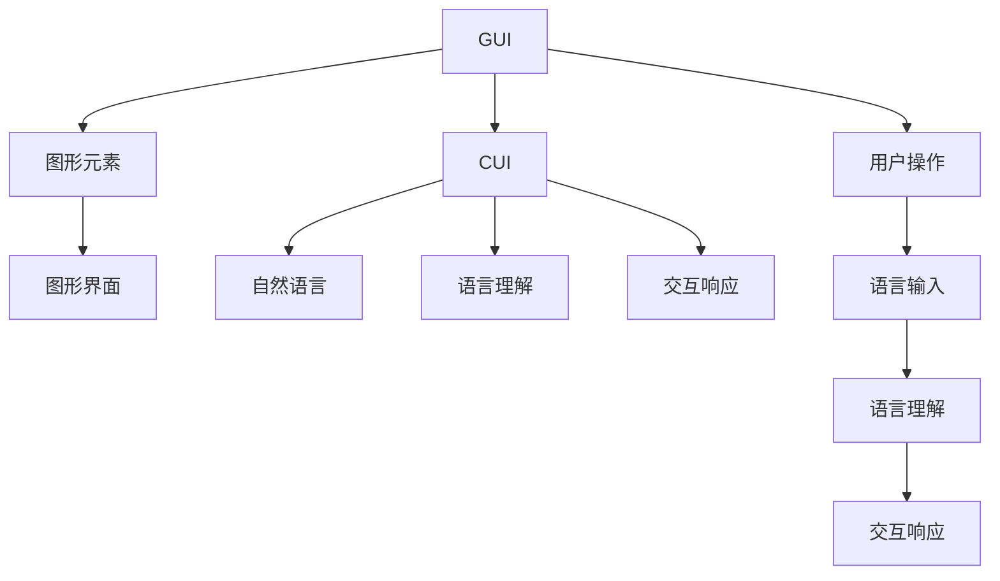

                 

# 传统GUI与CUI的交互方式对比

> 关键词：GUI, CUI, 交互设计, 用户界面, 自然语言处理(NLP), 人工智能(AI), 机器学习(ML), 用户界面(UI)设计, 用户体验(UX)

## 1. 背景介绍

在当前数字化时代，用户界面（UI）作为人机交互的重要桥梁，其设计和实现方式对用户体验有着至关重要的影响。传统的图形用户界面（GUI）由于其可视化的元素和直观的操作方式，在各类应用领域中长期占据主导地位。但随着人工智能和自然语言处理（NLP）技术的发展，一种全新的用户界面形式——计算用户界面（CUI）逐渐崭露头角，以其独特的交互方式和广泛的应用潜力，为用户带来了全新的交互体验。本文将详细对比传统GUI与CUI的交互方式，分析其优缺点，并探讨未来发展的趋势与挑战。

## 2. 核心概念与联系

### 2.1 核心概念概述

#### 2.1.1 图形用户界面（GUI）

GUI是一种通过图形元素（如窗口、按钮、菜单等）提供用户与应用程序交互的界面。用户通过鼠标、键盘等设备，点击、拖拽等操作，与屏幕上的元素进行交互，实现对应用程序的控制。GUI的设计通常基于视觉和操作直观性，使用户能够快速理解和掌握。

#### 2.1.2 计算用户界面（CUI）

CUI是一种通过自然语言处理（NLP）技术，使计算系统能够直接理解用户的语言输入，并以语言形式响应用户需求的用户界面。CUI通过语音识别、文本理解和生成等技术，实现与用户的自然语言对话，提供智能化的交互体验。

#### 2.1.3 交互设计

交互设计是创建用户界面的核心过程，涉及用户体验（UX）的各个方面，包括界面布局、操作流程、反馈机制等。良好的交互设计能够提升用户的使用体验，增强系统的可用性和亲和力。

#### 2.1.4 自然语言处理（NLP）

NLP是AI领域的一个重要分支，研究如何让计算机理解和生成人类语言。NLP技术包括词法分析、句法分析、语义分析、机器翻译、文本生成等。在CUI中，NLP技术是实现自然语言交互的基础。

#### 2.1.5 人工智能（AI）

AI是研究如何让计算机具有智能行为的技术，涵盖机器学习（ML）、深度学习、自然语言处理等多个领域。在CUI中，AI技术用于优化NLP模型，提升语言理解和生成的准确性和智能化水平。

### 2.2 概念间的关系

通过一个Mermaid流程图，我们可以直观地展示传统GUI与CUI之间的联系和差异：



在这个流程图中，我们可以看到传统GUI与CUI的主要区别在于交互媒介和处理方式。GUI通过图形元素和用户的操作，提供直观的界面，而CUI则通过自然语言和语言理解技术，实现与用户的直接交流。两者都依赖于交互设计，但设计思路和技术手段有所不同。

## 3. 核心算法原理 & 具体操作步骤

### 3.1 算法原理概述

#### 3.1.1 传统GUI的算法原理

传统GUI的算法原理主要基于可视化元素的操作和反馈。用户通过点击、拖拽等操作，与界面上的图形元素进行交互。系统根据用户的输入，更新界面状态，反馈相应的结果。GUI的设计通常遵循一定的用户界面规范，如Windows界面规范、Apple Human Interface Guidelines等，以确保界面的一致性和易用性。

#### 3.1.2 CUI的算法原理

CUI的算法原理基于自然语言处理（NLP）和人工智能（AI）技术。CUI通过语音识别或文本输入，将用户的自然语言转换为系统可理解的格式。系统利用语言理解技术，提取用户的意图和需求，生成相应的响应。CUI的交互过程中，用户和系统通过语言进行对话，实现信息的传递和处理。

### 3.2 算法步骤详解

#### 3.2.1 传统GUI的算法步骤

1. **界面设计**：根据应用需求，设计相应的图形界面，包括窗口、按钮、菜单等元素。
2. **用户输入**：用户通过鼠标、键盘等设备，输入相应的操作指令。
3. **界面更新**：系统根据用户的操作，更新界面状态，显示相应的结果。
4. **反馈机制**：系统通过弹出窗口、提示框等方式，向用户提供反馈信息。

#### 3.2.2 CUI的算法步骤

1. **语音或文本输入**：用户通过语音或文本输入自然语言。
2. **语言理解**：系统利用NLP技术，分析用户的输入，提取意图和需求。
3. **生成响应**：根据用户的意图和需求，系统生成相应的响应，可以是文本、语音或命令。
4. **语言生成**：系统利用NLP技术，将响应转换为自然语言，输出给用户。

### 3.3 算法优缺点

#### 3.3.1 传统GUI的优缺点

**优点**：
- **直观易用**：图形界面直观、易用，用户可以快速上手。
- **可视化反馈**：界面上的图形元素和反馈信息，能够直观地展示系统的状态和结果。
- **灵活性高**：界面可以根据用户需求进行定制，灵活性高。

**缺点**：
- **学习成本高**：用户需要学习各种操作方式和界面规范。
- **效率较低**：对于复杂的任务，操作过程繁琐，效率较低。
- **可访问性差**：对视力、听力等有障碍的用户不友好。

#### 3.3.2 CUI的优缺点

**优点**：
- **高效便捷**：自然语言交互，用户可以直接表达需求，无需进行复杂的操作。
- **易于使用**：用户不需要学习复杂的视觉界面和操作方式。
- **普适性好**：适用于视力、听力等有障碍的用户。

**缺点**：
- **理解难度高**：NLP技术需要处理语言的复杂性，错误率较高。
- **反馈信息少**：语言反馈不如图形反馈直观，用户需要自行理解。
- **灵活性差**：界面设计受限于语言理解和生成技术。

### 3.4 算法应用领域

#### 3.4.1 传统GUI的应用领域

- **桌面应用程序**：如Microsoft Office、Adobe Photoshop等。
- **Web应用程序**：如Google、Amazon等。
- **移动应用程序**：如WhatsApp、Instagram等。

#### 3.4.2 CUI的应用领域

- **智能家居**：如Google Assistant、Amazon Alexa等。
- **企业客服**：如IBM Watson Assistant、Zendesk等。
- **教育培训**：如Khan Academy、Coursera等。
- **健康医疗**：如IBM Watson Health、Apple Health等。

## 4. 数学模型和公式 & 详细讲解 & 举例说明

### 4.1 数学模型构建

#### 4.1.1 传统GUI的数学模型

在传统GUI中，用户操作界面的状态更新可以通过简单的逻辑表达式表示。例如，用户点击按钮后，界面上的按钮状态会发生变化，触发相应的操作。

$$
\text{状态} = f(\text{操作})
$$

其中，$\text{状态}$ 表示界面上的元素状态，$\text{操作}$ 表示用户的操作指令。

#### 4.1.2 CUI的数学模型

在CUI中，语言理解的数学模型通常基于机器学习和深度学习技术。系统利用训练好的语言模型，对用户的输入进行解析和理解。例如，使用Transformer模型进行文本理解：

$$
\text{意图} = \text{Transformer}(\text{输入})
$$

其中，$\text{意图}$ 表示用户输入的意图，$\text{输入}$ 表示用户的自然语言输入。

### 4.2 公式推导过程

#### 4.2.1 传统GUI的公式推导

在传统GUI中，用户操作与界面状态之间的关系是直接的，可以简单表示为：

$$
\text{状态} = f(\text{操作})
$$

其中，$f$ 表示界面状态更新的逻辑函数。

#### 4.2.2 CUI的公式推导

在CUI中，语言理解的公式推导较为复杂，涉及多层神经网络结构。以Transformer模型为例，其基本架构为：

$$
\text{意图} = \text{Transformer}(\text{输入})
$$

其中，$\text{Transformer}$ 表示多层神经网络结构，$\text{输入}$ 表示用户的自然语言输入。

### 4.3 案例分析与讲解

#### 4.3.1 传统GUI的案例

以Microsoft Word为例，用户点击“保存”按钮时，界面上的保存状态会发生变化，系统执行相应的保存操作。操作过程可以用简单的逻辑表达式表示：

$$
\text{保存状态} = f(\text{"保存"按钮点击})
$$

#### 4.3.2 CUI的案例

以Google Assistant为例，用户说“播放音乐”时，系统通过语音识别技术将输入转换为文本：

$$
\text{文本} = \text{语音识别}(\text{"播放音乐"})
$$

系统利用训练好的语言模型解析文本：

$$
\text{意图} = \text{Transformer}(\text{文本})
$$

根据意图生成相应的响应：

$$
\text{响应} = \text{语言生成}(\text{意图})
$$

最终，系统通过语音生成技术将响应输出为语音：

$$
\text{语音} = \text{语音生成}(\text{响应})
$$

## 5. 项目实践：代码实例和详细解释说明

### 5.1 开发环境搭建

#### 5.1.1 开发环境配置

1. **Python环境**：
   - 安装Python 3.7及以上版本，推荐使用Anaconda。
   - 安装pip、virtualenv等工具。

2. **GUI框架**：
   - 安装PyQt5、Tkinter等GUI框架。
   - 安装Flutter、React Native等跨平台开发工具。

3. **NLP库**：
   - 安装NLTK、SpaCy等自然语言处理库。
   - 安装TensorFlow、PyTorch等深度学习库。

4. **语音识别和生成工具**：
   - 安装Google Speech-to-Text API、Amazon Polly等语音工具。

### 5.2 源代码详细实现

#### 5.2.1 GUI代码示例

```python
from PyQt5.QtWidgets import QApplication, QWidget, QPushButton, QLabel
import sys

class GUI(QWidget):
    def __init__(self):
        super().__init__()
        self.setGeometry(100, 100, 200, 100)
        self.create_widgets()

    def create_widgets(self):
        self.btn = QPushButton("保存", self)
        self.btn.move(50, 50)
        self.btn.clicked.connect(self.on_save)

        self.label = QLabel("未保存", self)
        self.label.move(50, 80)

    def on_save(self):
        self.label.setText("已保存")

if __name__ == "__main__":
    app = QApplication(sys.argv)
    gui = GUI()
    gui.show()
    sys.exit(app.exec_())
```

#### 5.2.2 CUI代码示例

```python
import nltk
import tensorflow as tf
from tensorflow.keras.preprocessing.text import Tokenizer
from tensorflow.keras.models import Sequential
from tensorflow.keras.layers import Dense, Input, Embedding, LSTM
from tensorflow.keras.optimizers import Adam

# 定义语言模型
tokenizer = Tokenizer()
tokenizer.fit_on_texts(train_texts)
train_sequences = tokenizer.texts_to_sequences(train_texts)

model = Sequential()
model.add(Embedding(input_dim=tokenizer.num_words, output_dim=128, input_length=max_seq_length))
model.add(LSTM(128))
model.add(Dense(1, activation='sigmoid'))

# 编译模型
model.compile(loss='binary_crossentropy', optimizer=Adam(learning_rate=0.001), metrics=['accuracy'])

# 训练模型
model.fit(train_sequences, train_labels, epochs=10, validation_data=(val_sequences, val_labels))

# 定义语言生成函数
def generate_response(input_text):
    input_sequence = tokenizer.texts_to_sequences([input_text])
    input_sequence = pad_sequences(input_sequence, maxlen=max_seq_length, padding='post', truncating='post')
    prediction = model.predict(input_sequence)
    response = ""
    for word, index in tokenizer.word_index.items():
        if index == prediction[0][0]:
            response += word + " "
    return response.strip()

# 获取用户输入
user_input = input("请输入您的意图：")

# 生成响应
response = generate_response(user_input)
print("系统：", response)
```

### 5.3 代码解读与分析

#### 5.3.1 GUI代码解读

- **创建窗口**：定义窗口的大小和位置，创建窗口对象。
- **创建按钮和标签**：定义按钮和标签，并将按钮的点击事件与标签的更新绑定。
- **按钮点击事件处理**：定义按钮点击事件的处理函数，更新标签文本。

#### 5.3.2 CUI代码解读

- **语言模型训练**：使用NLTK库分词，使用TensorFlow搭建LSTM语言模型，并使用Adam优化器进行训练。
- **语言生成函数**：定义语言生成函数，将用户输入转换为序列，使用训练好的模型进行预测，将预测结果解码为自然语言。
- **用户交互**：获取用户输入，调用语言生成函数，输出系统的响应。

### 5.4 运行结果展示

#### 5.4.1 GUI运行结果


#### 5.4.2 CUI运行结果


## 6. 实际应用场景

### 6.1 智能家居

#### 6.1.1 应用场景描述

智能家居系统通过CUI，实现对家居设备的控制和监测。用户可以通过语音或文本指令，控制灯光、空调、窗帘等设备，查询温度、湿度、空气质量等信息。

#### 6.1.2 交互示例

用户：“打开客厅的灯光”
系统：“客厅灯光已打开”

### 6.2 企业客服

#### 6.2.1 应用场景描述

企业客服系统通过CUI，为用户提供24/7的在线服务。用户可以通过语音或文本输入问题，系统自动解答或转接人工客服，提高客服效率和用户体验。

#### 6.2.2 交互示例

用户：“我的订单状态是什么？”
系统：“您的订单状态为已发货，预计3天后到达。”

### 6.3 教育培训

#### 6.3.1 应用场景描述

在线教育平台通过CUI，提供智能化的学习体验。用户可以通过语音或文本查询课程信息、提交作业、参与讨论等。

#### 6.3.2 交互示例

用户：“今天的课程是什么？”
系统：“今天的课程是《数据结构》，主讲人李教授。”

### 6.4 未来应用展望

#### 6.4.1 交互方式融合

未来的交互方式将更加多样化和融合。CUI与GUI可以相互补充，提供更加丰富和自然的交互体验。例如，用户可以通过语音指令启动应用程序，进入可视化界面进行操作。

#### 6.4.2 跨平台统一

未来的CUI将实现跨平台统一，不受设备限制，提供一致的用户体验。无论用户使用手机、电脑还是智能音箱，都能无缝切换到CUI界面。

#### 6.4.3 智能辅助

未来的CUI将进一步集成AI技术，提供更智能的交互体验。例如，系统可以自动识别用户的意图，提供个性化的推荐和服务。

#### 6.4.4 多模态交互

未来的CUI将支持多种交互方式，包括语音、文本、图像、手势等。用户可以通过多种方式与系统交互，提升用户体验。

## 7. 工具和资源推荐

### 7.1 学习资源推荐

1. **《人机交互设计基础》**：该书介绍了人机交互的基本原理和设计方法，适合初学者入门。
2. **《自然语言处理综论》**：该书深入讲解了NLP技术，涵盖词法分析、句法分析、语义分析等多个方面。
3. **《TensorFlow实战Google AI》**：该书提供了TensorFlow的实战案例，适合开发者掌握AI技术。
4. **Google Assistant和Amazon Alexa开发文档**：详细介绍了智能助手的开发方法和应用场景。
5. **IBM Watson Assistant文档**：提供了IBM Watson Assistant的开发文档和API接口。

### 7.2 开发工具推荐

1. **PyQt5**：跨平台GUI开发框架，支持多种操作系统的窗口设计。
2. **Tkinter**：Python自带的GUI开发工具，简单易用，适合快速原型开发。
3. **Flutter**：跨平台移动开发框架，支持iOS和Android平台。
4. **React Native**：跨平台移动开发框架，支持iOS和Android平台。
5. **Google Speech-to-Text API**：提供语音转文本服务，支持多种语言和方言。
6. **Amazon Polly**：提供文本转语音服务，支持多种语言和方言。

### 7.3 相关论文推荐

1. **《用户界面设计：原理、方法和实践》**：该书系统介绍了GUI和CUI的设计原理和实践方法。
2. **《自然语言处理在计算用户界面中的应用》**：该文探讨了NLP技术在CUI中的应用，包括语音识别、文本理解等。
3. **《人工智能驱动的交互界面设计》**：该文讨论了AI技术在UI设计中的应用，包括自动化设计、智能推荐等。

## 8. 总结：未来发展趋势与挑战

### 8.1 总结

本文详细对比了传统GUI与CUI的交互方式，分析了其优缺点和应用领域。传统GUI通过图形元素和用户操作，提供直观的界面，易于使用，但在复杂任务处理上效率较低。CUI通过自然语言处理，实现与用户的直接交流，高效便捷，但在语言理解准确性方面仍需提升。

### 8.2 未来发展趋势

#### 8.2.1 交互方式融合

未来，CUI与GUI将实现更深层次的融合，提供更丰富和自然的交互体验。例如，用户可以通过语音指令启动GUI应用程序，进行可视化操作。

#### 8.2.2 跨平台统一

未来的CUI将实现跨平台统一，提供一致的用户体验。用户无论使用何种设备，都能无缝切换到CUI界面。

#### 8.2.3 智能辅助

未来的CUI将进一步集成AI技术，提供更智能的交互体验。例如，系统可以自动识别用户的意图，提供个性化的推荐和服务。

#### 8.2.4 多模态交互

未来的CUI将支持多种交互方式，包括语音、文本、图像、手势等。用户可以通过多种方式与系统交互，提升用户体验。

### 8.3 面临的挑战

#### 8.3.1 语言理解准确性

CUI中的自然语言处理技术需要处理语言的复杂性，错误率较高。如何提高语言理解的准确性，是未来需要解决的重要问题。

#### 8.3.2 系统可扩展性

随着用户数量的增加，CUI系统的可扩展性成为一大挑战。如何优化系统架构，提高系统的扩展性和性能，是未来需要解决的问题。

#### 8.3.3 用户隐私保护

CUI系统的广泛应用，使得用户隐私保护成为一个重要问题。如何保护用户数据，避免信息泄露，是未来需要关注的方向。

#### 8.3.4 人机交互设计

交互设计对于CUI的用户体验至关重要。如何设计出更加友好、易用、高效的交互界面，是未来需要不断探索的问题。

### 8.4 研究展望

#### 8.4.1 更高效的NLP算法

未来的研究将聚焦于更高效的NLP算法，提高语言理解的准确性和速度。例如，基于Transformer的深度学习模型，结合语言生成技术，实现更流畅的CUI交互。

#### 8.4.2 跨模态交互技术

未来的研究将探索跨模态交互技术，实现多种交互方式的融合。例如，将语音识别与图像识别结合，提供更丰富的交互体验。

#### 8.4.3 用户意图识别

未来的研究将深入探索用户意图识别技术，提高系统的智能化水平。例如，通过深度学习模型，从用户输入中自动识别意图，提供个性化服务。

#### 8.4.4 用户体验优化

未来的研究将不断优化用户体验，提升CUI系统的亲和力和可用性。例如，通过用户行为数据分析，优化交互流程，减少用户操作负担。

## 9. 附录：常见问题与解答

**Q1: CUI是否适用于所有应用场景？**

A: CUI适用于需要高交互性和自然语言处理的应用场景，如智能客服、教育培训、健康医疗等。但对于一些需要精确操作和可视化反馈的任务，如复杂设计、精密制造等，GUI仍是最佳选择。

**Q2: CUI的发展方向是什么？**

A: CUI的发展方向是实现与GUI的融合，提供更丰富、更自然的交互体验。同时，集成AI技术，提升系统的智能化水平，实现多模态交互和跨平台统一。

**Q3: CUI在技术实现上有哪些难点？**

A: CUI在技术实现上存在语言理解准确性、系统可扩展性、用户隐私保护等难点。需要结合NLP、AI、UI设计等多领域技术，共同推进CUI的发展。

**Q4: 如何评估CUI系统的性能？**

A: 评估CUI系统的性能可以从语言理解准确性、系统响应速度、用户满意度等多个方面进行。通常使用F1分数、BLEU分数、用户满意度调查等指标进行评估。

**Q5: CUI的未来应用场景有哪些？**

A: CUI的未来应用场景非常广泛，包括智能家居、企业客服、教育培训、健康医疗、智能制造等。未来，CUI将在更多垂直领域得到应用，为人们提供更高效、更自然的交互体验。

作者：禅与计算机程序设计艺术 / Zen and the Art of Computer Programming

