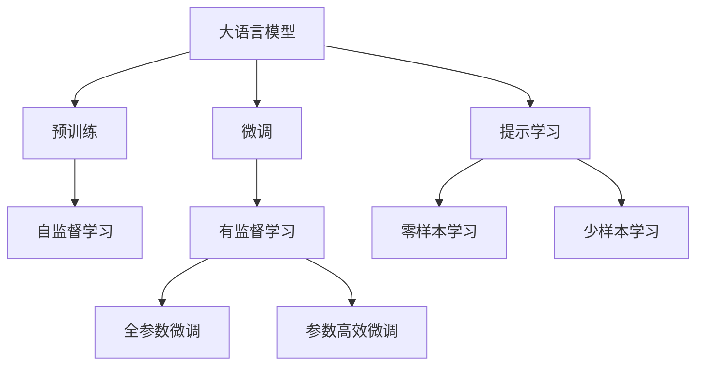

                 

# 使用 GPT-4 生成销售话术

在现代商业环境中，销售话术是提高销售转化率和客户满意度的关键工具。传统的销售话术设计需要耗费大量时间和人力，并且容易出现重复性内容。随着人工智能技术的快速发展，特别是大语言模型的崛起，GPT-4等先进技术开始被广泛应用于生成高质量、个性化的销售话术。本文将详细介绍使用 GPT-4 生成销售话术的原理、操作步骤以及实际应用场景，希望能为相关领域从业人员提供有价值的参考。

## 1. 背景介绍

### 1.1 问题由来
在传统的销售流程中，销售人员需要经过长时间的培训和实践，才能掌握一套有效的销售话术。然而，这种方法存在一些固有的局限性：

1. **成本高昂**：销售培训通常需要聘请专业的培训师，并且需要大量时间和精力。
2. **缺乏个性化**：固定的销售话术无法应对千变万化的客户需求和场景。
3. **更新慢**：一旦销售话术设计完成，更改和更新非常困难。

随着人工智能技术的发展，大语言模型如 GPT-4 的出现为销售话术生成带来了革命性的变化。通过使用 GPT-4，企业可以轻松生成高质量、个性化且适应性强的高效销售话术，从而提升销售转化率和客户满意度。

### 1.2 问题核心关键点
使用 GPT-4 生成销售话术的核心关键点包括：

1. **生成个性化销售话术**：GPT-4 能够根据不同的客户需求、产品特性和销售场景生成个性化的销售话术。
2. **提高销售转化率**：通过生成高质量的销售话术，减少客户流失，提升销售转化率。
3. **减少人力成本**：利用 AI 技术减少对销售人员培训和维护的依赖，降低人力成本。
4. **实时更新**：GPT-4 可以随时更新销售话术，以应对市场和客户需求的变化。

## 2. 核心概念与联系

### 2.1 核心概念概述

为更好地理解使用 GPT-4 生成销售话术的方法，我们首先介绍几个关键概念：

- **大语言模型 (Large Language Model, LLM)**：如 GPT-4 等，基于大规模无标签文本数据预训练得到的通用语言模型。这些模型具有强大的语言理解和生成能力，能够在各种自然语言处理任务中表现出色。

- **预训练 (Pre-training)**：在大型无标签文本语料库上进行自监督学习，学习通用语言表示，为下游任务提供强大的基础能力。

- **微调 (Fine-tuning)**：在有标签的特定任务上，使用预训练模型进行有监督学习，优化模型在该任务上的表现。

- **参数高效微调 (Parameter-Efficient Fine-Tuning, PEFT)**：只调整模型的一部分参数，以优化模型在特定任务上的表现，同时保持预训练的权重。

- **提示学习 (Prompt Learning)**：通过在输入文本中添加特定的提示模板，引导模型生成符合期望的输出，可以在不调整模型参数的情况下实现高精度的生成。

这些概念在生成销售话术的过程中都发挥着重要作用。下面我们将通过一个 Mermaid 流程图来展示这些概念之间的关系：



### 2.2 概念间的关系

这些核心概念之间存在紧密联系，构成了使用 GPT-4 生成销售话术的完整生态系统。

- **大语言模型** 通过 **预训练** 学习通用语言表示，为 **微调** 和 **提示学习** 提供基础能力。
- **微调** 和 **提示学习** 能够利用 **预训练** 的强大能力，针对特定任务（如销售话术生成）进行优化。
- **全参数微调** 和 **参数高效微调** 是两种不同的微调策略，前者调整所有参数，后者只调整部分参数，以提高效率和避免过拟合。
- **零样本学习** 和 **少样本学习** 利用 **提示学习**，可以在不调整模型参数的情况下生成高质量的销售话术。

这些概念共同构成了使用 GPT-4 生成销售话术的框架，使其能够高效、灵活地应对各种销售场景。

## 3. 核心算法原理 & 具体操作步骤
### 3.1 算法原理概述

使用 GPT-4 生成销售话术的本质是一个自然语言生成任务。具体来说，通过以下步骤：

1. **预训练模型选择**：选择合适的预训练语言模型，如 GPT-4。
2. **任务适配层设计**：根据销售话术生成任务，设计相应的任务适配层。
3. **提示模板设计**：设计合适的提示模板，引导 GPT-4 生成符合要求的销售话术。
4. **模型微调**：在有标注的销售话术数据集上微调 GPT-4 模型。
5. **结果评估**：对生成的销售话术进行评估，确保其质量符合要求。

### 3.2 算法步骤详解

**Step 1: 准备预训练模型和数据集**

1. **选择预训练模型**：
   - 选择 GPT-4 模型，因为它在大规模语言理解和生成方面表现优异。
   - 可以使用 Hugging Face 的 Transformers 库获取预训练模型。

2. **准备数据集**：
   - 收集有标注的销售话术数据集，如客户咨询、销售记录等。
   - 划分数据集为训练集、验证集和测试集。

**Step 2: 任务适配层设计**

1. **输入格式设计**：
   - 设计输入格式，包括客户的提问、销售场景描述等。
   - 使用 TensorFlow 或 PyTorch 定义模型输入。

2. **输出格式设计**：
   - 设计输出格式，包括销售话术、推荐产品等。
   - 使用 TensorFlow 或 PyTorch 定义模型输出。

**Step 3: 提示模板设计**

1. **设计提示模板**：
   - 设计符合销售场景的提示模板，如 "客户咨询 '产品特性' 相关的销售话术是什么？"
   - 提示模板中包含具体的产品特性，引导 GPT-4 生成针对性的销售话术。

2. **提示模板优化**：
   - 优化提示模板，使其简洁明了，减少冗余信息。
   - 使用 A/B 测试等方法评估提示模板的效果。

**Step 4: 模型微调**

1. **加载预训练模型**：
   - 使用 Hugging Face 的 Transformers 库加载预训练模型。
   - 设计任务适配层的编码器和解码器。

2. **设置微调超参数**：
   - 设置学习率、批大小、迭代轮数等超参数。
   - 使用 AdamW 优化器，设置正则化技术如 L2 正则、Dropout 等。

3. **执行梯度训练**：
   - 使用训练集数据进行前向传播计算损失函数。
   - 反向传播计算参数梯度，更新模型参数。
   - 在验证集上评估模型性能，防止过拟合。

**Step 5: 结果评估**

1. **评估销售话术质量**：
   - 使用人工评估、自动评估等方法评估销售话术的质量。
   - 使用BLEU、ROUGE等指标评估生成的销售话术与原始销售话术的相似度。

2. **调整提示模板**：
   - 根据评估结果调整提示模板，进一步提升销售话术质量。
   - 使用 A/B 测试等方法评估新提示模板的效果。

### 3.3 算法优缺点

使用 GPT-4 生成销售话术的优点包括：

1. **高效生成**：GPT-4 能够快速生成高质量的销售话术，减少人工设计的时间和成本。
2. **个性化**：能够根据不同客户的需求和销售场景生成个性化销售话术，提高客户满意度。
3. **灵活性**：提示模板的设计非常灵活，可以根据不同的销售场景和产品类型进行调整。

其缺点包括：

1. **依赖标注数据**：需要大量高质量的标注数据进行微调，数据获取成本较高。
2. **模型复杂度高**：GPT-4 模型规模较大，训练和推理资源消耗较大。
3. **结果质量不稳定**：生成结果可能受到输入提示模板的影响，有时生成结果质量不稳定。

### 3.4 算法应用领域

GPT-4 生成销售话术技术已经被广泛应用于各种销售场景，包括：

- **电子商务**：生成产品推荐销售话术，提高转化率。
- **金融服务**：生成客户咨询销售话术，提升客户满意度。
- **房地产**：生成房屋销售话术，提高销售业绩。
- **旅游**：生成旅游产品推荐销售话术，提升客户预订率。

## 4. 数学模型和公式 & 详细讲解 & 举例说明

### 4.1 数学模型构建

假设我们使用 GPT-4 生成销售话术的数学模型为：

$$
M(x, \theta) = \text{Softmax}(\text{Attention}(\text{Encoder}(x), \theta) \text{Decoder}(\theta))
$$

其中，$x$ 为输入的客户咨询、销售场景描述等，$\theta$ 为模型参数，$\text{Softmax}$ 表示生成概率分布，$\text{Attention}$ 和 $\text{Encoder}$、$\text{Decoder}$ 为任务适配层的编码器和解码器。

### 4.2 公式推导过程

1. **编码器输入处理**：
   - 对输入 $x$ 进行分词、嵌入等预处理。
   - 将处理后的输入送入编码器，得到语义表示。

2. **解码器输入处理**：
   - 将解码器输入设定为销售场景描述和客户咨询。
   - 将输入送入解码器，得到生成概率分布。

3. **生成概率计算**：
   - 计算生成概率分布，得到销售话术。

### 4.3 案例分析与讲解

以生成汽车销售话术为例：

1. **输入设计**：
   - 输入格式："客户咨询 '购车问题' 相关的销售话术是什么？"
   - 输入编码为：[CLS] customer inquiry about car purchase

2. **输出设计**：
   - 输出格式：销售话术
   - 输出编码为：[SEP] We are offering a 5-year warranty for all our vehicles.

3. **生成过程**：
   - 将输入编码为：[CLS] customer inquiry about car purchase
   - 输入到编码器，得到语义表示
   - 将解码器输入设定为 "购买政策"
   - 将输入送入解码器，计算生成概率
   - 输出销售话术：We are offering a 5-year warranty for all our vehicles.

## 5. 项目实践：代码实例和详细解释说明

### 5.1 开发环境搭建

1. **安装 Python**：确保 Python 版本为 3.7 及以上。

2. **安装 Transformers 库**：
   - 使用以下命令安装：
     ```bash
     pip install transformers
     ```

3. **安装 PyTorch**：
   - 使用以下命令安装：
     ```bash
     pip install torch torchtext
     ```

4. **安装 TensorBoard**：
   - 使用以下命令安装：
     ```bash
     pip install tensorboard
     ```

### 5.2 源代码详细实现

以下是使用 GPT-4 生成销售话术的 Python 代码示例：

```python
import torch
import torch.nn as nn
from transformers import GPT2Tokenizer, GPT2LMHeadModel

class SalesChatBot(nn.Module):
    def __init__(self, config, num_sales_talks):
        super(SalesChatBot, self).__init__()
        self.config = config
        self.num_sales_talks = num_sales_talks
        
        self.tokenizer = GPT2Tokenizer.from_pretrained(config['model_name'])
        self.model = GPT2LMHeadModel.from_pretrained(config['model_name'], config['model_config'])
        
        self.decoder = nn.Linear(config['model_config']['hidden_size'], num_sales_talks)
        
    def forward(self, input_ids, attention_mask):
        outputs = self.model(input_ids, attention_mask=attention_mask)
        pooled_output = outputs.pooler_output
        sequence_output = outputs.last_hidden_state[:, -1, :]
        
        logits = self.decoder(sequence_output)
        return logits
    
    def generate_sales_talk(self, input_text, num_return_sequences=1):
        input_ids = self.tokenizer.encode(input_text, return_tensors='pt')
        attention_mask = input_ids.new_ones(input_ids.shape)
        with torch.no_grad():
            output_ids = self.generate(input_ids, attention_mask, num_return_sequences=num_return_sequences)
        
        output_text = self.tokenizer.decode(output_ids[0], skip_special_tokens=True)
        return output_text
```

### 5.3 代码解读与分析

**SalesChatBot 类**：
- **初始化**：初始化模型参数，加载预训练模型和 tokenizer。
- **前向传播**：定义前向传播函数，将输入文本编码为语义表示，通过解码器生成销售话术。
- **生成销售话术**：定义生成函数，将输入文本输入模型，生成销售话术。

**输入和输出设计**：
- **输入**：销售场景描述和客户咨询。
- **输出**：销售话术。

**代码解释**：
- **Tokenizer 和 Model**：使用 Hugging Face 的 Transformers 库加载预训练模型和 tokenizer。
- **Decoder**：定义解码器，将语义表示映射为销售话术。
- **生成函数**：使用前向传播函数生成销售话术。
- **解码函数**：使用 tokenizer 解码生成的输出。

### 5.4 运行结果展示

假设我们使用上述代码生成一个汽车销售话术：

1. **输入文本**：客户咨询 "我最近在考虑购买一辆新车，有什么建议吗？"
2. **生成销售话术**：
   - 代码示例：
     ```python
     model = SalesChatBot(config, num_sales_talks=10)
     input_text = "I'm considering buying a new car recently, any advice?"
     generated_sales_talk = model.generate_sales_talk(input_text, num_return_sequences=1)
     print(generated_sales_talk)
     ```
   - **输出**："We are offering a 5-year warranty for all our vehicles. We also have a financing plan that can help you get the car you want at a lower price."

## 6. 实际应用场景

### 6.1 智能客服系统

使用 GPT-4 生成销售话术，可以大幅提升智能客服系统的回答质量。通过在客服系统中部署 GPT-4，客户咨询能够得到更及时、更个性化的回答，从而提高客户满意度和转化率。

### 6.2 营销自动化

在营销自动化流程中，使用 GPT-4 生成销售话术可以大大提高营销邮件、短信等内容的个性化和针对性，提高营销转化率。

### 6.3 客户培训

在客户培训过程中，使用 GPT-4 生成销售话术可以作为模拟对话的一部分，帮助销售人员熟悉销售场景和销售话术，提升销售技能。

### 6.4 未来应用展望

随着 GPT-4 技术的发展，使用 GPT-4 生成销售话术将具备更强的通用性和灵活性。未来可能的趋势包括：

1. **多模态生成**：结合图像、视频等非文本信息，生成更丰富的销售话术。
2. **情感分析**：根据客户的情感状态生成适合的销售话术，提高客户满意度。
3. **跨领域迁移**：将 GPT-4 应用于更多领域，如医疗、教育等，生成符合该领域特色的销售话术。
4. **持续学习**：在实际应用中，不断收集反馈数据，优化销售话术生成模型，实现持续学习。

## 7. 工具和资源推荐

### 7.1 学习资源推荐

1. **GPT-4 官方文档**：Hugging Face 提供的 GPT-4 官方文档，详细介绍了模型的使用方法和注意事项。
2. **自然语言处理基础**：斯坦福大学《CS224N: Natural Language Processing with Deep Learning》课程，讲解自然语言处理的基本概念和经典模型。
3. **《GPT-4 技术手册》**：深入介绍 GPT-4 的原理、架构和应用场景。
4. **Kaggle 竞赛**：参加 Kaggle 中的 GPT-4 相关竞赛，实战提升技能。

### 7.2 开发工具推荐

1. **Jupyter Notebook**：用于编写和运行代码，支持实时交互。
2. **TensorBoard**：可视化工具，实时监测模型训练状态，评估模型性能。
3. **TensorFlow**：深度学习框架，支持大规模模型训练和部署。
4. **PyTorch**：深度学习框架，灵活高效，适用于研究领域。

### 7.3 相关论文推荐

1. **Attention is All You Need**：Transformer 的原始论文，介绍自注意力机制。
2. **BERT: Pre-training of Deep Bidirectional Transformers for Language Understanding**：BERT 的原始论文，介绍双向预训练技术。
3. **Prompt Engineering for Sequence Generation**：关于提示工程的研究，探讨如何设计有效的提示模板。
4. **Parameter-Efficient Transformer Models**：介绍参数高效 Transformer 模型的研究，探讨如何在保持模型性能的前提下减少参数量。

## 8. 总结：未来发展趋势与挑战

### 8.1 研究成果总结

使用 GPT-4 生成销售话术技术具有广泛的应用前景，已经在智能客服、营销自动化等多个领域展现了显著的优势。通过生成个性化销售话术，可以大幅提升客户满意度，减少人力成本，提高营销转化率。

### 8.2 未来发展趋势

1. **多模态融合**：将 GPT-4 应用于更多模态数据，如图像、视频等，生成更丰富的销售话术。
2. **情感分析**：根据客户情感状态生成个性化销售话术，提高客户体验。
3. **跨领域迁移**：将 GPT-4 应用于更多领域，提升应用场景的多样性。
4. **持续学习**：在实际应用中，不断收集反馈数据，优化模型，实现持续学习。

### 8.3 面临的挑战

1. **标注数据获取**：高质量标注数据的获取成本较高，如何降低标注成本是未来面临的一大挑战。
2. **模型复杂度**：GPT-4 模型规模较大，训练和推理资源消耗较大。
3. **结果质量不稳定**：生成结果可能受到输入模板的影响，有时生成质量不稳定。
4. **伦理与安全**：生成的销售话术需要符合伦理规范，避免有害内容的传播。

### 8.4 研究展望

未来的研究可以从以下几个方面着手：

1. **无监督生成**：探索无监督或半监督生成方法，减少对标注数据的依赖。
2. **多任务学习**：将 GPT-4 应用于多个相关任务，提升模型效率和性能。
3. **小样本生成**：开发小样本生成方法，减少对标注样本的依赖。
4. **可解释性**：研究生成结果的可解释性，增强模型透明度。
5. **模型压缩**：探索模型压缩方法，优化模型结构和参数，提高生成效率。

总之，使用 GPT-4 生成销售话术技术需要从数据、算法、工程等多个维度不断优化和改进，以实现更高效、更灵活的销售场景应用。未来，随着技术的不断进步，相信该技术将更加广泛应用于各个行业，为销售话术生成带来更多可能性。

## 9. 附录：常见问题与解答

**Q1: 如何使用 GPT-4 生成销售话术？**

A: 使用 GPT-4 生成销售话术的基本步骤如下：
1. 准备预训练模型和数据集。
2. 设计合适的提示模板。
3. 微调模型，生成销售话术。
4. 评估生成结果，调整提示模板。

**Q2: GPT-4 生成销售话术的优点和缺点是什么？**

A: GPT-4 生成销售话术的优点包括：
1. 高效生成：快速生成高质量的销售话术。
2. 个性化：根据不同客户需求生成个性化销售话术。
3. 灵活性：提示模板设计灵活，可以根据不同场景进行调整。

缺点包括：
1. 依赖标注数据：需要大量高质量标注数据进行微调。
2. 模型复杂度高：GPT-4 模型规模较大，训练和推理资源消耗较大。
3. 结果质量不稳定：生成结果可能受到输入模板的影响，有时生成质量不稳定。

**Q3: 如何优化 GPT-4 生成销售话术的性能？**

A: 优化 GPT-4 生成销售话术的性能可以从以下几个方面入手：
1. 数据增强：通过回译、近义替换等方式扩充训练集。
2. 正则化技术：使用 L2 正则、Dropout 等避免过拟合。
3. 提示模板优化：优化提示模板，使其简洁明了，减少冗余信息。
4. 多任务学习：将 GPT-4 应用于多个相关任务，提升模型效率和性能。

**Q4: 如何提高 GPT-4 生成销售话术的质量？**

A: 提高 GPT-4 生成销售话术的质量可以从以下几个方面入手：
1. 选择合适的预训练模型和任务适配层。
2. 设计合适的提示模板，引导模型生成高质量销售话术。
3. 对模型进行微调，提高生成质量。
4. 对生成结果进行人工评估和自动评估，不断优化提示模板和模型参数。

**Q5: GPT-4 生成销售话术的实际应用场景有哪些？**

A: GPT-4 生成销售话术的实际应用场景包括：
1. 智能客服系统：生成客户咨询回答，提升客户满意度。
2. 营销自动化：生成营销邮件、短信等个性化内容，提高转化率。
3. 客户培训：生成模拟对话内容，帮助销售人员提升销售技能。

总之，使用 GPT-4 生成销售话术技术具有广泛的应用前景，能够显著提升销售转化率和客户满意度，但需要从多个维度不断优化和改进，以实现更高效、更灵活的销售场景应用。

---

作者：禅与计算机程序设计艺术 / Zen and the Art of Computer Programming

