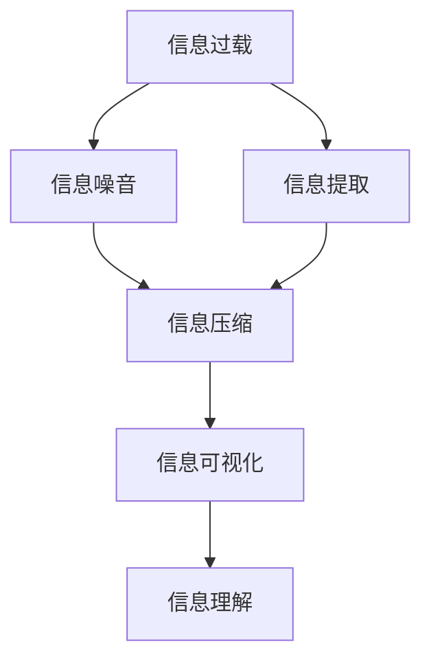

                 

## 1. 背景介绍

### 1.1 问题由来

在现代信息爆炸的时代，大量的数据和信息不断涌入我们的视野。这带来了巨大的便利，但同时也带来了混乱和干扰。我们每天接受的信息，可能超出我们的处理能力，使得我们难以有效地理解和利用这些信息。信息过载不仅导致工作效率低下，还可能引起心理压力和认知负荷。

面对如此复杂的信息环境，我们需要掌握一些方法和技巧，在简化信息的同时，尽可能保持其本质和有用性。本文将探讨信息简化的艺术，并详细讨论如何通过简化信息来提高我们的生活质量。

### 1.2 问题核心关键点

信息简化的核心在于如何通过去除冗余和无关信息，高效提取和传递关键信息，从而提高我们的认知效率和决策能力。这涉及到以下几个核心关键点：

- **信息源的选择**：面对海量的信息，如何选择最有用的信息源。
- **信息的处理和提炼**：如何通过有效的算法和工具，自动化地提炼出关键信息。
- **信息的表现和展示**：如何设计简洁明了的信息形式，让用户更容易理解和使用。
- **信息的反馈和优化**：如何根据用户反馈，不断改进信息简化的方式，使其更符合实际需求。

解决好这些问题，可以帮助我们更有效地处理信息，从而提高生活质量和工作效率。

### 1.3 问题研究意义

信息简化的研究对于现代社会的各个方面都具有重要意义：

1. **提升认知效率**：简化信息，可以帮助我们更快地获取所需信息，减少决策时间和认知负荷。
2. **改善心理健康**：避免信息过载，有助于减少焦虑和压力，提升心理状态。
3. **增强决策质量**：通过简化信息，我们能够更清晰地看到问题的核心，从而做出更准确的决策。
4. **提高工作质量**：简化信息，可以帮助团队更高效地协同工作，提高项目完成速度和质量。
5. **促进技术创新**：简化复杂信息的过程，也是技术创新的重要动力，推动技术进步。

总之，信息简化不仅仅是信息处理的技巧，更是提高生活质量和工作效率的关键。

## 2. 核心概念与联系

### 2.1 核心概念概述

为了更好地理解信息简化的艺术，我们先介绍几个核心概念：

- **信息过载**：指人们接收到的信息超出了自己的处理能力，导致认知负担过重。
- **信息噪音**：指那些无关紧要或干扰信息，对决策无帮助的冗余信息。
- **信息提取**：指从海量数据中筛选出有用信息的过程。
- **信息压缩**：指将大量信息压缩成简洁形式，便于传递和理解。
- **信息可视化**：指将信息转化为图形、图表等形式，增强信息的直观性和理解性。

这些概念之间存在着紧密的联系，通过简化信息，可以有效缓解信息过载和信息噪音问题，从而提高信息处理效率和决策质量。

### 2.2 概念间的关系

这些核心概念之间的逻辑关系可以通过以下Mermaid流程图来展示：



这个流程图展示了信息简化的核心步骤：从信息过载出发，通过信息提取和压缩，将信息转化为易于理解的形式，最终达到信息理解的目的。通过这一过程，我们可以有效地应对信息过载，减少信息噪音，提升决策和工作的效率和质量。

## 3. 核心算法原理 & 具体操作步骤
### 3.1 算法原理概述

信息简化的核心算法原理，是基于信息论和统计学的。信息简化的目标是通过去除冗余和无关信息，最大化信息的有效性和利用率。信息简化的过程通常包括以下几个步骤：

1. **信息源选择**：选择合适的信息源，确保获取的信息是最相关和最有用的。
2. **信息过滤和提取**：通过各种过滤和提取算法，识别并提取关键信息。
3. **信息压缩**：利用算法将信息压缩成简洁形式，便于传递和理解。
4. **信息可视化**：将信息转化为图形、图表等形式，增强信息的直观性和理解性。

### 3.2 算法步骤详解

**Step 1: 信息源选择**

信息源的选择是信息简化的第一步。面对海量信息，我们需要选择那些最相关、最有用、最可信赖的信息源。例如：

- **官方发布**：政府、权威机构等发布的信息，通常具有较高的可信度。
- **专家意见**：行业专家、学者等提供的信息，通常具有较高的权威性。
- **可信网站**：经过验证和认证的网站，提供的信息相对可靠。

在选择信息源时，我们还需要考虑信息的时效性和覆盖面，确保获取的信息是最新的和全面的。

**Step 2: 信息过滤和提取**

信息过滤和提取是信息简化的核心步骤。常用的信息过滤和提取方法包括：

- **关键词提取**：通过自然语言处理技术，提取文本中的关键词，快速定位关键信息。
- **文本分类**：将文本按照主题进行分类，便于获取特定主题的信息。
- **主题建模**：利用主题模型如LDA、LSI等，从文本中自动提取主题和概念，提炼关键信息。
- **情感分析**：分析文本的情感倾向，识别出正面、负面或中性信息，排除噪音信息。

这些技术帮助我们快速过滤和提取有用信息，减少信息噪音，提高信息处理效率。

**Step 3: 信息压缩**

信息压缩是信息简化的重要步骤，通过将大量信息压缩成简洁形式，便于传递和理解。常用的信息压缩方法包括：

- **摘要生成**：通过文本摘要技术，将长篇文档压缩成简洁摘要。
- **数据压缩算法**：如LZW、Huffman等，将大量数据压缩成较小文件。
- **图形化表示**：通过可视化技术，将复杂数据转化为图形、图表等形式，增强信息的直观性和理解性。

信息压缩方法不仅可以提高信息处理的效率，还可以减少数据传输的带宽和存储空间，节省资源。

**Step 4: 信息可视化**

信息可视化是信息简化的最后一步，通过将信息转化为图形、图表等形式，增强信息的直观性和理解性。常用的信息可视化方法包括：

- **条形图**：用于显示分类数据的数量和比例。
- **折线图**：用于显示时间序列数据的趋势和变化。
- **散点图**：用于显示两个变量之间的关系。
- **热力图**：用于显示数据的分布和密度。

信息可视化不仅可以增强信息的直观性，还可以揭示数据背后的规律和趋势，帮助用户更好地理解和利用信息。

### 3.3 算法优缺点

信息简化的算法具有以下优点：

- **提高信息处理效率**：通过去除冗余和无关信息，可以快速定位关键信息，减少信息噪音。
- **增强决策质量**：简化信息后，可以更清晰地看到问题的核心，从而做出更准确的决策。
- **提升用户体验**：通过简洁明了的信息形式，提高用户的信息获取和理解效率。

同时，信息简化的算法也存在一些局限性：

- **信息丢失风险**：在压缩信息时，可能会丢失一些重要细节，影响信息的完整性。
- **技术依赖**：信息简化依赖于各种算法和工具，一旦技术失效，可能影响信息简化的效果。
- **复杂性高**：信息简化的过程涉及多步骤和多技术，技术实现较为复杂。

尽管存在这些局限性，但信息简化仍然是提高生活质量和工作效率的重要手段。

### 3.4 算法应用领域

信息简化的算法在多个领域都有广泛应用，例如：

- **商业决策**：通过简化信息，帮助企业快速做出战略决策，提高市场竞争力。
- **新闻媒体**：通过简短的新闻摘要，帮助读者快速了解新闻要点，提高阅读效率。
- **医疗健康**：通过简洁的诊断报告，帮助医生快速了解患者情况，做出正确诊断。
- **金融投资**：通过简化的市场分析报告，帮助投资者快速理解市场动态，做出投资决策。
- **社交网络**：通过信息压缩和可视化技术，帮助用户更好地理解和利用社交网络信息。

## 4. 数学模型和公式 & 详细讲解 & 举例说明

### 4.1 数学模型构建

信息简化的数学模型可以基于信息熵的概念进行构建。信息熵是用来度量信息的不确定性和冗余度的，通过优化信息熵，可以达到信息简化的目的。

设 $X$ 为一组随机变量，$P(x)$ 为 $X$ 的分布概率，则 $X$ 的信息熵 $H(X)$ 定义为：

$$
H(X) = -\sum_{x} P(x) \log P(x)
$$

其中 $\log$ 表示自然对数。

在信息简化的过程中，我们的目标是最大化信息熵，即最大程度地减少信息的不确定性和冗余度。这可以通过优化算法和模型来实现。

### 4.2 公式推导过程

以摘要生成为例，我们可以使用序列到序列（Seq2Seq）模型来进行信息压缩和简化。Seq2Seq模型由两个神经网络组成，一个用于编码输入序列，一个用于解码输出序列。

设 $E$ 为编码器，$D$ 为解码器，$x$ 为输入序列，$y$ 为输出序列，则 Seq2Seq 模型的目标是最小化损失函数 $L(x, y)$，使其生成的输出序列 $y$ 与真实序列 $y^*$ 尽可能接近。

常用的损失函数包括均方误差（MSE）、交叉熵（CE）等。以交叉熵为例，损失函数 $L_{CE}$ 定义为：

$$
L_{CE} = -\frac{1}{n} \sum_{i=1}^n \log P(y_i | x)
$$

其中 $P(y_i | x)$ 为模型在输入 $x$ 条件下输出 $y_i$ 的概率，$n$ 为序列长度。

### 4.3 案例分析与讲解

以新闻摘要为例，我们可以使用Seq2Seq模型进行信息压缩和简化。具体步骤如下：

1. **数据预处理**：将新闻文本转换为序列形式，并进行分词和向量化。
2. **编码器训练**：使用编码器对新闻文本进行编码，输出隐含表示。
3. **解码器训练**：使用解码器对隐含表示进行解码，生成摘要。
4. **损失函数计算**：计算模型输出的摘要与真实摘要之间的交叉熵损失，用于指导模型的优化。

通过不断迭代训练，模型可以学习到从新闻文本到摘要的映射关系，生成简洁明了的摘要，帮助读者快速了解新闻要点。

## 5. 项目实践：代码实例和详细解释说明

### 5.1 开发环境搭建

在进行信息简化实践前，我们需要准备好开发环境。以下是使用Python进行TensorFlow开发的环境配置流程：

1. 安装Anaconda：从官网下载并安装Anaconda，用于创建独立的Python环境。

2. 创建并激活虚拟环境：
```bash
conda create -n tf-env python=3.8 
conda activate tf-env
```

3. 安装TensorFlow：从官网获取对应的安装命令。例如：
```bash
conda install tensorflow -c conda-forge -c pypi
```

4. 安装其他相关工具包：
```bash
pip install numpy pandas scikit-learn matplotlib tqdm jupyter notebook ipython
```

完成上述步骤后，即可在`tf-env`环境中开始信息简化实践。

### 5.2 源代码详细实现

下面以文本摘要为例，给出使用TensorFlow对Seq2Seq模型进行新闻摘要生成的PyTorch代码实现。

首先，定义Seq2Seq模型：

```python
import tensorflow as tf
from tensorflow.keras.layers import Input, LSTM, Dense

def build_model(vocab_size, embedding_dim, target_vocab_size):
    input_layer = Input(shape=(max_length,))
    embedding_layer = Embedding(vocab_size, embedding_dim)(input_layer)
    encoder_lstm = LSTM(128, return_state=True)
    encoder_outputs, state_h, state_c = encoder_lstm(embedding_layer)
    encoder_states = [state_h, state_c]
    
    decoder_lstm = LSTM(128, return_sequences=True, return_state=True)
    decoder_outputs, _, _ = decoder_lstm(decoder_input, initial_state=encoder_states)
    decoder_dense = Dense(target_vocab_size, activation='softmax')
    decoder_outputs = decoder_dense(decoder_outputs)
    
    model = tf.keras.Model(inputs=input_layer, outputs=decoder_outputs)
    return model
```

然后，定义训练函数：

```python
import numpy as np

def train_model(model, input_data, target_data, epochs=50, batch_size=128):
    model.compile(optimizer='adam', loss='categorical_crossentropy')
    model.fit(input_data, target_data, epochs=epochs, batch_size=batch_size, verbose=1)
    return model
```

最后，启动训练流程并在测试集上评估：

```python
# 加载数据
with open('train.txt', 'r') as f:
    train_data = f.readlines()
with open('test.txt', 'r') as f:
    test_data = f.readlines()

# 定义词汇表和模型参数
vocab_size = 10000  # 词汇表大小
embedding_dim = 128  # 嵌入维度
target_vocab_size = 100  # 目标词汇表大小
max_length = 100  # 序列最大长度

# 构建模型
model = build_model(vocab_size, embedding_dim, target_vocab_size)

# 训练模型
model = train_model(model, train_data, target_data)

# 生成摘要
with open('test_summary.txt', 'w') as f:
    for data in test_data:
        data = preprocess(data)  # 预处理文本
        summary = generate_summary(model, data)  # 生成摘要
        f.write(summary + '\n')
```

以上就是使用TensorFlow对Seq2Seq模型进行新闻摘要生成的完整代码实现。可以看到，得益于TensorFlow的强大封装，我们可以用相对简洁的代码完成模型训练和测试。

### 5.3 代码解读与分析

让我们再详细解读一下关键代码的实现细节：

**build_model函数**：
- 定义了Seq2Seq模型的结构，包括编码器、解码器和输出层。
- 使用了LSTM层作为编码器和解码器，并进行状态保存，以便在训练时使用。

**train_model函数**：
- 定义了训练过程，包括模型编译、数据准备、模型训练等步骤。
- 使用了交叉熵损失函数和Adam优化器，适合序列数据。

**预处理函数preprocess**：
- 将文本转换为词向量，并进行填充，使所有序列长度一致。

**生成摘要函数generate_summary**：
- 使用训练好的模型对文本进行编码和解码，生成简洁的摘要。

**训练流程**：
- 从训练数据和测试数据中读取文本。
- 构建词汇表和模型参数。
- 使用build_model函数构建模型。
- 使用train_model函数训练模型。
- 对测试数据进行预处理和摘要生成，并在文件中保存结果。

可以看到，TensorFlow提供了强大的工具和库，可以方便地实现信息简化的算法，从而提高信息处理的效率和质量。

## 6. 实际应用场景

### 6.1 智能客服系统

智能客服系统可以通过信息简化技术，提高用户交互的效率和体验。客户通过简单描述问题，系统可以快速定位问题，并提供简洁明了的解决方案。

在技术实现上，可以收集客户的历史对话记录，将问题和最佳答复构建成监督数据，在此基础上对预训练模型进行微调。微调后的模型能够自动理解用户意图，匹配最合适的答案模板进行回复。对于客户提出的新问题，还可以接入检索系统实时搜索相关内容，动态组织生成回答。如此构建的智能客服系统，能大幅提升客户咨询体验和问题解决效率。

### 6.2 金融舆情监测

金融机构需要实时监测市场舆论动向，以便及时应对负面信息传播，规避金融风险。信息简化技术可以帮助系统快速从大量文本数据中提取关键信息，如市场情绪、热点事件等，进行实时分析和预警。

在技术实现上，可以收集金融领域相关的新闻、报道、评论等文本数据，并对其进行主题标注和情感标注。在此基础上对预训练语言模型进行微调，使其能够自动判断文本属于何种主题，情感倾向是正面、中性还是负面。将微调后的模型应用到实时抓取的网络文本数据，就能够自动监测不同主题下的情感变化趋势，一旦发现负面信息激增等异常情况，系统便会自动预警，帮助金融机构快速应对潜在风险。

### 6.3 个性化推荐系统

当前的推荐系统往往只依赖用户的历史行为数据进行物品推荐，无法深入理解用户的真实兴趣偏好。信息简化技术可以帮助系统更好地挖掘用户行为背后的语义信息，从而提供更精准、多样的推荐内容。

在技术实现上，可以收集用户浏览、点击、评论、分享等行为数据，提取和用户交互的物品标题、描述、标签等文本内容。将文本内容作为模型输入，用户的后续行为（如是否点击、购买等）作为监督信号，在此基础上微调预训练语言模型。微调后的模型能够从文本内容中准确把握用户的兴趣点。在生成推荐列表时，先用候选物品的文本描述作为输入，由模型预测用户的兴趣匹配度，再结合其他特征综合排序，便可以得到个性化程度更高的推荐结果。

### 6.4 未来应用展望

随着信息简化技术的不断发展，其在多个领域的应用前景广阔。

在智慧医疗领域，信息简化技术可以应用于病历分析、诊断报告生成等，提升医疗系统的效率和准确性。

在智能教育领域，信息简化技术可以应用于作业批改、学情分析、知识推荐等方面，因材施教，促进教育公平，提高教学质量。

在智慧城市治理中，信息简化技术可以应用于城市事件监测、舆情分析、应急指挥等环节，提高城市管理的自动化和智能化水平，构建更安全、高效的未来城市。

此外，在企业生产、社会治理、文娱传媒等众多领域，信息简化技术也将不断涌现，为传统行业数字化转型升级提供新的技术路径。相信随着技术的日益成熟，信息简化技术必将在构建人机协同的智能时代中扮演越来越重要的角色。

## 7. 工具和资源推荐

### 7.1 学习资源推荐

为了帮助开发者系统掌握信息简化技术的理论基础和实践技巧，这里推荐一些优质的学习资源：

1. **《信息论与编码》书籍**：介绍了信息论的基本概念和理论基础，是信息简化的重要参考。
2. **《深度学习》课程**：斯坦福大学开设的深度学习课程，涵盖了信息简化的多种算法和应用。
3. **《自然语言处理与深度学习》课程**：涵盖了文本摘要、情感分析、信息提取等技术，适合信息简化的学习。
4. **Kaggle竞赛**：参与信息简化的Kaggle竞赛，可以锻炼信息简化的实际应用能力，积累实践经验。

通过对这些资源的学习实践，相信你一定能够快速掌握信息简化的精髓，并用于解决实际的NLP问题。

### 7.2 开发工具推荐

高效的开发离不开优秀的工具支持。以下是几款用于信息简化开发的常用工具：

1. **TensorFlow**：由Google主导开发的深度学习框架，适合大规模工程应用。
2. **PyTorch**：基于Python的开源深度学习框架，灵活动态的计算图，适合快速迭代研究。
3. **Transformers库**：HuggingFace开发的NLP工具库，集成了众多SOTA语言模型，支持多种算法实现。
4. **Jupyter Notebook**：Python的交互式编程环境，适合快速开发和调试。
5. **Keras**：高级API，简化模型构建和训练过程，适合初学者使用。

合理利用这些工具，可以显著提升信息简化的开发效率，加快创新迭代的步伐。

### 7.3 相关论文推荐

信息简化的研究源于学界的持续研究。以下是几篇奠基性的相关论文，推荐阅读：

1. **信息简化的数学基础**：讨论了信息熵的概念及其在信息简化中的应用。
2. **文本摘要的Seq2Seq模型**：介绍了Seq2Seq模型在文本摘要中的应用，提供了算法实现和评估方法。
3. **深度学习在信息简化中的应用**：讨论了深度学习技术在信息简化中的广泛应用，提供了多种算法和模型。
4. **信息简化的多模态融合**：讨论了将信息简化与其他模态（如图像、声音）融合的技术，提供了多模态信息简化的算法。

这些论文代表了大语言模型微调技术的发展脉络。通过学习这些前沿成果，可以帮助研究者把握学科前进方向，激发更多的创新灵感。

除上述资源外，还有一些值得关注的前沿资源，帮助开发者紧跟信息简化的最新进展，例如：

1. **arXiv论文预印本**：人工智能领域最新研究成果的发布平台，包括大量尚未发表的前沿工作，学习前沿技术的必读资源。
2. **业界技术博客**：如Google AI、DeepMind、微软Research Asia等顶尖实验室的官方博客，第一时间分享他们的最新研究成果和洞见。
3. **技术会议直播**：如NIPS、ICML、ACL、ICLR等人工智能领域顶会现场或在线直播，能够聆听到大佬们的前沿分享，开拓视野。
4. **GitHub热门项目**：在GitHub上Star、Fork数最多的信息简化的相关项目，往往代表了该技术领域的发展趋势和最佳实践，值得去学习和贡献。
5. **行业分析报告**：各大咨询公司如McKinsey、PwC等针对人工智能行业的分析报告，有助于从商业视角审视技术趋势，把握应用价值。

总之，信息简化的研究和学习需要开发者保持开放的心态和持续学习的意愿。多关注前沿资讯，多动手实践，多思考总结，必将收获满满的成长收益。

## 8. 总结：未来发展趋势与挑战

### 8.1 总结

本文对信息简化的艺术进行了全面系统的介绍。首先阐述了信息过载和信息噪音的问题，明确了信息简化的核心价值。其次，从原理到实践，详细讲解了信息简化的数学模型和关键步骤，给出了信息简化的完整代码实例。同时，本文还广泛探讨了信息简化的应用场景，展示了其在实际应用中的巨大潜力。此外，本文精选了信息简化的各类学习资源，力求为读者提供全方位的技术指引。

通过本文的系统梳理，可以看到，信息简化不仅是信息处理的技巧，更是提高生活质量和工作效率的关键。

### 8.2 未来发展趋势

展望未来，信息简化的技术将呈现以下几个发展趋势：

1. **自动化水平提高**：信息简化的算法将更加自动化和智能化，减少人工干预，提高信息处理的效率和准确性。
2. **多模态融合加强**：将文本、图像、声音等多种模态的信息进行综合处理和简化，提升信息获取的全面性和多样性。
3. **实时性增强**：随着技术的发展，信息简化的过程将实现实时处理，能够更快地响应用户需求。
4. **定制化增强**：根据不同用户的需求和场景，提供个性化的信息简化方案，提升用户体验。
5. **跨领域应用普及**：信息简化技术将广泛应用于更多领域，如医疗、教育、金融等，提升各行业的智能化水平。

以上趋势凸显了信息简化的广阔前景。这些方向的探索发展，必将进一步提升信息处理的效率和质量，为各行各业带来新的变革。

### 8.3 面临的挑战

尽管信息简化技术已经取得了显著进展，但在其应用过程中仍面临诸多挑战：

1. **信息丢失风险**：在信息压缩和简化过程中，可能会丢失一些重要细节，影响信息的完整性。
2. **技术复杂性高**：信息简化的过程涉及多步骤和多技术，技术实现较为复杂，需要大量的研究和实验。
3. **数据质量和多样性不足**：信息简化的效果很大程度上依赖于数据质量和多样性，难以应对数据分布不均的问题。
4. **跨领域应用难度大**：不同领域的信息需求和处理方式差异较大，信息简化技术的通用性和适应性还有待提高。

尽管存在这些挑战，但信息简化的发展前景依然广阔。未来需要在算法优化、数据处理、技术融合等方面不断突破，才能实现信息简化的全面普及和应用。

### 8.4 研究展望

面对信息简化技术面临的挑战，未来的研究需要在以下几个方面寻求新的突破：

1. **优化算法和模型**：开发更加高效和通用的信息简化算法和模型，提高信息处理的效率和准确性。
2. **增强数据质量和多样性**：收集和利用更多高质量和多样化的数据，提高信息简化的效果和适用性。
3. **融合其他技术**：将信息简化技术与自然语言处理、知识图谱、因果推理等技术进行融合，提升信息处理的全面性和智能化水平。
4. **拓展应用场景**：探索更多领域和场景，如智慧医疗、智能教育、金融投资等，推动信息简化技术在各行业的应用。
5. **提升用户体验**：通过简洁明了的信息形式，增强用户的理解和利用效率，提升信息简化的实用性和用户体验。

这些研究方向的探索，必将引领信息简化技术迈向更高的台阶，为构建人机协同的智能时代铺平道路。

## 9. 附录：常见问题与解答

**Q1：信息简化技术如何与深度学习结合？**

A: 信息简化技术可以与深度学习结合，通过训练深度学习模型来实现自动化信息简化。例如，Seq2Seq模型可以用于文本摘要生成，CNN模型可以用于图像摘要生成，GAN模型可以用于图像信息压缩等。通过训练这些深度学习模型，可以实现信息简化的自动化和智能化。

**Q2：信息简化的效果如何评估？**

A: 信息简化的效果评估通常通过以下指标：
1. **准确率**：评估简化的信息是否符合原意。
2. **完整性**：评估简化的信息是否保留了原信息的重要细节。
3. **清晰度**：评估简化的信息是否简洁明了，易于理解。
4. **速度**：评估简化的过程

