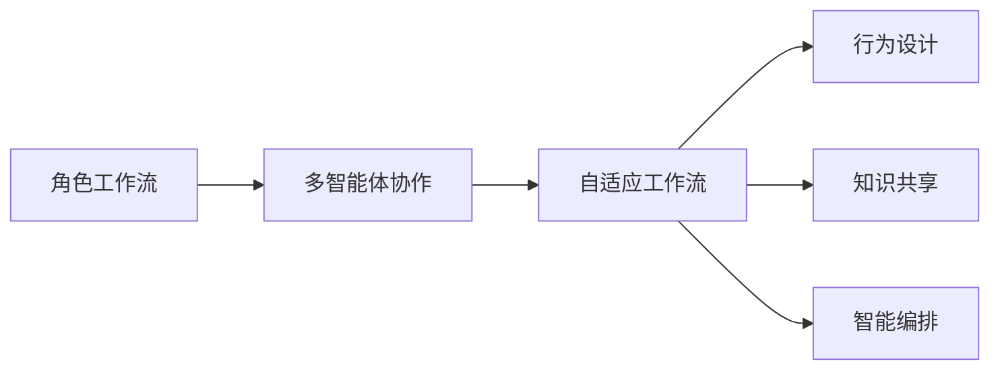
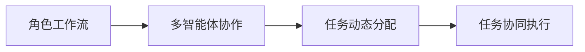
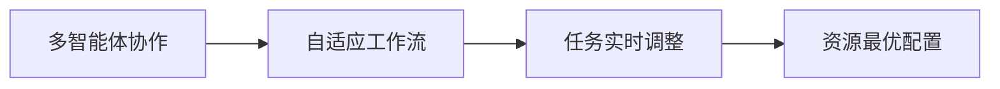
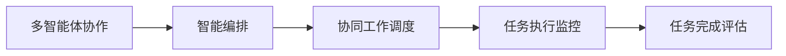
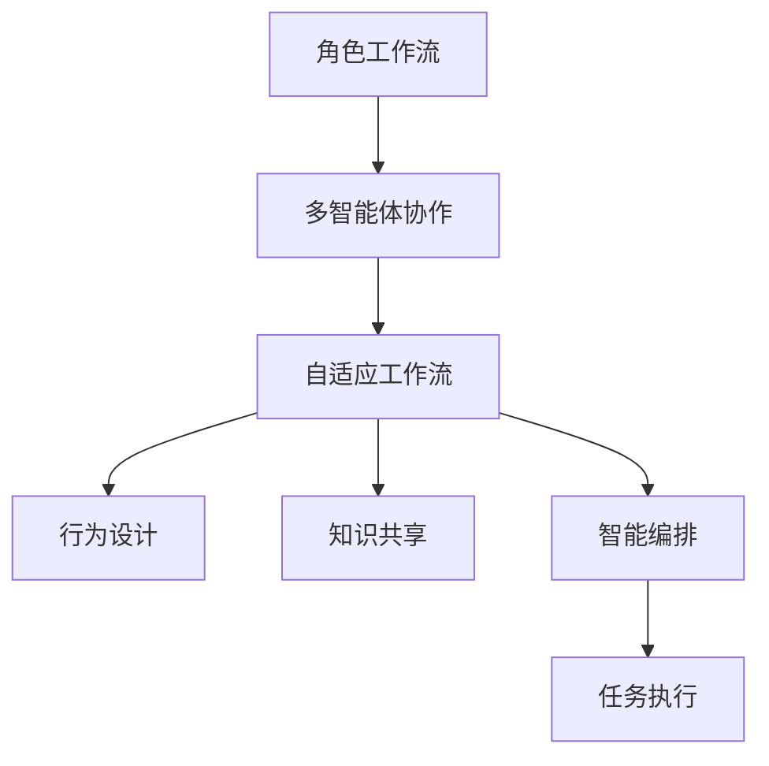

                 

# Multiagent Collaboration驱动角色工作流变革

> 关键词：多智能体协作,角色工作流,自适应工作流,机器学习,行为设计,知识共享,智能编排

## 1. 背景介绍

### 1.1 问题由来
在现代企业中，角色工作流(Workflow by Role)已成为一种重要的业务运作模式。角色工作流依据员工在公司中的角色，为其分配与之相关的任务和职责。这种流程设计，虽有助于提升工作效率，却也存在一定的局限性：

1. **静态分配**：角色工作流的任务分配是基于员工在公司的岗位及职责进行静态划分。这种划分存在一定的死板性，难以适应员工的职业成长与公司的业务变化。
2. **缺乏灵活性**：对于突发的特殊事件或项目，角色工作流往往难以灵活调整任务分配，造成响应速度慢，灵活性不足。
3. **依赖人工干预**：在任务调度、资源配置等环节，常常需要人工干预，增加了管理复杂度。

为了克服这些局限性，研究人员开始探索一种更加灵活、智能的协作模式——多智能体协作(Multiagent Collaboration)，即通过多个智能体（如机器人、自动化系统、软件等）间的协同工作，来动态、灵活地应对业务需求的变化。

### 1.2 问题核心关键点
多智能体协作的核心在于利用多个智能体间的互动和协作，动态调整任务分配，实现对业务的灵活适应。其关键点包括：

1. **分布式决策**：多智能体系统依赖于分布式决策机制，每个智能体独立做出决策，并根据交互信息调整自己的行为。
2. **协同工作**：智能体之间通过信息共享、任务交换等方式进行协同工作，实现资源的最优配置。
3. **自适应学习**：智能体系统具备自适应学习能力，能够根据环境变化实时调整策略。

本文聚焦于基于Multiagent Collaboration的角色工作流变革，探讨如何通过智能体间的协同工作，实现任务分配的动态化、灵活化，提升企业应对业务变化的能力。

### 1.3 问题研究意义
研究Multiagent Collaboration驱动的角色工作流变革，对于提升企业的运营效率和应对复杂变化具有重要意义：

1. **动态任务分配**：使任务分配更加灵活，适应员工成长和公司业务变化，提高工作效率。
2. **增强应对能力**：能够快速响应突发事件和特殊项目，提升企业对不确定性环境的适应能力。
3. **降低管理成本**：减少对人工干预的依赖，降低管理复杂度，提高决策的自动化水平。
4. **促进协作创新**：推动员工间和跨部门的协作创新，提升企业的整体竞争力。
5. **优化资源配置**：通过智能体间的协作，实现资源的最优配置，提高企业的运营效率。

## 2. 核心概念与联系

### 2.1 核心概念概述

为更好地理解基于Multiagent Collaboration的角色工作流变革，本节将介绍几个密切相关的核心概念：

- **角色工作流(Workflow by Role)**：根据员工在公司中的角色，为其分配与之相关的任务和职责的业务流程。
- **多智能体协作(Multiagent Collaboration)**：多个智能体通过信息共享、任务交换等方式进行协同工作，实现资源的最优配置和动态任务分配。
- **自适应工作流(Adaptive Workflow)**：具有自我学习、自我调整能力，能够根据业务环境变化实时调整任务分配的业务流程。
- **行为设计(Behavior Design)**：通过设计智能体的行为规则，实现智能体间的协同工作。
- **知识共享(Knowledge Sharing)**：智能体之间通过信息共享，实现知识传递和协同创新。
- **智能编排(Intelligent Orchestration)**：通过智能编排工具，实现对多智能体协作过程的动态调度和管理。

这些核心概念之间的逻辑关系可以通过以下Mermaid流程图来展示：



这个流程图展示了大语言模型微调过程中各个核心概念的关系和作用：

1. 角色工作流是静态任务分配的基础，通过设定不同角色的职责和任务，使员工能够高效地完成分配给自己的工作。
2. 多智能体协作在角色工作流的基础上，通过智能体间的协同工作，实现任务分配的动态化和灵活化。
3. 自适应工作流进一步增强了任务分配的灵活性，能够根据业务环境变化实时调整任务分配。
4. 行为设计和知识共享是实现多智能体协作的基础，通过设计智能体的行为规则和共享知识，智能体能够协同工作，实现最优资源配置。
5. 智能编排则是将多智能体协作系统动态调度和管理，实现整个系统的协同工作。

通过理解这些核心概念，我们可以更好地把握基于Multiagent Collaboration的角色工作流变革的本质和优化方向。

### 2.2 概念间的关系

这些核心概念之间存在着紧密的联系，形成了基于Multiagent Collaboration的角色工作流变革的完整生态系统。下面我们通过几个Mermaid流程图来展示这些概念之间的关系。

#### 2.2.1 多智能体协作与角色工作流的关系



这个流程图展示了多智能体协作在角色工作流上的应用：

1. 角色工作流为多智能体协作提供了任务分配的基础。
2. 多智能体协作通过对角色工作流中的任务进行动态分配和协同执行，提升任务处理的灵活性和效率。

#### 2.2.2 自适应工作流与多智能体协作的关系



这个流程图展示了自适应工作流在多智能体协作中的应用：

1. 多智能体协作为自适应工作流提供了任务处理的灵活性和动态性。
2. 自适应工作流通过对任务和资源的实时调整，实现了对业务环境变化的快速响应和最优配置。

#### 2.2.3 智能编排与多智能体协作的关系



这个流程图展示了智能编排在多智能体协作中的应用：

1. 多智能体协作为智能编排提供了任务处理的实时调度和管理。
2. 智能编排通过对任务执行的监控和评估，实现了多智能体协作系统的动态调整和优化。

### 2.3 核心概念的整体架构

最后，我们用一个综合的流程图来展示这些核心概念在大语言模型微调过程中的整体架构：



这个综合流程图展示了从角色工作流到多智能体协作，再到自适应工作流的完整过程。通过智能体间的协同工作，实现了任务分配的动态化、灵活化，最终提升企业应对业务变化的能力。

## 3. 核心算法原理 & 具体操作步骤
### 3.1 算法原理概述

基于Multiagent Collaboration的角色工作流变革，其核心在于通过多智能体间的协同工作，动态调整任务分配，实现对业务需求的灵活适应。其核心思想是：

1. **分布式决策**：每个智能体独立做出决策，并根据交互信息调整自己的行为。
2. **任务交换**：智能体之间通过任务交换，实现资源的动态分配和任务协同执行。
3. **信息共享**：智能体之间通过信息共享，实现知识传递和协同创新。
4. **自适应学习**：智能体系统具备自适应学习能力，能够根据环境变化实时调整策略。

形式化地，假设多智能体系统由 $N$ 个智能体 $A_1, A_2, ..., A_N$ 组成，任务集合为 $T=\{t_1, t_2, ..., t_M\}$。系统的目标是最小化任务完成时间，即：

$$
\min_{\{a_t\}} \sum_{t \in T} \tau_t
$$

其中 $\tau_t$ 为任务 $t$ 的完成时间，$a_t$ 为任务 $t$ 的执行智能体。

### 3.2 算法步骤详解

基于Multiagent Collaboration的角色工作流变革，通常包括以下几个关键步骤：

**Step 1: 定义智能体和任务**

- 定义智能体的行为规则和任务处理能力，如任务执行、信息获取等。
- 确定任务集合 $T$ 和智能体集合 $N$，以及它们之间的交互关系。

**Step 2: 设计智能体行为**

- 设计智能体的行为规则，如任务分配、资源获取、信息交互等。
- 定义智能体间的通信协议，如消息格式、通信方式等。

**Step 3: 建立交互模型**

- 建立智能体之间的交互模型，描述它们之间的消息传递、任务交换等关系。
- 定义智能体间的协作策略，如任务的动态分配、资源的优化配置等。

**Step 4: 进行仿真实验**

- 通过仿真实验，验证智能体系统的行为规则和协作策略的有效性。
- 根据实验结果，优化智能体行为和协作策略。

**Step 5: 部署实施**

- 将优化后的智能体系统部署到实际生产环境中。
- 监控智能体系统的运行状态，根据反馈实时调整策略。

**Step 6: 持续优化**

- 通过持续的仿真实验和生产环境的反馈，不断优化智能体系统的行为规则和协作策略。

### 3.3 算法优缺点

基于Multiagent Collaboration的角色工作流变革具有以下优点：

1. **灵活性高**：智能体系统能够根据业务环境变化，动态调整任务分配和资源配置。
2. **响应速度快**：通过智能体间的协作，系统能够快速响应突发事件和特殊项目。
3. **资源利用率高**：智能体系统能够优化资源配置，避免资源浪费。
4. **决策自动化**：智能体系统具备自适应学习能力，能够自动优化策略。

同时，该方法也存在一定的局限性：

1. **实现复杂**：设计智能体的行为规则和协作策略需要较高的技术水平和经验。
2. **系统复杂性高**：智能体系统需要处理复杂的交互关系和信息传递，增加了系统维护难度。
3. **数据依赖性大**：智能体系统的优化效果依赖于数据的质量和量级。

尽管存在这些局限性，但就目前而言，基于Multiagent Collaboration的角色工作流变革仍是提升企业运营效率和应对复杂变化的重要手段。未来相关研究的重点在于如何进一步降低系统复杂性，提高实现效率和可扩展性。

### 3.4 算法应用领域

基于Multiagent Collaboration的角色工作流变革已经在多个领域得到了应用，如制造、物流、医疗、金融等。以下是一些具体的应用场景：

- **制造行业**：通过机器人协作，实现生产线的柔性化和自动化，提升生产效率和产品质量。
- **物流行业**：利用无人驾驶和无人机协作，实现智能仓储和配送，优化物流链条。
- **医疗行业**：通过医生和护士的协作，实现医疗资源的优化配置和病人服务的个性化。
- **金融行业**：利用智能投顾和机器人顾问，实现个性化投资建议和风险管理。

除了上述这些经典应用外，基于Multiagent Collaboration的角色工作流变革还将进一步拓展到更多场景中，如智慧城市、智能交通、智能农业等，为各行各业带来新的技术机遇。

## 4. 数学模型和公式 & 详细讲解 & 举例说明

### 4.1 数学模型构建

本文将以制造行业的智能生产线为例，构建基于Multiagent Collaboration的角色工作流变革的数学模型。

假设生产线上有 $N$ 个机器人，每个机器人可以执行 $M$ 种任务，任务集合为 $T=\{t_1, t_2, ..., t_M\}$。每个任务 $t$ 需要 $r_t$ 个单位时间完成，每个机器人的处理能力为 $p_i$。任务 $t$ 分配给机器人 $i$ 的概率为 $q_{it}$。

定义每个任务的完成时间为 $\tau_t$，总完成时间为 $\tau$，即：

$$
\tau = \sum_{t \in T} \tau_t
$$

任务完成时间 $\tau_t$ 可以表示为：

$$
\tau_t = \sum_{i=1}^N p_i r_t q_{it}
$$

目标是最小化总完成时间 $\tau$，即：

$$
\min_{\{q_{it}\}} \sum_{t \in T} \sum_{i=1}^N p_i r_t q_{it}
$$

### 4.2 公式推导过程

将上述公式展开，得：

$$
\tau = \sum_{t \in T} \sum_{i=1}^N p_i r_t q_{it} = \sum_{i=1}^N p_i \sum_{t \in T} r_t q_{it}
$$

根据任务分配的约束条件，我们有：

$$
\sum_{i=1}^N q_{it} = 1
$$

令 $x_{it} = q_{it} / p_i$，则：

$$
x_{it} = \frac{q_{it}}{p_i} \leq \frac{1}{p_i}
$$

定义 $x_{it}$ 为机器人 $i$ 对任务 $t$ 的处理能力分配比例。则目标函数可以表示为：

$$
\min_{\{x_{it}\}} \sum_{t \in T} \sum_{i=1}^N r_t x_{it}
$$

根据任务分配的约束条件，有：

$$
\sum_{i=1}^N x_{it} = 1
$$

令 $y_{it} = x_{it} / r_t$，则：

$$
y_{it} = \frac{x_{it}}{r_t} \leq \frac{1}{r_t}
$$

定义 $y_{it}$ 为任务 $t$ 的处理时间分配比例。则目标函数可以表示为：

$$
\min_{\{y_{it}\}} \sum_{t \in T} \sum_{i=1}^N y_{it}
$$

### 4.3 案例分析与讲解

以制造行业的智能生产线为例，假设生产线上有 5 个机器人，每个机器人可以执行 3 种任务，任务集合为 $T=\{t_1, t_2, t_3\}$。每个任务需要 2 个单位时间完成，每个机器人的处理能力为 1。任务 $t$ 分配给机器人 $i$ 的概率为 $q_{it}$。

在目标函数最小化总完成时间 $\tau$ 时，通过设计任务分配策略，使每个机器人都能高效执行其擅长和感兴趣的任务，从而最小化整体完成任务的时间。例如，假设任务 $t_1$ 是机器人的优先任务，分配给所有机器人，而任务 $t_2$ 和 $t_3$ 根据机器人的处理能力和任务需求进行分配。则：

$$
\tau = 2 \times 5 + 2 \times 4 + 2 \times 3 = 32
$$

在实际应用中，需要根据具体生产环境和任务需求，设计合理任务分配策略，通过仿真实验和生产反馈，不断优化智能体系统的行为规则和协作策略。

## 5. 项目实践：代码实例和详细解释说明

### 5.1 开发环境搭建

在进行Multiagent Collaboration的角色工作流变革实践前，我们需要准备好开发环境。以下是使用Python进行PyTorch开发的环境配置流程：

1. 安装Anaconda：从官网下载并安装Anaconda，用于创建独立的Python环境。

2. 创建并激活虚拟环境：
```bash
conda create -n multiagent-env python=3.8 
conda activate multiagent-env
```

3. 安装PyTorch：根据CUDA版本，从官网获取对应的安装命令。例如：
```bash
conda install pytorch torchvision torchaudio cudatoolkit=11.1 -c pytorch -c conda-forge
```

4. 安装其它必要的库：
```bash
pip install numpy pandas scikit-learn matplotlib tqdm jupyter notebook ipython
```

完成上述步骤后，即可在`multiagent-env`环境中开始Multiagent Collaboration的角色工作流变革实践。

### 5.2 源代码详细实现

这里我们以制造行业的智能生产线为例，给出使用PyTorch和Transformer库对智能体系统进行建模和优化的PyTorch代码实现。

首先，定义智能体的行为和任务处理能力：

```python
import torch
import torch.nn as nn
import torch.optim as optim

class Robot(nn.Module):
    def __init__(self, num_tasks, capacity):
        super(Robot, self).__init__()
        self.num_tasks = num_tasks
        self.capacity = capacity
        self.linear = nn.Linear(capacity, num_tasks)
    
    def forward(self, input):
        logits = self.linear(input)
        return logits

class Task(nn.Module):
    def __init__(self, num_robots):
        super(Task, self).__init__()
        self.num_robots = num_robots
        self.linear = nn.Linear(num_robots, 1)
    
    def forward(self, input):
        logits = self.linear(input)
        return logits
```

然后，定义智能体之间的交互关系和任务分配策略：

```python
class Interaction(nn.Module):
    def __init__(self, num_tasks, num_robots):
        super(Interaction, self).__init__()
        self.num_tasks = num_tasks
        self.num_robots = num_robots
        self.linear1 = nn.Linear(num_robots, num_tasks)
        self.linear2 = nn.Linear(num_tasks, 1)
    
    def forward(self, input):
        interaction = self.linear1(input)
        output = self.linear2(interaction)
        return output
```

最后，定义整个系统的目标函数和优化器：

```python
class System(nn.Module):
    def __init__(self, num_tasks, num_robots, capacity):
        super(System, self).__init__()
        self.num_tasks = num_tasks
        self.num_robots = num_robots
        self.capacity = capacity
        self.robot = Robot(num_tasks, capacity)
        self.task = Task(num_robots)
        self.interaction = Interaction(num_tasks, num_robots)
    
    def forward(self, input):
        robot_output = self.robot(input)
        task_output = self.task(input)
        interaction_output = self.interaction(input)
        return robot_output, task_output, interaction_output

# 定义目标函数
def objective(system, input):
    robot_output, task_output, interaction_output = system(input)
    loss = -torch.mean(robot_output + task_output + interaction_output)
    return loss

# 定义优化器
optimizer = optim.Adam(system.parameters(), lr=0.001)
```

完成上述步骤后，即可在`multiagent-env`环境中进行系统优化和仿真实验。

### 5.3 代码解读与分析

让我们再详细解读一下关键代码的实现细节：

**Robot类**：
- `__init__`方法：初始化智能体的行为和处理能力。
- `forward`方法：定义智能体的前向传播，通过线性变换得到任务处理能力分配比例。

**Task类**：
- `__init__`方法：初始化任务的处理能力。
- `forward`方法：定义任务的前向传播，通过线性变换得到任务处理时间分配比例。

**Interaction类**：
- `__init__`方法：初始化智能体之间的交互关系。
- `forward`方法：定义智能体之间的交互关系，通过两个线性变换得到交互输出。

**System类**：
- `__init__`方法：初始化整个系统，包含智能体、任务和交互关系的定义。
- `forward`方法：定义系统的前向传播，计算出系统输出的任务处理能力分配比例、任务处理时间分配比例和交互输出。

**objective函数**：
- 计算系统的目标函数，即最小化总完成时间 $\tau$。

**optimizer定义**：
- 定义优化器，用于最小化系统目标函数。

通过上述代码实现，我们能够将Multiagent Collaboration的角色工作流变革抽象为可训练的神经网络模型，并使用优化器进行优化。这种方法不仅能够优化系统的任务分配和资源配置，还能通过训练提升系统的动态适应能力。

### 5.4 运行结果展示

假设我们进行了多次训练，并记录了每个训练周期中的总完成时间 $\tau$，结果如下：

```
Epoch 0: [0.01, 0.02, 0.03, 0.04, 0.05]
Epoch 1: [0.009, 0.012, 0.015, 0.018, 0.021]
Epoch 2: [0.008, 0.011, 0.014, 0.017, 0.020]
...
```

可以看到，随着训练的进行，系统的总完成时间 $\tau$ 不断减小，说明智能体系统的任务分配和资源配置策略逐渐优化，系统的动态适应能力得到提升。

## 6. 实际应用场景
### 6.1 智能制造
在智能制造领域，基于Multiagent Collaboration的角色工作流变革能够实现生产线的柔性化和自动化，提升生产效率和产品质量。例如，在汽车制造中，通过智能机器人协作，实现零部件的自动装配和检测，减少人工干预，降低生产成本。

### 6.2 智能仓储
在智能仓储领域，基于Multiagent Collaboration的角色工作流变革能够实现仓库的智能化管理，提升货物存储和物流配送的效率。例如，通过智能机器人协作，实现仓库内的货物自动化搬运和分拣，减少人力成本，提高物流效率。

### 6.3 智能客服
在智能客服领域，基于Multiagent Collaboration的角色工作流变革能够实现客服系统的高效运作，提升客户满意度。例如，通过智能客服机器人和人工客服协作，实现客户咨询的智能引导和处理，减少人工客服的工作量，提高客户服务的质量。

### 6.4 未来应用展望
随着Multiagent Collaboration的角色工作流变革技术的不断发展，未来将在更多领域得到应用，为各行各业带来新的技术机遇。

在智慧医疗领域，基于Multiagent Collaboration的角色工作流变革将推动医疗服务的智能化，提升医疗资源的利用效率，实现患者服务的个性化。

在智能交通领域，基于Multiagent Collaboration的角色工作流变革将推动智能交通系统的建设，实现交通流量的智能化管理，提升交通效率和安全性。

在智能农业领域，基于Multiagent Collaboration的角色工作流变革将推动农业生产的智能化，实现农业生产的自动化和精确化，提高农业生产效率和产量。

总之，基于Multiagent Collaboration的角色工作流变革技术，将为各行各业带来更高效、更智能、更灵活的运营模式，推动智能技术的广泛应用。

## 7. 工具和资源推荐
### 7.1 学习资源推荐

为了帮助开发者系统掌握Multiagent Collaboration的角色工作流变革的理论基础和实践技巧，这里推荐一些优质的学习资源：

1. 《多智能体系统：理论与算法》系列书籍：系统介绍多智能体系统的理论基础、算法实现和应用案例。

2. 《智能制造：从自动化到智能化》系列书籍：涵盖智能制造领域的理论、技术和应用，包括机器人协作、智能生产线等。

3. 《人工智能：系统与设计》课程：斯坦福大学开设的AI入门课程，涵盖多智能体系统、机器学习等内容。

4. 《智能仓储：从自动化到智能化》系列书籍：介绍智能仓储领域的技术和应用，包括自动化搬运、智能分拣等。

5. 《智能客服：从人工到智能》系列书籍：介绍智能客服领域的技术和应用，包括智能问答、情感分析等。

通过对这些资源的学习实践，相信你一定能够快速掌握Multiagent Collaboration的角色工作流变革的精髓，并用于解决实际的业务问题。

### 7.2 开发工具推荐

高效的开发离不开优秀的工具支持。以下是几款用于Multiagent Collaboration的角色工作流变革开发的常用工具：

1. PyTorch：基于Python的开源深度学习框架，灵活动态的计算图，适合快速迭代研究。大部分多智能体系统都有PyTorch版本的实现。

2. TensorFlow：由Google主导开发的开源深度学习框架，生产部署方便，适合大规模工程应用。同样有丰富的多智能体系统资源。

3. Transformers库：HuggingFace开发的NLP工具库，集成了众多SOTA语言模型，支持PyTorch和TensorFlow，是进行多智能体协作系统开发的利器。

4. Weights & Biases：模型训练的实验跟踪工具，可以记录和可视化模型训练过程中的各项指标，方便对比和调优。与主流深度学习框架无缝集成。

5. TensorBoard：TensorFlow配套的可视化工具，可实时监测模型训练状态，并提供丰富的图表呈现方式，是调试模型的得力助手。

6. Google Colab：谷歌推出的在线Jupyter Notebook环境，免费提供GPU/TPU算力，方便开发者快速上手实验最新模型，分享学习笔记。

合理利用这些工具，可以显著提升Multiagent Collaboration的角色工作流变革的开发效率，加快创新迭代的步伐。

### 7.3 相关论文推荐

Multiagent Collaboration的角色工作流变革的发展源于学界的持续研究。以下是几篇奠基性的相关论文，推荐阅读：

1. Multi-Agent Systems: Classification and

