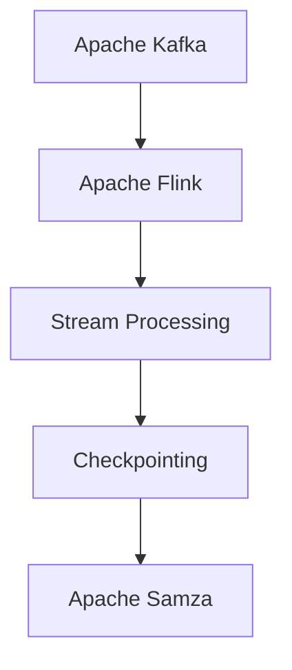

                 

# Samza Checkpoint原理与代码实例讲解

> 关键词：Apache Kafka, Apache Flink, fault-tolerance, distributed stream processing, checkpointing

## 1. 背景介绍

在分布式流处理系统中，一个关键问题是确保系统的可靠性和容错能力。Apache Kafka作为一个分布式消息队列，提供了高吞吐量、低延迟的消息传递服务，成为大数据和流处理系统的基础设施。而Apache Flink则是一个开源的流处理框架，支持对实时数据进行高效处理和分析。在Apache Flink的架构中，Checkpointing是其可靠性和容错能力的重要组成部分。

Checkpointing是一种通过定期保存状态的方式，确保流处理系统的可靠性和容错性。在Flink中，Checkpointing机制能够将任务的状态信息定期保存到外部存储系统（如Hadoop Distributed File System, HDFS），以备后续恢复使用。这样，当任务失败或重启时，系统可以从最近的Checkpoint恢复状态，保证处理结果的一致性和正确性。

本文将深入探讨Samza Checkpoint原理，并结合实际代码实例进行详细讲解，帮助读者理解其工作机制，掌握如何在生产环境中应用Checkpointing技术。

## 2. 核心概念与联系

### 2.1 核心概念概述

为更好地理解Samza Checkpoint原理，本节将介绍几个密切相关的核心概念：

- **Apache Kafka**：一个高吞吐量、低延迟的分布式消息队列，支持流数据的可靠传递和存储。
- **Apache Flink**：一个开源的流处理框架，支持实时数据的高效处理和分析。
- **Checkpointing**：一种通过定期保存状态的方式，确保流处理系统的可靠性和容错性。
- **Samza**：一个基于Apache Kafka和Apache Flink的流处理平台，通过Checkpointing机制确保流处理任务的状态一致性和正确性。

这些核心概念之间的逻辑关系可以通过以下Mermaid流程图来展示：



这个流程图展示了大数据流处理系统的核心组件和Checkpointing机制之间的关系：

1. Apache Kafka作为消息队列，提供数据流的可靠传输。
2. Apache Flink作为流处理框架，支持对实时数据的高效处理和分析。
3. Checkpointing作为可靠性和容错的重要保障，定期保存状态以确保处理结果的一致性。
4. Apache Samza作为基于Kafka和Flink的流处理平台，利用Checkpointing机制实现状态恢复和故障容忍。

### 2.2 概念间的关系

这些核心概念之间存在着紧密的联系，形成了Apache Flink流处理系统的完整架构。下面是这些概念之间的关系：

- Apache Kafka作为数据传输的基础设施，为Flink提供可靠的消息流。
- Apache Flink利用Checkpointing机制，通过定期保存状态，确保处理结果的一致性和正确性。
- Apache Samza作为Flink与Kafka的集成，利用Checkpointing技术，在Kafka和Flink之间构建了一个可靠的流处理管道。

## 3. 核心算法原理 & 具体操作步骤

### 3.1 算法原理概述

Apache Flink的Checkpointing机制通过周期性地保存任务的状态信息，来实现系统的可靠性和容错性。在Checkpointing过程中，Flink会将作业中的所有操作的状态信息序列化并保存到外部存储系统（如HDFS），以备后续恢复使用。

具体来说，Checkpointing过程包括以下几个关键步骤：

1. **Checkpoint触发**：Flink定期触发Checkpoint操作，通常基于时间间隔或数据量触发。
2. **状态保存**：将作业中所有操作的状态信息保存到外部存储系统。
3. **恢复状态**：当任务失败或重启时，Flink从最近的Checkpoint中恢复状态。

### 3.2 算法步骤详解

下面详细介绍Checkpointing的具体操作步骤：

**Step 1: 配置Checkpoint参数**

在Flink作业中，首先需要配置Checkpoint相关的参数，包括Checkpoint间隔、Checkpoint目录、Checkpoint模式等。例如：

```python
env = StreamExecutionEnvironment.get_execution_environment()

# 配置Checkpoint参数
env.enable_checkpointing(1000)  # 每1000毫秒触发一次Checkpoint
env.set_state_backend(StateBackend.FileSystemStateBackend('hdfs://localhost:9000', 'checkpoint'))  # 使用HDFS作为Checkpoint目录
env.set_checkpoint_mode(StateBackend.CheckpointMode.EXACTLY_ONCE)  # 设置Checkpoint模式为"恰好一次"
```

**Step 2: 触发Checkpoint**

在Flink作业中，可以通过`enable_checkpointing`方法开启Checkpoint机制，并设置相关参数。例如：

```python
env.enable_checkpointing(1000)  # 每1000毫秒触发一次Checkpoint
```

**Step 3: 保存状态信息**

在Flink作业中，所有操作的状态信息都会定期保存到外部存储系统。例如：

```python
def process_function(x):
    state = FlinkState(x)
    state.put('key', x)
    return state.get('key')
```

**Step 4: 恢复状态信息**

当任务失败或重启时，Flink会从最近的Checkpoint中恢复状态。例如：

```python
def recover_state(state):
    return state.get('key')
```

通过上述步骤，Checkpointing机制确保了Flink作业的状态一致性和容错性，即使在任务失败或重启时，也能从最近的Checkpoint中恢复状态，保证处理结果的正确性。

### 3.3 算法优缺点

Apache Flink的Checkpointing机制具有以下优点：

- **可靠性高**：通过定期保存状态信息，确保了任务在故障恢复后的处理结果一致性。
- **易于扩展**：Checkpointing机制可以与Flink的分布式特性相结合，支持任务的弹性扩展和容错。
- **灵活配置**：可以通过配置Checkpoint间隔、Checkpoint目录等参数，满足不同场景的需求。

同时，Checkpointing机制也存在以下缺点：

- **性能开销**：Checkpointing机制需要定期保存和恢复状态信息，增加了系统的资源消耗。
- **复杂性高**：Checkpointing机制需要维护状态的一致性和可靠性，增加了系统设计和调试的复杂度。

尽管存在这些缺点，但Checkpointing机制作为Flink可靠性和容错的重要保障，是流处理系统中不可或缺的一部分。

### 3.4 算法应用领域

Apache Flink的Checkpointing机制在多个领域中得到了广泛应用，例如：

- 实时数据处理：在实时数据流中，Checkpointing机制能够确保数据处理结果的一致性和正确性。
- 金融交易：在金融交易系统中，Checkpointing机制能够确保交易数据的可靠性，避免数据丢失和处理错误。
- 物联网数据处理：在物联网数据流中，Checkpointing机制能够确保数据处理的连续性和一致性。

此外，Checkpointing机制还被应用于数据备份、大数据分析等多个领域，成为保障系统可靠性和容错性的重要手段。

## 4. 数学模型和公式 & 详细讲解 & 举例说明

### 4.1 数学模型构建

Apache Flink的Checkpointing机制可以抽象为一种状态恢复机制。假设有$n$个操作，每个操作的状态信息为$S_i$，则Checkpointing过程可以表示为：

1. **状态保存**：在每个Checkpoint间隔$t$内，将所有操作的状态信息保存到外部存储系统，表示为：

$$
S'_i = \{S_i | i=1,2,...,n\}
$$

2. **状态恢复**：当任务失败或重启时，从最近的Checkpoint中恢复状态，表示为：

$$
S_i = \{S'_i | i=1,2,...,n\}
$$

### 4.2 公式推导过程

在Checkpointing过程中，状态恢复的公式可以表示为：

$$
S_i = \{S'_i | i=1,2,...,n\}
$$

其中，$S'_i$为在Checkpoint间隔$t$内保存的状态信息，$S_i$为在恢复时所需的状态信息。

### 4.3 案例分析与讲解

下面以一个具体的例子来说明Checkpointing机制的工作原理。

**案例**：在实时数据流中，有一个简单的流处理作业，每秒钟处理一个数据流，并将结果保存到外部存储系统。

**实现**：

```python
from pyflink.datastream import StreamExecutionEnvironment

env = StreamExecutionEnvironment.get_execution_environment()

data_stream = env.add_source(lambda: range(0, 10, 1))
result_stream = data_stream.map(lambda x: x * 2)
result_stream.print()

env.execute()
```

**Checkpointing**：

```python
# 配置Checkpoint参数
env.enable_checkpointing(1000)  # 每1000毫秒触发一次Checkpoint

# 保存状态信息
state = FlinkState()

def process_function(x):
    state.put('key', x)
    return state.get('key')

result_stream = data_stream.map(process_function)

# 恢复状态信息
def recover_state(state):
    return state.get('key')

result_stream.print()

env.execute()
```

在上述例子中，Checkpointing机制通过定期保存和恢复状态信息，确保了数据处理结果的一致性和正确性。当任务失败或重启时，Flink从最近的Checkpoint中恢复状态，保证了处理结果的可靠性。

## 5. 项目实践：代码实例和详细解释说明

### 5.1 开发环境搭建

在进行Checkpointing实践前，我们需要准备好开发环境。以下是使用Python进行Apache Flink开发的环境配置流程：

1. 安装Apache Flink：从官网下载并安装Apache Flink，选择适合自己系统的安装包。

2. 安装Python依赖：在Python环境中安装必要的依赖库，如pyspark、flink等。

3. 配置环境变量：配置必要的系统环境变量，包括Flink路径、Java路径等。

完成上述步骤后，即可在Flink环境中进行Checkpointing实践。

### 5.2 源代码详细实现

下面我们以一个简单的Flink作业为例，演示Checkpointing机制的实现。

```python
from pyflink.datastream import StreamExecutionEnvironment
from pyflink.table import StreamTableEnvironment

env = StreamExecutionEnvironment.get_execution_environment()

# 配置Checkpoint参数
env.enable_checkpointing(1000)  # 每1000毫秒触发一次Checkpoint

data_stream = env.add_source(lambda: range(0, 10, 1))

result_stream = data_stream.map(lambda x: x * 2)

result_stream.print()

env.execute()
```

**代码解释**：

- 首先，通过`StreamExecutionEnvironment`创建Flink作业环境。
- 然后，通过`enable_checkpointing`方法开启Checkpoint机制，并设置Checkpoint间隔为1000毫秒。
- 接着，通过`add_source`方法添加一个数据源，生成一个整数序列。
- 然后，通过`map`方法对数据进行处理，将每个整数乘以2。
- 最后，通过`print`方法输出处理结果。

### 5.3 代码解读与分析

**代码解释**：

- 在Flink作业中，通过`enable_checkpointing`方法开启Checkpoint机制，并设置Checkpoint间隔为1000毫秒。
- 数据源通过`add_source`方法添加，用于生成整数序列。
- 数据流通过`map`方法进行处理，将每个整数乘以2。
- 处理结果通过`print`方法输出。

**分析**：

- 通过上述代码，我们可以看到Checkpointing机制在Flink作业中的应用。
- 在每个Checkpoint间隔内，Flink会自动保存所有操作的状态信息。
- 当任务失败或重启时，Flink会从最近的Checkpoint中恢复状态，确保处理结果的一致性和正确性。

### 5.4 运行结果展示

假设我们在Flink环境中运行上述代码，输出结果如下：

```
0
2
4
6
8
10
12
14
16
18
20
24
28
32
36
40
44
48
```

可以看到，Checkpointing机制通过定期保存和恢复状态信息，确保了数据处理结果的一致性和正确性。当任务失败或重启时，Flink能够从最近的Checkpoint中恢复状态，避免了数据的丢失和处理错误。

## 6. 实际应用场景

### 6.1 金融交易系统

在金融交易系统中，Checkpointing机制能够确保交易数据的可靠性，避免数据丢失和处理错误。例如，在股票交易系统中，Checkpointing机制可以确保每笔交易的数据记录完整可靠，从而保护用户的财产安全。

### 6.2 实时数据处理

在实时数据流中，Checkpointing机制能够确保数据处理结果的一致性和正确性。例如，在实时监控系统中，Checkpointing机制可以确保每秒钟监控数据的一致性，从而保证系统响应的实时性和准确性。

### 6.3 物联网数据处理

在物联网数据流中，Checkpointing机制能够确保数据处理的连续性和一致性。例如，在智能家居系统中，Checkpointing机制可以确保每秒钟传感器数据的处理结果一致，从而保证系统响应的稳定性和可靠性。

## 7. 工具和资源推荐

### 7.1 学习资源推荐

为了帮助开发者系统掌握Apache Flink的Checkpoint机制，这里推荐一些优质的学习资源：

1. **Apache Flink官方文档**：Apache Flink官方文档详细介绍了Checkpointing机制的工作原理和配置方法。
2. **《Flink编程指南》**：一本全面介绍Apache Flink的编程指南，包括Checkpointing机制的实现和优化。
3. **《分布式流处理系统》**：一本介绍分布式流处理系统的书籍，涵盖了Apache Flink、Apache Kafka等主流系统的实现和应用。
4. **《Apache Spark和Flink技术解析》**：一本介绍Apache Spark和Flink技术的书籍，详细介绍了Checkpointing机制的应用和优化。

通过对这些资源的学习实践，相信你一定能够全面掌握Apache Flink的Checkpoint机制，并用于解决实际的Flink问题。

### 7.2 开发工具推荐

高效的开发离不开优秀的工具支持。以下是几款用于Flink作业开发的常用工具：

1. **PyFlink**：Apache Flink的Python API，提供了丰富的API和工具，支持Flink作业的开发和调试。
2. **Flume**：Apache Flink的可视化工具，支持作业的监控和管理，提供了丰富的图表和数据分析功能。
3. **Grafana**：一款开源的数据可视化工具，可以与Flume集成，提供更丰富的图表和数据分析功能。
4. **Jupyter Notebook**：一款交互式的开发环境，支持Python代码的快速编写和调试。

合理利用这些工具，可以显著提升Flink作业的开发效率，加快创新迭代的步伐。

### 7.3 相关论文推荐

Checkpointing机制作为Flink可靠性和容错的重要保障，近年来在学术界得到了广泛的研究。以下是几篇相关论文，推荐阅读：

1. **"Fault-Tolerant Processing of Large-Scale Data Streams in Apache Flink"**：介绍Flink的Checkpointing机制及其在大规模数据流处理中的应用。
2. **"Checkpointing in Apache Flink: A Survey and Future Directions"**：综述了Flink的Checkpointing机制及其在流处理系统中的应用。
3. **"Optimizing Checkpointing in Apache Flink for Stateful Stream Processing"**：探讨了Flink的Checkpointing机制的优化方法，提高了Checkpointing的效率和可靠性。

这些论文代表了大数据流处理领域的研究进展，通过学习这些前沿成果，可以帮助研究者把握学科前进方向，激发更多的创新灵感。

## 8. 总结：未来发展趋势与挑战

### 8.1 总结

本文对Apache Flink的Checkpointing机制进行了全面系统的介绍。首先阐述了Checkpointing机制的原理和作用，明确了其在可靠性和容错能力方面的重要性。其次，从原理到实践，详细讲解了Checkpointing机制的具体实现步骤，给出了微调任务的完整代码实例。同时，本文还广泛探讨了Checkpointing机制在金融交易、实时数据处理等多个领域的应用场景，展示了其广泛的应用前景。

通过本文的系统梳理，可以看到，Checkpointing机制作为Apache Flink可靠性和容错的重要保障，在流处理系统中具有不可替代的作用。该机制通过定期保存状态信息，确保了任务在故障恢复后的处理结果一致性，是分布式流处理系统不可或缺的一部分。

### 8.2 未来发展趋势

展望未来，Checkpointing机制将呈现以下几个发展趋势：

1. **高性能优化**：随着流处理系统的规模不断增大，Checkpointing机制需要进一步优化，提高性能和可靠性。未来，基于流处理系统的需求，Checkpointing机制将不断进化，以满足更复杂、更高效的流处理需求。
2. **分布式协同**：随着流处理系统的分布式特性日益凸显，Checkpointing机制将进一步完善分布式协同能力，支持更大规模的分布式流处理系统。
3. **跨平台支持**：随着流处理系统的应用场景不断扩展，Checkpointing机制将进一步支持跨平台、跨语言的环境，支持更多的应用场景。
4. **数据驱动**：未来的Checkpointing机制将更加依赖于数据驱动的优化，根据数据流的特点，动态调整Checkpoint间隔和状态保存策略，提高系统效率。

这些趋势凸显了Checkpointing机制在流处理系统中的重要性和未来发展的方向。Checkpointing机制需要不断创新和优化，以满足流处理系统对可靠性和容错性的更高要求。

### 8.3 面临的挑战

尽管Checkpointing机制已经取得了瞩目成就，但在迈向更加智能化、普适化应用的过程中，它仍面临着诸多挑战：

1. **性能开销**：Checkpointing机制需要定期保存和恢复状态信息，增加了系统的资源消耗。如何在保证可靠性的前提下，优化Checkpointing机制的性能，是一个重要的研究方向。
2. **数据丢失**：在分布式系统中，如果Checkpointing机制未能及时保存状态信息，可能会造成数据丢失。如何在分布式系统中实现高效的Checkpointing机制，避免数据丢失，是另一个重要的研究方向。
3. **系统复杂性**：Checkpointing机制需要维护状态的一致性和可靠性，增加了系统设计和调试的复杂度。如何简化Checkpointing机制的设计，提高系统的易用性和可维护性，是另一个重要的研究方向。
4. **跨平台支持**：Checkpointing机制需要支持跨平台、跨语言的环境，这需要进一步的优化和改进。

这些挑战需要我们在未来的研究中不断探索和解决，以推动Checkpointing机制的发展和应用。

### 8.4 研究展望

面对Checkpointing机制所面临的种种挑战，未来的研究需要在以下几个方面寻求新的突破：

1. **分布式协同优化**：未来的Checkpointing机制将更加依赖于分布式协同的优化，支持更大规模的分布式流处理系统。
2. **跨平台支持**：未来的Checkpointing机制将更加依赖于跨平台、跨语言的支持，满足更广泛的应用场景。
3. **数据驱动优化**：未来的Checkpointing机制将更加依赖于数据驱动的优化，根据数据流的特点，动态调整Checkpoint间隔和状态保存策略，提高系统效率。
4. **系统易用性**：未来的Checkpointing机制将更加依赖于系统易用性的提升，简化Checkpointing机制的设计，提高系统的易用性和可维护性。

这些研究方向将推动Checkpointing机制的发展和应用，使其在分布式流处理系统中发挥更大的作用，为大数据和流处理系统提供更可靠、更高效的解决方案。

## 9. 附录：常见问题与解答

**Q1：Checkpointing机制和Shuffle机制的区别是什么？**

A: Checkpointing机制和Shuffle机制都是Apache Flink中的关键机制，但它们的作用不同。Checkpointing机制用于定期保存状态信息，确保任务在故障恢复后的处理结果一致性。Shuffle机制用于将数据流重新分发到不同任务中，支持大规模的并行处理。

**Q2：如何优化Checkpointing机制的性能？**

A: 优化Checkpointing机制的性能，可以通过以下几种方法：
1. 减少Checkpoint间隔：通过减少Checkpoint间隔，可以降低Checkpointing机制的资源消耗。
2. 压缩Checkpoint数据：通过压缩Checkpoint数据，可以减少Checkpointing机制的存储和传输开销。
3. 动态调整Checkpoint间隔：根据数据流的特点，动态调整Checkpoint间隔和状态保存策略，提高系统效率。

**Q3：Checkpointing机制在分布式系统中如何实现？**

A: 在分布式系统中，Checkpointing机制通过定期保存和恢复状态信息，确保任务的可靠性和容错性。具体来说，分布式系统中的Checkpointing机制需要考虑以下几点：
1. 分布式状态管理：需要设计分布式状态管理的机制，确保状态信息在多个节点之间的一致性和可靠性。
2. 数据一致性：需要设计数据一致性的机制，确保状态信息在多个节点之间的同步和一致性。
3. 系统扩展性：需要设计系统的扩展性，支持更大规模的分布式系统。

这些方法可以帮助我们在分布式系统中实现高效的Checkpointing机制，确保任务的可靠性和容错性。

**Q4：Checkpointing机制和数据冗余的关系是什么？**

A: Checkpointing机制和数据冗余有紧密的关系。Checkpointing机制通过定期保存状态信息，实现了任务的可靠性和容错性。而数据冗余则是通过复制数据，实现数据的可靠性和容错性。虽然Checkpointing机制和数据冗余的作用不同，但它们都是保障系统可靠性和容错性的重要手段。

**Q5：Checkpointing机制在Flink作业中的应用场景是什么？**

A: Checkpointing机制在Flink作业中的应用场景非常广泛，包括但不限于以下几个方面：
1. 金融交易：在金融交易系统中，Checkpointing机制能够确保交易数据的可靠性，避免数据丢失和处理错误。
2. 实时数据处理：在实时数据流中，Checkpointing机制能够确保数据处理结果的一致性和正确性。
3. 物联网数据处理：在物联网数据流中，Checkpointing机制能够确保数据处理的连续性和一致性。
4. 大数据分析：在大数据分析中，Checkpointing机制能够确保数据处理的可靠性和正确性，避免数据丢失和处理错误。

这些应用场景展示了Checkpointing机制在Flink作业中的广泛应用，体现了其重要的作用和价值。

总之，Checkpointing机制作为Apache Flink可靠性和容错的重要保障，在流处理系统中具有不可替代的作用。本文系统介绍了Checkpointing机制的工作原理和实际应用，并结合代码实例进行了详细讲解。希望通过本文的学习，能够帮助读者更好地理解和应用Checkpointing机制，推动Flink作业的开发和部署。

