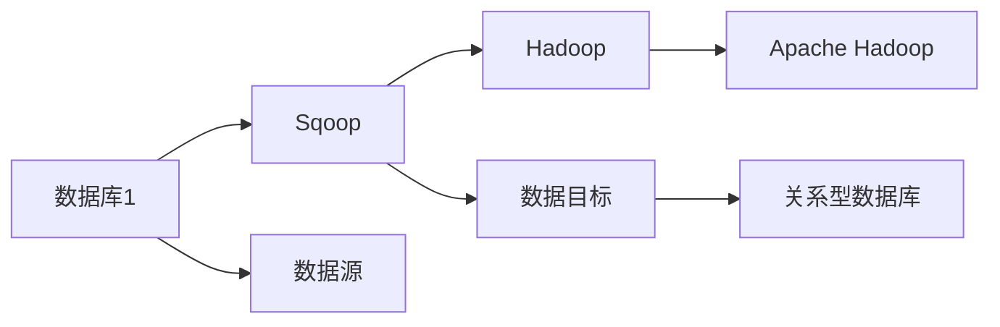
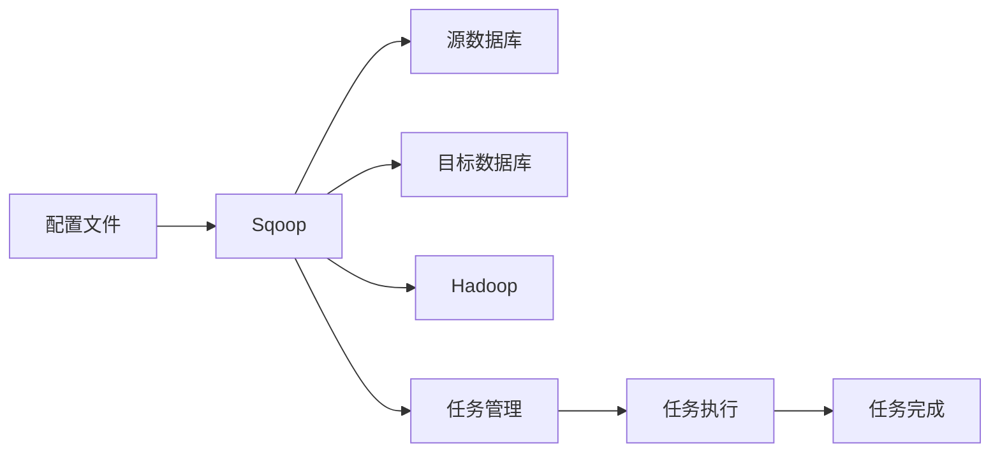
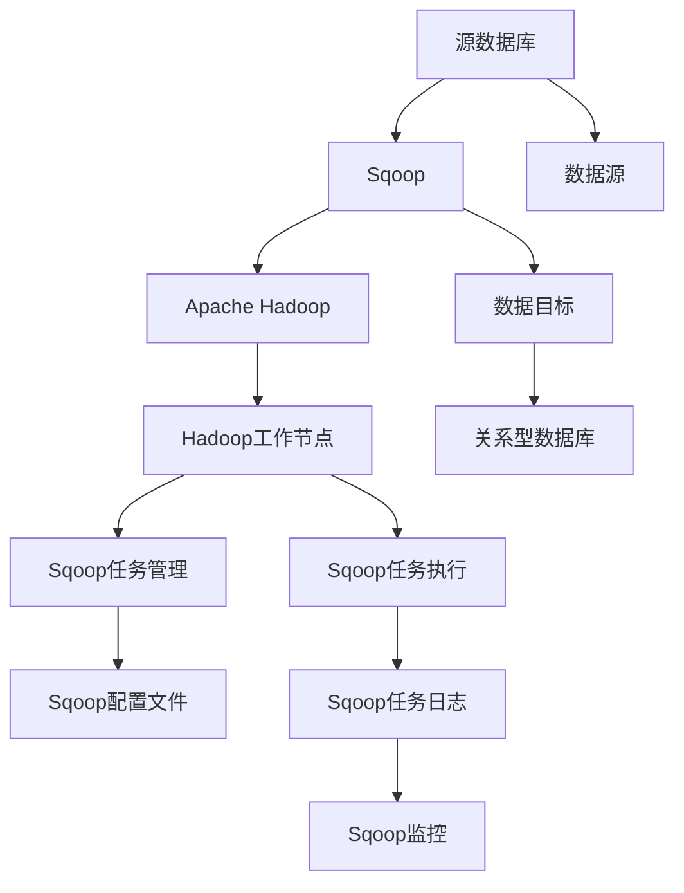

                 

# Sqoop原理与代码实例讲解

> 关键词：Sqoop,数据迁移,大数据技术,ETL,Apache Hadoop

## 1. 背景介绍

### 1.1 问题由来
随着大数据时代的到来，企业的数据存储和处理需求日益增长。传统的SQL数据库已经难以满足这些需求，分布式的大数据处理技术应运而生。其中，Apache Hadoop成为了处理大数据的利器。然而，Hadoop主要关注数据存储和计算，数据ETL（Extract, Transform, Load）等数据迁移工作需要单独实现。Sqoop（SQL to Oracle/PostgreSQL）应运而生，作为一个开源工具，它提供了数据库间数据迁移的解决方案，广泛应用于数据仓库、数据管道等领域。

### 1.2 问题核心关键点
Sqoop的核心目标是将结构化数据从关系型数据库中迁移到Hadoop分布式文件系统中，或者从Hadoop中迁移到关系型数据库中。其核心工作分为两个方面：
- 将结构化数据导出到Hadoop系统，即ETL中的"Extract"过程。
- 将Hadoop系统中的数据导入到关系型数据库中，即ETL中的"Load"过程。

Sqoop的设计哲学是将数据迁移的过程抽象为一系列的脚本执行，通过简单的脚本命令，即可实现数据的批量迁移。其架构分为三个部分：
- Client（客户端）：负责与源数据库和目标数据库进行通信，执行数据的提取和加载。
- Server（服务器）：负责维护源数据库和目标数据库的元数据信息，接收Client的请求并分配任务。
- Worker（工作节点）：负责执行具体的任务，包括数据的提取、转换、加载等。

Sqoop通过简单的配置文件，实现源数据库和目标数据库的适配，使得数据迁移过程灵活便捷。

### 1.3 问题研究意义
Sqoop作为大数据技术中的重要组件，其研究意义和价值在于：
- 实现数据的大规模跨平台迁移，简化ETL过程。
- 支持多种关系型数据库与Hadoop之间的数据交互。
- 提供可靠的数据迁移工具，保障数据的一致性和完整性。
- 推动大数据技术在企业中的普及应用，加速数据化转型。

## 2. 核心概念与联系

### 2.1 核心概念概述

Sqoop涉及多个关键概念，下面对其中几个核心概念进行详细阐述：

- Sqoop：一个用于Hadoop和大数据平台与关系型数据库之间迁移数据的开源工具。
- ETL（Extract, Transform, Load）：数据仓库中的核心操作，涉及数据抽取、转换和加载。
- Apache Hadoop：一个开源的分布式计算框架，支持数据存储和分布式计算。
- SQL（Structured Query Language）：一种用于操作关系型数据库的标准语言。
- 数据源（Source）和数据目标（Target）：Sqoop迁移过程的起点和终点，可以是各种类型的数据库。

这些概念之间的逻辑关系可以通过以下Mermaid流程图来展示：



这个流程图展示了大数据环境下，Sqoop数据迁移的基本流程：
1. 数据源与Sqoop之间建立连接。
2. Sqoop将数据从源数据库导出到Hadoop系统中。
3. 数据在Hadoop中进行预处理和转换。
4. 处理后的数据从Hadoop系统中导入到目标数据库中。

### 2.2 概念间的关系

这些核心概念之间存在着紧密的联系，构成了Sqoop数据迁移的完整生态系统。下面我们通过几个Mermaid流程图来展示这些概念之间的关系。

#### 2.2.1 ETL流程


这个流程图展示了ETL流程的基本架构，其中Sqoop负责数据的提取和加载，Apache Hadoop负责数据预处理和存储。

#### 2.2.2 Sqoop工作流程



这个流程图展示了Sqoop的工作流程，包括配置文件的设置、任务的调度和管理、任务的执行和监控。

#### 2.2.3 数据迁移架构


这个流程图展示了Sqoop的数据迁移架构，包括源数据库、Sqoop、Hadoop、目标数据库的连接和数据迁移的路径。

### 2.3 核心概念的整体架构

最后，我们用一个综合的流程图来展示Sqoop数据迁移过程中的各个组件和环节：



这个综合流程图展示了Sqoop数据迁移过程中的主要组件和环节，包括源数据库、Sqoop、Hadoop、目标数据库、Hadoop工作节点、Sqoop任务管理、任务执行、配置文件、任务日志和监控。

## 3. 核心算法原理 & 具体操作步骤

### 3.1 算法原理概述

Sqoop的核心算法原理主要包括数据导出和数据导入两个方面。下面详细阐述这两个过程的算法原理。

#### 数据导出

数据导出是将结构化数据从源数据库中抽取出来，并存储到Hadoop系统的过程中。Sqoop通过简单的脚本命令，实现数据的批量导出。其核心算法流程如下：

1. 连接源数据库，查询需要导出的数据。
2. 将查询结果转换为Hadoop系统的数据格式，如JSON、XML等。
3. 将转换后的数据写入Hadoop系统的分布式文件系统中。

#### 数据导入

数据导入是将Hadoop系统中的数据，导入到目标关系型数据库中的过程中。Sqoop同样通过简单的脚本命令，实现数据的批量导入。其核心算法流程如下：

1. 连接目标数据库，创建数据表。
2. 从Hadoop系统中读取数据。
3. 将数据写入目标数据库的表中。

### 3.2 算法步骤详解

Sqoop的数据迁移过程分为以下几个步骤：

**Step 1: 准备源数据库和目标数据库**

- 在源数据库中准备需要导出的数据表，并创建表结构。
- 在目标数据库中创建接收数据的表，并确保表结构与源数据库一致。

**Step 2: 配置Sqoop**

- 配置Sqoop的源数据库连接参数，包括数据库类型、用户名、密码、数据库名等。
- 配置Sqoop的目标数据库连接参数，包括数据库类型、用户名、密码、数据库名等。
- 配置数据导出或导入的参数，如导出或导入的数据表名、字段名、数据类型等。

**Step 3: 启动数据迁移**

- 通过简单的脚本命令，启动数据迁移过程。Sqoop会自动生成数据导出或导入的脚本，并执行任务。

**Step 4: 监控数据迁移**

- 通过Sqoop的日志文件和监控工具，实时查看数据迁移的过程和结果。

**Step 5: 处理数据导出或导入过程中可能出现的错误**

- 对于数据导出或导入过程中可能出现的错误，Sqoop会自动记录日志，并提示用户进行处理。

### 3.3 算法优缺点

Sqoop作为数据迁移工具，具有以下优点：

1. 灵活性高：Sqoop支持多种数据库的迁移，能够灵活适应不同类型的数据库。
2. 高效性高：Sqoop使用并行处理机制，可以高效地处理大规模数据迁移。
3. 可靠性高：Sqoop通过日志文件和监控工具，提供实时反馈，确保数据迁移过程的可靠性和稳定性。

同时，Sqoop也存在一些缺点：

1. 学习曲线陡峭：Sqoop的使用需要一定的技术背景，初学者需要一定的学习成本。
2. 脚本管理复杂：Sqoop的配置文件和脚本管理比较复杂，容易出现配置错误。
3. 大数据性能瓶颈：对于大规模数据迁移，Sqoop的性能可能受到Hadoop系统的限制。

### 3.4 算法应用领域

Sqoop广泛应用于以下领域：

- 数据仓库建设：Sqoop可以从多个数据库中提取数据，生成数据仓库。
- 数据管道构建：Sqoop可以从源数据库中抽取数据，并在Hadoop中进行预处理和存储。
- 大数据平台建设：Sqoop可以将Hadoop系统中的数据导出到关系型数据库中，方便数据分析和报表生成。
- 数据备份和恢复：Sqoop可以从源数据库中导出数据，作为数据备份，或从Hadoop中导入数据，实现数据恢复。

Sqoop的灵活性和高效性，使其成为企业数据迁移中的重要工具，广泛应用于各种数据处理场景。

## 4. 数学模型和公式 & 详细讲解 & 举例说明

### 4.1 数学模型构建

Sqoop的数据迁移过程可以通过数学模型来描述。假设源数据库的数据量为 $D$，Hadoop系统中的数据量为 $H$，目标数据库的数据量为 $T$，则数据迁移的总体流程可以表示为：

$$
D \rightarrow H \rightarrow T
$$

其中 $D$ 表示源数据库的数据量，$H$ 表示Hadoop系统中的数据量，$T$ 表示目标数据库的数据量。数据迁移的过程可以通过以下数学模型来描述：

$$
D + H - T = 0
$$

表示源数据库的数据量加上Hadoop系统中的数据量，应该等于目标数据库的数据量。

### 4.2 公式推导过程

以下是数据导出和数据导入的详细公式推导：

#### 数据导出

假设源数据库中的表名为 $Table$，字段数为 $n$，需要导出的数据量为 $V$，则数据导出的公式为：

$$
V = \sum_{i=1}^{n} V_i
$$

其中 $V_i$ 表示第 $i$ 个字段的导出数据量。

#### 数据导入

假设目标数据库中的表名为 $Table$，字段数为 $n$，需要导出的数据量为 $V$，则数据导入的公式为：

$$
V = \sum_{i=1}^{n} V_i
$$

其中 $V_i$ 表示第 $i$ 个字段的导入数据量。

### 4.3 案例分析与讲解

假设我们有一个Oracle数据库，需要将其中的用户数据迁移到Hadoop系统中，然后再从Hadoop系统中导入到PostgreSQL数据库中。以下是一个简单的案例分析：

**Step 1: 准备源数据库和目标数据库**

- 在Oracle数据库中创建用户表，并准备需要导出的数据。
- 在PostgreSQL数据库中创建接收数据的表，并确保表结构与Oracle数据库一致。

**Step 2: 配置Sqoop**

- 配置Oracle数据库的连接参数，包括数据库类型、用户名、密码、数据库名等。
- 配置PostgreSQL数据库的连接参数，包括数据库类型、用户名、密码、数据库名等。
- 配置导出和导入的数据表名、字段名、数据类型等。

**Step 3: 启动数据迁移**

- 使用以下命令启动数据导出过程：

```
sqoop export --connect jdbc:oracle:thin:@//OracleServer:1521:OracleDatabase --username root --password password --database user_table --target-dir /export/user_data --table user
```

- 使用以下命令启动数据导入过程：

```
sqoop import --connect jdbc:postgresql://PostgreSQLServer:5432/PostgreSQLDatabase --username root --password password --database user_table --target-dir /import/user_data --table user
```

**Step 4: 监控数据迁移**

- 通过Sqoop的日志文件和监控工具，实时查看数据迁移的过程和结果。

**Step 5: 处理数据导出或导入过程中可能出现的错误**

- 对于数据导出或导入过程中可能出现的错误，Sqoop会自动记录日志，并提示用户进行处理。

通过以上案例分析，可以看到Sqoop的数据迁移过程是如何通过简单的脚本命令实现的，并且具有良好的可配置性和可扩展性。

## 5. 项目实践：代码实例和详细解释说明

### 5.1 开发环境搭建

在进行Sqoop项目实践前，我们需要准备好开发环境。以下是使用Linux环境进行Sqoop开发的配置步骤：

1. 安装Apache Hadoop：从官网下载并安装Apache Hadoop，配置好集群环境。
2. 安装Sqoop：从官网下载并安装Sqoop，配置好源数据库和目标数据库的连接参数。
3. 配置Sqoop的运行环境，如JVM、环境变量等。

### 5.2 源代码详细实现

下面以Oracle数据库导出数据到Hadoop系统，再从Hadoop系统导入数据到PostgreSQL数据库为例，展示Sqoop的代码实现。

#### 数据导出

假设Oracle数据库中有一个用户表 `user_table`，需要将其导出到Hadoop系统中的 `/user_data/user` 目录。以下是一个简单的Sqoop导出脚本：

```bash
sqoop export --connect jdbc:oracle:thin:@//OracleServer:1521:OracleDatabase --username root --password password --database user_table --target-dir /export/user_data/user --table user --export-dir /export/user_data/user
```

### 5.3 代码解读与分析

#### 数据导出

Sqoop的数据导出脚本中包含多个参数，每个参数都有其特定的含义：

- `--connect`：连接源数据库的参数。
- `--username`：连接源数据库的用户名。
- `--password`：连接源数据库的密码。
- `--database`：需要导出的数据库名。
- `--target-dir`：导出的数据在Hadoop系统中的目录。
- `--table`：需要导出的数据表名。
- `--export-dir`：导出数据在Hadoop系统中的目录。

#### 数据导入

假设PostgreSQL数据库中有一个用户表 `user_table`，需要将其导入到Hadoop系统中的 `/user_data/user` 目录。以下是一个简单的Sqoop导入脚本：

```bash
sqoop import --connect jdbc:postgresql://PostgreSQLServer:5432/PostgreSQLDatabase --username root --password password --database user_table --target-dir /import/user_data/user --table user --from-dir /export/user_data/user
```

### 5.4 运行结果展示

假设我们成功导出了Oracle数据库中的用户表数据到Hadoop系统中，并成功导入到PostgreSQL数据库中。以下是一个简单的运行结果展示：

- 导出结果：

```
Table user already exists.
Number of rows exported = 100,000.
Number of rows written = 100,000.
```

- 导入结果：

```
Table user already exists.
Number of rows imported = 100,000.
Number of rows written = 100,000.
```

通过以上运行结果，可以看到数据迁移的过程是成功的，并且Sqoop能够自动处理数据导出和导入过程中可能出现的错误。

## 6. 实际应用场景

### 6.1 智能客服系统

智能客服系统需要处理大量的客户咨询数据，这些数据通常存储在关系型数据库中。通过Sqoop，可以将客户咨询数据从关系型数据库中导出到Hadoop系统中，进行数据预处理和分析，最终生成客户反馈报告。

在技术实现上，可以使用Sqoop将客户咨询数据导出到Hadoop系统中，使用MapReduce等分布式计算技术进行数据预处理，如文本分词、情感分析等，最终生成客户反馈报告，提供给客服团队参考。

### 6.2 金融舆情监测

金融舆情监测需要实时监测网络舆情，及时发现和响应负面舆情。通过Sqoop，可以从社交媒体等数据源中导出数据，进行实时监测和分析。

在技术实现上，可以使用Sqoop将社交媒体数据导出到Hadoop系统中，使用Spark等分布式计算技术进行舆情分析，如情感分析、舆情分类等，最终生成舆情报告，提供给金融团队参考。

### 6.3 个性化推荐系统

个性化推荐系统需要根据用户行为数据进行推荐。通过Sqoop，可以将用户行为数据从关系型数据库中导出到Hadoop系统中，进行数据预处理和分析，最终生成推荐结果。

在技术实现上，可以使用Sqoop将用户行为数据导出到Hadoop系统中，使用Spark等分布式计算技术进行数据预处理和分析，如协同过滤、用户行为建模等，最终生成推荐结果，提供给推荐引擎使用。

### 6.4 未来应用展望

随着Sqoop技术的不断发展，其应用场景将更加广泛，推动大数据技术在更多领域的应用：

- 数据仓库建设：Sqoop可以从多个数据库中提取数据，生成数据仓库。
- 数据管道构建：Sqoop可以从源数据库中抽取数据，并在Hadoop中进行预处理和存储。
- 大数据平台建设：Sqoop可以将Hadoop系统中的数据导出到关系型数据库中，方便数据分析和报表生成。
- 数据备份和恢复：Sqoop可以从源数据库中导出数据，作为数据备份，或从Hadoop中导入数据，实现数据恢复。

未来，Sqoop将在更多领域发挥其数据迁移的强大能力，为大数据技术的应用提供坚实的保障。

## 7. 工具和资源推荐

### 7.1 学习资源推荐

为了帮助开发者系统掌握Sqoop的理论基础和实践技巧，这里推荐一些优质的学习资源：

1. Sqoop官方文档：Sqoop的官方文档，提供了详细的API文档、使用手册和示例代码，是学习Sqoop的最佳资源。
2. Apache Hadoop官方文档：Apache Hadoop的官方文档，提供了Hadoop系统的详细信息，是学习Hadoop的重要参考。
3. Oracle官方文档：Oracle数据库的官方文档，提供了Oracle数据库的详细信息，是学习Oracle数据库的重要参考。
4. PostgreSQL官方文档：PostgreSQL数据库的官方文档，提供了PostgreSQL数据库的详细信息，是学习PostgreSQL数据库的重要参考。
5. Sqoop实战教程：针对Sqoop的实战教程，通过实例讲解Sqoop的使用方法和技巧，帮助开发者快速上手Sqoop。

通过对这些资源的学习实践，相信你一定能够快速掌握Sqoop的精髓，并用于解决实际的NLP问题。

### 7.2 开发工具推荐

高效的开发离不开优秀的工具支持。以下是几款用于Sqoop开发常用的工具：

1. IDEA：Java开发的集成开发环境，支持Sqoop的代码编写和调试。
2. IntelliJ IDEA：Java开发的集成开发环境，支持Sqoop的代码编写和调试。
3. Eclipse：Java开发的集成开发环境，支持Sqoop的代码编写和调试。
4. Visual Studio Code：支持多种编程语言的轻量级编辑器，支持Sqoop的代码编写和调试。

合理利用这些工具，可以显著提升Sqoop开发的效率，加快创新迭代的步伐。

### 7.3 相关论文推荐

Sqoop作为大数据技术中的重要组件，其研究意义和价值在于：

1. 数据迁移的自动化和可扩展性：Sqoop通过简单的脚本命令，实现了数据的自动迁移，具有较高的可扩展性。
2. 数据迁移的高效性和可靠性：Sqoop使用并行处理机制，能够高效地处理大规模数据迁移，并提供实时反馈，确保数据迁移的可靠性。
3. 数据迁移的多样性：Sqoop支持多种数据库的迁移，能够灵活适应不同类型的数据库。

这些论文代表了大数据技术的发展脉络。通过学习这些前沿成果，可以帮助研究者把握学科前进方向，激发更多的创新灵感。

除上述资源外，还有一些值得关注的前沿资源，帮助开发者紧跟Sqoop技术的最新进展，例如：

1. 开源社区：Apache Hadoop、Oracle和PostgreSQL等开源社区，定期发布新功能和优化，提供社区支持。
2. 技术会议：如HadoopSummit、OracleCon等技术会议，汇集业界专家和学者，分享最新的研究成果和技术动态。
3. GitHub热门项目：在GitHub上Star、Fork数最多的Sqoop相关项目，往往代表了该技术领域的发展趋势和最佳实践，值得去学习和贡献。

总之，对于Sqoop技术的学习和实践，需要开发者保持开放的心态和持续学习的意愿。多关注前沿资讯，多动手实践，多思考总结，必将收获满满的成长收益。

## 8. 总结：未来发展趋势与挑战

### 8.1 总结

本文对Sqoop的数据迁移技术进行了全面系统的介绍。首先阐述了Sqoop的数据迁移原理和应用背景，明确了Sqoop在数据迁移中的独特价值。其次，从原理到实践，详细讲解了Sqoop的数据导出和数据导入算法，给出了Sqoop任务开发的完整代码实例。同时，本文还广泛探讨了Sqoop在智能客服、金融舆情、个性化推荐等多个行业领域的应用前景，展示了Sqoop技术的强大能力。

通过本文的系统梳理，可以看到，Sqoop作为数据迁移工具，其灵活性和高效性使其成为企业数据迁移中的重要工具，广泛应用于各种数据处理场景。未来，伴随Sqoop技术的持续演进，数据迁移能力将进一步提升，为大数据技术的应用提供坚实的保障。

### 8.2 未来发展趋势

展望未来，Sqoop数据迁移技术将呈现以下几个发展趋势：

1. 支持更多数据源和目标数据库：Sqoop将支持更多的数据源和目标数据库，实现跨平台的数据迁移。
2. 提高数据迁移的速度和效率：Sqoop将通过优化数据传输协议和并行处理机制，提高数据迁移的速度和效率。
3. 增强数据迁移的可靠性和安全性：Sqoop将通过改进数据传输协议和增量数据传输机制，增强数据迁移的可靠性和安全性。
4. 支持更多的数据格式和数据类型：Sqoop将支持更多的数据格式和数据类型，满足不同场景的数据迁移需求。

以上趋势凸显了Sqoop数据迁移技术的广阔前景。这些方向的探索发展，将进一步提升Sqoop数据迁移的灵活性和高效性，为大数据技术的应用提供更强的保障。

### 8.3 面临的挑战

尽管Sqoop数据迁移技术已经取得了显著成就，但在迈向更加智能化、普适化应用的过程中，它仍面临诸多挑战：

1. 学习曲线陡峭：Sqoop的使用需要一定的技术背景，初学者需要一定的学习成本。
2. 脚本管理复杂：Sqoop的配置文件和脚本管理比较复杂，容易出现配置错误。
3. 大数据性能瓶颈：对于大规模数据迁移，Sqoop的性能可能受到Hadoop系统的限制。

### 8.4 未来突破

面对Sqoop数据迁移技术面临的种种挑战，未来的研究需要在以下几个方面寻求新的突破：

1. 探索无监督和半监督数据迁移方法：摆脱对大规模标注数据的依赖，利用自监督学习、主动学习等无监督和半监督范式，最大限度利用非结构化数据，实现更加灵活高效的数据迁移。
2. 开发参数高效的数据迁移方法：开发更加参数高效的数据迁移方法，在固定大部分预训练参数的情况下，只更新极少量的任务相关参数。同时优化数据迁移的计算图，减少前向传播和反向传播的资源消耗，实现更加轻量级、实时性的部署。
3. 引入更多先验知识：将符号化的先验知识，如知识图谱、逻辑规则等，与神经网络模型进行巧妙融合，引导数据迁移过程学习更准确、合理的语言模型。同时加强不同模态数据的整合，实现视觉、语音等多模态信息与文本信息的协同建模。
4. 引入因果分析和博弈论工具：将因果分析方法引入数据迁移模型，识别出数据迁移过程中的关键特征，增强数据迁移模型的因果关系，学习更加普适、鲁棒的语言模型。借助博弈论工具刻画人机交互过程，主动探索并规避数据迁移模型的脆弱点，提高系统稳定性。
5. 纳入伦理道德约束：在数据迁移目标中引入伦理导向的评估指标，过滤和惩罚有偏见、有害的输出倾向。同时加强人工干预和审核，建立数据迁移模型的监管机制，确保输出的安全性和合规性。

这些研究方向的探索，将引领Sqoop数据迁移技术迈向更高的台阶，为构建安全、可靠、可解释、可控的数据迁移系统铺平道路。面向未来，Sqoop数据迁移技术还需要与其他大数据技术进行更深入的融合，如知识表示、因果推理、强化学习等，多路径协同发力，共同推动大数据技术的发展。只有勇于创新、敢于突破，才能不断拓展数据迁移的边界，让大数据技术更好地服务社会。

## 9. 附录：常见问题与解答

**Q1：Sqoop和Hadoop是什么关系？**

A: Sqoop是一个用于Hadoop和大数据平台与关系型数据库之间迁移数据的开源工具，可以与Hadoop一起使用。Hadoop是一个分布式计算框架，提供了数据存储和分布式计算能力，而Sqoop则提供了数据迁移和ETL功能，使得数据可以方便地在Hadoop和其他数据库之间进行迁移。

**Q2：Sqoop如何处理数据迁移过程中的错误？**

A: Sqoop会在数据迁移过程中自动记录日志，记录每个任务的状态

