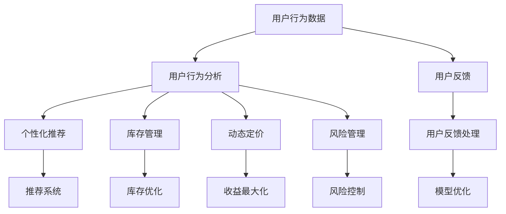
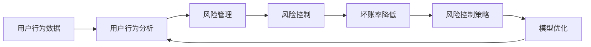
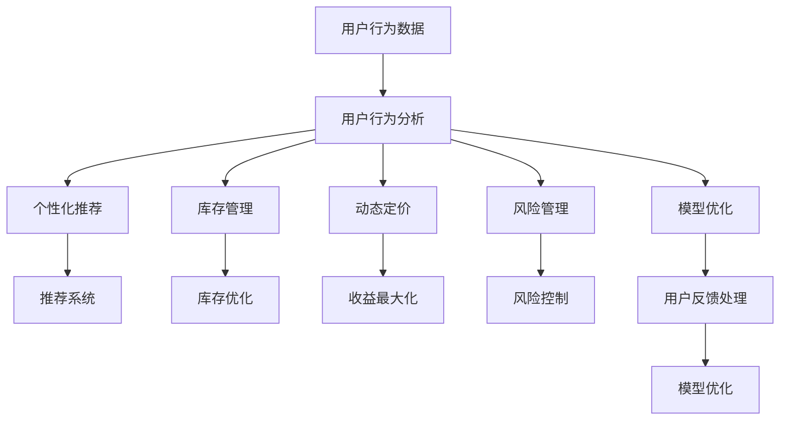

                 

# AI人工智能深度学习算法：智能深度学习代理在电子商务中的应用策略

> 关键词：深度学习,智能代理,电子商务,用户行为分析,推荐系统

## 1. 背景介绍

### 1.1 问题由来

随着互联网技术的快速发展，电子商务已成为全球最重要的经济活动之一。电商平台不仅能提供商品销售、售后服务等功能，还能通过数据分析和用户交互，实现智能推荐、个性化定制等增值服务。而深度学习作为一种强大的数据驱动技术，在电商领域中得到了广泛应用。

人工智能深度学习技术，特别是深度学习代理（AI Agents），能够处理大规模数据，提取用户行为模式，进行复杂的决策和预测，从而提升电商平台的运营效率和服务质量。例如，利用深度学习代理优化推荐系统、进行库存管理、进行价格预测等。

然而，深度学习技术在电子商务中的应用仍然面临一些挑战：
1. **数据多样性**：用户行为数据来自各种渠道，包括点击流、搜索记录、评价反馈等，数据格式和分布存在较大差异。
2. **计算复杂性**：电商平台的决策问题通常涉及多维度和多模态数据，需要高性能的深度学习模型和强大的计算资源。
3. **模型可解释性**：电商决策通常需要高度可解释的模型，以便理解模型的决策逻辑，避免黑箱问题。
4. **实时性要求**：电商平台需要实时响应用户行为，实现即时推荐和决策。

为应对这些挑战，智能深度学习代理（AI Agents）在电子商务中的应用策略显得尤为重要。

### 1.2 问题核心关键点

智能深度学习代理在电子商务中的应用策略，主要关注以下几个关键点：
1. **数据预处理**：从不同数据源收集和整合数据，进行清洗和标注。
2. **模型选择和训练**：选择合适的深度学习模型，进行模型训练和参数调整。
3. **在线学习和实时预测**：实现模型在线学习，实时预测用户行为和决策。
4. **效果评估与反馈优化**：使用评估指标对模型效果进行量化评估，并根据反馈进行模型优化。
5. **可解释性增强**：引入可解释性技术，解释模型的决策逻辑，提升信任度。

这些关键点相互关联，共同构成了智能深度学习代理在电子商务中应用的全过程。

### 1.3 问题研究意义

研究智能深度学习代理在电子商务中的应用策略，对于提升电商平台的智能化水平和服务质量具有重要意义：
1. **个性化推荐**：通过深度学习代理分析用户行为数据，提供个性化的商品推荐，提升用户体验和转化率。
2. **库存管理**：实时预测用户购买行为，优化库存水平，减少缺货和积压。
3. **价格优化**：分析市场需求和用户行为，实现动态定价策略，提升销售收益。
4. **风险管理**：预测用户违约风险，制定风险控制策略，降低坏账率。
5. **营销策略优化**：通过用户行为数据分析，优化广告投放和促销活动，提高营销效率。

此外，研究智能深度学习代理在电子商务中的应用策略，有助于提升电商平台的竞争力和市场份额，推动电商行业的数字化转型。

## 2. 核心概念与联系

### 2.1 核心概念概述

为更好地理解智能深度学习代理在电子商务中的应用策略，本节将介绍几个密切相关的核心概念：

- **深度学习代理**：一种基于深度学习模型的智能系统，能够自主地从环境中学习并执行决策和任务。在电子商务中，深度学习代理通常用于用户行为分析、推荐系统、库存管理等任务。
- **用户行为分析**：通过收集和分析用户行为数据，识别用户偏好和行为模式，为个性化推荐和库存管理提供基础。
- **推荐系统**：利用用户历史行为和商品特征，预测用户对商品的兴趣，提供个性化推荐。
- **库存管理**：实时预测用户购买行为，优化库存水平，减少缺货和积压。
- **动态定价**：根据市场需求和用户行为，实时调整商品价格，实现收益最大化。
- **风险管理**：预测用户违约风险，制定风险控制策略，降低坏账率。

这些核心概念之间的逻辑关系可以通过以下Mermaid流程图来展示：



这个流程图展示了大语言模型的核心概念及其之间的关系：

1. 用户行为数据通过用户行为分析模块转化为用户行为特征。
2. 用户行为特征输入个性化推荐、库存管理、动态定价和风险管理模块，分别提供推荐策略、库存优化、定价策略和风险控制措施。
3. 用户反馈通过反馈处理模块反馈到各个模块，用于模型优化。

### 2.2 概念间的关系

这些核心概念之间存在着紧密的联系，形成了深度学习代理在电子商务中应用的全过程。下面我们通过几个Mermaid流程图来展示这些概念之间的关系。

#### 2.2.1 用户行为分析与推荐系统


这个流程图展示了用户行为分析如何与推荐系统关联：用户行为数据经过用户行为分析，得到用户特征，然后通过推荐系统进行个性化推荐。

#### 2.2.2 库存管理与动态定价


这个流程图展示了库存管理和动态定价的关系：用户行为数据通过用户行为分析得到库存优化策略，进而通过动态定价实现收益最大化。

#### 2.2.3 风险管理与反馈优化



这个流程图展示了风险管理与反馈优化的关系：用户行为数据通过用户行为分析得到风险控制策略，通过风险控制策略降低坏账率，最终反馈到用户行为分析模块进行模型优化。

### 2.3 核心概念的整体架构

最后，我们用一个综合的流程图来展示这些核心概念在电子商务中的应用整体架构：



这个综合流程图展示了从用户行为数据到个性化推荐、库存管理、动态定价、风险管理等过程的全流程，各模块之间相互关联，共同构成了深度学习代理在电子商务中的应用策略。

## 3. 核心算法原理 & 具体操作步骤
### 3.1 算法原理概述

智能深度学习代理在电子商务中的应用策略，本质上是基于深度学习的推荐系统、库存管理和决策优化等过程。其核心思想是：通过收集和分析用户行为数据，利用深度学习模型预测用户行为，提供个性化推荐和决策支持。

具体来说，算法分为以下几个步骤：
1. **数据预处理**：收集用户行为数据，进行数据清洗、标注和归一化处理。
2. **模型选择和训练**：选择合适的深度学习模型，在标注数据上训练模型。
3. **在线学习和实时预测**：将训练好的模型部署到线上环境，实时处理用户行为数据，进行预测和推荐。
4. **效果评估与反馈优化**：使用评估指标对模型效果进行量化评估，根据反馈进行模型优化。
5. **可解释性增强**：引入可解释性技术，解释模型的决策逻辑，提升信任度。

### 3.2 算法步骤详解

#### 3.2.1 数据预处理

数据预处理是深度学习代理应用的首要步骤。主要包括以下几个方面：

- **数据收集**：从电商平台的各种渠道收集用户行为数据，包括点击流、搜索记录、评价反馈等。
- **数据清洗**：去除噪声数据和异常值，确保数据质量和一致性。
- **数据标注**：对用户行为数据进行标注，例如将用户的购买行为标注为“购买”或“未购买”。
- **数据归一化**：对不同来源的数据进行归一化处理，如时间戳、点击次数等。

数据预处理流程可以用以下伪代码表示：

```python
def preprocess_data(data):
    # 数据收集
    # 数据清洗
    # 数据标注
    # 数据归一化
    return processed_data
```

#### 3.2.2 模型选择和训练

选择合适的深度学习模型是深度学习代理应用的关键步骤。在电子商务中，常用的深度学习模型包括：

- **神经网络**：用于分类、回归等任务，如多层感知机（MLP）、卷积神经网络（CNN）等。
- **序列模型**：用于处理时间序列数据，如循环神经网络（RNN）、长短期记忆网络（LSTM）、门控循环单元（GRU）等。
- **注意力机制**：用于增强模型的特征提取能力，如Transformer、BERT等。

模型训练流程包括：

- **模型选择**：根据任务需求选择合适的深度学习模型。
- **模型初始化**：随机初始化模型参数。
- **模型训练**：在标注数据上训练模型，调整模型参数。
- **模型评估**：使用评估指标对模型效果进行量化评估。

模型训练流程可以用以下伪代码表示：

```python
def train_model(model, train_data, validation_data, epochs):
    # 模型初始化
    # 模型训练
    # 模型评估
    return trained_model
```

#### 3.2.3 在线学习和实时预测

在线学习和实时预测是深度学习代理应用的核心步骤。主要包括以下几个方面：

- **在线学习**：将训练好的模型部署到线上环境，实时处理用户行为数据，更新模型参数。
- **实时预测**：根据用户行为数据，实时预测用户行为和决策。

在线学习和实时预测流程可以用以下伪代码表示：

```python
def online_learning(model, online_data, batch_size, learning_rate):
    # 在线学习
    # 实时预测
    return updated_model
```

#### 3.2.4 效果评估与反馈优化

效果评估与反馈优化是深度学习代理应用的重要步骤。主要包括以下几个方面：

- **评估指标**：选择合适的评估指标，如准确率、召回率、F1分数等。
- **模型优化**：根据评估结果，调整模型参数，进行模型优化。
- **反馈优化**：根据用户反馈，优化模型训练和预测流程。

效果评估与反馈优化流程可以用以下伪代码表示：

```python
def evaluate_model(model, test_data, evaluation_metrics):
    # 效果评估
    # 模型优化
    # 反馈优化
    return evaluation_results
```

#### 3.2.5 可解释性增强

可解释性增强是深度学习代理应用的重要组成部分。主要包括以下几个方面：

- **可解释性技术**：引入可解释性技术，如LIME、SHAP等，解释模型的决策逻辑。
- **特征重要性分析**：分析模型特征的重要性，理解用户行为的影响因素。
- **模型透明性**：提升模型的透明性和可解释性，增强用户信任。

可解释性增强流程可以用以下伪代码表示：

```python
def enhance_explainability(model, feature_importance):
    # 可解释性技术
    # 特征重要性分析
    # 模型透明性
    return explained_model
```

### 3.3 算法优缺点

智能深度学习代理在电子商务中的应用策略，具有以下优点：
1. **高效性**：深度学习代理能够高效处理大规模数据，提供快速响应的决策支持。
2. **准确性**：深度学习模型具有较强的特征提取能力和模式识别能力，能够提供高精度的推荐和预测。
3. **可扩展性**：深度学习代理可以灵活适应不同的电商场景和任务，具有较好的可扩展性。
4. **实时性**：深度学习代理能够实时处理用户行为数据，提供即时的推荐和决策。

同时，该方法也存在一些缺点：
1. **高计算成本**：深度学习代理需要大量的计算资源和存储资源，尤其是在大规模数据集上训练时。
2. **高数据需求**：深度学习代理需要大量的标注数据进行训练，标注成本较高。
3. **模型复杂性**：深度学习模型结构复杂，难以理解和调试。
4. **可解释性不足**：深度学习模型通常是黑盒模型，难以解释其决策过程。

尽管存在这些缺点，但就目前而言，智能深度学习代理在电子商务中的应用策略仍是最主流的方法之一。未来相关研究的重点在于如何进一步降低计算成本、优化模型结构和提高可解释性，以更好地应对实际应用中的挑战。

### 3.4 算法应用领域

智能深度学习代理在电子商务中的应用策略，已经在多个领域得到了广泛的应用，例如：

- **个性化推荐**：通过深度学习代理分析用户行为数据，提供个性化的商品推荐，提升用户体验和转化率。
- **库存管理**：实时预测用户购买行为，优化库存水平，减少缺货和积压。
- **动态定价**：根据市场需求和用户行为，实时调整商品价格，实现收益最大化。
- **风险管理**：预测用户违约风险，制定风险控制策略，降低坏账率。
- **营销策略优化**：通过用户行为数据分析，优化广告投放和促销活动，提高营销效率。

除了上述这些经典应用外，智能深度学习代理还拓展到了更多领域，如智能客服、智能定价、智能搜索等，为电商平台的智能化运营提供了新的动力。

## 4. 数学模型和公式 & 详细讲解 & 举例说明
### 4.1 数学模型构建

本节将使用数学语言对智能深度学习代理在电子商务中的应用策略进行更加严格的刻画。

记用户行为数据为 $X=\{x_i\}_{i=1}^N$，其中 $x_i$ 为第 $i$ 个用户行为样本。假设每个用户行为样本 $x_i$ 可以表示为一个特征向量 $\mathbf{x_i} \in \mathbb{R}^d$。设 $Y$ 为标签集合，其中 $y_i \in Y$ 表示用户行为 $x_i$ 对应的标签。

定义深度学习代理模型为 $f: \mathbb{R}^d \rightarrow Y$，其中 $f(\mathbf{x_i})$ 为模型在用户行为样本 $\mathbf{x_i}$ 上的预测结果。

深度学习代理在电子商务中的应用策略，可以通过以下几个步骤构建：

1. **数据预处理**：
   - 数据收集：从电商平台收集用户行为数据 $X$。
   - 数据清洗：去除噪声数据和异常值。
   - 数据标注：对用户行为数据进行标注。
   - 数据归一化：对不同来源的数据进行归一化处理。

2. **模型选择和训练**：
   - 模型初始化：随机初始化模型参数。
   - 模型训练：在标注数据 $D$ 上训练模型 $f$，最小化损失函数 $\mathcal{L}(f)$。

3. **在线学习和实时预测**：
   - 在线学习：在实时数据流上训练模型 $f$，更新模型参数。
   - 实时预测：根据新用户行为数据，实时预测用户行为 $y_i$。

4. **效果评估与反馈优化**：
   - 评估指标：使用准确率、召回率、F1分数等评估指标对模型效果进行量化评估。
   - 模型优化：根据评估结果，调整模型参数，进行模型优化。
   - 反馈优化：根据用户反馈，优化模型训练和预测流程。

5. **可解释性增强**：
   - 可解释性技术：引入可解释性技术，如LIME、SHAP等，解释模型的决策逻辑。
   - 特征重要性分析：分析模型特征的重要性，理解用户行为的影响因素。
   - 模型透明性：提升模型的透明性和可解释性，增强用户信任。

### 4.2 公式推导过程

以个性化推荐为例，我们推导深度学习代理在电子商务中的应用策略的数学公式。

设 $X=\{x_i\}_{i=1}^N$ 为用户行为数据，$Y$ 为标签集合，其中 $y_i \in Y$ 表示用户行为 $x_i$ 对应的标签。定义深度学习代理模型为 $f: \mathbb{R}^d \rightarrow Y$，其中 $f(\mathbf{x_i})$ 为模型在用户行为样本 $\mathbf{x_i}$ 上的预测结果。

假设模型 $f$ 为多层感知机（MLP），其结构为 $f(\mathbf{x}) = W^L \sigma(W^{L-1} \sigma(W^{L-2} ... \sigma(W^1 \mathbf{x})))$，其中 $\sigma$ 为激活函数，$W^l \in \mathbb{R}^{d_l \times d_{l-1}}$ 为权重矩阵。

模型训练的损失函数为交叉熵损失函数，定义为：
$$
\mathcal{L}(f) = -\frac{1}{N} \sum_{i=1}^N \sum_{y \in Y} y_i \log f(\mathbf{x_i})
$$

模型的训练目标是最小化损失函数 $\mathcal{L}(f)$，即：
$$
\min_{f} \mathcal{L}(f)
$$

模型的在线学习过程可以表示为：
$$
f_{t+1}(\mathbf{x}) = f_t(\mathbf{x}) - \eta_t \nabla_{f_t} \mathcal{L}(f_t)
$$
其中 $\eta_t$ 为学习率，$\nabla_{f_t} \mathcal{L}(f_t)$ 为损失函数对模型 $f_t$ 的梯度。

模型的实时预测过程可以表示为：
$$
y_i = f(\mathbf{x_i})
$$

### 4.3 案例分析与讲解

以电商平台的库存管理为例，我们分析深度学习代理的应用策略。

假设电商平台有 $N$ 种商品，每种商品 $j$ 的库存量为 $S_j$，需求量为 $D_j$。设 $X=\{x_i\}_{i=1}^N$ 为用户行为数据，$Y$ 为标签集合，其中 $y_i \in Y$ 表示用户行为 $x_i$ 对应的标签。

定义深度学习代理模型为 $f: \mathbb{R}^d \rightarrow Y$，其中 $f(\mathbf{x_i})$ 为模型在用户行为样本 $\mathbf{x_i}$ 上的预测结果。

假设模型 $f$ 为多层感知机（MLP），其结构为 $f(\mathbf{x}) = W^L \sigma(W^{L-1} \sigma(W^{L-2} ... \sigma(W^1 \mathbf{x})))$，其中 $\sigma$ 为激活函数，$W^l \in \mathbb{R}^{d_l \times d_{l-1}}$ 为权重矩阵。

模型训练的损失函数为交叉熵损失函数，定义为：
$$
\mathcal{L}(f) = -\frac{1}{N} \sum_{i=1}^N \sum_{j=1}^N y_i \log f(\mathbf{x_i})
$$

模型的训练目标是最小化损失函数 $\mathcal{L}(f)$，即：
$$
\min_{f} \mathcal{L}(f)
$$

模型的在线学习过程可以表示为：
$$
f_{t+1}(\mathbf{x}) = f_t(\mathbf{x}) - \eta_t \nabla_{f_t} \mathcal{L}(f_t)
$$
其中 $\eta_t$ 为学习率，$\nabla_{f_t} \mathcal{L}(f_t)$ 为损失函数对模型 $f_t$ 的梯度。

模型的实时预测过程可以表示为：
$$
y_i = f(\mathbf{x_i})
$$

## 5. 项目实践：代码实例和详细解释说明
### 5.1 开发环境搭建

在进行智能深度学习代理在电子商务中的应用策略实践前，我们需要准备好开发环境。以下是使用Python进行PyTorch开发的环境配置流程：

1. 安装Anaconda：从官网下载并安装Anaconda，用于创建独立的Python环境。

2. 创建并激活虚拟环境：
```bash
conda create -n pytorch-env python=3.8 
conda activate pytorch-env
```

3. 安装PyTorch：根据CUDA版本，从官网获取对应的安装命令。例如：
```bash
conda install pytorch torchvision torchaudio cudatoolkit=11.1 -c pytorch -c conda-forge
```

4. 安装Transformers库：
```bash
pip install transformers
```

5. 安装各类工具包：
```bash
pip install numpy pandas scikit-learn matplotlib tqdm jupyter notebook ipython
```

完成上述步骤后，即可在`pytorch-env`环境中开始智能深度学习代理的应用策略开发。

### 5.2 源代码详细实现

这里我们以个性化推荐为例，给出使用Transformers库对深度学习代理进行建模和微调的PyTorch代码实现。

首先，定义推荐系统的数据处理函数：

```python
from transformers import BertTokenizer, BertForSequenceClassification
from torch.utils.data import Dataset
import torch

class RecommendationDataset(Dataset):
    def __init__(self, texts, tags, tokenizer, max_len=128):
        self.texts = texts
        self.tags = tags
        self.tokenizer = tokenizer
        self.max_len = max_len
        
    def __len__(self):
        return len(self.texts)
    
    def __getitem__(self, item):
        text = self.texts[item]
        tag = self.tags[item]
        
        encoding = self.tokenizer(text, return_tensors='pt', max_length=self.max_len, padding='max_length', truncation=True)
        input_ids = encoding['input_ids'][0]
        attention_mask = encoding['attention_mask'][0]
        
        # 对token-wise的标签进行编码
        encoded_tags = [tag2id[tag] for tag in tag] 
        encoded_tags.extend([tag2id['O']] * (self.max_len - len(encoded_tags)))
        labels = torch.tensor(encoded_tags, dtype=torch.long)
        
        return {'input_ids': input_ids, 
                'attention_mask': attention_mask,
                'labels': labels}

# 标签与id的映射
tag2id = {'O': 0, 'Buy': 1, 'Look': 2, 'Search': 3}
id2tag = {v: k for k, v in tag2id.items()}

# 创建dataset
tokenizer = BertTokenizer.from_pretrained('bert-base-cased')

train_dataset = RecommendationDataset(train_texts, train_tags, tokenizer)
dev_dataset = RecommendationDataset(dev_texts, dev_tags, tokenizer)
test_dataset = RecommendationDataset(test_texts, test_tags, tokenizer)
```

然后，定义模型和优化器：

```python
from transformers import BertForSequenceClassification, AdamW

model = BertForSequenceClassification.from_pretrained('bert-base-cased', num_labels=len(tag2id))

optimizer = AdamW(model.parameters(), lr=2e-5)
```

接着，定义训练和评估函数：

```python
from torch.utils.data import DataLoader
from tqdm import tqdm
from sklearn.metrics import classification_report

device = torch.device('cuda') if torch.cuda.is_available() else torch.device('cpu')
model.to(device)

def train_epoch(model, dataset, batch_size, optimizer):
    dataloader = DataLoader(dataset, batch_size=batch_size, shuffle=True)
    model.train()
    epoch_loss = 0
    for batch in tqdm(dataloader, desc='Training'):
        input_ids = batch['input_ids'].to(device)
        attention_mask = batch['attention_mask'].to(device)
        labels = batch['labels'].to(device)
        model.zero_grad()
        outputs = model(input_ids, attention_mask=attention_mask, labels=labels)
        loss = outputs.loss
        epoch_loss += loss.item()
        loss.backward()
        optimizer.step()
    return epoch_loss / len(dataloader)

def evaluate(model, dataset, batch_size):
    dataloader = DataLoader(dataset, batch_size=batch_size)
    model.eval()
    preds, labels = [], []
    with torch.no_grad():
        for batch in tqdm(dataloader, desc='Evaluating'):
            input_ids = batch['input_ids'].to(device)
            attention_mask = batch['attention_mask'].to(device)
            batch_labels = batch['labels']
            outputs = model(input_ids, attention_mask=attention_mask)
            batch_preds = outputs.logits.argmax(dim=2).to('cpu').tolist()
            batch_labels = batch_labels.to('cpu').tolist()
            for pred_tokens, label_tokens in zip(batch_preds, batch_labels):
                pred_tags = [id2tag[_id] for _id in pred_tokens]
                label_tags = [id

