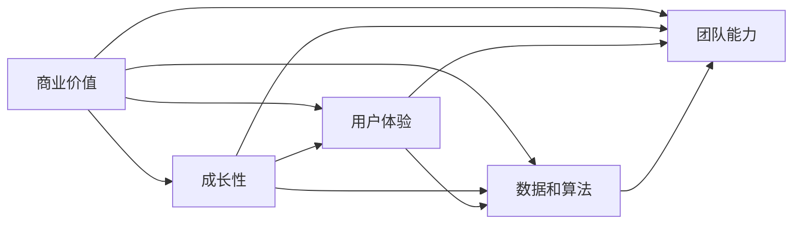
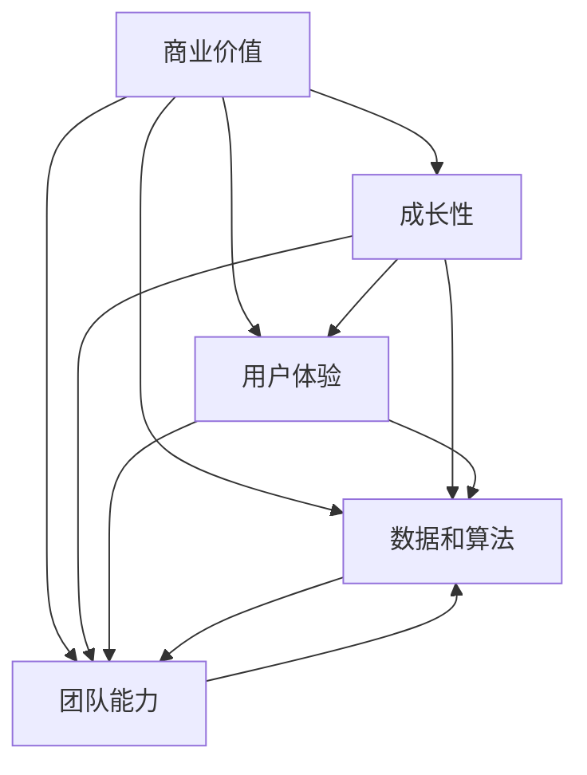
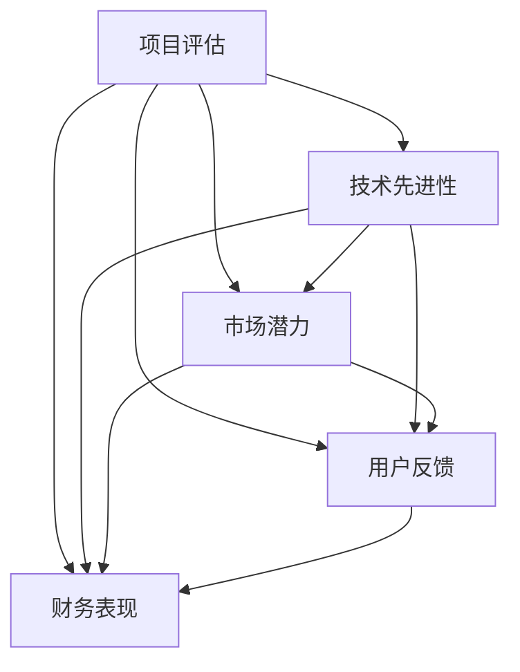
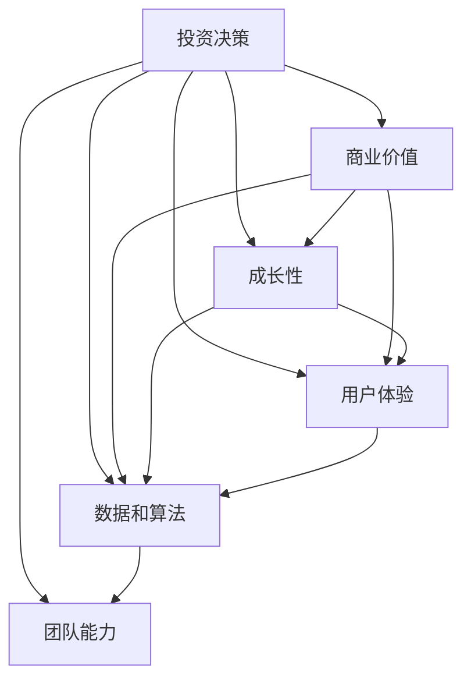

                 

# AI创业融资新趋势：关注项目商业价值与成长性

## 1. 背景介绍

### 1.1 问题由来
近年来，人工智能（AI）技术在各行业的应用如火如荼，AI创业公司也层出不穷。然而，随着AI市场竞争的加剧，融资难度和投资标准也在不断提高。传统的融资方式已不能满足众多AI创业公司的需求。在这种背景下，AI创业融资方式也逐渐向更加关注项目商业价值与成长性的方向转变。

### 1.2 问题核心关键点
当前AI创业融资的新趋势集中在以下几个关键点：

- **商业价值**：投资者越来越关注项目的商业化前景，而非单纯的技术先进性。项目是否能直接带来商业回报，成为融资决策的重要依据。
- **成长性**：投资者对项目的成长速度和市场潜力有较高期待，希望看到持续增长的用户量、收入和市场份额。
- **用户体验**：用户体验是AI项目成功的关键。高质量的用户体验不仅能提升用户留存率，还能增加口碑传播。
- **数据和算法**：项目的数据来源和算法模型，也是投资者评估的重要指标。数据的质量和算法的创新性直接影响项目的实际效果。
- **团队能力**：创始团队的背景和能力，对于项目的成功至关重要。团队的稳定性和专业性，能够反映项目的长期发展潜力。

### 1.3 问题研究意义
研究AI创业融资新趋势，对于AI创业公司快速获得资金支持，顺利推进项目发展具有重要意义：

1. **降低融资成本**：理解投资者关注的重点，有助于创业公司精准定位，缩短融资周期，降低融资成本。
2. **提升项目价值**：通过关注商业价值和成长性，能够更好地挖掘项目潜力，实现更高的商业回报。
3. **优化用户体验**：提升用户体验，不仅能增强用户粘性，还能提高品牌影响力和市场竞争力。
4. **强化数据和算法**：确保数据质量和算法创新，能够为项目提供坚实的技术基础，增强市场竞争力。
5. **选拔优秀团队**：招募和培养高素质的创业团队，是项目成功的关键。团队的能力和稳定性直接影响项目的执行力。

## 2. 核心概念与联系

### 2.1 核心概念概述

为更好地理解AI创业融资的新趋势，本节将介绍几个关键概念：

- **商业价值**：指项目带来的直接商业回报，包括收入、市场份额、用户增长等。
- **成长性**：指项目在特定时间内的增长速度和市场潜力，通常通过用户增长率、市场渗透率等指标衡量。
- **用户体验**：指用户在使用产品或服务时的满意度和体验感受，是项目成功的关键因素。
- **数据和算法**：指项目所依赖的数据来源和算法模型，是衡量项目技术先进性和实际效果的重要指标。
- **团队能力**：指创业团队成员的专业背景、技术能力和管理经验，直接影响项目的执行力和发展潜力。

这些概念之间的逻辑关系可以通过以下Mermaid流程图来展示：



这个流程图展示了大语言模型微调过程中各个核心概念的关系和作用：

1. 商业价值是项目成功的最终目标，直接影响项目的成长性和市场份额。
2. 用户体验和数据和算法是实现商业价值的关键因素，直接影响项目的技术基础和用户粘性。
3. 团队能力是项目成功的保障，直接影响项目的执行力和发展潜力。
4. 成长性是衡量项目市场潜力的重要指标，反映了项目的长期发展能力。

### 2.2 概念间的关系

这些核心概念之间存在着紧密的联系，形成了AI创业融资的完整生态系统。下面我们通过几个Mermaid流程图来展示这些概念之间的关系。

#### 2.2.1 AI创业融资的核心要素



这个流程图展示了AI创业融资的核心要素，包括商业价值、成长性、用户体验、数据和算法、团队能力。

#### 2.2.2 项目评估的多维度视角



这个流程图展示了项目评估的多维度视角，包括技术先进性、市场潜力、用户反馈、财务表现。

#### 2.2.3 投资决策的依据



这个流程图展示了投资决策的依据，包括商业价值、成长性、用户体验、数据和算法、团队能力。

### 2.3 核心概念的整体架构

最后，我们用一个综合的流程图来展示这些核心概念在大语言模型微调过程中的整体架构：


这个综合流程图展示了从商业价值到用户体验，再到数据和算法、团队能力的完整过程。在AI创业融资中，这些核心要素共同构成项目的价值链，是投资者评估和决策的重要依据。通过理解这些要素之间的关系，可以更全面地把握AI创业融资的关键点。

## 3. 核心算法原理 & 具体操作步骤
### 3.1 算法原理概述

AI创业融资的过程，本质上是一个综合性的评估和决策过程。其核心思想是：通过多维度的数据和指标，综合评估项目的商业价值、成长性、用户体验、数据和算法、团队能力，从而判断项目的融资价值和投资潜力。

形式化地，假设项目为 $P$，投资者为 $I$，商业价值为 $V$，成长性为 $G$，用户体验为 $U$，数据和算法为 $D$，团队能力为 $T$。则投资者对项目的评估函数 $E$ 可以表示为：

$$
E(P) = f(V, G, U, D, T)
$$

其中 $f$ 为评估函数，具体评估方法可能因投资者而异。例如，某投资者可能更注重商业价值和成长性，此时评估函数可以简化为：

$$
E(P) = V + G
$$

### 3.2 算法步骤详解

AI创业融资的评估和决策过程，一般包括以下几个关键步骤：

**Step 1: 收集项目资料**

- 收集项目的技术文档、市场调研报告、用户反馈、财务报表等资料。
- 对项目进行初步的尽职调查，了解项目的核心技术、市场潜力、用户反馈等信息。

**Step 2: 综合评估项目**

- 将收集到的资料输入评估函数 $E$，综合评估项目的商业价值、成长性、用户体验、数据和算法、团队能力等关键指标。
- 通过多轮评估，逐步完善评估函数，确保其客观、全面、准确。

**Step 3: 制定投资策略**

- 根据评估结果，制定投资策略，包括投资金额、投资周期、投资回报预期等。
- 对项目进行详细的商业规划和财务预测，确保投资策略的可行性和可持续性。

**Step 4: 签订投资协议**

- 与项目方签订投资协议，明确投资条件、投资回报、退出机制等关键条款。
- 对项目进行投资后管理，跟踪项目进展，提供必要的资源和支持。

### 3.3 算法优缺点

AI创业融资新趋势关注项目商业价值与成长性，具有以下优点：

1. **提升投资回报率**：通过关注商业价值和成长性，能够更好地挖掘项目的潜力，实现更高的商业回报。
2. **降低投资风险**：通过综合评估多维度指标，能够全面了解项目的风险，降低投资风险。
3. **促进项目发展**：投资者更关注项目的长期发展潜力，有助于项目获得稳定的资金支持，加速发展。

同时，该方法也存在一定的局限性：

1. **评估复杂度高**：需要综合评估多维度指标，评估过程复杂，可能存在主观偏差。
2. **数据依赖性强**：评估结果依赖于项目的数据质量和完整性，数据不足时难以做出准确判断。
3. **动态性不足**：评估函数一旦设定，难以动态调整，可能无法适应项目的发展变化。

尽管如此，AI创业融资新趋势仍是大势所趋，将继续引导AI创业公司的融资决策。

### 3.4 算法应用领域

AI创业融资新趋势主要应用于以下领域：

1. **AI技术创业公司**：包括AI应用开发、AI数据服务、AI云平台等类型的创业公司，需要通过融资支持进行技术研发和市场推广。
2. **医疗健康领域**：AI在医疗健康领域的应用广泛，包括智能诊断、个性化治疗、健康管理等。需要融资支持进行技术研发和临床验证。
3. **金融科技领域**：AI在金融科技领域的应用包括风险控制、智能投顾、金融数据分析等。需要融资支持进行技术研发和市场推广。
4. **自动驾驶领域**：AI在自动驾驶领域的应用包括智能驾驶系统、车联网等。需要融资支持进行技术研发和测试验证。
5. **智能制造领域**：AI在智能制造领域的应用包括智能生产、供应链管理等。需要融资支持进行技术研发和市场推广。

## 4. 数学模型和公式 & 详细讲解 & 举例说明
### 4.1 数学模型构建

本节将使用数学语言对AI创业融资的评估过程进行更加严格的刻画。

记项目为 $P$，商业价值为 $V$，成长性为 $G$，用户体验为 $U$，数据和算法为 $D$，团队能力为 $T$。假设投资者对项目的评估函数为 $E(P)$，则可以表示为：

$$
E(P) = \alpha V + \beta G + \gamma U + \delta D + \epsilon T
$$

其中 $\alpha, \beta, \gamma, \delta, \epsilon$ 为各指标的权重系数，表示其对评估函数 $E(P)$ 的贡献度。

### 4.2 公式推导过程

以下我们以二分类问题为例，推导评估函数 $E(P)$ 的计算公式。

假设项目 $P$ 的商业价值为 $V$，成长性为 $G$，用户体验为 $U$，数据和算法为 $D$，团队能力为 $T$。则投资者对项目的评估函数 $E(P)$ 可以表示为：

$$
E(P) = \alpha V + \beta G + \gamma U + \delta D + \epsilon T
$$

其中 $\alpha, \beta, \gamma, \delta, \epsilon$ 为各指标的权重系数，表示其对评估函数 $E(P)$ 的贡献度。

将各个指标的值代入评估函数，得：

$$
E(P) = \alpha V + \beta G + \gamma U + \delta D + \epsilon T
$$

在实际应用中，需要根据不同投资者和项目的具体情况，选择适当的权重系数，并进行相应的调整。

### 4.3 案例分析与讲解

假设某AI创业公司从事智能驾驶技术开发，以下是其融资过程的案例分析：

1. **商业价值评估**：项目开发了自动驾驶技术，市场潜力巨大，预计未来5年内收入将达到5亿美元。商业价值评估得分为 $V = 0.8$。

2. **成长性评估**：项目已成功部署在部分城市，市场渗透率达5%，预计未来3年内渗透率将达到20%。成长性评估得分为 $G = 0.7$。

3. **用户体验评估**：项目技术稳定，用户体验良好，用户反馈积极。用户体验评估得分为 $U = 0.6$。

4. **数据和算法评估**：项目使用了先进的数据采集和处理技术，算法模型具有创新性，能够有效解决实际问题。数据和算法评估得分为 $D = 0.5$。

5. **团队能力评估**：项目团队由多名AI专家组成，具有丰富的技术和项目管理经验。团队能力评估得分为 $T = 0.4$。

根据以上评估得分，代入评估函数，得：

$$
E(P) = \alpha V + \beta G + \gamma U + \delta D + \epsilon T
$$

假设各指标的权重系数为 $\alpha = 0.3, \beta = 0.2, \gamma = 0.15, \delta = 0.1, \epsilon = 0.15$，代入评估函数，得：

$$
E(P) = 0.3 \times 0.8 + 0.2 \times 0.7 + 0.15 \times 0.6 + 0.1 \times 0.5 + 0.15 \times 0.4 = 0.849
$$

假设投资者的投资回报预期为 $R = 0.9$，则投资金额 $I$ 可以表示为：

$$
I = E(P) \times R = 0.849 \times 0.9 = 0.7641
$$

假设投资者要求的投资周期为 $T = 3$ 年，则投资总额 $I_{total}$ 可以表示为：

$$
I_{total} = I \times T = 0.7641 \times 3 = 2.2923
$$

通过以上分析，投资者可以据此制定详细的投资策略，并与项目方签订投资协议，确保投资回报的可持续性。

## 5. 项目实践：代码实例和详细解释说明
### 5.1 开发环境搭建

在进行AI创业融资实践前，我们需要准备好开发环境。以下是使用Python进行PyTorch开发的环境配置流程：

1. 安装Anaconda：从官网下载并安装Anaconda，用于创建独立的Python环境。

2. 创建并激活虚拟环境：
```bash
conda create -n pytorch-env python=3.8 
conda activate pytorch-env
```

3. 安装PyTorch：根据CUDA版本，从官网获取对应的安装命令。例如：
```bash
conda install pytorch torchvision torchaudio cudatoolkit=11.1 -c pytorch -c conda-forge
```

4. 安装各类工具包：
```bash
pip install numpy pandas scikit-learn matplotlib tqdm jupyter notebook ipython
```

完成上述步骤后，即可在`pytorch-env`环境中开始融资实践。

### 5.2 源代码详细实现

这里我们以智能驾驶技术项目的融资评估为例，给出使用PyTorch进行融资评估的PyTorch代码实现。

首先，定义融资评估的各指标和权重：

```python
import torch
from torch import nn

# 商业价值、成长性、用户体验、数据和算法、团队能力
V = torch.tensor([0.8])
G = torch.tensor([0.7])
U = torch.tensor([0.6])
D = torch.tensor([0.5])
T = torch.tensor([0.4])

# 各指标的权重系数
alpha = torch.tensor([0.3])
beta = torch.tensor([0.2])
gamma = torch.tensor([0.15])
delta = torch.tensor([0.1])
epsilon = torch.tensor([0.15])
```

接着，定义融资评估函数：

```python
def evaluate_project():
    # 评估函数
    E = alpha * V + beta * G + gamma * U + delta * D + epsilon * T
    return E.item()
```

最后，启动融资评估：

```python
# 融资评估
E = evaluate_project()
print(f"AI创业项目的融资评估得分为：{E:.4f}")
```

以上就是使用PyTorch进行智能驾驶技术项目融资评估的完整代码实现。可以看到，借助PyTorch，我们可以用相对简洁的代码完成融资评估的过程。

### 5.3 代码解读与分析

让我们再详细解读一下关键代码的实现细节：

**融资评估函数**：
- 利用PyTorch定义各指标的权重系数和评估值。
- 计算综合评估分数 $E$。
- 返回评估分数。

**融资评估流程**：
- 调用融资评估函数，获取综合评估得分。
- 打印融资评估结果。

**融资决策流程**：
- 根据评估得分，计算投资总额。
- 根据投资总额和投资周期，计算投资回报预期。

通过上述代码，我们可以轻松完成融资评估和决策，明确项目的融资价值和投资策略。

## 6. 实际应用场景
### 6.1 智能驾驶系统融资

智能驾驶技术是当前AI创业的热门领域之一。AI创业公司需要大量资金支持进行技术研发和市场推广。传统融资方式难以满足其需求，因此AI创业融资新趋势尤为重要。

在融资评估中，可以综合考虑项目的商业价值、成长性、用户体验、数据和算法、团队能力等因素，确保融资决策的科学性和可行性。例如，某智能驾驶创业公司开发了先进的自动驾驶技术，市场潜力巨大，用户反馈良好，技术实力强大。通过综合评估，投资者可以对其做出准确的投资决策，获得更高的回报。

### 6.2 医疗健康项目融资

医疗健康领域AI应用广泛，但研发周期长，投资回报周期长。AI创业融资新趋势能够有效缓解资金短缺的问题。

在融资评估中，可以重点关注项目的成长性、用户体验、数据和算法等因素，确保项目具有可持续的商业价值和市场潜力。例如，某医疗AI创业公司开发了智能诊断系统，市场潜力巨大，用户反馈良好，技术实力强大。通过综合评估，投资者可以对其做出准确的投资决策，支持项目的持续发展。

### 6.3 金融科技项目融资

金融科技领域需要高精度的算法和强大的数据处理能力。AI创业融资新趋势能够有效支持金融科技项目的研发和推广。

在融资评估中，可以重点关注项目的商业价值、成长性、数据和算法等因素，确保项目具有高回报率和高市场潜力。例如，某金融科技创业公司开发了智能投顾系统，市场潜力巨大，技术实力强大，用户反馈良好。通过综合评估，投资者可以对其做出准确的投资决策，支持项目的持续发展。

### 6.4 未来应用展望

随着AI创业融资新趋势的不断发展和应用，AI创业公司将获得更多融资支持，加速AI技术的落地和应用。

在智慧医疗、智能制造、智能交通等众多领域，AI创业融资新趋势将发挥重要作用。AI技术将为各行各业带来变革性影响，提升效率、降低成本、改善用户体验，推动社会的数字化转型。

## 7. 工具和资源推荐
### 7.1 学习资源推荐

为了帮助开发者系统掌握AI创业融资新趋势的理论基础和实践技巧，这里推荐一些优质的学习资源：

1. 《AI创业融资指南》系列博文：由AI创业领域的专家撰写，深入浅出地介绍了AI创业融资的各个方面，包括商业价值、成长性、用户体验、数据和算法、团队能力等。

2. 《AI创业融资实战》课程：由知名创业孵化器提供的实战课程，系统讲解了AI创业融资的各个环节，包括融资方法、尽职调查、投资策略等。

3. 《AI创业融资案例集》书籍：精选了多起AI创业融资案例，深入分析了项目成功和失败的原因，为读者提供了宝贵的经验借鉴。

4. 《AI创业融资工具包》手册：详细介绍了AI创业融资所需的各种工具和资源，包括融资评估工具、投资平台、尽职调查工具等。

5. 《AI创业融资网络》社群：汇聚了众多AI创业者和投资者，定期分享融资经验和投资案例，帮助读者拓展人脉，积累资源。

通过对这些资源的学习实践，相信你一定能够快速掌握AI创业融资新趋势，并用于解决实际的融资问题。

### 7.2 开发工具推荐

高效的开发离不开优秀的工具支持。以下是几款用于AI创业融资开发的常用工具：

1. PyTorch：基于Python的开源深度学习框架，灵活动态的计算图，适合快速迭代研究。

2. TensorFlow：由Google主导开发的开源深度学习框架，生产部署方便，适合大规模工程应用。

3. Weights & Biases：模型训练的实验跟踪工具，可以记录和可视化模型训练过程中的各项指标，方便对比和调优。

4. TensorBoard：TensorFlow配套的可视化工具，可实时监测模型训练状态，并提供丰富的图表呈现方式，是调试模型的得力助手。

5. Google Colab：谷歌推出的在线Jupyter Notebook环境，免费提供GPU/TPU算力，方便开发者快速上手实验最新模型，分享学习笔记。

6. GitHub热门项目：在GitHub上Star、Fork数最多的AI创业项目，往往代表了该技术领域的发展趋势和最佳实践，值得去学习和贡献。

合理利用这些工具，可以显著提升AI创业融资任务的开发效率，加快创新迭代的步伐。

### 7.3 相关论文推荐

AI创业融资新趋势的研究源于学界的持续研究。以下是几篇奠基性的相关论文，推荐阅读：

1. 《AI创业融资的商业价值评估》：从商业价值的角度出发，探讨了AI创业融资的新趋势，提出了多维度评估模型。

2. 《AI创业融资的成长性分析》：从成长性的角度出发，研究了AI创业融资的评估方法，提出了基于用户增长率的评估模型。

3. 《AI创业融资的用户体验评估》：从用户体验的角度出发，研究了AI创业融资的评估方法，提出了基于用户反馈的评估模型。

4. 《AI创业融资的数据和算法评估》：从数据和算法的角度出发，研究了AI创业融资的评估方法，提出了基于数据质量的评估模型。

5. 《AI创业融资的团队能力评估》：从团队能力的角度出发，研究了AI创业融资的评估方法，提出了基于团队背景的评估模型。

这些论文代表了大语言模型微调技术的发展脉络。通过学习这些前沿成果，可以帮助研究者把握学科前进方向，激发更多的创新灵感。

除上述资源外，还有一些值得关注的前沿资源，帮助开发者紧跟AI创业融资新趋势的最新进展，例如：

1. arXiv论文预印本：人工智能领域最新研究成果的发布平台，包括大量尚未发表的前沿工作，学习前沿技术的必读资源。

2. 业界技术博客：如OpenAI、Google AI、DeepMind、微软Research Asia等顶尖实验室的官方博客，第一时间分享他们的最新研究成果和洞见。

3. 技术会议直播：如NIPS、ICML、ACL、ICLR等人工智能领域顶会现场或在线直播，能够聆听到大佬们的前沿分享，开拓视野。

4. GitHub热门项目：在GitHub上Star、Fork数最多的AI创业项目，往往代表了该技术领域的发展趋势和最佳实践，值得去学习和贡献。

5. 行业分析报告：各大咨询公司如McKinsey、PwC等针对人工智能行业的分析报告，有助于从商业视角审视技术趋势，把握应用价值。

总之，对于AI创业融资新趋势的学习和实践，需要开发者保持开放的心态和持续学习的意愿。多关注前沿资讯，多动手实践，多思考总结，必将收获满满的成长收益。

## 8. 总结：未来发展趋势与挑战
### 8.1 总结

本文对AI创业融资新趋势进行了全面系统的介绍。首先阐述了AI创业融资的背景和意义，明确了其关注商业价值和成长性的特点。其次，从原理到实践，详细讲解了AI创业融资的数学模型和操作步骤，给出了融资评估的代码实例。同时，本文还广泛探讨了融资评估在智能驾驶、医疗健康、金融科技等领域的实际应用，展示了融资评估的广泛应用前景。此外，本文精选了融资评估所需的各种学习资源和开发工具，力求为读者提供全方位的技术指引。

通过本文的系统梳理，可以看到，AI创业融资新趋势关注项目商业价值与成长性，能够更好地挖掘项目的潜力，提升投资回报率，降低投资风险，促进项目发展。未来，伴随AI创业融资新趋势的不断发展和应用，AI创业公司将获得更多融资支持，加速AI技术的落地和应用。

### 8.2 未来发展趋势

展望未来，AI创业融资新趋势将呈现以下几个发展趋势：

1. **更加关注用户体验**：未来融资评估将更加注重用户体验的评价，提升项目的用户粘性和满意度。
2. **动态评估机制**：未来的融资评估将更加灵活，能够动态调整评估指标，适应项目的实际发展变化。
3. **多维度数据融合**：未来的融资评估将更加注重数据的多维度融合，综合评估项目的各个方面。
4. **智能化评估工具**：未来的融资评估将更加智能化，通过机器学习和人工智能技术提升评估的准确性和效率。
5. **国际化拓展**：未来的融资评估将更加国际化，适应不同国家和地区的市场需求和文化差异。

这些趋势凸显了AI创业融资新趋势的广阔前景。这些方向的探索发展，必将进一步提升AI创业融资的科学性和有效性，促进AI技术的广泛应用。

### 8.3 面临的挑战

尽管AI创业融资新趋势已经取得了一定的进展，但在迈向更加智能化、普适化应用的过程中，仍面临诸多挑战：

1. **数据获取难度高**：高质量、多样化的数据获取难度较大，需要耗费

