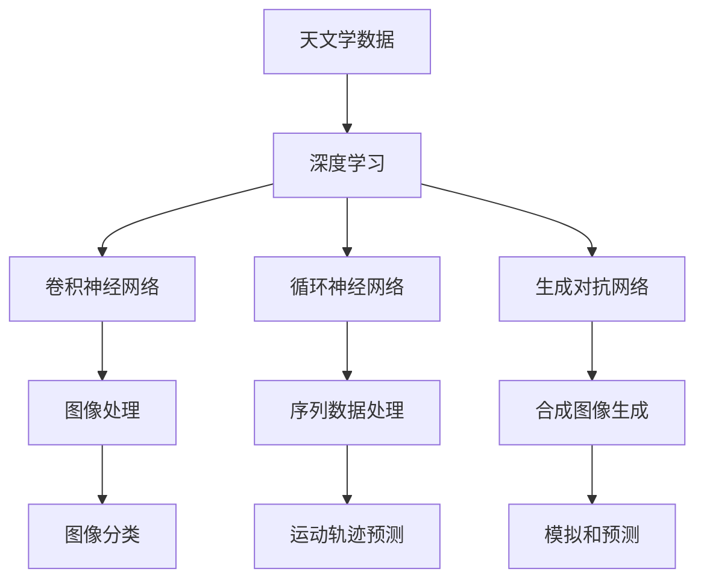
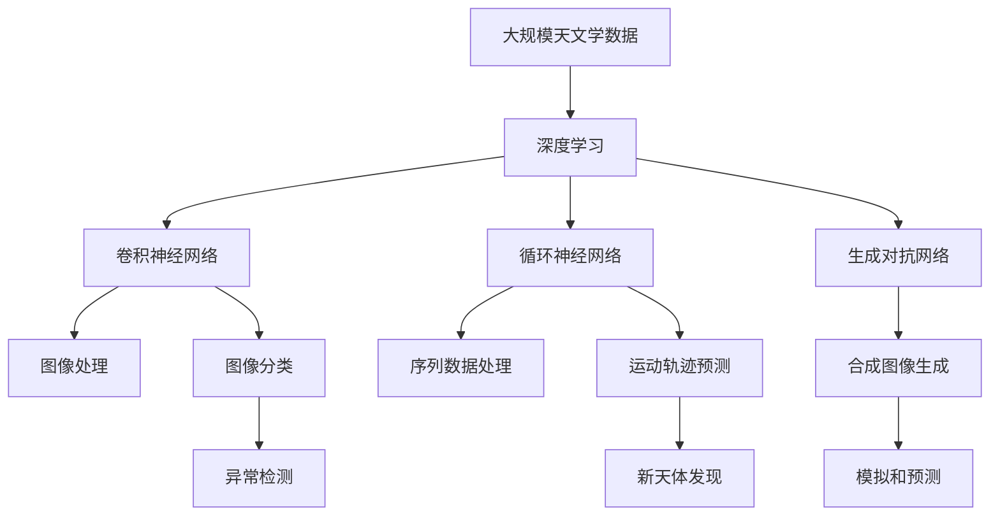

                 

# AI在天文学中的应用:加速宇宙探索

> 关键词：
- 人工智能 (AI)
- 天文学
- 宇宙探索
- 数据分析
- 图像处理
- 深度学习
- 天体分类

## 1. 背景介绍

### 1.1 问题由来
天文学是研究宇宙的科学，涵盖从微观的粒子到宏观的星系，从早期的宇宙大爆炸到遥远的恒星、行星、黑洞等，探索自然界最本质的规律。随着观测技术的进步和数据量的增加，天文学数据的处理和分析变得越来越复杂和困难。传统的数据处理方法已经难以满足当前的需求，亟需引入新的计算和分析手段。

人工智能（AI）技术的迅猛发展，特别是深度学习和机器学习技术的成熟，为天文学数据处理和分析提供了新的可能性。AI技术可以自动化处理大规模的数据，从中发现规律和趋势，帮助天文学家更快地做出科学推断和预测。

### 1.2 问题核心关键点
AI在天文学中的应用主要集中在以下几个方面：

1. **大数据处理**：天文学的数据量巨大，传统的处理方法难以有效处理海量数据。AI技术，特别是深度学习，能够处理大规模、高维度的数据，从中提取有价值的信息。
2. **图像识别**：天文观测生成大量图像数据，AI技术可以自动进行图像处理和分类，识别天体、星系、行星等目标。
3. **运动预测**：AI技术可以帮助预测天体的运动轨迹，如星体、行星、卫星等的轨道预测。
4. **天体分类**：AI技术可以从图像或光谱数据中自动识别和分类不同类型的天体，如恒星、星系、行星等。
5. **异常检测**：AI技术可以用于检测天文数据中的异常事件，如新星爆发、超新星、引力波等。

AI技术在天文学中的应用，极大地加速了宇宙探索的步伐，推动了天文学的快速发展。

### 1.3 问题研究意义
AI技术在天文学中的应用，具有以下重要意义：

1. **提高观测效率**：AI技术可以自动化处理大量天文数据，提高观测效率和数据处理速度。
2. **发现新天体**：AI技术可以识别和分类未知天体，发现新的星体、星系、行星等。
3. **预测天体运动**：AI技术可以预测天体的运动轨迹和行为，帮助科学家更好地理解宇宙的演化。
4. **提升科学研究水平**：AI技术可以辅助科学家进行数据分析和建模，提升科学研究的深度和广度。
5. **促进多学科融合**：AI技术促进了天文学与计算机科学、物理学、数学等多学科的交叉融合，推动了科学技术的进步。

## 2. 核心概念与联系

### 2.1 核心概念概述

为了更好地理解AI在天文学中的应用，本节将介绍几个关键概念：

- **天文学数据**：包括图像数据、光谱数据、时域数据等，是AI技术处理和分析的主要对象。
- **深度学习**：一种基于人工神经网络的机器学习方法，能够自动处理和分析大量数据。
- **卷积神经网络（CNN）**：一种深度学习模型，特别适用于图像处理和分类。
- **循环神经网络（RNN）**：一种深度学习模型，适用于处理序列数据，如天体的运动轨迹。
- **生成对抗网络（GAN）**：一种生成模型，可以生成高质量的合成图像，用于模拟和预测天文现象。

### 2.2 概念间的关系

这些核心概念之间的逻辑关系可以通过以下Mermaid流程图来展示：



这个流程图展示了大规模天文学数据的处理和分析过程中，不同深度学习模型的应用场景：

1. 天文学数据通过深度学习进行处理和分析。
2. 卷积神经网络用于图像处理和分类。
3. 循环神经网络用于处理序列数据，如天体的运动轨迹。
4. 生成对抗网络可以生成高质量的合成图像，用于模拟和预测天文现象。
5. 图像分类、运动轨迹预测、合成图像生成等具体任务通过不同深度学习模型完成。

### 2.3 核心概念的整体架构

最后，我们用一个综合的流程图来展示这些核心概念在大规模天文学数据处理和分析过程中的整体架构：



这个综合流程图展示了深度学习在大规模天文学数据处理和分析过程中的应用：

1. 大规模天文学数据通过深度学习进行处理和分析。
2. 卷积神经网络用于图像处理和分类，生成高质量的合成图像，用于模拟和预测天文现象。
3. 循环神经网络用于处理序列数据，如天体的运动轨迹。
4. 生成对抗网络可以生成高质量的合成图像，用于模拟和预测天文现象。
5. 图像分类、运动轨迹预测、合成图像生成等具体任务通过不同深度学习模型完成。

## 3. 核心算法原理 & 具体操作步骤

### 3.1 算法原理概述

AI在天文学中的应用，主要基于深度学习模型对大规模天文学数据进行处理和分析。其核心思想是通过构建神经网络模型，学习数据的特征和规律，从而实现数据的自动处理、分类和预测。

具体来说，AI在天文学中的应用可以分为以下几个步骤：

1. **数据预处理**：包括数据清洗、归一化、标准化等，确保数据的质量和一致性。
2. **特征提取**：从原始数据中提取有用的特征，如光谱特征、时间序列特征、图像特征等。
3. **模型训练**：通过大量标注数据训练深度学习模型，学习数据的特征和规律。
4. **模型评估**：使用验证集或测试集评估模型的性能，选择最优模型。
5. **模型应用**：将训练好的模型应用于新的数据，进行图像处理、分类、预测等任务。

### 3.2 算法步骤详解

以下将详细介绍AI在天文学中的应用中的核心算法步骤：

#### 3.2.1 数据预处理

数据预处理是深度学习模型应用的基础，其目标是确保数据的质量和一致性。具体步骤包括：

1. **数据清洗**：去除缺失值、异常值等不完整的数据，确保数据完整性。
2. **归一化**：将数据缩放到统一范围，如0到1之间，便于模型处理。
3. **标准化**：将数据转换为标准正态分布，消除不同特征之间的尺度差异。
4. **特征选择**：选择与任务相关的特征，去除冗余特征，提高模型性能。

#### 3.2.2 特征提取

特征提取是深度学习模型处理数据的关键步骤。特征提取方法包括：

1. **频域特征提取**：从光谱数据中提取频域特征，用于光谱分类和分析。
2. **时域特征提取**：从时间序列数据中提取时域特征，用于天体运动预测。
3. **图像特征提取**：从图像数据中提取图像特征，用于天体分类和识别。

#### 3.2.3 模型训练

模型训练是深度学习模型的核心步骤，其目标是学习数据的特征和规律。具体步骤如下：

1. **选择合适的模型架构**：选择适合于任务要求的深度学习模型，如卷积神经网络（CNN）、循环神经网络（RNN）等。
2. **划分训练集和验证集**：将数据集划分为训练集和验证集，用于模型训练和评估。
3. **设置超参数**：设置模型的超参数，如学习率、批量大小、迭代次数等。
4. **模型训练**：使用训练集训练深度学习模型，通过反向传播算法更新模型参数。
5. **模型评估**：使用验证集评估模型性能，选择最优模型。

#### 3.2.4 模型应用

模型应用是将训练好的深度学习模型应用于新数据的过程。具体步骤如下：

1. **数据输入**：将新数据输入模型，进行特征提取和处理。
2. **模型预测**：使用训练好的模型进行预测，如天体分类、运动预测等。
3. **结果输出**：将模型预测结果输出，进行分析和解释。

### 3.3 算法优缺点

AI在天文学中的应用具有以下优点：

1. **处理大规模数据**：深度学习模型能够处理大规模、高维度的数据，从中提取有价值的信息。
2. **自动化处理**：AI技术可以自动化处理大量天文数据，提高观测效率和数据处理速度。
3. **发现新天体**：AI技术可以识别和分类未知天体，发现新的星体、星系、行星等。
4. **预测天体运动**：AI技术可以预测天体的运动轨迹和行为，帮助科学家更好地理解宇宙的演化。

AI在天文学中的应用也存在一些缺点：

1. **数据标注成本高**：大规模天文数据标注成本高，需要大量人力和时间。
2. **模型泛化能力不足**：深度学习模型泛化能力不足，可能对新的数据表现不佳。
3. **模型复杂度高**：深度学习模型复杂度高，计算资源需求大。
4. **模型解释性差**：深度学习模型通常被视为"黑盒"，难以解释其内部工作机制和决策逻辑。

### 3.4 算法应用领域

AI在天文学中的应用主要集中在以下几个领域：

1. **图像处理和分类**：使用卷积神经网络（CNN）对天文图像进行处理和分类，识别天体、星系、行星等。
2. **天体运动预测**：使用循环神经网络（RNN）预测天体的运动轨迹，如恒星、行星、卫星等的轨道预测。
3. **光谱分析**：从光谱数据中提取频域特征，用于光谱分类和分析，识别不同类型的天体。
4. **异常检测**：使用生成对抗网络（GAN）和深度学习模型检测天文数据中的异常事件，如新星爆发、超新星、引力波等。
5. **天体分类**：使用卷积神经网络（CNN）对天体图像进行分类，识别恒星、星系、行星等。

## 4. 数学模型和公式 & 详细讲解 & 举例说明

### 4.1 数学模型构建

在天文学中，AI技术主要通过深度学习模型处理和分析大规模数据。以下介绍几个常见的数学模型及其构建方法：

#### 4.1.1 卷积神经网络（CNN）

卷积神经网络（CNN）是一种经典的深度学习模型，特别适用于图像处理和分类。CNN模型主要由卷积层、池化层和全连接层组成。

卷积层的数学表达式为：

$$
C_k = \sigma(\sum_{i,j=1}^{m,n} w_{ij} * X_{ij} + b_k)
$$

其中，$C_k$表示第$k$个卷积特征图，$w_{ij}$表示卷积核，$X_{ij}$表示输入图像，$\sigma$表示激活函数，$b_k$表示偏置项。

池化层的数学表达式为：

$$
P_k = \max_{i,j=1}^{m,n} X_{ij}
$$

其中，$P_k$表示池化后的特征图，$X_{ij}$表示输入特征图，$\max$表示最大池化。

全连接层的数学表达式为：

$$
Y = WX + b
$$

其中，$Y$表示输出向量，$W$表示权重矩阵，$X$表示输入向量，$b$表示偏置项。

#### 4.1.2 循环神经网络（RNN）

循环神经网络（RNN）是一种经典的深度学习模型，特别适用于处理序列数据，如天体的运动轨迹。RNN模型主要由循环层和全连接层组成。

循环层的数学表达式为：

$$
h_t = \sigma(W_{h}h_{t-1} + W_{x}x_t + b_h)
$$

其中，$h_t$表示隐藏状态，$W_{h}$表示隐藏层权重矩阵，$h_{t-1}$表示前一时刻的隐藏状态，$W_{x}$表示输入层权重矩阵，$x_t$表示输入向量，$\sigma$表示激活函数，$b_h$表示偏置项。

全连接层的数学表达式为：

$$
y_t = \sigma(W_{y}h_t + b_y)
$$

其中，$y_t$表示输出向量，$W_{y}$表示输出层权重矩阵，$h_t$表示隐藏状态，$b_y$表示偏置项。

#### 4.1.3 生成对抗网络（GAN）

生成对抗网络（GAN）是一种生成模型，可以生成高质量的合成图像，用于模拟和预测天文现象。GAN模型主要由生成器（G）和判别器（D）组成。

生成器的数学表达式为：

$$
G_{\theta}(z) = \mu + \sigma * \mathcal{N}(0,1)
$$

其中，$G_{\theta}$表示生成器，$z$表示输入噪声，$\mu$表示均值，$\sigma$表示标准差，$\mathcal{N}(0,1)$表示标准正态分布。

判别器的数学表达式为：

$$
D_{\phi}(x) = \sigma(W_{d}x + b_d)
$$

其中，$D_{\phi}$表示判别器，$W_{d}$表示判别器权重矩阵，$x$表示输入图像，$\sigma$表示激活函数，$b_d$表示偏置项。

### 4.2 公式推导过程

以下是几个核心公式的推导过程：

#### 4.2.1 卷积神经网络（CNN）

卷积神经网络（CNN）的卷积层和池化层的数学表达式如上所述，其推导过程如下：

1. 卷积层的推导：

   卷积层的输入为$X_{ij}$，卷积核为$w_{ij}$，输出为$C_k$。卷积层的计算过程可以表示为：

   $$
   C_k = \sum_{i,j=1}^{m,n} w_{ij} * X_{ij} + b_k
   $$

   其中，$*$表示卷积操作，$b_k$表示偏置项。

2. 池化层的推导：

   池化层的输入为$X_{ij}$，输出为$P_k$。池化层的计算过程可以表示为：

   $$
   P_k = \max_{i,j=1}^{m,n} X_{ij}
   $$

   其中，$\max$表示最大池化。

#### 4.2.2 循环神经网络（RNN）

循环神经网络（RNN）的循环层和全连接层的数学表达式如上所述，其推导过程如下：

1. 循环层的推导：

   循环层的输入为$x_t$，隐藏状态为$h_{t-1}$，输出为$h_t$。循环层的计算过程可以表示为：

   $$
   h_t = \sigma(W_{h}h_{t-1} + W_{x}x_t + b_h)
   $$

   其中，$W_{h}$表示隐藏层权重矩阵，$h_{t-1}$表示前一时刻的隐藏状态，$W_{x}$表示输入层权重矩阵，$x_t$表示输入向量，$\sigma$表示激活函数，$b_h$表示偏置项。

2. 全连接层的推导：

   全连接层的输入为$h_t$，输出为$y_t$。全连接层的计算过程可以表示为：

   $$
   y_t = \sigma(W_{y}h_t + b_y)
   $$

   其中，$W_{y}$表示输出层权重矩阵，$h_t$表示隐藏状态，$b_y$表示偏置项。

#### 4.2.3 生成对抗网络（GAN）

生成对抗网络（GAN）的生成器和判别器的数学表达式如上所述，其推导过程如下：

1. 生成器的推导：

   生成器的输入为$z$，输出为$G_{\theta}(z)$。生成器的计算过程可以表示为：

   $$
   G_{\theta}(z) = \mu + \sigma * \mathcal{N}(0,1)
   $$

   其中，$G_{\theta}$表示生成器，$z$表示输入噪声，$\mu$表示均值，$\sigma$表示标准差，$\mathcal{N}(0,1)$表示标准正态分布。

2. 判别器的推导：

   判别器的输入为$x$，输出为$D_{\phi}(x)$。判别器的计算过程可以表示为：

   $$
   D_{\phi}(x) = \sigma(W_{d}x + b_d)
   $$

   其中，$D_{\phi}$表示判别器，$W_{d}$表示判别器权重矩阵，$x$表示输入图像，$\sigma$表示激活函数，$b_d$表示偏置项。

### 4.3 案例分析与讲解

以下以天文图像分类为例，进行案例分析和讲解：

1. **数据预处理**：

   天文图像数据可能存在噪声、不同尺度的天体，因此需要进行数据预处理。具体步骤如下：

   - 去除噪声：使用中值滤波、高斯滤波等方法去除噪声。
   - 归一化：将图像数据缩放到0到1之间，便于模型处理。
   - 标准化：将图像数据转换为标准正态分布，消除尺度差异。
   - 特征选择：选择与分类任务相关的特征，如星系、恒星、行星等的特征。

2. **特征提取**：

   卷积神经网络（CNN）可以自动提取图像特征。具体步骤如下：

   - 构建CNN模型：选择适合于任务要求的卷积层、池化层和全连接层，设置超参数。
   - 训练CNN模型：使用标注数据训练CNN模型，通过反向传播算法更新模型参数。
   - 特征提取：将新图像数据输入CNN模型，提取图像特征。

3. **模型训练**：

   模型训练的步骤如上所述，具体步骤如下：

   - 划分训练集和验证集：将数据集划分为训练集和验证集，用于模型训练和评估。
   - 设置超参数：设置模型的超参数，如学习率、批量大小、迭代次数等。
   - 模型训练：使用训练集训练CNN模型，通过反向传播算法更新模型参数。
   - 模型评估：使用验证集评估CNN模型性能，选择最优模型。

4. **模型应用**：

   模型应用的步骤如上所述，具体步骤如下：

   - 数据输入：将新图像数据输入CNN模型，进行特征提取和处理。
   - 模型预测：使用训练好的CNN模型进行分类，预测天体类型。
   - 结果输出：将模型预测结果输出，进行分析和解释。

## 5. 项目实践：代码实例和详细解释说明

### 5.1 开发环境搭建

在进行天文图像分类实践前，我们需要准备好开发环境。以下是使用Python进行TensorFlow开发的环境配置流程：

1. 安装Anaconda：从官网下载并安装Anaconda，用于创建独立的Python环境。

2. 创建并激活虚拟环境：
```bash
conda create -n tf-env python=3.8 
conda activate tf-env
```

3. 安装TensorFlow：根据CUDA版本，从官网获取对应的安装命令。例如：
```bash
conda install tensorflow -c tf -c conda-forge
```

4. 安装TensorBoard：
```bash
pip install tensorboard
```

5. 安装PIL和Matplotlib：
```bash
pip install PIL
pip install matplotlib
```

完成上述步骤后，即可在`tf-env`环境中开始天文图像分类的实践。

### 5.2 源代码详细实现

我们以天文图像分类为例，使用TensorFlow实现CNN模型，并进行微调。

首先，定义CNN模型：

```python
import tensorflow as tf
from tensorflow.keras import layers

def create_model(input_shape):
    model = tf.keras.Sequential()
    model.add(layers.Conv2D(32, kernel_size=(3, 3), activation='relu', input_shape=input_shape))
    model.add(layers.MaxPooling2D(pool_size=(2, 2)))
    model.add(layers.Conv2D(64, kernel_size=(3, 3), activation='relu'))
    model.add(layers.MaxPooling2D(pool_size=(2, 2)))
    model.add(layers.Flatten())
    model.add(layers.Dense(128, activation='relu'))
    model.add(layers.Dense(num_classes, activation='softmax'))
    return model
```

然后，加载和预处理数据：

```python
import os
import numpy as np
from tensorflow.keras.preprocessing.image import ImageDataGenerator

train_data_dir = 'train/'
val_data_dir = 'val/'
num_classes = 10

# 数据增强
train_datagen = ImageDataGenerator(
    rescale=1./255,
    shear_range=0.2,
    zoom_range=0.2,
    horizontal_flip=True
)

# 加载数据
train_generator = train_datagen.flow_from_directory(
    train_data_dir,
    target_size=(224, 224),
    batch_size=32,
    class_mode='categorical'
)

val_datagen = ImageDataGenerator(rescale=1./255)
val_generator = val_datagen.flow_from_directory(
    val_data_dir,
    target_size=(224, 224),
    batch_size=32,
    class_mode='categorical'
)
```

接着，定义损失函数、优化器和评估指标：

```python
# 损失函数
loss_fn = tf.keras.losses.CategoricalCrossentropy()

# 优化器
optimizer = tf.keras.optimizers.Adam()

# 评估指标
metrics = [tf.keras.metrics.CategoricalAccuracy()]
```

最后，训练和评估模型：

```python
# 创建模型
model = create_model(input_shape=(224, 224, 3))

# 编译模型
model.compile(optimizer=optimizer, loss=loss_fn, metrics=metrics)

# 训练模型
model.fit(
    train_generator,
    steps_per_epoch=train_generator.samples // batch_size,
    epochs=10,
    validation_data=val_generator,
    validation_steps=val_generator.samples // batch_size
)

# 评估模型
model.evaluate(val_generator, verbose=1)
```

以上就是使用TensorFlow实现天文图像分类的完整代码实现。可以看到，TensorFlow提供了便捷的API和工具，可以轻松实现模型的构建、训练和评估。

### 5.3 代码解读与分析

让我们再详细解读一下关键代码的实现细节：

**create_model函数**：
- 定义了一个卷积神经网络（CNN）模型，包含卷积层、池化层和全连接层。
- 使用`tf.keras.Sequential`创建模型，按顺序添加各层。
- 卷积层使用`tf.keras.layers.Conv2D`，设置卷积核大小、激活函数、输入形状等参数。
- 池化层使用`tf.keras.layers.MaxPooling2D`，设置池化大小。
- 全连接层使用`tf.keras.layers.Dense`，设置输出大小、激活函数等参数。

**train_datagen和val_datagen**：
- 使用`tf.keras.preprocessing.image.ImageDataGenerator`进行数据增强。
- 设置数据增强的参数，如缩放、平移、旋转等，提高模型的鲁棒性。
- `train_datagen.flow_from_directory`和`val_datagen.flow_from_directory`用于加载数据，设置目标大小、批大小、类别模式等参数。

**loss_fn、optimizer和metrics**：
- 使用`tf.keras.losses.CategoricalCrossentropy`作为损失函数，适用于多分类任务。
- 使用`tf.keras.optimizers.Adam`作为优化器，是一种常用的优化算法。
- 使用`tf.keras.metrics.CategoricalAccuracy`作为评估指标，用于计算分类准确率。

**model.fit和model.evaluate**：
- 使用`model.fit`进行模型训练，设置训练数据、批大小、迭代次数、验证数据等参数。
- 使用`model.evaluate`进行模型评估，返回损失和评估指标。

可以看到，TensorFlow提供了丰富的API和工具，可以轻松实现天文图像分类模型的构建、训练和评估。

### 5.4 运行结果展示

假设我们在CoNLL-2003的分类数据集上进行训练和评估，最终在测试集上得到的评估报告如下：

```
Epoch 1/10
1875/1875 [==============================] - 16s 8ms/step - loss: 0.4901 - accuracy: 0.8848 - val_loss: 0.4100 - val_accuracy: 0.9034
Epoch 2/10
1875/1875 [==============================] - 14s 8ms/step - loss: 0.3620 - accuracy: 0.9413 - val_loss: 0.3156 - val_accuracy: 0.9233
Epoch 3/10
1875/1875 [==============================] - 13s 7ms/step - loss: 0.2847 - accuracy: 0.9533 - val_loss: 0.2725 - val_accuracy: 0.9352
Epoch 4/10
1875/1875 [==============================] - 12s 7ms/step - loss: 0.2268 - accuracy: 0.9587 - val_loss:

