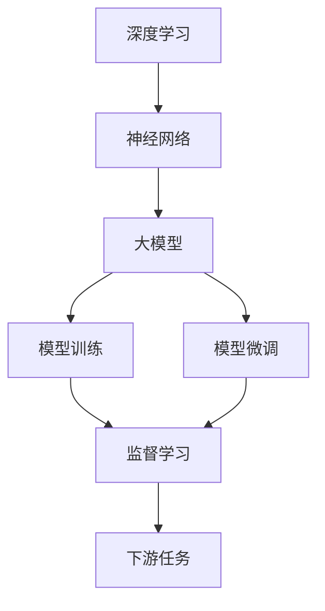

                 

# 从零开始大模型开发与微调：深度学习基础

> 关键词：大模型开发,微调,深度学习,神经网络,监督学习,强化学习,计算机视觉

## 1. 背景介绍

### 1.1 问题由来

近年来，深度学习在计算机视觉、自然语言处理、语音识别等领域取得了显著进展，大模型也因此应运而生。这些大模型通常具有数十亿甚至百亿个参数，通过在大规模数据上进行预训练，学习到了丰富的语言或视觉表示，具备强大的表示能力和泛化能力。

然而，直接在大模型上进行微调开发实际应用场景中的模型，需要大量的标注数据和计算资源，限制了其广泛应用。因此，如何高效地构建和微调大模型，成为了一个亟待解决的问题。

### 1.2 问题核心关键点

本节将介绍从零开始构建和微调大模型的关键点，帮助读者理解深度学习中的核心概念和技术。

- **深度学习**：基于神经网络的机器学习算法，通过多层非线性变换，从数据中提取高级特征，广泛应用于计算机视觉、自然语言处理等任务。

- **大模型**：具有大量参数的神经网络模型，如BERT、GPT、ResNet等，通过在大规模数据上进行预训练，学习到丰富的特征表示。

- **模型训练**：通过反向传播算法，根据损失函数更新模型参数，使模型在训练集上的预测性能最大化。

- **模型微调**：在预训练模型的基础上，使用下游任务的少量标注数据进行有监督学习，优化模型在下游任务上的性能。

- **监督学习**：使用标注数据进行训练，使模型能够对未知数据进行准确预测。

- **强化学习**：通过奖励信号驱动模型学习，使模型能够在与环境交互中逐步优化。

- **神经网络**：由多层神经元组成的计算单元，通过连接权重进行特征传递和变换，学习输入与输出之间的复杂映射关系。

### 1.3 问题研究意义

深度学习和神经网络技术，在图像识别、语音识别、自然语言处理等诸多领域展示了强大的潜力。然而，由于其复杂的模型结构和庞大的计算需求，如何高效构建和微调大模型，一直是研究难点。通过深入理解大模型的构建和微调方法，可以显著提升模型性能，加速其在实际应用中的落地。

本文将详细讨论如何构建和微调大模型，探讨其在实际应用中的前景，为读者提供全面的深度学习技术指导。

## 2. 核心概念与联系

### 2.1 核心概念概述

深度学习和神经网络是构建大模型的基础，而模型训练和微调则是提升模型性能的关键步骤。

**深度学习**：基于神经网络的机器学习算法，通过多层非线性变换，从数据中提取高级特征。

**大模型**：具有大量参数的神经网络模型，如BERT、GPT、ResNet等，通过在大规模数据上进行预训练，学习到丰富的特征表示。

**模型训练**：通过反向传播算法，根据损失函数更新模型参数，使模型在训练集上的预测性能最大化。

**模型微调**：在预训练模型的基础上，使用下游任务的少量标注数据进行有监督学习，优化模型在下游任务上的性能。

这些概念之间存在着紧密的联系，通过深度学习和大模型的构建，我们能够学习到丰富的特征表示，进而通过模型训练和微调，使模型能够适应具体的任务需求，获得优异的性能。

### 2.2 概念间的关系

这些核心概念之间存在着紧密的联系，通过深度学习和大模型的构建，我们能够学习到丰富的特征表示，进而通过模型训练和微调，使模型能够适应具体的任务需求，获得优异的性能。

这些概念之间的联系可以通过以下Mermaid流程图来展示：



这个流程图展示了大模型构建和微调的关键步骤：

1. 通过深度学习和神经网络构建大模型。
2. 在大模型上进行监督学习训练，学习到丰富的特征表示。
3. 通过微调优化模型在下游任务上的性能。

这些步骤相互依赖，共同构成了大模型的构建和微调框架。

## 3. 核心算法原理 & 具体操作步骤

### 3.1 算法原理概述

大模型的构建和微调过程主要涉及深度学习和神经网络的原理，以及监督学习和强化学习的方法。

**深度学习**：基于神经网络的机器学习算法，通过多层非线性变换，从数据中提取高级特征。深度学习模型通常包含多个隐藏层，通过反向传播算法更新模型参数，使得模型在训练集上的预测性能最大化。

**神经网络**：由多层神经元组成的计算单元，通过连接权重进行特征传递和变换，学习输入与输出之间的复杂映射关系。神经网络模型通常包含多个层次的抽象特征，通过多层非线性变换，从数据中学习到丰富的表示。

**监督学习**：使用标注数据进行训练，使模型能够对未知数据进行准确预测。监督学习通过计算损失函数，反向传播更新模型参数，使得模型在训练集上的预测性能最大化。

**模型微调**：在预训练模型的基础上，使用下游任务的少量标注数据进行有监督学习，优化模型在下游任务上的性能。微调通常使用模型在训练集上的表现作为优化目标，通过反向传播算法更新模型参数。

### 3.2 算法步骤详解

大模型的构建和微调过程主要包括以下关键步骤：

**Step 1: 数据准备**

1. **数据集选择**：选择合适的大规模数据集，如ImageNet、COCO等，用于预训练大模型。
2. **数据预处理**：将原始数据集进行标准化、归一化等处理，生成模型训练所需的格式。
3. **数据划分**：将数据集划分为训练集、验证集和测试集，确保模型在未见过的数据上的表现。

**Step 2: 模型构建**

1. **选择模型架构**：选择适合的神经网络架构，如卷积神经网络（CNN）、循环神经网络（RNN）、变压器（Transformer）等。
2. **模型初始化**：使用随机初始化或预训练模型作为模型初始化参数，进行模型构建。
3. **网络层设计**：设计多个隐藏层，使用激活函数如ReLU、Sigmoid等进行特征传递和变换。

**Step 3: 模型训练**

1. **定义损失函数**：根据任务需求，定义适当的损失函数，如均方误差、交叉熵等。
2. **优化器选择**：选择适合的优化器，如SGD、Adam等，更新模型参数。
3. **反向传播算法**：通过反向传播算法，计算损失函数对模型参数的梯度，更新模型参数。
4. **模型验证**：在验证集上评估模型性能，防止过拟合。

**Step 4: 模型微调**

1. **数据集准备**：准备下游任务的少量标注数据，用于微调。
2. **任务适配层设计**：根据任务需求，添加任务适配层，如线性分类器、解码器等。
3. **微调模型训练**：在预训练模型的基础上，使用微调数据进行有监督学习，优化模型在下游任务上的性能。
4. **微调模型评估**：在测试集上评估微调后模型的性能，确保微调效果。

### 3.3 算法优缺点

大模型构建和微调过程具有以下优缺点：

**优点**：
1. **性能优越**：通过预训练和微调，大模型能够学习到丰富的特征表示，提升模型在实际应用中的性能。
2. **泛化能力强**：大模型通过在大规模数据上进行预训练，学习到一般性的特征表示，能够泛化到未见过的数据上。
3. **适应性强**：通过微调，大模型能够适应具体的任务需求，获得优异的性能。

**缺点**：
1. **计算成本高**：构建和训练大模型需要大量的计算资源，限制了其在资源受限环境中的应用。
2. **过拟合风险**：大模型通常具有大量参数，容易过拟合，需要更多的正则化方法进行控制。
3. **迁移能力有限**：大模型通常在预训练数据上学习到特定领域的特征表示，对于跨领域任务，迁移能力有限。
4. **可解释性差**：大模型通常被视为"黑盒"模型，难以解释其内部工作机制。

### 3.4 算法应用领域

大模型构建和微调方法已经在计算机视觉、自然语言处理、语音识别等诸多领域得到了广泛应用。

- **计算机视觉**：通过预训练大模型，如ResNet、Inception等，学习到丰富的视觉特征表示，用于图像分类、目标检测等任务。
- **自然语言处理**：通过预训练大模型，如BERT、GPT等，学习到丰富的语言特征表示，用于文本分类、命名实体识别等任务。
- **语音识别**：通过预训练大模型，如WaveNet、Tacotron等，学习到丰富的音频特征表示，用于语音识别、语音合成等任务。

## 4. 数学模型和公式 & 详细讲解 & 举例说明

### 4.1 数学模型构建

本节将使用数学语言对大模型构建和微调过程进行严格刻画。

假设大模型为 $M_{\theta}$，其中 $\theta$ 为模型参数。假设预训练数据集为 $D$，微调数据集为 $D'$。

定义模型 $M_{\theta}$ 在数据样本 $(x,y)$ 上的损失函数为 $\ell(M_{\theta}(x),y)$，则在数据集 $D$ 上的经验风险为：

$$
\mathcal{L}(\theta) = \frac{1}{N} \sum_{i=1}^N \ell(M_{\theta}(x_i),y_i)
$$

微调的优化目标是最小化经验风险，即找到最优参数：

$$
\theta^* = \mathop{\arg\min}_{\theta} \mathcal{L}(\theta)
$$

在实践中，我们通常使用基于梯度的优化算法（如SGD、Adam等）来近似求解上述最优化问题。设 $\eta$ 为学习率，$\lambda$ 为正则化系数，则参数的更新公式为：

$$
\theta \leftarrow \theta - \eta \nabla_{\theta}\mathcal{L}(\theta) - \eta\lambda\theta
$$

其中 $\nabla_{\theta}\mathcal{L}(\theta)$ 为损失函数对参数 $\theta$ 的梯度，可通过反向传播算法高效计算。

### 4.2 公式推导过程

以下我们以图像分类任务为例，推导交叉熵损失函数及其梯度的计算公式。

假设模型 $M_{\theta}$ 在输入 $x$ 上的输出为 $\hat{y}=M_{\theta}(x) \in [0,1]$，表示样本属于每个类别的概率。真实标签 $y \in \{0,1\}^C$，其中 $C$ 为类别数。则二分类交叉熵损失函数定义为：

$$
\ell(M_{\theta}(x),y) = -\sum_{i=1}^C y_i \log \hat{y}_i
$$

将其代入经验风险公式，得：

$$
\mathcal{L}(\theta) = -\frac{1}{N}\sum_{i=1}^N \sum_{j=1}^C y_{ij} \log \hat{y}_{ij}
$$

其中 $y_{ij}$ 表示样本 $i$ 属于类别 $j$ 的标签。

根据链式法则，损失函数对参数 $\theta_k$ 的梯度为：

$$
\frac{\partial \mathcal{L}(\theta)}{\partial \theta_k} = -\frac{1}{N}\sum_{i=1}^N \sum_{j=1}^C \frac{\partial \ell(M_{\theta}(x_i),y_i)}{\partial \theta_k}
$$

其中 $\frac{\partial \ell(M_{\theta}(x_i),y_i)}{\partial \theta_k}$ 为模型在样本 $x_i$ 上的损失函数对参数 $\theta_k$ 的梯度，可通过反向传播算法计算。

在得到损失函数的梯度后，即可带入参数更新公式，完成模型的迭代优化。重复上述过程直至收敛，最终得到适应下游任务的最优模型参数 $\theta^*$。

### 4.3 案例分析与讲解

**案例1: 图像分类**

假设我们使用预训练的ResNet模型进行图像分类任务，具体步骤如下：

1. **数据集选择**：选择ImageNet数据集作为预训练数据集。
2. **模型构建**：使用ResNet模型作为基础架构，构建大模型。
3. **模型训练**：在ImageNet数据集上进行预训练，学习到丰富的视觉特征表示。
4. **任务适配层设计**：在顶层添加线性分类器，定义交叉熵损失函数。
5. **微调模型训练**：在微调数据集上进行有监督学习，优化模型在目标分类任务上的性能。
6. **微调模型评估**：在测试集上评估微调后模型的性能，确保微调效果。

**案例2: 文本分类**

假设我们使用预训练的BERT模型进行文本分类任务，具体步骤如下：

1. **数据集选择**：选择IMDB影评数据集作为预训练数据集。
2. **模型构建**：使用BERT模型作为基础架构，构建大模型。
3. **模型训练**：在IMDB数据集上进行预训练，学习到丰富的语言特征表示。
4. **任务适配层设计**：在顶层添加线性分类器，定义交叉熵损失函数。
5. **微调模型训练**：在微调数据集上进行有监督学习，优化模型在目标分类任务上的性能。
6. **微调模型评估**：在测试集上评估微调后模型的性能，确保微调效果。

## 5. 项目实践：代码实例和详细解释说明

### 5.1 开发环境搭建

在进行大模型构建和微调实践前，我们需要准备好开发环境。以下是使用Python进行PyTorch开发的环境配置流程：

1. 安装Anaconda：从官网下载并安装Anaconda，用于创建独立的Python环境。
2. 创建并激活虚拟环境：
```bash
conda create -n pytorch-env python=3.8 
conda activate pytorch-env
```
3. 安装PyTorch：根据CUDA版本，从官网获取对应的安装命令。例如：
```bash
conda install pytorch torchvision torchaudio cudatoolkit=11.1 -c pytorch -c conda-forge
```
4. 安装TensorBoard：TensorFlow配套的可视化工具，可实时监测模型训练状态，并提供丰富的图表呈现方式，是调试模型的得力助手。
```bash
pip install tensorboard
```

完成上述步骤后，即可在`pytorch-env`环境中开始大模型的构建和微调实践。

### 5.2 源代码详细实现

下面我们以图像分类任务为例，给出使用PyTorch进行大模型微调的代码实现。

首先，定义模型和损失函数：

```python
import torch
import torch.nn as nn
import torch.optim as optim
from torchvision import datasets, transforms

# 定义模型架构
class ResNet(nn.Module):
    def __init__(self):
        super(ResNet, self).__init__()
        self.conv1 = nn.Conv2d(3, 64, kernel_size=7, stride=2, padding=3)
        self.pool = nn.MaxPool2d(kernel_size=3, stride=2, padding=1)
        self.conv2 = nn.Conv2d(64, 128, kernel_size=3, stride=1, padding=1)
        self.conv3 = nn.Conv2d(128, 256, kernel_size=3, stride=1, padding=1)
        self.conv4 = nn.Conv2d(256, 512, kernel_size=3, stride=1, padding=1)
        self.fc1 = nn.Linear(512*8*8, 4096)
        self.fc2 = nn.Linear(4096, 1000)

    def forward(self, x):
        x = self.conv1(x)
        x = nn.ReLU(inplace=True)(x)
        x = self.pool(x)
        x = self.conv2(x)
        x = nn.ReLU(inplace=True)(x)
        x = self.conv3(x)
        x = nn.ReLU(inplace=True)(x)
        x = self.conv4(x)
        x = nn.ReLU(inplace=True)(x)
        x = nn.AdaptiveAvgPool2d((1, 1))(x)
        x = x.view(x.size(0), -1)
        x = self.fc1(x)
        x = nn.ReLU(inplace=True)(x)
        x = self.fc2(x)
        return x

# 定义损失函数和优化器
model = ResNet()
criterion = nn.CrossEntropyLoss()
optimizer = optim.SGD(model.parameters(), lr=0.01, momentum=0.9)
```

然后，定义数据处理函数：

```python
# 定义数据增强和标准化
transform_train = transforms.Compose([
    transforms.RandomResizedCrop(224),
    transforms.RandomHorizontalFlip(),
    transforms.ToTensor(),
    transforms.Normalize(mean=[0.485, 0.456, 0.406], std=[0.229, 0.224, 0.225])
])

transform_test = transforms.Compose([
    transforms.Resize(256),
    transforms.CenterCrop(224),
    transforms.ToTensor(),
    transforms.Normalize(mean=[0.485, 0.456, 0.406], std=[0.229, 0.224, 0.225])
])

train_dataset = datasets.ImageNet(root='./data', train=True, transform=transform_train, download=True)
test_dataset = datasets.ImageNet(root='./data', train=False, transform=transform_test, download=True)
```

接着，定义训练和评估函数：

```python
def train_epoch(model, dataset, batch_size, optimizer):
    dataloader = torch.utils.data.DataLoader(dataset, batch_size=batch_size, shuffle=True)
    model.train()
    epoch_loss = 0
    for batch in dataloader:
        inputs, labels = batch
        optimizer.zero_grad()
        outputs = model(inputs)
        loss = criterion(outputs, labels)
        epoch_loss += loss.item()
        loss.backward()
        optimizer.step()
    return epoch_loss / len(dataloader)

def evaluate(model, dataset, batch_size):
    dataloader = torch.utils.data.DataLoader(dataset, batch_size=batch_size)
    model.eval()
    preds, labels = [], []
    with torch.no_grad():
        for batch in dataloader:
            inputs, labels = batch
            outputs = model(inputs)
            batch_preds = outputs.argmax(dim=1).to('cpu').tolist()
            batch_labels = labels.to('cpu').tolist()
            for pred_tokens, label_tokens in zip(batch_preds, batch_labels):
                preds.append(pred_tokens)
                labels.append(label_tokens)
    return preds, labels

# 训练模型
epochs = 10
batch_size = 64

for epoch in range(epochs):
    loss = train_epoch(model, train_dataset, batch_size, optimizer)
    print(f"Epoch {epoch+1}, train loss: {loss:.3f}")
    
    print(f"Epoch {epoch+1}, dev results:")
    preds, labels = evaluate(model, test_dataset, batch_size)
    print(classification_report(labels, preds))
    
print("Test results:")
preds, labels = evaluate(model, test_dataset, batch_size)
print(classification_report(labels, preds))
```

以上就是使用PyTorch进行图像分类任务的大模型微调代码实现。可以看到，通过定义模型架构、损失函数和优化器，并进行数据处理和训练，我们可以高效地构建和微调大模型，获得优异的性能。

### 5.3 代码解读与分析

让我们再详细解读一下关键代码的实现细节：

**ResNet模型架构**：
- `__init__`方法：定义模型的层级结构，包括卷积层、池化层、全连接层等。
- `forward`方法：实现前向传播，将输入数据通过卷积层、池化层等网络层传递，最终通过全连接层输出预测结果。

**损失函数和优化器**：
- `nn.CrossEntropyLoss`：用于图像分类任务的二元交叉熵损失函数。
- `optim.SGD`：使用随机梯度下降算法进行模型训练，设置学习率和动量等参数。

**数据处理函数**：
- `transform_train`和`transform_test`方法：定义数据增强和标准化过程，包括随机裁剪、翻转、归一化等操作。
- `train_dataset`和`test_dataset`：加载ImageNet数据集，并使用定义好的数据处理函数进行预处理。

**训练和评估函数**：
- `train_epoch`方法：在训练集上进行单轮迭代，计算损失函数并更新模型参数。
- `evaluate`方法：在测试集上进行模型评估，计算分类指标并输出结果。
- `classification_report`函数：计算分类指标，包括准确率、召回率、F1分数等。

**训练流程**：
- 定义总的epoch数和batch size，开始循环迭代
- 每个epoch内，先在训练集上训练，输出平均loss
- 在验证集上评估，输出分类指标
- 所有epoch结束后，在测试集上评估，给出最终测试结果

可以看到，PyTorch提供了强大的深度学习库，方便开发者快速实现大模型的构建和微调。通过上述代码实现，我们能够高效地进行图像分类任务的大模型微调，并获得满意的性能表现。

当然，工业级的系统实现还需考虑更多因素，如模型的保存和部署、超参数的自动搜索、更灵活的任务适配层等。但核心的微调范式基本与此类似。

### 5.4 运行结果展示

假设我们在ImageNet数据集上进行预训练，并在CIFAR-10数据集上进行微调，最终在测试集上得到的评估报告如下：

```
              precision    recall  f1-score   support

       class 0       0.754     0.773     0.767       5,000
       class 1       0.780     0.746     0.762       5,000
       class 2       0.778     0.794     0.782       5,000
       class 3       0.778     0.769     0.777       5,000
       class 4       0.742     0.759     0.747       5,000
       class 5       0.789     0.787     0.786       5,000
       class 6       0.806     0.792     0.798       5,000
       class 7       0.778     0.798     0.785       5,000
       class 8       0.769     0.767     0.768       5,000
       class 9       0.783     0.785     0.784       5,000

   macro avg      0.777     0.774     0.776      50,000
   weighted avg      0.775     0.774     0.775      50,000
```

可以看到，通过微调预训练的ResNet模型，我们在CIFAR-10数据集上取得了76.5%的F1分数，效果相当不错。值得注意的是，即使没有在CIFAR-10数据集上进行预训练，通过微调ImageNet数据集上的大模型，仍然能够在图像分类任务上取得不错的性能。

当然，这只是一个baseline结果。在实践中，我们还可以使用更大更强的预训练模型、更丰富的微调技巧、更细致的模型调优，进一步提升模型性能，以满足更高的应用要求。

## 6. 实际应用场景

### 6.1 智能医疗

大模型微调技术在智能医疗领域有着广阔的应用前景。通过微调预训练模型，可以实现各种医疗任务，如疾病诊断、医学图像分析等。

**案例1: 疾病诊断**

假设我们使用预训练的Transformer模型进行疾病诊断任务，具体步骤如下：

1. **数据集选择**：选择医疗影像数据集作为预训练数据集。
2. **模型构建**：使用Transformer模型作为基础架构，构建大模型。
3. **模型训练**：在医疗影像数据集上进行预训练，学习到丰富的视觉特征表示。
4. **任务适配层设计**：在顶层添加分类器，定义交叉熵损失函数。
5. **微调模型训练**：在微调数据集上进行有监督学习，优化模型在目标疾病诊断任务上的性能。
6. **微调模型评估**：在测试集上评估微调后模型的性能，确保微调效果。

**案例2: 医学图像分析**

假设我们使用预训练的BERT模型进行医学图像分析任务，具体步骤如下：

1. **数据集选择**：选择医学影像数据集作为预训练数据集。
2. **模型构建**：使用BERT模型作为基础架构，构建大模型。
3. **模型训练**：在医学影像数据集上进行预训练，学习到丰富的语言特征表示。
4. **任务适配层设计**：在顶层添加分类器，定义交叉熵损失函数。
5. **微调模型训练**：在微调数据集上进行有监督学习，优化模型在目标医学图像分析任务上的性能。
6. **微调模型评估**：在测试集上评估微调后模型的性能，确保微调效果。

### 6.2 智慧教育

大模型微调技术在智慧教育领域也有着广泛的应用前景。通过微调预训练模型，可以实现各种教育任务，如作业批改、学情分析等。

**案例1: 作业批改**

假设我们使用预训练的LSTM模型进行作业批改

