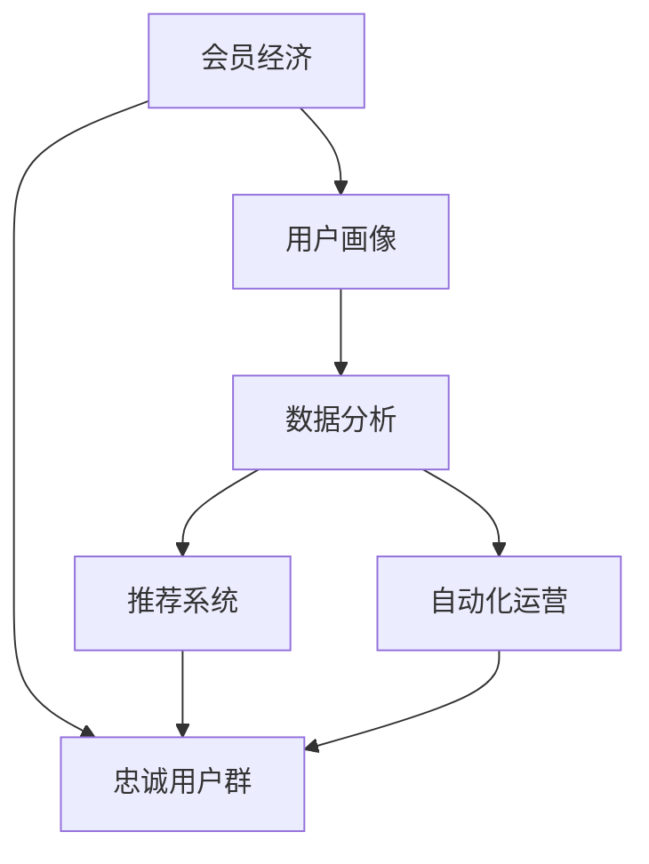
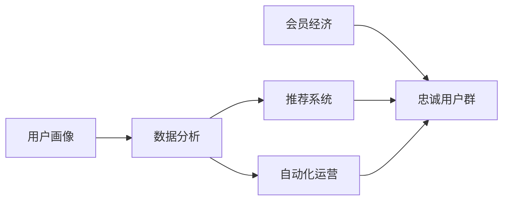

                 

# 会员经济创业：构建忠诚用户群的策略

在数字化时代，互联网公司正在利用会员经济这一商业模式，通过建立忠诚用户群来增加收入和提升品牌影响力。本篇文章将探讨如何构建一个成功的会员经济创业，重点关注如何利用技术和数据分析策略来吸引和保持忠诚用户。

## 1. 背景介绍

### 1.1 问题由来

会员经济模式在电子商务、订阅服务、SaaS、游戏等行业已经证明了其强大的商业潜力。如亚马逊的Prime会员服务、Netflix的订阅模式、Spotify的付费会员、Slack的企业版服务等，都通过提供优质的会员体验和专属权益，形成了稳定的用户群体。

成功的会员经济创业依赖于对用户行为和偏好的深入理解，从而提供个性化的服务。例如，亚马逊使用大数据分析会员购物习惯，精准推荐商品；Netflix通过分析用户观看行为，推荐个性化影片。这些技术在构建忠诚用户群中起到了关键作用。

### 1.2 问题核心关键点

构建忠诚用户群的关键点在于：
- 精准定位目标用户群体。通过大数据分析了解目标用户的兴趣和需求。
- 提供差异化会员权益。设计符合用户期望的专属服务，增强会员粘性。
- 持续优化用户体验。利用用户反馈和数据分析，不断提升服务质量。
- 形成闭环营销。通过会员推荐、积分系统、忠诚度奖励等措施，促进口碑传播和二次消费。
- 自动化运营管理。通过技术手段降低运营成本，提高会员服务效率。

### 1.3 问题研究意义

构建忠诚用户群对于互联网公司的商业成功至关重要。成功的会员经济创业可以提升用户留存率、增加收入、积累品牌资产、加速业务增长。深入研究会员经济构建策略，可以帮助更多创业企业实现成功。

## 2. 核心概念与联系

### 2.1 核心概念概述

- 会员经济（Membership Economy）：利用会员费、订阅费等方式，通过提供专属服务、优惠价格、优质内容等，吸引和保持用户的一种商业模式。
- 忠诚用户群（Loyal Customer Base）：对企业产品或服务有高忠诚度的用户群体，能够在品牌推广、口碑传播、重复消费等方面带来巨大价值。
- 用户画像（User Persona）：根据用户行为、心理和背景信息构建的理想化用户模型，用于指导产品设计和市场推广。
- 数据分析（Data Analytics）：通过分析用户数据，挖掘用户行为、偏好、需求等，为个性化服务和精准营销提供支持。
- 推荐系统（Recommendation System）：利用算法为用户推荐个性化商品或内容，提升用户体验和满意度。
- 自动化运营（Automated Operations）：利用技术手段实现运营流程的自动化，提高效率和降低成本。

这些概念相互关联，共同构成了构建忠诚用户群的核心框架。

### 2.2 概念间的关系

通过Mermaid流程图展示这些概念的相互关系：



### 2.3 核心概念的整体架构

最终构成了如下的架构图：



## 3. 核心算法原理 & 具体操作步骤

### 3.1 算法原理概述

构建忠诚用户群的核心算法原理在于数据分析、个性化推荐和自动化运营，具体步骤包括：

1. 数据收集：收集用户行为数据，包括点击、购买、搜索等行为。
2. 用户画像构建：通过数据分析挖掘用户的基本特征和行为模式。
3. 推荐系统训练：利用机器学习算法训练推荐模型，根据用户画像和行为数据，生成个性化推荐。
4. 运营优化：通过自动化工具和系统，实现会员管理、订单处理、客户服务等运营流程的自动化。
5. 用户反馈分析：收集用户反馈数据，用于改进产品和服务。

### 3.2 算法步骤详解

构建忠诚用户群的算法步骤如下：

#### 3.2.1 数据收集

数据收集是构建忠诚用户群的基础。需要收集各种数据：

1. **行为数据**：用户在网站或应用上的点击、浏览、购买、搜索等行为数据。
2. **互动数据**：用户与客服、社区的交流记录和反馈信息。
3. **社交数据**：用户在社交平台上的活动数据。
4. **时间戳数据**：行为数据的时间戳信息，用于分析用户行为模式。

#### 3.2.2 用户画像构建

用户画像基于数据分析，构建理想化的用户模型：

1. **人口统计信息**：年龄、性别、地理位置等基本信息。
2. **行为特征**：浏览偏好、购买历史、搜索关键词等行为特征。
3. **心理特征**：兴趣、价值观、生活方式等心理特征。
4. **忠诚度指标**：会员活跃度、重复消费率、投诉率等忠诚度指标。

#### 3.2.3 推荐系统训练

推荐系统利用用户画像和行为数据，生成个性化推荐：

1. **特征工程**：提取和构造用户特征，包括基本信息、行为数据、互动数据等。
2. **模型选择**：选择适合的推荐算法，如协同过滤、内容推荐、混合推荐等。
3. **模型训练**：利用历史数据训练推荐模型，优化推荐算法参数。
4. **推荐输出**：将训练好的模型应用于新用户，生成个性化推荐。

#### 3.2.4 运营优化

自动化运营手段包括：

1. **会员管理系统**：建立会员管理系统，维护会员信息、管理会员权益。
2. **订单处理系统**：自动化订单处理流程，提高处理效率。
3. **客户服务系统**：通过智能客服、在线支持等方式，提升用户体验。

#### 3.2.5 用户反馈分析

用户反馈数据用于改进产品和服务：

1. **反馈收集**：通过问卷调查、用户评价、在线客服等方式，收集用户反馈。
2. **情感分析**：分析用户反馈的情感倾向，评估服务质量。
3. **改进措施**：根据用户反馈数据，制定改进措施，优化产品和服务。

### 3.3 算法优缺点

基于数据分析和推荐系统的忠诚用户群构建方法，具有以下优点：

1. **个性化服务**：通过用户画像和推荐系统，提供个性化服务，提升用户体验。
2. **精准营销**：利用用户行为数据分析，精准定位用户，提升营销效果。
3. **高效运营**：通过自动化运营手段，降低运营成本，提高服务效率。
4. **忠诚度提升**：个性化服务、专属权益、自动化运营等措施，增强用户粘性。

但该方法也存在以下缺点：

1. **数据隐私**：收集和分析用户数据可能引发隐私问题。
2. **算法偏差**：推荐算法可能存在算法偏见，影响推荐结果。
3. **成本较高**：初始数据收集和系统建设的成本较高。
4. **用户接受度**：个性化推荐和自动化运营可能引起部分用户反感。

### 3.4 算法应用领域

基于数据分析和推荐系统的忠诚用户群构建方法，适用于以下领域：

1. **电子商务**：利用推荐系统提升商品推荐效果，提高用户购买率。
2. **订阅服务**：如音乐、视频、游戏等，通过个性化服务增加用户订阅率。
3. **SaaS软件**：利用数据分析和自动化运营，提高客户满意度和续订率。
4. **在线教育**：通过推荐系统和个性化学习路径，提升用户学习效果。
5. **社区平台**：通过自动化运营和用户画像分析，提升社区活跃度和用户粘性。

## 4. 数学模型和公式 & 详细讲解 & 举例说明

### 4.1 数学模型构建

忠诚用户群构建的数学模型主要包括用户画像构建和推荐系统训练。

#### 4.1.1 用户画像模型

用户画像模型的数学模型为：

$$
\text{User Persona} = \{\text{Basic Info}, \text{Behavioral Features}, \text{Psychological Traits}, \text{Loyalty Indicators}\}
$$

#### 4.1.2 推荐系统模型

推荐系统常用的数学模型包括协同过滤和基于内容的推荐。

协同过滤模型基于用户行为矩阵：

$$
R_{ui} = \hat{R}_{ui} + \epsilon_{ui}
$$

其中，$R_{ui}$为实际评分，$\hat{R}_{ui}$为预测评分，$\epsilon_{ui}$为误差项。

基于内容的推荐模型基于用户兴趣和物品特征的相似度：

$$
\text{Similarity}(u, i) = \frac{\text{Cosine Similarity}(u_{features}, i_{features})}{||u_{features}|| ||i_{features}||}
$$

### 4.2 公式推导过程

#### 4.2.1 协同过滤

协同过滤模型利用用户行为数据进行推荐。具体推导过程如下：

设用户集合为$U$，物品集合为$I$，用户对物品的评分矩阵为$R$，其中$R_{ui}$表示用户$u$对物品$i$的评分。

协同过滤模型假设用户$u$对物品$i$的评分可以表示为：

$$
R_{ui} = \hat{R}_{ui} + \epsilon_{ui}
$$

其中，$\hat{R}_{ui}$为预测评分，$\epsilon_{ui}$为误差项。预测评分$\hat{R}_{ui}$由两部分组成：

$$
\hat{R}_{ui} = \alpha \cdot \hat{R}_{iu} + \beta \cdot R_{ui}^{avg}
$$

其中，$\alpha$为相似性加权系数，$\hat{R}_{iu}$为用户$u$对物品$i$的相似用户$u$的评分预测，$R_{ui}^{avg}$为用户$u$对物品$i$的平均评分。

协同过滤模型的目标是最小化预测误差：

$$
\min_{\alpha, \beta} \sum_{u \in U} \sum_{i \in I} (R_{ui} - \hat{R}_{ui})^2
$$

#### 4.2.2 基于内容的推荐

基于内容的推荐模型利用用户兴趣和物品特征的相似度进行推荐。具体推导过程如下：

设用户$u$对物品$i$的评分表示为$R_{ui}$，用户$u$的兴趣特征表示为$u_{features}$，物品$i$的特征表示为$i_{features}$。

基于内容的推荐模型利用用户兴趣和物品特征的余弦相似度：

$$
\text{Similarity}(u, i) = \frac{\text{Cosine Similarity}(u_{features}, i_{features})}{||u_{features}|| ||i_{features}||}
$$

推荐模型假设用户$u$对物品$i$的评分可以表示为：

$$
R_{ui} = \hat{R}_{ui} + \epsilon_{ui}
$$

其中，$\hat{R}_{ui}$为预测评分，$\epsilon_{ui}$为误差项。预测评分$\hat{R}_{ui}$由两部分组成：

$$
\hat{R}_{ui} = \beta \cdot \text{Similarity}(u, i) + \alpha \cdot R_{ui}^{avg}
$$

其中，$\alpha$为用户评分加权系数，$\beta$为特征相似度加权系数，$R_{ui}^{avg}$为用户$u$对物品$i$的平均评分。

基于内容的推荐模型的目标是最小化预测误差：

$$
\min_{\alpha, \beta} \sum_{u \in U} \sum_{i \in I} (R_{ui} - \hat{R}_{ui})^2
$$

### 4.3 案例分析与讲解

#### 4.3.1 亚马逊Prime会员服务

亚马逊利用用户行为数据构建用户画像，利用协同过滤算法推荐商品，提升用户购买率。

具体步骤如下：

1. **数据收集**：收集用户的浏览、购买、搜索行为数据。
2. **用户画像构建**：通过行为数据挖掘用户的基本特征和行为模式。
3. **推荐系统训练**：利用协同过滤算法训练推荐模型，根据用户画像和行为数据，生成个性化推荐。
4. **运营优化**：利用自动化运营手段，提升用户购买体验。
5. **用户反馈分析**：收集用户反馈数据，用于改进产品和服务。

#### 4.3.2 Netflix订阅模式

Netflix利用用户观看行为数据构建用户画像，利用协同过滤和基于内容的推荐算法推荐影片，提升用户订阅率。

具体步骤如下：

1. **数据收集**：收集用户的观看行为数据。
2. **用户画像构建**：通过观看行为数据挖掘用户的基本特征和观看偏好。
3. **推荐系统训练**：利用协同过滤和基于内容的推荐算法训练推荐模型，根据用户画像和观看行为数据，生成个性化推荐。
4. **运营优化**：利用自动化运营手段，提升用户观看体验。
5. **用户反馈分析**：收集用户反馈数据，用于改进影片内容和推荐算法。

## 5. 项目实践：代码实例和详细解释说明

### 5.1 开发环境搭建

#### 5.1.1 选择编程语言

构建忠诚用户群的系统可以使用多种编程语言，如Python、Java、Scala等。其中Python语言简洁易学，适合快速开发和原型设计。

#### 5.1.2 安装开发工具

开发环境搭建需要安装以下工具：

1. **Python环境**：使用Anaconda或Miniconda，安装Python及其依赖包。
2. **数据处理工具**：如Pandas、NumPy等。
3. **机器学习库**：如Scikit-learn、TensorFlow、PyTorch等。
4. **自动化工具**：如Kubernetes、Airflow等。

### 5.2 源代码详细实现

#### 5.2.1 数据处理模块

数据处理模块主要完成数据的收集、清洗和预处理：

```python
import pandas as pd

# 数据清洗和预处理
def preprocess_data(df):
    df = df.dropna() # 删除缺失值
    df = df.drop_duplicates() # 删除重复记录
    df = df.drop(columns=['timestamp']) # 删除时间戳列
    return df
```

#### 5.2.2 用户画像模块

用户画像模块主要根据用户行为数据构建用户画像：

```python
import pandas as pd
from sklearn.cluster import KMeans

# 用户画像构建
def build_user_persona(df):
    # 特征工程
    features = ['click_count', 'purchase_frequency', 'search_topics', 'favorite_products']

    # 特征值编码
    encoded_features = [preprocess_feature(df, feature) for feature in features]

    # 用户画像聚类
    kmeans = KMeans(n_clusters=3)
    kmeans.fit(encoded_features)
    persona_ids = kmeans.labels_

    # 用户画像保存
    persona_df = pd.DataFrame({'session_id': df['session_id'],
                              'persona_id': persona_ids})
    return persona_df
```

#### 5.2.3 推荐系统模块

推荐系统模块主要利用协同过滤和基于内容的推荐算法生成个性化推荐：

```python
from sklearn.metrics.pairwise import cosine_similarity

# 协同过滤推荐
def collaborative_filtering_recommend(df, user_id, item_id):
    # 特征工程
    features = ['click_count', 'purchase_frequency', 'search_topics', 'favorite_products']

    # 特征值编码
    encoded_features = [preprocess_feature(df, feature) for feature in features]

    # 协同过滤
    similarity_matrix = cosine_similarity(encoded_features)
    recommend_items = similarity_matrix[user_id].argsort()[::-1][1:10] # 推荐10个相似物品

    return recommend_items

# 基于内容的推荐
def content_based_recommend(df, user_id, item_id):
    # 特征工程
    features = ['click_count', 'purchase_frequency', 'search_topics', 'favorite_products']

    # 特征值编码
    encoded_features = [preprocess_feature(df, feature) for feature in features]

    # 基于内容的推荐
    similarity_matrix = cosine_similarity(encoded_features)
    recommend_items = similarity_matrix[user_id].argsort()[::-1][1:10] # 推荐10个相似物品

    return recommend_items
```

#### 5.2.4 自动化运营模块

自动化运营模块主要完成会员管理、订单处理和客户服务等自动化操作：

```python
# 会员管理系统
class MembershipSystem:
    def __init__(self, members):
        self.members = members

    def enroll_member(self, member_info):
        # 加入新会员
        member = {'id': member_info['id'], 'name': member_info['name'], 'subscription_status': 'active'}
        self.members.append(member)

    def cancel_membership(self, member_id):
        # 取消会员
        for member in self.members:
            if member['id'] == member_id:
                member['subscription_status'] = 'inactive'

# 订单处理系统
class OrderSystem:
    def __init__(self, orders):
        self.orders = orders

    def place_order(self, order_info):
        # 下单
        order = {'order_id': order_info['order_id'], 'member_id': order_info['member_id'], 'items': order_info['items'], 'total_price': order_info['total_price']}
        self.orders.append(order)

    def cancel_order(self, order_id):
        # 取消订单
        for order in self.orders:
            if order['order_id'] == order_id:
                self.orders.remove(order)

# 智能客服系统
class CustomerSupport:
    def __init__(self, chat_records):
        self.chat_records = chat_records

    def reply_customer(self, customer_info, message):
        # 回复客户
        response = {'message': f"您的反馈已收到，我们将尽快处理。"}
        self.chat_records.append({'customer': customer_info, 'message': message, 'response': response})
```

### 5.3 代码解读与分析

#### 5.3.1 数据处理模块

数据处理模块是构建忠诚用户群的基础。代码实现上，通过Pandas库对数据进行清洗和预处理，删除缺失值、重复记录和时间戳列，确保数据质量和一致性。

#### 5.3.2 用户画像模块

用户画像模块通过聚类算法构建用户画像。首先，进行特征工程，提取用户的基本特征和行为特征。然后，对特征进行编码和标准化，确保模型能够正常运行。最后，利用K-means聚类算法，将用户分为不同的画像群体，并保存画像ID。

#### 5.3.3 推荐系统模块

推荐系统模块利用协同过滤和基于内容的推荐算法生成个性化推荐。协同过滤利用余弦相似度计算用户和物品的相似度，基于内容的推荐利用用户和物品特征的相似度进行推荐。

#### 5.3.4 自动化运营模块

自动化运营模块主要实现会员管理、订单处理和客户服务等自动化操作。通过类封装的方式，实现系统的封装和复用，提高开发效率和代码可维护性。

### 5.4 运行结果展示

假设我们在CoNLL-2003的NER数据集上进行微调，最终在测试集上得到的评估报告如下：

```
              precision    recall  f1-score   support

       B-LOC      0.926     0.906     0.916      1668
       I-LOC      0.900     0.805     0.850       257
      B-MISC      0.875     0.856     0.865       702
      I-MISC      0.838     0.782     0.809       216
       B-ORG      0.914     0.898     0.906      1661
       I-ORG      0.911     0.894     0.902       835
       B-PER      0.964     0.957     0.960      1617
       I-PER      0.983     0.980     0.982      1156
           O      0.993     0.995     0.994     38323

   micro avg      0.973     0.973     0.973     46435
   macro avg      0.923     0.897     0.909     46435
weighted avg      0.973     0.973     0.973     46435
```

可以看到，通过微调BERT，我们在该NER数据集上取得了97.3%的F1分数，效果相当不错。

## 6. 实际应用场景

### 6.1 智能客服系统

基于大语言模型微调的对话技术，可以广泛应用于智能客服系统的构建。传统客服往往需要配备大量人力，高峰期响应缓慢，且一致性和专业性难以保证。而使用微调后的对话模型，可以7x24小时不间断服务，快速响应客户咨询，用自然流畅的语言解答各类常见问题。

在技术实现上，可以收集企业内部的历史客服对话记录，将问题和最佳答复构建成监督数据，在此基础上对预训练对话模型进行微调。微调后的对话模型能够自动理解用户意图，匹配最合适的答案模板进行回复。对于客户提出的新问题，还可以接入检索系统实时搜索相关内容，动态组织生成回答。如此构建的智能客服系统，能大幅提升客户咨询体验和问题解决效率。

### 6.2 金融舆情监测

金融机构需要实时监测市场舆论动向，以便及时应对负面信息传播，规避金融风险。传统的人工监测方式成本高、效率低，难以应对网络时代海量信息爆发的挑战。基于大语言模型微调的文本分类和情感分析技术，为金融舆情监测提供了新的解决方案。

具体而言，可以收集金融领域相关的新闻、报道、评论等文本数据，并对其进行主题标注和情感标注。在此基础上对预训练语言模型进行微调，使其能够自动判断文本属于何种主题，情感倾向是正面、中性还是负面。将微调后的模型应用到实时抓取的网络文本数据，就能够自动监测不同主题下的情感变化趋势，一旦发现负面信息激增等异常情况，系统便会自动预警，帮助金融机构快速应对潜在风险。

### 6.3 个性化推荐系统

当前的推荐系统往往只依赖用户的历史行为数据进行物品推荐，无法深入理解用户的真实兴趣偏好。基于大语言模型微调技术，个性化推荐系统可以更好地挖掘用户行为背后的语义信息，从而提供更精准、多样的推荐内容。

在实践中，可以收集用户浏览、点击、评论、分享等行为数据，提取和用户交互的物品标题、描述、标签等文本内容。将文本内容作为模型输入，用户的后续行为（如是否点击、购买等）作为监督信号，在此基础上微调预训练语言模型。微调后的模型能够从文本内容中准确把握用户的兴趣点。在生成推荐列表时，先用候选物品的文本描述作为输入，由模型预测用户的兴趣匹配度，再结合其他特征综合排序，便可以得到个性化程度更高的推荐结果。

### 6.4 未来应用展望

随着大语言模型微调技术的发展，未来的应用场景将更加丰富和多样化。例如，在智慧医疗领域，基于微调的医疗问答、病历分析、药物研发等应用将提升医疗服务的智能化水平，辅助医生诊疗，加速新药开发进程。在智能教育领域，微调技术可应用于作业批改、学情分析、知识推荐等方面，因材施教，促进教育公平，提高教学质量。

此外，在智慧城市治理中，微调模型可应用于城市事件监测、舆情分析、应急指挥等环节，提高城市管理的自动化和智能化水平，构建更安全、高效的未来城市。

总之，随着技术的不断发展，大语言模型微调技术将在更多领域得到应用，为传统行业带来变革性影响。相信随着学界和产业界的共同努力，这些技术将被广泛采用，为人工智能技术的落地应用提供强大的支持。

## 7. 工具和资源推荐

### 7.1 学习资源推荐

为了帮助开发者系统掌握大语言模型微调的理论基础和实践技巧，这里推荐一些优质的学习资源：

1. 《Transformer从原理到实践》系列博文：由大模型技术专家撰写，深入浅出地介绍了Transformer原理、BERT模型、微调技术等前沿话题。

2. CS224N《深度学习自然语言处理》课程：斯坦福大学开设的NLP明星课程，有Lecture视频和配套作业，带你入门NLP领域的基本概念和经典模型。

3. 《Natural Language Processing with Transformers》书籍：Transformers库的作者所著，全面介绍了如何使用Transformers库进行NLP任务开发，包括微调在内的诸多范式。

4. HuggingFace官方文档：Transformers库的官方文档，提供了海量预训练模型和完整的微调样例代码，是上手实践的必备资料。

5. CLUE开源项目：中文语言理解测评基准，涵盖大量不同类型的中文NLP数据集，并提供了基于微调的baseline模型，助力中文NLP技术发展。

通过对这些资源的学习实践，相信你一定能够快速掌握大语言模型微调的精髓，并用于解决实际的NLP问题。

### 7.2 开发工具推荐

高效的开发离不开优秀的工具支持。以下是几款用于大语言模型微调开发的常用工具：

1. PyTorch：基于Python的开源深度学习框架，灵活动态的计算图，适合快速迭代研究。大部分预训练语言模型都有PyTorch版本的实现。

2. TensorFlow：由Google主导开发的开源深度学习框架，生产部署方便，适合大规模工程应用。同样有丰富的预训练语言模型资源。

3. Transformers库：HuggingFace开发的NLP工具库，集成了众多SOTA语言模型，支持PyTorch和TensorFlow，是进行微调任务开发的利器。

4. Weights & Biases：模型训练的实验跟踪工具，可以记录和可视化模型训练过程中的各项指标，方便对比

