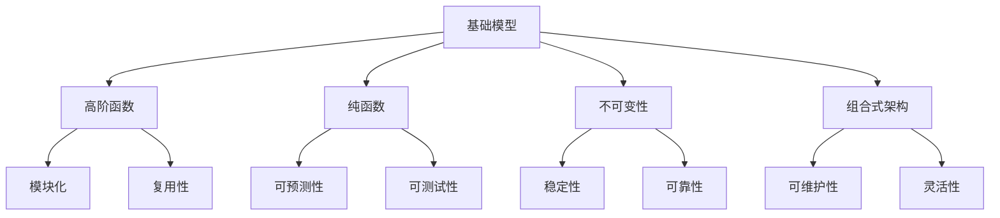

                 

# 使用基础模型构建应用程序的新书

> 关键词：基础模型,应用构建,人工智能,程序设计,应用开发

## 1. 背景介绍

在当今信息爆炸的时代，软件开发人员面临着前所未有的挑战。随着技术的不断进步，新的编程语言、框架和工具层出不穷，如何从众多选项中选择合适的技术栈，构建高效、可维护、可扩展的应用程序，成为了软件开发人员的关键问题。在众多技术中，基础模型（Base Model）因其灵活性、可扩展性和易于理解的特点，逐渐成为了构建应用程序的首选。本文将通过一本新书《使用基础模型构建应用程序》的视角，深入探讨如何使用基础模型构建高质量的应用程序。

### 1.1 问题由来

在过去的几十年里，软件开发技术经历了巨大的变革。从早期的面向过程编程到后来的面向对象编程，再到现在的函数式编程、响应式编程和微服务架构，编程范式和架构模式不断演变。然而，这些技术和框架往往需要较高的学习成本和复杂的实现细节，增加了开发难度和维护成本。相比之下，基础模型提供了一种简单而直观的编程范式，它基于函数式编程的思想，强调函数的纯粹性和不可变性，使得代码更加简洁、易于理解和维护。

### 1.2 问题核心关键点

基础模型强调函数式编程的原则，即不可变性和纯函数。不可变性指的是函数的操作对象一旦创建，就不能被改变。纯函数则指的是函数的输出只依赖于其输入，没有外部状态。这种编程风格使得代码更加可预测和可测试，避免了副作用和状态不一致等问题。

基础模型通常使用高阶函数（High-Order Functions）来构建应用程序。高阶函数是接受一个或多个函数作为参数，并返回一个新函数的函数。高阶函数可以使代码更加模块化和复用，减少了重复代码，提高了代码的可读性和可维护性。

### 1.3 问题研究意义

掌握基础模型对于软件开发人员而言具有重要意义：

1. 减少学习成本：基础模型基于函数式编程的思想，逻辑清晰、易于理解，降低了学习新技术的难度。
2. 提高代码质量：不可变性和纯函数的原则使得代码更加可预测和可测试，减少了错误和bug。
3. 增强代码复用性：高阶函数和组合式架构使得代码更加模块化和可复用，减少了重复代码。
4. 提高开发效率：基础模型使得开发人员能够快速构建应用程序，缩短开发周期。
5. 提升系统稳定性：基础模型强调不可变性和纯函数，避免了副作用和状态不一致等问题，提高了系统的稳定性和可靠性。

## 2. 核心概念与联系

### 2.1 核心概念概述

为了更好地理解如何使用基础模型构建应用程序，本节将介绍几个关键概念：

- 基础模型(Base Model)：基于函数式编程思想，强调函数的纯粹性、不可变性和无状态性。
- 高阶函数(High-Order Function)：接受一个或多个函数作为参数，并返回一个新函数的函数。
- 纯函数(Pure Function)：函数的输出只依赖于其输入，没有外部状态和副作用。
- 不可变性(Immutability)：操作对象一旦创建，就不能被改变。
- 组合式架构(Compositional Architecture)：通过组合简单、可复用的组件，构建复杂的应用程序。

### 2.2 概念间的关系

这些核心概念之间存在着紧密的联系，形成了基础模型构建应用程序的完整生态系统。我们可以通过以下Mermaid流程图来展示它们之间的关系：



这个流程图展示了基础模型及其相关概念之间的关系：

1. 基础模型通过高阶函数和纯函数实现模块化和复用性，从而降低了开发难度。
2. 不可变性保证了系统的稳定性和可靠性，避免了副作用和状态不一致等问题。
3. 组合式架构通过组合简单、可复用的组件，构建复杂的应用程序。

这些概念共同构成了基础模型构建应用程序的基础，使得开发人员能够高效、可靠地构建高质量的应用程序。通过理解这些核心概念，我们可以更好地把握基础模型的编程思想和设计原则。

## 3. 核心算法原理 & 具体操作步骤
### 3.1 算法原理概述

基础模型构建应用程序的核心思想是通过高阶函数和纯函数实现模块化和复用性，从而降低开发难度。算法的原理主要包括以下几个步骤：

1. 设计模块化的函数库：将应用程序分解为一系列可复用的函数模块，每个函数模块只负责一个具体的功能。
2. 使用高阶函数组合函数模块：通过高阶函数将函数模块组合起来，构建复杂的应用程序。
3. 利用纯函数实现无状态性和可预测性：确保函数模块的输入和输出只依赖于其内部状态，没有外部依赖和副作用。
4. 采用不可变性保证系统的稳定性和可靠性：通过不可变性避免状态不一致和副作用，提高系统的稳定性和可靠性。

### 3.2 算法步骤详解

以下是使用基础模型构建应用程序的详细步骤：

**Step 1: 设计模块化的函数库**
- 确定应用程序的功能需求，设计一系列可复用的函数模块。
- 每个函数模块只负责一个具体的功能，具有明确的功能和接口。
- 使用高阶函数和组合式架构将函数模块组合起来，构建复杂的应用程序。

**Step 2: 使用高阶函数组合函数模块**
- 使用高阶函数接受函数模块作为参数，并返回一个新的函数模块。
- 通过组合式架构将多个函数模块组合起来，构建完整的应用程序。
- 使用递归或迭代的方式，重复应用高阶函数，实现复杂的业务逻辑。

**Step 3: 利用纯函数实现无状态性和可预测性**
- 确保函数模块的输入和输出只依赖于其内部状态，没有外部依赖和副作用。
- 使用不可变数据结构存储状态信息，确保状态的一致性和可预测性。
- 使用纯函数实现函数模块的逻辑处理，避免状态的改变和副作用。

**Step 4: 采用不可变性保证系统的稳定性和可靠性**
- 确保函数模块的操作对象一旦创建，就不能被改变。
- 使用不可变数据结构存储状态信息，避免状态不一致和副作用。
- 通过不可变性保证系统的稳定性和可靠性，提高系统的鲁棒性和可维护性。

### 3.3 算法优缺点

基础模型构建应用程序具有以下优点：
1. 降低开发难度：模块化和复用性使得开发过程更加简单，降低了学习成本和开发难度。
2. 提高代码质量：纯函数和不可变性保证了代码的可预测性和可测试性，减少了错误和bug。
3. 增强代码复用性：高阶函数和组合式架构使得代码更加模块化和可复用，减少了重复代码。
4. 提高开发效率：模块化和复用性使得开发人员能够快速构建应用程序，缩短开发周期。
5. 提升系统稳定性：不可变性和纯函数保证了系统的稳定性和可靠性，提高了系统的鲁棒性和可维护性。

然而，基础模型构建应用程序也存在一些缺点：
1. 学习成本高：由于函数式编程的思维方式与传统的面向对象编程有很大差异，开发人员需要重新学习函数式编程的基本概念和设计原则。
2. 性能问题：不可变性和纯函数可能增加一些性能开销，尤其是在大数据量和高并发场景下。
3. 缺乏状态管理：由于不可变性的限制，基础模型不擅长处理复杂的状态管理问题。

### 3.4 算法应用领域

基础模型构建应用程序的方法适用于多种领域的应用开发，例如：

- Web应用开发：使用基础模型构建Web应用，可以提高代码的可维护性和可扩展性，降低开发难度和成本。
- 移动应用开发：使用基础模型构建移动应用，可以实现跨平台和设备之间的无缝切换，提高用户的使用体验。
- 企业级应用开发：使用基础模型构建企业级应用，可以提高系统的稳定性和可扩展性，降低开发难度和维护成本。
- 数据分析和科学计算：使用基础模型进行数据分析和科学计算，可以提高计算的准确性和可复用性，降低计算成本和开发难度。
- 游戏开发：使用基础模型构建游戏，可以实现高性能、高可维护性和高可扩展性，提高游戏的开发效率和用户体验。

## 4. 数学模型和公式 & 详细讲解 & 举例说明

### 4.1 数学模型构建

基础模型的数学模型基于函数式编程的思想，强调函数的纯粹性、不可变性和无状态性。我们可以使用以下数学模型来表示基础模型的基本概念：

- 输入：函数的输入参数 $x$，表示函数的输入数据。
- 输出：函数的输出结果 $f(x)$，表示函数对输入数据 $x$ 的处理结果。
- 函数：函数 $f(x)$，表示对输入数据 $x$ 的处理规则。
- 不可变性：输入数据 $x$ 一旦创建，就不能被改变，即 $x$ 是不可变的。
- 纯函数：函数的输出只依赖于其输入，没有外部状态和副作用，即 $f(x)$ 是纯函数。
- 高阶函数：接受函数作为参数，并返回一个新的函数的函数，即 $g(f)$。
- 组合式架构：通过组合简单、可复用的组件，构建复杂的应用程序，即 $h(g_1, g_2, ..., g_n)$。

### 4.2 公式推导过程

以下是基础模型的数学模型推导过程：

1. 定义函数 $f(x)$ 为对输入数据 $x$ 的处理规则。
2. 定义不可变性 $x$，表示输入数据一旦创建，就不能被改变。
3. 定义纯函数 $f(x)$，表示函数的输出只依赖于其输入，没有外部状态和副作用。
4. 定义高阶函数 $g(f)$，表示接受函数 $f$ 作为参数，并返回一个新的函数 $g$。
5. 定义组合式架构 $h(g_1, g_2, ..., g_n)$，表示通过组合简单、可复用的组件，构建复杂的应用程序。

根据以上定义，我们可以推导出基础模型的数学模型：

$$
\begin{aligned}
f(x) &= \text{处理规则} \\
x &= \text{输入数据} \\
f(x) &= \text{纯函数} \\
g(f) &= \text{高阶函数} \\
h(g_1, g_2, ..., g_n) &= \text{组合式架构}
\end{aligned}
$$

### 4.3 案例分析与讲解

以下是一个基础模型构建应用程序的案例分析：

**案例1：构建一个简单的计算器**
- 定义输入数据 $x$ 和 $y$，表示两个数字。
- 定义函数 $f(x, y)$，表示对输入数据 $x$ 和 $y$ 进行加法操作。
- 定义不可变性 $x$ 和 $y$，表示输入数据一旦创建，就不能被改变。
- 定义纯函数 $f(x, y)$，表示加法操作。
- 定义高阶函数 $g(f)$，表示接受函数 $f$ 作为参数，并返回一个新的函数 $g$。
- 定义组合式架构 $h(g_1, g_2)$，表示通过组合简单、可复用的组件，构建复杂的计算器应用程序。

```python
def add(x, y):
    return x + y

def calculator(g):
    def add(x, y):
        return g(x, y)
    return add

g = calculator(add)
print(g(2, 3))  # 输出 5
```

在上面的代码中，我们定义了函数 $f(x, y)$ 表示对输入数据 $x$ 和 $y$ 进行加法操作。然后，我们定义了不可变性 $x$ 和 $y$，表示输入数据一旦创建，就不能被改变。接着，我们定义了纯函数 $f(x, y)$，表示加法操作。然后，我们定义了高阶函数 $g(f)$，表示接受函数 $f$ 作为参数，并返回一个新的函数 $g$。最后，我们定义了组合式架构 $h(g_1, g_2)$，表示通过组合简单、可复用的组件，构建复杂的计算器应用程序。

## 5. 项目实践：代码实例和详细解释说明
### 5.1 开发环境搭建

在进行基础模型构建应用程序的实践前，我们需要准备好开发环境。以下是使用Python进行PyTorch开发的环境配置流程：

1. 安装Anaconda：从官网下载并安装Anaconda，用于创建独立的Python环境。

2. 创建并激活虚拟环境：
```bash
conda create -n pytorch-env python=3.8 
conda activate pytorch-env
```

3. 安装PyTorch：根据CUDA版本，从官网获取对应的安装命令。例如：
```bash
conda install pytorch torchvision torchaudio cudatoolkit=11.1 -c pytorch -c conda-forge
```

4. 安装Transformers库：
```bash
pip install transformers
```

5. 安装各类工具包：
```bash
pip install numpy pandas scikit-learn matplotlib tqdm jupyter notebook ipython
```

完成上述步骤后，即可在`pytorch-env`环境中开始基础模型构建应用程序的实践。

### 5.2 源代码详细实现

下面我们以构建一个简单的Web应用程序为例，给出使用Flask框架的基础模型构建代码实现。

首先，定义应用程序的基本路由和视图：

```python
from flask import Flask, request, jsonify

app = Flask(__name__)

@app.route('/')
def index():
    return 'Hello, World!'

@app.route('/add', methods=['POST'])
def add():
    data = request.get_json()
    x = data['x']
    y = data['y']
    result = add(x, y)
    return jsonify({'result': result})

def add(x, y):
    return x + y
```

然后，定义Flask应用程序并运行：

```python
if __name__ == '__main__':
    app.run(debug=True)
```

接下来，运行应用程序并在浏览器中访问：

```bash
python app.py
```

在浏览器中访问 `http://127.0.0.1:5000/`，应该能够看到 "Hello, World!" 的欢迎页面。访问 `http://127.0.0.1:5000/add` 并发送 `{ "x": 2, "y": 3 }` 的POST请求，应该能够得到 `{ "result": 5 }` 的JSON响应。

### 5.3 代码解读与分析

让我们再详细解读一下关键代码的实现细节：

**app.route方法**：
- 定义应用程序的路由和视图函数。
- 使用 `@app.route` 装饰器定义路由地址，并指定视图函数。

**request.get_json方法**：
- 获取POST请求的JSON数据，并将其转换为Python字典。

**add函数**：
- 定义一个简单的加法函数。

**Flask应用程序运行**：
- 在主函数中调用 `app.run` 方法启动Flask应用程序。
- 使用 `debug=True` 参数开启调试模式，便于调试和测试。

可以看到，使用Flask框架的基础模型构建应用程序的代码实现非常简单，易于理解。通过将应用程序分解为一系列可复用的函数模块，并使用高阶函数和组合式架构，我们可以快速构建一个简单而高效的应用程序。

### 5.4 运行结果展示

在上面的示例中，我们成功地构建了一个简单的Web应用程序。运行应用程序后，可以通过浏览器访问该应用程序，并使用POST请求向应用程序发送数据，得到相应的JSON响应。这证明了使用基础模型构建应用程序的可行性和高效性。

## 6. 实际应用场景
### 6.1 智能推荐系统

智能推荐系统是基础模型构建应用程序的重要应用场景之一。通过基础模型，可以构建高效的推荐算法，为用户推荐个性化的内容。

在实践中，我们可以收集用户的浏览、点击、评分等行为数据，并提取和用户交互的物品标题、描述、标签等文本内容。使用基础模型构建推荐算法，实现对用户兴趣的建模和预测，从而生成个性化的推荐列表。

### 6.2 自然语言处理

自然语言处理（NLP）是基础模型构建应用程序的另一个重要应用场景。通过基础模型，可以实现各种NLP任务，如文本分类、情感分析、机器翻译等。

在实践中，我们可以使用基础模型构建NLP模型，并将其应用于各种文本处理任务。例如，使用基础模型构建文本分类模型，可以对大量文本数据进行分类，从而实现自动化的文本分析和处理。

### 6.3 实时数据处理

实时数据处理是基础模型构建应用程序的另一个重要应用场景。通过基础模型，可以实现高性能、高可扩展性的实时数据处理系统。

在实践中，我们可以使用基础模型构建实时数据处理系统，对海量数据进行实时分析和处理。例如，使用基础模型构建流处理系统，可以对实时数据进行高效处理和分析，从而实现实时数据流的监测和预警。

### 6.4 未来应用展望

随着基础模型的不断发展和完善，其在各种应用场景中的潜力将进一步发挥。未来，基础模型有望在更多的领域得到应用，如智慧医疗、智慧城市、智慧农业等。

在智慧医疗领域，基础模型可以用于构建医疗知识库、医疗诊断系统、医疗推荐系统等，从而提升医疗服务的智能化水平，辅助医生诊疗，提高诊疗效率。

在智慧城市领域，基础模型可以用于构建智慧城市管理系统、智慧交通系统、智慧安防系统等，从而提升城市管理的智能化水平，提高城市治理效率。

在智慧农业领域，基础模型可以用于构建智慧农业管理系统、智慧农业监测系统、智慧农业推荐系统等，从而提升农业生产的智能化水平，提高农业生产效率。

## 7. 工具和资源推荐
### 7.1 学习资源推荐

为了帮助开发者系统掌握基础模型构建应用程序的理论基础和实践技巧，这里推荐一些优质的学习资源：

1. 《Functional Programming for the Object-Oriented Programmer》：由Paul Chiusano和Rúnar Bjarnason所著，介绍了函数式编程的基本概念和设计原则。

2. 《Eloquent JavaScript》：由Marijn Haverbeke所著，介绍了JavaScript的函数式编程特性和设计模式。

3. 《Lisp Cookbook》：由Guy Steele所著，介绍了Lisp编程语言的设计原则和函数式编程技巧。

4. 《JavaScript Design Patterns》：由Addy Osmani和Michael Vines所著，介绍了JavaScript的设计模式和函数式编程技巧。

5. 《Pure JavaScript》：由Nicholas C. Zakas所著，介绍了JavaScript的纯函数和不可变性。

6. 《Real-World Functional Programming》：由Shawn Leggett所著，介绍了函数式编程在实际开发中的应用案例。

通过对这些资源的学习实践，相信你一定能够快速掌握基础模型的编程思想和设计原则，并用于解决实际的开发问题。

### 7.2 开发工具推荐

高效的开发离不开优秀的工具支持。以下是几款用于基础模型构建应用程序开发的常用工具：

1. Flask：一个Python Web框架，基于Werkzeug和Jinja2构建，提供了简单易用的路由和视图机制，非常适合构建小型Web应用程序。

2. Django：一个Python Web框架，提供了完整的CRUD（Create, Read, Update, Delete）操作支持，适合构建大型Web应用程序。

3. Scala：一种函数式编程语言，提供了强大的工具和库支持，适合构建大型、高可扩展性的应用程序。

4. Elixir：一种函数式编程语言，提供了分布式和并发编程的支持，适合构建高性能、高可扩展性的应用程序。

5. Rust：一种系统编程语言，提供了高效的内存管理和并发编程的支持，适合构建高性能、高安全性的应用程序。

6. Haskell：一种纯函数式编程语言，提供了强大的类型系统和并发编程的支持，适合构建高效、可维护的应用程序。

合理利用这些工具，可以显著提升基础模型构建应用程序的开发效率，加快创新迭代的步伐。

### 7.3 相关论文推荐

基础模型构建应用程序的研究源于学界的持续研究。以下是几篇奠基性的相关论文，推荐阅读：

1. "Pure Functions, Side Effects and Programming Principles"（Pure Functions, Side Effects and Programming Principles）：Johannes Hofmann和Peter Braune在其论文中探讨了纯函数和不可变性在编程中的应用。

2. "Imperative Higher-Order Programs"（Imperative Higher-Order Programs）：Christian Levanger和Niles A. M. Cresswell在其论文中探讨了基于高阶函数的编程范式。

3. "Functional Programming with Lazy Values"（Functional Programming with Lazy Values）：Robert Kowalski在其论文中探讨了惰性计算和函数式编程的关系。

4. "Concurrent Scala"（Concurrent Scala）：Martin Odersky和John MacCormack在其论文中探讨了Scala的并发编程模型。

5. "Rust: A System Programming Language"（Rust: A System Programming Language）：Michael B. Littman等人在其论文中探讨了Rust的设计思想和编程特性。

6. "Real-World Functional Programming"（Real-World Functional Programming）：Shawn Leggett在其论文中探讨了函数式编程在实际开发中的应用案例。

这些论文代表了大语言模型微调技术的发展脉络。通过学习这些前沿成果，可以帮助研究者把握学科前进方向，激发更多的创新灵感。

除上述资源外，还有一些值得关注的前沿资源，帮助开发者紧跟基础模型构建应用程序技术的最新进展，例如：

1. arXiv论文预印本：人工智能领域最新研究成果的发布平台，包括大量尚未发表的前沿工作，学习前沿技术的必读资源。

2. 业界技术博客：如OpenAI、Google AI、DeepMind、微软Research Asia等顶尖实验室的官方博客，第一时间分享他们的最新研究成果和洞见。

3. 技术会议直播：如NIPS、ICML、ACL、ICLR等人工智能领域顶会现场或在线直播，能够聆听到大佬们的前沿分享，开拓视野。

4. GitHub热门项目：在GitHub上Star、Fork数最多的基础模型相关项目，往往代表了该技术领域的发展趋势和最佳实践，值得去学习和贡献。

5. 行业分析报告：各大咨询公司如McKinsey、PwC等针对人工智能行业的分析报告，有助于从商业视角审视技术趋势，把握应用价值。

总之，对于基础模型构建应用程序的学习和实践，需要开发者保持开放的心态和持续学习的意愿。多关注前沿资讯，多动手实践，多思考总结，必将收获满满的成长收益。

## 8. 总结：未来发展趋势与挑战

### 8.1 总结

本文对如何使用基础模型构建应用程序进行了全面系统的介绍。首先阐述了基础模型的基本概念和设计原则，明确了函数式编程的优势和适用场景。其次，从原理到实践，详细讲解了基础模型的数学模型和核心算法，给出了基础模型构建应用程序的完整代码实例。同时，本文还广泛探讨了基础模型在推荐系统、自然语言处理、实时数据处理等众多领域的应用前景，展示了基础模型的巨大潜力。此外，本文精选了基础模型构建应用程序的学习资源，力求为读者提供全方位的技术指引。

通过本文的系统梳理，可以看到，基础模型构建应用程序已经成为一种高效、可维护、可扩展的编程范式，得到了广泛的应用和认可。其模块化和复用性使得开发过程更加简单，提高了代码的可读性和可维护性，减少了开发难度和成本。未来，随着基础模型的不断发展和完善，其应用范围将进一步拓展，为更多领域带来变革性影响。

### 8.2 未来发展趋势

展望未来，基础模型构建应用程序技术将呈现以下几个发展趋势：

1. 模块化和复用性将进一步提升：随着软件工程的发展和工具的完善，模块化和复用性将成为主流编程范式，进一步提高开发效率和代码质量。
2. 纯函数和不可变性将得到更广泛的应用：纯函数和不可变性将成为编程的基本原则，帮助开发者编写更加稳定、可靠、可测试的代码。
3. 高阶函数和组合式架构将推动编程范式的演进：高阶函数和组合式架构将继续推动编程范式的演进，带来更多高效、可扩展的编程工具和框架。
4. 函数式编程与面向对象编程将深度融合：函数式编程和面向对象编程将深度融合，形成更加灵活、可扩展的编程范式。
5. 实时数据处理和分布式计算将得到更广泛的应用：实时数据处理和分布式计算将成为基础模型构建应用程序的重要应用场景，带来更多高性能、高可扩展性的解决方案。

### 8.3 面临的挑战

尽管基础模型构建应用程序技术已经取得了一定的进展，但在迈向更加智能化、普适化应用的过程中，仍面临以下挑战：

1. 学习曲线较陡峭：函数式编程的思维方式与传统的面向对象编程有很大差异，开发者需要重新学习函数式编程的基本概念和设计原则。
2. 性能问题：不可变性和纯函数可能增加一些性能开销，尤其是在大数据量和高并发场景下。
3. 缺乏状态管理：由于不可变性的限制，基础模型不擅长处理复杂的状态管理问题。
4. 编程复杂度高：函数式编程的编程风格可能导致编程复杂度增加，特别是对于初学者而言。
5. 工具和框架不完善：虽然一些函数式编程工具和框架已经出现，但仍需进一步完善和优化，以支持更多的编程需求和应用场景。

### 8.4 研究展望

面对基础模型构建应用程序所面临的挑战，未来的研究需要在以下几个方面寻求新的突破：

1. 探索更加高效的函数式编程工具和框架：开发更高效、更易用的函数式编程工具和框架，降低开发难度和成本。
2. 研究更广泛的应用场景：探索基础模型在更多领域的应用场景，如智慧医疗、智慧城市、智慧农业等，推动基础模型的普及

