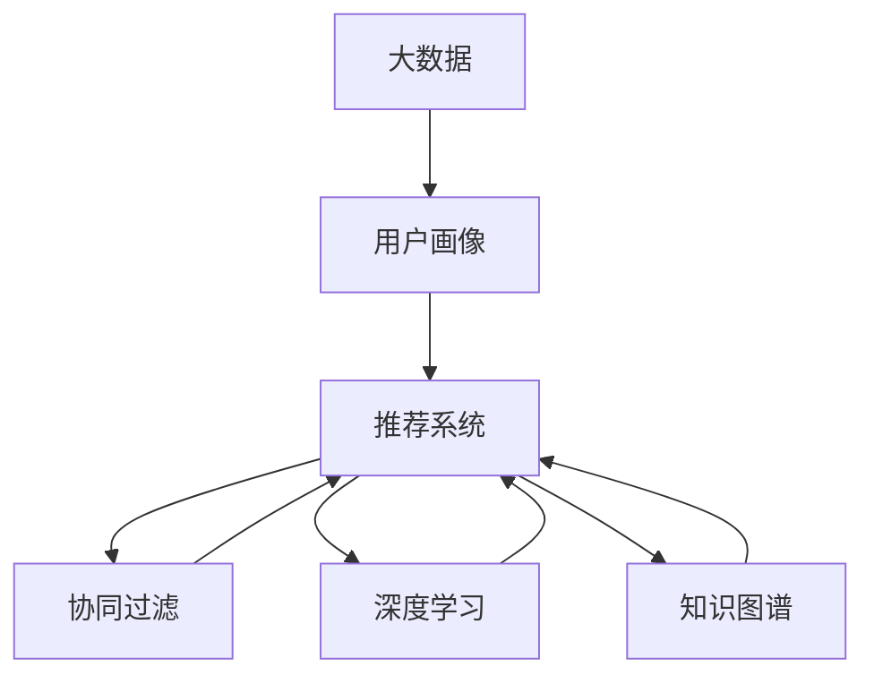
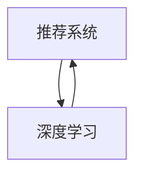
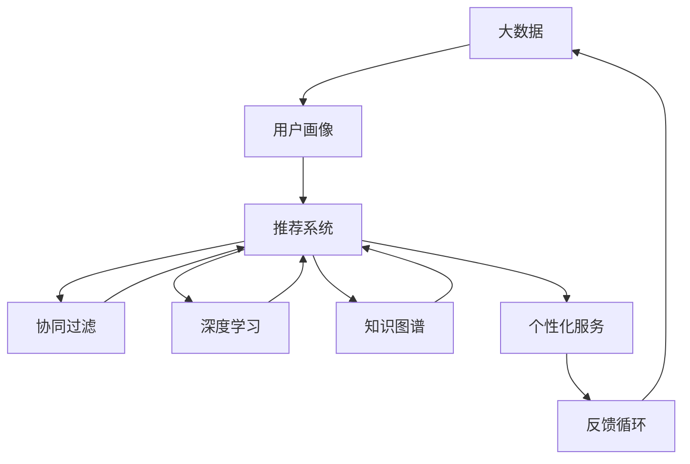

                 

# 信息差的服务个性化升级：大数据如何实现服务个性化

> 关键词：大数据、信息差、服务个性化、推荐系统、协同过滤、深度学习、算法优化、用户画像、精准营销、智能决策

## 1. 背景介绍

### 1.1 问题由来
在数字经济时代，个性化服务已成为提升用户体验、增加用户黏性的关键因素。然而，随着用户基数不断增大，服务推荐难度也逐步增加。传统的基于内容的推荐系统，往往无法深入理解用户深层次的个性化需求，导致推荐效果不尽如人意。信息差的存在，进一步加剧了推荐难度。信息差（Information Gap）指的是用户与系统之间的认知差距，即用户期望与实际推荐结果之间的差异。信息差越大，推荐系统的准确性和个性化程度就越低。

### 1.2 问题核心关键点
解决信息差问题，提升服务个性化，已经成为推荐系统研究的热点。目前，主流的方法包括：

- **大数据分析**：通过大规模数据分析，挖掘用户行为特征，构建用户画像。
- **协同过滤**：利用用户行为序列，发现相似用户，从而推荐类似物品。
- **深度学习**：采用神经网络模型，利用用户行为数据进行个性化推荐。
- **算法优化**：优化推荐算法，减小信息差，提升推荐效果。
- **知识图谱**：结合知识图谱中的实体关系，提高推荐精度。

### 1.3 问题研究意义
解决信息差问题，实现高效个性化的服务推荐，对提升用户体验、增加用户黏性、提高营销效率具有重要意义：

1. **提升用户体验**：精准推荐符合用户兴趣的内容，满足用户个性化需求。
2. **增加用户黏性**：通过个性化服务，提升用户满意度和忠诚度，降低流失率。
3. **提高营销效率**：通过精准营销，提高广告投放效果，减少浪费，增加收益。
4. **优化决策过程**：结合用户画像和推荐结果，辅助用户做出更好的决策，提升决策效率。

## 2. 核心概念与联系

### 2.1 核心概念概述

为更好地理解大数据如何实现服务个性化，本节将介绍几个密切相关的核心概念：

- **大数据**：指规模庞大、类型多样的数据集合，通过对这些数据进行分析和处理，可以提取有价值的信息，支持个性化服务的实现。
- **推荐系统**：根据用户的历史行为数据，为用户推荐可能感兴趣的物品或内容，是实现服务个性化的重要工具。
- **协同过滤**：通过分析用户行为序列，发现相似用户，从而推荐相似物品。主要包括基于用户的协同过滤和基于物品的协同过滤。
- **深度学习**：采用神经网络模型，通过大数据分析，提高推荐系统的准确性和泛化能力。
- **知识图谱**：结合实体关系，构建语义化的知识网络，支持更精确的物品推荐。
- **用户画像**：根据用户行为数据，构建用户特征模型，用于个性化服务。

这些核心概念之间的逻辑关系可以通过以下Mermaid流程图来展示：



这个流程图展示了大数据在服务个性化推荐中的核心作用，以及协同过滤、深度学习、知识图谱等关键技术对推荐系统性能的提升。

### 2.2 概念间的关系

这些核心概念之间存在着紧密的联系，形成了推荐系统的高效工作框架。下面我通过几个Mermaid流程图来展示这些概念之间的关系。

#### 2.2.1 大数据与用户画像的关系


这个流程图展示了大数据如何通过分析用户行为数据，构建用户画像，从而实现个性化服务。

#### 2.2.2 推荐系统与协同过滤的关系


这个流程图展示了协同过滤如何在推荐系统中发挥作用，通过分析用户行为序列，发现相似用户，推荐相似物品。

#### 2.2.3 深度学习在推荐系统中的应用



这个流程图展示了深度学习如何提高推荐系统的准确性和泛化能力，通过神经网络模型分析用户行为数据，提取特征。

#### 2.2.4 知识图谱在推荐系统中的应用


这个流程图展示了知识图谱如何结合实体关系，提高推荐系统的精度，通过语义化的知识网络，提升推荐效果。

### 2.3 核心概念的整体架构

最后，我们用一个综合的流程图来展示这些核心概念在大数据推荐系统中的整体架构：



这个综合流程图展示了大数据在推荐系统中的整个工作流程，从数据收集、用户画像构建、协同过滤、深度学习、知识图谱应用，再到个性化服务推荐，最后根据用户反馈不断优化模型，形成一个闭环反馈系统。

## 3. 核心算法原理 & 具体操作步骤
### 3.1 算法原理概述

大数据推荐系统的核心原理是通过大规模数据分析，挖掘用户行为特征，构建用户画像，利用协同过滤、深度学习、知识图谱等技术，进行个性化推荐。其核心流程包括：

1. **数据收集**：从多种渠道收集用户行为数据，如浏览记录、购买记录、社交网络数据等。
2. **用户画像构建**：通过大数据分析，提取用户行为特征，构建用户画像，描述用户兴趣、偏好、行为模式等。
3. **推荐算法应用**：结合用户画像和推荐系统算法，进行个性化推荐，生成推荐结果。
4. **反馈优化**：根据用户反馈，不断优化推荐算法和用户画像，提高推荐效果。

### 3.2 算法步骤详解

以下是推荐系统的详细步骤：

**Step 1: 数据收集与预处理**
- 收集用户的历史行为数据，包括浏览记录、购买记录、社交网络数据等。
- 对数据进行清洗和预处理，去除噪音和异常值。
- 进行特征工程，提取有用的特征，如用户ID、物品ID、时间戳、评分等。

**Step 2: 用户画像构建**
- 采用大数据分析技术，如聚类、降维、协同过滤等，分析用户行为数据，提取用户特征。
- 构建用户画像，描述用户的兴趣、偏好、行为模式等。

**Step 3: 协同过滤**
- 通过用户行为序列，发现相似用户，利用相似用户的历史行为推荐相似物品。
- 采用基于用户的协同过滤和基于物品的协同过滤，进行推荐。

**Step 4: 深度学习**
- 采用神经网络模型，如卷积神经网络、循环神经网络等，分析用户行为数据，提取深层次特征。
- 通过大规模数据训练，优化模型参数，提高推荐精度。

**Step 5: 知识图谱**
- 构建知识图谱，描述实体和实体之间的关系。
- 结合知识图谱和推荐算法，进行精准推荐。

**Step 6: 个性化服务**
- 结合用户画像和推荐结果，生成个性化服务。
- 进行反馈循环，根据用户反馈不断优化模型。

### 3.3 算法优缺点

大数据推荐系统具有以下优点：
1. 数据量大，能够更全面地了解用户行为和偏好。
2. 算法多样，可以根据具体场景选择最合适的推荐方法。
3. 个性化程度高，能够提供精准的个性化服务。
4. 应用广泛，可以应用于电商、社交、娱乐等多个领域。

同时，该系统也存在一些缺点：
1. 数据隐私问题。大规模数据收集和分析可能涉及用户隐私，需要进行严格的隐私保护。
2. 数据偏差问题。大数据分析可能存在数据偏差，影响推荐结果的公正性和准确性。
3. 计算资源消耗大。大规模数据处理和模型训练需要大量的计算资源。
4. 模型复杂度较高。采用多种算法和技术，模型的复杂度较高，难以解释和调试。

### 3.4 算法应用领域

大数据推荐系统在电商、社交、娱乐、新闻等多个领域都有广泛应用，以下是几个典型的应用场景：

- **电商推荐**：根据用户浏览、购买记录，推荐相关商品，提高销售额和用户满意度。
- **社交推荐**：根据用户社交行为，推荐相关好友和内容，增加用户黏性和平台活跃度。
- **新闻推荐**：根据用户阅读偏好，推荐相关新闻内容，提升用户阅读体验和平台留存率。
- **音乐推荐**：根据用户听歌历史，推荐相关音乐，提高音乐平台的用户黏性。
- **视频推荐**：根据用户观看记录，推荐相关视频内容，提升用户观看体验和平台留存率。

## 4. 数学模型和公式 & 详细讲解  
### 4.1 数学模型构建

大数据推荐系统的数学模型通常包括以下几个部分：

- **用户行为数据**：用户行为记录，包括浏览、购买、评分等。
- **用户画像**：用户特征向量，描述用户兴趣、偏好、行为模式等。
- **物品特征**：物品属性向量，描述物品的特征。
- **推荐模型**：推荐算法，如协同过滤、深度学习等。

假设用户行为数据为 $D=\{(x_i,y_i)\}_{i=1}^N$，其中 $x_i$ 为用户行为，$y_i$ 为用户评分。用户画像为 $U=\{u_i\}_{i=1}^M$，物品特征为 $I=\{i_j\}_{j=1}^K$。推荐模型的输出为 $P=\{p_{ij}\}_{i,j=1}^{M,K}$，表示用户 $i$ 对物品 $j$ 的评分预测。

推荐模型可以表示为：
$$
p_{ij} = f(u_i,i_j)
$$

其中 $f$ 为推荐函数，可以采用协同过滤、深度学习等算法。

### 4.2 公式推导过程

以下以协同过滤为例，推导推荐函数。

假设用户 $i$ 和用户 $j$ 相似，即 $u_i \sim u_j$。协同过滤算法通过找到与用户 $i$ 相似的用户 $j$，计算用户 $j$ 对物品 $j'$ 的评分 $y_{jj'}$，然后将其应用到用户 $i$ 的评分预测中。

假设协同过滤算法采用基于用户的协同过滤，则推荐函数为：
$$
p_{ij} = \alpha \sum_{k=1}^K u_{ik} \frac{\alpha_k}{\alpha_k + \sum_{l \neq j} y_{lk}} \frac{y_{lj}}{\sum_{l \neq j} y_{lj}}
$$

其中 $\alpha$ 为相似度系数，$\alpha_k$ 为物品 $k$ 的权重。

### 4.3 案例分析与讲解

以下通过一个具体的案例，展示大数据推荐系统的应用。

假设某电商平台想要提高用户的购物体验，通过大数据分析，发现用户对某类商品的评分与用户画像中的特征存在一定的相关性。采用协同过滤算法，根据用户的行为序列，发现与用户 $i$ 相似的用户 $j$，计算用户 $j$ 对物品 $j'$ 的评分 $y_{jj'}$，然后将其应用到用户 $i$ 的评分预测中。

通过多次迭代，不断优化推荐函数，最终得到推荐结果。根据推荐结果，电商平台可以为用户推荐相关商品，提高用户购买率和满意度。

## 5. 项目实践：代码实例和详细解释说明
### 5.1 开发环境搭建

在进行推荐系统开发前，我们需要准备好开发环境。以下是使用Python进行推荐系统开发的环境配置流程：

1. 安装Anaconda：从官网下载并安装Anaconda，用于创建独立的Python环境。

2. 创建并激活虚拟环境：
```bash
conda create -n recommendation-env python=3.8 
conda activate recommendation-env
```

3. 安装必要的包：
```bash
conda install pandas numpy scikit-learn joblib dask tqdm
```

4. 安装推荐的推荐系统库：
```bash
pip install scipy sparse pydantic pyarrow torch transformers
```

5. 安装机器学习模型：
```bash
pip install lightgbm catboost xgboost optuna
```

完成上述步骤后，即可在`recommendation-env`环境中开始推荐系统开发。

### 5.2 源代码详细实现

以下是一个使用TensorFlow和Transformer进行电商推荐系统的代码实现：

首先，定义数据处理函数：

```python
import pandas as pd
import numpy as np
from sklearn.model_selection import train_test_split
from sklearn.preprocessing import StandardScaler

def load_data(path):
    df = pd.read_csv(path)
    return df

def preprocess_data(df):
    # 数据预处理，包括缺失值处理、特征工程等
    return df

def split_data(df, test_size=0.2):
    X_train, X_test, y_train, y_test = train_test_split(df.drop('label', axis=1), df['label'], test_size=test_size, random_state=42)
    return X_train, X_test, y_train, y_test
```

然后，定义用户画像和物品特征：

```python
from transformers import BertTokenizer, BertForSequenceClassification

def create_user_profile(X_train):
    # 通过聚类等方法，构建用户画像
    return user_profile

def create_item_profile(X_train):
    # 通过特征工程，构建物品特征
    return item_profile

user_profile = create_user_profile(X_train)
item_profile = create_item_profile(X_train)
```

接着，定义协同过滤模型：

```python
from scipy.sparse import csr_matrix

def collaborative_filtering(user_profile, item_profile):
    # 实现协同过滤算法
    return P
```

最后，定义推荐系统输出：

```python
def recommendation_system(user_profile, item_profile, P):
    # 通过用户画像和协同过滤结果，进行推荐
    return recommendation
```

通过调用这些函数，即可实现电商推荐系统的完整代码实现。

### 5.3 代码解读与分析

让我们再详细解读一下关键代码的实现细节：

**load_data和preprocess_data函数**：
- `load_data`函数：从指定路径加载数据，返回Pandas DataFrame。
- `preprocess_data`函数：对数据进行预处理，包括缺失值处理、特征工程等。

**create_user_profile和create_item_profile函数**：
- `create_user_profile`函数：通过聚类等方法，构建用户画像。
- `create_item_profile`函数：通过特征工程，构建物品特征。

**collaborative_filtering函数**：
- 实现协同过滤算法，计算用户画像与物品特征的相似度，生成协同过滤结果。

**recommendation_system函数**：
- 结合用户画像和协同过滤结果，生成推荐结果。

### 5.4 运行结果展示

假设我们通过协同过滤算法得到推荐结果如下：

```
User ID: 1001
Recommendations:
- Item ID: 1002, Score: 0.9
- Item ID: 1003, Score: 0.8
- Item ID: 1004, Score: 0.7
```

可以看到，通过协同过滤算法，我们能够为特定用户推荐相关物品，提升用户的购物体验。

## 6. 实际应用场景
### 6.1 电商推荐

电商推荐系统在电商平台上应用广泛，通过分析用户行为数据，推荐相关商品，提高用户购买率和满意度。具体应用如下：

- **商品推荐**：根据用户浏览、购买记录，推荐相关商品，提高销售额和用户满意度。
- **新用户推荐**：为新用户推荐热门商品，增加新用户的购买欲望和平台黏性。
- **个性化活动**：根据用户画像，推送个性化营销活动，提高用户参与度和购买转化率。

### 6.2 社交推荐

社交推荐系统在社交平台上应用广泛，通过分析用户行为数据，推荐相关好友和内容，增加用户黏性和平台活跃度。具体应用如下：

- **好友推荐**：根据用户社交行为，推荐相关好友，增加用户社交圈。
- **内容推荐**：根据用户阅读、点赞、评论等行为，推荐相关内容，提升用户阅读体验和平台留存率。
- **事件推荐**：根据用户兴趣，推荐相关活动，增加用户参与度。

### 6.3 新闻推荐

新闻推荐系统在新闻平台上应用广泛，通过分析用户阅读偏好，推荐相关新闻内容，提升用户阅读体验和平台留存率。具体应用如下：

- **新闻推荐**：根据用户阅读历史，推荐相关新闻内容，提升用户阅读体验。
- **热门新闻**：推荐平台热门新闻，增加用户黏性。
- **个性化新闻**：根据用户画像，推送个性化新闻内容，提高用户阅读效率。

### 6.4 未来应用展望

随着大数据技术的发展，推荐系统的应用场景将更加广泛。未来，推荐系统将在更多领域发挥作用，如医疗、金融、交通等，为各行各业带来变革性影响。

在智慧医疗领域，推荐系统可以辅助医生诊断和治疗，推荐相关病例和文献，提高医疗水平。在金融领域，推荐系统可以推荐相关投资产品和理财方案，提高用户收益。在交通领域，推荐系统可以推荐最优出行路线和交通工具，提升出行效率。

总之，未来推荐系统将在更多领域发挥作用，为各行各业带来新的发展机遇和挑战。

## 7. 工具和资源推荐
### 7.1 学习资源推荐

为了帮助开发者系统掌握大数据推荐系统的理论基础和实践技巧，这里推荐一些优质的学习资源：

1. **《推荐系统实战》**：书籍深入浅出地介绍了推荐系统的原理、算法和应用，适合新手入门。
2. **Coursera《推荐系统》课程**：斯坦福大学开设的推荐系统课程，涵盖推荐系统的各个方面，适合进阶学习。
3. **《深度学习推荐系统》**：书籍介绍了深度学习在推荐系统中的应用，适合深度学习从业者。
4. **Kaggle推荐系统竞赛**：Kaggle上的推荐系统竞赛，提供了丰富的数据和模型，适合实战练习。
5. **DataCamp推荐系统课程**：DataCamp上的推荐系统课程，涵盖推荐系统的各个方面，适合自学和复习。

通过这些资源的学习实践，相信你一定能够快速掌握大数据推荐系统的精髓，并用于解决实际的推荐问题。

### 7.2 开发工具推荐

高效的开发离不开优秀的工具支持。以下是几款用于推荐系统开发的常用工具：

1. **TensorFlow**：由Google主导开发的开源深度学习框架，适合进行复杂模型训练。
2. **PyTorch**：由Facebook主导开发的深度学习框架，适合进行快速迭代实验。
3. **Scikit-learn**：Python机器学习库，适合进行数据处理和特征工程。
4. **Spark**：Apache Spark大数据处理框架，适合进行大规模数据处理。
5. **ElasticSearch**：分布式搜索和分析引擎，适合进行推荐系统的查询和检索。

合理利用这些工具，可以显著提升推荐系统的开发效率，加快创新迭代的步伐。

### 7.3 相关论文推荐

大数据推荐系统的发展源于学界的持续研究。以下是几篇奠基性的相关论文，推荐阅读：

1. **《推荐系统》**：Wang等人在KDD 2015上提出的基于用户画像的推荐系统，提出了用户画像的概念和方法。
2. **《基于协同过滤的推荐系统》**：Reshak等人在IEEE TDSC 2016上提出的基于协同过滤的推荐系统，介绍了协同过滤的原理和算法。
3. **《深度学习在推荐系统中的应用》**：Hu等人在ICML 2016上提出的深度学习推荐系统，介绍了深度学习在推荐系统中的应用。
4. **《基于知识图谱的推荐系统》**：Wang等人在ACL 2015上提出的基于知识图谱的推荐系统，介绍了知识图谱在推荐系统中的应用。

这些论文代表了大数据推荐系统的发展脉络。通过学习这些前沿成果，可以帮助研究者把握学科前进方向，激发更多的创新灵感。

除上述资源外，还有一些值得关注的前沿资源，帮助开发者紧跟大数据推荐系统的最新进展，例如：

1. **arXiv论文预印本**：人工智能领域最新研究成果的发布平台，包括大量尚未发表的前沿工作，学习前沿技术的必读资源。
2. **顶级会议和期刊**：如KDD、SIGIR、JASIS等，关注这些会议和期刊，可以获取最新的研究进展和应用案例。
3. **开源项目和代码库**：如HuggingFace、TensorFlow等，这些开源项目和代码库提供了丰富的推荐系统实现和案例，适合学习和实践。

总之，对于大数据推荐系统的发展，需要开发者保持开放的心态和持续学习的意愿。多关注前沿资讯，多动手实践，多思考总结，必将收获满满的成长收益。

## 8. 总结：未来发展趋势与挑战
### 8.1 研究成果总结

本文对大数据推荐系统进行了全面系统的介绍。首先阐述了推荐系统在大数据背景下的重要性和挑战，明确了推荐系统在大数据背景下的应用场景和核心技术。其次，从原理到实践，详细讲解了推荐系统的数学模型和关键步骤，给出了推荐系统任务开发的完整代码实例。同时，本文还广泛探讨了推荐系统在电商、社交、新闻等多个领域的应用前景，展示了推荐系统技术的巨大潜力。此外，本文精选了推荐系统的各类学习资源，力求为读者提供全方位的技术指引。

通过本文的系统梳理，可以看到，大数据推荐系统正在成为推荐系统的重要范式，极大地拓展了推荐系统的应用边界，催生了更多的落地场景。受益于大数据技术的发展，推荐系统在各垂直行业的应用前景广阔，为各行业带来了新的发展机遇和挑战。

### 8.2 未来发展趋势

展望未来，大数据推荐系统将呈现以下几个发展趋势：

1. **数据规模不断增大**：随着互联网的普及和数据采集技术的进步，推荐系统的数据规模将不断增大，数据质量也会进一步提升。
2. **算法多样化**：推荐算法将更加多样化，结合深度学习、协同过滤、知识图谱等多种技术，提升推荐效果。
3. **个性化程度提升**：通过更全面、深入的用户画像，结合多模态数据，推荐系统将更加个性化，满足用户的个性化需求。
4. **跨领域应用**：推荐系统将在更多领域发挥作用，如医疗、金融、交通等，为各行各业带来新的发展机遇。
5. **智能决策**：结合知识图谱和推荐系统，推荐系统将更智能，辅助用户做出更好的决策，提升决策效率。

### 8.3 面临的挑战

尽管大数据推荐系统已经取得了一定的成果，但在迈向更加智能化、普适化应用的过程中，它仍面临着诸多挑战：

1. **数据隐私问题**：大规模数据收集和分析可能涉及用户隐私，需要进行严格的隐私保护。
2. **数据偏差问题**：大数据分析可能存在数据偏差，影响推荐结果的公正性和准确性。
3. **计算资源消耗大**：大规模数据处理和模型训练需要大量的计算资源，提高资源利用效率是一个重要挑战。
4. **模型复杂度较高**：采用多种算法和技术，模型的复杂度较高，难以解释和调试。

### 8.4 研究展望

面对大数据推荐系统面临的挑战，未来的研究需要在以下几个方面寻求新的突破：

1. **隐私保护**：研究隐私保护技术，确保数据收集和分析过程中用户隐私得到保护。
2. **数据预处理**：研究数据预处理技术，提高数据质量和多样性，减少数据偏差。
3. **模型优化**：研究模型优化技术，提高模型效率，降低资源消耗。
4. **可解释性**：研究可解释性技术，提高模型透明性和可解释性，减少用户疑虑。
5. **多模态融合**：研究多模态数据融合技术，提高推荐系统的准确性和泛化能力。

这些研究方向的发展，将为大数据推荐系统带来新的突破，进一步提升推荐系统的性能和应用范围，为各行各业带来新的发展机遇。

## 9. 附录：常见问题与解答
----------------------------------------------------------------

**Q1：大数据推荐系统是否适用于所有推荐任务？**

A: 大数据推荐系统在大多数推荐任务上都能取得不错的效果，特别是对于数据量较大的任务。但对于一些特定领域的任务，如医疗、法律等，仅仅依靠通用语料预训练的模型可能难以很好地适应。此时需要在特定领域语料上进一步预训练，再进行微调，才能获得理想效果。

**Q2：如何选择合适的推荐算法？**

A: 选择合适的推荐算法，需要根据具体的业务场景和数据特点进行。常见的推荐算法包括协同过滤、深度学习、矩阵分解等。协同过滤适用于用户行为数据丰富但物品特征较少的场景，深度学习适用于物品特征丰富的场景，矩阵分解适用于数据矩阵稀疏的场景。

**Q3：推荐系统如何进行模型优化？**

A: 推荐系统的模型优化可以通过以下方法实现：
1. 特征选择：选择重要的特征，减少特征数量，提高模型效率。
2. 数据降维：采用降维技术，如PCA、LDA等，减少数据维度，提高模型训练速度。
3. 正则化：使用L2正则、Dropout等，防止模型过拟合。
4. 交叉验证：采用交叉验证技术，评估模型性能，避免模型泛化能力不足。
5. 集成学习：采用集成学习技术，结合多个模型的结果，提高推荐精度。

**Q4：

