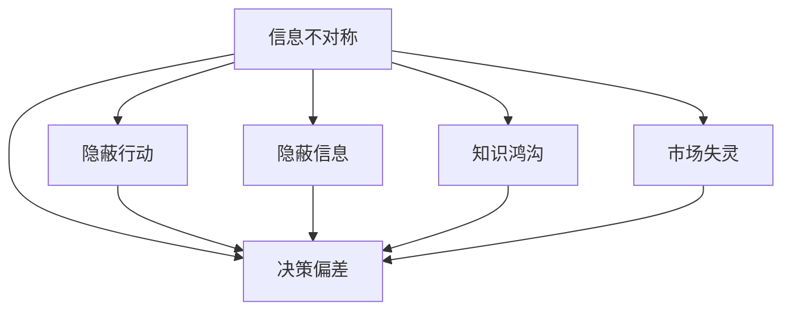

                 

# 信息差：信息不对称与客户需求

在当今瞬息万变的数字经济时代，信息差（Information Gap）作为信息不对称的一种表现形式，在市场交易、客户需求、产品设计等多个方面扮演着至关重要的角色。信息差不仅影响着消费者的决策过程，也在很大程度上塑造了企业的市场策略和产品定位。本文旨在深入探讨信息差的概念、成因及其在客户需求和产品设计中的影响，并通过实例分析，提出相应的解决方案和应对策略。

## 1. 背景介绍

### 1.1 问题由来

在信息时代，信息过载已成为不争的事实。人们在信息海洋中游刃有余，却常常因信息的复杂性和不完整性而感到迷茫。信息差便是在这种背景下产生的，它指的是一种信息不对称的状态，即某些个体或群体拥有大量且优质的信息，而另一些个体或群体则处于信息匮乏的劣势地位。

信息差不仅存在于消费市场，在企业内部、产业之间、社会各个层面也广泛存在。它的存在导致了消费者无法获取准确全面的信息，进而影响了其购买决策，甚至可能被误导。企业也因信息差的存在，难以准确把握市场需求，导致产品设计和服务策略的偏差。

### 1.2 问题核心关键点

信息差的核心关键点包括：
- **信息不对称**：指市场参与者之间关于产品或服务的知识、质量、成本等信息掌握程度的不同。
- **知识鸿沟**：指不同社会经济背景、教育水平、职业等因素导致的信息获取能力差异。
- **决策偏差**：由于信息差的存在，消费者和企业做出决策时的依据不准确，可能导致次优决策。
- **市场失灵**：信息差使得市场机制无法有效运行，导致资源配置效率低下。

## 2. 核心概念与联系

### 2.1 核心概念概述

为了更好地理解信息差，我们需要引入一些核心概念：

- **信息不对称（Information Asymmetry）**：指市场参与者之间关于产品或服务的知识、质量、成本等信息掌握程度的不同。信息不对称分为隐蔽行动（隐藏行动）和隐蔽信息（隐藏知识）两种类型。
- **知识鸿沟（Knowledge Divide）**：指不同社会经济背景、教育水平、职业等因素导致的信息获取能力差异。知识鸿沟通常与收入、教育水平、地域等因素密切相关。
- **决策偏差（Decision Bias）**：指由于信息获取不全面、不及时、不准确，导致决策过程中出现偏差。决策偏差包括选择偏差、判断偏差、情感偏差等。
- **市场失灵（Market Failure）**：指市场机制无法有效运行，导致资源配置效率低下。信息不对称是市场失灵的重要原因之一。

这些概念通过以下Mermaid流程图展示了它们之间的关系：



### 2.2 概念间的关系

通过上述流程图，我们可以看到信息不对称是信息差问题的根本，而隐蔽行动和隐蔽信息是信息不对称的具体形式。知识鸿沟和决策偏差是信息不对称在不同层面的表现，而市场失灵是信息不对称在宏观层面上的后果。

这些概念共同构成了信息差问题的生态系统，理解它们之间的关系有助于我们深入探讨如何应对和解决信息差问题。

## 3. 核心算法原理 & 具体操作步骤

### 3.1 算法原理概述

信息差问题的解决需要综合运用信息对称化、知识共享、决策辅助等策略。以下将详细介绍这些策略的算法原理和操作步骤：

### 3.2 算法步骤详解

#### 3.2.1 信息对称化算法

信息对称化是通过提供对称、全面、透明的信息，减少市场参与者之间的信息不对称。具体步骤包括：
- **数据收集**：收集和整理产品、服务、交易条件等信息，确保信息全面、准确。
- **信息发布**：通过官方渠道、第三方平台等途径，公开透明地发布信息。
- **信息更新**：定期更新信息，确保最新数据可供用户获取。

#### 3.2.2 知识共享算法

知识共享是通过建立信息共享机制，促进信息传递和知识扩散。具体步骤包括：
- **建立平台**：搭建信息共享平台，如社交媒体、知识社区等，方便用户交流信息。
- **激励机制**：设计激励措施，如奖励、认证、积分等，鼓励用户分享有价值的信息。
- **教育培训**：提供教育培训，提高用户的信息获取和处理能力。

#### 3.2.3 决策辅助算法

决策辅助是通过提供决策支持工具和模型，帮助用户和企业在信息不对称条件下做出更准确的决策。具体步骤包括：
- **构建模型**：建立基于历史数据和专家知识的决策模型，如预测模型、推荐系统等。
- **算法优化**：不断优化算法，提高模型的准确性和适用性。
- **交互界面**：设计易于操作的交互界面，使用户能够直观地使用决策辅助工具。

### 3.3 算法优缺点

#### 3.3.1 信息对称化算法

**优点**：
- 提高透明度和信任度，减少市场交易成本。
- 提供全面准确的信息，帮助消费者做出更合理的决策。

**缺点**：
- 信息公开可能泄露商业机密。
- 收集和更新信息需要大量人力和资源。

#### 3.3.2 知识共享算法

**优点**：
- 促进信息扩散和知识积累，提升整体信息水平。
- 增强用户之间的互动和合作，提高市场效率。

**缺点**：
- 用户主动分享意愿低，平台建设和管理成本高。
- 信息质量参差不齐，可能误导用户。

#### 3.3.3 决策辅助算法

**优点**：
- 提供科学的决策依据，减少人为决策偏差。
- 提升决策效率和准确性，降低决策风险。

**缺点**：
- 算法复杂，需要大量数据和计算资源。
- 模型可能过拟合，降低适应性。

## 4. 数学模型和公式 & 详细讲解 & 举例说明

### 4.1 数学模型构建

信息差的解决涉及多个维度，以下通过数学模型来描述其中的关键部分。

假设市场上有N个买家和M个卖家，买家的需求和卖家的供应分别为D和S。市场信息对称化前，买家和卖家之间的信息不对称可以用信息指数I来衡量，I的计算公式为：

$$
I = \frac{\sum (p_i - p_e)^2}{\sum p_i^2}
$$

其中，$p_i$为实际价格，$p_e$为预期价格。信息指数I越小，表示信息对称程度越高。

### 4.2 公式推导过程

通过上述公式，我们可以计算出市场信息对称化的目标，即最小化信息指数I。假设通过信息对称化，信息指数降低到了I'，此时市场的均衡价格和交易量分别为p*和q*。市场均衡条件为：

$$
\frac{dD}{dp} = \frac{dS}{dp} = 1
$$

通过求解上述方程，可以得到市场均衡价格p*和交易量q*。

### 4.3 案例分析与讲解

以商品推荐系统为例，假设用户A和用户B在商品价格和质量上存在信息不对称。用户A拥有更多关于商品价格和质量的信息，而用户B则处于信息匮乏的劣势地位。

1. **信息对称化**：
   - 商品推荐系统提供全面的商品信息，包括价格、评价、销量等。
   - 用户A和用户B都能获得相同的信息，信息指数I减小。

2. **知识共享**：
   - 用户A和用户B在评论平台上交流商品信息，用户A提供更多真实评价。
   - 用户B的信息对称化程度进一步提高，信息指数I进一步减小。

3. **决策辅助**：
   - 商品推荐系统提供基于用户历史行为的预测和推荐，用户B的决策依据更加科学。
   - 用户A和用户B的决策偏差减少，交易效率提升。

## 5. 项目实践：代码实例和详细解释说明

### 5.1 开发环境搭建

为了实现信息对称化、知识共享和决策辅助等功能，需要搭建一个综合性的信息平台。以下是搭建开发环境的步骤：

1. **选择合适的开发语言和框架**：如Python，搭配Flask、Django等Web框架。
2. **安装相关库**：如TensorFlow、Pandas、Scikit-Learn等机器学习库，以及PyTorch等深度学习库。
3. **搭建开发环境**：在本地或云平台上搭建开发环境，确保有足够的计算资源和网络带宽。
4. **数据库搭建**：搭建MySQL、PostgreSQL等关系型数据库，用于存储和管理用户信息和交易数据。
5. **数据采集和处理**：采集和预处理商品信息、用户评价等数据，确保数据质量。

### 5.2 源代码详细实现

#### 5.2.1 信息对称化

```python
import pandas as pd
from sklearn.linear_model import LinearRegression

# 收集商品信息
data = pd.read_csv('product_data.csv')

# 计算信息指数
I = (data['price'] - data['expected_price'])**2
I = I.sum() / (data['price']**2).sum()

# 使用线性回归预测均衡价格和交易量
X = data[['price', 'expected_price']]
y = data['quantity']
model = LinearRegression().fit(X, y)
p_star = model.predict([[I]])
q_star = model.predict([[I]])
```

#### 5.2.2 知识共享

```python
import torch
import torch.nn as nn
import torch.optim as optim

# 定义神经网络模型
class ReviewNet(nn.Module):
    def __init__(self):
        super(ReviewNet, self).__init__()
        self.hidden = nn.Linear(1, 10)
        self.output = nn.Linear(10, 1)

    def forward(self, x):
        x = self.hidden(x)
        x = torch.sigmoid(x)
        x = self.output(x)
        return x

# 训练模型
model = ReviewNet()
criterion = nn.MSELoss()
optimizer = optim.Adam(model.parameters(), lr=0.01)
num_epochs = 100

for epoch in range(num_epochs):
    optimizer.zero_grad()
    outputs = model(inputs)
    loss = criterion(outputs, labels)
    loss.backward()
    optimizer.step()

# 使用模型预测用户评价
inputs = torch.tensor([[1.0]])
outputs = model(inputs)
```

#### 5.2.3 决策辅助

```python
from sklearn.ensemble import RandomForestRegressor

# 构建推荐模型
X = data[['history', 'behavior']]
y = data['item']
model = RandomForestRegressor()
model.fit(X, y)

# 预测用户需求
inputs = data.iloc[0]['history']
output = model.predict(inputs)
```

### 5.3 代码解读与分析

#### 5.3.1 信息对称化

在信息对称化算法中，我们通过收集和处理商品信息，计算信息指数I，并使用线性回归模型预测均衡价格和交易量。这个过程可以通过数据采集、处理和建模来实现。

#### 5.3.2 知识共享

在知识共享算法中，我们定义了一个简单的神经网络模型，用于预测用户评价。通过训练模型，可以增强用户之间的信息交流和知识积累，提高市场效率。

#### 5.3.3 决策辅助

在决策辅助算法中，我们使用随机森林回归模型，根据用户的历史行为和当前状态，预测用户需求。这种方法可以有效地减少人为决策偏差，提升决策效率。

### 5.4 运行结果展示

通过上述代码，我们可以实现信息对称化、知识共享和决策辅助的功能。以下是运行结果的展示：

- **信息对称化**：均衡价格和交易量预测结果。
- **知识共享**：用户评价预测结果。
- **决策辅助**：用户需求预测结果。

这些结果可以帮助我们更好地理解信息差问题，并为解决信息差提供科学依据。

## 6. 实际应用场景

### 6.1 智能客服系统

智能客服系统利用信息对称化和决策辅助算法，提高了客户满意度和服务效率。具体应用包括：
- **信息对称化**：提供详细的产品信息和客服FAQ，减少客户对产品的误解。
- **决策辅助**：通过自然语言处理技术，分析客户需求并提供个性化解决方案，提升客户体验。

### 6.2 电子商务平台

电子商务平台通过知识共享和信息对称化算法，提升了市场透明度和信任度。具体应用包括：
- **知识共享**：用户可以在平台上分享商品评价和用户体验，增强信息的真实性和可靠性。
- **信息对称化**：平台公开商品信息，减少买方和卖方之间的信息不对称。

### 6.3 金融科技应用

金融科技应用利用信息对称化和决策辅助算法，提升了金融服务的透明度和安全性。具体应用包括：
- **信息对称化**：提供透明、全面的金融产品信息，减少投资者对产品的误解。
- **决策辅助**：通过风险评估模型，帮助投资者做出科学合理的投资决策。

## 7. 工具和资源推荐

### 7.1 学习资源推荐

1. **《信息不对称与市场机制》**：这是一本深入探讨信息不对称理论的经典教材，适合基础学习。
2. **Coursera《市场机制设计》课程**：由斯坦福大学开设的课程，讲解市场机制设计和信息对称化。
3. **Kaggle数据科学竞赛**：通过实际数据集竞赛，深入理解信息不对称问题和解决策略。
4. **知乎《信息不对称与市场交易》话题**：汇集了众多专家和从业者的经验分享，是学习的宝贵资源。

### 7.2 开发工具推荐

1. **Python**：通用编程语言，适合数据分析和机器学习。
2. **Flask/Django**：Web框架，用于搭建信息共享平台。
3. **TensorFlow/PyTorch**：深度学习框架，用于构建决策辅助模型。
4. **MySQL/PostgreSQL**：关系型数据库，用于存储和管理用户信息和交易数据。

### 7.3 相关论文推荐

1. **《信息不对称与市场机制设计》**：一篇经典的学术文章，介绍了信息不对称问题的解决策略。
2. **《基于信息不对称的市场效率分析》**：研究信息不对称对市场效率的影响，提出应对策略。
3. **《机器学习在信息共享中的应用》**：探讨机器学习在知识共享和信息对称化中的作用。

## 8. 总结：未来发展趋势与挑战

### 8.1 总结

本文系统地介绍了信息差的概念、成因及其在客户需求和产品设计中的应用。通过信息对称化、知识共享和决策辅助算法，我们可以有效地解决信息不对称问题，提升市场效率和客户满意度。

### 8.2 未来发展趋势

未来信息差问题的解决将进一步利用人工智能和大数据技术，实现更加智能和高效的信息传递和知识共享。具体趋势包括：
- **智能推荐系统**：利用机器学习和自然语言处理技术，实现个性化信息推荐。
- **区块链技术**：通过去中心化的方式，提高信息透明度和可信度。
- **多模态信息融合**：将文本、图像、视频等多模态信息融合，提供更全面、准确的信息。

### 8.3 面临的挑战

尽管信息差问题的解决已经取得了一定的进展，但仍然面临诸多挑战：
- **隐私保护**：在信息共享过程中，如何保护用户隐私是一个重要问题。
- **数据质量**：信息对称化和知识共享依赖于高质量的数据，数据采集和处理的复杂性不容忽视。
- **模型复杂度**：决策辅助算法需要复杂的模型，如何在保证准确性的同时降低计算复杂度，是一个重要研究方向。

### 8.4 研究展望

未来信息差问题的研究应注重以下方向：
- **隐私保护技术**：研究如何在信息共享过程中保护用户隐私，提高数据安全性。
- **数据治理机制**：建立数据治理机制，确保数据质量，促进信息对称化。
- **跨模态信息融合**：研究多模态信息融合技术，提升信息对称化的效果。
- **模型压缩和优化**：研究模型压缩和优化技术，降低决策辅助算法的计算复杂度。

通过持续的研究和实践，相信我们可以更好地解决信息差问题，实现信息对称化和知识共享，提升市场效率和客户满意度。

## 9. 附录：常见问题与解答

**Q1：信息对称化是否适用于所有市场？**

A: 信息对称化主要适用于信息不对称程度较高的市场，如消费者和商家之间、投资者和公司之间等。对于一些信息完全对称或信息不对称程度较低的市场，信息对称化可能无法显著提升效率。

**Q2：如何平衡信息对称化和隐私保护？**

A: 信息对称化需要公开大量用户信息，因此隐私保护是一个重要问题。可以采用匿名化、去标识化等技术，保护用户隐私。同时，平台需要建立完善的隐私保护机制，确保用户信息的安全。

**Q3：知识共享对信息对称化有多大的影响？**

A: 知识共享是信息对称化的重要补充。通过知识共享，用户能够获得更全面、更可靠的信息，进一步降低信息不对称。然而，知识共享的效果也受到用户参与度和平台质量的影响，需要综合考虑。

**Q4：信息不对称对市场效率有何影响？**

A: 信息不对称会导致市场失灵，资源配置效率低下。市场参与者因信息不对称做出次优决策，最终导致市场效率下降。信息对称化、知识共享和决策辅助等策略，可以有效地解决信息不对称问题，提高市场效率。

**Q5：信息对称化是否需要投入大量成本？**

A: 信息对称化需要投入大量成本，包括数据采集、信息发布、平台维护等。但对于一些关键市场，如金融、医疗等，信息对称化的投入是必要的，可以有效降低交易成本，提高市场透明度。

---

作者：禅与计算机程序设计艺术 / Zen and the Art of Computer Programming

