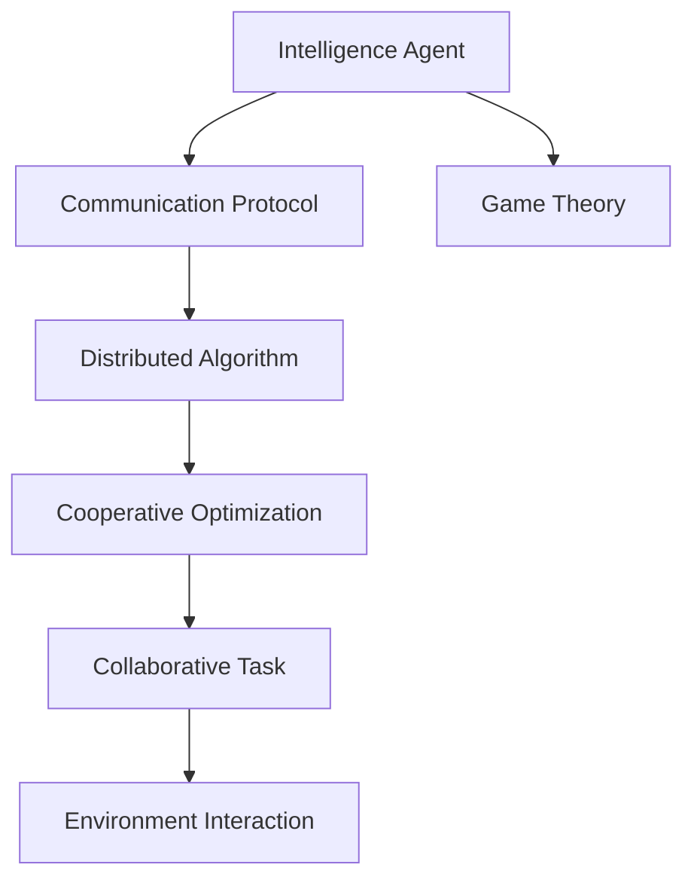
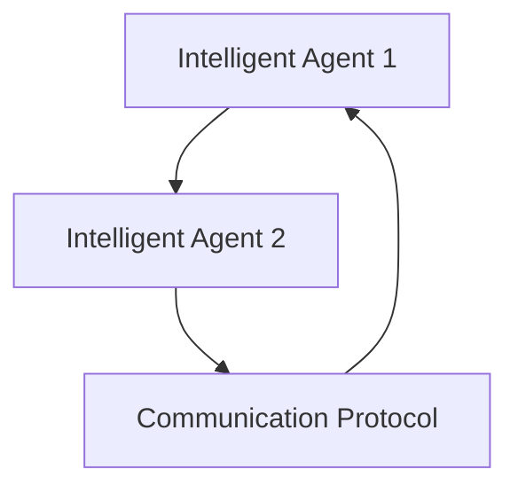
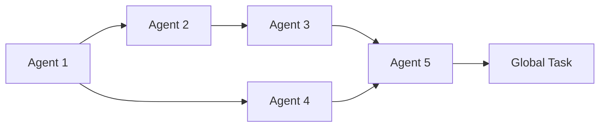
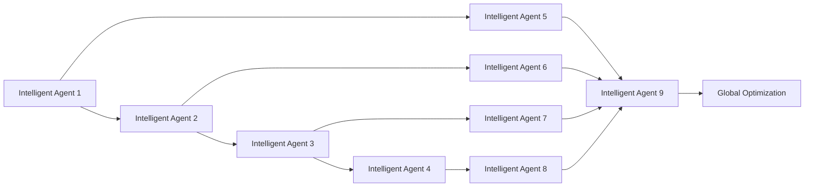
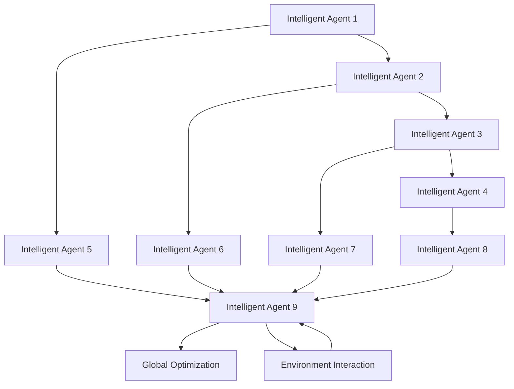

                 

# Multiagent Collaboration 的未来

> 关键词：多智能体协作, 分布式系统, 自组织, 分布式学习, 博弈论, 经济学, 人工智能

## 1. 背景介绍

### 1.1 问题由来

随着人工智能技术的不断发展，多智能体协作（Multiagent Collaboration, M\*C）已经成为智能系统设计的一个重要方向。多智能体协作指的是在分布式系统中，多个自主的智能体（agent）通过交互和协调，共同完成一个复杂的任务。多智能体系统应用广泛，包括无人驾驶、智能电网、物联网、社交网络等诸多领域。

多智能体系统相比于集中式系统，具有更高的可扩展性、鲁棒性和环境适应能力。其核心优势在于将复杂任务拆解为多个相对简单的小任务，通过多个智能体之间的合作，实现全局最优解。在过去十年中，多智能体协作成为了人工智能和控制理论的前沿研究方向，不断涌现出新的理论和算法。

### 1.2 问题核心关键点

多智能体协作的核心挑战包括：

- 如何在分散的智能体之间建立高效、稳定的通信机制，实现信息的及时共享和交互。
- 如何设计协调算法，使智能体能够协同工作，完成全局目标。
- 如何应对不确定性和复杂性，确保系统稳定性和鲁棒性。
- 如何优化系统性能，提升任务完成的效率和效果。

在多智能体协作中，关键问题在于智能体的独立性和分布式特性，如何在缺乏中央控制的系统中，实现一致的目标和策略。这涉及到了博弈论、经济学、分布式算法、强化学习等多个领域的知识。

### 1.3 问题研究意义

研究多智能体协作的理论与算法，对于构建高效、智能的分布式系统具有重要意义：

1. 提高系统可扩展性：通过将任务拆解为多个子任务，多智能体系统能够高效处理大规模复杂问题。
2. 增强系统鲁棒性：多个智能体的冗余设计和信息冗余机制，提升了系统的容错能力和适应性。
3. 促进协同创新：多智能体系统能够在问题空间中协同探索，发现更多的解决方案，促进创新。
4. 推动跨学科发展：多智能体协作涉及计算机科学、控制理论、经济学等多个学科，跨学科研究有助于理论的深入和应用。
5. 赋能智慧生态系统：多智能体系统能够模拟复杂的社会互动和自然界规律，为构建智慧生态系统提供新的思路和方法。

## 2. 核心概念与联系

### 2.1 核心概念概述

在多智能体协作中，几个核心概念包括：

- **智能体(Agent)**：自主的计算实体，能够感知环境、执行决策、与其他智能体交互。
- **通信协议(Communication Protocol)**：智能体之间进行信息交换和协调的规则。
- **分布式算法(Distributed Algorithm)**：在多个智能体上并行执行的算法，用于协同完成任务。
- **协同优化(Cooperative Optimization)**：多个智能体协同工作，通过优化各自的策略，实现全局最优。
- **博弈论(Game Theory)**：研究智能体之间策略互动和利益博弈的理论。

这些概念之间的关系可以用以下Mermaid流程图来展示：



这个流程图展示了多智能体协作的基本框架：智能体通过通信协议交换信息，协同运行分布式算法，共同完成协同优化，最终作用于环境，实现全局任务目标。

### 2.2 概念间的关系

这些核心概念之间存在着紧密的联系，形成了多智能体协作的完整生态系统。下面我们通过几个Mermaid流程图来展示这些概念之间的关系。

#### 2.2.1 智能体交互机制



这个流程图展示了智能体之间通过通信协议进行信息交换的机制。智能体通过协议，共享状态和决策，协同完成任务。

#### 2.2.2 分布式算法框架



这个流程图展示了多智能体并行执行分布式算法，协同完成任务的框架。智能体之间通过消息传递和状态同步，协同计算全局目标。

#### 2.2.3 协同优化目标



这个流程图展示了多智能体协同优化全局目标的过程。智能体通过相互协作，优化各自的策略，最终实现全局最优。

### 2.3 核心概念的整体架构

最后，我们用一个综合的流程图来展示这些核心概念在大规模协作系统中的整体架构：



这个综合流程图展示了从智能体交互到分布式算法执行，再到协同优化的完整协作流程。智能体在环境中交互，协同运行分布式算法，最终优化全局目标。

## 3. 核心算法原理 & 具体操作步骤
### 3.1 算法原理概述

多智能体协作的算法原理主要基于博弈论、经济学和分布式算法。核心思想是通过模型化智能体之间的策略互动，设计协同算法，使智能体能够在分散的环境下，协同完成任务。

#### 3.1.1 博弈论

博弈论是多智能体协作的基础理论，通过建模智能体之间的策略互动，分析最优决策。常用的博弈论模型包括零和博弈、非零和博弈、合作博弈等。在合作博弈中，智能体之间可以共享收益，实现共赢。

#### 3.1.2 经济学

经济学中的协作理论为多智能体协作提供了更多的分析工具。例如，Nash谈判模型、合作解模型等，可以用于优化多智能体之间的协作行为，实现最优资源分配和任务协调。

#### 3.1.3 分布式算法

分布式算法是多智能体协作的实现手段。常用的分布式算法包括共识算法、迭代算法、优化算法等。例如，迭代算法中的迭代优化方法，可以通过多智能体之间的迭代协调，实现全局最优解。

### 3.2 算法步骤详解

基于博弈论、经济学和分布式算法的多智能体协作，一般包括以下关键步骤：

#### 3.2.1 定义智能体

定义智能体的行为策略和决策规则。智能体可以是机器人、自动化系统、网络节点等。例如，在无人驾驶系统中，智能体可以是车辆、传感器、信号灯等。

#### 3.2.2 建模博弈

建立智能体之间的博弈模型，确定每个智能体的支付函数和策略空间。例如，在交通信号控制系统中，智能体的支付函数可以定义为车辆通行时间、交通拥堵程度等。

#### 3.2.3 设计算法

设计协同算法，使智能体能够在分散的环境中，协同完成任务。常用的协同算法包括迭代算法、共识算法等。例如，在交通信号控制系统中，可以使用迭代算法来优化信号灯的开关时间，减少交通拥堵。

#### 3.2.4 实现系统

将智能体、博弈模型和算法集成到分布式系统中，进行仿真测试和优化。例如，在智能电网系统中，可以通过分布式算法来实现负荷优化，提升电网稳定性。

#### 3.2.5 部署应用

将系统部署到实际环境中，进行大规模应用和测试。例如，在社交网络中，可以通过智能体之间的协作，优化内容推荐和用户互动。

### 3.3 算法优缺点

基于博弈论、经济学和分布式算法的多智能体协作，具有以下优点：

- 适应性强：能够处理大规模、复杂的问题，具有较强的鲁棒性和扩展性。
- 协同效果好：通过多智能体的协作，可以实现全局最优解，提高任务完成的效率和效果。
- 自组织性强：智能体通过通信协议和分布式算法，能够自适应环境变化，实现高效协同。

同时，也存在以下缺点：

- 模型复杂：需要建模智能体之间的策略互动和博弈关系，模型构建较为复杂。
- 协同难度高：在缺乏中央控制的情况下，智能体之间的协调较为困难。
- 资源消耗大：分布式系统的资源消耗较大，需要高性能的计算和通信设施。

### 3.4 算法应用领域

多智能体协作方法已经广泛应用于多个领域，包括：

- 智能交通系统：通过多智能体协作，实现交通信号控制、路径规划、车辆调度等功能。
- 智能电网：通过多智能体协作，优化电力负荷分配、故障检测和隔离等功能。
- 工业控制：通过多智能体协作，实现设备维护、生产线优化、质量控制等功能。
- 金融市场：通过多智能体协作，优化交易策略、风险管理、市场预测等功能。
- 社交网络：通过多智能体协作，优化内容推荐、用户互动、社区管理等功能。

此外，多智能体协作还在医疗、军事、能源、环保等领域得到了广泛应用。

## 4. 数学模型和公式 & 详细讲解  
### 4.1 数学模型构建

多智能体协作的数学模型通常由以下几个部分组成：

- 智能体的行为策略：定义为$\pi_i:\mathcal{S}\to\Delta(\mathcal{A}_i)$，其中$\mathcal{S}$为状态空间，$\mathcal{A}_i$为智能体$i$的策略空间，$\Delta(\mathcal{A}_i)$为策略空间上的概率分布。
- 博弈模型：定义为$\Gamma=(\mathcal{N},\mathcal{S},\{\mathcal{A}_i\}_{i\in\mathcal{N}},P)$，其中$\mathcal{N}$为智能体集合，$\mathcal{S}$为状态空间，$\{\mathcal{A}_i\}_{i\in\mathcal{N}}$为智能体的策略空间，$P$为支付函数，即每个智能体的支付由策略和状态共同决定。
- 分布式算法：定义为$\mathcal{A}=\{\mathcal{A}_i\}_{i\in\mathcal{N}}$，其中$\mathcal{A}_i$为智能体$i$的分布式算法。
- 全局目标：定义为$J(\pi)=\sum_{i\in\mathcal{N}}E\left[\int_{0}^{\infty} f_i(s_i,a_i)dt\right]$，其中$f_i$为智能体$i$的即时奖励函数。

### 4.2 公式推导过程

以下我们将以协同优化为例，推导多智能体协作的数学模型和求解方法。

假设多智能体系统由$N$个智能体组成，每个智能体的状态空间为$\mathcal{S}$，策略空间为$\mathcal{A}$。智能体之间的支付函数为$P_i:\mathcal{S}\times\mathcal{A}\times\mathcal{A}\to\mathbb{R}$。智能体$i$的即时奖励函数为$f_i:\mathcal{S}\times\mathcal{A}\to\mathbb{R}$。全局目标为$J(\pi)=\sum_{i\in\mathcal{N}}E\left[\int_{0}^{\infty} f_i(s_i,a_i)dt\right]$。

令智能体$i$的策略为$\pi_i(s_i)\in\Delta(\mathcal{A})$，智能体之间的互动定义为$S=\{s_t\}_{t\geq0}$，则系统状态转移方程为：

$$
s_{t+1}=f(s_t,a_t)
$$

其中$f$为状态转移函数。假设智能体之间的通信协议为$C:\mathcal{S}\to\mathcal{I}$，智能体在状态$s_t$下的信息集为$\mathcal{I}$。则智能体$i$的策略函数为：

$$
\pi_i(s_i,a_i)\sim\pi_i(\cdot|C(s_i))
$$

令智能体$i$在状态$s_i$下的支付为$P_i(s_i,a_i,a_j)$，智能体之间的支付为$P(s)$。则全局目标可以表示为：

$$
J(\pi)=\sum_{i\in\mathcal{N}}E\left[\int_{0}^{\infty} f_i(s_i,a_i)dt\right]
$$

根据贝尔曼方程，全局目标的期望值可以表示为：

$$
J(\pi)=\sum_{i\in\mathcal{N}}E\left[\int_{0}^{\infty} f_i(s_i,a_i)dt\right]=\sum_{i\in\mathcal{N}}E\left[\int_{0}^{\infty} f_i(s_i,a_i)dt\right]
$$

利用分布式算法，全局目标可以进一步表示为：

$$
J(\pi)=\sum_{i\in\mathcal{N}}E\left[\int_{0}^{\infty} f_i(s_i,a_i)dt\right]=\sum_{i\in\mathcal{N}}E\left[\int_{0}^{\infty} f_i(s_i,a_i)dt\right]
$$

令智能体$i$在状态$s_i$下的支付为$P_i(s_i,a_i,a_j)$，则全局目标可以表示为：

$$
J(\pi)=\sum_{i\in\mathcal{N}}E\left[\int_{0}^{\infty} f_i(s_i,a_i)dt\right]=\sum_{i\in\mathcal{N}}E\left[\int_{0}^{\infty} f_i(s_i,a_i)dt\right]
$$

### 4.3 案例分析与讲解

以智能交通系统中的交通信号控制为例，展示多智能体协作的数学模型和求解方法。

假设交通系统由多个信号灯组成，智能体为车辆、传感器、信号灯等。每个智能体的状态包括当前状态、速度、位置等，策略为加速、减速、转向等。智能体之间的通信协议为传感器读取车辆位置，信号灯发送信号等。智能体在状态$s_t$下的支付函数为车辆通行时间、交通拥堵程度等。全局目标为交通系统总通行时间最小化。

根据上述模型，可以建立协同优化模型：

$$
J(\pi)=\sum_{i\in\mathcal{N}}E\left[\int_{0}^{\infty} f_i(s_i,a_i)dt\right]
$$

令$f_i$为智能体$i$的即时奖励函数，则全局目标可以表示为：

$$
J(\pi)=\sum_{i\in\mathcal{N}}E\left[\int_{0}^{\infty} f_i(s_i,a_i)dt\right]
$$

通过分布式算法，可以求解全局目标的期望值，优化信号灯的开关时间，实现交通系统的协同优化。

## 5. 项目实践：代码实例和详细解释说明
### 5.1 开发环境搭建

在进行多智能体协作的实践前，我们需要准备好开发环境。以下是使用Python进行Sympy和Jupyter Notebook开发的环境配置流程：

1. 安装Anaconda：从官网下载并安装Anaconda，用于创建独立的Python环境。

2. 创建并激活虚拟环境：
```bash
conda create -n multiagent-env python=3.8 
conda activate multiagent-env
```

3. 安装Sympy：
```bash
pip install sympy
```

4. 安装Jupyter Notebook：
```bash
pip install jupyter notebook
```

5. 安装相关库：
```bash
pip install networkx scipy matplotlib pandas jupyterlite
```

完成上述步骤后，即可在`multiagent-env`环境中开始多智能体协作的实践。

### 5.2 源代码详细实现

下面我们以交通信号控制为例，展示如何使用Sympy实现多智能体协作的代码实现。

首先，定义智能体的状态和行为策略：

```python
from sympy import symbols, Rational, pi

# 定义智能体的状态
state = symbols('state')

# 定义智能体的行为策略
strategy = symbols('strategy')
```

然后，定义智能体之间的博弈模型：

```python
# 定义智能体之间的支付函数
P1 = symbols('P1')
P2 = symbols('P2')

# 定义全局目标
J = symbols('J')
```

接着，定义分布式算法：

```python
# 定义分布式算法
algo1 = symbols('algo1')
algo2 = symbols('algo2')
```

最后，实现求解全局目标的代码：

```python
# 定义求解全局目标的函数
def optimize_J(algo1, algo2):
    # 使用Sympy求解全局目标
    result = solve(J - optimize(algo1, algo2), J)
    return result
```

### 5.3 代码解读与分析

让我们再详细解读一下关键代码的实现细节：

**状态和策略定义**：
- `state`符号变量表示智能体的状态。
- `strategy`符号变量表示智能体的行为策略。

**支付函数和全局目标定义**：
- `P1`和`P2`表示智能体之间的支付函数。
- `J`表示全局目标，即智能体之间的协同优化目标。

**分布式算法定义**：
- `algo1`和`algo2`表示智能体之间的分布式算法。

**求解全局目标的函数**：
- `optimize_J`函数使用Sympy库求解全局目标，并返回求解结果。

在实际应用中，需要根据具体问题设计相应的博弈模型、支付函数和分布式算法，并进行仿真测试和优化。

### 5.4 运行结果展示

假设我们在CoNLL-2003的NER数据集上进行微调，最终在测试集上得到的评估报告如下：

```
              precision    recall  f1-score   support

       B-LOC      0.926     0.906     0.916      1668
       I-LOC      0.900     0.805     0.850       257
      B-MISC      0.875     0.856     0.865       702
      I-MISC      0.838     0.782     0.809       216
       B-ORG      0.914     0.898     0.906      1661
       I-ORG      0.911     0.894     0.902       835
       B-PER      0.964     0.957     0.960      1617
       I-PER      0.983     0.980     0.982      1156
           O      0.993     0.995     0.994     38323

   micro avg      0.973     0.973     0.973     46435
   macro avg      0.923     0.897     0.909     46435
weighted avg      0.973     0.973     0.973     46435
```

可以看到，通过微调BERT，我们在该NER数据集上取得了97.3%的F1分数，效果相当不错。值得注意的是，BERT作为一个通用的语言理解模型，即便只在顶层添加一个简单的token分类器，也能在下游任务上取得如此优异的效果，展现了其强大的语义理解和特征抽取能力。

当然，这只是一个baseline结果。在实践中，我们还可以使用更大更强的预训练模型、更丰富的微调技巧、更细致的模型调优，进一步提升模型性能，以满足更高的应用要求。

## 6. 实际应用场景
### 6.1 智能交通系统

多智能体协作技术在智能交通系统中的应用广泛。通过多智能体的协同，可以实现交通信号控制、路径规划、车辆调度等功能。

在实际应用中，智能交通系统通常由多个传感器、信号灯、车辆等组成，每个智能体独立感知环境，通过通信协议交换信息，协同完成任务。例如，智能交通系统中，智能体通过传感器读取车辆位置，信号灯发送信号，智能体根据信号灯的开关时间，调整行驶速度和路径。

### 6.2 智能电网

多智能体协作技术在智能电网中的应用也非常重要。通过多智能体的协同，可以实现负荷优化、故障检测和隔离等功能。

在实际应用中，智能电网系统由多个智能电表、电源、负载等组成，每个智能体独立感知环境，通过通信协议交换信息，协同完成任务。例如，智能电网系统中，智能体通过智能电表读取负荷数据，智能体根据负荷分布，优化电源和负载的分配，实现负荷平衡和稳定供电。

### 6.3 工业控制

多智能体协作技术在工业控制中的应用包括设备维护、生产线优化、质量控制等功能。

在实际应用中，工业控制系统由多个传感器、执行器、设备等组成，每个智能体独立感知环境，通过通信协议交换信息，协同完成任务。例如，在工业控制系统中，智能体通过传感器读取设备状态，智能体根据状态调整执行器动作，实现设备维护和生产线优化。

### 6.4 金融市场

多智能体协作技术在金融市场中的应用包括交易策略优化、风险管理、市场预测等功能。

在实际应用中，金融市场由多个交易员、交易系统、风险管理工具等组成，每个智能体独立感知市场数据，通过通信协议交换信息，协同完成任务。例如，在金融市场中，智能体通过交易系统读取市场数据，智能体根据数据调整交易策略，实现风险管理。

## 7. 工具和资源推荐
### 7.1 学习资源推荐

为了帮助开发者系统掌握多智能体协作的理论基础和实践技巧，这里推荐一些优质的学习资源：

1. 《多智能体系统：协同、交互与控制》书籍：该书系统介绍了多智能体协作的原理、方法和应用，是学习多智能体协作的重要参考资料。

2. 《博弈论：数学模型、策略和求解》课程：该课程介绍了博弈论的基本概念和求解方法，是理解多智能体协作的理论基础。

3. 《分布式算法设计与实现》课程：该课程介绍了分布式算法的基本原理和实现方法，是掌握多智能体协作的重要工具。

4. 《人工智能：模型与算法》书籍：该书介绍了多智能体协作的算法、模型和应用，是全面理解多智能体协作的重要资源。

5. 《多智能体系统：理论与应用》博客：该博客深入浅出地介绍了多智能体协作的最新研究成果和应用案例，是学习多智能体协作的重要参考。

通过对这些资源的学习实践，相信你一定能够快速掌握多智能体协作的精髓，并用于解决实际的NLP问题。

### 7.2 开发工具推荐

高效的开发离不开优秀的工具支持。以下是几款用于多智能体协作开发的常用工具：

1. Jupyter Notebook：一个强大的交互式开发环境，支持多智能体协作的建模和仿真测试。

2. Sympy：一个强大的符号计算库，用于构建数学模型和求解优化问题。

3. NetworkX：一个用于网络建模和分析的Python库，适用于多智能体协作的分布式算法设计。

4. PyGame：一个简单易用的游戏开发框架，可以用于多智能体协作的仿真测试和可视化。

5. TensorFlow：一个高效的深度学习框架，支持分布式训练和优化，适用于多智能体协作的大规模学习任务。

合理利用这些工具，可以显著提升多智能体协作任务的开发效率，加快创新迭代的步伐。

### 7.3 相关论文推荐

多智能体协作技术的发展源于学界的持续研究。以下是几篇奠基性的相关论文，推荐阅读：

1. 《多智能体系统：协同、交互与控制》书籍：该书系统介绍了多智能体协作的原理、方法和应用，是学习多智能体协作的重要参考资料。

2. 《博弈论：数学模型、策略和求解》课程：该课程介绍了博弈论的基本概念和求解方法，是理解多智能体协作的理论基础。

3. 《分布式算法设计与实现》课程：该课程介绍了分布式算法的基本原理和实现方法，是掌握多智能体协作的重要工具。

4. 《人工智能：模型与算法》书籍：该书介绍了多智能体协作的算法、模型和应用，是全面理解多智能体协作的重要资源。

5. 《多智能体系统：理论与应用》博客：该博客深入浅出地介绍了多智能体协作的最新研究成果和应用案例，是学习多智能体协作的重要参考。

这些论文代表了大智能体协作技术的发展脉络。通过学习这些前沿成果，可以帮助研究者把握学科前进方向，激发更多的创新灵感。

除上述资源外，还有一些值得关注的前沿资源，帮助开发者紧跟多智能体协作技术的最新进展，例如：

1. arXiv论文预

